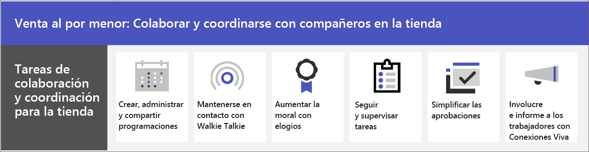

# Colaboración de equipos minoristas

Reúna a los asociados y la administración en la tienda para comunicar, colaborar y simplificar las operaciones con Microsoft Teams. Ayude a sus asociados a [conectarse a](#connect-information-from-across-the-organization-with-viva-connections) su organización con Conexiones Viva y habilite la comunicación entre las tiendas y con las oficinas centrales con las [comunidades de Yammer](#connect-across-your-organization-with-yammer-and-teams).

> [!VIDEO https://www.microsoft.com/videoplayer/embed/RWRJVw]

> [!NOTE]
> Estos escenarios también forman parte de Microsoft Cloud para el sector minorista. Puede hacer más con estos escenarios cuando también use otras funcionalidades de Microsoft Cloud for Retail, como Microsoft Dynamics 365. Obtenga más información sobre el uso de esta solución, que reúne las capacidades de Azure, Dynamics 365 y Microsoft 365 en [Microsoft Cloud para el sector minorista](/industry/retail).

## Comunicaciones diarias y colaboración en Teams

Microsoft Teams permite a los asociados de ventas, administradores y otros empleados de la tienda colaborar de forma eficiente con las aplicaciones y características de colaboración incluidas. Los empleados de primera línea pueden usar Teams en dispositivos personales o compartidos según las necesidades de su organización.

Teams incluye las siguientes formas de comunicar y compartir información:

| Tarea | Descripción | Administrar esta funcionalidad | Aprendizaje para usuarios finales |
| ---- | ---- | ---- | ---- |
| Chatear, publicar mensajes y comunicarse | Sus asociados en la tienda pueden comunicarse sin problemas entre departamentos para cumplir los pedidos, obtener ayuda para los clientes y administrar las necesidades de existencias.   Teams proporciona una experiencia de colaboración excelente para su organización y la configuración predeterminada parece funcionar para la mayoría de organizaciones. | [Chat, equipos, canales y aplicaciones en Microsoft Teams](../deploy-chat-teams-channels-microsoft-teams-landing-page.md) | [Iniciar chats](https://support.microsoft.com/office/start-and-pin-chats-a864b052-5e4b-4ccf-b046-2e26f40e21b5) y [trabajar con publicaciones y mensajes](https://support.microsoft.com/office/create-and-format-a-post-e66777da-636b-49eb-9408-b0d88b212885) |
|Llamar y reunirse con los miembros del equipo | Los administradores pueden configurar reuniones individuales o usar reuniones de canal para administrar reuniones diarias, con la potencia de las características de audio, vídeo, uso compartido de pantalla, grabación y transcripción de Teams. Por ejemplo, un administrador podría configurar una reunión de vídeo matinal con los asociados de la tienda de diferentes departamentos para comprobar su estado antes de abrir la tienda.   Tendrá que configurar las opciones de reuniones y conferencias, y habilitar una solución de voz para usar las llamadas. | [Reuniones y conferencias en Microsoft Teams](../deploy-meetings-microsoft-teams-landing-page.md) y [Planear su solución de voz de Teams](../cloud-voice-landing-page.md) | [Realizar llamadas y](https://support.microsoft.com/office/overview-of-teams-calls-425d6970-6e27-47b6-bc61-4c38fff51c4f) [Unirse a una reunión](https://support.microsoft.com/office/join-a-teams-meeting-078e9868-f1aa-4414-8bb9-ee88e9236ee4) |
|Almacenar y compartir archivos y documentos | Compartir archivos permite al personal de la tienda acceder fácilmente a información como diagramas de mercadotecnia sin tener que abandonar del piso de ventas ni obtener ayuda de un administrador. Todos los equipos vienen automáticamente con una pestaña Archivos que puede usar para almacenar y compartir documentos. Esta pestaña representa realmente una carpeta dentro de la biblioteca de documentos de sitio de grupo predeterminada en SharePoint que se crea automáticamente al crear el equipo. | [Cómo interactúan SharePoint y OneDrive con Microsoft Teams](../sharepoint-onedrive-interact.md) | [Cargar y compartir archivos](https://support.microsoft.com/office/upload-and-share-files-57b669db-678e-424e-b0a0-15d19215cb12) |

Su equipo puede usar aplicaciones en Teams para coordinar y colaborar entre sí en tareas cotidianas, como las siguientes:

| Tarea | Aplicación | Descripción | Administrar esta aplicación | Aprendizaje para usuarios finales |
| ---- | ---- | ---- | ---- | ---- |
| Crear, administrar y compartir programaciones| Turnos | Use Turnos para administrar y compartir programaciones sin problemas. Los administradores pueden crear grupos personalizados como cajeros o saludadores, asignar turnos a empleados, agregar etiquetas y saltos personalizados e incluir turnos abiertos que los empleados pueden solicitar realizar. Los empleados pueden usar Turnos para establecer su disponibilidad, ver sus programaciones, intercambiar turnos con compañeros de trabajo, y marcar la entrada y la salida. | [Administrar Turnos](/microsoftteams/expand-teams-across-your-org/shifts/manage-the-shifts-app-for-your-organization-in-teams)|[Aprendizaje en vídeo de Turnos](https://support.microsoft.com/office/what-is-shifts-f8efe6e4-ddb3-4d23-b81b-bb812296b821)|
| Permanecer en contacto | Walkie-talkie | La aplicación Walkie-talkie proporciona una comunicación instantánea entre personas. Al usar Walkie-talkie, los empleados y los administradores pueden comunicarse desde cualquier lugar de la tienda. Por ejemplo, si un cliente de un lado de la tienda le pregunta a un empleado si un artículo está disponible en el otro lado de la tienda, el empleado puede usar Walkie-talkie para ponerse en contacto con alguien que trabaja cerca del artículo. Como Walkie-talkie no tiene un alcance limitado, los empleados también pueden consultar fácilmente con expertos en otras tiendas u oficinas corporativas. | [Administrar Walkie-talkie](../walkie-talkie.md)  | [Aprendizaje en vídeo de Walkie-talkie](https://support.microsoft.com/office/use-walkie-talkie-in-teams-884a008a-761e-4b62-99f8-15671d9a2f69) |
| Aumentar la moral | Elogio | La aplicación Elogio permite a la administración y a los asociados de la tienda felicitarse entre sí y compartir su agradecimiento enviando distintivos. Elogio ayuda a los empleados a sentirse reconocidos por logros como lograr objetivos de ventas o hacer un esfuerzo adicional para ayudar a los clientes. | [Administrar la aplicación Elogio](../manage-praise-app.md) |[Aprendizaje en vídeo de Elogio](https://support.microsoft.com/office/communication-and-praise-7d37ef80-542b-42e5-aa01-0fabbaa634b6) |
| Seguir y supervisar tareas | Tasks | Use Tareas en Teams para realizar un seguimiento de las tareas pendientes de todo el equipo minorista. Los administradores y empleados de la tienda pueden crear, asignar y programar tareas, clasificarlas y actualizar su estado en cualquier momento desde cualquier dispositivo que use Teams. Los administradores y profesionales de TI también pueden publicar tareas en equipos específicos para su organización. Por ejemplo, podría publicar un conjunto de tareas para la limpieza diaria o los pasos para configurar una nueva pantalla.| [Administrar la aplicación Tasks](/microsoftteams/manage-tasks-app) |[Aprendizaje en vídeo de Tasks](https://support.microsoft.com/office/use-the-tasks-app-in-teams-e32639f3-2e07-4b62-9a8c-fd706c12c070) |
| Simplificar las aprobaciones | Aprobaciones | Use Aprobaciones para simplificar las solicitudes y los procesos con su equipo. Cree, administre y comparta aprobaciones directamente desde su centro para el trabajo en equipo. Inicie un flujo de aprobación desde el mismo sitio desde el que envía un chat, en una conversación de canal o desde la propia lista de Aprobaciones. Solo tiene que seleccionar el tipo de aprobación, agregar detalles, adjuntar archivos y elegir aprobadores. Una vez enviado, los aprobadores reciben una notificación y pueden revisar y responder a la solicitud. Puede permitir el uso de la aplicación Aprobaciones para su organización y agregarla a Teams. | [Disponibilidad de la aplicación Aprobaciones de Teams](/microsoftteams/approval-admin) | [Aprendizaje en vídeo de Aprobaciones](https://support.microsoft.com/office/what-is-approvals-a9a01c95-e0bf-4d20-9ada-f7be3fc283d3?wt.mc_id=otc_microsoft_teams)|

### Configurar equipos, canales y aplicaciones

Cuando esté listo para conectar a sus asociados minoristas en Teams, puede configurar equipos y canales para los equipos y administradores de la tienda con plantillas predefinidas o personalizadas. La forma más sencilla es empezar con una plantilla. Las [plantillas](/microsoftteams/get-started-with-retail-teams-templates) **Organizar una tienda** y **Sector minorista para administradores** son plantillas predefinidas que incluyen canales y aplicaciones diseñadas para el sector minorista. También puede crear una plantilla basada en un equipo existente. Incluso cuando empiece con una plantilla, puede personalizar el equipo y los canales y agregar más aplicaciones para adaptarlas a las necesidades de su equipo.

- Use canales con pestañas para compartir noticias, mantener a los empleados en contacto entre turnos y desarrollar una comunidad.
- Use plantillas de equipos para configurar equipos con estructuras similares (como canales y pestañas) en todas las tiendas o regiones.

#### Crear un equipo basado en una plantilla

1. En Microsoft Teams, seleccione **Unirse a un equipo o crear uno**.

2. Seleccione **Crear un equipo** y, a continuación, desplácese hacia abajo para ver las plantillas disponibles.

Más información: [Crear un equipo con plantillas](https://support.microsoft.com/office/create-a-team-with-team-templates-702a2977-e662-4038-bef5-bdf8ee47b17b)

### Administrar aplicaciones

Restrinja lo que hay en su equipo mediante aplicaciones. Puede permitir o bloquear aplicaciones para su organización, o configurar las opciones de las aplicaciones, en el centro de administración de Microsoft Teams. Para obtener más información sobre la administración de aplicaciones, vea [Administrar aplicaciones en el centro de administración de Microsoft Teams](../manage-apps.md).

Los usuarios pueden agregar las aplicaciones que haya permitido a sus equipos. Comparta este aprendizaje con los usuarios para mostrarles cómo: [Buscar y usar aplicaciones](https://support.microsoft.com/office/find-and-use-apps-6e22a734-c002-4da0-ba63-681f155b142d).

## Conectar información de toda la organización con Conexiones Viva

Interactúe con los trabajadores e infórmelos con Conexiones Viva. Conexiones Viva crea un centro en Teams en el que sus asociados minoristas pueden ver una fuente de noticias personalizada de su organización y un panel personalizado con los recursos que necesitan. Cuando los empleados usan Viva Connections, pueden obtener información importante más rápidamente, lo que significa que los administradores no tienen que dedicar tiempo valioso a retransmitir actualizaciones. Información clave, noticias personalizadas, tareas, anuncios y otros recursos de Surface en el panel de Conexiones Viva.

Obtenga más información sobre [Conexiones Viva](/sharepoint/viva-connections-overview) y ayude a sus empleados y asociados a empezar a usar [Conexiones Viva en Microsoft Teams](https://support.microsoft.com/office/your-intranet-is-now-in-microsoft-teams-8b4e7f76-f305-49a9-b6d2-09378476f95b).

Con Microsoft Teams, Conexiones Viva y SharePoint, puede habilitar estos escenarios:

- Incorporar nuevos empleados [Más información](/sharepoint/onboard-employees)
- Conectar los equipos de líderes con los trabajadores de primera línea [Más información](/sharepoint/leadership-connection)
- Distribuir noticias a su organización [Más información](/sharepoint/distribute-corporate-news-to-your-organization)

[Más información sobre cómo impulsar la comunicación en su organización](/sharepoint/corporate-communications-overview)

## Conectarse en toda la organización con Yammer y Teams

Interactúe con las comunidades de Yammer. Las comunidades de Yammer atienden las necesidades del uso compartido de conocimientos, la experiencia de los empleados, las comunicaciones de toda la empresa y la participación de los líderes proporcionando un lugar central para sus conversaciones, archivos, eventos y actualizaciones. Los asociados pueden plantear problemas, proporcionar comentarios y hacer y responder preguntas en Comunidades de Yammer. Realice eventos en directo y asambleas públicas para mantener a todos los miembros de su organización al día.

Obtenga más información sobre cómo [agregar una página de Yammer a un canal Teams](https://support.microsoft.com/office/add-a-yammer-page-to-a-teams-channel-ca06ec83-f22d-4b76-83a5-c83aa2a33528) y [unirse y crear una comunidad en Yammer](https://support.microsoft.com/office/join-and-create-a-community-in-yammer-56aaf591-1fbc-4160-ba26-0c4723c23fd6).

Más información sobre Yammer:

- Para administradores: [Administrar Yammer](/yammer)
- Para usuarios: [Usar Yammer](https://support.microsoft.com/office/what-is-yammer-1b0f3b3e-89ee-4b66-aac5-30def12f287c)
