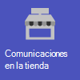
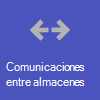
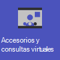
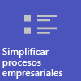
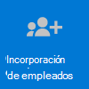

# Introducción a Teams para el comercio

Los entornos comerciales, con sus programaciones rotatorias y personal sobre la marcha, tienen necesidades muy diferentes a las de otras organizaciones. Para obtener el máximo beneficio para su organización minorista, primero elija los escenarios con los que Teams puede ayudarle en las operaciones empresariales diarias y, después, asegúrese de preparar su entorno de Teams con los aspectos básicos, los equipos y las aplicaciones adecuadas para admitir esos escenarios.

1. [Elija los escenarios](#choose-your-scenarios) que desea implementar para su empresa.
:::image type="content" source="../media/retail-teams-scenarios.png" alt-text="Diagrama que muestra los escenarios de Teams para el comercio." lightbox="../media/retail-teams-scenarios.png":::
1. [Configurar los aspectos básicos](#set-up-the-fundamentals) Apoye sus recursos con los aspectos básicos: administrar cuentas y dispositivos y asegurarse de que se aplican las directivas de Teams adecuadas. :::image type="content" source="../media/retail-teams-fundamentals.png" alt-text="Diagrama que muestra los aspectos básicos, incluidas las directivas, las cuentas y los dispositivos de Teams." lightbox="../media/retail-teams-fundamentals.png":::
1. [Configurar equipos y aplicaciones](#set-up-teams-and-apps) : use plantillas de equipo para configurar rápidamente los equipos que necesita, incluidos los canales y las aplicaciones que necesita para su empresa. Agregue otras aplicaciones de Microsoft según sea necesario para admitir sus escenarios.
:::image type="content" source="../media/retail-teams-apps.png" alt-text="Diagrama que muestra equipos, plantillas de equipo y aplicaciones que se pueden incluir." lightbox="../media/retail-teams-apps.png":::

<!-- Additional capabilities for retail environments are available with the Microsoft Cloud for Retail, which includes capabilities from Dynamics 365 and Microsoft Azure as well as the Microsoft 365 features. For more information, see [Microsoft Cloud for Retail](/industry/retail/). -->

## Elegir los escenarios

Microsoft 365 y Microsoft Teams ofrecen varias funcionalidades que pueden ayudar a las organizaciones minoristas con sus operaciones diarias y transformación digital. Se recomiendan los siguientes escenarios para las organizaciones minoristas:

     

> [!NOTE]
> Estos escenarios también forman parte de Microsoft Cloud for Retail. Puede hacer más con estos escenarios cuando también use otras funcionalidades de Microsoft Cloud for Retail, como Microsoft Dynamics 365. Obtenga más información sobre el uso de esta solución, que reúne las funcionalidades de Azure, Dynamics 365 y Microsoft 365 en [Microsoft Cloud for Retail](/industry/retail).

### Comunicación y colaboración en el almacén.

Reúna a los asociados y la administración en el almacén para colaborar y simplificar las operaciones con las aplicaciones de Teams y Teams.

**Aplicaciones clave:** Turnos, Walkie-talkie, Tareas, Aprobaciones, Chat, Elogiar, Listas, Archivos

**Servicios adicionales:** Conexiones Viva, SharePoint, Power Platform y Power Apps

Más información: [Colaboración de equipos minoristas](retail-team-collaboration.md)

### Comunicación y colaboración entre almacenes

Los miembros del personal pueden comunicarse y colaborar en varios almacenes de una región o con la sede central mediante las mismas herramientas y aplicaciones que usa en el almacén.

**Aplicaciones clave:** Turnos, Walkie-talkie, Tareas, Aprobaciones, Chat, Elogiar, Listas, Archivos

**Servicios adicionales:** Conexiones Viva, Yammer, SharePoint, Power Platform y Power Apps

Más información: [Colaboración de equipos minoristas](retail-team-collaboration.md)

### Accesorios y consultas virtuales

La aplicación Bookings en Microsoft Teams proporciona a las organizaciones una forma sencilla de programar y administrar citas virtuales para asociados y clientes. Úsela para programar citas virtuales, como experiencias virtuales de compra.

**Características y aplicaciones clave:** reuniones, Bookings

Más información: [citas virtuales con Microsoft Teams y la aplicación Bookings](bookings-virtual-visits.md)

### Simplificar procesos empresariales

Puede usar aplicaciones de Teams, Power Apps y Power BI para simplificar los procesos empresariales. Por ejemplo, puede:

- Establecer y mantener programaciones para sus empleados con Turnos.
- Realizar paseos e inventarios del almacén con Power Apps.
- Realizar un seguimiento de los indicadores clave de rendimiento (KPI) con informes de Power BI.

**Aplicaciones clave:** Turnos, Tareas, Listas, Aprobaciones

**Servicios adicionales:** Power Platform con Power Apps y Power BI

Más información: [Simplificar los procesos empresariales](retail-business-processes.md)

### Comunicaciones corporativas

La participación de los empleados contribuye de forma significativa a la satisfacción, la fidelidad y la productividad del lugar de trabajo en cualquier organización. Obtenga información sobre cómo mantener a todos informados y comprometidos con SharePoint, Teams, Yammer, Stream y Conexiones Viva.

**Servicios adicionales:** Conexiones Viva, SharePoint, Stream, Yammer

Más información: [Comunicaciones organizativas: Guías, métodos y productos](/sharepoint/corporate-communications-overview)

### Incorporación de nuevos empleados

Haga que la incorporación de nuevos empleados sea una gran experiencia fomentando un entorno de trabajo híbrido todo en uno donde los nuevos empleados puedan encontrar recursos importantes, reunirse con personas de su organización y prepararse para tener éxito en su nuevo rol.

**Aplicaciones clave:** Listas, reuniones en directo

**Servicios adicionales:** Viva Learning, SharePoint, Yammer

Más información: [Incorporar nuevos empleados](/sharepoint/onboard-employees)

> [!NOTE]
> Para todas estas funcionalidades, los usuarios deben tener una licencia adecuada. Microsoft 365 para los trabajadores de primera línea F1 y F3 o Office 365 F3, Office 365 A3, A5, E3 y E5, así como Microsoft 365 Empresa Estándar, Business Premium, A3, A5, E3 y E5 son todos compatibles. Para obtener más información sobre las licencias de Teams en general, consulte [Administrar el acceso del usuario a Teams](../user-access.md). Consulte [Opciones de licencias para personal de primera línea](../flw-licensing-options.md) para obtener más información sobre el uso de Microsoft 365 para los trabajadores de primera línea en combinación con otras licencias.

## Configurar los conceptos básicos

Cree las bases adecuadas para sus trabajadores eligiendo licencias adecuadas para ellos, administrando sus cuentas y administrando sus dispositivos para que pueda proporcionar una forma segura y compatible de realizar su trabajo.

:::image type="content" source="../media/retail-teams-fundamentals.png" alt-text="Diagrama de los fundamentos que admiten escenarios para Teams, como directivas de Teams y Cuentas y dispositivos.":::

### Licencias

El personal minorista suele ser un personal móvil: trabajadores de primera línea y administradores que no están vinculados a los equipos todo el día, a diferencia del personal corporativo. Por lo tanto, las herramientas y aplicaciones que necesitan son diferentes. Microsoft 365 para el personal de primera línea proporciona un conjunto de características adaptado a esta audiencia. Más información en [Opciones de licencias para personal de primera línea](../flw-licensing-options.md).

### Cuentas

Con un alto volumen de negocios, la capacidad de agregar y quitar cuentas rápidamente y obtener las directivas adecuadas asignadas es clave. Introducción al Asistente para incorporación de personal de primera línea en el Centro de administración de Microsoft 365. El asistente configura un equipo para el personal de primera línea y asigna licencias y paquetes de directivas a cada miembro del equipo. Para obtener más información, consulte [Usar el Asistente para la incorporación de personal de primera línea para poner en marcha a su personal de primera línea](../flw-onboarding-wizard.md).

Si tiene que agregar muchos usuarios (más de 100), puede aprovisionar rápidamente usuarios y equipos y asignar todas las directivas pertinentes con una[ implementación mediante scripts para el personal de primera línea](../flw-scripted-deployment.md).

La presencia de personal de primera línea suele ser menos predecible que el resto del personal, ya que su horario laboral normalmente no es el mismo cada día. Como administrador, puede configurar Teams con acceso basado en turnos (vista previa) para mostrar un conjunto de estados de presencia basados en turnos para que el personal de primera línea de su organización indique cuándo está dentro y fuera del turno. También puede administrar el acceso a Teams cuando el personal de primera línea está fuera del turno. Para obtener más información, vea [Administrar el acceso basado en turnos para el personal de primera línea](shifts/manage-shift-based-access-flw.md).

### Dispositivos

Dado que la fuerza de trabajo es en gran medida móvil, la administración de cuentas y dispositivos es fundamental para entornos minoristas. Debe establecer una línea base segura y compatible con dispositivos administrados para que los empleados puedan usarlos, ya sea un dispositivo compartido o un dispositivo propio de un empleado. Encontrará más información en:

- [Planear la de implementación de dispositivos de Azure Active Directory](/azure/active-directory/devices/plan-device-deployment)
- [Información general de Microsoft Intune](/mem/intune/fundamentals/what-is-intune#manage-devices)
- [Microsoft Teams para RealWear](../flw-realwear.md)

### Directivas

Asegúrese de que los asociados de ventas y otro personal de primera línea tengan el acceso adecuado a la funcionalidad de Teams mediante la configuración de los paquetes de directivas adecuados. Las directivas de Teams ayudan a controlar lo que pueden hacer los usuarios con roles específicos. Los[ paquetes de directivas de personal de primera línea y Administrador de trabajadores de primera línea](../manage-policy-packages.md#policy-packages-included-in-teams)están adaptados para que sean adecuados para el personal de primera línea, como los de los almacenes minoristas.

Teams se integra con la aplicación Turnos y Personal de primera línea, que se pueden usar para coordinar las características de turnos del personal y mucho más. Por ejemplo, en Turnos, los jefes de almacén pueden configurar y coordinar programaciones para su personal, y los empleados pueden comprobar programaciones e intercambiar turnos.

## Configurar equipos y aplicaciones

:::image type="content" source="../media/retail-teams-apps.png" alt-text="Diagrama de equipos, plantillas de equipo y aplicaciones que se pueden incluir.":::

### Aplicaciones y servicios para el comercio

Asegúrese de que sus trabajadores pueden comunicarse, colaborar y ofrecer un excelente servicio al cliente con aplicaciones como Turnos, Walkie-talkie, Tareas, Listas, Elogiar y así sucesivamente. Puede determinar qué aplicaciones están disponibles para los usuarios si las habilita en el centro de administración de Teams o incluyéndolas en una plantilla de equipo. Más información sobre [administrar aplicaciones de Teams](../manage-apps.md).

En el caso de entornos comerciales, las siguientes aplicaciones y servicios pueden ayudarle a transformar los procesos empresariales y a apoyar la comunicación:

| Aplicaciones y servicios de Teams | Descripción | Manage | Ayuda |
| ----- | ----- | ----- | ----- |
| Aprobaciones | Las aprobaciones se pueden integrar en el chat para que se pueda cerrar la sesión fácilmente. | [Administrar aprobaciones](../approval-admin.md) | [Usar aprobaciones](https://support.microsoft.com/office/what-is-approvals-a9a01c95-e0bf-4d20-9ada-f7be3fc283d3) |
| Chat | Habilite conversaciones rápidas e inserciones entre el personal con herramientas de comunicaciones seguras de nivel empresarial, en lugar de aplicaciones de nivel de consumidor o SMS. | [Chat, equipos, canales y aplicaciones en Microsoft Teams](../deploy-chat-teams-channels-microsoft-teams-landing-page.md) | [Chatear en Teams](https://support.microsoft.com/office/start-and-pin-chats-a864b052-5e4b-4ccf-b046-2e26f40e21b5?wt.mc_id=otc_microsoft_teams) |
| Documentos | Comparta procedimientos operativos estándar, directivas de almacenamiento, planes y mucho más. | [Cómo SharePoint y OneDrive interactúan con Microsoft Teams](../sharepoint-onedrive-interact.md) | [Compartir archivos](https://support.microsoft.com/office/upload-and-share-files-57b669db-678e-424e-b0a0-15d19215cb12) |
| Elogiar | Reconozca a sus compañeros de trabajo por su excelente trabajo en equipo con la aplicación Elogiar. | [Administrar la aplicación Elogiar](../manage-praise-app.md) | [Enviar Elogiar a personas](https://support.microsoft.com/office/send-praise-to-people-50f26b47-565f-40fe-8642-5ca2a5ed261e) |
| Dispositivos RealWear | Comunicación manos libres con dispositivos. | [Microsoft Teams para RealWear](../flw-realwear.md) | [Usar Microsoft Teams para RealWear](https://support.microsoft.com/office/using-microsoft-teams-for-realwear-af20d232-d18c-476f-8031-843a4edccd5f) |
| Turnos | Administre las programaciones y el reloj de entrada y salida con Turnos. | [Administrar Turnos](shifts-for-teams-landing-page.md) | [Usar Turnos](https://support.microsoft.com/office/what-is-shifts-f8efe6e4-ddb3-4d23-b81b-bb812296b821) |
| Tareas | Ayude a los empleados a saber en qué deben centrarse cuando no están con los clientes asignándoles tareas. Las operaciones pueden usar [la publicación de tareas](../manage-tasks-app.md#task-publishing) para enviar tareas a ubicaciones y realizar un seguimiento del progreso en esas ubicaciones. | [Administrar la aplicación Tareas](../manage-tasks-app.md) | [Usar Tareas](https://support.microsoft.com/office/use-the-tasks-app-in-teams-e32639f3-2e07-4b62-9a8c-fd706c12c070) |
| Walkie-talkie | Presione para mantener una comunicación rápida que no esté restringida por la geografía, como las radios estándar de dos vías.| [Administrar la aplicación Walkie-talkie](../walkie-talkie.md) | [Usar Walkie-talkie](https://support.microsoft.com/office/get-started-with-teams-walkie-talkie-25bdc3d5-bbb2-41b7-89bf-650fae0c8e0c) |

| Más aplicaciones y servicios de Microsoft | Descripción | Manage | Ayuda |
| ----- | ----- | ----- | ----- |
| Bookings | Habilitar las consultas y los accesorios virtuales. | [Citas virtuales con Microsoft Teams y la aplicación Bookings](bookings-virtual-visits.md) | [Usar Bookings](https://support.microsoft.com/en-us/office/what-is-bookings-42d4e852-8e99-4d8f-9b70-d7fc93973cb5) |
| Power Apps y Power Platform | Integre procesos empresariales y habilite actualizaciones rápidas de datos, como inventario de almacén, números de ventas, informes de incidentes y mucho más. | [integración de Teams con Microsoft Power Platform](/microsoftteams/platform/samples/teams-low-code-solutions) y [Administrar aplicaciones de Microsoft Power Platform en el Centro de administración de Microsoft Teams](../manage-power-platform-apps.md) | -  |
| SharePoint | Al crear un nuevo equipo, se crea un nuevo sitio de SharePoint y se conecta al equipo. Muchos de los escenarios anteriores se basan en características de SharePoint ya insertadas en Teams, como compartir documentos para la colaboración en equipo. | [Integración de Teams y SharePoint](/sharepoint/teams-connected-sites) | [Agregar una página, lista o biblioteca de documentos de SharePoint como una pestaña en Teams](https://support.microsoft.com/office/add-a-sharepoint-page-list-or-document-library-as-a-tab-in-teams-131edef1-455f-4c67-a8ce-efa2ebf25f0b)|
| Conexiones Viva | Conexiones Viva crea un centro en Teams en el que los asociados comerciales pueden ver una fuente de noticias personalizada de su organización y un panel personalizado con los recursos que necesitan. | [Información general sobre Conexiones Viva](/sharepoint/viva-connections-overview) | [Conexiones Viva en Microsoft Teams](https://support.microsoft.com/office/your-intranet-is-now-in-microsoft-teams-8b4e7f76-f305-49a9-b6d2-09378476f95b) |
| Aprendizaje Viva | Proporcionar aprendizaje cuando sea necesario, directamente en el flujo de su trabajo. | [Administrar Aprendizaje Viva](/microsoft-365/learning/) | [Usar Aprendizaje Viva (vista previa)](https://support.microsoft.com/office/viva-learning-preview-01bfed12-c327-41e0-a68f-7fa527dcc98a) |
| Yammer | Conectar su organización y permitir la comunicación entre departamentos y regiones con Yammer. | [Administrar Yammer](/yammer) | [Use Yammer](https://support.microsoft.com/office/what-is-yammer-1b0f3b3e-89ee-4b66-aac5-30def12f287c) |

### Usar plantillas para configurar equipos

Cree equipos que incluyan un conjunto predefinido de opciones de configuración, canales, pestañas y aplicaciones preinstaladas para la comunicación y la colaboración dentro de un almacén individual, con una región o entre la sede central y su personal dondequiera que estén.

- La plantilla **Organiza un almacén** incluye canales para General, Cambio de turno, Preparación del almacén y Aprendizaje, e incluye las aplicaciones Aprobaciones, Tareas y Wiki.
- La plantilla **Retail for Managers** incluye canales para General, Operaciones y Aprendizaje, e incluye una pestaña de Wiki.

También puede[ crear una plantilla personalizada ](../create-a-team-template.md)para incluir las aplicaciones que necesita su almacén. Más información: [Introducción a las plantillas de equipo de Retail](../get-started-with-retail-teams-templates.md)

Además de las plantillas de equipo, también puede configurar otros sitios y servicios para ayudar con la comunicación: sitios de SharePoint y Conexiones Viva.

- Configure sitios de SharePoint para crear una página principal para su organización, distribuir noticias en toda la empresa y proporcionar un lugar con recursos para la incorporación de usuarios. Obtenga más información sobre el uso de sitios de SharePoint para escenarios de comunicaciones corporativas en [Comunicaciones organizativas: guía, métodos y productos](/sharepoint/corporate-communications-overview).
- Use Conexiones Viva para reunirlo todo. Con Conexiones Viva como la Página principal de su empleado en Teams, puede obtener actualizaciones sobre sus tareas, noticias de la organización y mucho más. Para obtener más información, vea [Información general: Conexiones Viva (versión preliminar)](/viva/connections/viva-connections-overview) y [Agregar la aplicación Conexiones Viva en el Centro de administración de Teams (versión preliminar)](/viva/connections/add-viva-connections-app).

## Prepárese para implementar sus escenarios: identificación de roles y responsabilidades para escenarios

Ahora que sabe qué escenarios quiere implementar y qué necesita para admitirlos, puede reunir a su equipo para que pueda planear, implementar y supervisar cómo funcionan en su organización. Por ejemplo, es posible que se necesiten los siguientes roles para implementar estos escenarios en su organización:

| Imagen | Rol | Responsabilidades | Departamento |
| ---- | ---- | ----- | ----- |
| | Administrador de TI | Trabaje con el personal de operaciones y administración de comercio para definir escenarios y cómo funcionarán para la organización.   Configure las opciones en el Centro de administración de Teams, como directivas y plantillas, y habilite las aplicaciones.   Configure los valores de la aplicación (como la configuración global de Turnos) para la organización.   Agregar y licenciar usuarios.  | Departamento de TI |
|| Personal de Operaciones | Trabaje con los Administradores para definir escenarios y determinar qué configuraciones, directivas, plantillas y aplicaciones son necesarias para Teams.   Cree equipos regionales o de división a partir de plantillas.   Configure tareas, listas y flujos de aprobación para la coordinación entre los almacenes de una región o entre los almacenes y las oficinas centrales.   Configurar el marco de aprendizaje para el personal. | Operaciones centrales |
| | Administrador del almacén | Trabaje con Administradores y personal de Operaciones para definir escenarios.   Crear equipos para el almacén a partir de plantillas.   Configure canales y aplicaciones para los equipos, según sea necesario. Por ejemplo: un canal para entregas de turnos.   Configure las programaciones del almacén en Turnos.   Configure tareas, listas y flujos de aprobación específicos del almacén.   Configurar tareas de aprendizaje para el personal. | Administración del almacén |

Para obtener más información sobre cómo implementar y adoptar correctamente Teams, vea [Adoptar Microsoft Teams](../adopt-microsoft-teams-landing-page.md).
