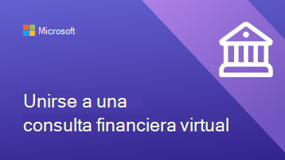
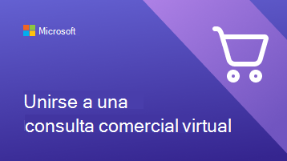
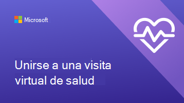
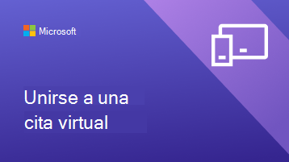

# Ayudar a sus clientes y clientes a usar citas virtuales

Ahora que su organización ha empezado a usar Microsoft Teams y la aplicación Bookings para citas virtuales, tendrá que asegurarse de que sus clientes y clientes comprenden cómo reservar y unirse a estas citas.

Vea este vídeo para obtener información general rápida sobre lo que las citas virtuales pueden hacer para su organización.

> [!VIDEO https://www.microsoft.com/videoplayer/embed/RE4TQop]

## Qué se incluye en este kit de herramientas

Este kit de herramientas está diseñado para ayudarle a ayudar a sus clientes a unirse correctamente a una cita virtual. Puede personalizar los recursos que proporcionamos e incluir vínculos a ellos en sus comunicaciones sobre citas virtuales. Este kit de herramientas incluye:

[Instrucciones para su sitio web](#guidance-for-your-website):   Preguntas más frecuentes sobre citas virtuales que puede personalizar y hospedar en su sitio web. Asegúrese de agregar sus propios vínculos y cualquier información adicional que sus clientes necesiten conocer sobre las directivas.

[Recursos para su equipo](#resources-for-your-team):   Artículos y vídeos para ayudar a su equipo a sentirse más cómodo dirigiendo citas virtuales.

[Recursos para sus clientes](#resources-for-your-clients):  
Un vínculo al contenido de soporte técnico de Microsoft, que incluye un vídeo sobre cómo unirse a una cita virtual. 
Infografías que puede personalizar para su organización.

## Instrucciones para su sitio web

Permita que sus clientes sepan qué esperar con las citas virtuales respondiendo a preguntas comunes. Todo lo que necesita hacer es editar esta&A para alinearla con las directivas de citas virtuales y pegarla en su sitio web.

### Conceptos básicos de citas virtuales

**¿Qué es una cita virtual?**

Una cita virtual es una cita en línea que se lleva a cabo a través de Microsoft Teams. Hablará uno a uno con uno de nuestros miembros del personal, como lo haría para una visita en persona.

**¿En qué se diferencian las citas virtuales de las visitas en persona?**

Informe a sus clientes de si hay diferencias en los servicios que proporciona de forma virtual y en persona. También puede describir las diferencias de tarifas entre las citas virtuales y en persona.

**¿Cómo funciona una cita virtual?**

Cuando te unas desde el vínculo de la confirmación por correo electrónico, entrarás en una sala de espera virtual. Una vez que un miembro del personal se una a la llamada, entrará con ellos en una sala virtual donde tendrá lugar su visita individual.

**¿Cómo funciona el pago de citas virtuales?**

Informa a tus clientes de si aceptas diferentes tipos de pago para Citas virtuales.

### Reservar una cita

**Cómo concertar una cita?**

Vínculo a la página de reservas de su organización. Informe a sus clientes de si hay formas alternativas de realizar citas virtuales, como por teléfono, por correo electrónico o a través de las redes sociales.

**Quién puedo concertar una cita?**

Asegúrese de que sus clientes pueden mantener relaciones con sus proveedores preferidos compartiendo lo que, si procede, el personal está operando exclusivamente de forma virtual o en persona.

**Cómo cancelar o reprogramar una cita virtual?**

Puede vincular a la directiva de cancelación y reprogramación de su organización aquí, o bien describir las diferencias en la directiva entre las citas virtuales y en persona.

### Tecnología

**¿Qué equipo necesito para una cita virtual?**

Los clientes pueden unirse a una cita virtual desde cualquier explorador web o a través de la aplicación Microsoft Teams. Liste aquí si su organización tiene especificaciones adicionales, como una cámara web o un micrófono de alta calidad. Si su organización sanitaria cuenta con EHR integrado en los equipos, los pacientes pueden unirse a las visitas desde su portal de atención médica.

**Cómo unirse a una cita virtual?**

Puede vincular a sus clientes aquí Únase a una cita de Bookings como asistente (microsoft.com) para mostrarles un vídeo detallado y un proceso paso a paso sobre cómo unirse a una cita.

## Recursos para su equipo

Aprovechar al máximo las citas virtuales asegurándose de que los miembros del personal sepan cómo realizarlas. Puede compartir estos artículos y vídeos con los miembros del equipo para ayudarles a comprender mejor las citas virtuales.

- [Aprende a usar la aplicación Bookings en Teams](https://support.microsoft.com/office/what-is-bookings-42d4e852-8e99-4d8f-9b70-d7fc93973cb5)
- [Obtenga información sobre cómo unirse a una cita de Bookings](https://support.microsoft.com/office/join-a-bookings-appointment-attendees-3deb7bde-3ea3-4b41-8a06-741ad0db9fc0)
- [Realizar una visita virtual](/microsoftteams/expand-teams-across-your-org/bookings-virtual-visits#conduct-a-visit)
- [Ver un vídeo sobre citas virtuales](#help-your-clients-and-customers-use-virtual-appointments)

## Recursos para sus clientes

Puede vincular a este artículo para mostrar a los clientes cómo unirse a citas virtuales:  
[Obtener información sobre cómo unirse a una cita virtual](https://support.microsoft.com/office/join-a-bookings-appointment-as-an-attendee-95cea12d-2220-421f-a663-6efb20913c7f)

Descargue y [personalice](#customize-your-infographic) una de estas infografías para destacar en su sitio web. Estos ofrecen a sus clientes una forma rápida y visualmente atractiva de comprender cómo funcionan las citas virtuales con su organización.

| Gráfico                | Descripción y vínculos              |
| :------------------- | -------------------: |
|  | Infografía personalizable para su organización de servicios financieros   [Descargar como PDF](//download.microsoft.com/download/8/5/7/85784cd8-6945-4fcc-a3c3-972bd88d3fef/VirtualVisit_Financial_Infographic.pdf)   [Descargar como PowerPoint](//download.microsoft.com/download/8/5/7/85784cd8-6945-4fcc-a3c3-972bd88d3fef/VirtualVisit_Financial_Infographic.pptx)
|  | Infografía personalizable para su organización comercial   [Descargar como PDF](//download.microsoft.com/download/a/b/5/ab5c07d9-cf7a-47b3-ba54-05a8a0a2a1bd/VirtualVisit_Retail_Infographic.pdf)   [Descargar como PowerPoint](//download.microsoft.com/download/a/b/5/ab5c07d9-cf7a-47b3-ba54-05a8a0a2a1bd/VirtualVisit_Retail_Infographic.pptx) |
|  | Infografía personalizable para su organización sanitaria   [Descargar como PDF](//download.microsoft.com/download/4/d/3/4d3d9c53-0304-4aea-a56a-60a16402c58f/VirtualVisit_Healthcare_Infographic.pdf)   [Descargar como PowerPoint](//download.microsoft.com/download/4/d/3/4d3d9c53-0304-4aea-a56a-60a16402c58f/VirtualVisit_Healthcare_Infographic.pptx) |
|  | Infografía personalizable no específica de un sector en particular   [Descargar como PDF](//download.microsoft.com/download/c/6/9/c69d3f29-a8f5-462b-a645-79119beab406/VirtualVisit_Generic_Infographic.pdf)   [Descargar como PowerPoint](//download.microsoft.com/download/c/6/9/c69d3f29-a8f5-462b-a645-79119beab406/VirtualVisit_Generic_Infographic.pptx) |

### Personalizar la infografía

1. Elija una de las tres infografías predefinidas según las necesidades de su organización:
    1. Atención sanitaria
    2. Servicios financieros
    3. Venta al por menor

2. Personalice la infografía en PowerPoint.
    1. Use los colores y las fuentes preferidas de su organización.
    2. Agregue el logotipo o las imágenes con marca de su organización.
    3. Vínculo a páginas de su sitio web, como su página de reservas, información de facturación o página principal.
    4. Agregue cualquier información adicional que sus clientes necesiten conocer antes de unirse a una cita virtual.

3. Exporte la infografía personalizada como PDF.
