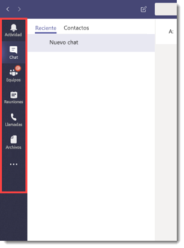
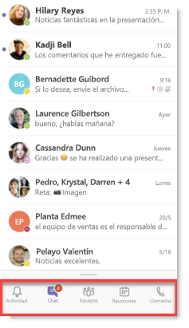
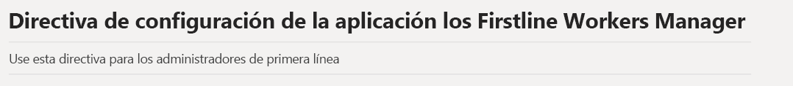
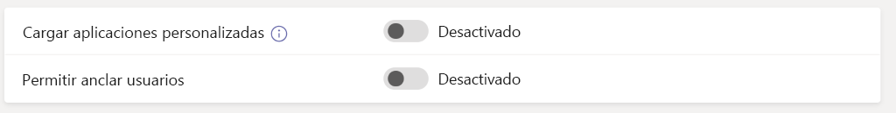
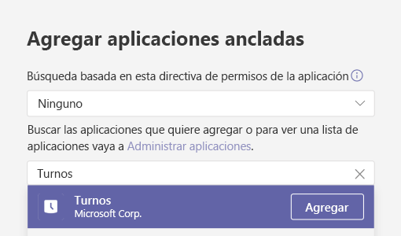
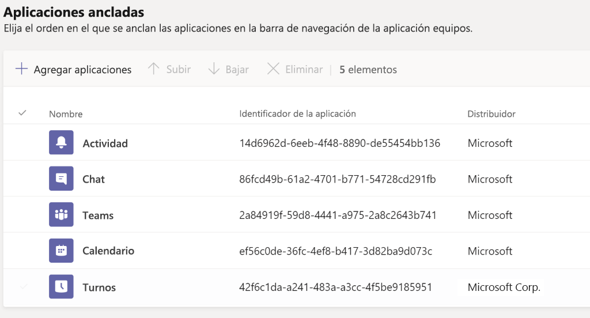
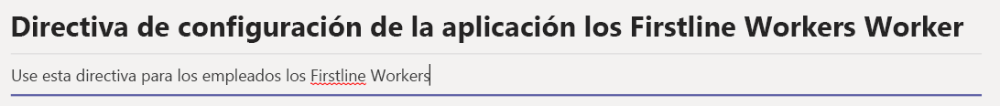
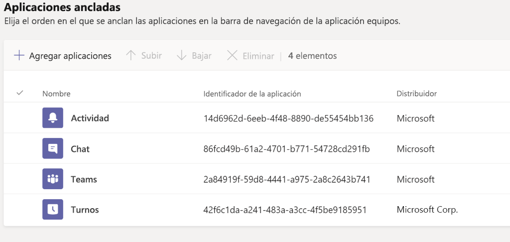
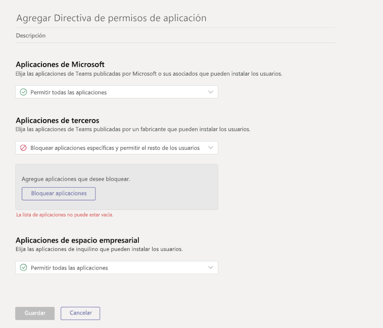

# <a name="how-to-provision-teams-at-scale-for-firstline-workers"></a><span data-ttu-id="8d2ae-103">Cómo proporcionar Teams a escala para Firstline Workers</span><span class="sxs-lookup"><span data-stu-id="8d2ae-103">How to provision Teams at scale for Firstline Workers</span></span>

<span data-ttu-id="8d2ae-104">¿Necesita incorporar rápidamente un gran número de usuarios a Microsoft Teams y configurar una experiencia optimizada para ellos?</span><span class="sxs-lookup"><span data-stu-id="8d2ae-104">Do you need to rapidly onboard a large number of users to Microsoft Teams and configure a streamlined experience for them?</span></span> <span data-ttu-id="8d2ae-105">Puede aprovisionar rápidamente identidades, aprovisionar equipos y asignar todas las directivas relevantes para controlar la experiencia de usuario final siguiendo las siguientes instrucciones.</span><span class="sxs-lookup"><span data-stu-id="8d2ae-105">You can quickly provision identities, provision teams, and assign all relevant policies to control the end user experience by walking through the following instructions.</span></span>

<span data-ttu-id="8d2ae-106">En este tutorial, aprenderá cómo hacerlo:</span><span class="sxs-lookup"><span data-stu-id="8d2ae-106">In this walkthrough, you'll learn how to:</span></span>

- <span data-ttu-id="8d2ae-107">Cree un gran número de usuarios.</span><span class="sxs-lookup"><span data-stu-id="8d2ae-107">Create a large number of users.</span></span>
- <span data-ttu-id="8d2ae-108">Cree un gran número de equipos y configure los canales adecuados.</span><span class="sxs-lookup"><span data-stu-id="8d2ae-108">Create a large number of teams and set up the appropriate channels.</span></span>
- <span data-ttu-id="8d2ae-109">Asignar licencias a escala.</span><span class="sxs-lookup"><span data-stu-id="8d2ae-109">Assign licensing at scale.</span></span>
- <span data-ttu-id="8d2ae-110">Cree directivas de mensajería, directivas de configuración de aplicaciones y directivas de permisos de aplicación apropiados.</span><span class="sxs-lookup"><span data-stu-id="8d2ae-110">Create appropriate Teams Messaging Policies, App Setup Policies, and App Permission Policies.</span></span>
- <span data-ttu-id="8d2ae-111">Aplique estas directivas a los usuarios en escala.</span><span class="sxs-lookup"><span data-stu-id="8d2ae-111">Apply those policies to users at scale.</span></span>
- <span data-ttu-id="8d2ae-112">Asigne un gran número de usuarios a un equipo designado.</span><span class="sxs-lookup"><span data-stu-id="8d2ae-112">Assign a large number of users into a designated team.</span></span>

> [!NOTE]
> <span data-ttu-id="8d2ae-113">Si ha revisado esta información y siente que necesita ayuda o tiene algunas preguntas, puede [**hacer clic aquí**](https://forms.office.com/Pages/ResponsePage.aspx?id=v4j5cvGGr0GRqy180BHbRyMDv-1voW9MqL7zkQ11DzBUREZaU1E0WEk5T0NYS0NDSkFMSDROUUdYMC4u) para ponerse en contacto con el servicio de guante blanco.</span><span class="sxs-lookup"><span data-stu-id="8d2ae-113">If you've reviewed this information and feel like you need some help or have some questions, you can [**click here**](https://forms.office.com/Pages/ResponsePage.aspx?id=v4j5cvGGr0GRqy180BHbRyMDv-1voW9MqL7zkQ11DzBUREZaU1E0WEk5T0NYS0NDSkFMSDROUUdYMC4u) to reach out for White Glove Support.</span></span>

## <a name="prerequisites"></a><span data-ttu-id="8d2ae-114">Requisitos previos</span><span class="sxs-lookup"><span data-stu-id="8d2ae-114">Prerequisites</span></span>

<span data-ttu-id="8d2ae-115">Descargue los recursos desde [esta ubicación](https://aka.ms/flwteamsscale).</span><span class="sxs-lookup"><span data-stu-id="8d2ae-115">Download the assets from [this location](https://aka.ms/flwteamsscale).</span></span>

> [!IMPORTANT]
> <span data-ttu-id="8d2ae-116">Los scripts que se incluyen en el vínculo presentado anteriormente se proporcionan en Microsoft y deben modificarse para sus necesidades individuales.</span><span class="sxs-lookup"><span data-stu-id="8d2ae-116">The scripts in the link provided above are provided as-is by Microsoft, and must be modified for your individual needs.</span></span>

## <a name="technical-requirements"></a><span data-ttu-id="8d2ae-117">Requisitos técnicos</span><span class="sxs-lookup"><span data-stu-id="8d2ae-117">Technical requirements</span></span>

- <span data-ttu-id="8d2ae-118">Su inquilino debe tener disponible el número de licencias apropiado, incluyendo Microsoft Teams.</span><span class="sxs-lookup"><span data-stu-id="8d2ae-118">Your tenant must have the appropriate number of licenses available that include Microsoft Teams.</span></span> <span data-ttu-id="8d2ae-119">Si aún no tiene estas licencias, siga las instrucciones que se indican aquí para activar la [Prueba gratuita de Office 365 E1](e1-trial-license.md).</span><span class="sxs-lookup"><span data-stu-id="8d2ae-119">If you do not already have these licenses, follow the instructions here to activate the [Office 365 E1 Free Trial](e1-trial-license.md).</span></span>
- <span data-ttu-id="8d2ae-120">El usuario que lleve a cabo estos pasos debe tener asignados estos roles en Azure AD: administrador global, administrador de usuarios y administrador de servicios de Teams.</span><span class="sxs-lookup"><span data-stu-id="8d2ae-120">The user taking these steps must have these roles assigned: Global Admin, User Admin, and Teams Service Admin, in Azure AD.</span></span>
- <span data-ttu-id="8d2ae-121">El usuario debe tener los permisos para instalar y configurar el software en su equipo local.</span><span class="sxs-lookup"><span data-stu-id="8d2ae-121">User must have the rights to install and configure software on their local machine.</span></span>

## <a name="step-by-step-process-overview"></a><span data-ttu-id="8d2ae-122">Información general del proceso paso a paso</span><span class="sxs-lookup"><span data-stu-id="8d2ae-122">Step-by-step process overview</span></span>

1. <span data-ttu-id="8d2ae-123">**Configurar su entorno**</span><span class="sxs-lookup"><span data-stu-id="8d2ae-123">**Set up Your Environment**</span></span>
    1. <span data-ttu-id="8d2ae-124">Descargue desde el repositorio de GitHub que contiene los scripts y la documentación de PowerShell de muestra</span><span class="sxs-lookup"><span data-stu-id="8d2ae-124">Download from the GitHub repository containing the sample PowerShell scripts and documentation</span></span>
    1. <span data-ttu-id="8d2ae-125">Configure el entorno local</span><span class="sxs-lookup"><span data-stu-id="8d2ae-125">Configure the local environment</span></span>
    1. <span data-ttu-id="8d2ae-126">Configure las credenciales</span><span class="sxs-lookup"><span data-stu-id="8d2ae-126">Setup credentials</span></span>
    1. <span data-ttu-id="8d2ae-127">Configure los Módulos de PowerShell y las variables de entorno</span><span class="sxs-lookup"><span data-stu-id="8d2ae-127">Configure PowerShell Modules and environmental variables</span></span>
1. <span data-ttu-id="8d2ae-128">**Crear y configurar equipos**</span><span class="sxs-lookup"><span data-stu-id="8d2ae-128">**Create and Setup Teams**</span></span>
    1. <span data-ttu-id="8d2ae-129">Crear equipos</span><span class="sxs-lookup"><span data-stu-id="8d2ae-129">Create teams</span></span>
    1. <span data-ttu-id="8d2ae-130">Pasos para crear un equipo</span><span class="sxs-lookup"><span data-stu-id="8d2ae-130">Steps to create teams</span></span>
    1. <span data-ttu-id="8d2ae-131">Cree canales para los equipos</span><span class="sxs-lookup"><span data-stu-id="8d2ae-131">Create channels for teams</span></span>
1. <span data-ttu-id="8d2ae-132">**Crear directivas de Teams**</span><span class="sxs-lookup"><span data-stu-id="8d2ae-132">**Create Teams Policies**</span></span>
    1. <span data-ttu-id="8d2ae-133">Cree directivas de mensajería de Teams</span><span class="sxs-lookup"><span data-stu-id="8d2ae-133">Create Teams message policies</span></span>
    1. <span data-ttu-id="8d2ae-134">Cree directivas de configuración de la aplicación Teams</span><span class="sxs-lookup"><span data-stu-id="8d2ae-134">Create Teams app setup policies</span></span>
    1. <span data-ttu-id="8d2ae-135">Cree directivas de permisos de aplicación de Teams</span><span class="sxs-lookup"><span data-stu-id="8d2ae-135">Create Teams app permission policies</span></span>
1. <span data-ttu-id="8d2ae-136">**Usuarios y grupos de seguridad**</span><span class="sxs-lookup"><span data-stu-id="8d2ae-136">**Users and Security Groups**</span></span>
    1. <span data-ttu-id="8d2ae-137">Cree usuarios y grupos de seguridad</span><span class="sxs-lookup"><span data-stu-id="8d2ae-137">Create users and security groups</span></span>
    1. <span data-ttu-id="8d2ae-138">Asigne licencias a los usuarios a través de las licencias basadas en grupos</span><span class="sxs-lookup"><span data-stu-id="8d2ae-138">Assign licensing to users via group-based licensing</span></span>
1. <span data-ttu-id="8d2ae-139">**Asignar usuarios y directivas**</span><span class="sxs-lookup"><span data-stu-id="8d2ae-139">**Assign Users and Policies**</span></span>
    1. <span data-ttu-id="8d2ae-140">Asigne usuarios a Teams</span><span class="sxs-lookup"><span data-stu-id="8d2ae-140">Assign users to Teams</span></span>
    1. <span data-ttu-id="8d2ae-141">Asigne las directivas de Teams a los usuarios</span><span class="sxs-lookup"><span data-stu-id="8d2ae-141">Assign Teams policies to users</span></span>
    1. <span data-ttu-id="8d2ae-142">OPCIONAL: convertir el tipo de pertenencia del grupo</span><span class="sxs-lookup"><span data-stu-id="8d2ae-142">OPTIONAL: Convert group membership type</span></span>
1. <span data-ttu-id="8d2ae-143">**Probar y validar**</span><span class="sxs-lookup"><span data-stu-id="8d2ae-143">**Test and Validate**</span></span>
    1. <span data-ttu-id="8d2ae-144">Inicie sesión en Teams con un usuario de prueba</span><span class="sxs-lookup"><span data-stu-id="8d2ae-144">Login to Teams with a test user</span></span>
    1. <span data-ttu-id="8d2ae-145">Compruebe si hay errores</span><span class="sxs-lookup"><span data-stu-id="8d2ae-145">Check for errors</span></span>
    1. <span data-ttu-id="8d2ae-146">Control de errores</span><span class="sxs-lookup"><span data-stu-id="8d2ae-146">Error handling</span></span>
1. <span data-ttu-id="8d2ae-147">**Lecturas adicionales**</span><span class="sxs-lookup"><span data-stu-id="8d2ae-147">**Further reading**</span></span>

## <a name="set-up-your-environment"></a><span data-ttu-id="8d2ae-148">Configure su entorno</span><span class="sxs-lookup"><span data-stu-id="8d2ae-148">Set up your environment</span></span>

<span data-ttu-id="8d2ae-149">Los siguientes pasos le permitirán configurar su entorno:</span><span class="sxs-lookup"><span data-stu-id="8d2ae-149">The following steps will allow you to set up your environment:</span></span>

### <a name="download-from-the-github-repository-containing-sample-powershell-scripts-and-documentation"></a><span data-ttu-id="8d2ae-150">Descargue desde el repositorio de GitHub que contiene los scripts de PowerShell y la documentación de muestra</span><span class="sxs-lookup"><span data-stu-id="8d2ae-150">Download from the GitHub repository containing sample PowerShell scripts and documentation</span></span>

<span data-ttu-id="8d2ae-151">Para poder continuar, necesitará descargar los scripts en [esta ubicación](https://aka.ms/flwteamsscale).</span><span class="sxs-lookup"><span data-stu-id="8d2ae-151">Before you can proceed, you'll need to download the scripts at [this location](https://aka.ms/flwteamsscale).</span></span>

### <a name="configure-the-local-environment"></a><span data-ttu-id="8d2ae-152">Configure el entorno local</span><span class="sxs-lookup"><span data-stu-id="8d2ae-152">Configure the local environment</span></span>

<span data-ttu-id="8d2ae-153">Establecer las variables de entorno locales permite que los scripts a los que se hace referencia aquí se ejecuten usando rutas de acceso relativas.</span><span class="sxs-lookup"><span data-stu-id="8d2ae-153">Setting the local environment variables allows the scripts referenced here to be run using relative paths.</span></span> <span data-ttu-id="8d2ae-154">RootPath es la raíz de donde se clona este repositorio y el tenantName está en la forma **yourTenant.onmicrosoft.com** (no se debe incluir https).</span><span class="sxs-lookup"><span data-stu-id="8d2ae-154">The rootPath is the root of where you cloned this repository, and the tenantName is in the form **yourTenant.onmicrosoft.com** (https should not be included).</span></span>

1. <span data-ttu-id="8d2ae-155">Abra una sesión de PowerShell y vaya a la carpeta de scripts dentro del repositorio git clonado.</span><span class="sxs-lookup"><span data-stu-id="8d2ae-155">Open a PowerShell session and navigate to the scripts folder inside the cloned git repo.</span></span>
1. <span data-ttu-id="8d2ae-156">Ejecute el script .\SetConfig.ps1 -tenantName [su nombre de espacio empresarial] -rootPath "ruta de acceso completa a la raíz del repositorio git".</span><span class="sxs-lookup"><span data-stu-id="8d2ae-156">Run the script .\SetConfig.ps1 -tenantName [your tenant name] -rootPath "full path to the root of the git repo".</span></span>

<span data-ttu-id="8d2ae-157">Por ejemplo: .\SetConfig.ps1 -tenantName contoso.onmicrosoft.com -rootPath "C:\data\source\FLWTeamsScale"</span><span class="sxs-lookup"><span data-stu-id="8d2ae-157">For example: .\SetConfig.ps1 -tenantName contoso.onmicrosoft.com -rootPath "C:\data\source\FLWTeamsScale"</span></span>

### <a name="setup-credentials"></a><span data-ttu-id="8d2ae-158">Configure las credenciales</span><span class="sxs-lookup"><span data-stu-id="8d2ae-158">Setup credentials</span></span>

> [!IMPORTANT]
> <span data-ttu-id="8d2ae-159">La forma en que se administran las credenciales en estos scripts puede no ser apropiada para su uso y son fáciles de cambiar para cumplir con sus necesidades.</span><span class="sxs-lookup"><span data-stu-id="8d2ae-159">How credentials are managed in these scripts may not be appropriate for your use, and they're easily changed to meet your requirements.</span></span> <span data-ttu-id="8d2ae-160">Siga siempre los estándares y procedimientos de su empresa para proteger cuentas de servicio e identidades administradas.</span><span class="sxs-lookup"><span data-stu-id="8d2ae-160">Always follow your company's standards and practices for securing service accounts and managed identities.</span></span>

<span data-ttu-id="8d2ae-161">Los scripts usan credenciales que se almacenan como archivos XML en $ENV:LOCALAPPDATA\keys, es decir, la carpeta AppData\Local.</span><span class="sxs-lookup"><span data-stu-id="8d2ae-161">The scripts use credentials that are stored as XML files in $ENV:LOCALAPPDATA\keys, that is, the AppData\Local folder.</span></span> <span data-ttu-id="8d2ae-162">Es necesario llamar a la función auxiliar **Set-Creds** en el módulo **BulkAddFunctions.psm1** para establecer las credenciales que se usan para ejecutar estos scripts.</span><span class="sxs-lookup"><span data-stu-id="8d2ae-162">The helper function **Set-Creds** in the module **BulkAddFunctions.psm1** needs to be called to set the credentials used to run these scripts.</span></span> <span data-ttu-id="8d2ae-163">Esta técnica elimina la necesidad de autenticarse en todos los puntos finales de servicio, manteniendo al mismo tiempo las credenciales en un almacén local.</span><span class="sxs-lookup"><span data-stu-id="8d2ae-163">This technique removes the need for you to authenticate to all various service endpoints while maintaining the credentials in a local store.</span></span> <span data-ttu-id="8d2ae-164">Desde cada script, las credenciales adecuadas se leen con la función auxiliar **Get-Creds** y esas credenciales se usan para conectarse a los distintos servicios.</span><span class="sxs-lookup"><span data-stu-id="8d2ae-164">From within each script, the appropriate credentials are read with the helper function **Get-Creds** and those credentials are used to connect to the various services.</span></span>

<span data-ttu-id="8d2ae-165">Cuando llama a **SetCreds**, se le solicita que proporcione un nombre de archivo XML que se escribirá en $ENV:LOCALAPPDATA\keys.</span><span class="sxs-lookup"><span data-stu-id="8d2ae-165">When you call **Set-Creds**, you're prompted to provide an XML file name that will be written to $ENV:LOCALAPPDATA\keys.</span></span> <span data-ttu-id="8d2ae-166">Es posible que tenga diferentes credenciales para diferentes servicios.</span><span class="sxs-lookup"><span data-stu-id="8d2ae-166">You might have different credentials for different services.</span></span> <span data-ttu-id="8d2ae-167">Por ejemplo, puede tener diferentes credenciales para MicrosoftTeams, AzureAD y MSonline, en cuyo caso puede ejecutar **Set-Creds** más de una vez guardando cada archivo de credenciales con su propio nombre significativo.</span><span class="sxs-lookup"><span data-stu-id="8d2ae-167">For example, you might have different credentials for MicrosoftTeams, AzureAD, and MSonline, in which case you can run **Set-Creds** more than once, saving each credential file with its own meaningful name.</span></span>

<span data-ttu-id="8d2ae-168">Ejemplos: Set-Creds msol-cred.xml Set-Creds azuread-cred.xml Set-Creds teams-cred.xml</span><span class="sxs-lookup"><span data-stu-id="8d2ae-168">Examples: Set-Creds msol-cred.xml Set-Creds azuread-cred.xml Set-Creds teams-cred.xml</span></span>

<span data-ttu-id="8d2ae-169">Ejecute el script **SetCreds.ps1** para guardar las credenciales.</span><span class="sxs-lookup"><span data-stu-id="8d2ae-169">Run the script **SetCreds.ps1** to save your credentials.</span></span> <span data-ttu-id="8d2ae-170">Se mostrará el mensaje "Realizando la operación "Export-Clixml"...", especifique "Y" para aprobarlo.</span><span class="sxs-lookup"><span data-stu-id="8d2ae-170">You will be prompted with "Performing the operation "Export-Clixml"..." and enter 'Y' to approve.</span></span>

> [!NOTE]
> <span data-ttu-id="8d2ae-171">La cuenta usada para las credenciales no puede requerir autenticación multifactor (MFA).</span><span class="sxs-lookup"><span data-stu-id="8d2ae-171">The account used for the credentials cannot require Multi-Factor Auth (MFA).</span></span>

<span data-ttu-id="8d2ae-172">Este es un ejemplo de cómo los distintos scripts usan las credenciales guardadas para autenticarse:</span><span class="sxs-lookup"><span data-stu-id="8d2ae-172">Here's an example of how the various scripts use the saved credentials to authenticate:</span></span>

```azurepowershell
# Connect to MicrosoftTeams
$teams_cred = Get-Creds teams-cred.xml
Connect-MicrosoftTeams -Credential $teams_cred
```

### <a name="configure-powershell-modules-and-environmental-variables"></a><span data-ttu-id="8d2ae-173">Configure los módulos de PowerShell y las variables de entorno</span><span class="sxs-lookup"><span data-stu-id="8d2ae-173">Configure PowerShell modules and environmental variables</span></span>

<span data-ttu-id="8d2ae-174">Tendrá que instalar y conectarse a varios módulos de PowerShell, como Azure AD, MSAL, MSCloudUtils y MicrosoftTeams.</span><span class="sxs-lookup"><span data-stu-id="8d2ae-174">You'll need to install and connect to several PowerShell modules, including Azure AD, MSAL, MSCloudUtils, and MicrosoftTeams.</span></span>

1. <span data-ttu-id="8d2ae-175">Busque \*\*ConfigurePowerShellModules.ps1 \*\* en la carpeta de scripts del repositorio.</span><span class="sxs-lookup"><span data-stu-id="8d2ae-175">Find the **ConfigurePowerShellModules.ps1** in the scripts folder in the repository.</span></span>
1. <span data-ttu-id="8d2ae-176">Desde PowerShell, ejecute el script **ConfigurePowerShellModules.ps1**.</span><span class="sxs-lookup"><span data-stu-id="8d2ae-176">From PowerShell, run the **ConfigurePowerShellModules.ps1** script.</span></span>

## <a name="create-and-set-up-teams"></a><span data-ttu-id="8d2ae-177">Crear y configurar Teams</span><span class="sxs-lookup"><span data-stu-id="8d2ae-177">Create and set up Teams</span></span>

<span data-ttu-id="8d2ae-178">Para poder comunicarse y colaborar con sus Firstline Workers, primero tendrá que establecer una serie de Teams y agregar canales estándar a estos equipos, los cuales revisaremos a continuación.</span><span class="sxs-lookup"><span data-stu-id="8d2ae-178">In order to communicate and collaborate with your Firstline Workers, you will first need to establish a series of Teams and add standard Channels to those teams, which we'll walk through next.</span></span>

### <a name="create-teams"></a><span data-ttu-id="8d2ae-179">Crear equipos</span><span class="sxs-lookup"><span data-stu-id="8d2ae-179">Create teams</span></span>

<span data-ttu-id="8d2ae-180">Los equipos son un conjunto de personas, contenido y herramientas de su organización.</span><span class="sxs-lookup"><span data-stu-id="8d2ae-180">Teams are a collection of people, content, and tools within your organization.</span></span> <span data-ttu-id="8d2ae-181">Para la mayoría de las organizaciones centradas en Firstline Workers, se recomienda fijar un equipo en torno a una ubicación física.</span><span class="sxs-lookup"><span data-stu-id="8d2ae-181">For most Firstline Worker-centric organizations, it is best practice to anchor a Team around a physical location.</span></span> <span data-ttu-id="8d2ae-182">Por ejemplo, un equipo para cada uno de los siguientes:</span><span class="sxs-lookup"><span data-stu-id="8d2ae-182">For example, a Team for each of the following:</span></span>

- <span data-ttu-id="8d2ae-183">Almacén</span><span class="sxs-lookup"><span data-stu-id="8d2ae-183">Store</span></span>
- <span data-ttu-id="8d2ae-184">Centro de distribución</span><span class="sxs-lookup"><span data-stu-id="8d2ae-184">Distribution Center</span></span>
- <span data-ttu-id="8d2ae-185">Planta de fabricación</span><span class="sxs-lookup"><span data-stu-id="8d2ae-185">Manufacturing Plant</span></span>
- <span data-ttu-id="8d2ae-186">Hospital</span><span class="sxs-lookup"><span data-stu-id="8d2ae-186">Hospital</span></span>
- <span data-ttu-id="8d2ae-187">Tienda de comestibles</span><span class="sxs-lookup"><span data-stu-id="8d2ae-187">Grocery Store</span></span>

<span data-ttu-id="8d2ae-188">*Discusión de prácticas recomendadas*: al designar equipos, es importante tener en cuenta los [límites de Teams y especificaciones](limits-specifications-teams.md).</span><span class="sxs-lookup"><span data-stu-id="8d2ae-188">*Best Practice Discussion*: When designing your teams, it's important to keep in mind [Teams limits and specifications](limits-specifications-teams.md).</span></span> <span data-ttu-id="8d2ae-189">Para las organizaciones más pequeñas, un equipo para toda la organización se puede usar para simplificar la comunicación y complementar la estructura de una ubicación física.</span><span class="sxs-lookup"><span data-stu-id="8d2ae-189">For smaller organizations, an org-wide team can be used to streamline communication and complement a physical location structure.</span></span> <span data-ttu-id="8d2ae-190">Para otras, una convención de nomenclatura de los grupos de ubicación física estructurada ayuda a las comunicaciones de la empresa con la publicación cruzada a múltiples equipos de forma simultánea con facilidad.</span><span class="sxs-lookup"><span data-stu-id="8d2ae-190">For others, a structured physical location Team naming convention helps assist Corporate Communications with Cross Posting to multiple teams simultaneously with ease.</span></span> <span data-ttu-id="8d2ae-191">Por ejemplo, puede buscar y cruzar a todos los equipos con EE. UU. en el nombre para señalar todas las ubicaciones de EE. UU.</span><span class="sxs-lookup"><span data-stu-id="8d2ae-191">For example, you can search and cross-post to all Teams with US in the name to target all US locations.</span></span> <span data-ttu-id="8d2ae-192">Puede encontrar más información sobre la publicación cruzada [aquí](https://support.office.com/article/cross-post-a-channel-conversation-in-teams-9c1252a3-67ef-498e-a7c1-dd7147b3d295).</span><span class="sxs-lookup"><span data-stu-id="8d2ae-192">More information on cross-posting can be found [here](https://support.office.com/article/cross-post-a-channel-conversation-in-teams-9c1252a3-67ef-498e-a7c1-dd7147b3d295).</span></span>

#### <a name="steps-to-create-teams"></a><span data-ttu-id="8d2ae-193">Pasos para crear un equipo</span><span class="sxs-lookup"><span data-stu-id="8d2ae-193">Steps to create teams</span></span>

1. <span data-ttu-id="8d2ae-194">Busque el archivo **TeamsInformation.csv** en la carpeta de datos del repositorio.</span><span class="sxs-lookup"><span data-stu-id="8d2ae-194">Find the **TeamsInformation.csv** file in the data folder in the repository.</span></span>
1. <span data-ttu-id="8d2ae-195">Actualice la información en el archivo **TeamsInformation.csv** con la información específica de su organización.</span><span class="sxs-lookup"><span data-stu-id="8d2ae-195">Update the information in the **TeamsInformation.csv** file with your organization's specific information.</span></span> <span data-ttu-id="8d2ae-196">Tenga en cuenta las recomendaciones anteriores.</span><span class="sxs-lookup"><span data-stu-id="8d2ae-196">Keep in mind our best practices above.</span></span>
1. <span data-ttu-id="8d2ae-197">Busque el script **CreateTeams.ps1**</span><span class="sxs-lookup"><span data-stu-id="8d2ae-197">Find the **CreateTeams.ps1** script.</span></span>
1. <span data-ttu-id="8d2ae-198">Desde PowerShell, ejecute el script **CreateTeams.ps1**</span><span class="sxs-lookup"><span data-stu-id="8d2ae-198">From PowerShell, run the **CreateTeams.ps1** script.</span></span>

### <a name="create-channels-for-teams"></a><span data-ttu-id="8d2ae-199">Cree canales para los equipos</span><span class="sxs-lookup"><span data-stu-id="8d2ae-199">Create channels for teams</span></span>

<span data-ttu-id="8d2ae-200">Los canales son secciones dedicadas dentro de un equipo para mantener las conversaciones organizadas por temas, disciplinas o proyectos específicos.</span><span class="sxs-lookup"><span data-stu-id="8d2ae-200">Channels are dedicated sections within a team to keep conversations organized by specific topic, project, discipline, and more.</span></span> <span data-ttu-id="8d2ae-201">Cada equipo obtiene automáticamente un canal general, pero, desde allí, puede personalizar su estructura en función de las necesidades de su empresa.</span><span class="sxs-lookup"><span data-stu-id="8d2ae-201">Every Team automatically gets a General channel, but from there you can customize your structure according to the needs of your business.</span></span> <span data-ttu-id="8d2ae-202">Por ejemplo, su estructura de canal adicional podría incluir:</span><span class="sxs-lookup"><span data-stu-id="8d2ae-202">For example, your additional channel structure could include:</span></span>

- <span data-ttu-id="8d2ae-203">**Fabricación**: seguridad, línea 1, línea 2, comunicaciones corporativas, formación</span><span class="sxs-lookup"><span data-stu-id="8d2ae-203">**Manufacturing** - Safety, Line 1, Line 2, Corporate Communications, Training</span></span>
- <span data-ttu-id="8d2ae-204">**Comestible**: panadería, producción, carne, comunicaciones corporativas, formación</span><span class="sxs-lookup"><span data-stu-id="8d2ae-204">**Grocery** - Bakery, Produce, Meat, Corporate Communications, Training</span></span>
- <span data-ttu-id="8d2ae-205">**Atención médica**: enfermeras, médicos, unidad de cuidados críticos 1, unidad de cuidados críticos 2</span><span class="sxs-lookup"><span data-stu-id="8d2ae-205">**Healthcare** - Nurses, Doctors, Critical Care Unit 1, Critical Care Unit 2</span></span>
- <span data-ttu-id="8d2ae-206">**Hospitalidad**: recepción, mantenimiento, limpieza, valet y equipaje, comunicaciones corporativas, formación</span><span class="sxs-lookup"><span data-stu-id="8d2ae-206">**Hospitality** - Front Desk, Maintenance, Housekeeping, Valet and Baggage, Corporate Communications, Training</span></span>
- <span data-ttu-id="8d2ae-207">**Venta al por menor**: frente del almacén, detrás del almacén, comunicaciones corporativas, formación</span><span class="sxs-lookup"><span data-stu-id="8d2ae-207">**Retail** - Front of Store, Back of Store, Corporate Communications, Training</span></span>

> [!NOTE]
> <span data-ttu-id="8d2ae-208">Los canales no deben considerarse como un límite de seguridad.</span><span class="sxs-lookup"><span data-stu-id="8d2ae-208">Channels should not be thought of as a security boundary.</span></span> <span data-ttu-id="8d2ae-209">Son un medio de organizar a sus trabajadores con fines de colaboración.</span><span class="sxs-lookup"><span data-stu-id="8d2ae-209">They are a means of organizing your workers for the purposes of collaboration.</span></span>

<span data-ttu-id="8d2ae-210">*Discusión de prácticas recomendadas*: al diseñar su estructura de canales, es importante que las cosas sean sencillas, sobre todo si desea que se incorporen muchos usuarios.</span><span class="sxs-lookup"><span data-stu-id="8d2ae-210">*Best Practice Discussion*: When designing your channel structure, it's important to keep things simple, especially when you're looking to onboard a lot of users.</span></span> <span data-ttu-id="8d2ae-211">Resista el impulso de crear canales para cada situación, función o tema a fin de reducir al mínimo la necesidad de formación.</span><span class="sxs-lookup"><span data-stu-id="8d2ae-211">Resist the urge to create channels for every situation, role, or topic in order to minimize the need for training.</span></span> <span data-ttu-id="8d2ae-212">Seleccione de 3 a 5 canales como mucho para empezar.</span><span class="sxs-lookup"><span data-stu-id="8d2ae-212">Pick 3-5 channels at most to get started.</span></span> <span data-ttu-id="8d2ae-213">Se pueden crear fácilmente canales adicionales a medida que surja la necesidad.</span><span class="sxs-lookup"><span data-stu-id="8d2ae-213">Additional channels can easily be created as the need arises.</span></span> <span data-ttu-id="8d2ae-214">De hecho, por el momento está bien usar solo el canal general.</span><span class="sxs-lookup"><span data-stu-id="8d2ae-214">In fact, it's okay to just use the General channel alone for now!</span></span>

#### <a name="steps-to-create-channels-for-teams"></a><span data-ttu-id="8d2ae-215">Pasos para crear canales para los equipos</span><span class="sxs-lookup"><span data-stu-id="8d2ae-215">Steps to Create Channels for Teams</span></span>

1. <span data-ttu-id="8d2ae-216">Busque el archivo **TeamsChannels.csv** en la carpeta de scripts del repositorio.</span><span class="sxs-lookup"><span data-stu-id="8d2ae-216">Find the **TeamsChannels.csv** file in the scripts folder in the repository.</span></span>
1. <span data-ttu-id="8d2ae-217">Actualice la información en el archivo **TeamsChannels.csv** con la información específica de su organización.</span><span class="sxs-lookup"><span data-stu-id="8d2ae-217">Update the **TeamsChannels.csv** file with your organization's specific information.</span></span> <span data-ttu-id="8d2ae-218">Tenga en cuenta las recomendaciones anteriores.</span><span class="sxs-lookup"><span data-stu-id="8d2ae-218">Keep in mind our best practices above.</span></span>
1. <span data-ttu-id="8d2ae-219">Busque el script **CreateTeamsChannels.ps1** en la carpeta de scripts del repositorio.</span><span class="sxs-lookup"><span data-stu-id="8d2ae-219">Find the **CreateTeamsChannels.ps1** script in the scripts folder in the repository.</span></span>
1. <span data-ttu-id="8d2ae-220">Desde PowerShell, ejecute el script **CreateTeamsChannels.ps1**.</span><span class="sxs-lookup"><span data-stu-id="8d2ae-220">From PowerShell, run the **CreateTeamsChannels.ps1** script.</span></span>

## <a name="create-teams-policies"></a><span data-ttu-id="8d2ae-221">Cree directivas a los equipos</span><span class="sxs-lookup"><span data-stu-id="8d2ae-221">Create Teams policies</span></span>

<span data-ttu-id="8d2ae-222">Como administrador de, puede usar las directivas de equipo en Microsoft Teams para controlar lo que los usuarios de su organización ven y pueden ver.</span><span class="sxs-lookup"><span data-stu-id="8d2ae-222">As an admin, you can use teams policies in Microsoft Teams to control what users in your organization see and can.</span></span> <span data-ttu-id="8d2ae-223">Por ejemplo, puede controlar qué aplicaciones están fijadas en el raíl izquierdo en su Escritorio o en el Explorador Web, o en la barra inferior de los dispositivos móviles, para simplificar la experiencia del usuario final cuando incorpora una gran cantidad de usuarios.</span><span class="sxs-lookup"><span data-stu-id="8d2ae-223">For example, you can control which applications are pinned to the left rail on your Desktop or Web browser, or the bottom bar on mobile devices, in order to simplify the end user experience when onboarding a large amount of users.</span></span> <span data-ttu-id="8d2ae-224">Algunas de estas directivas se pueden crear con PowerShell y otras se deben crear manualmente en la consola de administración de Teams.</span><span class="sxs-lookup"><span data-stu-id="8d2ae-224">Some of these policies can be created with PowerShell, and others have to be manually created in the Teams Admin Console.</span></span>

<span data-ttu-id="8d2ae-225">*Discusión de prácticas recomendadas*: para cada una de las siguientes directivas, estamos eligiendo crear dos directivas: una para los Firstline Workers y otra para los Firstline Managers.</span><span class="sxs-lookup"><span data-stu-id="8d2ae-225">*Best Practice Discussion*: For each of the following policies, we're choosing to actually create two policies: one for Firstline Workers and one for Firstline Managers.</span></span> <span data-ttu-id="8d2ae-226">Puede elegir crear tantos o tan pocos como quiera.</span><span class="sxs-lookup"><span data-stu-id="8d2ae-226">You can choose to create as many or as few as you like.</span></span> <span data-ttu-id="8d2ae-227">Para la mayoría de los clientes, dos es un buen punto de partida, incluso si se asigna la misma configuración a cada grupo inicialmente.</span><span class="sxs-lookup"><span data-stu-id="8d2ae-227">For most customers, two is a good place to start, even if you give the same settings to each group initially.</span></span> <span data-ttu-id="8d2ae-228">A medida que su experiencia con Teams crezca, puede elegir diferenciar más su experiencia y tener las dos directivas separadas ya creadas puede hacer eso más simple.</span><span class="sxs-lookup"><span data-stu-id="8d2ae-228">As your experience with Teams grows, you may choose to differentiate their experience further and having the two separate policies already created can make that simpler.</span></span>

### <a name="create-teams-message-policies"></a><span data-ttu-id="8d2ae-229">Cree directivas de mensajería de Teams</span><span class="sxs-lookup"><span data-stu-id="8d2ae-229">Create Teams message policies</span></span>

<span data-ttu-id="8d2ae-230">Las directivas de mensajería se usan para controlar qué características de mensajería en canales y chats están disponibles los usuarios en Microsoft Teams.</span><span class="sxs-lookup"><span data-stu-id="8d2ae-230">Messaging policies are used to control which chat and channel messaging features are available to users in Microsoft Teams.</span></span>

<span data-ttu-id="8d2ae-231">*Discusión de prácticas recomendadas*: aunque puede usar la directiva global predeterminada que se crea automáticamente, hemos optado por crear una directiva personalizada siguiendo estos pasos para ofrecer una experiencia más bloqueada, simple y diferenciada para los Firstline Managers y los Firstline Workers.</span><span class="sxs-lookup"><span data-stu-id="8d2ae-231">*Best Practice Discussion*: While you can use the default Global policy that is created automatically, we have opted to create a custom policy using the steps below to provide a more locked down, simple, and differentiated experience for Firstline Managers and Firstline Workers.</span></span>

#### <a name="steps-to-create-teams-message-policies"></a><span data-ttu-id="8d2ae-232">Pasos para crear directivas de mensajería de Teams</span><span class="sxs-lookup"><span data-stu-id="8d2ae-232">Steps to Create Teams Message Policies</span></span>

1. <span data-ttu-id="8d2ae-233">Busque el archivo **TeamsMessagingPolicies.csv** en la carpeta de scripts del repositorio.</span><span class="sxs-lookup"><span data-stu-id="8d2ae-233">Find the **TeamsMessagingPolicies.csv** file in the scripts folder in the repository.</span></span>
1. <span data-ttu-id="8d2ae-234">Actualice el archivo **TeamsMessagingPolicies.csv** con la información específica de su organización.</span><span class="sxs-lookup"><span data-stu-id="8d2ae-234">Update the **TeamsMessagingPolicies.csv** file with your organization's specific information.</span></span> <span data-ttu-id="8d2ae-235">Se puede encontrar información adicional sobre algunas de las distintas opciones [aquí](https://docs.microsoft.com/microsoftteams/messaging-policies-in-teams#messaging-policy-settings).</span><span class="sxs-lookup"><span data-stu-id="8d2ae-235">Additional information on some of the various options can be found [here](https://docs.microsoft.com/microsoftteams/messaging-policies-in-teams#messaging-policy-settings).</span></span>
1. <span data-ttu-id="8d2ae-236">Busque el script **CreateTeamsMessagePolicies.ps1** en la carpeta de scripts del repositorio.</span><span class="sxs-lookup"><span data-stu-id="8d2ae-236">Find the **CreateTeamsMessagePolicies.ps1** script in the scripts folder in the repository.</span></span>
1. <span data-ttu-id="8d2ae-237">Desde PowerShell, ejecute el script **CreateTeamsMessagePolicies.ps1**.</span><span class="sxs-lookup"><span data-stu-id="8d2ae-237">From PowerShell, run the **CreateTeamsMessagePolicies.ps1** script.</span></span>

### <a name="create-teams-app-setup-policies"></a><span data-ttu-id="8d2ae-238">Cree directivas de configuración de la aplicación Teams</span><span class="sxs-lookup"><span data-stu-id="8d2ae-238">Create Teams app setup policies</span></span>

<span data-ttu-id="8d2ae-239">Como administrador, puede usar las directivas de configuración de la aplicación para hacer lo siguiente:</span><span class="sxs-lookup"><span data-stu-id="8d2ae-239">As an admin, you can use app setup policies to do the following:</span></span>

- <span data-ttu-id="8d2ae-240">Personalice Teams para destacar las aplicaciones más importantes para sus usuarios.</span><span class="sxs-lookup"><span data-stu-id="8d2ae-240">Customize Teams to highlight the apps that are most important for your users.</span></span> <span data-ttu-id="8d2ae-241">Elija las aplicaciones que desee fijar y configure el orden en que aparecen.</span><span class="sxs-lookup"><span data-stu-id="8d2ae-241">You choose the apps to pin and set the order in which they appear.</span></span> <span data-ttu-id="8d2ae-242">Anclar aplicaciones le permite mostrar las aplicaciones que necesitan los usuarios de su organización, incluyendo aquellas creadas por terceros o por desarrolladores de su organización.</span><span class="sxs-lookup"><span data-stu-id="8d2ae-242">Pinning apps lets you showcase apps that users in your organization need, including those built by third parties or by developers in your organization.</span></span>
- <span data-ttu-id="8d2ae-243">Controle si los usuarios pueden anclar aplicaciones a Teams.</span><span class="sxs-lookup"><span data-stu-id="8d2ae-243">Control whether users can pin apps to Teams.</span></span>

<span data-ttu-id="8d2ae-244">Las aplicaciones se anclan en la barra de aplicaciones.</span><span class="sxs-lookup"><span data-stu-id="8d2ae-244">Apps are pinned to the app bar.</span></span> <span data-ttu-id="8d2ae-245">Esta es la barra situada en el lateral del cliente de escritorio de Teams y en la parte inferior de los clientes móviles de Teams (iOS y Android).</span><span class="sxs-lookup"><span data-stu-id="8d2ae-245">This is the bar on the side of the Teams desktop client and at the bottom of the Teams mobile clients (iOS and Android).</span></span>

|<span data-ttu-id="8d2ae-246">Cliente de escritorio de Teams</span><span class="sxs-lookup"><span data-stu-id="8d2ae-246">Teams Desktop Client</span></span>  |         |<span data-ttu-id="8d2ae-247">Cliente móvil de Teams</span><span class="sxs-lookup"><span data-stu-id="8d2ae-247">Teams Mobile Client</span></span>  |
|---------|---------|---------|
|         |         | |

<span data-ttu-id="8d2ae-250">*Discusión de prácticas recomendadas*: puede administrar directivas de configuración de aplicación en el Centro de administración de Microsoft Teams.</span><span class="sxs-lookup"><span data-stu-id="8d2ae-250">*Best Practice Discussion*: You manage app setup policies in the Microsoft Teams admin center.</span></span> <span data-ttu-id="8d2ae-251">No se pueden crear con PowerShell.</span><span class="sxs-lookup"><span data-stu-id="8d2ae-251">They aren't able to be created with PowerShell.</span></span> <span data-ttu-id="8d2ae-252">Puede usar la directiva global (predeterminada para toda la organización) o crear directivas personalizadas y asignarlas a los usuarios.</span><span class="sxs-lookup"><span data-stu-id="8d2ae-252">You can use the global (Org-wide default) policy or create custom policies and assign them to users.</span></span> <span data-ttu-id="8d2ae-253">Los usuarios de su organización serán asignados automáticamente a la directiva global, a menos que cree y asigne una directiva personalizada.</span><span class="sxs-lookup"><span data-stu-id="8d2ae-253">Users in your organization will automatically be assigned to the global policy unless you create and assign a custom policy.</span></span> <span data-ttu-id="8d2ae-254">Para nuestros propósitos, estamos creando dos nuevas políticas para los Firstline Workers y Firstline Managers, con el fin de proporcionarles una experiencia más sencilla y racionalizada para facilitar la incorporación de un gran número de usuarios simultáneamente.</span><span class="sxs-lookup"><span data-stu-id="8d2ae-254">For our purposes, we are creating two new policies for Firstline Workers and Firstline Managers, in order to provide them a simpler and more streamlined experience to ease onboarding a large number of users simultaneously.</span></span> <span data-ttu-id="8d2ae-255">Puede elegir personalizar la experiencia según las necesidades de su empresa.</span><span class="sxs-lookup"><span data-stu-id="8d2ae-255">You can choose to customize the experience as your business needs.</span></span>

#### <a name="create-the-firstline-manager-app-setup-policy"></a><span data-ttu-id="8d2ae-256">Cree la directiva de configuración de la aplicación Firstline Manager</span><span class="sxs-lookup"><span data-stu-id="8d2ae-256">Create the Firstline Manager app setup policy</span></span>

<span data-ttu-id="8d2ae-257">Se pueden personalizar las siguientes configuraciones para satisfacer las necesidades de su empresa.</span><span class="sxs-lookup"><span data-stu-id="8d2ae-257">The following settings can be customized to meet your business needs.</span></span> <span data-ttu-id="8d2ae-258">Hemos elegido algunas opciones recomendadas basándonos en las prácticas recomendadas y mejorar la facilidad de incorporación de nuevos usuarios a escala.</span><span class="sxs-lookup"><span data-stu-id="8d2ae-258">We have chosen some recommended options based on best practices and to improve the ease of onboarding new users at scale.</span></span> <span data-ttu-id="8d2ae-259">Para obtener más información, haga clic [here](https://docs.microsoft.com/MicrosoftTeams/teams-app-setup-policies#create-a-custom-app-setup-policy).</span><span class="sxs-lookup"><span data-stu-id="8d2ae-259">For more information, click [here](https://docs.microsoft.com/MicrosoftTeams/teams-app-setup-policies#create-a-custom-app-setup-policy).</span></span>

1. <span data-ttu-id="8d2ae-260">En el panel de navegación izquierda del centro de administración de Microsoft Teams, vaya a  **Directivas de ** > **configuración de aplicaciones de Teams**.</span><span class="sxs-lookup"><span data-stu-id="8d2ae-260">In the left navigation of the Microsoft Teams admin center, go to **Teams apps** > **Setup policies**.</span></span>
2. <span data-ttu-id="8d2ae-261">Haga clic en **Agregar**.</span><span class="sxs-lookup"><span data-stu-id="8d2ae-261">Click **Add**.</span></span>  
3. <span data-ttu-id="8d2ae-262">Escriba un nombre y una descripción para la directiva.</span><span class="sxs-lookup"><span data-stu-id="8d2ae-262">Enter a name and description for the policy.</span></span> <span data-ttu-id="8d2ae-263">Por ejemplo: **directiva de configuración de la aplicación Firstline Manager**.</span><span class="sxs-lookup"><span data-stu-id="8d2ae-263">As an example: **Firstline Manager App Setup Policy**.</span></span>
<span data-ttu-id="8d2ae-264"></span><span class="sxs-lookup"><span data-stu-id="8d2ae-264"></span></span>

4. <span data-ttu-id="8d2ae-265">Deshabilite **Cargar aplicaciones personalizadas**.</span><span class="sxs-lookup"><span data-stu-id="8d2ae-265">Turn off **Upload custom apps**.</span></span>
5. <span data-ttu-id="8d2ae-266">Deshabilite **Permitir el anclaje de usuarios**.</span><span class="sxs-lookup"><span data-stu-id="8d2ae-266">Turn off **Allow user pinning**.</span></span>
<span data-ttu-id="8d2ae-267"></span><span class="sxs-lookup"><span data-stu-id="8d2ae-267"></span></span>

6. <span data-ttu-id="8d2ae-268">Si aún no aparece en la lista, agregue el **Turno** a la aplicación.</span><span class="sxs-lookup"><span data-stu-id="8d2ae-268">If it's not already listed, add the **Shifts** app.</span></span> <span data-ttu-id="8d2ae-269">Para obtener más información acerca de los **Turnos**, haga clic [aquí](expand-teams-across-your-org/shifts/manage-the-shifts-app-for-your-organization-in-teams.md).</span><span class="sxs-lookup"><span data-stu-id="8d2ae-269">For more information about **Shifts**, click [here](expand-teams-across-your-org/shifts/manage-the-shifts-app-for-your-organization-in-teams.md).</span></span>
<span data-ttu-id="8d2ae-270"></span><span class="sxs-lookup"><span data-stu-id="8d2ae-270"></span></span>

7. <span data-ttu-id="8d2ae-271">Quite las llamadas, si aparece.</span><span class="sxs-lookup"><span data-stu-id="8d2ae-271">Remove Calling, if it appears.</span></span> <span data-ttu-id="8d2ae-272">Nota: al quitar esta función no se deshabilitará para el usuario, sino que se evitará que aparezca en la barra de aplicaciones para simplificar la experiencia del usuario final.</span><span class="sxs-lookup"><span data-stu-id="8d2ae-272">Note: removing this feature will not disable it for the user, but will prevent it from appearing on the app bar to simplify the end user experience.</span></span>
8. <span data-ttu-id="8d2ae-273">Organiza las aplicaciones en el siguiente orden para dictar su orden en la barra de aplicaciones de Teams, y luego haz clic en  **Guardar**.</span><span class="sxs-lookup"><span data-stu-id="8d2ae-273">Arrange the apps in the following order to dictate their order in the Teams App Bar, and then click **Save**.</span></span>
    1. <span data-ttu-id="8d2ae-274">Actividad</span><span class="sxs-lookup"><span data-stu-id="8d2ae-274">Activity</span></span>
    1. <span data-ttu-id="8d2ae-275">Chat</span><span class="sxs-lookup"><span data-stu-id="8d2ae-275">Chat</span></span>
    1. <span data-ttu-id="8d2ae-276">Teams</span><span class="sxs-lookup"><span data-stu-id="8d2ae-276">Teams</span></span>
    1. <span data-ttu-id="8d2ae-277">Calendario</span><span class="sxs-lookup"><span data-stu-id="8d2ae-277">Calendar</span></span>
    1. <span data-ttu-id="8d2ae-278">Turne la </span><span class="sxs-lookup"><span data-stu-id="8d2ae-278">Shifts </span></span>

#### <a name="create-the-firstline-worker-app-setup-policy"></a><span data-ttu-id="8d2ae-279">Cree la directiva de configuración de la aplicación Firstline Worker</span><span class="sxs-lookup"><span data-stu-id="8d2ae-279">Create the Firstline Worker app setup policy</span></span>

<span data-ttu-id="8d2ae-280">Se pueden personalizar las siguientes configuraciones para satisfacer las necesidades de su empresa.</span><span class="sxs-lookup"><span data-stu-id="8d2ae-280">The following settings can be customized to meet your business needs.</span></span> <span data-ttu-id="8d2ae-281">Hemos elegido algunas opciones recomendadas basándonos en las prácticas recomendadas y mejorar la facilidad de incorporación de nuevos usuarios a escala.</span><span class="sxs-lookup"><span data-stu-id="8d2ae-281">We have chosen some recommended options based on best practices and to improve the ease of onboarding new users at scale.</span></span> <span data-ttu-id="8d2ae-282">Para obtener más información, haga clic [here](https://docs.microsoft.com/MicrosoftTeams/teams-app-setup-policies#create-a-custom-app-setup-policy).</span><span class="sxs-lookup"><span data-stu-id="8d2ae-282">For more information, click [here](https://docs.microsoft.com/MicrosoftTeams/teams-app-setup-policies#create-a-custom-app-setup-policy).</span></span>

1. <span data-ttu-id="8d2ae-283">En el panel de navegación izquierda del centro de administración de Microsoft Teams, vaya a  **Directivas de ** > **configuración de aplicaciones de Teams**.</span><span class="sxs-lookup"><span data-stu-id="8d2ae-283">In the left navigation of the Microsoft Teams admin center, go to **Teams apps** > **Setup policies**.</span></span>
2. <span data-ttu-id="8d2ae-284">Haga clic en **Agregar**.</span><span class="sxs-lookup"><span data-stu-id="8d2ae-284">Click **Add**.</span></span>
3. <span data-ttu-id="8d2ae-285">Escriba un nombre y una descripción para la directiva.</span><span class="sxs-lookup"><span data-stu-id="8d2ae-285">Enter a name and description for the policy.</span></span> <span data-ttu-id="8d2ae-286">Por ejemplo: **directiva de configuración de la aplicación Firstline Worker**.</span><span class="sxs-lookup"><span data-stu-id="8d2ae-286">As an example: **Firstline Worker App Setup Policy**.</span></span>
<span data-ttu-id="8d2ae-287"></span><span class="sxs-lookup"><span data-stu-id="8d2ae-287"></span></span>

4. <span data-ttu-id="8d2ae-288">Deshabilite **Cargar aplicaciones personalizadas**.</span><span class="sxs-lookup"><span data-stu-id="8d2ae-288">Turn off **Upload custom apps**.</span></span>
5. <span data-ttu-id="8d2ae-289">Deshabilite **Permitir el anclaje de usuarios**.</span><span class="sxs-lookup"><span data-stu-id="8d2ae-289">Turn off **Allow user pinning**.</span></span>
<span data-ttu-id="8d2ae-290"></span><span class="sxs-lookup"><span data-stu-id="8d2ae-290"></span></span>

6. <span data-ttu-id="8d2ae-291">Si aún no aparece en la lista, agregue el **Turno** a la aplicación.</span><span class="sxs-lookup"><span data-stu-id="8d2ae-291">If it's not already listed, add the **Shifts** app.</span></span> <span data-ttu-id="8d2ae-292">Para obtener más información acerca de **Turnos**, haga clic aquí.</span><span class="sxs-lookup"><span data-stu-id="8d2ae-292">For more information about **Shifts**, click here.</span></span>
<span data-ttu-id="8d2ae-293"></span><span class="sxs-lookup"><span data-stu-id="8d2ae-293"></span></span>

7. <span data-ttu-id="8d2ae-294">Quitar Reuniones y Llamadas, en caso de que aparezcan.</span><span class="sxs-lookup"><span data-stu-id="8d2ae-294">Remove Meetings and Calling, if they appear.</span></span> <span data-ttu-id="8d2ae-295">Nota: al quitar esta función no se deshabilitará para el usuario, sino que se evitará que aparezca en la barra de aplicaciones para simplificar la experiencia del usuario final.</span><span class="sxs-lookup"><span data-stu-id="8d2ae-295">Note: removing these features will not disable them for the user, but will prevent them from appearing on the app bar to simplify the end user experience.</span></span>
8. <span data-ttu-id="8d2ae-296">Organiza las aplicaciones en el siguiente orden para dictar su orden en la barra de aplicaciones de Teams, y luego haz clic en  **Guardar**.</span><span class="sxs-lookup"><span data-stu-id="8d2ae-296">Arrange the apps in the following order to dictate their order in the Teams App Bar, and then click **Save**.</span></span>
    1. <span data-ttu-id="8d2ae-297">Actividad</span><span class="sxs-lookup"><span data-stu-id="8d2ae-297">Activity</span></span>
    1. <span data-ttu-id="8d2ae-298">Chat</span><span class="sxs-lookup"><span data-stu-id="8d2ae-298">Chat</span></span>
    1. <span data-ttu-id="8d2ae-299">Teams</span><span class="sxs-lookup"><span data-stu-id="8d2ae-299">Teams</span></span>
    1. <span data-ttu-id="8d2ae-300">Turne la </span><span class="sxs-lookup"><span data-stu-id="8d2ae-300">Shifts </span></span>

### <a name="create-teams-app-permission-policies"></a><span data-ttu-id="8d2ae-301">Cree directivas de permisos de aplicación de Teams</span><span class="sxs-lookup"><span data-stu-id="8d2ae-301">Create Teams app permission policies</span></span>

<span data-ttu-id="8d2ae-302">Como administrador, puede usar las directivas de permisos de aplicación para controlar qué aplicaciones están disponibles para los usuarios de Microsoft Teams de su organización.</span><span class="sxs-lookup"><span data-stu-id="8d2ae-302">As an admin, you can use app permission policies to control what apps are available to Microsoft Teams users in your organization.</span></span> <span data-ttu-id="8d2ae-303">Puede permitir o bloquear todas las aplicaciones, o aplicaciones específicas publicadas por Microsoft, terceros y su organización.</span><span class="sxs-lookup"><span data-stu-id="8d2ae-303">You can allow or block all apps, or specific apps published by Microsoft, third-parties, and your organization.</span></span> <span data-ttu-id="8d2ae-304">Cuando bloquee una aplicación, los usuarios que tienen la directiva no pueden instalarla desde la tienda de aplicaciones de Teams.</span><span class="sxs-lookup"><span data-stu-id="8d2ae-304">When you block an app, users who have the policy are unable to install it from the Teams app store.</span></span> <span data-ttu-id="8d2ae-305">Debe ser un administrador global o un administrador de servicio de Teams para administrar estas directivas.</span><span class="sxs-lookup"><span data-stu-id="8d2ae-305">You must be a global admin or Teams service admin to manage these policies.</span></span>

<span data-ttu-id="8d2ae-306">*Discusión de prácticas recomendadas*: puede administrar directivas de configuración de aplicación en el Centro de administración de Microsoft Teams.</span><span class="sxs-lookup"><span data-stu-id="8d2ae-306">*Best Practice Discussion*: You manage app setup policies in the Microsoft Teams admin center.</span></span> <span data-ttu-id="8d2ae-307">No se pueden crear con PowerShell.</span><span class="sxs-lookup"><span data-stu-id="8d2ae-307">They aren't able to be created with PowerShell.</span></span> <span data-ttu-id="8d2ae-308">Puede usar la directiva global (predeterminada para toda la organización) o crear directivas personalizadas y asignarlas a los usuarios.</span><span class="sxs-lookup"><span data-stu-id="8d2ae-308">You can use the global (Org-wide default) policy or create custom policies and assign them to users.</span></span> <span data-ttu-id="8d2ae-309">Los usuarios de su organización obtendrán automáticamente la directiva global, a menos que cree y asigne una directiva personalizada.</span><span class="sxs-lookup"><span data-stu-id="8d2ae-309">Users in your organization will automatically get the global policy unless you create and assign a custom policy.</span></span> <span data-ttu-id="8d2ae-310">Estamos creando dos nuevas políticas para Firstline Workers y Firstline Managers para nuestros propósitos, con el fin de proporcionarles una experiencia más segura y simplificada para facilitar la incorporación simultánea de un gran número de usuarios.</span><span class="sxs-lookup"><span data-stu-id="8d2ae-310">For our purposes, we are creating two new policies for Firstline Workers and Firstline Managers in order to provide a secure and more streamlined experience to ease onboarding a large number of users simultaneously.</span></span> <span data-ttu-id="8d2ae-311">Por supuesto, puede elegir la personalización de la experiencia según las necesidades de su empresa.</span><span class="sxs-lookup"><span data-stu-id="8d2ae-311">You can of course choose to customize the experience as your business needs.</span></span>

#### <a name="create-the-firstline-manager-app-permission-policy"></a><span data-ttu-id="8d2ae-312">Crear la directiva de configuración de la aplicación Firstline Manager</span><span class="sxs-lookup"><span data-stu-id="8d2ae-312">Create the Firstline Manager app permission policy</span></span>

<span data-ttu-id="8d2ae-313">Se pueden personalizar las siguientes configuraciones para satisfacer las necesidades de su empresa.</span><span class="sxs-lookup"><span data-stu-id="8d2ae-313">The following settings can be customized to meet your business needs.</span></span> <span data-ttu-id="8d2ae-314">Estas son algunas de las opciones recomendadas en base a las prácticas recomendadas para mejorar el nivel de incorporación fácil de los nuevos usuarios.</span><span class="sxs-lookup"><span data-stu-id="8d2ae-314">These are some recommended options based on best practices that can improve the ease of onboarding new users at scale.</span></span> <span data-ttu-id="8d2ae-315">Para más información, haga clic [aquí](teams-app-permission-policies.md).</span><span class="sxs-lookup"><span data-stu-id="8d2ae-315">For more information, click [here](teams-app-permission-policies.md).</span></span>

1. <span data-ttu-id="8d2ae-316">En el panel de navegación izquierdo del centro de administración de Microsoft Teams, vaya a  **Aplicaciones de Teams** > **Directivas de permisos**.</span><span class="sxs-lookup"><span data-stu-id="8d2ae-316">In the left navigation of the Microsoft Teams admin center, go to **Teams apps** > **Permission policies**.</span></span>
2. <span data-ttu-id="8d2ae-317">Haga clic en **Agregar**.</span><span class="sxs-lookup"><span data-stu-id="8d2ae-317">Click **Add**.</span></span>
<span data-ttu-id="8d2ae-318"></span><span class="sxs-lookup"><span data-stu-id="8d2ae-318"></span></span>

3. <span data-ttu-id="8d2ae-319">Escriba un nombre y una descripción para la directiva.</span><span class="sxs-lookup"><span data-stu-id="8d2ae-319">Enter a name and description for the policy.</span></span> <span data-ttu-id="8d2ae-320">Por ejemplo: directiva de permisos de la aplicación Firstline Manager</span><span class="sxs-lookup"><span data-stu-id="8d2ae-320">As an example: Firstline Manager App Permission Policy.</span></span>
4. <span data-ttu-id="8d2ae-321">En las aplicaciones de Microsoft, seleccione **Permitir todas las aplicaciones**.</span><span class="sxs-lookup"><span data-stu-id="8d2ae-321">Under Microsoft apps, select **Allow all apps**.</span></span>
5. <span data-ttu-id="8d2ae-322">En las aplicaciones de terceros, seleccione **Permitir todas las aplicaciones**.</span><span class="sxs-lookup"><span data-stu-id="8d2ae-322">Under Third-party apps, select **Allow all apps**.</span></span>
6. <span data-ttu-id="8d2ae-323">En las aplicaciones de los inquilinos, seleccione **Permitir todas las aplicaciones**.</span><span class="sxs-lookup"><span data-stu-id="8d2ae-323">Under Tenant apps, select **Allow all apps**.</span></span>
7. <span data-ttu-id="8d2ae-324">Haga clic en **Guardar**.</span><span class="sxs-lookup"><span data-stu-id="8d2ae-324">Click **Save**.</span></span>

#### <a name="create-the-firstline-worker-app-permission-policy"></a><span data-ttu-id="8d2ae-325">Crear la Directiva de permisos de la aplicación Firstline Worker</span><span class="sxs-lookup"><span data-stu-id="8d2ae-325">Create the Firstline Worker App Permission Policy</span></span>

<span data-ttu-id="8d2ae-326">Se pueden personalizar las siguientes configuraciones para satisfacer las necesidades de su empresa.</span><span class="sxs-lookup"><span data-stu-id="8d2ae-326">The following settings can be customized to meet your business needs.</span></span> <span data-ttu-id="8d2ae-327">Estas son algunas de las opciones recomendadas en base a las prácticas recomendadas para mejorar el nivel de incorporación fácil de los nuevos usuarios.</span><span class="sxs-lookup"><span data-stu-id="8d2ae-327">These are some recommended options based on best practices that can improve the ease of onboarding new users at scale.</span></span> <span data-ttu-id="8d2ae-328">Para más información, haga clic [aquí](teams-app-permission-policies.md).</span><span class="sxs-lookup"><span data-stu-id="8d2ae-328">For more information, click [here](teams-app-permission-policies.md).</span></span>

1. <span data-ttu-id="8d2ae-329">En el panel de navegación izquierdo del centro de administración de Microsoft Teams, vaya a  **Aplicaciones de Teams** > **Directivas de permisos**.</span><span class="sxs-lookup"><span data-stu-id="8d2ae-329">In the left navigation of the Microsoft Teams admin center, go to **Teams apps** > **Permission policies**.</span></span>
2. <span data-ttu-id="8d2ae-330">Haga clic en **Agregar**.</span><span class="sxs-lookup"><span data-stu-id="8d2ae-330">Click **Add**.</span></span>
<span data-ttu-id="8d2ae-331"></span><span class="sxs-lookup"><span data-stu-id="8d2ae-331"></span></span>

3. <span data-ttu-id="8d2ae-332">Escriba un nombre y una descripción para la directiva.</span><span class="sxs-lookup"><span data-stu-id="8d2ae-332">Enter a name and description for the policy.</span></span> <span data-ttu-id="8d2ae-333">Por ejemplo: directiva de permisos de la aplicación Firstline Worker.</span><span class="sxs-lookup"><span data-stu-id="8d2ae-333">As an example: Firstline Worker App Permission Policy.</span></span>
4. <span data-ttu-id="8d2ae-334">En las aplicaciones de Microsoft, seleccione **Permitir todas las aplicaciones**.</span><span class="sxs-lookup"><span data-stu-id="8d2ae-334">Under Microsoft apps, select **Allow all apps**.</span></span>
5. <span data-ttu-id="8d2ae-335">En las aplicaciones de terceros, seleccione **Bloquear todas las aplicaciones**.</span><span class="sxs-lookup"><span data-stu-id="8d2ae-335">Under Third-party apps, select **Block all apps**.</span></span>
6. <span data-ttu-id="8d2ae-336">En las aplicaciones de los inquilinos, seleccione **Permitir todas las aplicaciones**.</span><span class="sxs-lookup"><span data-stu-id="8d2ae-336">Under Tenant apps, select **Allow all apps**.</span></span>
7. <span data-ttu-id="8d2ae-337">Haga clic en **Guardar**.</span><span class="sxs-lookup"><span data-stu-id="8d2ae-337">Click **Save**.</span></span>

## <a name="users-and-security-groups"></a><span data-ttu-id="8d2ae-338">Usuarios y grupos de seguridad</span><span class="sxs-lookup"><span data-stu-id="8d2ae-338">Users and security groups</span></span>

### <a name="create-users-and-security-groups"></a><span data-ttu-id="8d2ae-339">Crear usuarios y grupos de seguridad</span><span class="sxs-lookup"><span data-stu-id="8d2ae-339">Create users and security groups</span></span>

<span data-ttu-id="8d2ae-340">Crear los usuarios en Azure AD es lo primero que necesita para trabajar con una gran cantidad de usuarios en Teams.</span><span class="sxs-lookup"><span data-stu-id="8d2ae-340">To work with a large amount of users in Teams you first need to have the users created in Azure AD.</span></span> <span data-ttu-id="8d2ae-341">Tenemos varias formas de aprovisionar a un gran número de usuarios, pero vamos a resaltar lo siguiente:</span><span class="sxs-lookup"><span data-stu-id="8d2ae-341">There are many ways to provision a large number of users, but we're going to highlight the following:</span></span>

- <span data-ttu-id="8d2ae-342">Si estos usuarios ya existen en uno de los siguientes sistemas de RR.HH, use los siguientes vínculos para configurar el aprovisionamiento de los usuarios:</span><span class="sxs-lookup"><span data-stu-id="8d2ae-342">If these users already exist in one of the following HR systems, use the following links to set up user provisioning:</span></span>
  - <span data-ttu-id="8d2ae-343">Factores de éxito de SAP: [Tutorial: configurar SAP SuccessFactors para el aprovisionamiento de usuarios de Active Directory](https://docs.microsoft.com/azure/active-directory/saas-apps/sap-successfactors-inbound-provisioning-tutorial).</span><span class="sxs-lookup"><span data-stu-id="8d2ae-343">SAP Success Factors - [Tutorial: Configure SAP SuccessFactors to Active Directory user provisioning](https://docs.microsoft.com/azure/active-directory/saas-apps/sap-successfactors-inbound-provisioning-tutorial).</span></span>
  - <span data-ttu-id="8d2ae-344">Día de laborable: [Tutorial: configurar el aprovisionamiento automático de usuarios para el día laborable](https://docs.microsoft.com/azure/active-directory/saas-apps/workday-inbound-tutorial).</span><span class="sxs-lookup"><span data-stu-id="8d2ae-344">Workday - [Tutorial: Configure Workday for automatic user provisioning](https://docs.microsoft.com/azure/active-directory/saas-apps/workday-inbound-tutorial).</span></span>
- <span data-ttu-id="8d2ae-345">Si tiene su información de usuario en otros sistemas, siga estos pasos.</span><span class="sxs-lookup"><span data-stu-id="8d2ae-345">If you have your user information in other systems, proceed with the following steps.</span></span>

<span data-ttu-id="8d2ae-346">Para administrar estos usuarios de forma más eficaz, debe crear dos grupos de seguridad para Firstline Workers y Firstline Managers, y aprovisionar estos usuarios en los grupos de seguridad directamente, siguiendo estos pasos:</span><span class="sxs-lookup"><span data-stu-id="8d2ae-346">In order to manage these users at scale more effectively, you need to create two security groups for Firstline Workers and Firstline Managers, and provision those users into the security groups directly, following these steps:</span></span>

1. <span data-ttu-id="8d2ae-347">Busque el archivo **Users.csv** en la carpeta de scripts del repositorio.</span><span class="sxs-lookup"><span data-stu-id="8d2ae-347">Find the **Users.csv** file in the scripts folder in the repository.</span></span>
1. <span data-ttu-id="8d2ae-348">Actualice el archivo **Users.csv** con la información específica de su organización.</span><span class="sxs-lookup"><span data-stu-id="8d2ae-348">Update the **Users.csv** file with your organization's specific information.</span></span>
    1. <span data-ttu-id="8d2ae-349">De forma predeterminada, el script que hemos proporcionado creará un usuario con una contraseña temporal que debe cambiarse en el primer inicio de sesión.</span><span class="sxs-lookup"><span data-stu-id="8d2ae-349">By default, the script we've provided will create a user with a temporary password that must be changed on first login.</span></span> <span data-ttu-id="8d2ae-350">Si no desea utilizar la contraseña predeterminada, edite el script **CreateUsers.ps1** para cumplir con sus requisitos.</span><span class="sxs-lookup"><span data-stu-id="8d2ae-350">If you don't want to use the default password, edit the **CreateUsers.ps1** script to meet your requirements.</span></span>
    1. <span data-ttu-id="8d2ae-351">Asegúrese de actualizar el campo SecurityGroup para reflejar la licencia que pretende dar a cada uno de estos usuarios.</span><span class="sxs-lookup"><span data-stu-id="8d2ae-351">Make sure to update the SecurityGroup field to reflect the appropriate name created earlier.</span></span>
1. <span data-ttu-id="8d2ae-352">Busque el archivo **SecurityGroups.csv** en la carpeta de scripts del repositorio.</span><span class="sxs-lookup"><span data-stu-id="8d2ae-352">Find the **SecurityGroups.csv** file in the scripts folder in the repository.</span></span>
1. <span data-ttu-id="8d2ae-353">Actualice la información en el archivo **SecurityGroups.csv** con la información específica del grupo de seguridad de su organización.</span><span class="sxs-lookup"><span data-stu-id="8d2ae-353">Update the **SecurityGroups.csv** file with your organization's specific security group information.</span></span>
    1. <span data-ttu-id="8d2ae-354">Asegúrese de actualizar los campos **MessagePolicy**, **AppPermissionPolicy**, y **AppSetupPolicy** para asignar las directivas apropiadas que creó anteriormente.</span><span class="sxs-lookup"><span data-stu-id="8d2ae-354">Make sure to update the **MessagePolicy**, **AppPermissionPolicy**, and **AppSetupPolicy** fields to map to the appropriate policies you created earlier.</span></span>
    1. <span data-ttu-id="8d2ae-355">Asegúrese de actualizar el campo **LicensePlan** para reflejar la licencia que pretende dar a cada uno de estos usuarios.</span><span class="sxs-lookup"><span data-stu-id="8d2ae-355">Make sure to update the **LicensePlan** field to reflect the licensing that you intend to give each of these users.</span></span> <span data-ttu-id="8d2ae-356">Para obtener más información sobre los nombres de los productos y los identificadores de los planes de servicio, revise la documentación [aquí](https://docs.microsoft.com/azure/active-directory/users-groups-roles/licensing-service-plan-reference).</span><span class="sxs-lookup"><span data-stu-id="8d2ae-356">For more information on product names and service plan identifiers, review the documentation [here](https://docs.microsoft.com/azure/active-directory/users-groups-roles/licensing-service-plan-reference).</span></span>
1. <span data-ttu-id="8d2ae-357">Desde PowerShell, ejecute el script **CreateUsers.ps1** de los recursos.</span><span class="sxs-lookup"><span data-stu-id="8d2ae-357">From PowerShell, run the script **CreateUsers.ps1** from assets.</span></span>

### <a name="assign-licensing-to-users-via-group-based-licensing"></a><span data-ttu-id="8d2ae-358">Asigne licencias a los usuarios a través de las licencias basadas en grupos</span><span class="sxs-lookup"><span data-stu-id="8d2ae-358">Assign licensing to users via group-based licensing</span></span>

<span data-ttu-id="8d2ae-359">Los servicios en la nube de pago de Microsoft, como Microsoft 365, Office 365, Enterprise Mobility + Security, Dynamics 365 y otros productos similares, requieren licencias.</span><span class="sxs-lookup"><span data-stu-id="8d2ae-359">Microsoft paid cloud services, such as Microsoft 365, Office 365, Enterprise Mobility + Security, Dynamics 365, and other similar products, require licenses.</span></span> <span data-ttu-id="8d2ae-360">Estas licencias se asignan a todos los usuarios que necesitan acceso a estos servicios.</span><span class="sxs-lookup"><span data-stu-id="8d2ae-360">These licenses are assigned to each user who needs access to these services.</span></span> <span data-ttu-id="8d2ae-361">Para administrar las licencias, los administradores usan uno de los portales de administración (Office o Azure) y los cmdlets de PowerShell.</span><span class="sxs-lookup"><span data-stu-id="8d2ae-361">To manage licenses, administrators use one of the management portals (Office or Azure) and PowerShell cmdlets.</span></span> <span data-ttu-id="8d2ae-362">Azure Active Directory (Azure AD) es la infraestructura subyacente que admite la administración de identidades para todos los servicios en la nube de Microsoft.</span><span class="sxs-lookup"><span data-stu-id="8d2ae-362">Azure Active Directory (Azure AD) is the underlying infrastructure that supports identity management for all Microsoft cloud services.</span></span> <span data-ttu-id="8d2ae-363">Azure AD almacena información sobre los estados de asignación de licencias para los usuarios.</span><span class="sxs-lookup"><span data-stu-id="8d2ae-363">Azure AD stores information about license assignment states for users.</span></span>

<span data-ttu-id="8d2ae-364">Para permitir el otorgamiento de licencias a escala, Azure AD ahora incluye licencias basada en grupo y, por este motivo, hemos creado los grupos de seguridad anteriormente en este artículo.</span><span class="sxs-lookup"><span data-stu-id="8d2ae-364">In order to enable licensing at scale, Azure AD now includes group-based licensing, and for this reason we created the security groups earlier in this article.</span></span> <span data-ttu-id="8d2ae-365">Puede asignar una o más licencias de producto a un grupo.</span><span class="sxs-lookup"><span data-stu-id="8d2ae-365">You can assign one or more product licenses to a group.</span></span> <span data-ttu-id="8d2ae-366">Azure AD se asegura de que se asignan las licencias a todos los miembros del grupo.</span><span class="sxs-lookup"><span data-stu-id="8d2ae-366">Azure AD ensures that the licenses are assigned to all members of the group.</span></span> <span data-ttu-id="8d2ae-367">Si se unen nuevos miembros al grupo se les asignarán las licencias adecuadas.</span><span class="sxs-lookup"><span data-stu-id="8d2ae-367">Any new members who join the group are assigned the appropriate licenses.</span></span> <span data-ttu-id="8d2ae-368">Las licencias de los miembros que abandonan el grupo son eliminadas.</span><span class="sxs-lookup"><span data-stu-id="8d2ae-368">Licenses are removed from members who leave the group.</span></span> <span data-ttu-id="8d2ae-369">Esta administración de licencias elimina la necesidad de automatizar la administración de licencias mediante PowerShell para reflejar los cambios en la estructura de organización y departamentales para cada usuario.</span><span class="sxs-lookup"><span data-stu-id="8d2ae-369">This licensing management eliminates the need for automating license management via PowerShell to reflect changes in the organization and departmental structure on a per-user basis.</span></span>

## <a name="assign-users-and-policies"></a><span data-ttu-id="8d2ae-370">Asignar usuarios y directivas</span><span class="sxs-lookup"><span data-stu-id="8d2ae-370">Assign Users and Policies</span></span>

### <a name="assign-users-to-teams"></a><span data-ttu-id="8d2ae-371">Asigne usuarios a Teams</span><span class="sxs-lookup"><span data-stu-id="8d2ae-371">Assign users to teams</span></span>

<span data-ttu-id="8d2ae-372">Ahora que ha creado los usuarios y creado los equipos, es hora de colocar todos los usuarios en los equipos adecuados.</span><span class="sxs-lookup"><span data-stu-id="8d2ae-372">Now that you've created the users and created the Teams, it's time to put all the users in the appropriate Teams.</span></span>

1. <span data-ttu-id="8d2ae-373">Busque el archivo **Users.csv** en la carpeta de datos en el repositorio y asegúrese de que tiene una asignación exacta a Teams en este archivo.</span><span class="sxs-lookup"><span data-stu-id="8d2ae-373">Find the **Users.csv** file in the data folder in the repository and make sure you have accurate mapping to Teams in this file.</span></span>
1. <span data-ttu-id="8d2ae-374">Desde PowerShell, ejecute el script **AssignUserstoTeams.ps1** desde la carpeta de scripts del repositorio.</span><span class="sxs-lookup"><span data-stu-id="8d2ae-374">From PowerShell, run the script **AssignUserstoTeams.ps1** from the scripts folder in the repository.</span></span>

### <a name="assign-teams-policies-to-users"></a><span data-ttu-id="8d2ae-375">Asigne las directivas de Teams a los usuarios</span><span class="sxs-lookup"><span data-stu-id="8d2ae-375">Assign Teams policies to users</span></span>

<span data-ttu-id="8d2ae-376">Ahora que ha creado los usuarios y las directivas para modificar su experiencia en Teams, es hora de asignar estas directivas a los usuarios correctos.</span><span class="sxs-lookup"><span data-stu-id="8d2ae-376">Now that you've created the users and the policies to modify their experience in Teams, it's time to assign those policies to the correct users.</span></span>

1. <span data-ttu-id="8d2ae-377">Busque el archivo **SecurityGroups.csv** en la carpeta de datos en el repositorio y asegúrese de que tiene una asignación exacta de las directivas a los grupos.</span><span class="sxs-lookup"><span data-stu-id="8d2ae-377">Find the **SecurityGroups.csv** file in the data folder in the repository and make sure you have accurate mapping of the policies to the groups.</span></span>
1. <span data-ttu-id="8d2ae-378">Desde PowerShell, ejecute el script **AssignPoliciestoUsers.ps1** desde la carpeta de scripts del repositorio.</span><span class="sxs-lookup"><span data-stu-id="8d2ae-378">From PowerShell, run the script **AssignPoliciestoUsers.ps1** from the scripts folder in the repository.</span></span>

### <a name="optional-convert-group-membership-type"></a><span data-ttu-id="8d2ae-379">OPCIONAL: convertir el tipo de pertenencia del grupo</span><span class="sxs-lookup"><span data-stu-id="8d2ae-379">OPTIONAL: Convert group membership type</span></span>

> [!NOTE]
> <span data-ttu-id="8d2ae-380">Este paso es para las personas que tienen Azure AD P1 o superior.</span><span class="sxs-lookup"><span data-stu-id="8d2ae-380">This step is for people who have Azure AD P1 or above.</span></span>

<span data-ttu-id="8d2ae-381">Cuando se dispone de una licencia para Azure AD P1 o superior, tiene la opción de usar la pertenencia a grupos dinámicos en lugar de usar la pertenencia asignada.</span><span class="sxs-lookup"><span data-stu-id="8d2ae-381">When licensed for Azure AD P1 or above, you have the option of using Dynamic Group Membership instead of using assigned membership.</span></span> <span data-ttu-id="8d2ae-382">Los scripts creados por Teams también crearon grupos de Office del tipo de pertenencia Asignada, lo que significa que sus miembros se deben agregar explícitamente.</span><span class="sxs-lookup"><span data-stu-id="8d2ae-382">The scripts that created the Teams also created Office Groups of the membership type Assigned, which means its members must be explicitly added.</span></span>

<span data-ttu-id="8d2ae-383">Con la pertenencia dinámica, las reglas se escriben para determinar si un usuario es un miembro del equipo o no.</span><span class="sxs-lookup"><span data-stu-id="8d2ae-383">Using Dynamic membership, rules are written to determine if someone is a member of the team or not.</span></span>

> [!NOTE]
> <span data-ttu-id="8d2ae-384">Cuando ejecute este script, se quitará la pertenencia al grupo actual (excepto para los propietarios) y se agregarán nuevos miembros cuando se ejecute el trabajo de sincronización de suscripción.</span><span class="sxs-lookup"><span data-stu-id="8d2ae-384">When you run this script, the current membership of the group will be removed (except for its owners), and new members will be added when the membership synch job runs.</span></span>

1. <span data-ttu-id="8d2ae-385">Busque el archivo **migrateGroups.csv** en la carpeta datos del repositorio.</span><span class="sxs-lookup"><span data-stu-id="8d2ae-385">Find the **migrateGroups.csv** file in the data folder in the repository.</span></span>
1. <span data-ttu-id="8d2ae-386">Actualice el archivo CSV **migrateGroups.csv** con los grupos que se van a migrar, junto con la regla para la pertenencia dinámica.</span><span class="sxs-lookup"><span data-stu-id="8d2ae-386">Update the CSV file **migrateGroups.csv** with the groups that will be migrated, along with the rule for dynamic membership.</span></span>
1. <span data-ttu-id="8d2ae-387">Busque el archivo **ConvertGroupMembershipType.ps1** en la carpeta de scripts en el repositorio.</span><span class="sxs-lookup"><span data-stu-id="8d2ae-387">Find the **ConvertGroupMembershipType.ps1** file in the scripts folder in the repository.</span></span>
1. <span data-ttu-id="8d2ae-388">Desde PowerShell, ejecute el script **ConvertGroupMembershipType.ps1**</span><span class="sxs-lookup"><span data-stu-id="8d2ae-388">From PowerShell, run the script **ConvertGroupMembershipType.ps1**</span></span>

## <a name="test-and-validate"></a><span data-ttu-id="8d2ae-389">Probar y validar</span><span class="sxs-lookup"><span data-stu-id="8d2ae-389">Test and validate</span></span>

### <a name="login-to-teams-with-a-test-user"></a><span data-ttu-id="8d2ae-390">Inicie sesión en Teams con un usuario de prueba</span><span class="sxs-lookup"><span data-stu-id="8d2ae-390">Login to Teams with a test user</span></span>

<span data-ttu-id="8d2ae-391">Ahora que ya ha completado todos los pasos, es momento de verificar el trabajo que ha realizado.</span><span class="sxs-lookup"><span data-stu-id="8d2ae-391">Now that you've completed all the steps, it's time to verify the work you've completed.</span></span>

1. <span data-ttu-id="8d2ae-392">El usuario creado tendrá una contraseña inicial que está en CreateUsers.ps1 y debe cambiarla en su primer inicio de sesión.</span><span class="sxs-lookup"><span data-stu-id="8d2ae-392">The created user will have an initial password that is in the CreateUsers.ps1 and they are required to change it at their first login.</span></span>
1. <span data-ttu-id="8d2ae-393">Verifique que el aspecto de los Teams es lo que esperaba.</span><span class="sxs-lookup"><span data-stu-id="8d2ae-393">Verify the look and feel of Teams is what you expected.</span></span> <span data-ttu-id="8d2ae-394">En caso contrario, revise el **Crear Directivas de Teams** y el **Asignar Directivas de Equipo a Usuarios** secciones.</span><span class="sxs-lookup"><span data-stu-id="8d2ae-394">If not, review the **Create Teams Policies** and the **Assign Teams Policies to Users** sections.</span></span>
1. <span data-ttu-id="8d2ae-395">Compruebe que el usuario se encuentra en el equipo correcto.</span><span class="sxs-lookup"><span data-stu-id="8d2ae-395">Verify the user is in the correct team.</span></span> <span data-ttu-id="8d2ae-396">En caso contrario, revise el **Crear y configurar usuarios** y **asignar usuarios a Teams** secciones.</span><span class="sxs-lookup"><span data-stu-id="8d2ae-396">If not, review the **Create and Setup Users** and **Assign Users to Teams** sections.</span></span>

> [!NOTE]
> <span data-ttu-id="8d2ae-397">Si el aprovisionamiento de empleados de Firstline se administra a través del equipo de Administración de identidad y acceso, deberá seguir su proceso para proporcionar sus credenciales al empleado.</span><span class="sxs-lookup"><span data-stu-id="8d2ae-397">If Firstline employee provisioning is managed through your Identity and Access Management team, you will need to follow their process for providing the employee their credentials.</span></span>

### <a name="check-for-errors"></a><span data-ttu-id="8d2ae-398">Compruebe si hay errores</span><span class="sxs-lookup"><span data-stu-id="8d2ae-398">Check for errors</span></span>

<span data-ttu-id="8d2ae-399">Como ha ejecutado las secuencias de comandos anteriores, los errores o excepciones se escribieron en un archivo .csv ubicado en la carpeta de registros en su copia del repositorio.</span><span class="sxs-lookup"><span data-stu-id="8d2ae-399">As you ran the earlier scripts, errors or exceptions were written to a .csv file located in the logs folder in your copy of the repository.</span></span> <span data-ttu-id="8d2ae-400">Este archivo puede ser utilizado para investigar cualquier problema que se haya producido.</span><span class="sxs-lookup"><span data-stu-id="8d2ae-400">This file can be used to investigate any issues that may have occurred.</span></span>

<span data-ttu-id="8d2ae-401">Un ejemplo de excepción podría ser si intenta crear un equipo que ya existía en su espacio empresarial.</span><span class="sxs-lookup"><span data-stu-id="8d2ae-401">An example of an exception could be if you tried to create a team that already existed in your tenant.</span></span>

1. <span data-ttu-id="8d2ae-402">Busque la carpeta **Registros** y revisar cualquier archivo. csv que pueda contener.</span><span class="sxs-lookup"><span data-stu-id="8d2ae-402">Find the **Logs** folder and review any .csv file it may contain.</span></span> <span data-ttu-id="8d2ae-403">Si no hay ninguna excepción, es posible que no pueda encontrar un archivo de excepciones aquí.</span><span class="sxs-lookup"><span data-stu-id="8d2ae-403">If there are no exceptions, you may not find an exception file here.</span></span>

### <a name="error-handling"></a><span data-ttu-id="8d2ae-404">Control de errores</span><span class="sxs-lookup"><span data-stu-id="8d2ae-404">Error handling</span></span>

<span data-ttu-id="8d2ae-405">Se ha implementado el control de errores mínimo en estos scripts de ejemplo.</span><span class="sxs-lookup"><span data-stu-id="8d2ae-405">Minimal error handling has been implemented in these sample scripts.</span></span> <span data-ttu-id="8d2ae-406">Hay bloques try/catch y, si se activan, almacenan el error en una variable en el bloque catch. </span><span class="sxs-lookup"><span data-stu-id="8d2ae-406">There are try/catch blocks and, if triggered, we store the error into a variable in the catch block.</span></span> <span data-ttu-id="8d2ae-407">Debe implementar un control de errores adicional según sus preferencias.</span><span class="sxs-lookup"><span data-stu-id="8d2ae-407">Additional error handling must be implemented according to your preferences.</span></span>

## <a name="further-reading"></a><span data-ttu-id="8d2ae-408">Lecturas adicionales</span><span class="sxs-lookup"><span data-stu-id="8d2ae-408">Further reading</span></span>

- [<span data-ttu-id="8d2ae-409">Nuevo canal de equipo (PowerShell)</span><span class="sxs-lookup"><span data-stu-id="8d2ae-409">New Team Channel (Powershell)</span></span>](https://docs.microsoft.com/powershell/module/teams/new-teamchannel?view=teams-ps)
- [<span data-ttu-id="8d2ae-410">Nueva Directiva de mensajería de equipos (PowerShell)</span><span class="sxs-lookup"><span data-stu-id="8d2ae-410">New Teams Messaging Policy (Powershell)</span></span>](https://docs.microsoft.com/powershell/module/skype/new-csteamsmessagingpolicy?view=skype-ps)
- [<span data-ttu-id="8d2ae-411">Asignar directivas a los usuarios de Microsoft Teams</span><span class="sxs-lookup"><span data-stu-id="8d2ae-411">Assign policies to your users in Microsoft Teams</span></span>](assign-policies.md#install-and-connect-to-the-microsoft-teams-powershell-module)
- <span data-ttu-id="8d2ae-412">[Asignar licencias y cuentas de usuario con PowerShell de Office 365](https://docs.microsoft.com/office365/enterprise/powershell/assign-licenses-to-user-accounts-with-office-365-powershell).</span><span class="sxs-lookup"><span data-stu-id="8d2ae-412">[Assign licenses and user accounts with Office 365 PowerShell](https://docs.microsoft.com/office365/enterprise/powershell/assign-licenses-to-user-accounts-with-office-365-powershell)</span></span>
