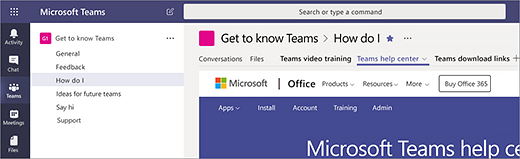

# Crear su primera equipos y canales en Microsoft TeamsCreate your first teams and channels in Microsoft Teams

Configurar y utilizar su primer conjunto de equipos y canales basa su experiencia con los equipos e identifican a campeones que pueden ayudar a estimular la adopción de los equipos en toda la organización.Setting up and using your first set of teams and channels builds your experience with Teams and identifies champions who can help drive Teams adoption across your organization. 

## Sugerencias para la primera equipos y canalesSuggestions for your first teams and channels

 Un equipo es una colección de las personas que reúna alrededor de un objetivo común.A team is a collection of people who gather together around a common goal. Los canales son los espacios de colaboración dentro de un equipo donde se realiza el trabajo real.Channels are the collaboration spaces within a team where the actual work gets done. 

Para obtener más información, vea [información general de los equipos y los canales en los equipos](teams-channels-overview.md) y [procedimientos recomendados para organizar los equipos en los equipos](best-practices-organizing.md).To learn more, see [Overview of teams and channels in Teams](teams-channels-overview.md) and [Best practices for organizing teams in Teams](best-practices-organizing.md).

 Le recomendamos que empiece con un equipo "Obtener saber los equipos", donde pueden reproducir alrededor de los primeros usuarios, formular preguntas y descubrir las capacidades de los equipos.We suggest you start with a “Get to know Teams” team where your early adopters can play around, ask questions, and discover the capabilities of Teams. Este equipo puede ser esencial para su éxito comenzar a experimentar con los equipos.This team can be essential to your success as you begin to experiment with Teams. 

### Equipo "Obtener saber los equipos""Get to know Teams" team
Su equipo de proyecto puede usar el equipo de "Introducción a conocer los equipos" para asegurarse de que estén configuradas con los clientes de los equipos, tienen algunas excelentes conversaciones iniciales y explore ¿qué pueden hacer los equipos.Your project team can use the “Getting to know Teams” team to ensure they're set up with Teams clients, have some great initial conversations, and explore what Teams can do. Ya puede tener un grupo de personas en la organización que disfrute de obtención de acceso rápido a las nuevas funciones.You may already have a group of people in your organization who enjoy getting early access to new capabilities. Esto puede ser una de sus equipos iniciales al ponerlos a bordo y le ayudará a empezar inmediatamente a recibir comentarios.This can be one of their initial teams when you bring them on board, and will help you to immediately start getting feedback.

Aquí es una estructura sugerida para el equipo.Here's a suggested structure for the team.

| CanalChannel | Descripción y usoDescription and usage | Fichas ancladas, bots y aplicacionesPinned tabs, bots, and apps |
| ------------ | -------------------- | -------------------- |
| GeneralGeneral | Inicie todos los equipos de con un canal General.All teams start with a General channel. Use este canal para realizar anuncios como para comenzar a conocer los equipos.Use this channel to make announcements as you start getting to know Teams. |  |
| Diga hiSay hi | Introducir usted mismo al equipo de y comparta lo que desea obtener de los equipos.Introduce yourself to the team and share what you want to get from Teams. |  |
| ¿Cómo se hace?How do I ? | Un canal para formular preguntas sobre procedimientos.A channel to ask how-to questions. Paso 1: instalar a los clientes móviles y de escritorio.Step 1 – install the desktop and mobile clients. Paso 2: saltar en los equipos.Step 2 – jump into Teams.| Ficha anclado que vincula a la del [Centro de Ayuda de los equipos](https://support.office.com/teams)Pinned tab that links to the [Teams help center](https://support.office.com/teams) Ficha anclado que vincula a [los equipos de vídeos de aprendizaje](https://support.office.com/article/microsoft-teams-video-training-4f108e54-240b-4351-8084-b1089f0d21d7)Pinned tab that links to [Teams training videos](https://support.office.com/article/microsoft-teams-video-training-4f108e54-240b-4351-8084-b1089f0d21d7) Ficha anclado que vincula a [los equipos de los vínculos de descarga de cliente de escritorio y móviles](https://teams.microsoft.com/downloads)Pinned tab that links to [Teams desktop and mobile client download links](https://teams.microsoft.com/downloads) |
| ComentariosFeedback | Compartir sus ideas sobre su experiencia de los equipos.Share your thoughts on your Teams experiences. | Ficha anclado con Polly sondeoPinned tab with Polly Poll|
| Ideas para los equipos del futuroIdeas for future teams | Compartir sus ideas en donde los equipos pueden controlar valores adicionales en la organización.Share your thoughts on where Teams can drive additional value in your organization. ¿Lo que podrían estos equipos se denomina?What could these teams be called? ¿Que sería (miembros)?Who would be members? ||
| Asistencia técnicaSupport | Si algo no funciona como se esperaba, use este canal para obtener ayuda.If something isn't working as expected, use this channel to get help. ||

## Poner en funcionamiento los equipos de primeraGet your first teams up and running
Como administrador, puede crear y administrar los equipos y canales en el cliente de los equipos o Microsoft Teams & Skype para el centro de administración de negocio.As an admin, you can create and manage teams and channels in the Teams client or the Microsoft Teams & Skype for Business Admin Center. Puede crear equipos como público o privado.You can create teams as public or private. También puede crear un equipo de toda la organización.You can also create an org-wide team. Uso de los equipos de la organización pueden unirse a un equipo público.Anyone using Teams in your organization can join a public team. Para que los equipos privados, los propietarios de equipo administran pertenencia al equipo.For private teams, team owners manage team membership. Y para un equipo de toda la organización, todas las personas de su organización se agregan automáticamente.And for an org-wide team, everyone in your organization is automatically added. 

Para empezar, se recomienda crear equipos privados y agregar otro propietario para administrar la configuración de equipo y pertenencia.To get started, we recommend you create private teams and add another owner to manage team settings and membership. 

> [!NOTE]
> En los pasos siguientes, usamos al cliente de escritorio de los equipos para crear equipos y canales.In the steps that follow, we use the Teams desktop client to create teams and channels. Tenga en cuenta que como administrador, también puede realizar estas tareas en el Microsoft Teams & Skype para el centro de administración de negocio.Keep in mind that as an admin, you can also do these tasks in the Microsoft Teams & Skype for Business Admin Center.

### Crear un equipoCreate a team

En el lado izquierdo de los equipos, haga clic en **los equipos**y, a continuación, en la parte inferior de la lista de equipos, haga clic en **unirse a o crear un equipo**.On the left side of Teams, click **Teams**, and then at the bottom of the teams list, click **Join or create a team**. En la **creación de un equipo de** mosaico, haga clic en **Crear equipo**.On the **Create a team** tile, click **Create team**.

Desde aquí, el nombre de su equipo, agregar una descripción y establecer la privacidad.From here, name your team, add a description, and set the privacy. Una vez hecho esto, invitar a personas a participar en el equipo.After you've done that, invite people to join the team. Puede agregar usuarios individuales, grupos y todo incluso grupos de contactos (anteriormente conocidos como "listas de distribución").You can add individual users, groups, and even entire contact groups (formerly known as "distribution lists"). 

![Crear un equipo] (media/get-started-with-teams-create-team.png "Obtener captura de pantalla de un ejemplo conocer los equipos de equipo, que muestra el nombre del grupo y la descripción") 

### Agregar el propietario de un equipoAdd a team owner
Busque el equipo que ha creado, haga clic en **más ˙˙˙ opciones** > **Administrar equipo**.Find the team that you created, click **More options ˙˙˙** > **Manage team**. A continuación, vaya a la ficha **miembros** , busque el usuario o usuarios que desea designar como propietario del equipo y, a continuación, en la **función**, haga clic en **propietario**.Then go to the **Members** tab. Find the user or users you want to designate as team owner, and then under **Role**, click **Owner**.

### Crear un canal en un equipoCreate a channel in a team
Busque el equipo que ha creado, haga clic en **más ˙˙˙ opciones** > **Agregar canal**.Find the team that you created, click **More options ˙˙˙** > **Add channel**. También puede haga clic en **Administrar equipo** y agregar un canal en la ficha **canales** .You can also click **Manage team** and add a channel in the **Channels** tab. 

![Agregar un canal a un equipo] (media/get-started-with-teams-add-channel.png "Captura de pantalla de la opción de Agregar canal, opción del equipo de administrar y otras opciones que están disponibles al hacer clic en más opciones en un equipo") 

Asigne el canal de un nombre descriptivo para facilitar a los usuarios a comprender lo que la conversación en el canal está allí para lograr.Give the channel a descriptive name to make it easier for users to understand what the conversation in the channel is there to achieve. 

Como propietario de un equipo, puede canales favoritos automáticamente para todo el equipo, hacer que los canales más visible para todos los usuarios en el equipo.As a team owner, you can automatically favorite channels for the whole team, making the channels more visible for everyone on the team. También puede anclar pestañas para el canal para agregar herramientas como OneNote o vínculos a páginas Web y otro contenido para facilitar a los usuarios a encontrar lo que necesitan y comparta sus ideas.You can also pin tabs to the channel to add tools like OneNote or links to webpages and other content to make it easy for users to find what they need and share their thoughts.  

Este es un ejemplo del canal "¿cómo" en el equipo de "Obtener saber los equipos", que muestra anclado las fichas que vinculan a páginas Web de los equipos &ndash; vínculos de descarga de aprendizaje en vídeo equipos, centro de Ayuda de los equipos y los equipos.Here's an example of the "How do I" channel in the "Get to know Teams" team, showing pinned tabs that link to Teams webpages &ndash; Teams video training, Teams help center, and Teams download links. 

![Fichas de PIN a un canal] (media/get-started-with-teams-add-tabs.png "Captura de pantalla de las fichas ancladas al ejemplo llegar a conocer los equipos team.") 

## Pasos siguientesNext steps
Vaya a [incorporado los primeros usuarios](get-started-with-teams-onboard-early-adopters.md).Go to [Onboard your early adopters](get-started-with-teams-onboard-early-adopters.md).
