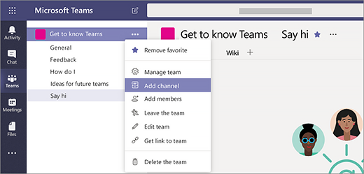

# Crear sus primeros equipos y canales en Microsoft TeamsCreate your first teams and channels in Microsoft Teams

Al configurar y usar el primer conjunto de equipos y canales comenzará su experiencia con Teams e identificará a expertos que puedan ayudarle a impulsar la adopción de Teams en toda la organización.Setting up and using your first set of teams and channels builds your experience with Teams and identifies champions who can help drive Teams adoption across your organization. Si todavía no ha instalado Teams, consulte [Obtener clientes de Teams](get-clients.md) e [Iniciar sesión en Teams con autenticación moderna](sign-in-teams.md).If you haven't installed Teams yet, check out [Get Teams clients](get-clients.md) and [Sign in to Teams using modern authentication](sign-in-teams.md).

## Sugerencias para los primeros equipos y canalesSuggestions for your first teams and channels

 Un equipo es una colección de personas que se reúnen por un objetivo común.A team is a collection of people who gather together around a common goal. Los canales son los espacios de colaboración dentro de un equipo donde se realiza el trabajo real.Channels are the collaboration spaces within a team where the actual work gets done. 

Para obtener más información, consulte [Información general sobre los equipos y canales en Teams](teams-channels-overview.md) y [Procedimientos recomendados para organizar los equipos en Teams](best-practices-organizing.md).To learn more, see [Overview of teams and channels in Teams](teams-channels-overview.md) and [Best practices for organizing teams in Teams](best-practices-organizing.md).

 Le recomendamos que empiece por un equipo llamado "Familiarizarse con Teams" en el que los primeros usuarios puedan probar cosas, formular preguntas y descubrir las funciones de Teams.We suggest you start with a “Get to know Teams” team where your early adopters can play around, ask questions, and discover the capabilities of Teams. Este equipo puede ser esencial para el correcto funcionamiento cuando empiece a experimentar con Teams.This team can be essential to your success as you begin to experiment with Teams. 

### Equipo "Familiarizarse con Teams""Get to know Teams" team
El equipo de proyecto puede usar el equipo "Familiarizarse con Teams" para asegurarse de que se han configurado los clientes de Teams, tener algunas conversaciones iniciales y explorar lo que Teams puede hacer.Your project team can use the “Getting to know Teams” team to ensure they're set up with Teams clients, have some initial conversations, and explore what Teams can do. Puede que ya tenga un grupo de personas en su organización que disfrute de obtener acceso anticipado a nuevas funciones.You may already have a group of people in your organization who enjoy getting early access to new capabilities. Este grupo puede ser uno de sus equipos iniciales al incluirlos en el proceso y le ayudarán a saber las primeras opiniones y comentarios.This can be one of their initial teams when you bring them on board and will help you get early feedback.

Esta una sugerencia de estructura para el equipo.Here's a suggested structure for the team.

| CanalChannel | Descripción y usoDescription and usage | Pestañas ancladas, bots y aplicacionesPinned tabs, bots, and apps |
| ------------ | -------------------- | -------------------- |
| GeneralGeneral | Todos los equipos empieza con un canal General.All teams start with a General channel. Use este canal para realizar anuncios cuando empiece a familiarizarse con Teams.Use this channel to make announcements as you start getting to know Teams. |  |
| SaludadSay hi | Preséntese al equipo y comparta los objetivos que desea alcanzar con Teams.Introduce yourself to the team and share what you want to get from Teams. |  |
| Cómo...How do I | Un canal para realizar preguntas sobre procedimientos.A channel to ask how-to questions. Paso 1: instalar los clientes móviles y de escritorio.Step 1 – install the desktop and mobile clients. Paso 2: empezar a usar TeamsStep 2 – jump into Teams.| Pestaña anclada que vincula al [centro de ayuda de Teams](https://support.office.com/teams)Pinned tab that links to the [Teams help center](https://support.office.com/teams) Pestaña anclada que vincula a los [vídeos de aprendizaje de Teams](https://support.office.com/article/microsoft-teams-video-training-4f108e54-240b-4351-8084-b1089f0d21d7)Pinned tab that links to [Teams training videos](https://support.office.com/article/microsoft-teams-video-training-4f108e54-240b-4351-8084-b1089f0d21d7) Pestaña anclada que vincula a [Vínculos de descarga del cliente de escritorio y móvil de Teams](https://teams.microsoft.com/downloads)Pinned tab that links to [Teams desktop and mobile client download links](https://teams.microsoft.com/downloads) |
| ComentariosFeedback | Comparta su opinión sobre su experiencia con Teams.Share your thoughts on your Teams experiences. | Pestaña anclada con sondeo PollyPinned tab with Polly Poll|
| Ideas para equipos futurosIdeas for future teams | Comparta sus ideas sobre qué áreas podrían beneficiarse mejor de Teams en su organización.Share your thoughts on where Teams can drive additional value in your organization. ¿Cómo podrían llamarse estos equipos?What could these teams be called? ¿Quiénes serían miembros?Who would be members? ||
| Soporte técnicoSupport | Si algo no funciona según lo esperado, use este canal para obtener ayuda.If something isn't working as expected, use this channel to get help. ||

## Ponga en funcionamiento los primeros equiposGet your first teams up and running
Como administrador, puede crear y administrar equipos y canales en el cliente de Teams o en el centro de administración de Microsoft Teams.As an admin, you can create and manage teams and channels in the Teams client or the Microsoft Teams admin center. Puede crear los equipos como públicos o privados.You can create teams as public or private. También puede crear un [equipo de toda la organización](create-an-org-wide-team.md).You can also create an [org-wide team](create-an-org-wide-team.md). Todos los usuarios de Teams de su organización pueden unirse a un grupo público.Anyone using Teams in your organization can join a public team. En los equipos privados, los propietarios del equipo administran los miembros del grupo.For private teams, team owners manage team membership. Y en un grupo de toda la organización, todas las personas de su organización se agregan automáticamente.And for an org-wide team, everyone in your organization is automatically added. 

Para empezar, se recomienda crear equipos privados y agregar otro propietario para administrar los miembros y la configuración de cada equipo.To get started, we recommend you create private teams and add another owner to manage team settings and membership. 

> [!NOTE]
> En los pasos siguientes, usamos el cliente de escritorio de Teams para crear equipos y canales.In the steps that follow, we use the Teams desktop client to create teams and channels. Tenga en cuenta que, como administrador, también puede realizar estas tareas en el centro de administración de Microsoft Teams.Keep in mind that as an admin, you can also do these tasks in the Microsoft Teams admin center.

### Crear un equipoCreate a team

En el lado izquierdo de Teams, haga clic en **Equipos**, en la parte inferior de la lista de equipos, haga clic en **Unirse o crear un equipo** y seleccione **Crear un nuevo equipo**.On the left side of Teams, click **Teams**, at the bottom of the teams list, click **Join or create a team**, and then click **Create a new team**.

Una vez que haya creado el equipo, invite a personas a unirse a él.Once you've created the team, invite people to join it. Puede agregar usuarios individuales, grupos e incluso un grupo entero de contactos (anteriormente conocido como "lista de distribución").You can add individual users, groups, and even entire contact groups (formerly known as "distribution lists"). 

Screen shot of an example Get to know Teams team, showing the team name and description 

### Agregar propietario del equipoAdd a team owner
Busque el equipo que ha creado, haga clic en **Más opciones** > **Administrar equipo**.Find the team that you created, click **More options ˙˙˙** > **Manage team**. Después, vaya a la pestaña **Miembros**. Busque las personas que desea designar como propietarios del equipo.Then go to the **Members** tab. Find the people you want to designate as team owners. En **Rol**, haga clic en **Propietario**.Under **Role**, click **Owner**.

### Crear un canal en un equipoCreate a channel in a team
Busque el equipo que ha creado, haga clic en **Más opciones ...** > **Agregar canal**.Find the team that you created, click **More options ...** > **Add channel**. También puede hacer clic en **Administrar equipo** y agregar un canal en la pestaña **Canales**.You can also click **Manage team** and add a channel in the **Channels** tab. 

 

De al canal un nombre descriptivo para que sea más fácil para los usuarios comprender el propósito del canal.Give the channel a descriptive name to make it easier for users to understand the purpose of the channel. 

Como propietario de un equipo, puede marcar canales favoritos automáticamente para todo el equipo, haciendo que los canales sean más visibles para todos los miembros del equipo.As a team owner, you can automatically favorite channels for the whole team, making the channels more visible for everyone on the team. También puede anclar pestañas en el canal para agregar herramientas, como OneNote, vínculos a páginas web y otro contenido que haga que sea más fácil para los usuarios encontrar lo que necesitan y compartir su opinión.You can also pin tabs to the channel to add tools, such as OneNote, links to webpages, and other content to make it easy for users to find what they need and share their thoughts.  

Este es un ejemplo del canal "¿Cómo..." en el equipo "Familiarizarse con Teams", que muestra pestañas ancladas que vinculan a páginas web de Teams (vínculos de descarga de Teams, centro de ayuda de Teams y vídeos de aprendizaje de Teams).Here's an example of the "How do I" channel in the "Get to know Teams" team, showing pinned tabs that link to Teams webpages &ndash; Teams video training, Teams help center, and Teams download links. 

 

## Siguientes pasosNext steps
Vaya a [Incorporar primeros usuarios](get-started-with-teams-onboard-early-adopters.md).Go to [Onboard your early adopters](get-started-with-teams-onboard-early-adopters.md).
