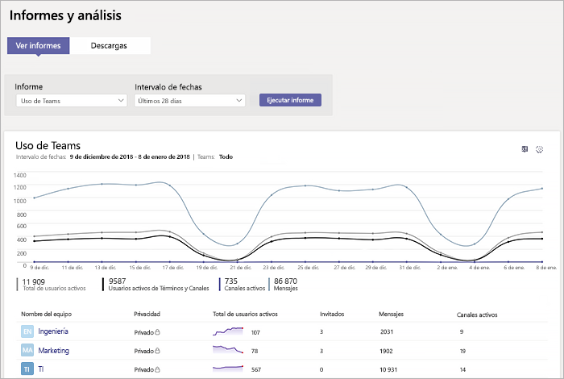
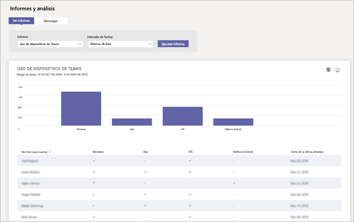

# Supervisar el uso y los comentarios en Microsoft TeamsMonitor usage and feedback in Microsoft Teams
Es importante saber cómo los usuarios utilizan Teams y cuál es su experiencia con Teams.It's important to know how users are using Teams and what their experience is with Teams. Los informes de uso pueden ayudarle a comprender mejor los patrones de uso y, junto con los comentarios de los usuarios, proporcionarle información para ampliar la implementación y saber en qué áreas debe dar prioridad a los esfuerzos de aprendizaje y comunicación.Usage reports can help you better understand usage patterns, and along with user feedback, give you insights to inform your wider rollout and where to prioritize training and communication efforts.

## Supervisar usoMonitor usage
Para el primer conjunto de equipos, le recomendamos que revise informes dos veces a la semana para comprender las tendencias emergentes.For your first set of teams, we recommend you review reports twice a week to understand emerging trends. 

Por ejemplo, los informes de uso muestran que no muchos usuarios usan los clientes móviles de Teams.For example, usage reports show that not many users are using the Teams mobile clients. Esto puede indicar que los usuarios no están seguros de cómo instalar los clientes.This may indicate that users aren't sure how to install the clients. Publicar las instrucciones de instalación en un canal puede ayudar a impulsar el uso de una mayor gama de clientes.Posting step-by-step installation instructions in a channel may help drive usage of a wider range of clients. O bien, los informes de uso muestran que los usuarios usan Teams principalmente para conversaciones privadas.Or, usage reports show that users are primarily using Teams for private chats. En este ejemplo, puede que le interese revisar los escenarios del equipo, ya que los usuarios están hablando fuera de los equipos y canales iniciales que se han configurado.In this example, you may want to review your team scenarios because users are chatting outside the initial teams and channels that were set up. 

Aquí le mostramos cómo obtener informes para ver el uso de Teams.Here's how to get reports to view Teams usage. 

### Análisis e informes de Teams (Centro de administración de Microsoft Teams)Teams analytics & reports (Microsoft Teams admin center)

Los informes de equipos en el Centro de administración de Microsoft Teams proporcionan información acerca de cómo se usa Teams en su organización.Teams reports in the Microsoft Teams admin center give you insights into how Teams is used in your organization. Use los informes para obtener una vista del uso de Teams, la actividad de los usuarios y el uso de dispositivos en toda la organización.Use the reports to get a view into Teams usage, user activity, and device usage across your organization. 

Para ver estos informes, debe ser un administrador global de Office 365, administrador del servicio de Teams o administrador de Skype Empresarial. Vaya al Centro de administración de Microsoft Teams, en la navegación de la izquierda, seleccione **Análisis e informes** y en **Informe**, seleccione el informe que desee ejecutar.To view these reports, you must be a global admin in Office 365, Teams service admin, or Skype for Business admin. Go to the Microsoft Teams admin center, in the left navigation, select **Analytics & reports**, and then under **Report**, choose the report you want to run.

- **Informe de uso de Teams**: este informe proporciona información general sobre la actividad de uso en Teams, incluidos los canales y usuarios activos totales, y el número de usuarios activos, canales activos, invitados y mensajes en cada equipo.**Teams usage report**: This report gives you an overview of usage activity in Teams, including the total active users and channels, and the number of active users and channels, guests, and messages in each team. 

         
- **Informe de actividad de usuarios de Teams**: este informe ofrece información sobre los tipos de actividades que llevan a cabo los usuarios, como cuántos usuarios se comunican mediante llamadas de uno a uno, mensajes en el canal y mensajes de chat privado.**Teams user activity report**: This report gives you insight into the types of activities users engage in, such as how many people communicate through 1:1 calls, channel messages, and private chat messages. 

     
\` 
\`
- **Informe de uso de dispositivos de Teams**: este informe muestra cómo los usuarios se conectan a Teams, incluida la cantidad de personas que utiliza Teams en sus dispositivos móviles cuando están fuera de la oficina.**Teams device usage report**: This report shows you how users connect to Teams, including how many people use Teams on their mobile devices when on-the-go. 

    

Para obtener más información, consulte [Análisis e informes de Microsoft Teams](teams-analytics-and-reports/teams-reporting-reference.md).To learn more, check out [Teams analytics and reporting](teams-analytics-and-reports/teams-reporting-reference.md). 

### Informes de actividades de Teams (Centro de administración de Office 365)Teams activity reports (Office 365 admin center)
También puede ver la actividad de Teams a través de los informes disponibles en el Centro de administración de Office 365.You can also view Teams activity through reports that are available from the Office 365 admin center. Estos informes forman parte de los informes de Office 365 en el Centro de administración de Office 365 y proporcionan información sobre el uso de dispositivos y la actividad de los usuarios.These reports are part of the Office 365 reports in the Office 365 admin center and provide information about user activity and device usage. 

Para ver estos informes, vaya al Centro de administración de Office 365, haga clic en **Informes** > **Uso**.To view these reports, go to the Office 365 admin center, click **Reports** > **Usage**. En **Seleccionar un informe**, haga clic en **Microsoft Teams**.Under **Select a report**, click **Microsoft Teams**. A continuación, elija el informe que quiera ver.From here, choose the report you want to view.

Para obtener más información, vaya a [Usar informes de actividad de Teams](teams-activity-reports.md).To learn more, go to [Use activity reports for Teams](teams-activity-reports.md).

### Análisis de uso de Microsoft 365Microsoft 365 usage analytics

Puede usar los análisis de uso de Microsoft 365 en Power BI para ver y analizar los datos de uso de Teams y otros productos y servicios de Office 365.You can use Microsoft 365 usage analytics in Power BI to view and analyze usage data for Teams and other Office 365 products and services. Los análisis de uso de Microsoft 365 son un paquete de contenido que incluye un panel predefinido y un número de informes predefinidos.Microsoft 365 usage analytics is a content pack that includes a pre-built dashboard and a number of pre-built reports. Cada informe le proporciona información y datos de uso específicos.Each report gives you specific usage data and insights. Para conectarse al paquete de contenido, necesita Power BI y debe ser un administrador global en Office 365 o un lector de informes.To connect to the content pack, you need Power BI and must be a global admin in Office 365 or reports reader. Si todavía no tiene Power BI, [regístrese de forma gratuita en el servicio Power BI](https://powerbi.microsoft.com).If you don't already have Power BI, [sign up for the free Power BI service](https://powerbi.microsoft.com). 

Para obtener más información, consulte [Análisis de uso de Microsoft 365](https://support.office.com/article/Microsoft-365-usage-analytics-77ff780d-ab19-4553-adea-09cb65ad0f1f).To learn more, see [Microsoft 365 usage analytics](https://support.office.com/article/Microsoft-365-usage-analytics-77ff780d-ab19-4553-adea-09cb65ad0f1f). 

## Recopilar comentariosGather feedback
La adopción de una nueva experiencia de colaboración consiste en cambiar el comportamiento de los usuarios.The adoption of a new collaboration experience is about changing the behavior of users. La habilitación del cambio requiere de aprendizaje, estímulo y ejemplos positivos.Enabling change requires training, encouragement, and positive examples. Es importante para los usuarios poder opinar durante la transición a Teams y poder compartir abiertamente sus experiencias.It's important for users to have a voice during the transition to Teams and to be able to openly share their experiences. Se recomienda usar el canal de Comentarios en el equipo "Familiarizarse con Teams" que ha creado para recopilar y responder a los comentarios de los usuarios sobre su experiencia con Teams.We recommend using the Feedback channel in the "Get to know Teams" team you created to collect and address feedback from users on their experiences with Teams. 

## Pasos siguientesNext steps
Vaya a [Conseguir recursos para planificar el despliegue de Teams en toda su organización](get-started-with-teams-resources-for-org-wide-rollout.md).Go to [Get resources to plan your organization-wide rollout of Teams](get-started-with-teams-resources-for-org-wide-rollout.md).
