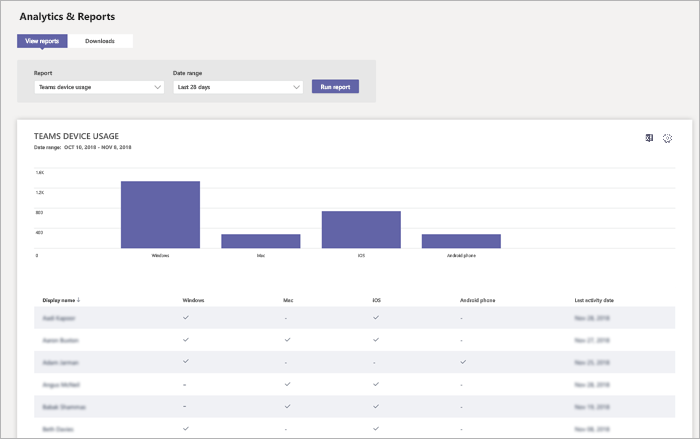

# Supervisar el uso y los comentarios en Microsoft TeamsMonitor usage and feedback in Microsoft Teams
Es importante saber cómo los usuarios usan los equipos y cuál es su experiencia con los equipos.It's important to know how users are using Teams and what their experience is with Teams. Informes de uso le ayudarán a comprender los patrones de uso y mejor junto con los comentarios del usuario, proporcionan una perspectiva para informar a su implantación más amplia y where dar prioridad a los esfuerzos de aprendizaje y la comunicación.Usage reports can help you better understand usage patterns, and along with user feedback, give you insights to inform your wider rollout and where to prioritize training and communication efforts.

## Uso de MonitorMonitor usage
Para el primer conjunto de equipos, se recomienda que revisar informes dos veces por semana para comprender las tendencias emergentes.For your first set of teams, we recommend you review reports twice a week to understand emerging trends. 

Por ejemplo, informes de uso muestran que no muchos usuarios utilizan a los clientes móviles de los equipos.For example, usage reports show that not many users are using the Teams mobile clients. Esto puede indicar que los usuarios no están seguro de cómo instalar a los clientes.This may indicate that users aren't sure how to install the clients. Instrucciones de instalación paso a paso de registro en un canal puede ayudar a uso de la unidad de una amplia gama de clientes.Posting step-by-step installation instructions in a channel may help drive usage of a wider range of clients. O bien, informes de uso muestran que los usuarios utilizan principalmente los equipos para chats privadas.Or, usage reports show that users are primarily using Teams for private chats. En este ejemplo, es posible que desee revisar los escenarios de equipo debido a que los usuarios se charlar fuera de los equipos iniciales y canales que se han configurado.In this example, you may want to review your team scenarios because users are chatting outside the initial teams and channels that were set up. 

Aquí es cómo obtener informes para ver el uso de los equipos.Here's how to get reports to view Teams usage. 

### Análisis de los equipos & informes (Microsoft Teams & Skype para el centro de administración de negocio)Teams analytics & reports (Microsoft Teams & Skype for Business Admin Center)

Informes de los equipos en el Microsoft Teams & Skype para el centro de administración de negocio proporcionan una perspectiva en cómo se usan los equipos en la organización.Teams reports in the Microsoft Teams & Skype for Business Admin Center give you insights into how Teams is used in your organization. Use los informes para obtener una vista en uso del dispositivo, actividad del usuario y uso de los equipos en toda la organización.Use the reports to get a view into Teams usage, user activity, and device usage across your organization. 

Para ver estos informes, debe ser un administrador global en Office 365, Administrador de servicios de los equipos o Skype para Admin de negocio. Vaya a la lista Microsoft Teams & Skype para el centro de administración de negocio, en el panel de navegación izquierdo, seleccione **análisis e informes**y, a continuación, en el **informe**, seleccione el informe que desea ejecutar.To view these reports, you must be a global admin in Office 365, Teams service admin, or Skype for Business admin. Go to the Microsoft Teams & Skype for Business Admin Center, in the left navigation, select **Analytics & reports**, and then under **Report**, choose the report you want to run.

- **Informe de uso de los equipos**: este informe ofrece un resumen de actividad de uso en los equipos, incluidos los usuarios activos totales y canales y el número de usuarios activos y los canales de los invitados y los mensajes en cada equipo.**Teams usage report**: This report gives you an overview of usage activity in Teams, including the total active users and channels, and the number of active users and channels, guests, and messages in each team. 

    ![Informe de uso de los equipos] (media/teams-reports-teams-usage.png "Captura de pantalla del informe de uso de los equipos en los equipos de Microsoft & Skype para el centro de administración de negocio")     
- **Informe de actividad de usuario de los equipos**: este informe ofrece una visión de los tipos de actividades de los usuarios integrarse en, por ejemplo, ¿cuántas personas comunican a través de las llamadas de 1:1, los mensajes del canal y los mensajes de chat privado.**Teams user activity report**: This report gives you insight into the types of activities users engage in, such as how many people communicate through 1:1 calls, channel messages, and private chat messages. 

    ![Informe de actividad de usuario de los equipos] (media/teams-reports-user-activity.png "Captura de pantalla del informe de actividad de usuario de los equipos en los equipos de Microsoft & Skype para el centro de administración de negocio") 
\` 
\`
- **Informe de uso de dispositivos de los equipos**: este informe muestra cómo los usuarios se conectan a los equipos, incluido cómo muchas personas usan equipos en sus dispositivos móviles cuando en Ir.**Teams device usage report**: This report shows you how users connect to Teams, including how many people use Teams on their mobile devices when on-the-go. 

    ![Informe de uso de dispositivos de los equipos] (media/teams-reports-device-usage.png "Captura de pantalla del informe de uso de dispositivos de los equipos en los equipos de Microsoft & Skype para el centro de administración de negocio")

Para obtener más información, consulte [informes y análisis de los equipos](teams-analytics-and-reports/teams-reporting-reference.md).To learn more, check out [Teams analytics and reporting](teams-analytics-and-reports/teams-reporting-reference.md). 

### Informes de actividad de los equipos (centro de administración de Office 365)Teams activity reports (Office 365 admin center)
También puede ver la actividad de los equipos a través de informes que están disponibles desde el centro de administración de Office 365.You can also view Teams activity through reports that are available from the Office 365 admin center. Estos informes son parte de los informes de Office 365 en el centro de administración de Office 365 y proporcionan información sobre el uso del dispositivo y la actividad de usuario.These reports are part of the Office 365 reports in the Office 365 admin center and provide information about user activity and device usage. 

Para ver estos informes, vaya al centro de administración de Office 365, haga clic en **informes de** > **uso**.To view these reports, go to the Office 365 admin center, click **Reports** > **Usage**. En **Seleccione un informe**, haga clic en **Los equipos de Microsoft**.Under **Select a report**, click **Microsoft Teams**. Desde aquí, elija el informe que desea ver.From here, choose the report you want to view.

Para obtener más información, vaya a los [informes de actividad de uso para los equipos](teams-activity-reports.md).To learn more, go to [Use activity reports for Teams](teams-activity-reports.md).

### Análisis de uso de Microsoft 365Microsoft 365 usage analytics

Puede usar el análisis de uso de Microsoft 365 en Power BI para ver y analizar datos de uso de los equipos y otros productos de Office 365 y servicios.You can use Microsoft 365 usage analytics in Power BI to view and analyze usage data for Teams and other Office 365 products and services. Análisis de uso de Microsoft 365 es un paquete de contenido que incluya un panel creado previamente y un número de informes creados previamente.Microsoft 365 usage analytics is a content pack that includes a pre-built dashboard and a number of pre-built reports. Cada informe le ofrece conocimientos y datos de uso específico.Each report gives you specific usage data and insights. Para conectar con el paquete de contenido, necesita Power BI y debe ser un administrador global en Office 365 o informes de lector.To connect to the content pack, you need Power BI and must be a global admin in Office 365 or reports reader. Si ya no dispone de Power BI, [registrarse para el servicio de Power BI gratuito](https://powerbi.microsoft.com).If you don't already have Power BI, [sign up for the free Power BI service](https://powerbi.microsoft.com). 

Para obtener más información, vea [análisis de uso de Microsoft 365](https://support.office.com/article/Microsoft-365-usage-analytics-77ff780d-ab19-4553-adea-09cb65ad0f1f).To learn more, see [Microsoft 365 usage analytics](https://support.office.com/article/Microsoft-365-usage-analytics-77ff780d-ab19-4553-adea-09cb65ad0f1f). 

## Recopilar comentariosGather feedback
La adopción de una nueva experiencia de colaboración es acerca de cómo cambiar el comportamiento de los usuarios.The adoption of a new collaboration experience is about changing the behavior of users. Habilitar cambio requiere recursos de aprendizaje, fomento y ejemplos positivos.Enabling change requires training, encouragement, and positive examples. Es importante para los usuarios tengan una voz durante la transición a los equipos y que puedan compartir sus experiencias de abierta.It's important for users to have a voice during the transition to Teams and to be able to openly share their experiences. Se recomienda usar el canal de comentarios en el equipo de "Obtener saber los equipos" se ha creado para recopilar y solucionar los comentarios de los usuarios en sus experiencias con los equipos.We recommend using the Feedback channel in the "Get to know Teams" team you created to collect and address feedback from users on their experiences with Teams. 

## Pasos siguientesNext steps
Vaya al [obtener recursos para planear la implantación de toda la organización de los equipos](get-started-with-teams-resources-for-org-wide-rollout.md).Go to [Get resources to plan your organization-wide rollout of Teams](get-started-with-teams-resources-for-org-wide-rollout.md).
