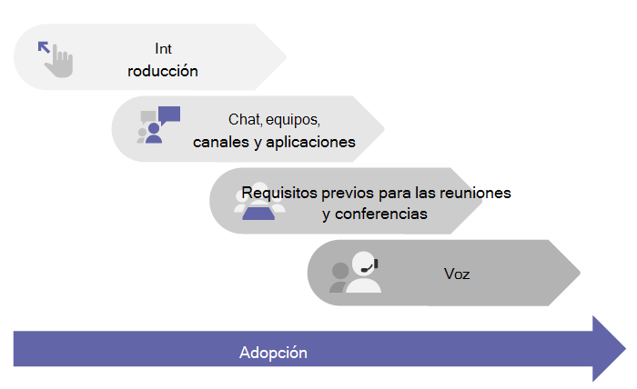

# Introducción a Microsoft Teams

> [!TIP]
> ¿Necesita información sobre cómo instalar el cliente de Teams en su equipo o dispositivo móvil? Vaya a: [Descargar Microsoft Teams](https://www.microsoft.com/microsoft-teams/download-app).

## Empiece aquí

Tanto si es una empresa pequeña como una multinacional, este es el punto de partida para implementar Teams. Estos artículos le guiarán a través de una implementación de Teams a pequeña escala, lo cual podría ser todo lo que necesite si es una empresa pequeña o si quiere implementar Teams rápidamente como su primera carga de trabajo de Microsoft 365 para ofrecer soporte a los **trabajadores remotos**.

Si se trata de una organización más grande, use estos artículos para probar Teams con un pequeño grupo de usuarios pioneros a través de los cuales puede familiarizarse con Teams y así empezar a planear la implementación de toda la organización. Puede usar la guía del sitio de [Adopción de Microsoft Teams](https://adoption.microsoft.com/microsoft-teams/#get-started) para implementar Teams en toda la organización.

Recomendamos implementar Teams por fases, con una carga de trabajo cada vez, en función de la preparación de su organización. **No tiene que esperar hasta que se haya completado un paso antes de pasar al siguiente.** Es posible que algunas organizaciones quieran implementar todas las características de Teams de una vez, mientras que otras podrían preferir un enfoque por fases. Estas son las cargas de trabajo de Teams en el orden en que se recomienda implementarlas:

- [Chat, equipos, canales y aplicaciones](deploy-chat-teams-channels-microsoft-teams-landing-page.md)
- [Reuniones y conferencias](deploy-meetings-microsoft-teams-landing-page.md)
- [Voz en la nube](cloud-voice-landing-page.md)

Si tiene una organización mediana o grande, [use el Asesor para Teams para implementar Microsoft Teams](use-advisor-teams-roll-out.md) y planificar la implementación de estas cargas de trabajo en toda la organización. El Asesor para Teams usa al mismo Teams para crear las tareas del plan y asignarlas a sus respectivos propietarios, compartir documentos y habilitar discusiones entre los miembros de su equipo de implementación.

## Asegúrese de estar preparado

Para prepararse para la implementación de Teams, esto es lo que debe hacer, independientemente de si Teams es la primera carga de trabajo ("Teams primero") o la siguiente carga de trabajo de una implementación existente de Microsoft 365 u Office 365:

- [Preparar la red de la organización para Microsoft Teams](prepare-network.md)
  - Esto incluye la configuración del dominio de Microsoft 365 u Office 365, SharePoint Online, Exchange Online y OneDrive para la Empresa.

- Obtenga licencias de Teams para todos. Eche un vistazo [Planes de Teams](https://www.microsoft.com/microsoft-365/microsoft-teams/compare-microsoft-teams-options) y [Descripción del servicio de Microsoft Teams](https://docs.microsoft.com/office365/servicedescriptions/teams-service-description).

- [Obtener información sobre las ventajas de instalar los clientes de escritorio, web y móvil](get-clients.md)

## Familiarizarse con Teams

Si es la primera vez que usa Teams, la mejor manera de familiarizarse es comenzar a usarlo inmediatamente. Una de las mayores ventajas de Teams es que la configuración que haga ahora no interrumpirá ninguna actualización ni migración que necesite hacer después.

> [!TIP]
> Revise las rutas y módulos de aprendizaje disponibles en [Microsoft Learn para Teams](/learn/teams/). Puede hacer el paseo del [Centro de administración de Teams](https://docs.microsoft.com/learn/modules/m365-teams-navigate-admin-portal/), aprender a [configurar su red para Teams](/learn/modules/m365-teams-connectivity/), obtener ideas sobre cómo [incorporar a los usuarios a Teams](/learn/modules/m365-teams-onboard-users/) y mucho más.

Siga los pasos a continuación para configurar un par de equipos e incorporar a algunos usuarios pioneros que le ayuden a familiarizarse con Teams.

- Paso 1: [Crear los primeros equipos y canales](get-started-with-teams-create-your-first-teams-and-channels.md)
- Paso 2: [Incorporar primeros usuarios](get-started-with-teams-onboard-early-adopters.md)
- Paso 3: [Supervisar el uso y los comentarios](get-started-with-teams-monitor-usage-and-feedback.md)
- Paso 4: [Iniciar la implementación en toda la organización](get-started-with-teams-resources-for-org-wide-rollout.md)

## Actualizar o migrar desde Skype Empresarial

Si migra a Teams desde Skype Empresarial (en línea o local) o si necesita una configuración híbrida, también debe seguir la ruta anteriormente recomendada para implementar Teams, aunque primero debe realizar algunos pasos de planificación adicionales. Comience por revisar las instrucciones de la siguiente tabla que se apliquen al perfil de su organización.

|  |Perfil de su organización|Instrucciones  |
|---------|---------|---------|
||Actualmente utilizo Skype Empresarial Online y estoy listo para migrar a Teams. |Vaya a [Actualizar a Teams](upgrade-start-here.md).        |
||Mi organización utiliza Skype Empresarial Server y quiero implementar Teams. |Para implementar Teams a gran escala, primero necesita configurar una conectividad híbrida entre su entrono local y Microsoft 365. Empiece leyendo el [Plan de conectividad híbrida entre Skype Empresarial Server y Microsoft 365 u Office 365](https://docs.microsoft.com/skypeforbusiness/hybrid/plan-hybrid-connectivity).   También debería consultar [Actualizar a Teams](upgrade-start-here.md).   |
||No tengo Skype Empresarial Server, pero tengo una solución de red telefónica conmutada (RTC) local. Quiero implementar Teams, pero quiero conservar mi solución RTC local. |Implemente Teams siguiendo las sugerencias de este artículo.  Después, lea [Planear el enrutamiento directo](direct-routing-plan.md) para obtener información sobre el uso de enrutamiento directo del sistema telefónico para conectar su solución RTC local con Teams.|
