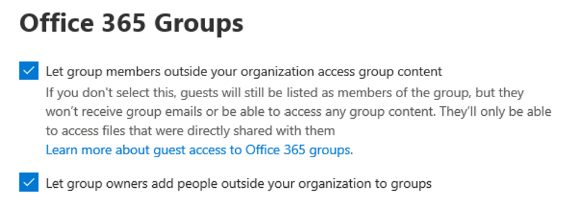
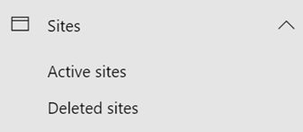

Lista de control de acceso de invitados de Microsoft TeamsMicrosoft Teams guest access checklist
=========================================

Use esta lista para ayudarse a activar y configurar el acceso de invitados en Microsoft Teams.Use this checklist to help you turn on and configure guest access in Microsoft Teams. Es necesario ser un Administrador global o un Administrador de Teams para hacer estos cambios.You need to be a Global Administrator or a Teams Administrator to make these changes.

> [!IMPORTANT]
> Es posible que tenga que esperar unas horas para que los cambios surtan efecto.You may have to wait a few hours for your changes to take effect. 

Mire este corto vídeo (5:31 minutos) para ver cómo activar el acceso de invitados a través de Microsoft 365, incluyendo Teams.Watch this short video (5:31 minutes) to see how to turn on guest access throughout Microsoft 365, including Teams.

> [!VIDEO https://www.microsoft.com/videoplayer/embed/RE44NTr?autoplay=false]

## Paso 1: activar el acceso de invitados a nivel de toda la organización de TeamsStep 1: Turn on guest access at the Teams org-wide level

Para activar el acceso de invitados, vaya al centro de administración en <a href="https://go.microsoft.com/fwlink/p/?linkid=2024339" target="_blank">https://admin.microsoft.com</a> .To turn on guest access, go to the admin center at <a href="https://go.microsoft.com/fwlink/p/?linkid=2024339" target="_blank">https://admin.microsoft.com</a>. 

1. En el centro de administración de Teams, seleccione **configuración de Toda la organización** > \*\* Acceso de invitado\*\*.In the Teams admin center, select **Org-Wide settings** > **Guest access**.
2. Establezca cambiar**Permitir el acceso de invitado en Microsoft Teams** en **Activado**.Set the **Allow guest access in Microsoft Teams** switch to **On**.

    

3. En esta misma página, active o desactive **Llamada**, **Reunión**, y **Configuración** de mensajería para invitados.On this same page, turn on or turn off **Calling**, **Meeting**, and **Messaging** settings for guests.
4. Haga clic en \*\*Guardar \*\*.Click **Save**.

> [!TIP]
> Si está usando la configuración predeterminada en Azure Active Directory, SharePoint Online y Microsoft 365 Groups, es posible que haya terminado de configurar el acceso de invitado.If you're using default settings in Azure Active Directory, SharePoint Online, and Microsoft 365 Groups, you may be done configuring guest access. En este caso, puede saltarse el resto de los pasos.In this case, you can skip the rest of the steps. Si no está seguro, o si está usando una configuración personalizada para los grupos de AAD, SharePoint Online o Microsoft 365, continúe con el resto de los pasos de esta lista de comprobación.If you're not sure, or if you're using custom settings for AAD, SharePoint Online, or Microsoft 365 Groups, continue with the rest of the steps in this checklist.

## Paso 2: configurar las opciones de empresa a empresa de Azure ADStep 2: Configure Azure AD business-to-business settings

Estos son los ajustes de Azure AD que permiten el acceso de invitados en Teams.These are the Azure AD settings that support guest access in Teams. Una vez que estos ajustes estén configurados, estará habilitado para[agregar](add-guests.md) y [administrar invitados](manage-guests.md) en Teams.Once these settings are configured, you'll be able to [add](add-guests.md) and [manage guests](manage-guests.md) in Teams.

1. Inicie sesión en [Azure Portal](https://portal.azure.com) como administrador de inquilinos.Sign in to the [Azure portal](https://portal.azure.com) as a tenant administrator.
2. Seleccione **Azure Active Directory** > **Usuarios** > **Configuración de usuarios**.Select **Azure Active Directory** > **Users** > **User settings**.
3. En **Usuarios externos**, seleccione **Administrar configuración de colaboración externa**.Under **External users**, select **Manage external collaboration settings**.
   > [!NOTE]
   > Los **Ajustes de colaboración externa** también están disponibles en la página **Relaciones con la organización**.The **External collaboration settings** are also available from the **Organizational relationships** page. En el Azure Active Directory, en **Administrar**, vaya a **Configuración de relaciones** > \*\* organizacionales\*\*.In Azure Active Directory, under **Manage**, go to **Organizational relationships** > **Settings**.
4. En la página de **Configuración de la colaboración externa**, elija las directivas que desea habilitar.On the **External collaboration settings** page, choose the policies you want to enable.

    - **Los permisos de los usuarios invitados están limitados**: esta directiva determina los permisos de los invitados en su directorio.**Guest users permissions are limited**: This policy determines permissions for guests in your directory. Seleccione **Sí** para bloquear invitados de ciertas tareas del directorio, como enumerar usuarios, grupos u otros recursos del directorio.Select **Yes** to block guests from certain directory tasks, like enumerating users, groups, or other directory resources. Seleccione **No** para dar a los invitados el mismo acceso a los datos del directorio que a los usuarios habituales de su directorio.Select **No** to give guests the same access to directory data as  regular users in your directory.
     - **Los administradores y usuarios en el rol de invitado pueden invitar**: para permitir a los administradores y usuarios en el papel de "Invitador de huéspedes" invitar a los huéspedes, establecer esta directiva a **Si**.**Admins and users in the guest inviter role can invite**: To allow admins and users in the "Guest Inviter" role to invite guests, set this policy to **Yes**.
     - **Los miembros pueden invitar**: para permitir que los miembros de su directorio que no sean administradores inviten a otros usuarios, establezca esta directiva en **Sí** (recomendado).**Members can invite**: To allow non-admin members of your directory to invite guests, set this policy to **Yes** (recommended). Si prefiere que solo los administradores puedan agregar invitados, puede establecer esta directiva en **No**.If you prefer that only admins be able to add guests, you can set this policy to **No**. Tenga en cuenta que, al establecer **No**, se limitará la experiencia de invitado para los propietarios de equipos que no sean administradores. Solo podrán agregar invitados a los equipos que el administrador ya haya agregado en AAD.Keep in mind that setting **No** will limit the guest experience for non-admin teams owners; they'll only be able to add guests in Teams that have already been added in AAD by the admin.
     - **Los invitados pueden invitar**: para permitir que los invitados inviten a otros invitados, configure esta directiva a **Sí**. **Guests can invite**: To allow guests to invite other guests, set this policy to **Yes**.
         > [!IMPORTANT]
         > Actualmente, Teams no permite el rol de invitador de usuarios invitados, por lo que, aunque configure **Los miembros pueden invitar** como **Sí**, los invitados no pueden invitar a otros invitados en Teams.Currently, Teams doesn't support the guest inviter role, so even if you set **Guests can invite** to **Yes**, guests can't invite other guests in Teams.
     - **Habilitar la contraseña de correo electrónico de un solo uso para invitados (Vista previa)**: Para obtener más información sobre la función de contraseña de un solo uso, consulte [Autenticación de la contraseña de correo electrónico de un solo uso (vista previa)](https://docs.microsoft.com/azure/active-directory/b2b/one-time-passcode).**Enable email one-time passcode for guests (Preview)**: For more information about the one-time passcode feature, see [Email one-time passcode authentication (preview)](https://docs.microsoft.com/azure/active-directory/b2b/one-time-passcode).
     - **Restricciones a la colaboración**: Para obtener más información sobre cómo permitir o bloquear invitaciones a dominios específicos, consulte[Permitir o bloquear invitaciones a usuarios B2B de organizaciones específicas](https://docs.microsoft.com/azure/active-directory/b2b/allow-deny-list).**Collaboration restrictions**: For more information about allowing or blocking invitations to specific domains, see [Allow or block invitations to B2B users from specific organizations](https://docs.microsoft.com/azure/active-directory/b2b/allow-deny-list).
        > [!NOTE]
        > Para las restricciones de colaboración, consulte [Habilitar la colaboración externa B2B y gestionar quién puede invitar a los invitados](https://docs.microsoft.com/azure/active-directory/b2b/delegate-invitations).For collaboration restrictions, see [Enable B2B external collaboration and manage who can invite guests](https://docs.microsoft.com/azure/active-directory/b2b/delegate-invitations).
      
    Para más información sobre el control de quién puede invitar a los invitados, consulte [Invitaciones de delegados para la colaboración B2B de Azure Active Directory](https://docs.microsoft.com/azure/active-directory/b2b/delegate-invitations).For more information about controlling who can invite guests, see [Delegate invitations for Azure Active Directory B2B collaboration](https://docs.microsoft.com/azure/active-directory/b2b/delegate-invitations).

## Paso 3: configurar grupos de Microsoft 365Step 3: Configure Microsoft 365 Groups

1. En el centro de administración de Microsoft 365, **vaya a configuración**  >  **configuración**, haga clic en **servicios**y, a continuación, seleccione **grupos de Microsoft 365**.In the Microsoft 365 admin center, go to **Settings** > **Settings**, click **Services**, and then select **Microsoft 365 Groups**.

     
2. Asegúrese de que la casilla de verificación **Dejar que los miembros del grupo fuera de la organización accedan al contenido del grupo** esté seleccionada.Make sure that the **Let group members outside the organization access group content** check box is selected. Si no se selecciona esta opción, los invitados no podrán acceder a ningún contenido del grupo.If this setting is not selected, guests won't be able to access any group content.

    
3. Asegúrese de que la casilla de verificación **Dejar que los propietarios de los grupos añadan personas ajenas a la organización a los grupos** esté seleccionada.Make sure that the **Let group owners add people outside the organization to groups** check box is selected. Si no se selecciona esta opción, los propietarios de los equipos no podrán añadir nuevos invitados.If this setting is not selected, team owners won't be able to add new guests. Como mínimo, esta configuración debe estar activada para permitir el acceso de invitado.At a minimum, this setting must be on to support guest access.

Para obtener instrucciones detalladas sobre cómo configurar estas opciones, vea [administrar el acceso de invitado en microsoft 365 Groups](https://support.office.com/article/manage-guest-access-in-office-365-groups-9de497a9-2f5c-43d6-ae18-767f2e6fe6e0?appver=MOE150) y [controlar el acceso de invitados en grupos de Microsoft 365](Teams-dependencies.md#control-guest-access-in-microsoft-365-groups).For detailed instructions about configuring these settings, see [Manage guest access in Microsoft 365 Groups](https://support.office.com/article/manage-guest-access-in-office-365-groups-9de497a9-2f5c-43d6-ae18-767f2e6fe6e0?appver=MOE150) and [Control guest access in Microsoft 365 Groups](Teams-dependencies.md#control-guest-access-in-microsoft-365-groups).

## Paso 4: Configurar el uso compartido en Office 365Step 4: Configure sharing in Office 365 

Asegúrate de que los usuarios puedan añadir invitados.Make sure that users can add guests. A continuación se describe cómo:Here's how:

1. En el Centro de administración de Microsoft 365, diríjase a **Configuraciones** > **Configuraciones**, haga clic en**Seguridad y privacidad**, y luego seleccione **Compartir**.In the Microsoft 365 admin center, go to **Settings** > **Settings**, click **Security & privacy**, and then select **Sharing**.

     
 
2. Seleccione la casilla **Permitir que los usuarios agreguen nuevos invitados a esta organización**, y luego haga clic en **Guardar los cambios**.Select the **Let users add new guests to this organization** check box, and then click **Save changes**.

     
 
    > [!NOTE]
    > Esta configuración es equivalente a la configuración de los **Miembros pueden invitar** en **Configuración de usuario** > **Usuarios externos** en Azure AD.This setting is equivalent to the **Members can invite** setting in **User settings** > **External users** in Azure AD.  

## Paso 5: Verificar la configuración de compartir en SharePointStep 5: Verify sharing setting in SharePoint

1. Inicie sesión en el Centro de administración de Microsoft 365.Sign in to the Microsoft 365 admin center.
2. En **Centros de administración**, **seleccione SharePoint**.Under **Admin centers**, select  **SharePoint**.
3. En el nuevo Centro de administración de SharePoint, en **Sitios**, seleccione **Sitios activos**.In the new SharePoint admin center,  under **Sites**, select **Active sites**.

    

3. Seleccione el sitio, y luego haga clic en **Compartir**.Select the site, and then click **Sharing**.
4. Asegúrese de que la opción se establece en **Cualquiera** o en **Huéspedes nuevos y existentes**.Make sure that the option is set to **Anyone** or **New and existing guests**.

     

## Paso 6: establecer los permisos de usuario invitadoStep 6: Set up guest user permissions

En la aplicación Teams, a nivel de equipo individual, configure los permisos de los invitados que controlan si los invitados pueden crear, actualizar o borrar canales.In the Teams application, at the individual team level, configure guest permissions that control whether guests can create, update, or delete channels. Tanto los administradores de los equipos como los propietarios de los mismos pueden configurar estos ajustes.Teams admins as well as team owners can configure these settings.

Para obtener más información sobre el acceso de invitados, consulte [Acceso de invitados en Teams](guest-access.md) y [Activar o desactivar el acceso de invitados a Microsoft Teams](set-up-guests.md).To learn more about guest access, see [Guest access in Teams](guest-access.md) and [Turn on or turn off guest access to Microsoft Teams](set-up-guests.md).

## Solución de problemasTroubleshooting

Si tiene problemas para configurar el acceso de invitados o para añadir invitados en Teams, utilice estos recursos para ayudarle:If you have problems setting up guest access or adding guests in Teams, use these resources to help you:

[Solucionar problemas con el acceso de invitados en Microsoft TeamsTroubleshoot problems with guest access in Microsoft Teams](troubleshoot-guest-access.md)

[Solución de problemas de TeamsTeams troubleshooting](https://docs.microsoft.com/MicrosoftTeams/troubleshoot/)
