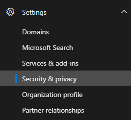

Lista de comprobación de acceso de invitado a los equipos
==========================================

Use esta lista de comprobación que le ayudarán a habilitar y configurar la característica de acceso de invitado en Microsoft Teams según las preferencias de la organización.

## Comprender las limitaciones de los invitados

La experiencia de invitado tiene limitaciones por diseño. Asegúrese de que comprende la experiencia de invitado por lo que no intente corregir algo que no es un problema. Por ejemplo, aquí es una lista de algunas de las funciones que no está disponible para un invitado en Microsoft Teams:

- OneDrive para la empresa
- Búsqueda de personas fuera de los equipos
- Calendario, las reuniones programadas o detalles de la reunión
- RTC
- Gráfico de organización
- Crear o revisar un equipo
- Buscar un equipo
- Cargar archivos a una conversación entre dos persona

Para obtener más información, vea [¿Qué es la experiencia de invitado como](guest-experience.md) y [acceso de invitado en grupos de Office 365](https://support.office.com/article/guest-access-in-office-365-groups-bfc7a840-868f-4fd6-a390-f347bf51aff6).

### Acceso de invitado frente a acceso externo (federación de)

[!INCLUDE [guest-vs-external-access](includes/guest-vs-external-access.md)]

## Si los invitados están viendo errores de licencia

Acceso como invitado en Microsoft Teams usa Azure Active Directory empresarial para el negocio (B2B) y su modelo de licencia. Si está viendo errores de licencias, asegúrese de leer la Guía de licencias de B2B para comprender los requisitos de licencia que su organización tiene para que los usuarios puedan invitar a personas a la organización.

Recuerde los siguientes puntos:

- Para cada una de pago licencia de Azure AD que asignar a un usuario, los usuarios pueden invitar a un máximo de cinco usuarios invitados en la concesión de usuario externo.
- Los invitados tienen los usuarios fuera de la organización. No se puede agregar los empleados, contratistas in situ, los agentes en el sitio y así sucesivamente como invitados. El mismo se aplica a sus filiales.
- Las licencias de invitado se cuentan contra la organización invitar a. Tenga en cuenta esto al calcular el número de licencias que necesita.
- Las licencias se cuentan contra su organización si los usuarios invitados proceden de otro inquilino de Office 365 o usan sus direcciones de correo electrónico personal.

## □ Paso 1: configurar las opciones en Azure AD para empresas

1. Inicie sesión en https://portal.azure.com.
2. En el panel izquierdo, haga clic en **Azure Active directory** .
3. En **Administrar**, haga clic en **Configuración del usuario**.
4. **Los usuarios externos**, haga clic en **configuración de colaboración externa para administrar**.
5. En la página **configuración de colaboración externa** Asegúrese de que **pueden invitar los miembros** está establecida en **Sí**.

      

    Para admitir a invitados, **pueden invitar los miembros** se debe establecer en **Sí**. 
   
> [!NOTE] 
> Si establece **pueden invitar los miembros** en **No** y, a continuación, habilitar el acceso de invitado en grupos de Office 365 y Microsoft Teams, los administradores pueden controlar las invitaciones de invitado a su directorio. Después de que los invitados se encuentran en el directorio, puede agregarse a los equipos de los miembros sin permisos de administrador que son propietarios del equipo.

Para obtener más información, consulte [Autorizar el acceso de invitado en Microsoft Teams](Teams-dependencies.md).

## □ Paso 2: configurar grupos de Office 365

1. En el centro de administración de Microsoft 365, vaya a **configuración de** > **& Services Add-ins** > **Grupos de Office 365**.
2. Asegúrese de **Permitir que los miembros del grupo fuera el contenido de grupo de acceso de la organización** está establecido en **On**. Si esta opción está desactivada, los invitados no puedan tener acceso a cualquier contenido de grupo.
3. Asegúrese de **que permitir a los propietarios de grupo agregar personas fuera de la organización a grupos** se establece en **On**. Si esta opción está desactivada, los propietarios de equipo no puedan agregar a nuevos invitados. Como mínimo, este valor debe ser sesión en compatibilidad con acceso como invitado.

     

Para obtener instrucciones detalladas acerca de cómo configurar estas opciones, vea la sección "Office 365 grupos" en [autorizar el acceso de invitado en los equipos de Microsoft](Teams-dependencies.md)y [Administrar acceso como invitado en grupos de Office 365](https://support.office.com/en-us/article/manage-guest-access-in-office-365-groups-9de497a9-2f5c-43d6-ae18-767f2e6fe6e0?appver=MOE150) .
 

## □ Paso 3: habilitar el acceso de invitado en el nivel de inquilino

Como mínimo, debe activar el acceso de invitado para Microsoft Teams en el **Centro de administración de equipos de Microsoft**. 

1. En el centro de administración de equipos, seleccione **configuración de toda la organización** > **acceso de invitado**.
2. Configurar el conmutador de **Permitir el acceso de invitado en los equipos de Microsoft** **activado**.

    

3. En esta misma página, configure las demás opciones de invitado que necesita.
4. Haga clic en **Guardar**.

Para obtener instrucciones detalladas, vea [Activar o desactivar el acceso de invitado a los equipos de Microsoft](set-up-guests.md).

## □ Paso 4: configurar el uso compartido en Office 365 

Asegúrese de que los usuarios pueden agregar a invitados. Aquí es cómo:

1. En el centro de administración de Microsoft 365, vaya a **configuración de** > **privacy & de seguridad**.

     

2. En **el uso compartido**, seleccione **Editar**.

     
 
3. **Permitir a los usuarios agregar a nuevos invitados a esta organización** se establece en **On**y, a continuación, haga clic en **Guardar**.

     
 
> [!NOTE]
> Esta configuración es equivalente a la configuración **pueden invitar los miembros** en **Configuración del usuario** > **a los usuarios externos** en Azure AD.  

## □ Paso 5: comprobar la configuración de uso compartido en SharePoint

1. Inicie sesión en el Centro de administración de Office 365.
2. Haga clic en **Centro de administración**y, a continuación, seleccione **SharePoint**.
3. En el centro de administración de SharePoint, seleccione **Compartir**.
4. Asegúrese de que la opción para **no permitir el uso compartido de fuera de su organización** *no* está seleccionado.
 
     

## □ Paso 6: habilitar la configuración específica para canales 

En la aplicación de los equipos, en el nivel de equipo individual, configurar permisos de invitado para que los invitados pueden crear, actualizar y eliminar canales. Además de los administradores, los propietarios de equipo pueden configurar esta opción.

Para obtener más información, vídeos de procedimientos, vea [acceso como invitado en los equipos de Microsoft](guest-access.md).

## Solución de problemas

Si tiene problemas con la adición de invitados en Microsoft Teams, consulte la [Guía de solución de problemas de acceso de invitado](https://techcommunity.microsoft.com/t5/Microsoft-Teams/Guest-Access-Troubleshooting-Guide/td-p/119797).

