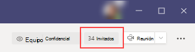

# Experiencia de invitado en TeamsGuest experience in Teams

Cuando se invita a un invitado a unirse a un equipo, recibe un mensaje de correo electrónico de bienvenida.When a guest is invited to join a team, they receive a welcome email message. Este mensaje incluye cierta información sobre el equipo y qué esperar ahora que sea miembro.This message includes some information about the team and what to expect now that they're a member. El invitado debe aceptar la invitación seleccionando **Abrir Microsoft Teams** en el mensaje de correo electrónico para que puedan acceder al equipo y a sus canales.The guest must accept the invitation by selecting **Open Microsoft Teams** in the email message before they can access the team and its channels.
    

    
Todos los miembros del equipo ven un mensaje en el hilo del canal en el que se anuncia que el propietario del equipo ha agregado a un invitado y da el nombre del invitado.All team members see a message in the channel thread announcing that the team owner has added a guest and providing the guest's name. Todos los miembros del equipo pueden identificar con facilidad quién es un invitado.Everyone on the team can identify easily who is a guest. Una etiqueta en la esquina superior derecha del subproceso de canal indica el número de invitados en el equipo y aparece una etiqueta **(invitado)** junto al nombre de cada invitado.A tag in the upper-right corner of the channel thread indicates the number of guests on the team and a **(Guest)** label appears next to each guest's name.

Consulte estos vídeos sobre la experiencia de invitado en Teams:Check out these videos about the guest experience in Teams:
- [Unirse a un equipo como invitadoJoin a team as a guest](https://support.office.com/article/join-a-team-as-a-guest-928d1eef-61e2-49ec-b754-c2fe86b34824)
- [Unirse a una reunión de equipos con invitadosJoin a Teams meeting with guests](https://support.office.com/article/join-a-company-meeting-a120c282-063d-46b8-b973-851197ab75d8)

## Comparación de las capacidades de miembro de equipo y de invitadoComparison of team member and guest capabilities

En la siguiente tabla se compara la funcionalidad de Teams disponible para los miembros del equipo de una organización y sus invitados.The following table compares the Teams functionality available for an organization's team members and its guests. Los administradores de equipos controlan las características disponibles para los invitados.Teams admins control the features available to guests.

| Funcionalidad en Microsoft TeamsCapability in Teams | Usuario de Microsoft Teams de la organizaciónTeams user in the organization | InvitadoGuest |
|:-----|:-----|:-----|
|Crear un canalCreate a channel     *Los propietarios del equipo controlan este parámetro.**Team owners control this setting.*    |&#x2713;&#x2713;|&#x2713;&#x2713;|
|Participar en un chat privadoParticipate in a private chat    |&#x2713;&#x2713;|&#x2713;&#x2713;|
|Participar en una conversión del canalParticipate in a channel conversation    |&#x2713;&#x2713;|&#x2713;&#x2713;|
|Publicar, eliminar y editar mensajesPost, delete, and edit messages    |&#x2713;&#x2713;|&#x2713;&#x2713;|
|Compartir un archivo del canalShare a channel file    |&#x2713;&#x2713;|&#x2713;&#x2713;|
|Obtener acceso a archivos de SharePointAccess SharePoint files  |&#x2713;&#x2713;|&#x2713;&#x2713;|
|Adjuntar archivosAttach files  |&#x2713;&#x2713;|Solo chats de equipoTeam chats only|
|Descargar archivos de conversaciones privadasDownload private chat files  |&#x2713;&#x2713;|&#x2713;&#x2713;|
|Buscar en archivosSearch within files  |&#x2713;&#x2713;||
|Compartir un archivo del chatShare a chat file    |&#x2713;&#x2713;||
|Agregar aplicaciones (fichas, bots o conectores)Add apps (tabs, bots, or connectors)    |&#x2713;&#x2713;||
|Crear reuniones o programaciones de AccessCreate meetings or access schedules    |&#x2713;&#x2713;||
|Obtener acceso al almacenamiento de OneDrive para la empresaAccess OneDrive for Business storage    |&#x2713;&#x2713;||
|Crear directivas de acceso de invitados a equipos y canales para todos los inquilinosCreate tenant-wide and teams/channels guest access policies    |&#x2713;&#x2713;||
|Invitar a un usuario fuera del dominio de la organización de Microsoft 365 o de Office 365Invite a user outside the Microsoft 365 or Office 365 organization's domain    *Los propietarios del equipo controlan este parámetro.**Team owners control this setting.*      |&#x2713;&#x2713;||
|Crear un equipoCreate a team    |&#x2713;&#x2713;||
|Descubrir un equipo público y unirse a élDiscover and join a public team    |&#x2713;&#x2713;||
|Ver el organigramaView organization chart    |&#x2713;&#x2713;||
|Usar traducción en líneaUse inline translation    |&#x2713;&#x2713;||
|Convertirse en propietario del equipoBecome team owner    |&#x2713;&#x2713;||

En la tabla siguiente se muestran las características de llamadas y reuniones disponibles para los invitados, en comparación con otros tipos de usuarios.The following table shows the calling and meeting features available to guests, compared to other types of users.

| Característica de llamadasCalling feature | InvitadoGuest | Usuario E1 y E3E1 and E3 user | E5 y usuarios de la telefonía IP empresarialE5 and Enterprise Voice user |
| --------------- | ----- | -------------- | -------------- |
| Llamadas VOIPVOIP calling | SíYes | SíYes | SíYes |
| Llamadas grupalesGroup calling | SíYes | SíYes | SíYes |
| Controles de llamadas principales compatibles (mantener, silenciar, activar o desactivar vídeo, pantalla compartida)Core call controls supported (hold, mute, video on/off, screen sharing) | SíYes | SíYes | SíYes |
| Transferir destinoTransfer target | SíYes | SíYes | SíYes |
| Puede transferir una llamadaCan transfer a call | SíYes | SíYes | SíYes |
| Permite la transferencia de asesoríaCan consultative transfer | SíYes | SíYes | SíYes |
| Puede agregar otros usuarios a una llamada a través de VOIPCan add other users to a call via VOIP | SíYes | SíYes | SíYes |
| Puede añadir usuarios por número de teléfono a una llamadaCan add users by phone number to a call | NoNo | NoNo | SíYes |
| Destino de reenvíoForward target | NoNo | SíYes | SíYes |
| Destino del grupo de llamadasCall group target | NoNo | SíYes | SíYes |
| Objetivo sin contestarUnanswered target | NoNo | SíYes | SíYes |
| Puede ser el objetivo de una llamada federadaCan be the target of a federated call | NoNo | SíYes | SíYes |
| Puede hacer una llamada federadaCan make a federated call | NoNo | SíYes | SíYes |
| Puede desviar sus llamadas inmediatamenteCan immediately forward their calls | NoNo | NoNo | SíYes |
| Puede llamar simultáneamente a sus llamadasCan simultaneously ring their calls | NoNo | NoNo | SíYes |
| Puede enrutar las llamadas no contestadasCan route their unanswered calls | NoNo | NoNo | SíYes |
| Las llamadas perdidas pueden ir al buzón de vozMissed calls can go to voicemail | NoNo | No1No1 |SíYes |
| Tener un número de teléfono que pueda recibir llamadasHave a phone number that can receive calls | NoNo | NoNo | SíYes |
| Puede marcar números de teléfonoCan dial phone numbers | NoNo | NoNo | SíYes |
| Puede acceder a la configuración de llamadasCan access call settings | NoNo | NoNo | SíYes |
| Puede cambiar el saludo del buzón de vozCan change voicemail greeting | NoNo | No1No1 | SíYes |
| Puede cambiar los tonos de timbreCan change ringtones | NoNo | NoNo  | SíYes |
| Compatible con TTYSupports TTY | NoNo | NoNo | SíYes |
| Puede tener delegadosCan have delegates | NoNo | NoNo | SíYes |
|  Puede ser un delegadoCan be a delegate | NoNo | NoNo | SíYes |

1 esta característica estará disponible próximamente.1 This feature will be available soon.

> [!NOTE]
> La Directiva de **restricciones de acceso de usuario invitado** en Azure Active Directory (Azure ad) determina los permisos para los invitados de su directorio.The **Guest user access restrictions** policy in Azure Active Directory (Azure AD) determines permissions for guests in your directory. Existen tres opciones de directiva.There are three policy options.
>  - La configuración **Los usuarios invitados tienen el mismo acceso que los miembros (más inclusiva)** significa que los invitados tienen el mismo acceso a los datos del directorio como los usuarios habituales del directorio.The **Guest users have the same access as members (most inclusive)** setting means guests have the same access to directory data as regular users in your directory.
>  - La configuración **Los usuarios invitados tienen acceso limitado a las propiedades y la pertenencia a los objetos de directorio** significa que los invitados no tienen permisos para determinadas tareas de directorio, como la enumeración de usuarios, grupos u otros recursos de directorio con Microsoft Graph.The **Guest users have limited access to properties and membership of directory objects** settings means that guests don't have permissions for certain directory tasks, such as enumerating users, groups, or other directory resources using Microsoft Graph.
>  - La configuración **El acceso de usuarios invitados está restringido a las propiedades y la pertenencia a sus propios objetos de directorio (más restrictiva)** significa que los invitados solo puedan tener acceso a sus propios objetos de directorio.The **Guest user access is restricted to properties and memberships of their own directory objects (most restrictive)** setting means guests can only access their own directory objects.
>
>Para obtener más información, vea [¿Cuáles son los permisos de usuario predeterminados en Azure Active Directory?](https://go.microsoft.com/fwlink/?linkid=2135493)To learn more, see [What are the default user permissions in Azure Active Directory?](https://go.microsoft.com/fwlink/?linkid=2135493)

## Temas relacionadosRelated topics

[Abandonar una organización como invitadoLeave an organization as a guest](https://docs.microsoft.com/azure/active-directory/b2b/leave-the-organization)
