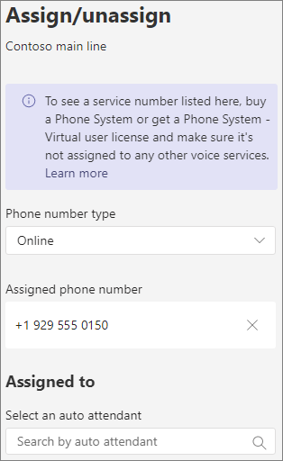

#### Demostración de vídeoVideo demonstration

En este vídeo se muestra un ejemplo básico de cómo crear un operador automático en Teams.This video shows a basic example of how to create an auto attendant in Teams.

> [!VIDEO https://www.microsoft.com/videoplayer/embed/RWEnCG?autoplay=false]

#### Antes de empezarBefore you begin

Obtenga los números de servicio (los números de servicio son un tipo especial de número de teléfono que usan los operadores automáticos) que necesita para los operadores automáticos a los que desea obtener acceso mediante la marcación directa desde fuera de su organización.Get the service numbers (service numbers are a special type of phone number that are used by auto attendants) that you need for the auto attendants that you want to be accessible by direct dialing from outside your organization. Esto puede incluir [la transferencia de números de otro proveedor](../phone-number-calling-plans/transfer-phone-numbers-to-teams.md) o la solicitud de nuevos números de [servicio.](../getting-service-phone-numbers.md)This might include [transferring numbers from another provider](../phone-number-calling-plans/transfer-phone-numbers-to-teams.md) or [requesting new service numbers](../getting-service-phone-numbers.md).

A cada operador automático se le debe asignar una Sistema telefónico: licencia de usuario virtual.Each auto attendant needs to be assigned a Phone System - Virtual User license. Al comprar Business Voice, también recibió una serie de Sistema telefónico: licencias de usuario virtual, por lo que probablemente no necesite solicitar más.When you purchased Business Voice, you also received a number of Phone System - Virtual User licenses, so you probably don't need to request more. Sin embargo, si necesita más en el futuro, puede obtenerlas siguiendo las instrucciones de [Sistema telefónico - Licencia de usuario virtual](../teams-add-on-licensing/virtual-user.md).However, if you need more in the future, you can get them by following the instructions in [Phone System - Virtual User license](../teams-add-on-licensing/virtual-user.md).

Si desea que la ruta de operador automático  llame de forma diferente los días festivos, cree los días festivos que quiera usar antes de crear el operador automático.If you want to have your auto attendant route calls differently on holidays, then [create the holidays that you want to use](../set-up-holidays-in-teams.md) before you create the auto attendant.

#### Siga estos pasos para configurar el operador automáticoFollow these steps to set up your auto attendant

# [Paso 1   Teléfono númeroStep 1 Phone number](#tab/phone-number)

> [!NOTE]
> Si sigue los pasos para configurar Business Voice por primera vez y está en el paso **6:** Configurar un operador automático para el número de teléfono principal de su empresa, ya ha terminado los pasos de esta pestaña. Ir a la pestaña siguiente: [Información general del operador automático.](?tabs=general-info#steps)If you're following the steps to set up Business Voice for the first time and you're on **Step 6: Set up an auto attendant for your company's main phone number**, you've already finished the steps on this tab. Move to the next tab: [Auto attendant general info](?tabs=general-info#steps).

Cada operador automático que cree requiere una cuenta de recursos.Each auto attendant that you create requires a resource account. Esto es similar a una cuenta de usuario, excepto que la cuenta está asociada con un operador automático o una cola de llamadas en lugar de una persona.This is similar to a user account, except the account is associated with an auto attendant or call queue instead of a person. En este paso, crearemos la cuenta, le asignaremos una licencia *Microsoft 365 Sistema telefónico usuario virtual* y, a continuación, asignaremos un número de servicio.In this step, we'll create the account, assign it a *Microsoft 365 Phone System - Virtual User* license, and then assign a service number.

### Crear una cuenta de recursosCreate a resource account

Puede crear una cuenta de recursos en el centro Teams administración.You can create a resource account in the Teams admin center.

1. En el Teams de administración, expanda **Configuración de** toda la organización y, a continuación, haga clic en Cuentas **de recursos.**In the Teams admin center, expand **Org-wide settings**, and then click **Resource accounts**.

2. Haga clic en **Agregar**.Click **Add**.

3. En el **panel Agregar cuenta de** recursos, rellene **Nombre** para mostrar, Nombre de **usuario** y elija **Operador automático** para el tipo de **cuenta Recurso**In the **Add resource account** pane, fill out **Display name**, **Username**, and choose **Auto attendant** for the **Resource account type**

    

4. Haga clic en **Guardar**.Click **Save**.

    La nueva cuenta aparecerá en la lista de cuentas.The new account will appear in the list of accounts.

    

### Asignar una licenciaAssign a license

Debe asignar una licencia *Microsoft 365 Sistema telefónico usuario virtual* a la cuenta de recursos.You must assign a *Microsoft 365 Phone System - Virtual User* license to the resource account.

1. En el Microsoft 365 de administración, haga clic en la cuenta de recursos a la que desea asignar una licencia.In the Microsoft 365 admin center, click the resource account to which you want to assign a license.

2. En la **pestaña Licencias y aplicaciones,** en **Licencias,** **seleccione Microsoft 365 Sistema telefónico - Usuario virtual.**On the **Licenses and Apps** tab, under **Licenses**, select **Microsoft 365 Phone System - Virtual User**.

3. Haga clic **en Guardar cambios.**Click **Save changes**.

    

### Asignar un número de servicioAssign a service number

Si necesita que este operador automático sea accesible mediante un número de teléfono, asigne ese número a la cuenta de recursos.If you need this auto attendant to be reachable by a phone number, then assign that number to the resource account.

1. En el Teams de administración,  en la página Cuentas de recursos, seleccione la cuenta de recursos a la que desea asignar un número de servicio y, a continuación, haga clic en Asignar **o desasignación.**In the Teams admin center, on the **Resource accounts** page, select the resource account to which you want to assign a service number, and then click **Assign/unassign**.

2. En el **Teléfono de tipo de número,** elija el tipo de número que desea usar.In the **Phone number type** dropdown, choose the type of number that you want to use.

3. En el **cuadro Número de teléfono** asignado, busque el número que desea usar y haga clic en **Agregar.**In the **Assigned phone number** box, search for the number you want to use and click **Add**.

    

4. Haga clic en **Guardar**.Click **Save**.

> [!div class="nextstepaction"]
> [Paso 2: Información general del operador automático >Step 2 - Auto attendant general info >](?tabs=general-info#steps)

# [Paso 2   Información general del operadorStep 2 Attendant general info](#tab/general-info)

Para configurar un operador automáticoTo set up an auto attendant

1. En el Teams de administración, expanda **Voz,** haga clic en **Operadores automáticos** y, a continuación, haga clic en **Agregar.**In the Teams admin center, expand **Voice**, click **Auto attendants**, and then click **Add**.

2. Escriba un nombre para el operador automático en el cuadro de la parte superior.Type a name for the auto attendant in the box at the top.

3. Si desea designar un operador, especifique el destino de las llamadas al operador.If you want to designate an operator, specify the destination for calls to the operator. Esto es opcional (pero recomendado).This is optional (but recommended). Puede establecer la opción **Operador** para permitir a los autores de llamadas salir de los menús y hablar con una persona designada.You can set the **Operator** option to allow callers to break out of the menus and speak to a designated person.

4. Especifique la zona horaria para este operador automático.Specify the time zone for this auto attendant. La zona horaria se usa para calcular el horario laboral si crea un flujo de llamadas independiente para horas posteriores.The time zone is used for calculating business hours if you create a separate call flow for after hours.

5. Especifique un idioma para este operador automático.Specify a language for this auto attendant. Este es el idioma que se usará para las solicitudes de voz generadas por el sistema.This is the language that will be used for system-generated voice prompts.

6. Elija si desea habilitar las entradas de voz.Choose if you want to enable voice inputs. Cuando se habilita, el nombre de cada opción de menú se convierte en una palabra clave de reconocimiento de voz.When enabled, the name of every menu option becomes a speech-recognition keyword. Por ejemplo, los autores de llamadas pueden decir "Uno" para seleccionar la opción de menú asignada a la tecla 1, o pueden decir "Ventas" para seleccionar la opción de menú denominada "Ventas".For example, callers can say "One" to select the menu option mapped to key 1, or they can say "Sales" to select the menu option named "Sales."

    

7. Haga clic en **Siguiente**.Click **Next**.

> [!div class="nextstepaction"]
> [Paso 3: flujo de llamadas >Step 3 - Call flow >](?tabs=call-flow#steps)

# [Paso 3   Flujo de llamadasStep 3 Call flow](#tab/call-flow)

Elegir las opciones de flujo de llamadasChoose your call flow options

1. Elija si desea reproducir un saludo cuando el operador automático responda a una llamada.Choose if you want to play a greeting when the auto attendant answers a call.

    Si selecciona **Reproducir un archivo de audio,** puede usar el botón **Upload** archivo para cargar un mensaje de saludo grabado guardado como audio en . WAV, .MP3 o . Formato WMA.If you select **Play an audio file** you can use the **Upload file** button to upload a recorded greeting message saved as audio in .WAV, .MP3, or .WMA format. La grabación no puede ser superior a 5 MB.The recording can be no larger than 5 MB.

    Si selecciona Escribir un mensaje **de** saludo, el sistema leerá el texto que escriba (hasta 1000 caracteres) cuando el operador automático responda a una llamada.If you select **Type a greeting message** the system will read the text you the text that you type (up to 1000 characters) when the auto attendant answers a call.

    

2. Elija cómo desea enrutar la llamada.Choose how you want to route the call.

    Si selecciona **Desconectar,** el operador automático colgará la llamada.If you select **Disconnect**, the auto attendant will hang up the call.

    Si selecciona **Redirigir llamada,** puede elegir uno de los destinos de enrutamiento de llamadas.If you select **Redirect call**, you can choose one of the call routing destinations.

    Si selecciona Opciones **de menú** Reproducir, puede elegir Reproducir un archivo de **audio** o Escribir en un mensaje de saludo y, **a** continuación, elegir entre las opciones de menú y la búsqueda de directorio.If you select **Play menu options**, you can choose to **Play an audio file** or **Type in a greeting message** and then choose between menu options and directory search.

    

3. Si desea que los autores de llamadas usen teclas de marcado para navegar, en Establecer opciones de **menú,** elija lo que quiere que suceda cuando los autores de llamadas presionen una tecla de marcado.If you want callers to use dial keys to navigate, then under **Set menu options**, choose what you want to happen when callers press a dial key. (Si va a crear este operador automático como directorio de la empresa, deje las opciones de la tecla de marcado en blanco).(If you're creating this auto attendant as a company directory, leave the dial key options blank.)

    Puede establecer cualquiera de las teclas de marcado en los siguientes destinos:You can set any of the dial keys to the following destinations:

    - **Persona de la organización:** una persona de su organización que puede recibir llamadas de voz.**Person in the organization** - a person in your organization who is able to receive voice calls.
    - **Aplicación de voz:** otro operador automático o una cola de llamadas.**Voice app** - another auto attendant or a call queue.
    - **Número de teléfono externo:** cualquier número de teléfono.**External phone number** - any phone number. Use este formato: +[código de país][código de área][número de teléfono]Use this format: +[country code][area code][phone number]
    - **Correo de** voz: el buzón de voz asociado a Microsoft 365 grupo que especifique.**Voicemail** - the voice mailbox associated with a Microsoft 365 group that you specify.
    - **Operador:** el operador definido para el operador automático.**Operator** - the operator defined for the auto attendant. Definir un operador es opcional.Defining an operator is optional. El operador se puede definir como cualquiera de los otros destinos de esta lista.The operator can be defined as any of the other destinations in this list.

    Se recomienda establecer 0 clave para el operador.We recommend setting 0 key to the operator.

    Para cada opción de menú, especifique lo siguiente:For each menu option, specify the following:

    - **Tecla de marcado:** la tecla del teclado del teléfono para acceder a esta opción.**Dial key** - the key on the telephone keypad to access this option.

    - **Comando de voz:** define el comando de voz que un autor de la llamada puede dar para obtener acceso a esta opción, si las entradas de voz están habilitadas.**Voice command** - defines the voice command that a caller can give to access this option, if voice inputs are enabled. Puede contener varias palabras como "Servicio al cliente" o "Operaciones y motivos".It can contain multiple words like "Customer Service" or "Operations and Grounds." 

    - **Redirigir a:** a dónde quiere que vaya la llamada cuando los autores de llamadas elijan esta opción.**Redirect to** - where you want the call to go when callers choose this option. Si va a redirigir a un operador automático o a una cola de llamadas, elija la cuenta de recursos asociada.If you are redirecting to an auto attendant or call queue, choose the resource account associated with it.

    

4. Si desea usar este operador automático como directorio de la empresa, en **Búsqueda** de directorios, **seleccione Marcar por nombre.**If you want to use this auto attendant as a company directory, then under **Directory search**, select **Dial by name**. Al habilitar esta opción, los autores de llamadas pueden decir el nombre del usuario o escribirlo en el teclado del teléfono.When you enable this option, callers can say the user's name or type it on the telephone keypad. Cualquier usuario en línea con una Sistema telefónico es un usuario apto y se puede encontrar con Marcado por nombre.Any online user with a Phone System license is an eligible user and can be found with Dial by name. 

    (Puede elegir Marcar **por extensión,** pero la extensión debe configurarse en Azure Active Directory).(You can choose **Dial by extension**, however the extension must be configured in Azure Active Directory.)

5. Una vez que haya seleccionado una opción **de búsqueda de** directorio, haga clic en **Siguiente.**Once you have selected a **Directory search** option, click **Next**.

> [!div class="nextstepaction"]
> [Paso 4: flujo de llamadas después de horas >Step 4 - After hours call flow >](?tabs=after-hours#steps)

# [Paso 4   Después de horasStep 4 After hours](#tab/after-hours)

El horario laboral se puede establecer para cada operador automático.Business hours can be set for each auto attendant. Si el horario laboral no está establecido, todos los días y todas las horas del día se consideran horario laboral porque una programación 24/7 está establecida de forma predeterminada.If business hours aren't set, all days and all hours in the day are considered business hours because a 24/7 schedule is set by default. El horario laboral se puede establecer con descansos en el tiempo durante el día y todas las horas que no se establecen como horas laborables se consideran fuera del horario laboral.Business hours can be set with breaks in time during the day, and all of the hours that are not set as business hours are considered after-hours. Puede establecer diferentes opciones de administración de llamadas entrantes y saludos para las horas adicionales.You can set different incoming call-handling options and greetings for after-hours.

Según cómo haya configurado los operadores automáticos y las colas de llamadas, es posible que solo tenga que especificar el enrutamiento de llamadas adicionales para los operadores automáticos con números de teléfono directos.Depending on how you have configured your auto attendants and call queues, you may only need to specify after-hours call routing for auto attendants with direct phone numbers.

Si quiere un enrutamiento de llamadas independiente para las personas que llaman fuera del horario laboral, especifique su horario laboral para cada día.If you want separate call routing for after-hours callers, then specify your business hours for each day. Haga **clic en Agregar nueva hora** para especificar varios conjuntos de horas para un día determinado, por ejemplo, para especificar un descanso para el almuerzo.Click **Add new time** to specify multiple sets of hours for a given day, for example, to specify a lunch break.

Una vez que haya especificado el horario laboral, elija las opciones de enrutamiento de llamadas para horas adicionales.Once you have specified your business hours, then choose your call routing options for after hours. Las mismas opciones están disponibles que para el enrutamiento de llamadas en horario laboral que especificó en **el paso 3 : flujo de llamadas.**The same options are available as for the business hours call routing that you specified in **Step 3 - Call flow**.

Haga **clic en** Siguiente cuando haya terminado.Click **Next** when you're done.

> [!div class="nextstepaction"]
> [Paso 5: flujo de llamadas navideñas >Step 5 - Holiday call flow >](?tabs=holidays#steps)

# [Paso 5   Días festivosStep 5 Holidays](#tab/holidays)

Puede hacer que las llamadas a su operador automático se enrute de forma diferente en días festivos que en otros días.You can have calls to your auto attendant routed differently on holidays than on other days. (Si no desea tener un flujo de llamadas diferente para días festivos, puede omitir este paso).(If you don't want to have a different call flow for holidays, you can skip this step.)

El operador automático puede tener un flujo de llamadas para cada día festivo que haya configurado.Your auto attendant can have a call flow for each holiday you've set up. Puede agregar un máximo de 20 días festivos programados a cada operador automático.You can add up to 20 scheduled holidays to each auto attendant.

1. En la página Configuración de llamadas navideñas, haga clic **en Agregar.**On the Holiday call settings page, click **Add**.

2. Escriba un nombre para esta configuración navideña.Type a name for this holiday setting.

3. En la **lista desplegable** Vacaciones, elija los días festivos que quiera usar.From the **Holiday** dropdown, choose the holiday that you want to use.

4. Elija el tipo de saludo que desea usar.Choose the type of greeting that you want to use.

    

5. Elija si desea desconectar **o** **redirigir** la llamada.Choose if you want to **Disconnect** or **Redirect** the call.

6. Si elige redirigir, elija el destino de enrutamiento de llamadas para la llamada.If you chose to redirect, choose the call routing destination for the call.

    

7. Haga clic en **Guardar**.Click **Save**.

    Repita el procedimiento según sea necesario para cada vacaciones adicionales.Repeat the procedure as needed for each additional holiday.

    

    Cuando haya agregado todos los días festivos, haga clic en **Siguiente.**When you've added all your holidays, click **Next**.

> [!div class="nextstepaction"]
> [Paso 6: elija quién está en el directorio >Step 6 - Choose who's in the directory >](?tabs=dial-scope#steps)

# [Paso 6   Miembros del directorioStep 6 Directory members](#tab/dial-scope)

El *ámbito de marcado* define qué usuarios están disponibles en el directorio cuando un autor de la llamada usa marcado por nombre o marcado por extensión.The *dial scope* defines which users are available in the directory when a caller uses dial-by-name or dial-by-extension. El valor predeterminado de **Todos los usuarios en línea** incluye todos los usuarios de su organización que son usuarios en línea con una Sistema telefónico licencia.The default of **All online users** includes all users in your organization that are Online users with a Phone System license.

Puede incluir o excluir usuarios  específicos seleccionando  Grupo de usuarios personalizados en Incluir o Excluir y eligiendo uno o varios grupos de Microsoft 365, listas de distribución o grupos de seguridad. You can include or exclude specific users by selecting **Custom user group** under **Include** or **Exclude** and choosing one or more Microsoft 365 groups, distribution lists, or security groups. Por ejemplo, es posible que desee excluir ejecutivos de su organización del directorio de marcado.For example, you might want to exclude executives in your organization from the dialing directory. (Si un usuario está en ambas listas, se excluirá del directorio).(If a user is in both lists, they will be excluded from the directory.)

> [!NOTE]
> Un nuevo usuario puede tardar hasta 36 horas en aparecer en el directorio.It might take up to 36 hours for a new user to have their name listed in the directory.

Cuando haya terminado de configurar el ámbito de marcado, haga clic en **Siguiente.**When you're done setting the dial scope, click **Next**.

> [!div class="nextstepaction"]
> [Paso 7: Asignar una cuenta de recursos >Step 7 - Assign a resource account >](?tabs=resource-accounts#steps)

# [Paso 7   Cuentas de recursosStep 7 Resource accounts](#tab/resource-accounts)

Todos los operadores automáticos deben tener una cuenta de recursos asociada.All auto attendants must have an associated resource account.  Los operadores automáticos de primer nivel necesitarán al menos una cuenta de recursos que tenga un número de servicio asociado.First level auto attendants will need at least one resource account that has an associated service number. Si lo desea, puede asignar varias cuentas de recursos a un operador automático, cada una con un número de servicio independiente.If you wish, you can assign several resource accounts to an auto attendant, each with a separate service number.

Para agregar una cuenta de recursosTo add a resource account

1. Haga **clic en** Agregar y busque la cuenta que desea agregar.Click **Add** and search for the account that you want to add. Haga **clic en Agregar** y, a continuación, haga clic en **Agregar.**Click **Add**, and then click **Add**.

    

2. Cuando haya terminado de agregar cuentas de servicio, haga clic en **Enviar.**When you have finished adding service accounts, click **Submit**.

    

    Esto completa la configuración del operador automático.This completes the auto attendant configuration.

---
