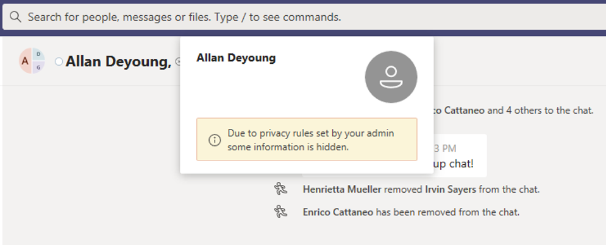
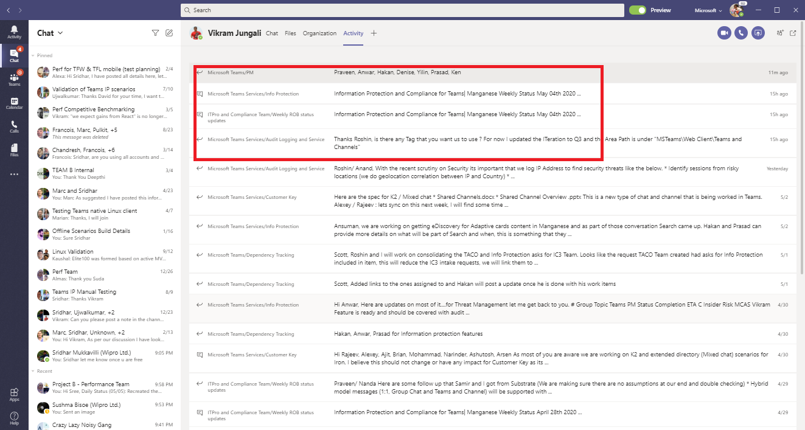

# Barreras de la información en Microsoft Teams

Las barreras de información (IB) son directivas que un administrador puede configurar para evitar que los usuarios o grupos se comuniquen entre sí. Esto es útil si, por ejemplo, un departamento está manejando información que no debe compartir con otros departamentos o que un grupo necesita impedir, o aislar, comunicarse con cualquier persona fuera de ese grupo.

> [!NOTE]
> - Los grupos de barrera de información no se pueden crear en todos los inquilinos.
> - En la versión 1, no se admite el uso de bots para agregar usuarios.
> - Los canales privados son compatibles con las directivas de la barrera de información que se configuran.
> - Nuevo: la compatibilidad con la barrera de información para el sitio de SharePoint conectado a teams ahora está en vista previa privada. Haz clic [aquí](https://forms.office.com/Pages/ResponsePage.aspx?id=v4j5cvGGr0GRqy180BHbR3-O9WDTKhhDtgWfphwS9YhUM0hJNklNRkZKMlhLNDRZNzlEQlVDSjdZVi4u) para participar en la versión preliminar privada.

Las directivas de barrera de información también evitan búsquedas y descubrimiento. Esto significa que si intentas comunicarte con alguien con quien no deberías comunicarte, no encontrarás ese usuario en el selector de personas.

## Información general

El impulsor principal para las barreras de la información viene de la industria de servicios financieros. La autoridad legal del sector financiero ([FINRA]( http://www.finra.org)) revisa las barreras de la información y los conflictos de intereses en las empresas miembros y proporciona instrucciones sobre cómo administrar dichos conflictos (FINRA 2241, [aviso normativo de investigación de deudas 15-31](http://www.finra.org/sites/default/files/Regulatory-Notice-15-31_0.pdf).  

Sin embargo, dado que la introducción de las barreras de la información, muchas otras áreas han descubierto que son útiles. Otros escenarios comunes son:

- Educación: los alumnos de una escuela no pueden buscar detalles de contacto de estudiantes de otros centros escolares.
- Oficio: mantenimiento de la confidencialidad de los datos obtenidos por el abogado de un cliente, desde el acceso a un abogado por la misma empresa que representa a un cliente diferente.
- Administración pública: el acceso a la información y el control están limitados en todos los departamentos y grupos.
- Servicios profesionales: un grupo de personas de una empresa solo puede chatear con un cliente o cliente específico a través de la Federación o el acceso de invitados durante el compromiso de un cliente.

Por ejemplo, Enrico pertenece al segmento bancario y Pradeep pertenece al segmento de asesores financieros. Enrico y Pradeep no se pueden comunicar entre sí porque la Directiva IB de la organización bloquea la comunicación y la colaboración entre estos dos segmentos. Sin embargo, Enrico y Pradeep pueden comunicarse con Lee en HR.

## Cuándo usar barreras de la información

Es posible que desee usar barreras de información en situaciones como estas:

- Debe evitarse que un equipo pueda comunicarse o compartir datos con otro equipo específico.
- Un equipo no debe comunicarse ni compartir datos con nadie fuera del equipo.

El servicio de evaluación de directivas de Information barrera determina si una comunicación cumple con las directivas de la barrera de información.

## Administración de directivas de la barrera de información

Las directivas de barrera de información se administran en el centro de cumplimiento de Microsoft 365 (SCC) con los cmdlets de PowerShell. Para obtener más información, consulte [definir directivas para las barreras de la información](https://docs.microsoft.com/office365/securitycompliance/information-barriers-policies).

> [!IMPORTANT]
> Antes de configurar o definir directivas, **debe habilitar la búsqueda de directorio en Microsoft Teams**. Espere al menos unas horas después de habilitar la búsqueda en el directorio de ámbito antes de configurar o definir directivas para barreras de información. [Más información sobre los requisitos previos para las barreras de la información](https://docs.microsoft.com/office365/securitycompliance/information-barriers-policies#prerequisites).

## Función de administrador de barreras de información

El rol de administración de cumplimiento de IB es el responsable de administrar las políticas de la barrera de información. Para obtener más información sobre este rol, consulte [permisos en el centro de cumplimiento de Microsoft 365](https://docs.microsoft.com/office365/securitycompliance/permissions-in-the-security-and-compliance-center).

## Desencadenadores de barrera de información

Las directivas de barrera de información se activan cuando se producen los siguientes eventos de Teams:

- **Se agregan miembros a un equipo** siempre que agregue un usuario a un equipo, la Directiva del usuario debe evaluarse contra las directivas de la barrera de información de otros miembros del equipo. Después de que el usuario se haya agregado correctamente, el usuario puede realizar todas las funciones del equipo sin más comprobaciones. Si la Directiva del usuario impide que se agreguen al equipo, el usuario no se mostrará en la búsqueda.

    

- **Se solicita una nueva conversación** : cada vez que se solicita una nueva conversación entre dos o más usuarios, se evalúa la conversación para asegurarse de que no infrinja ninguna política de barrera de la información. Si la conversación infringe una directiva de barrera de información, la conversación no se inicia.

    Este es un ejemplo de una conversación de 1:1.

     

    Este es un ejemplo de un chat grupal.

    

- **Un usuario ha recibido una invitación para unirse a una reunión** : cuando un usuario está invitado a unirse a una reunión, la Directiva del usuario se evalúa según las directivas de otros miembros del equipo y, si se produce una infracción, el usuario no podrá unirse a la reunión.

    

- **Una pantalla se comparte entre dos o más usuarios** , siempre que una pantalla se comparta entre dos o más usuarios, se debe evaluar el uso compartido de pantalla para asegurarse de que no infrinja las directivas de la barrera de información de otros usuarios. Si se infringe una directiva de barrera de información, no se permitirá el uso compartido de pantalla. 
 
    Este es un ejemplo de uso compartido de pantalla antes de que se aplique la Directiva. 

    

    Este es un ejemplo de uso compartido de pantalla después de la aplicación de la Directiva. Los iconos de compartir pantalla y llamada no están visibles.

    

- **Un usuario realiza una llamada de teléfono (VoIP) en Teams** , siempre que un usuario inicie una llamada de voz a otro usuario o grupo de usuarios, la llamada se evalúa para asegurarse de que no infrinja las directivas de la barrera de información de otros miembros del equipo. Si hay alguna infracción, la llamada se bloquea.
- **Los usuarios invitados en Teams** : las directivas de barrera de información se aplican también a los usuarios invitados de Teams. Si los usuarios invitados necesitan ser detectados en la lista global de direcciones de la organización, consulte [administrar el acceso de invitados en grupos de Microsoft 365](https://docs.microsoft.com/microsoft-365/admin/create-groups/manage-guest-access-in-groups). Una vez que los usuarios invitados sean detectados, puede [definir las políticas](https://docs.microsoft.com/office365/securitycompliance/information-barriers-policies)de la barrera de información.

## Impacto de los cambios de directiva en los chats existentes

Cuando el administrador de la Directiva de la barrera de información realiza cambios en una directiva o se activa un cambio de directiva debido a un cambio en el perfil de un usuario (como un cambio en el trabajo o un motivo similar), el servicio de evaluación de la Directiva de la barrera de información busca automáticamente en los miembros para asegurarse de que los miembros del equipo no infrinjan las directivas.

Si hay una conversación u otra comunicación entre usuarios, se establece una nueva Directiva o se modifica una directiva existente, el servicio evalúa las comunicaciones existentes para asegurarse de que se permitan las comunicaciones. 

- **1:1 chat** : Si ya no se permite la comunicación entre los dos usuarios (si se aplica una directiva que bloquea la comunicación a uno o ambos usuarios), se bloquea la comunicación adicional y la conversación de chat se convertirá en solo lectura. 

    Este es un ejemplo que muestra que la conversación está visible.

    

    Este es un ejemplo que muestra que la conversación está deshabilitada.

    

- **Conversación grupal** : Si ya no se permite la comunicación de un usuario al grupo (por ejemplo, si un usuario cambia de trabajo), el usuario, junto con el resto de los usuarios que infrinjan la Directiva, se puede quitar de la conversación grupal y no se permitirá la comunicación posterior con el grupo. El usuario puede seguir viendo conversaciones antiguas (que serán de solo lectura), pero no podrá ver ni participar en ninguna conversación nueva con el grupo. Si la directiva nueva o modificada que evita la comunicación se aplica a más de un usuario, los usuarios afectados por la Directiva se pueden quitar de la conversación grupal. Aún puede ver conversaciones antiguas.

En este ejemplo, Enrico movido a un departamento diferente dentro de la organización y se ha eliminado de la conversación grupal.

  

Enrico ya no puede enviar mensajes a la conversación grupal.

  

- **Equipo** : todos los usuarios que se han quitado del grupo se quitan del equipo y no podrán ver ni participar en conversaciones nuevas o existentes.

## Escenario: un usuario de un chat existente se bloquea

En la actualidad, los usuarios experimentan lo siguiente si una directiva de barrera de información bloquea a otro usuario:

- **Pestaña personas** : un usuario no puede ver usuarios bloqueados en la pestaña **contactos** .
- **Selector de personas** : los usuarios bloqueados no se verán en el selector de personas.

    
    
- **Ficha actividad** : Si un usuario visita la pestaña **actividad** de un usuario bloqueado, no aparecerá ninguna publicación. (La ficha **actividad** muestra solo las publicaciones de canal y no habría canales comunes entre los dos usuarios).

    Este es un ejemplo de la vista de pestaña actividad.

    

    Este es un ejemplo de la vista de pestaña actividad que está bloqueada.

    

- **Organigramas: si** un usuario accede a un organigrama en el que aparece un usuario bloqueado, dicho usuario no aparecerá en el organigrama y aparecerá un mensaje de error.
- **Tarjeta de contactos** : Si un usuario participa en una conversación y el usuario se bloquea posteriormente, otros usuarios verán un mensaje de error en lugar de la tarjeta de contactos cuando pasen el mouse sobre el nombre del usuario bloqueado. Las acciones que aparecen en la tarjeta (como llamadas y conversaciones) no estarán disponibles.
- **Contactos sugeridos** : los usuarios bloqueados no aparecen en la lista de contactos sugeridos (la lista de contactos inicial que aparece para los nuevos usuarios).
- **Contactos de chat** : un usuario puede ver los usuarios bloqueados en la lista de contactos de chats, pero los usuarios bloqueados se identificarán y la única acción que el usuario puede realizar es eliminarlos. El usuario también puede hacer clic en ellos para ver sus conversaciones pasadas.
- **Llama a contactos** : un usuario puede ver usuarios bloqueados en la lista de contactos de llamadas, pero los usuarios bloqueados se identificarán y la única acción que el usuario puede realizar es eliminarlos.

    Este es un ejemplo de un usuario bloqueado en la lista de contactos para llamadas.

    

    Este es un ejemplo de la conversación deshabilitada para un usuario en la lista contenido de la llamada.

    

- **Migración de Skype a teams** : durante una migración de Skype empresarial a Teams, todos los usuarios, incluso los que están bloqueados por las directivas de la barrera de información, se migrarán a teams y se administrarán según se describe anteriormente.

## Directivas de Teams y sitios de SharePoint

Cuando se crea un equipo, se aprovisiona un sitio de SharePoint y se asocia al equipo para la experiencia de los archivos. El acceso a este sitio de SharePoint y los archivos reconoce la IB de la organización, es decir, solo los usuarios cuya coincidencia con el segmento IB coinciden con el acceso a la Directiva IB. Incluso en el momento del uso compartido de archivos, se respeta la política IB.

Por ejemplo: en Contoso Bank Corporation, el usuario ' Sesha@contosobank.onmicrosoft.com ' pertenece a un segmento de banca de inversiones y el usuario ' Nikita@contosobank.onmicrosoft.com ' pertenece a un asesoramiento de segmentos. La Directiva IB de la organización bloquea la comunicación y la colaboración entre estos dos segmentos.
Cuando la Sesha de usuario crea un equipo para el segmento de banca de inversiones, el equipo y el sitio de SharePoint que los respalda solo serán accesibles para los usuarios del segmento de banca de inversión. Los usuarios no pueden acceder a ese sitio, incluso si tiene el vínculo a Nikita.

## Licencias y permisos necesarios

Para obtener más información, incluidos planes y precios, consulte [Guía de licencias](https://docs.microsoft.com/office365/servicedescriptions/microsoft-365-service-descriptions/microsoft-365-tenantlevel-services-licensing-guidance/microsoft-365-security-compliance-licensing-guidance).

## Más información

- Para obtener más información sobre las barreras de la información, consulte barreras de la [información](https://docs.microsoft.com/office365/securitycompliance/information-barriers).

- Para configurar las políticas de la barrera de información, consulte [definir políticas para las barreras de la información](https://docs.microsoft.com/office365/securitycompliance/information-barriers-policies).

- Para editar o quitar directivas de barrera de la información, consulte [Editar o quitar directivas](https://docs.microsoft.com/microsoft-365/compliance/information-barriers-edit-segments-policies)de la barrera de información.
