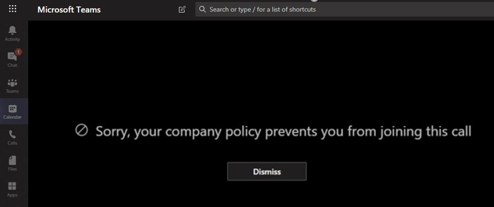

# Barreras de la información en Microsoft TeamsInformation barriers in Microsoft Teams

Las barreras de información (IB) son directivas que un administrador puede configurar para evitar que los usuarios o grupos se comuniquen entre sí.Information barriers (IB) are policies that an admin can configure to prevent individuals or groups from communicating with each other. Esto es útil si, por ejemplo, un departamento está manejando información que no debe compartir con otros departamentos o que un grupo necesita impedir, o aislar, comunicarse con cualquier persona fuera de ese grupo.This is useful if, for example, one department is handling information that shouldn't be shared with other departments or a group needs to be prevented, or isolated, from communicating with anyone outside of that group.

> [!NOTE]
> - Los grupos de barrera de información no se pueden crear en todos los inquilinos.Information barrier groups cannot be created across tenants.
> - En la versión 1, no se admite el uso de bots para agregar usuarios.Using bots to add users is not supported in version 1.
> - Los canales privados son compatibles con las directivas de la barrera de información que se configuran.Private channels are compliant to information barrier policies that you configure.
> - Nuevo: la compatibilidad con la barrera de información para el sitio de SharePoint conectado a teams ahora está en vista previa privada.New: Information barrier support for SharePoint site connected to Teams is now in Private Preview. Haz clic [aquí](https://forms.office.com/Pages/ResponsePage.aspx?id=v4j5cvGGr0GRqy180BHbR3-O9WDTKhhDtgWfphwS9YhUM0hJNklNRkZKMlhLNDRZNzlEQlVDSjdZVi4u) para participar en la versión preliminar privada.Click [here](https://forms.office.com/Pages/ResponsePage.aspx?id=v4j5cvGGr0GRqy180BHbR3-O9WDTKhhDtgWfphwS9YhUM0hJNklNRkZKMlhLNDRZNzlEQlVDSjdZVi4u) to participate in the private preview.

Las directivas de barrera de información también evitan búsquedas y descubrimiento.Information barrier policies also prevent lookups and discovery. Esto significa que si intentas comunicarte con alguien con quien no deberías comunicarte, no encontrarás ese usuario en el selector de personas.This means that if you attempt to communicate with someone you should not be communicating with, you will not find that user in the people picker.

## Información generalBackground

El impulsor principal para las barreras de la información viene de la industria de servicios financieros.The primary driver for information barriers comes from the financial services industry. La autoridad legal del sector financiero ([FINRA]( http://www.finra.org)) revisa las barreras de la información y los conflictos de intereses en las empresas miembros y proporciona instrucciones sobre cómo administrar dichos conflictos (FINRA 2241, [aviso normativo de investigación de deudas 15-31](http://www.finra.org/sites/default/files/Regulatory-Notice-15-31_0.pdf).The Financial Industry Regulatory Authority ([FINRA]( http://www.finra.org)) reviews information barriers and conflicts of interest within member firms and provides guidance as to how to manage such conflicts (FINRA 2241, [Debt Research Regulatory Notice 15-31](http://www.finra.org/sites/default/files/Regulatory-Notice-15-31_0.pdf).  

Sin embargo, dado que la introducción de las barreras de la información, muchas otras áreas han descubierto que son útiles.However, since introducing information barriers, many other areas have found them to be useful. Otros escenarios comunes son:Other common scenarios include:

- Educación: los alumnos de una escuela no pueden buscar detalles de contacto de estudiantes de otros centros escolares.Education: Students in one school aren't able to look up contact details for students of other schools.
- Oficio: mantenimiento de la confidencialidad de los datos obtenidos por el abogado de un cliente, desde el acceso a un abogado por la misma empresa que representa a un cliente diferente.Legal: Maintaining confidentiality of data obtained by the lawyer of one client from being accessed by a lawyer for the same firm representing a different client.
- Administración pública: el acceso a la información y el control están limitados en todos los departamentos y grupos.Government: Information access and control is limited across departments and groups.
- Servicios profesionales: un grupo de personas de una empresa solo puede chatear con un cliente o cliente específico a través de la Federación o el acceso de invitados durante el compromiso de un cliente.Professional services: A group of people in a company is only able to chat with a client or specific customer via federation or guest access during a customer engagement.

Por ejemplo, Enrico pertenece al segmento bancario y Pradeep pertenece al segmento de asesores financieros.For example, Enrico belongs to the Banking segment and Pradeep belongs to the Financial advisor segment. Enrico y Pradeep no se pueden comunicar entre sí porque la Directiva IB de la organización bloquea la comunicación y la colaboración entre estos dos segmentos.Enrico and Pradeep can't communicate with each other because the organization's IB policy blocks communication and collaboration between these two segments. Sin embargo, Enrico y Pradeep pueden comunicarse con Lee en HR.However, Enrico and Pradeep can communicate with Lee in HR.

## Cuándo usar barreras de la informaciónWhen to use information barriers

Es posible que desee usar barreras de información en situaciones como estas:You might want to use information barriers in situations like these:

- Debe evitarse que un equipo pueda comunicarse o compartir datos con otro equipo específico.A team must be prevented from communicating or sharing data with a specific other team.
- Un equipo no debe comunicarse ni compartir datos con nadie fuera del equipo.A team must not communicate or share data with anyone outside of the team.

El servicio de evaluación de directivas de Information barrera determina si una comunicación cumple con las directivas de la barrera de información.The Information Barrier Policy Evaluation Service determines whether a communication complies with information barrier policies.

## Administración de directivas de la barrera de informaciónManaging information barrier policies

Las directivas de barrera de información se administran en el centro de cumplimiento de Microsoft 365 (SCC) con los cmdlets de PowerShell.Information barrier policies are managed in the Microsoft 365 Compliance Center (SCC) using PowerShell cmdlets. Para obtener más información, consulte [definir directivas para las barreras de la información](https://docs.microsoft.com/office365/securitycompliance/information-barriers-policies).For more information, see [Define policies for information barriers](https://docs.microsoft.com/office365/securitycompliance/information-barriers-policies).

> [!IMPORTANT]
> Antes de configurar o definir directivas, **debe habilitar la búsqueda de directorio en Microsoft Teams**.Before you set up or define policies, **you must enable scoped directory search in Microsoft Teams**. Espere al menos unas horas después de habilitar la búsqueda en el directorio de ámbito antes de configurar o definir directivas para barreras de información.Wait at least a few hours after enabling scoped directory search before you set up or define policies for information barriers. [Más información sobre los requisitos previos para las barreras de la información](https://docs.microsoft.com/office365/securitycompliance/information-barriers-policies#prerequisites).[Learn more about prerequisites for information barriers](https://docs.microsoft.com/office365/securitycompliance/information-barriers-policies#prerequisites).

## Función de administrador de barreras de informaciónInformation barriers administrator role

El rol de administración de cumplimiento de IB es el responsable de administrar las políticas de la barrera de información.The IB Compliance Management role is responsible for managing information barrier policies. Para obtener más información sobre este rol, consulte [permisos en el centro de cumplimiento de Microsoft 365](https://docs.microsoft.com/office365/securitycompliance/permissions-in-the-security-and-compliance-center).For more information about this role, see [Permissions in the Microsoft 365 Compliance Center](https://docs.microsoft.com/office365/securitycompliance/permissions-in-the-security-and-compliance-center).

## Desencadenadores de barrera de informaciónInformation barrier triggers

Las directivas de barrera de información se activan cuando se producen los siguientes eventos de Teams:Information barrier policies are activated when the following Teams events take place:

- **Se agregan miembros a un equipo** siempre que agregue un usuario a un equipo, la Directiva del usuario debe evaluarse contra las directivas de la barrera de información de otros miembros del equipo.**Members are added to a team** - Whenever you add a user to a team, the user's policy must be evaluated against the information barrier policies of other team members. Después de que el usuario se haya agregado correctamente, el usuario puede realizar todas las funciones del equipo sin más comprobaciones.After the user is successfully added, the user can perform all functions in the team without further checks. Si la Directiva del usuario impide que se agreguen al equipo, el usuario no se mostrará en la búsqueda.If the user's policy blocks them from being added to the team, the user will not show up in search.

    

- **Se solicita una nueva conversación** : cada vez que se solicita una nueva conversación entre dos o más usuarios, se evalúa la conversación para asegurarse de que no infrinja ninguna política de barrera de la información.**A new chat is requested** - Each time a new chat is requested between two or more users, the chat is evaluated to make sure that it isn't violating any information barrier policies. Si la conversación infringe una directiva de barrera de información, la conversación no se inicia.If the conversation violates an information barrier policy, then the conversation isn't initiated.

    Este es un ejemplo de una conversación de 1:1.Here's an example of a 1:1 chat.

     

    Este es un ejemplo de un chat grupal.Here's an example of a group chat.

    

- **Un usuario ha recibido una invitación para unirse a una reunión** : cuando un usuario está invitado a unirse a una reunión, la Directiva del usuario se evalúa según las directivas de otros miembros del equipo y, si se produce una infracción, el usuario no podrá unirse a la reunión.**A user is invited to join a meeting** - When a user is invited to join a meeting, the user's policy is evaluated against the policies of other team members, and if there's a violation, the user will not be allowed to join the meeting.

    

- **Una pantalla se comparte entre dos o más usuarios** , siempre que una pantalla se comparta entre dos o más usuarios, se debe evaluar el uso compartido de pantalla para asegurarse de que no infrinja las directivas de la barrera de información de otros usuarios.**A screen is shared between two or more users** - Any time a screen is shared between two or more users, the screen share must be evaluated to make sure that it doesn't violate the information barrier policies of other users. Si se infringe una directiva de barrera de información, no se permitirá el uso compartido de pantalla.If an information barrier policy is violated, the screen share won't be allowed. 
 
    Este es un ejemplo de uso compartido de pantalla antes de que se aplique la Directiva.Here's an example of screen share before the policy is applied. 

    

    Este es un ejemplo de uso compartido de pantalla después de la aplicación de la Directiva.Here's an example of screen share after the policy is applied. Los iconos de compartir pantalla y llamada no están visibles.The screen share and call icons aren't visible.

    

- **Un usuario realiza una llamada de teléfono (VoIP) en Teams** , siempre que un usuario inicie una llamada de voz a otro usuario o grupo de usuarios, la llamada se evalúa para asegurarse de que no infrinja las directivas de la barrera de información de otros miembros del equipo.**A user places a phone call (VOIP) in Teams** - Any time a voice call is initiated by a user to another user or group of users, the call is evaluated to make sure that it doesn't violate the information barrier policies of other team members. Si hay alguna infracción, la llamada se bloquea.If there is any violation, the voice call is blocked.
- **Los usuarios invitados en Teams** : las directivas de barrera de información se aplican también a los usuarios invitados de Teams.**Guest users in Teams** - Information barrier policies apply to guest users in Teams too. Si los usuarios invitados necesitan ser detectados en la lista global de direcciones de la organización, consulte [administrar el acceso de invitados en grupos de Microsoft 365](https://docs.microsoft.com/microsoft-365/admin/create-groups/manage-guest-access-in-groups).If guest users need to be discoverable in your organization's global address list, see [Manage guest access in Microsoft 365 Groups](https://docs.microsoft.com/microsoft-365/admin/create-groups/manage-guest-access-in-groups). Una vez que los usuarios invitados sean detectados, puede [definir las políticas](https://docs.microsoft.com/office365/securitycompliance/information-barriers-policies)de la barrera de información.Once guest users are discoverable, you can [define information barrier policies](https://docs.microsoft.com/office365/securitycompliance/information-barriers-policies).

## Impacto de los cambios de directiva en los chats existentesHow policy changes impact existing chats

Cuando el administrador de la Directiva de la barrera de información realiza cambios en una directiva o se activa un cambio de directiva debido a un cambio en el perfil de un usuario (como un cambio en el trabajo o un motivo similar), el servicio de evaluación de la Directiva de la barrera de información busca automáticamente en los miembros para asegurarse de que los miembros del equipo no infrinjan las directivas.When the information barrier policy administrator makes changes to a policy, or a policy change kicks into effect because of a change to a user's profile (such as for a job change or a similar reason), the Information Barrier Policy Evaluation Service automatically searches the members to ensure that members of the Team are not violating any policies.

Si hay una conversación u otra comunicación entre usuarios, se establece una nueva Directiva o se modifica una directiva existente, el servicio evalúa las comunicaciones existentes para asegurarse de que se permitan las comunicaciones.If there is an existing chat or other communication between users, and a new policy is set or an existing policy is changed, the service evaluates existing communications to make sure that the communications are still allowed to occur. 

- **1:1 chat** : Si ya no se permite la comunicación entre los dos usuarios (si se aplica una directiva que bloquea la comunicación a uno o ambos usuarios), se bloquea la comunicación adicional y la conversación de chat se convertirá en solo lectura.**1:1 chat** - If communication between the two users is no longer allowed (if a policy blocking communication is applied to one or both users), further communication is blocked and the chat conversation will become read-only. 

    Este es un ejemplo que muestra que la conversación está visible.Here's an example that shows the chat is visible.

    

    Este es un ejemplo que muestra que la conversación está deshabilitada.Here's an example that shows the chat is disabled.

    

- **Conversación grupal** : Si ya no se permite la comunicación de un usuario al grupo (por ejemplo, si un usuario cambia de trabajo), el usuario, junto con el resto de los usuarios que infrinjan la Directiva, se puede quitar de la conversación grupal y no se permitirá la comunicación posterior con el grupo.**Group chat** - If communication from one user to the group is no longer allowed (for example, if a user changes jobs), the user along with the other users who violate the policy may be removed from group chat and further communication with the group will not be allowed. El usuario puede seguir viendo conversaciones antiguas (que serán de solo lectura), pero no podrá ver ni participar en ninguna conversación nueva con el grupo.The user can still see old conversations (which will be read-only), but will not be able to see or participate in any new conversations with the group. Si la directiva nueva o modificada que evita la comunicación se aplica a más de un usuario, los usuarios afectados por la Directiva se pueden quitar de la conversación grupal.If the new or changed policy preventing communication is applied to more than one user, the users who are affected by the policy may be removed from group chat. Aún puede ver conversaciones antiguas.They can still see old conversations.

En este ejemplo, Enrico movido a un departamento diferente dentro de la organización y se ha eliminado de la conversación grupal.In this example, Enrico moved to a different department within the organization and is removed from the group chat.

  

Enrico ya no puede enviar mensajes a la conversación grupal.Enrico can no longer send messages to the group chat.

  

- **Equipo** : todos los usuarios que se han quitado del grupo se quitan del equipo y no podrán ver ni participar en conversaciones nuevas o existentes.**Team** - Any users who have been removed from the group are removed from the team and will not be able to see or participate in existing or new conversations.

## Escenario: un usuario de un chat existente se bloqueaScenario: A user in an existing chat becomes blocked

En la actualidad, los usuarios experimentan lo siguiente si una directiva de barrera de información bloquea a otro usuario:Currently, users experience the following if an information barrier policy blocks another user:

- **Pestaña personas** : un usuario no puede ver usuarios bloqueados en la pestaña **contactos** .**People tab** - A user cannot see blocked users on the **People** tab.
- **Selector de personas** : los usuarios bloqueados no se verán en el selector de personas.**People Picker** - Blocked users will not be visible in the people picker.

    
    
- **Ficha actividad** : Si un usuario visita la pestaña **actividad** de un usuario bloqueado, no aparecerá ninguna publicación.**Activity tab** - If a user visits the **Activity** tab of a blocked user, no posts will appear. (La ficha **actividad** muestra solo las publicaciones de canal y no habría canales comunes entre los dos usuarios).(The **Activity** tab displays channel posts only, and there would be no common channels between the two users.)

    Este es un ejemplo de la vista de pestaña actividad que está bloqueada.Here's an example of the activity tab view that is blocked.

    

- **Organigramas: si** un usuario accede a un organigrama en el que aparece un usuario bloqueado, dicho usuario no aparecerá en el organigrama y aparecerá un mensaje de error.**Org charts** - If a user accesses an org chart on which a blocked user appears, the blocked user will not appear on the org chart and an error message will appear instead.
- **Tarjeta de contactos** : Si un usuario participa en una conversación y el usuario se bloquea posteriormente, otros usuarios verán un mensaje de error en lugar de la tarjeta de contactos cuando pasen el mouse sobre el nombre del usuario bloqueado.**People card** - If a user participates in a conversation and the user is subsequently blocked, other users will see an error message instead of the people card when they hover over the blocked user's name. Las acciones que aparecen en la tarjeta (como llamadas y conversaciones) no estarán disponibles.Actions listed on the card (such as calling and chat) will be unavailable.
- **Contactos sugeridos** : los usuarios bloqueados no aparecen en la lista de contactos sugeridos (la lista de contactos inicial que aparece para los nuevos usuarios).**Suggested contacts** - Blocked users do not appear on the suggested contacts list (the initial contact list that appears for new users).
- **Contactos de chat** : un usuario puede ver los usuarios bloqueados en la lista de contactos de chats, pero los usuarios bloqueados se identificarán y la única acción que el usuario puede realizar es eliminarlos.**Chat contacts** - A user can see blocked users on the chats contact list, but the blocked users will be identified and the only action the user can perform is to delete them. El usuario también puede hacer clic en ellos para ver sus conversaciones pasadas.The user can also click on them to view their past conversation.
- **Llama a contactos** : un usuario puede ver usuarios bloqueados en la lista de contactos de llamadas, pero los usuarios bloqueados se identificarán y la única acción que el usuario puede realizar es eliminarlos.**Calls contacts** - A user can see blocked users on the calls contact list, but the blocked users will be identified and the only action the user can perform is to delete them.

    Este es un ejemplo de un usuario bloqueado en la lista de contactos para llamadas.Here's an example of a blocked user in the calls contact list.

    

    Este es un ejemplo de la conversación deshabilitada para un usuario en la lista contenido de la llamada.Here's an example of the chat being disabled for a user on the calls content list.

    

- **Migración de Skype a teams** : durante una migración de Skype empresarial a Teams, todos los usuarios, incluso los que están bloqueados por las directivas de la barrera de información, se migrarán a teams y se administrarán según se describe anteriormente.**Skype to Teams migration** - During a Skype for Business to Teams migration, all users, even those blocked by information barrier policies, will be migrated to Teams and then will be handled as described above.

## Directivas de Teams y sitios de SharePointTeams policies and SharePoint sites

Cuando se crea un equipo, se aprovisiona un sitio de SharePoint y se asocia al equipo para la experiencia de los archivos.When a team is created, a SharePoint site is provisioned and associated with the Team for the files experience. El acceso a este sitio de SharePoint y los archivos reconoce la IB de la organización, es decir, solo los usuarios cuya coincidencia con el segmento IB coinciden con el acceso a la Directiva IB.Access to this SharePoint site and files honors the organization's IB, i.e., only the users whose IB segment matches per IB policy are allowed access. Incluso en el momento del uso compartido de archivos, se respeta la política IB.Even at the time of file sharing, the IB policy is honored.

Por ejemplo: en Contoso Bank Corporation, el usuario ' Sesha@contosobank.onmicrosoft.com ' pertenece a un segmento de banca de inversiones y el usuario ' Nikita@contosobank.onmicrosoft.com ' pertenece a un asesoramiento de segmentos.For example: In Contoso Bank corporation, user 'Sesha@contosobank.onmicrosoft.com' belongs to Investment Banking segment and user 'Nikita@contosobank.onmicrosoft.com' belongs to segment Advisory. La Directiva IB de la organización bloquea la comunicación y la colaboración entre estos dos segmentos.The organization's IB policy blocks communication and collaboration between these two segments.
Cuando la Sesha de usuario crea un equipo para el segmento de banca de inversiones, el equipo y el sitio de SharePoint que los respalda solo serán accesibles para los usuarios del segmento de banca de inversión.When user Sesha creates a team for Investment Banking segment, the team and the SharePoint site that backs it will be accessible only to Investment Banking segment users. Los usuarios no pueden acceder a ese sitio, incluso si tiene el vínculo a Nikita.User Nikita can't access that site even if she has the site link.

## Licencias y permisos necesariosRequired licenses and permissions

Para obtener más información, incluidos planes y precios, consulte [Guía de licencias](https://docs.microsoft.com/office365/servicedescriptions/microsoft-365-service-descriptions/microsoft-365-tenantlevel-services-licensing-guidance/microsoft-365-security-compliance-licensing-guidance).For more details, including plans and pricing, see [Licensing Guidance](https://docs.microsoft.com/office365/servicedescriptions/microsoft-365-service-descriptions/microsoft-365-tenantlevel-services-licensing-guidance/microsoft-365-security-compliance-licensing-guidance).

## Más informaciónMore information

- Para obtener más información sobre las barreras de la información, consulte barreras de la [información](https://docs.microsoft.com/office365/securitycompliance/information-barriers).To learn more about information barriers, see [Information barriers](https://docs.microsoft.com/office365/securitycompliance/information-barriers).

- Para configurar las políticas de la barrera de información, consulte [definir políticas para las barreras de la información](https://docs.microsoft.com/office365/securitycompliance/information-barriers-policies).To set up information barrier policies, see [Define policies for information barriers](https://docs.microsoft.com/office365/securitycompliance/information-barriers-policies).

- Para editar o quitar directivas de barrera de la información, consulte [Editar o quitar directivas](https://docs.microsoft.com/microsoft-365/compliance/information-barriers-edit-segments-policies)de la barrera de información.To edit or remove information barrier policies, see [Edit (or remove) information barrier policies](https://docs.microsoft.com/microsoft-365/compliance/information-barriers-edit-segments-policies).
