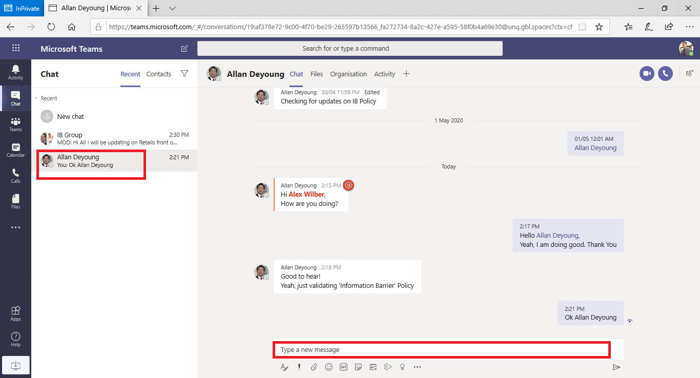

# <a name="information-barriers-in-microsoft-teams"></a>Barreras de información en Microsoft Teams

[Microsoft Purview Information Barriers](/microsoft-365/compliance/information-barriers) (IBs) son directivas que un administrador puede configurar para evitar que individuos o grupos se comuniquen entre sí. Los IB son útiles si, por ejemplo, un departamento trata información que no se debe compartir con otros departamentos. Los IB también son útiles cuando es necesario aislar o impedir que un grupo se comunique con cualquier persona que no pertenezca a ese grupo. Los canales compartidos en Microsoft Teams son compatibles con las barreras de la información. Según el tipo de uso compartido, las directivas de barreras de la información pueden restringir el uso compartido de ciertas maneras. Para obtener más información sobre los canales compartidos y el comportamiento de las barreras de la información, vea [Barreras de información y Canales compartidos](information-barriers-shared-channels.md).

Para Microsoft Teams, las barreras de la información pueden determinar y evitar los siguientes tipos de colaboraciones no autorizadas:

- Agregar un usuario a un equipo o canal
- Acceso de usuario al contenido del canal o del equipo
- Acceso de usuario a chats individuales y grupales
- Acceso de usuario a reuniones
- Impide búsquedas y detección, los usuarios no estarán visibles en el selector de contactos.

>[!NOTE]
>- Los grupos de barreras de la información no se pueden crear entre inquilinos.
>- En la versión 1 no se admite el uso de bots, aplicaciones de Azure Active Directory (Azure AD), API para enviar notificaciones de fuente de actividades y algunas API para agregar usuarios.
>- Los canales privados cumplen las directivas de barreras de la información que configure.
>- Para obtener información sobre la compatibilidad con barreras para los sitios de SharePoint que están conectados a Teams, vea [Segmentos asociados con los sitios de Microsoft Teams](/sharepoint/information-barriers#segments-associated-with-microsoft-teams-sites).

## <a name="background"></a>Información general

El principal impulsor de los IBs proviene de la industria de servicios financieros. La Autoridad Reguladora de la Industria Financiera ([FINRA]( https://www.finra.org)) revisa los IBs y los conflictos de interés dentro de las empresas miembro y proporciona orientación sobre la gestión de esos conflictos (FINRA 2241, [Aviso de reglamentación de investigación de deuda 15-31](https://www.finra.org/sites/default/files/Regulatory-Notice-15-31_0.pdf).

Sin embargo, desde la introducción de los IB, muchas otras áreas han encontrado que son útiles. Otros escenarios comunes incluyen:

- **Educación**: Los alumnos de una escuela no pueden buscar detalles de contacto de los estudiantes de otras escuelas.
- **Legal**: Mantener la confidencialidad de los datos obtenidos por el abogado de un cliente e impedir que sea accedido por un abogado de la misma firma que representa a un cliente diferente.
- **Administración pública**: el acceso a la información y el control están limitados en todos los departamentos y grupos.
- **Servicios profesionales**: un grupo de personas de una empresa solo puede chatear con un cliente o con un cliente específico a través del acceso de invitado durante una interacción del cliente.

Por ejemplo, Enrico pertenece al segmento Banca y Pradeep pertenece al segmento Asesor financiero. Enrico y Pradeep no pueden comunicarse entre sí porque la política ib de la organización bloquea la comunicación y la colaboración entre estos dos segmentos. Sin embargo, Enrico y Pradeep pueden comunicarse con Lee en RR. HH.


## <a name="when-to-use-information-barriers"></a>Cuándo usar barreras de la información

Es posible que desee usar IB en situaciones como las siguientes:

- Es necesario impedir que un equipo se comunique o comparta datos con otro equipo específico.
- Un equipo no debe comunicarse ni compartir datos con nadie fuera del equipo.

El Servicio de evaluación de directivas de barreras de la información determina si una comunicación cumple con las políticas del IB.

## <a name="managing-information-barrier-policies"></a>Administrar las directivas de barreras de la información

Las directivas de IB se administran en la portal de cumplimiento Microsoft Purview (SCC) mediante cmdlets de PowerShell. Para obtener más información, vea [Definir directivas para barreras de información](/office365/securitycompliance/information-barriers-policies).

>[!IMPORTANT]
>Antes de configurar o definir directivas, debe habilitar la búsqueda de directorio de ámbito en Microsoft Teams. Espere al menos unas horas después de habilitar la búsqueda de directorio de ámbito antes de configurar o definir directivas para barreras de información. Para obtener más información, vea [Definir directivas de barreras de la información](/office365/securitycompliance/information-barriers-policies#prerequisites).

## <a name="information-barriers-administrator-role"></a>Rol de administrador de barreras de información

El rol de Administración del cumplimiento de IB es el responsable de administrar las directivas del IB. Para obtener más información sobre este rol, vea [Permisos en la portal de cumplimiento Microsoft Purview](/office365/securitycompliance/permissions-in-the-security-and-compliance-center).

## <a name="information-barrier-triggers"></a>Desencadenadores de la barrera de la información

Las directivas de IB se activan cuando tienen lugar los siguientes eventos de Teams:

- **Se agregan miembros a un equipo**: siempre que agregue un usuario a un equipo, la directiva del usuario debe evaluarse en comparación con las directivas de IB de otros miembros del equipo. Una vez agregado correctamente el usuario, este puede realizar todas las funciones del equipo sin realizar más comprobaciones. Si la directiva del usuario impide que se agregue al equipo, el usuario no aparecerá en la búsqueda.

    

- **Se solicita un nuevo chat**: Cada vez que un usuario solicita un nuevo chat con uno o más usuarios, el chat se evalúa para asegurarse de que no infringe ninguna directiva de IB. Si la conversación infringe una directiva de IB, la conversación no se inicia.

    Este es un ejemplo de un chat 1:1.

    

    Este es un ejemplo de un chat grupal.

    

- **Se invita a un usuario a unirse a una reunión**: cuando se invita a un usuario a unirse a una reunión, la directiva de IB que se aplica al usuario se evalúa según las directivas de IB que se aplican a los demás miembros del equipo. Si hay una infracción, el usuario no podrá unirse a la reunión.

    

- **Una pantalla se comparte entre dos o más usuarios**: cuando un usuario comparte una pantalla con otros usuarios, el uso compartido debe evaluarse para asegurarse de que no infringe las directivas de IB de otros usuarios. Si se infringe una directiva de IB, no se permitirá el uso compartido de pantalla.

    Este es un ejemplo de uso compartido de pantalla antes de aplicar la directiva.

    

    Este es un ejemplo de uso compartido de pantalla después de aplicar la directiva. Los iconos de llamada y uso compartido de la pantalla no están visibles.

    

- **Un usuario realiza una llamada de teléfono en Teams**: siempre que un usuario inicia una llamada de voz (a través de VOIP) a otro usuario o grupo de usuarios, la llamada se evalúa para asegurarse de que no infringe las directivas de IB de otros miembros del equipo. Si hay alguna infracción, la llamada de voz se bloquea.

- **Invitados en Teams**: las directivas de IB también se aplican a los invitados de Teams. Si es necesario que los invitados estén reconocibles en la lista global de direcciones de su organización, consulte [Administrar el acceso de invitado en Grupos de Microsoft 365](/microsoft-365/admin/create-groups/manage-guest-access-in-groups). Una vez que los invitados sean reconocibles, puede [definir las directivas del IB](/office365/securitycompliance/information-barriers-policies).

## <a name="how-policy-changes-impact-existing-chats"></a>Cómo afectan los cambios de la directiva a los chats existentes

Cuando el administrador de directivas de IB realiza cambios en una directiva o cuando se activa un cambio de directiva debido a un cambio en el perfil de un usuario (por ejemplo, para un cambio de trabajo), el Servicio de evaluación de directivas de barreras de información busca automáticamente a los miembros para asegurarse de que su pertenencia al equipo no infringe ninguna directiva.

Si hay un chat u otra comunicación existente entre usuarios y se establece una nueva directiva o se cambia una directiva existente, el servicio evalúa las comunicaciones existentes para asegurarse de que las comunicaciones siguen permitiendo que se produzcan. 

- **Chat 1:1**: si ya no se permite la comunicación entre dos usuarios (debido a la aplicación a uno o ambos usuarios de una directiva que bloquea la comunicación), se bloquea la comunicación adicional. Sus conversaciones de chat existentes se convierten en de solo lectura.

    Este es un ejemplo que muestra que el chat es visible.

    

    Este es un ejemplo que muestra que el chat está deshabilitado.

    

- **Chat** grupal: si ya no se permite la comunicación de un usuario con un grupo (por ejemplo, porque un usuario cambió de trabajo), el usuario, junto con los demás usuarios cuya participación infringe la directiva, puede quitarse del chat grupal y no se permitirá ninguna comunicación adicional con el grupo. El usuario aún puede ver conversaciones antiguas, pero no podrá ver ni participar en nuevas conversaciones con el grupo. Si la directiva nueva o modificada que impide la comunicación se aplica a más de un usuario, es posible que los usuarios afectados por la directiva se quiten del chat grupal. Todavía pueden ver conversaciones antiguas.

  En este ejemplo, Enrico se trasladó a un departamento diferente dentro de la organización y se quita del chat grupal.

  

  Enrico ya no puede enviar mensajes al chat grupal.

  

- **Equipo**: los usuarios que se hayan quitado del grupo se quitan del equipo y no podrán ver ni participar en conversaciones nuevas o existentes.

## <a name="scenario-a-user-in-an-existing-chat-becomes-blocked"></a>Escenario: Un usuario de un chat existente se bloquea

Actualmente, los usuarios experimentan los siguientes escenarios si una directiva de IB bloquea a otro usuario:

- **pestaña Personas**: un usuario no puede ver los usuarios bloqueados en la pestaña **Personas**.

- **Personas selector**: los usuarios bloqueados no estarán visibles en el selector de personas.

    

- **Pestaña Actividad**: si un usuario visita la pestaña **Actividad** de un usuario bloqueado, no se mostrarán publicaciones. (La pestaña **Actividad** solo muestra las publicaciones de los canales y no habría canales comunes entre los dos usuarios).

    Este es un ejemplo de la vista de pestaña actividad que está bloqueada.

    

- **Organigramas**: si un usuario accede a un organigrama en el que aparece un usuario bloqueado, el usuario bloqueado no aparecerá en el organigrama. En su lugar, aparecerá un mensaje de error.

- **Personas tarjeta**: si un usuario participa en una conversación y posteriormente se bloquea, otros usuarios verán un mensaje de error en lugar de la tarjeta de contactos cuando pasen el mouse sobre el nombre del usuario bloqueado. Las acciones enumeradas en la tarjeta (como las llamadas y el chat) no estarán disponibles.

- **Contactos sugeridos**: los usuarios bloqueados no aparecen en la lista de contactos sugeridos (la lista de contactos inicial que aparece para los nuevos usuarios).

- **Contactos de chat**: un usuario puede ver usuarios bloqueados en la lista de contactos de chats, pero se identificarán los usuarios bloqueados. La única acción que el usuario puede realizar en los usuarios bloqueados es eliminarlos. El usuario también puede seleccionarlo para ver su conversación pasada.

- **Contactos de llamadas**: un usuario puede ver usuarios bloqueados en la lista de contactos de llamadas, pero se identificarán los usuarios bloqueados. La única acción que el usuario puede realizar en los usuarios bloqueados es eliminarlos.

    Este es un ejemplo de un usuario bloqueado en la lista de contactos de llamadas.

    > [!div class="mx-imgBorder"]
    > 

    Este es un ejemplo de la deshabilitación del chat de un usuario en la lista de contenido de llamadas.

    > [!div class="mx-imgBorder"]
    > 

- **Migración de Skype a Teams**: durante una migración de Skype Empresarial a Teams, todos los usuarios (incluso aquellos usuarios bloqueados por directivas de IB) se migrarán a Teams. Estos usuarios se gestionan como se describió anteriormente.

## <a name="teams-policies-and-sharepoint-sites"></a>Directivas de Teams y sitios de SharePoint

Cuando se crea un equipo, se aprovisiona un sitio de SharePoint y se asocia con Microsoft Teams para la experiencia de archivos. Las directivas de barrera de la información no se respetan en este sitio de SharePoint ni en los archivos de forma predeterminada. Para habilitar las barreras de la información en SharePoint y OneDrive, siga las instrucciones y los pasos del artículo [Usar barreras de la información con SharePoint](/sharepoint/information-barriers#enable-sharepoint-and-onedrive-information-barriers-in-your-organization) .

## <a name="information--barrier-modes-and-teams"></a>Modos de barrera de la información y Teams

El modo de barreras de información ayuda a reforzar la adición o eliminación de usuarios de un equipo. Al usar barreras de información con Teams, se admiten los siguientes modos de IB:

- **Abierto**: esta configuración es el modo de IB predeterminado para todos los grupos existentes que se aprovisionaron antes de habilitar las barreras de la información. En este modo, no hay políticas ib aplicables.
- **Implícita**: Esta configuración es el modo ib predeterminado cuando se aprovisiona un equipo después de habilitar las barreras de la información. El modo implícito le permite agregar todos los usuarios compatibles del grupo.
- **Propietario moderado**: este modo se establece en un equipo cuando se desea permitir la colaboración entre usuarios de segmento incompatibles moderados por el propietario. El propietario del equipo puede agregar nuevos miembros según su directiva de IB.

Los equipos creados antes de activar una directiva de barrera de la información en su inquilino se establecen automáticamente en modo *Abierto* de forma predeterminada. Una vez que active las directivas de IB en su inquilino, se le pedirá que actualice el modo de sus equipos existentes a *Implícitas* para asegurarse de que los equipos existentes cumplan con ib.

Use el cmdlet [Set-UnifiedGroup](/powershell/module/exchange/set-unifiedgroup) con el parámetro *InformationBarrierMode* que corresponde al modo que desea usar para los segmentos. La lista de valores permitidos para el parámetro *InformationBarrierMode* son *Open*, *Implicit* y *Owner Moderated*.

Por ejemplo, para configurar el modo *implícito* para un grupo de Microsoft 365, deberá usar el siguiente comando de PowerShell:

```powershell
Set-UnifiedGroup -InformationBarrierMode Implicit
```

Para actualizar el modo de Abierto a Implícito para todos los equipos existentes, use este [script de PowerShell](information-barriers-mode-script.md).

Si cambia la configuración del modo abierto en grupos conectados a Teams existentes para cumplir los requisitos de cumplimiento de su organización, deberá [actualizar los modos ib](/sharepoint/information-barriers#view-and-manage-ib-modes-as-an-administrator-with-sharepoint-powershell) para los sitios de SharePoint asociados conectados al equipo de Teams.

## <a name="required-licenses-and-permissions"></a>Licencias y permisos necesarios

Para obtener más información sobre licencias y permisos, planes y precios, consulte [Guía de licencias de Microsoft 365 para cumplimiento de & de seguridad](/office365/servicedescriptions/microsoft-365-service-descriptions/microsoft-365-tenantlevel-services-licensing-guidance/microsoft-365-security-compliance-licensing-guidance).

## <a name="known-issues"></a>Problemas conocidos

- **Los usuarios no pueden unirse a reuniones ad hoc**: si las directivas de IB están habilitadas, los usuarios no pueden unirse a las reuniones si el tamaño de la lista de reuniones es mayor que los [límites de asistencia](limits-specifications-teams.md) a las reuniones. La causa raíz es que el IB comprueba si los usuarios se pueden agregar a una lista de chat de la reunión y solo cuando pueden agregarse a la lista pueden unirse a la reunión. Un usuario que se une a una reunión una vez agrega ese usuario a la lista; por lo tanto, para las reuniones periódicas, la lista puede llenarse rápidamente. Una vez que la lista de chat alcanza los [límites de asistencia](limits-specifications-teams.md) a la reunión, los usuarios adicionales no se pueden agregar a la reunión. Si el IB está habilitado para la organización y la lista de chats está completa para una reunión, los nuevos usuarios (los usuarios que aún no están en la lista) no podrán unirse a la reunión. Pero si ELB no está habilitado para la organización y la lista de chats de la reunión está llena, los nuevos usuarios (aquellos usuarios que aún no están en la lista) pueden unirse a la reunión, aunque no verán la opción de chat en la reunión. Una solución a corto plazo es quitar miembros inactivos de la lista del chat de la reunión para liberar espacio a los nuevos usuarios. Sin embargo, aumentaremos el tamaño de las listas de chat de reuniones en una fecha posterior.
- **Los usuarios no pueden unirse a las reuniones del canal**: si las directivas de IB están habilitadas, los usuarios no pueden unirse a las reuniones del canal si no son miembros del equipo. La causa raíz es que el IB comprueba si los usuarios se pueden agregar a una lista de chat de la reunión y solo cuando pueden agregarse a la lista pueden unirse a la reunión. El hilo de chat de una reunión de canal solo está disponible para los miembros del equipo o el canal, y los no miembros no pueden ver ni acceder a la conversación de chat. Si el IB está habilitado para la organización y un miembro que no sea del equipo intenta unirse a una reunión del canal, ese usuario no tiene permiso para unirse a la reunión. Sin embargo, si no está habilitado IB* para la organización y un miembro que no sea del equipo intenta unirse a una reunión del canal, el usuario puede unirse a la reunión, pero no verá la opción de chat en la reunión.
- **Número máximo de segmentos permitidos en una organización**: cada organización puede configurar hasta 100 segmentos al configurar las directivas del IB. No hay ningún límite en el número de directivas que se pueden configurar.
- Las **directivas de IB no funcionan para los usuarios federados**: si permite la federación con organizaciones externas, los usuarios de esas organizaciones no estarán restringidos por directivas de IB. Si los usuarios de su organización se unen a un chat o reunión organizado por usuarios federados externos, las directivas de IB tampoco restringirán la comunicación entre los usuarios de la organización.

## <a name="more-information"></a>Más información

- Para obtener más información sobre los IB, consulte [Barreras de información](/office365/securitycompliance/information-barriers).
- Para configurar las directivas del IB, consulte [Introducción a las barreras de la información](/office365/securitycompliance/information-barriers-policies).
- Para editar o quitar directivas de IB, consulte [Administrar directivas de barreras de la información](/microsoft-365/compliance/information-barriers-edit-segments-policies).
- [Barreras de información y canales compartidos](information-barriers-shared-channels.md)

## <a name="availability"></a>Disponibilidad

Las barreras de la información en Teams están disponibles en nuestras nubes públicas, GCC, GCC - Alta y DOD.
