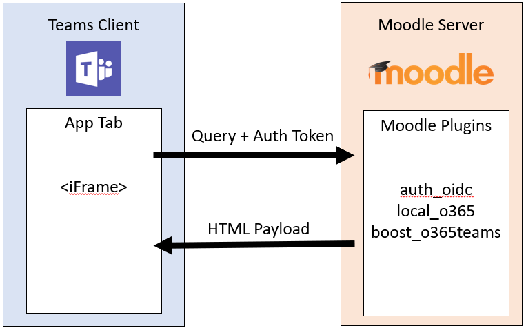
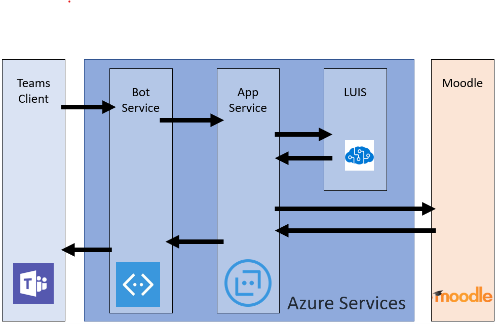

# Instalación de la integración de Moodle con Microsoft Teams

> [!VIDEO https://www.youtube.com/embed/OHlPt22nKoE]

[Moodle](https://moodle.org/), el sistema de administración del aprendizaje de Open Source más popular (LMS) del mundo, ahora está integrado con Microsoft Teams. Esta integración ayuda a los educadores y profesores a colaborar en cursos de Moodle, formular preguntas sobre sus calificaciones y tareas, y mantenerse actualizado con las notificaciones, a la derecha de Teams.

Para ayudar a los administradores de ti a configurar fácilmente esta integración, hemos actualizado el complemento Office 365 moodle de código abierto con las siguientes capacidades:

* Registro automático de su servidor de Moodle con Azure AD.
* Implementación con un solo clic de su bot de Moodle Assistant a Azure.
* Aprovisionamiento automático de equipos y sincronización automática de inscripciones de equipo para todos o seleccione cursos de moodle.
* Instalación automática de la ficha Moodle y bot de Moodle Assistant en cada equipo sincronizado. (Próximamente)
* Publicación con un solo clic de la aplicación de Moodle en la tienda de aplicaciones de su equipo privado. (Próximamente)

Para obtener más información sobre la funcionalidad que esta integración proporciona, vaya [aquí](https://education.microsoft.com/courses-and-resources/resources/microsoft-teams-moodle).

## Requisitos previos

Para poder instalar y configurar esta aplicación, necesitará lo siguiente:

1. Credenciales de administrador de moodle
2. Credenciales de administrador de Azure AD
3. Una suscripción de Azure puede crear nuevos recursos en

## Paso 1: instalar el complemento Office 365 moodle

> [!VIDEO https://www.youtube.com/embed/SETEC5nzMgk]

La integración de Moodle en Microsoft Teams viene equipada con el [conjunto de complementos de Office 365 moodle](https://github.com/Microsoft/o365-moodle)de código abierto. Para instalar el complemento en el servidor de Moodle:

1. En primer lugar, descargue el [conjunto de complementos de Office 365](https://moodle.org/plugins/pluginversions.php?plugin=local_o365) y guárdelo en el equipo local. Tendrá que usar la versión 3,5 o posterior.
    * Al instalar el complemento local_o365 también se instalarán los complementos [auth_oidc](https://moodle.org/plugins/auth_oidc) y [boost_o365Teams](https://moodle.org/plugins/pluginversions.php?plugin=theme_boost_o365teams) .
1. Inicie sesión en el servidor de Moodle como administrador y seleccione **Administración de sitios** en el panel de navegación de la izquierda.
1. Seleccione la pestaña **Complementos** y, a continuación, haga clic en **instalar complementos**.
1. En la sección **Instalar complemento de archivo zip** , haga clic en el botón **elegir un archivo** .
1. Seleccione las opciones **cargar un archivo** de la barra de navegación izquierda, busque el archivo que descargó anteriormente y haga clic en **cargar este archivo**.
1. Seleccione la opción **Administración del sitio** de nuevo en el panel de navegación izquierdo para volver a su panel de administración. Desplácese hacia abajo hasta los **Complementos locales** y haga clic en el vínculo **Microsoft Office 365 Integration** . Mantenga esta página de configuración abierta en una pestaña de explorador independiente, ya que la estará usando en el resto de este proceso.

Puede encontrar más información sobre cómo instalar los complementos de Moodle en la [documentación de Moodle](https://docs.moodle.org/34/en/Installing_plugins).

**Nota importante:** Mantenga la página de configuración del complemento Office 365 moodle abierta en una pestaña del explorador independiente, ya que volverá a este conjunto de páginas durante este proceso.

*¿Todavía no tienes un sitio de moodle?* Es posible que desee consultar nuestra Moodle en el [repositorio](https://github.com/azure/moodle) de Azure, donde puede implementar rápidamente una instancia de Moodle en Azure y personalizarla según sus necesidades.

## Paso 2: configurar la conexión entre el complemento de Office 365 y Azure Active Directory

> [!VIDEO https://www.youtube.com/embed/FpGEezaJ3SA]

A continuación, deberás registrar moodle como una aplicación en Azure Active Directory. Proporcionamos un script de PowerShell para ayudarte a completar este proceso. El script de PowerShell aprovisiona una nueva aplicación de Azure AD para su inquilino de Office 365, que será usado por el complemento de Office 365 moodle. El script proporcionará la aplicación para el inquilino de O365, configurar todas las direcciones URL de respuesta y permisos necesarios para la aplicación aprovisionada, y devolver el AppID y la clave. Puede usar el AppID y la clave generadas en la página de configuración de complemento de O365 Moodle para configurar el servidor de Moodle con Azure AD. Si desea ver los pasos manuales detallados que el script de PowerShell está automatizando, puede encontrarlos en la [documentación completa para el complemento](https://docs.moodle.org/34/en/Office365#Register_your_Moodle_instance_as_an_Application).

### Ficha Moodle para flujo de información de Microsoft Teams

1. En la página del complemento de integración de Microsoft Office 365 slect la ficha **configurar** .
1. Haga clic en el botón **descargar script de PowerShell** y guárdelo en el equipo local.
1. Tendrá que preparar el script de PowerShell desde el archivo ZIP. Para ello, realice lo siguiente:
    * Descargue y extraiga el `Moodle-AzureAD-Powershell.zip` archivo.
    * Abra la carpeta extraída.
    * Haga clic con el botón `Moodle-AzureAD-Script.ps1` derecho en el archivo y seleccione **propiedades**.
    * En la pestaña **General** de la ventana Propiedades, active la `Unblock` casilla situada junto al atributo de **seguridad** en la parte inferior.
    * Haga clic en **Aceptar**.
    * Copie la ruta de acceso del directorio de la carpeta extraída.
1. A continuación, ejecutará PowerShell como administrador:
    * Haga clic en Inicio.
    * Escriba PowerShell.
    * Haga clic con el botón derecho en Windows PowerShell.
    * Haz clic en "ejecutar como administrador".
1. Vaya al directorio descomprimido escribiendo `cd ...\...\Moodle-AzureAD-Powershell` Where `...\...` es la ruta de acceso al directorio.
1. Ejecute el script de PowerShell de la siguiente manera:
    * Entrar `Set-ExecutionPolicy -ExecutionPolicy RemoteSigned -Scope CurrentUser`.
    * Entrar `.\Moodle-AzureAD-Script.ps1`.
    * Inicie sesión en su cuenta de administrador de O365 en la ventana emergente.
    * Escribe el nombre de la aplicación de Azure AD (p. ej. Moodle/moodle plugin).
    * Escriba la dirección URL de su servidor de moodle.
    * Copie el **identificador** de la aplicación y la **clave de aplicación** generados por el script y guárdelos.
1. A continuación, tendrá que agregar el identificador y la clave al complemento Office 365 moodle. Vuelva a la página de administración de complementos (administración de sitios > complementos > integración de Microsoft Office 365).
1. En la pestaña **configurar** , agregue el **identificador** de la aplicación y la **clave de aplicación** que ha copiado anteriormente, a continuación, haga clic en **Guardar cambios**.
1. Una vez que se actualiza la página, debería ver una nueva sección **elegir método de conexión**. Haga clic en la casilla denominada **predeterminada** y, a continuación, vuelva a hacer clic en **Guardar cambios** .
1. Una vez que se actualice la página, verá otra nueva sección con el **consentimiento del administrador & información adicional**.
    * Haga clic en el vínculo **proporcionar consentimiento del administrador** , escriba sus credenciales de administrador global de Office3 365 y, a continuación, **acepte** para conceder los permisos.
    * Junto al campo **inquilino de Azure ad** , haz clic en el botón **detectar** .
    * Junto a la **dirección URL de OneDrive para la empresa** , haga clic en el botón **detectar** .
    * Una vez rellenados los campos, vuelva a hacer clic en el botón **Guardar cambios** .
1. Haga clic en el botón **Actualizar** para comprobar la instalación y, a continuación, **guarde los cambios**.
1. A continuación, tendrá que sincronizar los usuarios entre el servidor de Moodle y Azure Active Directory. En función de su entorno, puede seleccionar diferentes opciones durante esta etapa. Ten en cuenta que la configuración que establezcas aquí se ejecutará con cada ejecución de Moodle cron (normalmente una vez al día) para mantener todo sincronizado. Para comenzar:
    * Cambiar a la **pestaña Configuración de sincronización**
    * En la sección **sincronizar los usuarios con Azure ad** , seleccione las casillas que se aplican a su entorno. Normalmente, debería seleccionar al menos:
        * Crear cuentas en Moodle para los usuarios en Azure AD
        * Actualizar todas las cuentas de Moodle para los usuarios en Azure AD
    * En la sección **restricción de creación de usuario** puede configurar un filtro para limitar los usuarios de Azure ad que se sincronizarán con moodle.
    * La sección de **asignación de campos de usuario** le permitirá personalizar Azure ad para Moodle asignación de campo de Perfil de usuario.
    * En la sección de **sincronización de Teams** , puede elegir crear automáticamente grupos (es decir, equipos) para algunos o todos los cursos de Moodle existentes.
1. Para validar los trabajos de cron (y ejecutarlos manualmente si desea para la primera ejecución), haga clic en el vínculo de la **página Administración de tareas programadas** en la sección **sincronizar los usuarios con Azure ad** . Esto le llevará a la página de **tareas programadas** .
    * Desplácese hacia abajo y busque el trabajo **sincronizar usuarios con el trabajo de Azure ad** y haga clic en **Ejecutar ahora**.
    * Si decide crear grupos basados en cursos existentes, también puede ejecutar el trabajo **crear grupos de usuarios en Office 365** .
1. Vuelva a la página Administración de complementos (administración de sitios > complementos > integración de Microsoft Office 365) y seleccione la página de **configuración de Teams** . Tendrá que configurar algunas opciones de seguridad para habilitar la integración de aplicaciones de Teams.
    * Para habilitar OpenID Connect, haga clic en el vínculo **Manage Authentication** y haga clic en el icono de ojo de la línea de **OpenID Connect** si está atenuada.
    * A continuación, tendrá que habilitar la incrustación de Marcos. Haga clic en el vínculo **Seguridad http** y, después, haga clic en la casilla que se encuentra junto a **permitir la incrustación de Marcos**.
    * El siguiente paso consiste en habilitar servicios web que habilitarán las características de la API de moodle. Haga clic en el vínculo **características avanzadas** y asegúrese de que la casilla que se encuentra junto a **habilitar servicios web** está activada.
    * Por último, tendrá que habilitar los servicios externos para Office 365. Haga clic en el vínculo **servicios externos** :
        * En la fila **moodle Office 365 webservices** , haga clic en **Editar** .
        * Marque la casilla situada junto a **habilitado**y haga clic en **Guardar cambios** .
    * A continuación, tendrá que editar los permisos de usuario autenticado para poder crear tokens de servicio Web. Haga clic en el vínculo **' usuario autenticado '** de la función de edición. Desplácese hacia abajo y busque la función **crear un token de servicio Web** y marque la casilla **permitir** .

## Paso 3: implementar el bot de Moodle Assistant en Azure

> [!VIDEO https://www.youtube.com/embed/gbkJxf8FlfY]

El bot moodle Assistant gratuito para Microsoft Teams ayuda a profesores y alumnos a responder preguntas sobre sus cursos, tareas, calificaciones y otra información en moodle. El bot también envía notificaciones de Moodle a estudiantes y profesores directamente dentro de Teams. Este bot es un proyecto de origen abierto mantenido por Microsoft y está [disponible en github](https://github.com/microsoft/Moodle-Teams-Bot).

> [!NOTE]
> En esta sección, va a implementar recursos en su suscripción de Azure y todos los recursos se configurarán con el nivel **gratuito** . Según el uso que usted hace de su bot, es posible que necesite escalar estos recursos.
> Si solo desea usar la ficha moodle sin el bot, vaya al [paso 4](#step-4-deploy-your-microsoft-teams-app).

### Flujo de información de bot moodle

Para instalar el bot, primero deberá registrarlo en la [plataforma de identidad de Microsoft](https://identity.microsoft.com/Landing). Esto permite a su bot autenticarse en los puntos de conexión de Microsoft. Para registrar su bot:

1. Vuelva a la página Administración de complementos (administración de sitios > complementos > integración de Microsoft Office 365) y seleccione la pestaña **configuración de equipos** .
1. Haga clic en el vínculo del **portal de registro de aplicaciones de Microsoft** e inicie sesión con su Microsoft ID.
1. Escribe un nombre para la aplicación (por ejemplo, MoodleBot) y haga clic en el botón **crear** .
1. Copie el **identificador** de la aplicación y péguelo en el campo ID de la **aplicación de bot** en la página **configuración del equipo** .
1. Haga clic en el botón **generar nueva contraseña** . Copie la contraseña generada y péguela en el campo **contraseña** de la aplicación de bot en la página **configuración del equipo** .
1. Desplácese hasta la parte inferior del formulario y haga clic en **Guardar cambios**.

Ahora que ha generado el identificador de la aplicación y la contraseña, es el momento de implementar el bot en Azure. Haga clic en el botón **implementar en Azure** y rellene el formulario con la información necesaria (el identificador de la aplicación de bot, la contraseña de la aplicación de Bot y el secreto de Moodle están en la página de **configuración del equipo** y la información de Azure se encuentra en la página de **configuración** ) . Una vez que haya rellenado el formulario, haga clic en la casilla para aceptar las cláusulas y condiciones y, a continuación, haga clic en el botón **comprar** (todos los recursos de Azure se implementan en el nivel gratuito).

Una vez que los recursos terminen de implementarse en Azure, tendrá que configurar el complemento Office 365 Moodle con su extremo de mensajería. En primer lugar, tendrá que obtener el punto de conexión de su bot en Azure. Para ello:

1. Si aún no lo ha hecho, inicie sesión en el [portal de Azure](https://portal.azure.com).
2. En el panel de la izquierda, seleccione **grupos de recursos**.
3. En la lista, seleccione el grupo de recursos que acaba de usar (o creado) al implementar su bot.
4. Seleccione el recurso **Bot bot** de la lista de recursos del grupo.
5. Copie el **punto de conexión de mensajería** de la sección **información general** .
6. En Moodle, abra la página **configuración del equipo** de su complemento de Moodle de Office 365.
7. En el campo **punto final del bot** , pegue la dirección URL que acaba de copiar y cambie los *mensajes* de Word a *webhook*. La dirección URL debería tener ahora el siguiente aspecto`https://botname.azurewebsites.net/api/webhook`
8. Haga clic en **Guardar cambios**
9. Una vez que los cambios se hayan guardado, vuelva a la ficha **configuración del equipo** , haga clic en el botón **Descargar archivo de manifiesto** y guarde el paquete de manifiesto en el equipo (lo usará en la siguiente sección).

## Paso 4: implementar la aplicación Microsoft Teams

> [!VIDEO https://www.youtube.com/embed/2rMb7gtM_ZM]

Ahora que ya ha implementado su bot en Azure y configurado para hablar con su servidor de Moodle, es el momento de implementar la aplicación Microsoft Teams. Para ello, deberá cargar el archivo de manifiesto que descargó desde la página de configuración del equipo del complemento de Office 365 Moodle en el paso anterior.

Antes de poder instalar la aplicación, tendrá que asegurarse de que las aplicaciones externas y la instalación de prueba de aplicaciones están habilitadas. Para ello, puede seguir [estos pasos](https://docs.microsoft.com/en-us/MicrosoftTeams/admin-settings). Una vez que se haya asegurado de que las aplicaciones externas estén habilitadas, puede seguir los pasos que se indican a continuación para implementar la aplicación.

1. Abra Microsoft Teams.
2. Haga clic en el icono de **tienda** en la esquina inferior izquierda de la barra de navegación.
3. Haga clic en el vínculo **cargar una aplicación personalizada** de la lista de opciones. *Nota:* Si ha iniciado sesión como administración global, tendrá la opción de cargar la aplicación en la tienda de aplicaciones de su organización; de lo contrario, solo podrá cargar la aplicación para los equipos de los que forme parte ("transferencia local").
4. Seleccione el `manifest.zip` paquete que descargó anteriormente y haga clic en **Guardar**. Si aún no ha descargado el paquete de manifiesto, puede hacerlo desde la pestaña **configuración de equipo** de la página Configuración del complemento en moodle.

Ahora que ha instalado la aplicación, puede Agregar la pestaña a cualquier canal al que tenga acceso. Para ello, navegue hasta el canal, haga clic **+** en el símbolo y seleccione la aplicación de la lista. Siga las indicaciones para terminar de agregar la ficha del curso moodle a un canal.

¡ Así está! Usted y su equipo pueden comenzar a trabajar con sus cursos de Moodle directamente desde Microsoft Teams.

Para compartir las solicitudes de características o comentarios con nosotros, visita nuestra [Página de voz de usuario](https://microsoftteams.uservoice.com/forums/916759-moodle).