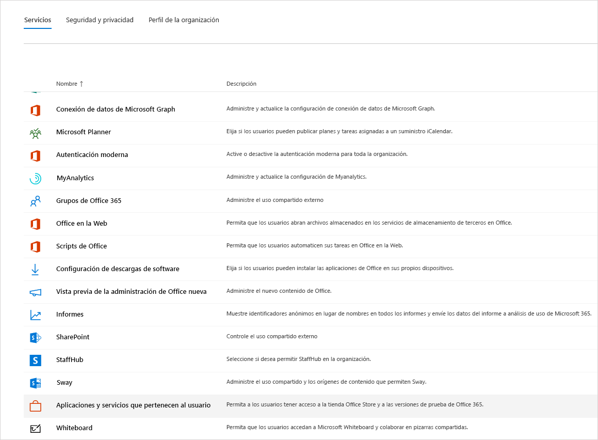
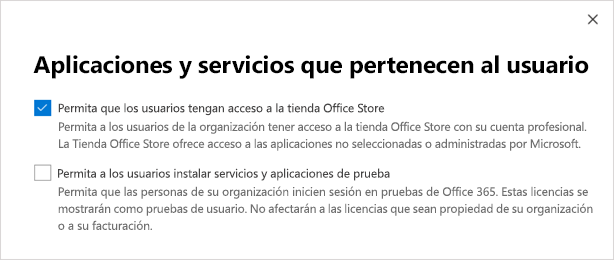

Administrar la oferta de prueba comercial en la nube de Microsoft TeamsManage the Microsoft Teams Commercial Cloud Trial offer
=======================================================

La prueba comercial en la nube de Microsoft Teams ofrece a los usuarios existentes de Microsoft 365 y Office 365 de su organización que no tengan una licencia de Microsoft Teams iniciar una prueba de 1 año del producto.The Microsoft Teams Commercial Cloud Trial offers existing Microsoft 365 or Office 365 users in your organization who are not licensed for Microsoft Teams to initiate a 1-year trial of the product. Los administradores pueden activar o desactivar esta característica para los usuarios de su organización.Admins can switch this feature on or off for users in their organization.

> [!IMPORTANT]
> La prueba en la nube de Microsoft Teams se reemplazará por Microsoft Teams exploratorios a partir del 2020 de enero.The Microsoft Teams Commercial Cloud Trial will be replaced by Microsoft Teams Exploratory beginning in January 2020. Para obtener más información sobre esta nueva oferta, consulte [Administrar Teams](teams-exploratory.md)de licencias exploratorias.To learn about this new offer, read [Manage Teams Exploratory license](teams-exploratory.md).

## ¿Qué incluye la oferta?What's in the offer

Los planes de servicio incluidos en esta oferta son:The service plans included in this offer are:

- Exchange FoundationExchange Foundation
- Flow para Office 365 (Plan 1)Flow for Office 365 Plan 1
- FormsForms
- Microsoft PlannerMicrosoft Planner
- Microsoft Teams (Teams1, Teams IW)Microsoft Teams (Teams1, Teams IW)
- OfficeOffice 
- PowerApps para Office 365 (Plan 1)PowerApps for Office 365 Plan 1
- Quiosco de SharePoint OnlineSharePoint Online Kiosk
- StreamStream
- SwaySway
- WhiteboardWhiteboard
- Yammer EnterpriseYammer Enterprise 

La versión de prueba concede una suscripción de prueba de un año para toda la organización.The trial grants a one-year trial subscription to your entire organization. Por cada licencia asignada, la versión de prueba asigna 2 GB de almacenamiento de SharePoint Online.For each license assigned, the trial allocates 2 GB of SharePoint Online storage. 

## ¿Quién es válido?Who is eligible

Es necesario habilitar la opción para que los usuarios se registren para aplicaciones y versiones de prueba (en el Centro de administración de Microsoft 365).Users must be enabled to sign up for apps and trials (in the Microsoft 365 admin center). Para obtener más información, vea [Administrar la versión de prueba](#manage-the-trial) más adelante en este artículo.For more information, see [Manage the trial](#manage-the-trial), later in this article. 

Los usuarios que no tengan una licencia de Office 365 que incluya Teams pueden iniciar la oferta de prueba comercial en la nube de Microsoft Teams.Users who do not have an Office 365 license that includes Teams can initiate the Microsoft Teams Commercial Cloud Trial offer. Por ejemplo, si un usuario tiene las aplicaciones de Microsoft 365 para empresas (que no incluye Teams), podrán participar en la versión de prueba.For example, if a user has Microsoft 365 Apps for business (which doesn't include Teams), they are eligible for the trial.

## ¿Quién no es válido?Who is not eligible

Su organización no es apta para la versión de prueba si es un cliente de partner de redifusión o si es un cliente de GCC, GCC High, DoD o EDU.Your organization is not eligible for the trial if you are a Syndication Partner Customer or if you are a GCC, GCC High, DoD, or EDU customer.

Si su organización no es válida para la oferta de prueba comercial en la nube de Microsoft Teams, no verá la opción **Permitir a los usuarios instalar servicios y aplicaciones de prueba**.If your organization is ineligible for the Microsoft Teams Commercial Cloud Trial offer, you will not see the **Let users install trial apps and services** switch.

## Cómo se registran los usuarios para la versión de pruebaHow users sign up for the trial

Los usuarios válidos pueden registrarse para la oferta de prueba iniciando sesión en Teams ([teams.microsoft.com](https://teams.microsoft.com)).Eligible users can sign up for the trial offer by signing in to Teams ([teams.microsoft.com](https://teams.microsoft.com)). Verán la siguiente pantalla para iniciar la versión de prueba.They will see the following screen to start the trial. 

Todas las versiones de prueba de su organización comparten las mismas fechas de inicio y fin, que es la fecha en que el primer usuario se suscribe a la versión de prueba.All trials within your organization share the same start and end dates, which is the date the first user signed up for the trial. Por ejemplo, si el usuario A inicia la primera prueba el 25 de enero de 2019 y el usuario B inicia una prueba el 3 de junio de 2019, la prueba de ambos usuarios caducará el 25 de enero de 2020.For example, if user A starts the first trial on January 25, 2019 and user B starts a trial on June 3, 2019, both users' trial will expire on January 25, 2020.

## Administrar la versión de pruebaManage the trial

La prueba de Teams está pensada para ser iniciada por usuarios finales individuales y usted no puede iniciar la oferta de prueba de Teams en nombre de empleados que sean usuarios finales.The Teams Trial is meant to be initiated by individual end users, and you may not initiate the Teams Trial offer on behalf of end-user employees.

Los administradores pueden desactivar la capacidad de los usuarios finales de solicitar servicios y aplicaciones de prueba en su organización.Admins can disable the ability for end users to claim trial apps and services within their organization. Actualmente, la versión de prueba descrita en este artículo es la única prueba en esta categoría, pero puede aplicarse a otros programas similares en el futuro.Currently, the trial described in this article is the only trial in this category, but it might apply to other similar programs in the future. 

### Evitar que los usuarios instalen aplicaciones y servicios de pruebaPrevent users from installing trial apps and services

Puede desactivar la capacidad de un usuario para instalar servicios y aplicaciones de prueba.You can turn off a user's ability to install trial apps and services.

1. Desde el [Centro de administración de Microsoft 365](https://portal.office.com/adminportal/home), vaya a **Configuración** > **Configuración**, seleccione **Servicios** y **Aplicaciones y servicios en propiedad del usuario**.From the [Microsoft 365 admin center](https://portal.office.com/adminportal/home), go to **Settings** > **Settings**, select **Services**, and then select **User owned apps and services**.

    

2. Desactive la casilla **Permitir que los usuarios instalen aplicaciones y servicios de prueba**.Clear the **Let users install trial apps and services** check box.

    

### Administrar la disponibilidad de la versión de prueba para un usuario con una licencia que incluye TeamsManage trial availability for a user with a license that includes Teams

Un usuario que tenga asignada una licencia que incluya Teams no es apto para la versión de prueba.A user who is assigned a license that includes Teams is not eligible for the trial. Cuando se habilite el plan de servicio de Teams, el usuario puede iniciar sesión y usar Teams.When the Teams service plan is enabled, the user can sign in and use Teams. Si el plan de servicio está desactivado, el usuario no puede iniciar sesión y no se le muestra la opción de la versión de prueba.If the service plan is disabled, the user cannot sign in and is not presented with the trial option either.

Para desactivar el acceso a Teams:To turn off access to Teams:

1. En el Centro de administración de Microsoft 365, seleccione **Usuarios** > **Usuarios activos**.In the Microsoft 365 admin center, select **Users** > **Active users**.

2. Seleccione la casilla junto al nombre del usuario.Select the box next to the name of the user.

3. En la parte derecha, en la fila **Licencias de producto**, elija **Editar**.On the right, in the **Product licenses** row, choose **Edit**.

4. En el panel **Licencias de producto**, cambie el botón de alternancia a **Desactivado**.In the **Product licenses** pane, switch the toggle to **Off**.

    

### Administrar la disponibilidad de Teams para los usuarios que han solicitado la versión de pruebaManage Teams availability for users who already claimed the trial

Si un usuario ha solicitado una licencia de prueba de Teams, puede quitarla mediante la eliminación de la licencia o plan de servicio.If a user has claimed a Teams trial license, you can remove it by removing the license or service plan.

Para desactivar la licencia de prueba:To turn off the trial license:

1. En el Centro de administración de Microsoft 365, seleccione **Usuarios** > **Usuarios activos**.In the Microsoft 365 admin center, select **Users** > **Active users**.

2. Seleccione la casilla junto al nombre del usuario.Select the box next to the name of the user.

3. En la parte derecha, en la fila **Licencias de producto**, elija **Editar**.On the right, in the **Product licenses** row, choose **Edit**.

4. En el panel **Licencias de producto**, cambie el botón de alternancia a **Desactivado**.In the **Product licenses** pane, switch the toggle to **Off**.

    
    
    >[!Note]
    >El botón de alternancia de la versión de prueba de Microsoft Teams aparecerá después de que el primer usuario de la organización se haya registrado para la versión de prueba.The Microsoft Teams Trial toggle switch will appear after the first user in the organization signs up for the trial.

### Administrar Teams para los usuarios que tienen la licencia de pruebaManage Teams for users who have the trial license

Puede administrar los usuarios que tienen una licencia de prueba de la misma manera que administra los usuarios que tienen una licencia de pago normal.You can manage users who have a trial license just like you manage users who have a regular paid license. Para obtener más información, vea [Administrar la configuración de Microsoft Teams para su organización](enable-features-office-365.md).For more information, see [Manage Microsoft Teams settings for your organization](enable-features-office-365.md).

### Cambiar una licencia de prueba por una de pagoUpgrade users from the trial license

Para cambiar una licencia de prueba a una de pago, siga estos pasos:To upgrade users from the trial license, do the following:

1. Compre una suscripción que incluya Teams.Purchase a subscription that includes Teams.

2. Elimine la suscripción de prueba de Teams del usuario.Remove the Teams trial subscription from the user.

3. Asignar la licencia que acaba de adquirir.Assign the newly purchased license.

Para obtener más información, consulte [Licencias de Office 365 para Microsoft Teams](Office-365-licensing.md).For more information, see [Office 365 licensing for Microsoft Teams](Office-365-licensing.md).

> [!NOTE]
> Cuando termine el período de prueba y el usuario no se actualice inmediatamente a una suscripción que incluya Teams, los datos del usuario no se eliminarán.If the trial ends and a user is not immediately upgraded to a subscription that includes teams, the user data is not removed. El usuario seguirá existiendo en Azure Active Directory y todos los datos dentro de Teams se conservarán.The user still exists in Azure Active Directory and all data within Teams still remains. Cuando una nueva licencia se asigne al usuario para volver a habilitar las funciones de Teams, todo el contenido seguirá existiendo.Once a new license is assigned to the user to enable Teams functionality again, all content will still exist. 

### Quitar una licencia heredada de prueba de Microsoft TeamsRemove a legacy Microsoft Teams Trial license

A partir del 22 de abril de 2019, los usuarios pueden comenzar a reclamar la licencia de prueba más reciente de Microsoft Teams Commercial Cloud.As of April 22, 2019, users can begin claiming the latest Microsoft Teams Commercial Cloud Trial license. Si quiere mover a los usuarios de su organización de la licencia de prueba heredada a la más reciente, primero deberá eliminar la licencia de prueba de Microsoft Teams heredada de cada usuario.If you would like to move users in your organization off of the legacy trial license and onto the latest one, you will need to first remove the legacy Microsoft Teams Trial license from each user. Una vez quitada la licencia heredada, todos los usuarios afectados pueden pedir la licencia de prueba de Microsoft Teams Commercial Cloud actualizada.Once the legacy license is removed, each affected user can claim the updated Microsoft Teams Commercial Cloud Trial license.

- Si quiere quitar esta licencia mediante PowerShell, consulte: [Quitar licencias de las cuentas de usuario con Office 365 PowerShell](https://docs.microsoft.com/office365/enterprise/powershell/remove-licenses-from-user-accounts-with-office-365-powershell)If you would like to remove this license via PowerShell, see: [Remove licenses from user accounts with Office 365 PowerShell](https://docs.microsoft.com/office365/enterprise/powershell/remove-licenses-from-user-accounts-with-office-365-powershell)

- Si quiere quitar esta licencia a través del portal de administración, vea: [Quitar licencias de usuarios en Office 365 para empresas](https://docs.microsoft.com/office365/admin/subscriptions-and-billing/remove-licenses-from-users?view=o365-worldwide)If you would like to remove this license through the admin portal, see: [Remove licenses from users in Office 365 for business](https://docs.microsoft.com/office365/admin/subscriptions-and-billing/remove-licenses-from-users?view=o365-worldwide)
