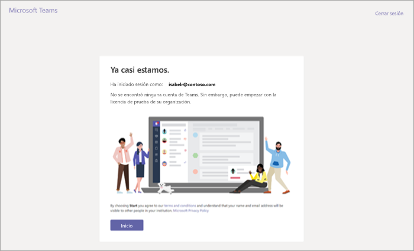
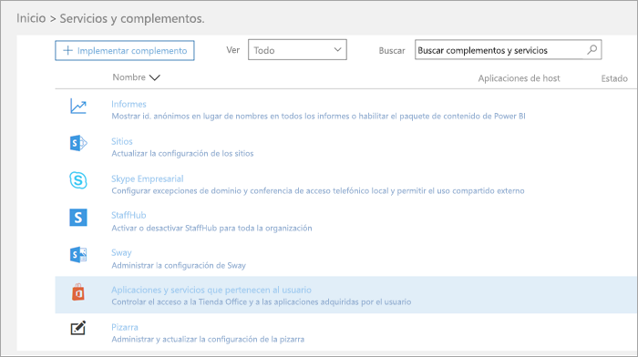
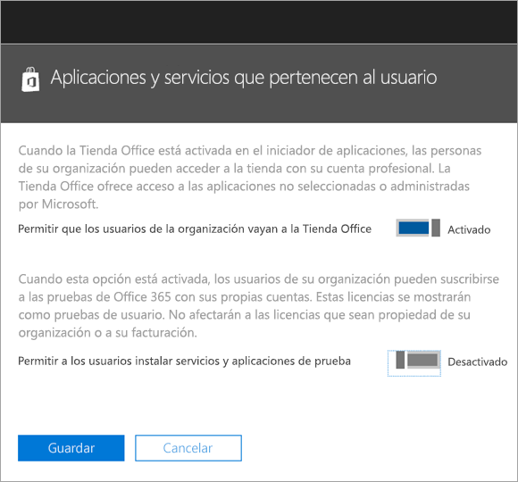
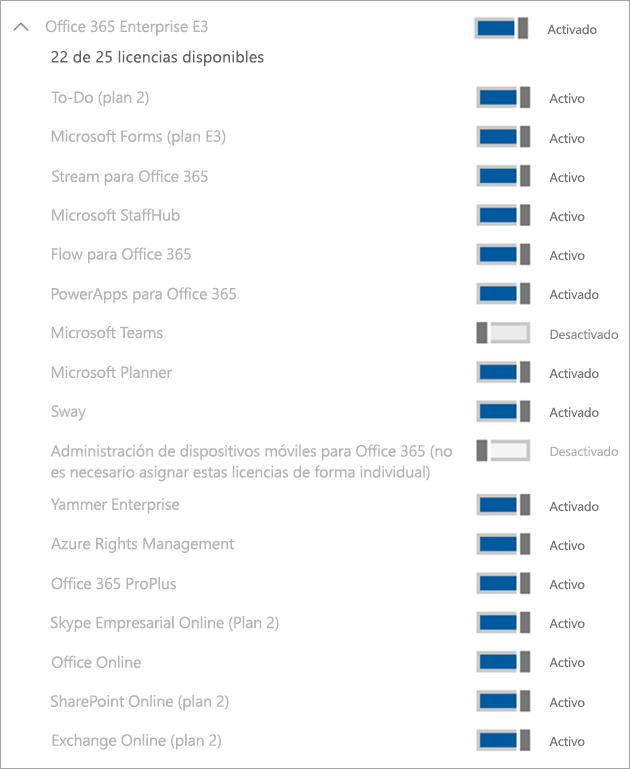

Administrar la oferta de prueba comercial en la nube de Microsoft Teams
=======================================================

Microsoft Teams es una excelente herramienta de colaboración para su organización. Permite a los usuarios y equipos debatir, innovar y compartir ideas mediante las características de Office 365. La prueba comercial en la nube de Microsoft Teams permite a los usuarios existentes de Office 365 de su organización que no tienen una licencia de Microsoft Teams iniciar una prueba de 1 año del producto. Los administradores pueden activar o desactivar esta característica para los usuarios de su organización. 

> [!IMPORTANT]
> La prueba comercial en la nube de Microsoft Teams se ha actualizado para incluir los planes de servicio adicionales para una mayor funcionalidad de Teams y ahora su propietario y controlador es el Administrador de facturación de su organización. Esto facilita administrar la versión de prueba y es coherente con las demás ofertas de Microsoft 365. 

## ¿Qué incluye la oferta?

Los planes de servicio incluidos en esta oferta son:

- Exchange Foundation
- Flow para Office 365 (Plan 1)
- Forms
- Microsoft Planner
- Microsoft Teams (Teams1, Teams IW)
- Office 
- PowerApps para Office 365 (Plan 1)
- Quiosco de SharePoint Online
- Stream
- Sway
- Whiteboard
- Yammer Enterprise 

La versión de prueba concede una suscripción de prueba de un año para toda la organización. La versión de prueba otorga 500 000 licencias disponibles para asignar. Por cada licencia asignada, la versión de prueba asigna 2 GB de almacenamiento de SharePoint Online. 

## ¿Quién es válido?

Es necesario habilitar la opción para que los usuarios se registren para aplicaciones y versiones de prueba (en el Centro de administración de Microsoft 365). Para obtener más información, vea [Administrar la versión de prueba](#manage-the-trial) más adelante en este artículo. 

Los usuarios que no tengan una licencia de Office 365 que incluya Teams pueden iniciar la oferta de prueba comercial en la nube de Microsoft Teams. Por ejemplo, si un usuario tiene Office 365 Empresa (que no incluye Teams), es apto para la versión de prueba.

## ¿Quién no es válido?

Su organización no es apta para la versión de prueba si es un cliente de partner de redifusión o si es un cliente de GCC, GCC High, DoD o EDU.

Si su organización no es válida para la oferta de prueba comercial en la nube de Microsoft Teams, no verá la opción **Permitir a los usuarios instalar servicios y aplicaciones de prueba**.

## Cómo se registran los usuarios para la versión de prueba

Los usuarios válidos pueden registrarse para la oferta de prueba iniciando sesión en Teams ([teams.microsoft.com](https://teams.microsoft.com)). Verán la siguiente pantalla para iniciar la versión de prueba. 

Todas las versiones de prueba de su organización comparten las mismas fechas de inicio y fin, que es la fecha en que el primer usuario se suscribe a la versión de prueba. Por ejemplo, si el usuario A inicia la primera prueba el 25 de enero de 2019 y el usuario B inicia una prueba el 3 de junio de 2019, la prueba de ambos usuarios caducará el 25 de enero de 2020.

## Administrar la versión de prueba

Las licencias de prueba se asignan del mismo modo que se asigna cualquier otra suscripción adquirida por el administrador. Para más información, vea [Assign licenses to users in Office 365 for business](https://docs.microsoft.com/office365/admin/subscriptions-and-billing/assign-licenses-to-users?view=o365-worldwide) (Asignación de licencias a usuarios en Office 365 para empresas). 

Además, los administradores pueden desactivar la capacidad de los usuarios finales para reclamar servicios y aplicaciones de prueba en su organización. Actualmente, la versión de prueba descrita en este artículo es la única prueba en esta categoría, pero puede aplicarse a otros programas similares en el futuro. 

### Impedir que los usuarios instalen servicios y aplicaciones de prueba

Puede desactivar la capacidad de un usuario para instalar servicios y aplicaciones de prueba.

1. Desde el [Centro de administración de Microsoft 365](https://portal.office.com/adminportal/home), vaya a **Configuración** > **Servicios y complementos** > **Aplicaciones y servicios en propiedad del usuario**.

    

2. Desactive **Permitir a los usuarios instalar servicios y aplicaciones de prueba**.

    

### Administrar la disponibilidad de la versión de prueba para un usuario con una licencia que incluye Teams

Un usuario que tenga asignada una licencia que incluya Teams no es apto para la versión de prueba. Cuando se habilite el plan de servicio de Teams, el usuario puede iniciar sesión y usar Teams. Si el plan de servicio está desactivado, el usuario no puede iniciar sesión y no se le muestra la opción de la versión de prueba.

Para desactivar el acceso a Teams:

1. En el Centro de administración de Microsoft 365, seleccione **Usuarios** > **Usuarios activos**.

2. Seleccione la casilla junto al nombre del usuario.

3. En la parte derecha, en la fila **Licencias de producto**, elija **Editar**.

4. En el panel **Licencias de producto**, cambie el botón de alternancia a **Desactivado**.

    

### Administrar la disponibilidad de Teams para los usuarios que han solicitado la versión de prueba

Si un usuario ha solicitado una licencia de prueba de Teams, puede quitarla mediante la eliminación de la licencia o plan de servicio.

Para desactivar la licencia de prueba:

1. En el Centro de administración de Microsoft 365, seleccione **Usuarios** > **Usuarios activos**.

2. Seleccione la casilla junto al nombre del usuario.

3. En la parte derecha, en la fila **Licencias de producto**, elija **Editar**.

4. En el panel **Licencias de producto**, cambie el botón de alternancia a **Desactivado**.

    
    
>[!Note]
>El botón de alternancia de la versión de prueba de Microsoft Teams aparecerá después de que el primer usuario de la organización se haya registrado para la versión de prueba.

### Administrar Teams para los usuarios que tienen la licencia de prueba

Puede administrar los usuarios que tienen una licencia de prueba de la misma manera que administra los usuarios que tienen una licencia de pago normal. Para obtener más información, vea [Administrar la configuración de Microsoft Teams para su organización](enable-features-office-365.md).

### Cambiar una licencia de prueba por una de pago

Para cambiar una licencia de prueba a una de pago, siga estos pasos:

1. Compre una suscripción que incluya Teams.

2. Elimine la suscripción de prueba de Teams del usuario.

3. Asignar la licencia que acaba de adquirir.

Para obtener más información, consulte [Licencias de Office 365 para Microsoft Teams](Office-365-licensing.md).

> [!NOTE]
> Cuando termine el período de prueba y el usuario no se actualice inmediatamente a una suscripción que incluya Teams, los datos del usuario no se eliminarán. El usuario seguirá existiendo en Azure Active Directory y todos los datos dentro de Teams se conservarán. Cuando una nueva licencia se asigne al usuario para volver a habilitar las funciones de Teams, todo el contenido seguirá existiendo. 

### Quitar una licencia heredada de prueba de Microsoft Teams

A partir del 22 de abril de 2019, los usuarios pueden comenzar a reclamar la licencia de prueba más reciente de Microsoft Teams Commercial Cloud. Si quiere mover a los usuarios de su organización de la licencia de prueba heredada a la más reciente, primero deberá eliminar la licencia de prueba de Microsoft Teams heredada de cada usuario. Una vez quitada la licencia heredada, todos los usuarios afectados pueden pedir la licencia de prueba de Microsoft Teams Commercial Cloud actualizada.

- Si quiere quitar esta licencia mediante PowerShell, consulte: [Quitar licencias de las cuentas de usuario con Office 365 PowerShell](https://docs.microsoft.com/es-ES/office365/enterprise/powershell/remove-licenses-from-user-accounts-with-office-365-powershell)

- Si quiere quitar esta licencia a través del portal de administración, vea: [Quitar licencias de usuarios en Office 365 para empresas](https://docs.microsoft.com/es-ES/office365/admin/subscriptions-and-billing/remove-licenses-from-users?view=o365-worldwide)