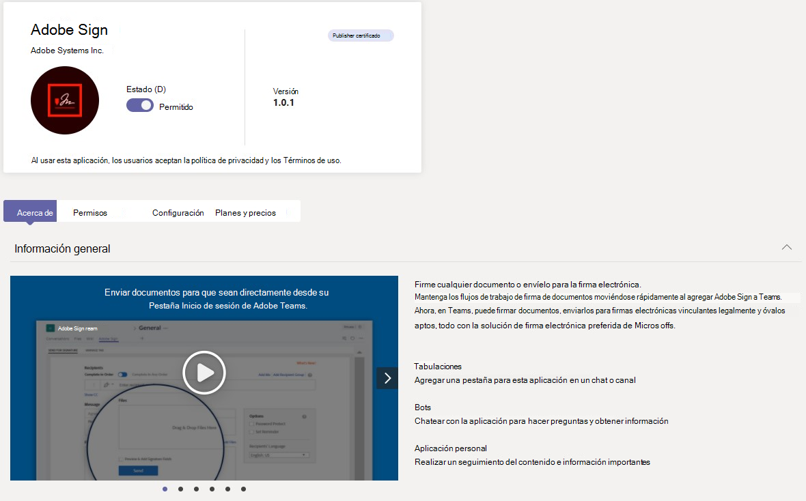

# Administrar las aplicaciones en el centro de administración de Microsoft Teams

Como administrador, puede ver y administrar todas las aplicaciones de Teams de su organización. En la página Administrar aplicaciones del Teams centro de administración puede:

- [Permitir o bloquear aplicaciones en el nivel de organización](#allow-and-block-apps)
- [Aplicaciones bloqueadas por editores](#apps-blocked-by-publishers)
- [Agregar aplicaciones a teams](#add-an-app-to-a-team)
- [Aprobar o cargar nuevas aplicaciones personalizadas en la tienda de aplicaciones de su organización](#publish-a-custom-app-to-your-organizations-app-store)
- [Ver permisos solicitados por aplicaciones](#view-resource-specific-consent-permissions)
- [Conceder consentimiento a las aplicaciones](#grant-admin-consent-to-apps)
- [Servicio de compra de aplicaciones de terceros](#purchase-services-for-third-party-apps)
- [Ver el estado de nivel de organización y las propiedades de las aplicaciones](#view-apps)
- [Administrar la configuración de aplicaciones para toda la organización](#manage-org-wide-app-settings)
- [Ver la información de seguridad y cumplimiento de las aplicaciones certificadas de Microsoft 365](#view-security-and-compliance-information-for-microsoft-365-certified-apps)

La página Administrar aplicaciones le ofrece una vista de todas las aplicaciones disponibles, proporcionándole la información que necesita para decidir qué aplicaciones permitir o bloquear en toda la organización. A continuación, puede usar [directivas de permisos de aplicaciones](teams-app-permission-policies.md), [directivas de configuración](teams-app-setup-policies.md) de aplicaciones y [directivas y opciones de configuración de aplicaciones personalizadas](teams-custom-app-policies-and-settings.md) para configurar la experiencia de la aplicación para usuarios específicos de su organización.

En el panel de navegación izquierdo del Centro de administración de Microsoft Teams, vaya a **Aplicaciones de Teams** > **Administrar aplicaciones**. Debe ser administrador global o Teams administrador del servicio para poder acceder a la página.

> [!NOTE]
> La página Administrar aplicaciones aún no está disponible en Microsoft 365 Government Community Cloud High (GCCH) o en las implementaciones del Departamento de Defensa (DoD) de Teams.

## Ver aplicaciones

Puede ver todas las aplicaciones, incluida la siguiente información sobre cada aplicación.

- **Nombre**: el nombre de la aplicación. Selecciona el nombre de la aplicación para ir a la página de detalles de la aplicación y ver más información sobre la aplicación. Esto incluye una descripción de la aplicación, independientemente de si está permitida o bloqueada, versión, directiva de privacidad, términos de uso, categorías que se aplican a la aplicación, estado de certificación, capacidades compatibles e id. de aplicación.
- **Certificación**: si la aplicación ha pasado por la certificación, verás **Microsoft 365 certificado** o **Publisher atestación**. Selecciona el vínculo para ver los detalles de certificación de la aplicación. Si ves `--`, no tenemos información de certificación para la aplicación. Para obtener más información sobre las aplicaciones certificadas en Teams, lee [Microsoft 365 programa de certificación de aplicaciones](/microsoft-365-app-certification/overview).
- **Publisher**: nombre del editor.
- **Estado de publicación**: Estado de publicación de aplicaciones personalizadas.
- **Estado**: Estado de la aplicación en el nivel de organización, que puede ser uno de los siguientes:
  - **Permitido**: la aplicación está disponible para todos los usuarios de su organización.
  - **Bloqueado**: la aplicación está bloqueada y no está disponible para los usuarios de la organización.
  - **Bloqueado por el editor**: la aplicación está bloqueada por el editor y está oculta para los usuarios finales de forma predeterminada. Después de configurar la aplicación mediante las instrucciones del editor, puede permitir o bloquear la aplicación para que esté disponible para los usuarios finales.
  - **Bloqueado para toda la organización**: la aplicación está bloqueada en la configuración de toda la organización.
      Es importante saber que esta columna representa el estado permitido y bloqueado de las aplicaciones que estaban anteriormente en el panel **de configuración de toda la organización** . Ahora puede ver, bloquear y permitir aplicaciones en toda la organización en la página **Administrar aplicaciones** .
- **Licencias**: indica si una aplicación ofrece una suscripción de Software como servicio (SaaS) para su compra. Esta columna se aplica solo a aplicaciones de terceros. Cada aplicación de terceros tendrá uno de los siguientes valores:
  - **Compra**: la aplicación ofrece una suscripción SaaS y está disponible para comprar.  
  - **Comprado**: la aplicación ofrece una suscripción a SaaS y ha comprado licencias para ella.
  - **- -**: La aplicación no ofrece una suscripción SaaS.
- **Aplicación personalizada**: si la aplicación es una aplicación personalizada.
- **Permisos**: indica si una aplicación personalizada o de terceros registrada en Azure Active Directory (Azure AD) tiene permisos que necesitan consentimiento. Verá uno de los siguientes valores:
  - **Ver detalles**: la aplicación tiene permisos que requieren consentimiento antes de que la aplicación pueda acceder a los datos.
  - **- -**: La aplicación no tiene permisos que necesiten consentimiento.
- **Categorías**: categorías que se aplican a la aplicación.
- **Versión**: Versión de la aplicación.
- **El administrador puede instalar en reuniones**: indica si los administradores de las reuniones del equipo pueden instalar una aplicación. [Aprende más](teams-app-setup-policies.md#install-apps)

Para ver la información que desea en la tabla, seleccione **Editar columna** en la esquina superior derecha para agregar o quitar columnas a la tabla.

## Publicar una aplicación personalizada en la tienda de aplicaciones de su organización

Usa la página Administrar aplicaciones para publicar aplicaciones creadas específicamente para tu organización. Después de publicar una aplicación personalizada, está disponible para los usuarios de la tienda de aplicaciones de su organización. Hay dos formas de publicar una aplicación personalizada en la tienda de aplicaciones de su organización. La forma de usar depende de cómo obtenga la aplicación.

- [Aprobar una aplicación personalizada](#approve-a-custom-app): usa este método si el desarrollador envía la aplicación directamente a la página Administrar aplicaciones mediante la API de envío de aplicaciones Teams. A continuación, puede revisar y publicar (o rechazar) la aplicación directamente desde la página de detalles de la aplicación.
- [Upload un paquete de aplicación](#upload-an-app-package): use este método si el desarrollador le envía el paquete de la aplicación en .zip formato. Para publicar la aplicación, cargue el paquete de la aplicación.

### Aprobar una aplicación personalizada

El widget **Aprobaciones pendientes** de la página Administrar aplicaciones te notifica cuando un desarrollador envía una aplicación mediante la API de envío de aplicaciones Teams. Una aplicación recién enviada aparece con el **estado Publicación** de **Enviado** y el **estado** de **Bloqueado**. Ve a la página de detalles de la aplicación para ver más información sobre la aplicación y, a continuación, para publicarla, establece **Estado de publicación** en **Publicar**.

También se le notificará cuando un desarrollador envíe una actualización a una aplicación personalizada. Después, puede revisar y publicar (o rechazar) la actualización en la página de detalles de la aplicación. Se siguen aplicando todas las directivas de permisos y de configuración de aplicaciones para la aplicación actualizada.

Para obtener más información, consulta [Publicar una aplicación personalizada enviada a través de la API de envío de aplicaciones de Teams](submit-approve-custom-apps.md).

### Upload un paquete de aplicación

El desarrollador crea un paquete de aplicación Teams con [Teams App Studio](/microsoftteams/platform/get-started/get-started-app-studio) y, a continuación, te lo envía en .zip formato. Cuando tengas el paquete de la aplicación, puedes cargarlo en la tienda de aplicaciones de tu organización.

Para cargar una nueva aplicación personalizada, selecciona **Upload** para cargar el paquete de la aplicación. La aplicación no se resalta después de cargarla, por lo que tendrás que buscar en la lista de aplicaciones de la página Administrar aplicaciones para encontrarla.

Para actualizar una aplicación después de cargarla, en la lista de aplicaciones de la página Administrar aplicaciones, selecciona el nombre de la aplicación y, a continuación **, actualizar.** Al hacerlo, se reemplaza la aplicación existente y se siguen aplicando todas las directivas de permisos y directivas de configuración de aplicaciones para la aplicación actualizada.

Para obtener más información, consulta [Publicar una aplicación personalizada cargando un paquete de aplicación](upload-custom-apps.md).

## Permitir y bloquear aplicaciones

La página Administrar aplicaciones es donde permites o bloqueas aplicaciones individuales en el nivel de organización. Muestra todas las aplicaciones disponibles y su estado actual de aplicación de nivel de organización. (El bloqueo y el permiso de aplicaciones en el nivel de organización se han movido desde el panel de configuración de aplicaciones de **toda** la organización hasta aquí).

Para permitir o bloquear una aplicación, selecciónala y, a continuación, selecciona **Permitir** o **Bloquear**. Al bloquear una aplicación, se deshabilitan todas las interacciones con ella y la aplicación no aparece en Teams para los usuarios de su organización.

Al bloquear o permitir una aplicación en la página Administrar aplicaciones, esa aplicación se bloquea o se permite para todos los usuarios de la organización.  Al bloquear o permitir una aplicación en una directiva de permisos de aplicación de Teams, se bloquea o se permite para los usuarios asignados a esa directiva. Para que un usuario pueda instalar e interactuar con cualquier aplicación, debe permitir la aplicación en el nivel de organización en la página Administrar aplicaciones y en la directiva de permisos de la aplicación asignada al usuario.

 > [!NOTE]
 > Para desinstalar una aplicación, haz clic con el botón derecho en la aplicación y, a continuación, haz clic en **Desinstalar** o usa el menú **Más aplicaciones** en el lado izquierdo.

## Aplicaciones bloqueadas por editores

Cuando un ISV publica una aplicación en la tienda global de aplicaciones, es posible que necesiten administradores para configurar o personalizar la experiencia de la aplicación. El administrador puede hacer que esté disponible para los usuarios finales cuando la aplicación esté completamente configurada.

Por ejemplo, Contoso Electronics es un ISV que creó una aplicación de asistencia para Microsoft Teams. Contoso Electronics quiere que sus clientes configuren determinadas propiedades de la aplicación para que, cuando los usuarios interactúen con la aplicación, funcione según lo esperado. Antes de que un administrador pueda permitir o bloquear la aplicación, se mostrará como **Bloqueada por el editor** en el centro de administración de Teams y se ocultará a los usuarios finales de forma predeterminada. Después de seguir las instrucciones del editor para configurar la aplicación, puede hacer que esté disponible para los usuarios cambiando el estado a **Permitido**, o impedir que los usuarios usen la aplicación cambiando el estado a **Bloqueado**.

## Agregar una aplicación a un equipo

Use el botón **Agregar al equipo** para instalar una aplicación en un equipo. Tenga en cuenta que esto es solo para las aplicaciones que se pueden instalar en un ámbito de equipo. El botón **Agregar al equipo** no está disponible para las aplicaciones que solo se pueden instalar en el ámbito personal.

1. Busca la aplicación que quieras y, a continuación, selecciona la aplicación haciendo clic a la izquierda del nombre de la aplicación.
2. Seleccione **Agregar al equipo**.
3. En el panel **Agregar al equipo** , busque el equipo al que desea agregar la aplicación, seleccione el equipo y, a continuación, seleccione **Aplicar**.

## Personalizar una aplicación

Ahora puede personalizar una aplicación para incluir un aspecto específico según las necesidades de su organización. Consulta [Personalizar aplicaciones en Teams](customize-apps.md).

## Servicios de compra para aplicaciones de terceros

Puede buscar y comprar licencias de servicios ofrecidos por aplicaciones de terceros para los usuarios de su organización directamente desde la página Administrar aplicaciones. La columna **Licencias** de la tabla indica si una aplicación ofrece una suscripción SaaS de pago. Seleccione **Comprar ahora** para ver la información de planes y precios y comprar licencias para los usuarios. Para obtener más información, consulta [Comprar servicios para Teams aplicaciones de terceros en el Centro de administración de Microsoft Teams](purchase-third-party-apps.md).

## Conceder consentimiento de administrador a las aplicaciones

Puede revisar y dar su consentimiento a las aplicaciones que solicitan permisos en nombre de todos los usuarios de su organización. Esto se hace para que los usuarios no tengan que revisar ni aceptar los permisos solicitados por la aplicación cuando inicien la aplicación. La columna **Permisos** indica si una aplicación tiene permisos que necesitan consentimiento. Verá un vínculo **Ver detalles** para cada aplicación registrada en Azure AD que tenga permisos que necesiten consentimiento. Para obtener más información, consulte [Ver permisos de aplicaciones y conceder consentimiento de administrador en el Centro de administración de Microsoft Teams](app-permissions-admin-center.md).

## Ver permisos de consentimiento específicos de recursos

Los permisos de consentimiento específico de recursos (RSC) permiten a los propietarios del equipo conceder el consentimiento a una aplicación para acceder a los datos de un equipo y modificarlos. Los permisos RSC son permisos granulares Teams específicos que definen lo que una aplicación puede hacer en un equipo específico. Puedes ver los permisos de RSC en la pestaña **Permisos** de la página de detalles de la aplicación de una aplicación. Para obtener más información, consulte [Ver permisos de aplicaciones y conceder consentimiento de administrador en el Centro de administración de Microsoft Teams](app-permissions-admin-center.md).

## Administrar la configuración de aplicaciones para toda la organización

Use la configuración de aplicaciones para toda la organización para controlar si los usuarios con una [licencia F](https://www.microsoft.com/microsoft-365/enterprise/frontline#office-SKUChooser-0dbn8nt) obtienen la experiencia de aplicación de primera línea adaptada, si los usuarios pueden instalar aplicaciones de terceros y si los usuarios pueden cargar o interactuar con aplicaciones personalizadas en su organización. La configuración de aplicaciones para toda la organización rige el comportamiento de todos los usuarios e invalida cualquier otra directiva de permisos de aplicación asignada a los usuarios. Puede usarla para controlar las aplicaciones malintencionadas o problemáticas.

> [!NOTE]
> Para obtener información sobre cómo usar la configuración de aplicaciones para toda la organización en Microsoft 365 Administración Pública Government Community Cloud implementaciones de alto GCCH y del Departamento de Defensa (DoD) de Teams, consulta [Administrar directivas de permisos de aplicaciones en Teams](teams-app-permission-policies.md).

1. En la página Administrar aplicaciones, seleccione **Configuración de aplicaciones para toda la organización**. A continuación, puede configurar las opciones que desee en el panel.

    :::image type="content" source="media/manage-apps-org-wide-app-settings.png" alt-text="Captura de pantalla del panel Configuración de aplicaciones para toda la organización en la página Administrar aplicaciones":::

1. En **Aplicaciones adaptadas**, desactiva o activa **Mostrar aplicaciones adaptadas**. Cuando esta configuración está activada, los usuarios con una [licencia F](https://www.microsoft.com/microsoft-365/enterprise/frontline#office-SKUChooser-0dbn8nt) obtienen la experiencia de aplicación de primera línea personalizada. Esta experiencia ancla las aplicaciones más relevantes de Teams para los trabajadores de primera línea. Para obtener más información, consulte [Personalizar aplicaciones de Teams para los trabajadores de primera línea](pin-teams-apps-based-on-license.md).

    Esta característica está disponible para licencias F. En el futuro se admitirán otros tipos de licencia.
1. En **Aplicaciones de terceros**, desactive o active esta configuración para controlar el acceso a aplicaciones de terceros:

    - **Permitir aplicaciones de terceros**: esto controla si los usuarios pueden usar aplicaciones de terceros. Si desactivas esta configuración, los usuarios no podrán instalar ni usar aplicaciones de terceros y el estado de la aplicación de estas aplicaciones se mostrará como Bloqueado en toda la **organización** en la tabla.

        > [!NOTE]
        > Cuando **Permitir aplicaciones de terceros** está desactivado, [los webhooks salientes](/microsoftteams/platform/webhooks-and-connectors/what-are-webhooks-and-connectors) siguen estando habilitados para todos los usuarios, pero puede controlarlos en el nivel de usuario al permitir o bloquear la aplicación De webhook saliente a través de [directivas de permisos de aplicaciones](teams-app-permission-policies.md). Tenga en cuenta que si tiene directivas de [permisos de aplicaciones](teams-app-permission-policies.md) existentes para **aplicaciones de Microsoft** que usan la opción **Permitir aplicaciones específicas y bloquear todas las demás** , y desea habilitar los webhooks salientes para los usuarios, agregue la aplicación de webhook saliente a la lista.

        > [!NOTE]
        > Los usuarios de Teams puede añadir aplicaciones cuando organizan reuniones o chats con personas de otras organizaciones. También pueden usar aplicaciones compartidas con personas de otras organizaciones cuando organizan reuniones o chats con estas organizaciones. Se aplican las directivas de datos de la organización del usuario anfitrión, así como las prácticas de intercambio de datos de cualquier aplicación de terceros compartida por la organización del usuario.

    - **Permitir las nuevas aplicaciones de terceros publicadas en la tienda de forma predeterminada**: esto controla si las nuevas aplicaciones de terceros publicadas en la tienda de aplicaciones de Teams están disponibles automáticamente en Teams. Solo puede establecer esta opción si permite aplicaciones de terceros.

1. En **Aplicaciones personalizadas**, desactiva o activa **Permitir interacción con aplicaciones personalizadas**. Esta configuración controla si los usuarios pueden interactuar con aplicaciones personalizadas. Para obtener más información, consulte [Administrar configuración y directivas de aplicación personalizadas en Teams](teams-custom-app-policies-and-settings.md).
1. Seleccione **Guardar** para que la configuración de aplicaciones de toda la organización surta efecto.

## Ver la información de seguridad y cumplimiento de las aplicaciones certificadas de Microsoft 365

Al evaluar una aplicación para su organización, los administradores pueden usar agentes de seguridad de acceso a la nube (CASB), como Microsoft Cloud App Security (MCAS), para buscar información sobre la seguridad y los comportamientos de una aplicación. El Centro de administración de Teams incluye información de seguridad y cumplimiento de MCAS para Microsoft 365 Aplicaciones certificadas para que tenga más información sobre si la aplicación satisface o no sus necesidades.

> [!NOTE]
> Esta característica está disponible para todos los administradores, independientemente de si su organización tiene o no una licencia compatible con MCAS.

Para acceder a MCAS información, siga estos pasos:

1. En el centro de administración de Teams, selecciona **Administrar aplicaciones** en **Teams aplicaciones**.
1. Selecciona **Certificación** para ordenar las aplicaciones y enviar todas las aplicaciones Microsoft 365 Certified a la parte superior de la tabla.
1. Elija una aplicación Microsoft 365 Certified.
1. Seleccione la pestaña **Seguridad y cumplimiento** .

En esta pestaña, encontrará información sobre seguridad, cumplimiento y protección de datos. También puede expandir cada lista desplegable para obtener más detalles sobre qué funcionalidades son compatibles con la aplicación seleccionada.

## Temas relacionados

- [Configurar la administración para aplicaciones en Teams](admin-settings.md)
