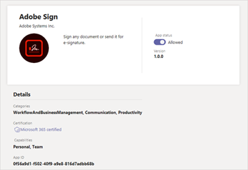

Administrar las aplicaciones en el centro de administración de Microsoft TeamsManage your apps in the Microsoft Teams admin center
======================================================

Como administrador, la página Manage Apps en el centro de administración de Microsoft Teams es donde ve y administra todas las aplicaciones de Teams para su organización.As an admin, the Manage apps page in the Microsoft Teams admin center is where you view and manage all Teams apps for your organization. Aquí puede ver el estado de organización y las propiedades de las aplicaciones, aprobar o cargar nuevas aplicaciones personalizadas en la tienda de aplicaciones de su organización, bloquear o permitir aplicaciones en el nivel de organización, agregar aplicaciones a Teams (en versión preliminar), comprar servicios para aplicaciones de terceros, ver permisos solicitados por aplicaciones, conceder consentimiento de administrador a las aplicaciones y administrar la configuración de aplicacionesHere, you can see the org-level status and properties of apps, approve or upload new custom apps to your organization's app store, block or allow apps at the org level, add apps to teams (in preview), purchase services for third-party apps, view permissions requested by apps, grant admin consent to apps, and manage org-wide app settings.

La página Manage apps le ofrece una vista de todas las aplicaciones disponibles, y le proporciona la información que necesita para decidir qué aplicaciones quiere permitir o bloquear en toda la organización.The Manage apps page gives you a view into all available apps, providing you with the information you need to decide which apps to allow or block across your organization. Después, puede usar [las directivas de permisos](teams-app-permission-policies.md)de la aplicación, [las directivas de configuración](teams-app-setup-policies.md)de la aplicación y [las directivas de aplicaciones personalizadas y la configuración](teams-custom-app-policies-and-settings.md) para configurar la experiencia de la aplicación para usuarios específicos de su organización.You can then use [app permission policies](teams-app-permission-policies.md), [app setup policies](teams-app-setup-policies.md), and [custom app policies and settings](teams-custom-app-policies-and-settings.md) to configure the app experience for specific users in your organization.

En el centro de navegación izquierdo del centro de administración de Microsoft Teams, vaya a **aplicaciones de Teams**  >  **Manage apps**.In the left navigation of the Microsoft Teams admin center, go to **Teams apps** > **Manage apps**. Debe ser administrador global o administrador de servicios de equipo para poder acceder a la página.You must be a global admin or Teams service admin to access the page.

> [!NOTE]
> La página Manage apps aún no está disponible en las implementaciones de Teams de la comunidad de Microsoft 365 pública Cloud (GCC).The Manage apps page isn't available yet in Microsoft 365 Government Community Cloud (GCC) deployments of Teams.

## Ver aplicacionesView apps

Puede ver todas las aplicaciones, incluida la siguiente información sobre cada aplicación.You can view every app including the following information about each app.

- **Name**: el nombre de la aplicación.**Name**: The app name. Haga clic en el nombre de la aplicación para ir a la página de detalles de la aplicación para ver más información sobre la aplicación.Click the app name to go to the app details page to see more information about the app. Esto incluye una descripción de la aplicación, si está permitida o bloqueada, la versión, la política de privacidad, las condiciones de uso, las categorías que se aplican a la aplicación, el estado de la certificación, las características admitidas y el identificador de la aplicación.This includes a description of the app, whether it's allowed or blocked, version, privacy policy, terms of use, categories that apply to the app, certification status, supported capabilities, and app ID. Aquí se muestra un ejemplo:Here's an example:

  
  
- **Certificación**: Si la aplicación ha superado la certificación, verá la atestación de **Microsoft 365** o la **atestación de Publisher**.**Certification**: If the app has gone through certification, you'll see either **Microsoft 365 certified** or **Publisher attestation**. Haga clic en el vínculo para ver los detalles de certificación de la aplicación.Click the link to view certification details for the app. Si ves " **--** ", no tenemos información de certificación de la aplicación.If you see "**--**", we don't have certification information for the app. Para obtener más información sobre las aplicaciones certificadas en Teams, lea el [programa de certificación de aplicaciones de Microsoft 365](https://docs.microsoft.com/teams-app-certification/all-apps).To learn more about certified apps in Teams, read [Microsoft 365 App Certification program](https://docs.microsoft.com/teams-app-certification/all-apps).  
- **Publisher**: nombre del editor.**Publisher**: Name of the publisher.
- **Estado de publicación**: estado de publicación de aplicaciones personalizadas.**Publishing status**: Publishing status of custom apps.
- **Estado**: el estado de la aplicación en el nivel de la organización, que puede ser uno de los siguientes:**Status**: Status of the app at the org level, which can be one of the following:

    - **Permitido**: la aplicación está disponible para todos los usuarios de la organización.**Allowed**: The app is available for all users in your organization.
    
    - **Bloqueado**: la aplicación está bloqueada y no está disponible para los usuarios de su organización.**Blocked**: The app is blocked and not available for any users in your organization.
    
    - **Organización bloqueada**: la aplicación está bloqueada en la configuración de la aplicación en toda la organización.**Blocked org-wide**: The app is blocked in org-wide app settings.
    
      Es importante saber que esta columna representa el estado permitido y bloqueado de las aplicaciones que anteriormente se encontraban en el panel **configuración de toda la organización** .It's important to know that this column represents the allowed and blocked status of apps that were formerly on the **Org-wide settings** pane. Ahora ve, bloquea y permite aplicaciones en el ámbito de la organización en la página **Manage apps** .You now view, block, and allow apps at the org-wide on the **Manage apps** page. 
- **Licencias**: indica si una aplicación ofrece una suscripción de software como servicio (SaaS) para la compra.**Licenses**: Indicates whether an app offers a Software as a Service (SaaS) subscription for purchase. Esta columna solo se aplica a aplicaciones de terceros.This column applies only to third-party apps. Cada aplicación de terceros tendrá uno de los siguientes valores:Each third-party app will have one of the following values:
    - **Comprar ahora**: la aplicación ofrece una suscripción de SaaS y está disponible para la compra.**Purchase now**: The app offers a SaaS subscription and is available to purchase.  
    - **Comprado**: la aplicación ofrece una suscripción de SaaS y ha comprado las licencias para él.**Purchased**: The app offers a SaaS subscription and you've purchased licenses for it.
    - **--**: La aplicación no ofrece una suscripción de SaaS.**- -**: The app doesn't offer a SaaS subscription.
- **Aplicación personalizada**: Si la aplicación es una aplicación personalizada.**Custom app**: Whether the app is a custom app.
- **Permisos**: indica si una aplicación personalizada o de terceros que está registrada en Azure Active Directory (Azure ad) tiene permisos que necesitan consentimiento.**Permissions**: Indicates whether a third-party or custom app that's registered in Azure Active Directory (Azure AD) has permissions that need consent. Verá uno de los siguientes valores:You'll see one of the following values:
    - **Ver detalles**: la aplicación tiene permisos que requieren consentimiento para que la aplicación pueda acceder a los datos.**View details**: The app has permissions that require consent before the app can access data. 
    - **--**: La aplicación no tiene permisos que necesiten autorización.**- -**: The app doesn't have permissions that need consent.
- **Categorías**: categorías que se aplican a la aplicación.**Categories**: Categories that apply to the app.
- **Versión**: versión de la aplicación.**Version**: App version.

Para ver la información que desea en la tabla, haga clic en **Editar columna** , en la esquina superior derecha, para agregar o quitar columnas a la tabla.To see the information that you want in the table, click **Edit Column** in the upper-right corner to add or remove columns to the table.

## Publicar una aplicación personalizada en la tienda de aplicaciones de su organizaciónPublish a custom app to your organization's app store

Use la página Administrar aplicaciones para publicar aplicaciones que se hayan creado específicamente para su organización.Use the Manage apps page to publish apps that are built specifically for your organization. Después de publicar una aplicación personalizada, esta estará disponible para los usuarios de la tienda de aplicaciones de su organización.After you publish a custom app, it's available to users in your organization's app store. Hay dos formas de publicar una aplicación personalizada en la tienda de aplicaciones de su organización.There are two ways to publish a custom app to your organization's app store. La manera en que uses depende de cómo obtengas la aplicación.The way that you use depends on how you get the app.

- [Aprobar una aplicación personalizada](#approve-a-custom-app): Use este método si el desarrollador envía la aplicación directamente a la página de administración de aplicaciones con la API de envío de la aplicación de Teams.[Approve a custom app](#approve-a-custom-app): Use this method if the developer submits the app directly to the Manage apps page using the Teams App Submission API. Después, puede revisar y publicar (o rechazar) la aplicación directamente desde la página de detalles de la aplicación.You can then review and publish (or reject) the app directly from the app details page.
- [Cargar un paquete](#upload-an-app-package)de la aplicación: Use este método si el desarrollador le envía el paquete de la aplicación con el formato. zip.[Upload an app package](#upload-an-app-package): Use this method if the developer sends you the app package in .zip format. Para publicar la aplicación, carga el paquete de la aplicación.You publish the app by uploading the app package.

###  Aprobar una aplicación personalizadaApprove a custom app

El widget **aprobaciones pendientes** en la página Administrar aplicaciones le notifica cuando un desarrollador envía una aplicación con la API de envío de aplicaciones de Teams.The **Pending approvals** widget on the Manage apps page notifies you when a developer submits an app by using the Teams App Submission API. Una aplicación recién enviada aparece con un **Estado de publicación** de **enviado** y un **Estado** de **bloqueado**.A newly submitted app is listed with a **Publishing status** of **Submitted** and an **Status** of **Blocked**. Vaya a la página de detalles de la aplicación para ver más información sobre la aplicación y, después, para publicarla, establezca el **Estado de publicación** en **publicar**.Go to the app details page to see more information about the app, and then to publish it, set **Publishing status** to **Publish**.

También recibirás una notificación cuando un desarrollador envíe una actualización a una aplicación personalizada.You're also notified when a developer submits an update to a custom app. Después, puede revisar y publicar (o rechazar) la actualización en la página de detalles de la aplicación.You can then review and publish (or reject) the update on the app details page. Todas las directivas de permisos de aplicaciones y directivas de configuración de la aplicación siguen aplicándose para la aplicación actualizada.All app permission policies and app setup policies remain enforced for the updated app.

Para obtener más información, vea [publicar una aplicación personalizada enviada a través de la API de envío de la aplicación de Teams](submit-approve-custom-apps.md).To learn more, see [Publish a custom app submitted through the Teams App Submission API](submit-approve-custom-apps.md).

### Cargar un paquete de la aplicaciónUpload an app package

El desarrollador crea un paquete de la aplicación Teams con [Teams App Studio](https://docs.microsoft.com/microsoftteams/platform/get-started/get-started-app-studio)y, a continuación, lo envía en formato. zip.The developer creates a Teams app package using [Teams App Studio](https://docs.microsoft.com/microsoftteams/platform/get-started/get-started-app-studio), and then sends it to you in .zip format. Cuando tenga el paquete de la aplicación, puede cargarlo en la tienda de aplicaciones de su organización.When you have the app package, you can upload it to your organization's app store.

Para cargar una nueva aplicación personalizada, seleccione **cargar** para cargar el paquete de la aplicación.To upload a new custom app, select **Upload** to upload the app package. La aplicación no se resalta después de cargarla, tendrá que buscar en la lista de aplicaciones en la página de administración de aplicaciones para encontrarla.The app isn't highlighted after it's uploaded so you'll need to search the list of apps on the Manage apps page to find it.

Para actualizar una aplicación después de que se cargue, en la lista de aplicaciones de la página Administrar aplicaciones, haga clic en el nombre de la aplicación y, a continuación, haga clic en **Actualizar**.To update an app after it's uploaded, in the list of apps on the Manage apps page, click the app name, and then click **Update**. Esto reemplaza la aplicación existente y todas las directivas de permisos de la aplicación y de configuración de la aplicación siguen aplicándose para la aplicación actualizada.Doing this replaces the existing app and all app permission policies and app setup policies remain enforced for the updated app.

Para obtener más información, vea [publicar una aplicación personalizada mediante la carga de un paquete de la aplicación](upload-custom-apps.md).To learn more, see [Publish a custom app by uploading an app package](upload-custom-apps.md).

## Permitir y bloquear aplicacionesAllow and block apps

La página Manage apps es donde permite o bloquea aplicaciones individuales en el nivel de organización.The Manage apps page is where you allow or block individual apps at the org level. Muestra todas las aplicaciones disponibles y el estado actual de la aplicación en el nivel de organización.It shows every available app and its current org-level app status. (El bloqueo y la autorización de aplicaciones en el nivel de organización se han movido del panel de configuración de la **aplicación de toda la organización** a aquí).(Blocking and allowing apps at the org level has moved from the **Org-wide app settings** pane to here.)

Para permitir o bloquear una aplicación, selecciónela y, a continuación, haga clic en **permitir** o en **bloquear**.To allow or block an app, select it, and then click **Allow** or **Block**. Cuando bloquea una aplicación, todas las interacciones con esa aplicación se deshabilitan y la aplicación no aparece en Teams para ninguno de los usuarios de su organización.When you block an app, all interactions with that app are disabled and the app doesn't appear in Teams for any users in your organization.

Cuando bloquea o permite una aplicación en la página Administrar aplicaciones, la aplicación está bloqueada o está permitida para todos los usuarios de su organización.When you block or allow an app on the Manage apps page, that app is blocked or allowed for all users in your organization.  Al bloquear o permitir una aplicación en una directiva de permisos de la aplicación de Teams, se bloquea o permite a los usuarios que tienen asignada esa Directiva.When you block or allow an app in a Teams app permission policy, it's blocked or allowed for users who are assigned that policy. Para que un usuario pueda instalar e interactuar con cualquier aplicación, debe permitir la aplicación en el nivel de la organización en la página Administrar aplicaciones y en la Directiva de permisos de la aplicación que está asignada al usuario.For a user to be able to install and interact with any app, you must allow the app at the org level on the Manage apps page and in the app permission policy that's assigned to the user.

 > [!NOTE]
 > Para desinstalar una aplicación, haga clic con el botón derecho en la aplicación y, a continuación, haga clic en **desinstalar** o use el menú **más aplicaciones** en el lado izquierdo.To uninstall an app, right-click the app, and then click **Uninstall** or use the **More apps** menu on the left side.

## Agregar una aplicación a un equipoAdd an app to a team

[!INCLUDE [preview-feature](includes/preview-feature.md)]

Use el botón **Agregar al equipo** para instalar una aplicación en un equipo.You use the **Add to team** button to install an app to a team. Tenga en cuenta que esto es solo para las aplicaciones que se pueden instalar en un ámbito de equipo.Keep in mind that this is only for apps that can be installed in a team scope. El botón **Agregar a equipo** no está disponible para las aplicaciones que solo se pueden instalar en el ámbito personal.The **Add to team** button isn't available for apps that can only be installed in the personal scope.

1. Busque la aplicación que quiera y, después, seleccione la aplicación haciendo clic a la izquierda del nombre de la aplicación.Search for the app you want, and then select the app by clicking to the left of the app name.
2. Seleccione **Agregar al equipo**.Select **Add to team**.
3. En el panel **Agregar a equipo** , busque el equipo al que desea agregar la aplicación, seleccione el equipo y, después, haga clic en **aplicar**.In the **Add to team** pane, search for the team you want to add the app to, select the team, and then select **Apply**.

## Servicios de compra para aplicaciones de tercerosPurchase services for third-party apps

Puede buscar y comprar licencias de servicios ofrecidos por aplicaciones de terceros para los usuarios de su organización directamente desde la página Manage apps.You can search for and purchase licenses for services offered by third-party apps for users in your organization directly from the Manage apps page. La columna **licencias** de la tabla indica si una aplicación ofrece una suscripción de SaaS de pagos.The **Licenses** column in the table indicates whether an app offers a paid SaaS subscription. Haga clic en **comprar ahora** para ver los planes y la información de precios y comprar licencias para los usuarios.Click **Purchase now** to view plans and pricing information and buy licenses for your users. Para obtener más información, vea [servicios de compra de aplicaciones de terceros para equipos en el centro de administración de Microsoft Teams](purchase-third-party-apps.md).To learn more, see [Purchase services for Teams third-party apps in the Microsoft Teams admin center](purchase-third-party-apps.md).

## Conceder consentimiento del administrador a las aplicacionesGrant admin consent to apps

Puede revisar y conceder consentimiento a las aplicaciones que solicitan permisos en nombre de todos los usuarios de su organización.You can review and grant consent to apps that request permissions on behalf of all users in your organization. Haga esto para que los usuarios no tengan que revisar y aceptar los permisos solicitados por la aplicación cuando inicien la aplicación.You do this so that users don't have to review and accept the permissions requested by the app when they start the app. La columna **permisos** indica si una aplicación tiene permisos que necesitan consentimiento.The **Permissions** column indicates whether an app has permissions that need consent. Verá un vínculo **Ver detalles** para cada aplicación registrada en Azure ad que tenga permisos que necesiten conceder.You'll see a **View details** link for each app registered in Azure AD that has permissions that need consent. Para obtener más información, consulte [ver permisos de aplicaciones y conceder consentimiento de administrador en el centro de administración de Microsoft Teams](app-permissions-admin-center.md).To learn more, see [View app permissions and grant admin consent in the Microsoft Teams admin center](app-permissions-admin-center.md).

## Ver permisos de consentimiento específicos de recursosView resource-specific consent permissions

Los permisos de consentimiento específico de recursos (RSC) permiten a los propietarios del equipo conceder el consentimiento para que una aplicación pueda acceder y modificar los datos de un equipo.Resource-specific consent (RSC) permissions let team owners grant consent for an app to access and modify a team's data. Los permisos RSC son granulares, permisos específicos de teams que definen lo que una aplicación puede hacer en un equipo específico.RSC permissions are granular, Teams-specific permissions that define what an app can do in a specific team. Puede ver los permisos RSC en la pestaña **permisos** de la página de detalles de la aplicación de una aplicación.You can view RSC permissions on the **Permissions** tab of the app details page for an app. Para obtener más información, consulte [ver permisos de aplicaciones y conceder consentimiento de administrador en el centro de administración de Microsoft Teams](app-permissions-admin-center.md).To learn more, see [View app permissions and grant admin consent in the Microsoft Teams admin center](app-permissions-admin-center.md).

## Administrar la configuración de la aplicación en toda la organizaciónManage org-wide app settings

Use la configuración de la aplicación en toda la organización para controlar si los usuarios pueden instalar aplicaciones de terceros y si los usuarios pueden cargar o interactuar con aplicaciones personalizadas de su organización.Use org-wide app settings to control whether users can install third-party apps and whether users can upload or interact with custom  apps in your organization. La configuración de la aplicación en toda la organización rige el comportamiento de todos los usuarios y anula cualquier otra directiva de permisos de aplicación asignada a los usuarios.Org-wide app settings govern the behavior for all users and override any other app permission policies assigned to users. Puede usarlos para controlar aplicaciones malintencionadas o problemáticas.You can use them to control malicious or problematic apps.

> [!NOTE]
> Para obtener información sobre cómo usar la configuración de aplicaciones en toda la organización en implementaciones de Teams gubernamentales-GCC de Microsoft 365, consulte [Administrar directivas de permisos de aplicaciones en Teams](teams-app-permission-policies.md).To learn how to use org-wide app settings in Microsoft 365 Government - GCC deployments of Teams, see [Manage app permission policies in Teams](teams-app-permission-policies.md).

1. En la página Administrar aplicaciones, seleccione **configuración**de la aplicación en toda la organización.On the Manage apps page, select **Org-wide app settings**. Puede establecer la configuración que desee en el panel.You can then configure the settings you want in the panel.

    
    
2. En **aplicaciones de terceros**, desactive o Active esta configuración para controlar el acceso a las aplicaciones de terceros:Under **Third-party apps**, turn off or turn on these settings to control access to third-party apps:

    - **Permitir aplicaciones de terceros**: controla si los usuarios pueden usar aplicaciones de terceros.**Allow third-party apps**: This controls whether users can use third-party apps. Si desactiva esta configuración, los usuarios no podrán instalar ni usar ninguna aplicación de terceros y el estado de la aplicación de estas aplicaciones aparecerá **bloqueado: todo el mundo** en la tabla.If you turn off this setting, your users won't be able to install or use any third-party apps and the app status of these apps is displayed as **Blocked org-wide** in the table.

        > [!NOTE]
        > Cuando se desactivan las **aplicaciones de terceros** , los enlaces de correo [salientes](https://docs.microsoft.com/microsoftteams/platform/webhooks-and-connectors/what-are-webhooks-and-connectors) están deshabilitados, lo que significa que los usuarios no pueden crearlos.When **Allow third-party apps** is off, [outgoing webhooks](https://docs.microsoft.com/microsoftteams/platform/webhooks-and-connectors/what-are-webhooks-and-connectors) are disabled, which means that users can't create them. Cuando esta configuración está activada, los enlaces de webhook de salida están habilitados para todos los usuarios y puede controlarlos en el nivel de usuario permitiendo o bloqueando la aplicación de Hook de salida mediante [directivas de permisos](teams-app-permission-policies.md)de la aplicación.When this setting is on, outgoing webhooks are enabled for all users and you can control them at the user level by allowing or blocking the Outgoing Webhook app through [app permission policies](teams-app-permission-policies.md).   Tenga en cuenta que si tiene [directivas de permisos de aplicaciones](teams-app-permission-policies.md) existentes para **aplicaciones de Microsoft** que usan la configuración **permitir aplicaciones específicas y bloquear a todos los** usuarios, y desea habilitar los webhooks salientes para los usuarios, agregue la aplicación de webhook saliente a la lista.Note that if you have existing [app permission policies](teams-app-permission-policies.md) for **Microsoft apps** that use the **Allow specific apps and block all others** setting, and you want to enable outgoing webhooks for users, add the Outgoing Webhook app to the list.
    - **Permitir que todas las aplicaciones de terceros se publiquen en la tienda de forma predeterminada**: controla si las nuevas aplicaciones de terceros publicadas en la tienda de aplicaciones de Teams se encuentran disponibles automáticamente en Teams.**Allow any new third-party apps published to the store by default**: This controls whether new third-party apps that are published to the Teams app store become automatically available in Teams. Solo puede establecer esta opción si permite aplicaciones de terceros.You can only set this option if you allow third-party apps.

3. En **aplicaciones personalizadas**, desactive o desactive la **opción permitir la interacción con aplicaciones personalizadas**.Under **Custom apps**, turn off or turn on **Allow interaction with custom apps**. Esta configuración controla si los usuarios pueden interactuar con aplicaciones personalizadas.This setting controls whether users can interact with custom apps. Para obtener más información, vea [administrar la configuración y las directivas de la aplicación personalizadas en Teams](teams-custom-app-policies-and-settings.md).To learn more, see [Manage custom app policies and settings in Teams](teams-custom-app-policies-and-settings.md).
4. Haga clic en **Guardar** para que la configuración de la aplicación de toda la organización surta efecto.Click **Save** for org-wide app settings to take effect.

## Temas relacionadosRelated topics

- [Configurar la administración para aplicaciones en TeamsAdmin settings for apps in Teams](admin-settings.md)