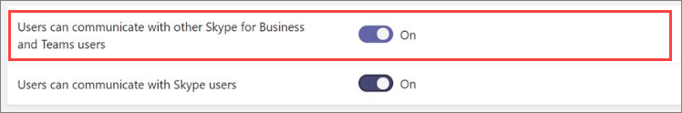

Administrar el acceso externo en Microsoft TeamsManage external access in Microsoft Teams
======================================================

Con el acceso externo de Microsoft Teams, los usuarios de Teams de otros dominios pueden participar en tus chats y llamadas.With Microsoft Teams external access, Teams users from other domains can participate in your chats and calls. También puede permitir a otros usuarios externos que siguen usando Skype empresarial online, Skype empresarial local o incluso Skype a participar.You can also allow other external users who are still using Skype for Business Online, Skype for Business on-prem, or even Skype to participate.

Use acceso externo cuando:Use external access when:
  
- Tiene usuarios en diferentes dominios de su empresa: por ejemplo, Rob@contoso.com y Ann@northwindtraders.com.You have users in different domains in your business: for example, Rob@contoso.com and Ann@northwindtraders.com.

- Quiere que las personas de su organización usen Teams para ponerse en contacto con personas de empresas específicas de fuera de su organización.You want the people in your organization to use Teams to contact people in specific businesses outside of your organization.

- Desea que cualquier persona del mundo que use Teams pueda encontrarse y ponerse en contacto con usted, usando su dirección de correo electrónico.You want anyone else in the world who uses Teams to be able to find and contact you, using your email address. Si usted y otro usuario habilitan el acceso externo y permiten los dominios de cada uno, esto funcionará.If you and another user both enable external access and allow each other's domains, this will work. Si no funciona, el otro usuario debe asegurarse de que su configuración no esté bloqueando su dominio.If it doesn't work, the other user should make sure his or her configuration isn't blocking your domain.

El acceso externo permite a los usuarios externos buscar, llamar y enviar mensajes instantáneos, así como configurar reuniones con usted.External access allows external users to find, call, and send you instant messages, as well as set up meetings with you. Sin embargo, si quiere que los usuarios externos tengan acceso a los equipos y los canales, el acceso de invitados puede ser una mejor manera de hacerlo.However, if you want external users to have access to teams and channels, guest access might be a better way to go. Para obtener más información sobre las diferencias entre el acceso externo y el acceso de invitados, vea acceso [externo frente a acceso de invitados](#external-access-vs-guest-access), a continuación.For more information about the differences between external access and guest access, see [External access vs. guest access](#external-access-vs-guest-access)), below. Para activar el acceso de invitados, consulte [activar el acceso de invitados](set-up-guests.md) para que los usuarios puedan comunicarse.To turn on guest access, see [turn on guest access](set-up-guests.md) so that users can communicate.

> [!IMPORTANT]
> En la actualidad, para federar dentro de la aplicación Microsoft Teams a un usuario externo fuera de su organización que no es actualmente invitado de su Azure Active Directory (Azure AD) o de inquilino, debe estar correctamente configurado para un híbrido y pasarse a Skype empresarial online.Currently, to federate within the Microsoft Teams app to an external user outside of your organization who's not currently a guest of your Azure Active Directory (Azure AD) or tenant, you must be correctly set up for hybrid and moved to Skype for Business Online. A partir de 2/25/2019, Teams no admite la Federación nativa sin que el usuario del perfil SIP se haya alojado en Skype empresarial online.As of 2/25/2019, Teams doesn't support native federation without the user of the SIP profile being homed in Skype for Business Online. Para obtener más información sobre cómo configurar su cuenta para una implementación híbrida y después a los equipos, consulte [actualizar la implementación híbrida de Skype empresarial a teams](https://docs.microsoft.com/en-us/microsoftteams/upgrade-to-teams-execute-skypeforbusinesshybrid).For more on setting up your account for hybrid and then moving to Teams, see [Upgrade Skype for Business hybrid deployment to Teams](https://docs.microsoft.com/en-us/microsoftteams/upgrade-to-teams-execute-skypeforbusinesshybrid).

> [!IMPORTANT]
> Los usuarios invitados siguen la configuración de toda la organización para el modo de coexistencia.Guest users follow Org-wide settings for coexistence mode. Esto no se puede modificar.This cannot be changed.

## Acceso externo frente a acceso de invitadosExternal access vs. guest access

El acceso externo (Federación) y el acceso de invitados son diferentes:External access (federation) and guest access are different:

- Acceso de invitado concede permiso de acceso a una persona.Guest access gives access permission to an individual. Acceso externo concede permiso de acceso a un dominio completo.External access gives access permission to an entire domain.

- El acceso de invitados, una vez otorgado por el propietario de un equipo, permite que un invitado [tenga acceso a recursos](guest-experience.md), como archivos y debates de canales, para un equipo específico y conversa con otros usuarios del equipo al que han sido invitados.Guest access, once granted by a team owner, allows a guest to [access resources](guest-experience.md), such as channel discussions and files, for a specific team, and chat with other users in the team they have been invited to. Con el acceso externo (chat federado), los participantes del chat externo no tienen acceso a los equipos de la organización o a los recursos del equipo.With external access (federated chat), the external chat participants have no access to the inviting organization’s teams or team resources. Solo pueden participar en un chat federado.They can only participate in one-on-one federated chat. Los administradores de inquilinos pueden elegir entre las dos opciones de comunicación dependiendo del nivel de colaboración que sea deseable con la parte externa.Tenant admins can choose between the two communication options depending on which level of collaboration is desirable with the external party. Los administradores pueden elegir entre dos enfoques o ambos, según las necesidades de la organización, pero recomendamos habilitar el acceso de invitados para disfrutar de una experiencia de Teams más completa.Admins can choose either approaches or both, depending on their organizational needs, but we recommend enabling guest access for a fuller, collaborative Teams experience. 

Consulte la tabla siguiente para obtener una comparación de las características de acceso externo e invitado.See the following table for a comparison of external and guest access features.

| CaracterísticaFeature | Usuarios de acceso externoExternal access users | Usuarios de acceso de invitadoGuest access users |
|---------|-----------------------|--------------------|
| El usuario puede chatear con alguien de otra empresaUser can chat with someone in another company | SíYes |SíYes |
| El usuario puede llamar a alguien de otra empresaUser can call someone in another company | SíYes | SíYes |
| El usuario puede ver si alguien de otra empresa está disponible para realizar llamadas o chatsUser can see if someone from another company is available for call or chat | SíYes | Sí1Yes1 |
| El usuario puede buscar usuarios en espacios empresariales externosUser can search for users across external tenants | Sí2Yes2 | NoNo |
| El usuario puede compartir archivosUser can share files | NoNo | SíYes |
| El usuario puede acceder a los recursos de TeamsUser can access Teams resources | NoNo | SíYes |
| Se puede Agregar un usuario a un chat grupalUser can be added to a group chat | NoNo | SíYes |
| Se puede Agregar un usuario a una reuniónUser can be added to a meeting | SíYes | SíYes |
| Se pueden agregar usuarios adicionales a un chat con un usuario externoAdditional users can be added to a chat with an external user | No3No3 | N/DN/A |
| El usuario se identifica como una fiesta externaUser is identified as an external party | SíYes | SíYes |
| Se muestra la presenciaPresence is displayed | SíYes | SíYes |
| Se muestra un mensaje de fuera de la oficinaOut of office message is shown | NoNo | SíYes |
| Usuario individual puede bloquearseIndividual user can be blocked | NoNo | NoNo |
| @mentions son compatibles@mentions are supported | NoNo | SíYes |
| Hacer llamadas privadasMake private calls | SíYes | SíYes |
| Permitir video IPAllow IP video | SíYes | SíYes |
| Modo de uso compartido de pantallaScreen sharing mode | NoNo | SíYes |
| Permitir reunirse ahoraAllow meet now | NoNo | SíYes |
| Editar mensajes enviadosEdit sent messages | NoNo | SíYes |
| Puede eliminar mensajes enviadosCan delete sent messages | NoNo | SíYes |
| Usar Giphy en la conversaciónUse Giphy in conversation | NoNo | SíYes |
| Usar memes en una conversaciónUse memes in conversation | NoNo | SíYes |
| Usar adhesivos en la conversaciónUse stickers in conversation | NoNo | SíYes |
||||

1 siempre que el usuario se haya agregado como invitado y haya iniciado sesión como invitado para el inquilino invitado.1 Provided that the user has been added as a guest and is signed in as a guest to the guest tenant. 
2 solo por correo electrónico o dirección de protocolo de inicio de sesión (SIP).2 Only by email or Session Initiation Protocol (SIP) address. 
3 el chat externo (federado) solo es 1:1.3 External (federated) chat is 1:1 only.

Para obtener más información sobre las características de invitado y la experiencia de invitado, vea [activar o desactivar el acceso de invitado a Microsoft Teams](https://docs.microsoft.com/microsoftteams/set-up-guests) y [Cómo es la experiencia de invitado](https://docs.microsoft.com/microsoftteams/guest-experience).For more information on guest features and the guest experience, see [Turn on or off guest access to Microsoft Teams](https://docs.microsoft.com/microsoftteams/set-up-guests) and [What the guest experience is like](https://docs.microsoft.com/microsoftteams/guest-experience).

Para obtener más información sobre la versión gratuita de Teams y sobre cómo funciona con las características de acceso externo, consulte [diferencias entre Microsoft Teams y Microsoft Teams](https://support.office.com/article/differences-between-microsoft-teams-and-microsoft-teams-free-0b69cf39-eb52-49af-b255-60d46fdf8a9c?ui=en-US&rs=en-US&ad=US).For more information about the free version of Teams and how it works with features found in External Access, see [Differences between Microsoft Teams and Microsoft Teams free](https://support.office.com/article/differences-between-microsoft-teams-and-microsoft-teams-free-0b69cf39-eb52-49af-b255-60d46fdf8a9c?ui=en-US&rs=en-US&ad=US).

## Pasos rápidos para escenariosQuick steps for scenarios

|**Desea....****You want to....**  |**Pasos rápidos****Quick steps**  |
|---------|-----------------------|
|Desea permitir que **los usuarios de Teams** de la organización se comuniquen con **los usuarios de Teams** en otra organización (externa).You want to let **Teams users** in your organization communicate with **Teams users** in another (external) organization.|En acceso externo, agregue el dominio externo a la lista de permitidos o use abrir Federación.In External Access, add the external domain to the Allowed list or use open federation. 
A continuación, haga lo mismo el administrador de la organización de otros equipos.Then have the administrator in the other Teams organization do the same thing.      |
|Desea permitir que **los usuarios de Teams** de la organización se comuniquen con **usuarios de Skype empresarial online** en la misma organización.You want to let **Teams users**  in your organization  communicate with **Skype for Business Online users**  in the same organization.  |Habilite el modo de coexistencia o elija el modo de actualización de islas para admitir los usuarios de Skype empresarial de su organización.Enable Coexistence mode or choose the Islands upgrade mode to support Skype for Business users in your organization.   |
|Desea permitir que **los usuarios de Teams** de la organización se comuniquen con **los usuarios de Skype empresarial online** en otra organización (externa).You want to let **Teams users** in your organization communicate with **Skype for Business Online users** in another (external) organization.      |En acceso externo, agregue el dominio externo a la lista de permitidos o use abrir Federación.In External Access, add the external domain to the Allowed list or use open federation.  
Activar **los usuarios pueden comunicarse con Skype empresarial y los usuarios de Teams** en acceso externo.Turn on **Users can communicate with Skype for Business and Teams users** setting in External Access. 
A continuación, haga lo mismo el administrador de la organización de otros equipos.Then have the administrator in the other Teams organization do the same thing. 
**Nota**: el dominio externo con usuarios de Skype empresarial debe habilitar el modo de coexistencia o elegir el modo de actualización de islas para admitir los usuarios de Skype empresarial de esa organización.**NOTE**: The external domain with Skype for Business users must enable Coexistence mode or choose the Islands upgrade mode to support Skype for Business users in that organization.|
|Desea permitir que **los usuarios de Teams** de la organización se comuniquen con usuarios de **Skype** desde dentro o fuera de su organización.You want to let **Teams users** in your organization  communicate with **Skype** users from inside or outside your organization.   | No se admite un escenario en este momento.Not a supported scenario at this time. 
**Importante**: los usuarios de Teams no podrán comunicarse con usuarios de Skype, pero los usuarios de Skype empresarial de su organización podrán comunicarse con usuarios de Skype dentro o fuera de su organización si se cumplen estos dos requisitos:**IMPORTANT**: Your Teams users won't be able to communicate with Skype users, but your Skype for Business users in your organization can communicate with Skype users inside or outside your organization if these two requirements are met: 
1) activar **los usuarios pueden comunicarse con los usuarios de Skype empresarial y de Teams** y los **usuarios de Skype empresarial pueden comunicarse con** la configuración de usuarios de Skype en acceso externo.1)  Turn on **Users can communicate with Skype for Business and Teams users** and **Skype for Business users can communicate with Skype users** settings in External Access. 
 2) su organización se ejecuta en modo de coexistencia.2) Your organization is running in Coexistence mode. |
|Desea permitir que los **usuarios** de su equipo se comuniquen con **usuarios de Skype empresarial online** desde una organización local y con **usuarios de Skype**.You want to let your **Teams users** communicate with **Skype for Business Online users** from an on-premises organization and with **Skype users**.   |En acceso externo, agregue el dominio externo a la lista de permitidos o use abrir Federación.In External Access, add the external domain to the Allowed list or use open federation. . 
Activar **los usuarios pueden comunicarse con Skype empresarial y los usuarios de Teams** en acceso externo.Turn on **Users can communicate with Skype for Business and Teams users** setting in External Access. 
Activar **Skype empresarial los usuarios pueden comunicarse con los usuarios de Skype** en acceso externo.Turn on **Skype for Business users can communicate with Skype users** setting in External Access. 
 A continuación, haga lo mismo el administrador de la organización local.Then have the administrator in the on-premises organization do the same thing.
**Importante** En este escenario, los usuarios de su equipo no podrán comunicarse con los usuarios de Skype, pero los usuarios de Skype empresarial de su organización podrán comunicarse con los usuarios de Skype dentro o fuera de su organización si activa la opción **para que los usuarios puedan comunicarse con Skype empresarial. y los usuarios de equipos** y los usuarios de **Skype empresarial pueden comunicarse con** la configuración de usuarios de Skype en acceso externo.**IMPORTANT** In this scenario, your Teams users won't be able to communicate with Skype users, but Skype for Business users in your organization can communicate with Skype users inside or outside your organization if you turn on **Users can communicate with Skype for Business and Teams users** and **Skype for Business users can communicate with Skype users** settings in External Access.|
|Desea permitir que los **usuarios de Skype empresarial online** se comuniquen con **los usuarios** de un equipo de otra organización de Office 365.You want to let your **Skype for Business Online users** communicate with **Teams users** in another Office 365 organization.|Habilite el modo de coexistencia o elija el modo de actualización de islas para admitir los usuarios de Skype empresarial de su organización.Enable Coexistence mode or choose the Islands upgrade mode to support Skype for Business users in your organization. 
En acceso externo, agregue el dominio externo a la lista de permitidos o use abrir Federación.In External Access, add the external domain to the Allowed list or use open federation.  
 Activar **los usuarios pueden comunicarse con Skype empresarial y los usuarios de Teams** en acceso externo.Turn on **Users can communicate with Skype for Business and Teams users**  setting in External Access. 
A continuación, haga que el administrador de la organización de otros equipos realice las mismas acciones.Then have the administrator in the other Teams organization do the same things. |
|Desea permitir que los **usuarios de Skype empresarial online** se comuniquen con los **usuarios de Skype empresarial online** de otra organización de Office 365.You want to let your **Skype for Business Online users** communicate with the **Skype for Business Online users** from another Office 365 organization.    | Habilite el modo de coexistencia o elija el modo de actualización de islas para admitir los usuarios de Skype empresarial de su organización.Enable Coexistence mode or choose the Islands upgrade mode to support Skype for Business users in your organization. 
En acceso externo, agregue el dominio externo a la lista de permitidos o use abrir Federación.In External Access, add the external domain to the Allowed list or use open federation. 
 Activar **los usuarios pueden comunicarse con Skype empresarial y los usuarios de Teams** en acceso externo.Turn on **Users can communicate with Skype for Business and Teams users**  setting in External Access.
A continuación, el administrador de la organización de otros equipos realiza todas las mismas acciones.Then have the administrator in the other Teams organization do all of the same things. |
|Desea permitir que los **usuarios de Skype empresarial online** se comuniquen con los **usuarios de Skype empresarial online** desde una organización local.You want to let your **Skype for Business Online users** communicate with the **Skype for Business Online users** from an on-premises organization.     |Habilite el modo de coexistencia o elija el modo de actualización de islas para admitir los usuarios de Skype empresarial de su organización.Enable Coexistence mode or choose the Islands upgrade mode to support Skype for Business users in your organization. 
En acceso externo, agregue el dominio externo a la lista de permitidos o use abrir Federación.In External Access, add the external domain to the Allowed list or use open federation.  
Activar **los usuarios pueden comunicarse con Skype empresarial y los usuarios de Teams** en acceso externo.Turn on **Users can communicate with Skype for Business and Teams users** setting in External Access.  
 Luego, hacer que el administrador de la organización local realice las mismas acciones.Then have the administrator in the on-premises organization do the same things. |
|Desea permitir que los **usuarios de Skype empresarial online** se comuniquen con **los usuarios de Skype** (dentro o fuera de su organización).You want to let your **Skype for Business Online users** communicate with **Skype users** (inside or outside your organization).   |Habilite el modo de coexistencia o elija el modo de actualización de islas para admitir los usuarios de Skype empresarial de su organización.Enable Coexistence mode or choose the Islands upgrade mode to support Skype for Business users in your organization. 
Activar los **usuarios de Skype empresarial pueden comunicarse con los usuarios de Skype** en acceso externo.Turn on the **Skype for Business users can communicate with Skype users** setting in External Access.         |
|Desea permitir que los **usuarios de Skype empresarial online** se comuniquen con **usuarios de Skype empresarial online** de otra organización y **usuarios de Skype** de dentro o fuera de su organización.You want to let your **Skype for Business Online users** communicate with **Skype for Business Online users** in another organization and **Skype users** from inside or outside your organization.    |Habilite el modo de coexistencia o elija el modo de actualización de islas para admitir los usuarios de Skype empresarial de su organización.Enable Coexistence mode or choose the Islands upgrade mode to support Skype for Business users in your organization. 
En acceso externo, agregue el dominio externo a la lista de permitidos o use abrir Federación.In External Access, add the external domain to the Allowed list or use open federation.  
 Activar **los usuarios pueden comunicarse con los usuarios de Skype empresarial y Teams** y los **usuarios de Skype empresarial pueden comunicarse con los** usuarios de Skype en acceso externo.Turn on **Users can communicate with Skype for Business and Teams users** and the **Skype for Business users can communicate with Skype users** setting in External Access. 
A continuación, haga que el administrador de la organización de otros equipos realice las mismas acciones.Then have the administrator in the other Teams organization do the same things.       
 **Nota**: el administrador del otro dominio externo no tiene que activar **Skype empresarial los usuarios pueden comunicarse con los usuarios de Skype** en acceso externo.**NOTE**: The administrator from the other external domain doesn't have to turn on **Skype for Business users can communicate with Skype users** setting in External Access.|

> [!IMPORTANT]
> No tiene que agregar ningún **"dominio de Skype"** como dominios permitidos para permitir que los usuarios de Teams o Skype empresarial online se comuniquen con usuarios de Skype dentro o fuera de su organización.You don't have to add any **"Skype domains"** as allowed domains to enable Teams or Skype for Business Online users to communicate with Skype users inside or outside your organization. Todos los **dominios de Skype** se muestran en la lista, lo que significa que se consideran permitidos todos estos dominios.All **Skype domains** are whitelisted which means all of these domains are considered ALLOWED.

## Permitir a los usuarios de su equipo conversar y comunicarse con los usuarios de otra organizaciónLet your Teams users chat and communicate with users in another organization

El acceso externo permite a los usuarios de Skype empresarial comunicarse con otros usuarios ajenos a su organización.External access lets your Teams and Skype for Business users communicate with other users who are outside of your organization. De forma predeterminada, su organización puede comunicarse con todos los dominios externos.By default, your organization can communicate with all external domains. Si agrega dominios bloqueados, todos los demás dominios estarán permitidos, pero si agrega dominios permitidos, todos los demás dominios se bloquearán.If you add blocked domains, all other domains will be allowed but if you add allowed domains, all other domains will be blocked. Puede configurar fácilmente el acceso externo para su organización.You can easily set up external access for your organization. Hay tres escenarios para configurarlo:There are three scenarios for setting it up:

- **Escenario 1** : puede usar la **Federación abierta**.**Scenario 1** - You can use **OPEN FEDERATION**. Esta es la configuración predeterminada y permite a los usuarios de la organización buscar, llamar y enviar mensajes instantáneos y chats, así como configurar reuniones con personas externas a su organización.This is the default setting and it lets people in your organization find, call, and send IM/Chats, as well as set up meetings with people external to your organization.

    Cuando use esta configuración, los usuarios podrán comunicarse con todos los dominios externos que ejecutan Teams o Skype empresarial y están usando la Federación abierta o han agregado su dominio a la lista de permitidos.When you use this set up, your users can communicate with ALL external domains that are running Teams or Skype for Business AND are using Open Federation or have added your domain to the allow list.

- **Escenario 2** : puede Agregar un dominio o dominios a la lista de **permitidos** .**Scenario 2** - You can add a domain or domains to the **ALLOW** list. Para ello, haga clic en **Agregar un dominio**, agregue el nombre de dominio, haga clic en **acción para realizar en este dominio**y, a continuación, seleccione **permitido**.To do this, click **Add a domain**, add the domain name, click **Action to take on this domain**, and then select **Allowed**. Es importante saber que, si lo haces, **bloqueará** el resto de los dominios.It's important to know that if you do this it will **BLOCK** all other domains.

- **Escenario 3** : puede Agregar un dominio o dominios a la lista de **bloqueados** .**Scenario 3** - You can add a domain or domains to the **BLOCK** list. Para ello, haga clic en **Agregar un dominio**, agregue el nombre de dominio, haga clic en **acción para realizar en este dominio**y, a continuación, seleccione **bloqueado**.To do this, click **Add a domain**, add the domain name, click **Action to take on this domain**, and then select **Blocked**. Es importante saber que si lo haces, **permitirás** el resto de los dominios.It's important to know that if you do this it will **ALLOW** all other domains.

Siga estos pasos para permitir o bloquear dominios.Follow these steps to allow or block domains.

### Paso 1: permitir que su organización se comunique con otra organización de TeamsStep 1 - Enable your organization to communicate with another Teams organization

de Microsoft Teams**con el centro de administración de Microsoft Teams**    **Using the Microsoft Teams admin center**

1. En el navegación de la izquierda, vaya a **configuración** > de**acceso externo**de la organización.In the left navigation, go to **Org-wide settings** > **External access**.

2. Activar o desactivar los **usuarios pueden comunicarse con Skype empresarial y los usuarios de Teams** cambien a **activado**.Toggle the **Users can communicate with Skype for Business and Teams users** switch to **On**.

     .

3. Si desea permitir que todas las organizaciones de Teams se comuniquen con los usuarios de su organización, vaya al paso 5.If you want to allow all Teams organizations to communicate with users in your organization, skip to step 5.

4. Si desea limitar las organizaciones que pueden comunicarse con los usuarios de su organización, puede permitir todos los dominios excepto algunos, o bien puede permitir solo dominios específicos.If you want to limit the organizations that can communicate with users in your organization, you can either allow all except some domains, or you can allow only specific domains. 

    - Para permitir todos los dominios excepto algunos, agregue los dominios que desea bloquear haciendo clic en **Agregar dominio**.To allow all except some domains, add the domains you want to block by clicking **Add domain**. En el panel **Agregar un dominio** , escriba el nombre de dominio, haga clic en **bloqueado**y, a continuación, haga clic en **listo**.In the **Add a domain** pane, type the domain name, click **Blocked**, and then click **Done**. 
    - Para limitar las comunicaciones a organizaciones específicas, agregue esos dominios a la lista con el estado **permitido**.To limit communications to specific organizations, add those domains to the list with a status of **Allowed**. Una vez que haya agregado cualquier dominio a la lista de permitidos, las comunicaciones con otras organizaciones se limitarán únicamente a las organizaciones cuyos dominios estén en la lista de permitidos.Once you have added any domain to the Allow list, communications with other organizations will be limited to only those organizations whose domains are in the Allow list. 

5. Haga clic en \*\*Guardar \*\*.Click **Save**.

6. Asegúrese de que el administrador de la organización de otros equipos completa estos mismos pasos.Make sure the admin in the other Teams organization completes these same steps. Por ejemplo, en su lista de **dominios permitidos** , su administrador debe especificar el dominio de su empresa si limita las organizaciones que pueden comunicarse con sus usuarios.For example, in their **allowed domains** list, their admin needs to enter the domain for your business if they limit the organizations that can communicate with their users.

### Paso 2: pruébeloStep 2 - Test it

Para probar la configuración, necesita un usuario de teams que no esté detrás de su firewall.To test your setup, you need a Teams user who's not behind your firewall.
  
1. Después de que usted y el administrador de la organización hayan cambiado la configuración de **acceso externo** , debe estar listo.After you and the admin from the organization have changed the **External access** settings, you should be good to go.

2. En la aplicación de Teams, busque la persona por dirección de correo electrónico y envíe una solicitud a una conversación.In the Teams app, search for the person by email address, and send a request to chat.

3. Pídale al contacto de su equipo que le envíe una solicitud para chatear.Ask your Teams contact to send you a request to chat. Si no recibe la solicitud, quiere decir que el problema se encuentra en la configuración de su firewall (siempre que haya confirmado que la configuración de su firewall es correcta).If you don't receive their request, the problem is your firewall settings (assuming they've already confirmed their firewall settings are correct).

4. Otra forma de comprobar si el problema es el Firewall es ir a una ubicación WiFi que no esté detrás de su firewall.Another way to test whether the problem is your firewall is to go to a wifi location not behind your firewall. como una cafetería, y usar Teams para enviar una solicitud a su contacto para chatear.such as a coffee shop, and use Teams to send a request to your contact to chat. Si el mensaje pasa por la ubicación WiFi pero no cuando está en el trabajo, significa que el problema es su firewall.If the message goes through at the wifi location, but does not when you're at work, then you know the problem is your firewall.

## Comunicarse con los usuarios en una organización de Skype empresarial onlineCommunicate with users in a Skype for Business Online organization

Si está configurando un acceso externo para permitir que los usuarios de su equipo encuentren y se pongan en contacto con usuarios que están en una organización de Skype empresarial y que limitan quién puede comunicarse con sus usuarios, siga los pasos para configurar el acceso externo desde su dominio al dominio de la otra organización.If you are setting up external access to let your Teams users find and contact users who are in a Skype for Business organization that limits who can contact their users, follow the steps to set up external access from your domain to the other organization's domain. Después, solicite al administrador de la otra organización que siga los pasos a continuación para configurar el acceso externo para Skype empresarial online.Then ask the admin in the other organization to follow the steps below to configure external access for Skype for Business Online.

 de Skype empresarial **con el centro de administración de Skype empresarial** **Using the Skype for Business admin center**

Haga que el administrador de la organización Realice estos pasos:Have the admin in that organization do these steps:

1. En el centro de administración de Microsoft 365, vaya a los **centros** > de administración**Teams &** > **portal heredado**de Skype.In the Microsoft 365 admin center, go to **Admin Centers** > **Teams & Skype** > **Legacy portal**.
  
2. En el **centro de administración de Skype empresarial**, elija**comunicaciones externas**de la **organización** > .In the **Skype for Business admin center**, choose **Organization** > **External communications**.

3. Para configurar la comunicación con una empresa específica o con usuarios de otro dominio, en el cuadro desplegable, elija **activado solo para los dominios permitidos**.To set up communication with a specific business or with users in another domain, in the drop-down box, choose **On only for allowed domains**.

    O, si desea permitir la comunicación con cualquier persona del mundo que tenga abiertas las directivas de Skype empresarial, elija **activado excepto para los dominios bloqueados**.OR, if they want to enable communication with everyone else in the world who has open Skype for Business policies, choose **On except for blocked domains**. Esta es la configuración que se aplica normalmente.This is the default setting.

4. En **dominios bloqueados o permitidos**, elija **+** y, a continuación, agregue el nombre del dominio que desea permitir.Under **Blocked or allowed domains**, choose **+**, and then add the name of the domain you want to allow.

## Temas relacionadosRelated topics

Para obtener información sobre el acceso de invitados en Microsoft Teams, consulte [administrar el acceso de invitado en Microsoft Teams](manage-guests.md).For information about guest access in Microsoft Teams, see [Manage guest access in Microsoft Teams](manage-guests.md).
