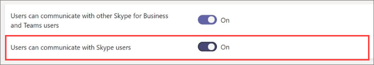

Administrar el acceso externo en Microsoft Teams
======================================================

El acceso externo es una forma para que los usuarios de los equipos de un dominio externo puedan buscar, llamar, chatear y configurar reuniones con usted en Teams. También puede usar el acceso externo para comunicarse con usuarios externos que siguen usando Skype empresarial (en línea y local) y Skype (en versión preliminar).

Si quiere que los usuarios externos tengan acceso a los equipos y canales, la opción de acceso de invitado puede ser la más aconsejable. Para obtener más información sobre las diferencias entre el acceso externo y el acceso de invitados, consulte [Comparación entre el acceso de invitado y el acceso externo](communicate-with-users-from-other-organizations.md#compare-external-and-guest-access). 

Use el acceso externo si:
  
- Tiene usuarios de distintos dominios que necesitan colaborar. Por ejemplo, Rob@contoso.com y Ann@northwindtraders.com están trabajando en un proyecto junto con otros usuarios de los dominios contoso.com y northwindtraders.com.

- Quiere que las personas de su organización usen Teams para ponerse en contacto con empresas específicas ajenas a la organización.

- Quiere que cualquier persona del mundo que use Teams pueda encontrarle y ponerse en contacto con usted por medio su dirección de correo electrónico. 

> [!IMPORTANT]
> Para usar el cliente de Teams con el fin de comunicarse con un usuario externo (ya sea que el usuario esté usando Teams o Skype empresarial), el usuario de Teams debe estar alojado en Skype empresarial online.

## Planificar el acceso externo

El acceso externo está activado en Teams de forma predeterminada, lo que significa que su organización puede comunicarse con todos los dominios externos. Si agrega dominios bloqueados, se permitirán todos los demás dominios. Si agrega dominios permitidos, se bloquearán todos los demás dominios. Hay tres escenarios en los que se configura el acceso externo en el Centro de administración de Microsoft Teams (**Configuración para toda la organización** > **Acceso externo**):

- **Federación abierta**: es la configuración predeterminada en Teams y facilita que los usuarios de la organización puedan hacer búsquedas, llamar, chatear y organizar reuniones con usuarios externos a la organización en cualquier dominio.

    En este escenario, los usuarios pueden comunicarse con todos los dominios externos que ejecuten Teams o Skype Empresarial y usen la federación abierta o hayan agregado el dominio a su lista de dominios permitidos.

- **Permitir dominios específicos**: al agregar dominios a una lista de dominios **permitidos**, solo se permite el acceso externo a los dominios permitidos. Una vez que se configura una lista de dominios permitidos, se bloquearán todos los demás dominios. Para permitir dominios específicos, haga clic en **Agregar un dominio**, agregue el nombre del dominio, haga clic en **Acción que se realizará en este dominio** y, después, seleccione **Permitido**.

- **Bloquear dominios específicos**: al agregar dominios a una lista de dominios **bloqueados**, se permite la comunicación con todos los dominios externos, *excepto* con aquellos que se han bloqueado. Para bloquear dominios específicos, haga clic en **Agregar un dominio**, agregue el nombre del dominio, haga clic en **Acción que se realizará en este dominio** y, después, seleccione **Bloqueado**. Una vez que haya configurado una lista de dominios bloqueados, se permitirán todos los demás dominios.

> [!NOTE]
> Si desactiva el acceso externo a su organización, los usuarios externos podrán unirse a las reuniones a través de una combinación anónima. Para obtener más información, vea [administrar la configuración de la reunión en Teams](https://docs.microsoft.com/microsoftteams/meeting-settings-in-teams).

## Permitir o bloquear dominios

### Paso 1: permitir que su organización se comunique con otros equipos o con organizaciones de Skype empresarial

  **Usar el Centro de administración de Microsoft Teams**

1. En el panel de navegación izquierdo, vaya a **Configuración para toda la organización** > **Acceso externo**.

2. Active la opción **Los usuarios pueden comunicarse con otros usuarios de Skype Empresarial y Teams**.

     .

3. Si quiere que todas las organizaciones de Teams puedan comunicarse con los usuarios de su organización, vaya al paso 5.

4. Si quiere limitar las organizaciones que pueden comunicarse con los usuarios de su organización, puede permitir todos los dominios excepto algunos, o bien puede permitir únicamente dominios específicos. 

    - Para permitir todos los dominios excepto algunos, haga clic en **Agregar un dominio** para agregar los dominios que quiere bloquear. En el panel **Agregar un dominio**, escriba el nombre del dominio, haga clic en **Bloqueado** y, después, haga clic en **Listo**. 
    - Para permitir las comunicaciones únicamente con organizaciones específicas, agregue esos dominios a la lista con el estado **Permitido**. Una vez que haya agregado un dominio a la lista de permitidos, solo se permitirán las comunicaciones con aquellas organizaciones cuyos dominios estén en la lista de permitidos. 

5. Haga clic en **Guardar **.

6. Asegúrese de que el administrador de la otra organización de Teams complete los mismos pasos. Por ejemplo, si la otra organización limita las organizaciones que pueden comunicarse con sus usuarios, el administrador de esa organización debe incluir en su lista de **dominios permitidos** el dominio de la empresa a la que usted pertenece.

### Paso 2: Probarlo

Para probar la configuración, necesitará un usuario de Teams que no se encuentre detrás del firewall. 
  
1. Una vez que tanto usted como el administrador de la otra organización hayan cambiado la configuración de **Acceso externo**, todo debería estar listo para empezar.

2. En la aplicación de Teams, busque a ese usuario por su dirección de correo electrónico y envíe una solicitud para chatear.

3. Pida a su contacto de Teams que le envíe una solicitud para chatear. Si no recibe la solicitud de su contacto, el problema está en la configuración del firewall (suponiendo que la otra organización ya ha confirmado que tienen una configuración de firewall correcta).

4. Otro modo de comprobar si el problema está en el firewall es ir a una ubicación wifi que no se encuentre detrás del firewall, como, por ejemplo, una cafetería, y enviar a través de Teams una solicitud al contacto para chatear. Si el mensaje se envía a través de la ubicación wifi, pero no sucede lo mismo cuando está en el trabajo, quiere decir que el problema está en el firewall.

> [!NOTE]
> Eso funcionará si usted y el otro usuario activan el acceso externo y permiten los respectivos dominios. Si eso no funciona, el otro usuario debería asegurarse de que la configuración de su organización no está bloqueando el dominio de la de usted.

## Comunicarse con usuarios de Skype (en la versión preliminar)

Siga los pasos que se indican a continuación para que los usuarios de Teams de su organización puedan llamar a usuarios de Skype y chatear con ellos. Los usuarios de Teams pueden buscar usuarios de Skype y, a continuación, iniciar con ellos una conversación privada de solo texto o una llamada de audio o vídeo, y viceversa.

  **Usar el Centro de administración de Microsoft Teams**

1. En el panel de navegación izquierdo, vaya a **Configuración para toda la organización** > **Acceso externo**.

2. Active la opción **Los usuarios pueden comunicarse con usuarios de Skype**.

    .

Para obtener más información sobre las formas en las que pueden comunicarse los usuarios de Teams y Skype, incluidas las limitaciones que se aplican, consulte [Interoperabilidad de Teams y Skype](teams-skype-interop.md).

## Escenarios comunes de acceso externo

En las siguientes secciones se describe cómo habilitar la Federación para escenarios comunes de acceso externo, y cómo determina el TeamsUpgradePolicy la entrega de conversaciones entrantes y llamadas.

### Habilitar Federación

Para permitir que los usuarios de su organización se comuniquen con los usuarios de otra organización, ambas organizaciones deben habilitar la Federación. Los pasos para habilitar la Federación de una organización determinada dependen de si la organización es puramente de Internet, híbrida o puramente local.

|**Si su organización es** |**Habilitar la Federación de la siguiente manera**  |
|:---------|:-----------------------|
|Conectado sin Skype empresarial local. Esto incluye organizaciones que tienen usuarios de TeamsOnly o usuarios de Skype empresarial online.| Si usa el centro de administración de Teams:  -Asegúrese de que los **usuarios pueden comunicarse con otros usuarios de Skype empresarial y de Teams** están habilitados en acceso externo. -Si no usa la Federación abierta (que permite la Federación con cualquier otro dominio), agregue el dominio externo a la lista de permitidos.  Si usa PowerShell: -Asegúrese de que el espacio empresarial está habilitado para la Federación: `Get-CsTenantFederationConfiguration` debe mostrar `AllowFederatedUsers=true` .  -Asegurar que el valor efectivo del usuario `CsExternalAccessPolicy` tenga `EnableFederationAccess=true` . -Si no usa la Federación abierta, asegúrese de que el dominio de destino aparece `AllowedDomains` en `CsTenantFederationConfiguration` . |
|Local pura | En herramientas locales:  -Asegúrese de que la Federación está habilitada en `CsAccessEdgeConfiguration` . -Asegúrese de que la Federación para el usuario se haya habilitado `ExternalAccessPolicy` (a través de la directiva global, la Directiva de sitio o la directiva asignada por el usuario).   -Si no usa la Federación abierta, asegúrese de que el dominio de destino aparece en la lista `AllowedDomains` . |
|Híbrido con algunos usuarios en línea (ya sea en Skype empresarial o en Teams) y en algunos usuarios locales. | Siga los pasos anteriores para las organizaciones locales y en línea. |

### Entrega de conversaciones y llamadas entrantes 

Las conversaciones entrantes y las llamadas de una organización de Federación estarán en los equipos de los usuarios o en el cliente de Skype empresarial, según el modo del usuario del destinatario en TeamsUpgradePolicy.

|**Si desea** |**Haga lo siguiente:**  |
|:---------|:-----------------------|
| Garantizar que los chats federados y las llamadas entrantes lleguen al cliente de equipos del usuario: | Configure los usuarios para que sean TeamsOnly.
| Garantizar que los chats federados entrantes y las llamadas lleguen al cliente de Skype empresarial del usuario. | Configure los usuarios para que estén en cualquier modo que no sea TeamsOnly. |

### Habilitar la Federación entre los usuarios de la organización y los usuarios de Skype

Para habilitar la Federación entre los usuarios de la organización y los usuarios de Skype:

|**Si su organización es** |**Habilitar la Federación de consumidores de la siguiente manera**  |
|:---------|:-----------------------|
| En línea pura sin Skype empresarial local.  Esto incluye organizaciones que tienen usuarios de TeamsOnly o usuarios de Skype empresarial online. | Si usa el centro de administración de Teams:  -Asegúrese de que **los usuarios puedan comunicarse con los usuarios de Skype** y estén habilitados en el acceso externo.  Si usa PowerShell:  -Asegúrese de que el espacio empresarial está habilitado para la Federación: `Get-CsTenantFederationConfiguration` debe mostrar `AllowPublicUsers=true` .   -Asegurar que el valor efectivo del usuario `CsExternalAccessPolicy` tenga `EnablePublicCloudAccess=true` . |
| Local pura | En herramientas locales:   -Asegúrate de que Skype esté habilitado como socio federado.   -Asegúrese `EnablePublicCloudAccess=true` de que el usuario (a través de `ExternalAccessPolicy` una directiva global, una directiva de sitio o una directiva asignada por el usuario).|
| Híbrido con algunos usuarios en línea (ya sea en Skype empresarial o en Teams) y en algunos usuarios locales.| Siga los pasos anteriores para las organizaciones locales y en línea.

> [!IMPORTANT]
> No es necesario que agregue ningún **dominio de Skype** como dominio permitido para permitir que los usuarios de Teams o Skype Empresarial Online se comuniquen con usuarios de Skype de dentro o de fuera de su organización. Todos los **dominios de Skype** están en la lista blanca, lo que significa que todos ellos pueden considerarse como PERMITIDOS.

## ¿En qué se diferencia el acceso externo del acceso de invitados?

Para obtener más información sobre la diferencia entre el acceso externo y el acceso de invitados, lea [Comunicación con usuarios de otras organizaciones](communicate-with-users-from-other-organizations.md).

## Temas relacionados

- [Experiencia de chat nativa para usuarios externos (federados)](native-chat-for-external-users.md)
