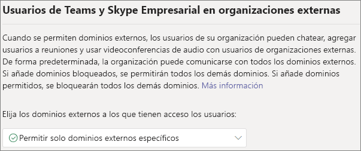
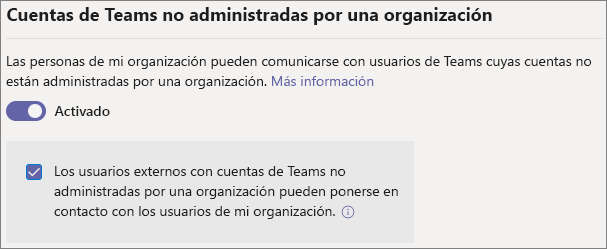
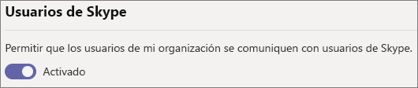

# <a name="manage-external-access-in-microsoft-teams"></a>Administrar el acceso externo en Microsoft Teams

El acceso externo facilita que los usuarios de Teams de fuera de su organización puedan encontrar, llamar, chatear y organizar reuniones con usted en Teams. También puede usar el acceso externo para comunicarse con los usuarios externos que todavía usen Skype Empresarial (en línea o local) y Skype.

Si desea que personas de otras organizaciones tengan acceso a los equipos y canales, es mejor utilizar el acceso de invitados. Para obtener más información sobre las diferencias entre el acceso externo y el acceso de invitados, consulte [Comparación entre el acceso de invitado y el acceso externo](communicate-with-users-from-other-organizations.md#compare-external-and-guest-access). 

Use el acceso externo si:
  
- Tiene usuarios en dominios externos que necesitan chatear. Por ejemplo, Rob@contoso.com y Ann@northwindtraders.com están trabajando en un proyecto junto con otros en los dominios contoso.com y northwindtraders.com.

- Quiere que las personas de su organización usen Teams para ponerse en contacto con empresas específicas ajenas a la organización.

- Quiere que cualquier persona del mundo que use Teams pueda encontrarle y ponerse en contacto con usted por medio su dirección de correo electrónico. 

## <a name="plan-for-external-access"></a>Planificar el acceso externo

Las directivas de acceso externo incluyen controles para cada tipo de federación en los niveles de organización y usuario. Al desactivar una directiva en el nivel de organización, se desactiva para todos los usuarios, independientemente de su configuración de nivel de usuario. Todas las opciones de acceso externo están habilitadas de forma predeterminada.

El Centro de administración de Teams controla el acceso externo en el nivel de organización. La mayoría de las opciones (excepto las restricciones de dominio) están disponibles en el nivel de usuario mediante PowerShell. Consulte [Usar PowerShell](#using-powershell) a continuación para obtener más información.

> [!NOTE]
> Si desactiva el acceso externo en su organización, los usuarios ajenos a la organización podrán unirse a las reuniones mediante la participación anónima. Para más información, consulte [Administrar la configuración de las reuniones en Teams](meeting-settings-in-teams.md).

> [!NOTE]
> Los usuarios de Teams puede añadir aplicaciones cuando organizan reuniones o chats con personas de otras organizaciones. También pueden usar aplicaciones compartidas con personas de otras organizaciones cuando organizan reuniones o chats con estas organizaciones. Se aplican las directivas de datos de la organización del usuario anfitrión, así como las prácticas de intercambio de datos de cualquier aplicación de terceros compartida por la organización del usuario.

## <a name="allow-or-block-domains"></a>Permitir o bloquear dominios

Si agrega dominios bloqueados, se permitirán todos los demás dominios. Si agrega dominios permitidos, se bloquearán todos los demás dominios. La excepción a esta regla es que se permitan participantes anónimos en las reuniones. Hay cuatro escenarios para configurar el acceso externo en el Centro de administración de Teams (**Usuarios** > **Acceso externo**):

- **Permitir todos los dominios externos**: es la configuración predeterminada en Teams y facilita que los usuarios de la organización puedan hacer búsquedas, llamar, chatear y organizar reuniones con usuarios externos a la organización en cualquier dominio.

    En este escenario, los usuarios pueden comunicarse con todos los dominios externos que ejecutan Teams o Skype Empresarial, siempre y cuando el otro inquilino también admita comunicaciones externas.
    
- **Permitir solo dominios externos específicos**: al agregar dominios a una lista de dominios **permitidos**, solo se autoriza el acceso externo a los dominios permitidos. Una vez que se configura una lista de dominios permitidos, se bloquearán todos los demás dominios. 

- **Bloquear dominios específicos**: al agregar dominios a una lista de dominios **bloqueados**, se permite la comunicación con todos los dominios externos, *excepto* con aquellos que se han bloqueado.  Una vez que haya configurado una lista de dominios bloqueados, se permitirán todos los demás dominios.

- **Bloquear todos los dominios externos**: impide que los usuarios de su organización encuentren, llamen, chateen y configuren reuniones con personas externas a su organización en cualquier dominio.

> [!NOTE]
> Los dominios permitidos o bloqueados solo se aplican a las reuniones si el acceso anónimo a las reuniones está "desactivado".



**Usar el Centro de administración de Microsoft Teams**

Para permitir dominios específicos

1. En el Centro de administración de Teams, vaya a **Usuarios** > **Acceso externo**.

2. En **Elegir a qué dominios tienen acceso los usuarios**, elija **Permitir solo dominios externos específicos**.

3. Seleccione **Permitir dominios**.

4. En el cuadro **Dominio,** escriba el dominio que desea permitir y, a continuación, haga clic en **Listo**.

5. Si desea permitir otro dominio, haga clic en **Agregar un dominio**.

6. Haga clic en **Guardar**.

Para bloquear dominios específicos

1. En el Centro de administración de Teams, vaya a **Usuarios** > **Acceso externo**.

2. En **Elegir a qué dominios tienen acceso los usuarios**, elija **Bloquear solo dominios externos específicos**.

3. Seleccione **Bloquear dominios**.

4. En el cuadro **Dominio,** escriba el dominio que desea permitir y, a continuación, haga clic en **Listo**.

5. Si desea bloquear otro dominio, haga clic en **Agregar un dominio**.

6. Haga clic en **Guardar**.

Para comunicarse con otro inquilino, deben habilitar **Permitir todos los dominios externos** o agregar el inquilino a su lista de dominios permitidos siguiendo los mismos pasos anteriores.  

## <a name="manage-contact-with-external-teams-users-not-managed-by-an-organization"></a>Administrar el contacto con usuarios externos de Teams no administrados por una organización

> [!NOTE]
> Las funcionalidades de interoperabilidad de Teams y Skype que se describen en este artículo no están disponibles en GCC, GCC High, implementaciones de DOD ni en entornos de nube privada.

Los administradores pueden elegir habilitar o deshabilitar las comunicaciones con usuarios externos de Teams que no estén administrados por una organización ("no administrado"). Si está habilitada, también pueden controlar más si las personas con cuentas de Teams no administradas pueden iniciar el contacto (consulte la siguiente imagen). Si **Usuarios externos con cuentas de Teams no administradas por una organización pueden ponerse en contacto con los usuarios de mi organización** está desactivada, los usuarios de Teams no administrados no podrán buscar la dirección de correo electrónico completa para buscar contactos de la organización y todas las comunicaciones con los usuarios de Teams no administrados deberán ser iniciadas por los usuarios de la organización.

En el Centro de administración de Teams, vaya a **Usuarios** > **Acceso externo**.



Para bloquear a los usuarios de Teams de su organización para que no se comuniquen con usuarios externos de Teams cuyas cuentas no estén administradas por una organización:
1. Desactive la configuración **los usuarios de mi organización pueden comunicarse con los usuarios de Teams cuyas cuentas no estén administradas por una organización**.
2. Desactive la casilla **Los usuarios externos con cuentas de Teams no administradas por una organización pueden ponerse en contacto con los usuarios de mi organización**.

Para permitir que los usuarios de Teams de su organización se comuniquen con usuarios externos de Teams cuyas cuentas no estén administradas por una organización si los usuarios de Teams han iniciado el contacto:
1. Active la configuración **La gente de mi organización puede comunicarse con los usuarios de Teams cuyas cuentas no estén administradas por una organización**.
2. Desactive la casilla **Los usuarios externos con cuentas de Teams no administradas por una organización pueden ponerse en contacto con los usuarios de mi organización**.

Para permitir que los usuarios de Teams de su organización se comuniquen con usuarios externos de Teams cuyas cuentas no estén administradas por una organización y reciban solicitudes para comunicarse con esos usuarios externos de Teams:
1. Active la configuración **La gente de mi organización puede comunicarse con los usuarios de Teams cuyas cuentas no estén administradas por una organización**.
2. Active la casilla **Los usuarios externos con cuentas de Teams no administradas por una organización pueden ponerse en contacto con los usuarios de mi organización**.

## <a name="communicate-with-skype-users"></a>Comunicarse con usuarios de Skype

Siga los pasos que se indican a continuación para que los usuarios de Teams de su organización puedan llamar a usuarios de Skype y chatear con ellos. Los usuarios de Teams pueden buscar usuarios de Skype y, a continuación, iniciar con ellos una conversación privada de solo texto o una llamada de audio o vídeo, y viceversa.



**Usar el Centro de administración de Microsoft Teams**

1. En el panel de navegación izquierdo, vaya a **Usuarios** > **Acceso externo**.

2. Active la configuración **Permitir que los usuarios de mi organización se comuniquen con usuarios de Skype**.

Para obtener más información sobre las formas en las que pueden comunicarse los usuarios de Teams y Skype, incluidas las limitaciones que se aplican, consulte [Interoperabilidad de Teams y Skype](teams-skype-interop.md).

## <a name="using-powershell"></a>Con PowerShell

La configuración de nivel de organización se puede configurar mediante [Set-CSTenantFederationConfiguration](/powershell/module/skype/set-cstenantfederationconfiguration) y la configuración de nivel de usuario se puede configurar mediante [Set-CsExternalAccessPolicy](/powershell/module/skype/set-csexternalaccesspolicy).

En la tabla siguiente se muestran los parámetros de cmdlet usados para configurar la federación.

|Configuración|Nivel de organización (Set-CSTenantFederationConfiguration)|Nivel de usuario (Set-CsExternalAccessPolicy)|
|:-------|:--------|:------------------|
|Habilitar o deshabilitar la federación con otras organizaciones de Teams y Skype Empresarial|`-AllowFederatedUsers`|`-EnableFederationAccess`|
|Habilitar la federación con dominios específicos|`-AllowedDomains`|No disponible|
|Deshabilitar la federación con dominios específicos|`-BlockedDomains`|No disponible|
|Habilitar o deshabilitar la federación con usuarios de Teams que no están administrados por una organización|`-AllowTeamsConsumer`|`-EnableTeamsConsumerAccess`|
|Habilitar o deshabilitar que los usuarios de Teams no administrados por una organización inicien conversaciones|`-AllowTeamsConsumerInbound`|`-EnableTeamsConsumerInbound`|
|Habilitar o deshabilitar la federación con Skype|`-AllowPublicUsers`|`-EnablePublicCloudAccess`|

Es importante tener en cuenta que la desactivación de una directiva “desciende” del inquilino a los usuarios. Por ejemplo:

```PowerShell
Set-CsTenantFederationConfiguration -AllowFederatedUsers $false
Set-CsExternalAccessPolicy -EnableFederationAccess $true
```

En este ejemplo, aunque la directiva de nivel de usuario está habilitada, los usuarios no podrán comunicarse con usuarios administrados de Teams o usuarios de Skype Empresarial porque este tipo de federación se desactivó en el nivel de organización. Por lo tanto, si desea habilitar estos controles para un subconjunto de usuarios, debe activar el control en un nivel de organización y crear dos directivas de grupo – una que se aplica a los usuarios que deben tener el control desactivado y otra que se aplica a los usuarios que deben tener el control activado.

## <a name="limit-external-access-to-specific-people"></a>Limitar el acceso externo a personas específicas

Si ha habilitado cualquiera de los controles de acceso externo en un nivel de organización, puede limitar el acceso externo a usuarios específicos mediante PowerShell.

Puede usar el siguiente script de ejemplo, sustituyendo *Control* por el control que desea cambiar, *PolicyName* para el nombre que quieres asignar a la directiva y *UserName* para cada usuario para el que quiera habilitar o deshabilitar el acceso externo.

Asegúrese de que ha instalado el [módulo Microsoft Teams PowerShell](/microsoftteams/teams-powershell-install) antes de ejecutar el script.

```PowerShell
Connect-MicrosoftTeams

# Disable external access globally
Set-CsExternalAccessPolicy -<Control> $false

# Create a new external access policy
New-CsExternalAccessPolicy -Identity <PolicyName> -<Control> $true

# Assign users to the policy
$users_ids = @("<UserName1>", "<UserName2>")
New-CsBatchPolicyAssignmentOperation -PolicyType ExternalAccessPolicy -PolicyName "<PolicyName>" -Identity $users_ids

```

Por ejemplo, habilite las comunicaciones con usuarios externos de Teams no administrados por una organización:

```PowerShell
Connect-MicrosoftTeams

Set-CsExternalAccessPolicy -EnableTeamsConsumerAccess $false

New-CsExternalAccessPolicy -Identity ContosoExternalAccess -EnableTeamsConsumerAccess $true

$users_ids = @("MeganB@contoso.com", "AlexW@contoso.com")
New-CsBatchPolicyAssignmentOperation -PolicyType ExternalAccessPolicy -PolicyName "ContosoExternalAccess" -Identity $users_ids

```

Vea [New-CsBatchPolicyAssignmentOperation](/powershell/module/teams/new-csbatchpolicyassignmentoperation) para obtener ejemplos adicionales de cómo compilar una lista de usuarios.

Puede ver la nueva directiva ejecutando `Get-CsExternalAccessPolicy`.

Vea también [New-CsExternalAccessPolicy](/powershell/module/skype/new-csexternalaccesspolicy) y [Set-CsExternalAccessPolicy](/powershell/module/skype/set-csexternalaccesspolicy).

## <a name="common-external-access-scenarios"></a>Escenarios comunes de acceso externo

En las siguientes secciones se describe cómo habilitar la federación para escenarios de acceso externo comunes y cómo TeamsUpgradePolicy determina la entrega de llamadas y chats entrantes.

### <a name="enable-federation-between-users-in-your-organization-and-other-organizations"></a>Habilitar la federación entre los usuarios de la organización y otras organizaciones

Para permitir que los usuarios de la organización se comuniquen con usuarios de otra organización, ambas organizaciones deben habilitar la federación. Los pasos para habilitar la federación para una organización determinada dependen de si la organización está exclusivamente en línea, es híbrida o si es exclusivamente local.

| Si su organización es | Habilitar la federación como se muestra a continuación |
|:---------|:-----------------------|
|En línea sin Skype Empresarial local. Esto incluye a las organizaciones que tienen usuarios de TeamsOnly o usuarios de Skype Empresarial Online.| Si usa el Centro de administración de Teams: <br>-   Asegúrese de que los dominios con los que desea comunicarse estén permitidos en Acceso externo.<br><br>Con PowerShell:<br>- Asegúrese de que la cuenta empresarial esté habilitada para la federación: `Get-CsTenantFederationConfiguration` debe mostrar `AllowFederatedUsers=true`. <br>- Asegúrese de que el valor vigente del usuario de `CsExternalAccessPolicy` tenga `EnableFederationAccess=true`.<br>- Si no usa una federación abierta, asegúrese de que el dominio de destino se muestre en `AllowedDomains` de `CsTenantFederationConfiguration`. |
|Solo en entorno local| En las herramientas locales: <br>- Asegúrese de que la federación esté habilitada en `CsAccessEdgeConfiguration`.<br>- Asegúrese de que la federación para el usuario esté habilitada a través de `ExternalAccessPolicy` (ya sea por la directiva global, la directiva del sitio o la directiva asignada por el usuario). <br> - Si no usa una federación abierta, asegúrese de que el dominio de destino se muestre en `AllowedDomains`.|
|Híbrido con algunos usuarios en línea (en Skype Empresarial o Teams) y algunos usuarios locales. | Siga los pasos anteriores para organizaciones en línea y locales. |

### <a name="delivery-of-incoming-chats-and-calls"></a>Entrega de chats y llamadas entrantes 

Los chats y las llamadas entrantes de una organización de la federación llegarán al cliente de Teams o de Skype Empresarial del usuario en función del modo del usuario destinatario en TeamsUpgradePolicy.

| Si desea | Haga lo siguiente: |
|:---------|:-----------------------|
|Asegúrese de que las llamadas y los chats federados entrantes lleguen al cliente de Teams del usuario:|Configure los usuarios para que sean TeamsOnly.
|Asegúrese de que los chats federados entrantes y las llamadas lleguen al cliente de Skype Empresarial del usuario|Configure a los usuarios para que se estén en cualquier modo distinto de TeamsOnly.|

### <a name="enable-federation-between-users-in-your-organization-and-unmanaged-teams-users"></a>Habilitar la federación entre los usuarios de su organización y los usuarios no administrados de Teams

Para habilitar la federación entre los usuarios de su organización y los usuarios de Teams no administrados:

| Si su organización es | Habilitar la federación como se muestra a continuación |
|:---------|:-----------------------|
|En línea sin Skype Empresarial local. Esto incluye a las organizaciones que tienen usuarios de Teams Only o usuarios de Skype Empresarial Online.| Si usa el Centro de administración de Teams:<br>-Asegúrese de que **La gente de mi organización puede comunicarse con los usuarios de Teams cuyas cuentas no están administradas por una organización** está habilitada en **External Access**.<br>-Si desea que las cuentas de Teams no administradas inicien chats, active la casilla de **Los usuarios externos con cuentas de Teams no administradas por una organización pueden ponerse en contacto con los usuarios de mi organización**.<br><br>Con PowerShell:<br>- Asegúrese de que la cuenta empresarial esté habilitada para la federación: `Get-CsTenantFederationConfiguration` debe mostrar `AllowTeamsConsumer=true`.<br>-Asegúrese de que el valor vigente del usuario de `CsExternalAccessPolicy` tenga `EnableTeamsConsumerAccess=true`.<br>-Asegúrese de que el inquilino está habilitado para que los usuarios no administrados inicien chats: `Get-CsTenantFederationConfiguration` debe mostrar `AllowTeamsConsumerInbound=true`.<br>-Asegúrese de que el valor vigente del usuario de `CsExternalAccessPolicy` tenga `EnableTeamsConsumerInbound=true`.|
|Solo en entorno local| El chat con usuarios de Teams no administrados no se admite para organizaciones solo locales.|
|Híbrido con algunos usuarios en línea (en Skype Empresarial o Teams) y algunos usuarios locales. | Siga los pasos descritos anteriormente para las organizaciones en línea. Tenga en cuenta que no se admite el chat con usuarios de Teams no administrados para los usuarios locales.|

> [!IMPORTANT]
> No tiene que agregar ningún **Dominios de equipo** como dominios permitidos para permitir que los usuarios de Teams se comuniquen con usuarios de Teams no administrados fuera de su organización. Se permiten todos los dominios **unamanged Teams**.

### <a name="enable-federation-between-users-in-your-organization-and-consumer-users-of-skype"></a>Habilitar la federación entre los usuarios de su organización y los usuarios consumidores de Skype

Para habilitar la federación entre los usuarios de su organización y los usuarios consumidores de Skype:

| Si su organización es | Habilitar la federación de consumidores como se muestra a continuación |
|:---------|:-----------------------|
|En línea sin Skype Empresarial en el entorno local. Esto incluye a las organizaciones que tienen usuarios de TeamsOnly o usuarios de Skype Empresarial Online. | Si usa el Centro de administración de Teams: <br>- Asegúrese de que **Permitir que los usuarios de mi organización se comuniquen con usuarios de Skype** está habilitado en Acceso externo.<br><br>Con PowerShell: <br>- Asegúrese de que la cuenta empresarial esté habilitada para la federación: `Get-CsTenantFederationConfiguration` debe mostrar `AllowPublicUsers=true`. <br> - Asegúrese de que el valor vigente del usuario de `CsExternalAccessPolicy` tenga `EnablePublicCloudAccess=true`. |
|Solo en entorno local| En las herramientas locales: <br> - Asegúrese de que Skype está habilitado como asociado federado. <br> - Asegúrese de `EnablePublicCloudAccess=true` para el usuario a través de `ExternalAccessPolicy` (ya sea mediante la directiva global, la directiva del sitio o la directiva asignada por el usuario).|
| Híbrido con algunos usuarios en línea (en Skype Empresarial o Teams) y algunos usuarios locales.| Siga los pasos anteriores para organizaciones en línea y locales.

> [!IMPORTANT]
> No es necesario que agregue ningún **dominio de Skype** como dominio permitido para permitir que los usuarios de Teams o Skype Empresarial Online se comuniquen con usuarios de Skype de dentro o de fuera de su organización. Se permiten todos los **dominios de Skype**.

## <a name="federation-diagnostic-tool"></a>Herramienta de diagnóstico de federación

Si es administrador, puede usar la siguiente herramienta de diagnóstico para validar que un usuario de Teams pueda comunicarse con un usuario de Teams federado:

1. Seleccione **Ejecutar pruebas** a continuación, lo cual rellenará el diagnóstico en el Centro de administración de Microsoft 365. 

   > [!div class="nextstepaction"]
   > [Ejecutar pruebas: federación de Teams](https://aka.ms/TeamsFederationDiag)

2. En el panel Ejecutar diagnóstico, escriba la **Dirección de Protocolo de inicio de sesión (SIP)** y el **nombre de dominio del espacio empresarial federado** y, a continuación, seleccione **Ejecutar pruebas**.

3. Las pruebas indicarán los mejores pasos a seguir para abordar cualquier configuración de espacio empresarial o directiva que impida la comunicación con el usuario federado.


## <a name="related-topics"></a>Temas relacionados

[Experiencia de chat nativa para usuarios externos (federados)](native-chat-for-external-users.md)
