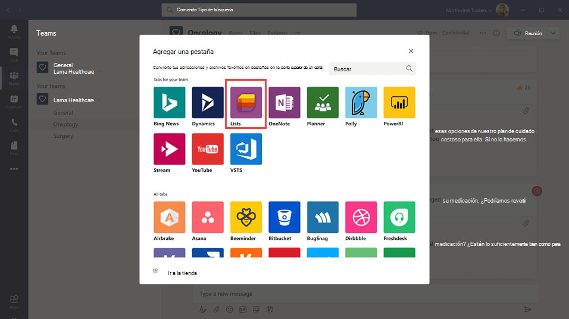
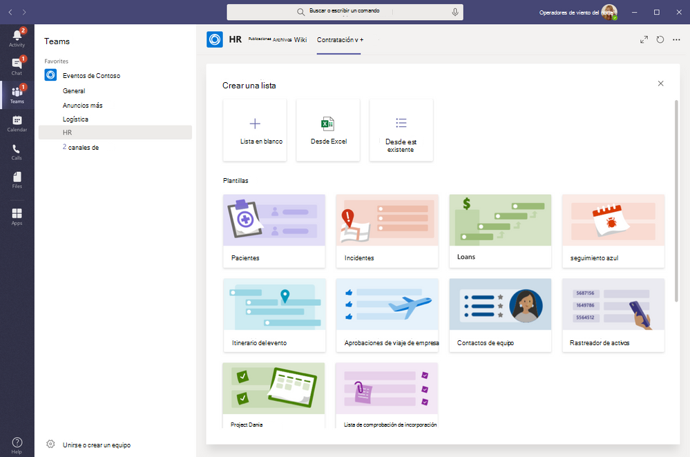

# Administrar la aplicación Lists para su organización en Microsoft TeamsManage the Lists app for your organization in Microsoft Teams

## Información general de ListsOverview of Lists

La aplicación Lists en Microsoft Teams ayuda a los usuarios de su organización a realizar un seguimiento de la información, organizar el trabajo y administrar los flujos de trabajo.The Lists app in Microsoft Teams helps users in your organization track information, organize work, and manage workflows. Con Lists, los usuarios pueden realizar un seguimiento de datos como problemas, activos, rutinas, contactos, inventario, incidentes, préstamos, pacientes y mucho más con vistas personalizables, reglas y alertas para mantener a todos los miembros del equipo sincronizados.With Lists, users can track data such as issues, assets, routines, contacts, inventory, incidents, loans, patients, and more using customizable views, rules, and alerts to keep everyone on the team in sync.

En Teams, los usuarios acceden a Lists como una pestaña de un canal.In Teams, users access Lists as a tab in a channel. Haga clic en **+** para abrir la galería de pestañas y agregar una nueva instancia de pestaña de la aplicación Lists a un canal para empezar.Click **+** to open the tab gallery and add a new Lists app tab instance to a channel to get started.

Los usuarios pueden crear nuevas listas o anclar listas existentes desde el mismo equipo o desde un sitio de SharePoint al que tengan acceso.Users can create new lists or pin existing lists from within the same team or from a different SharePoint site that they have access to. Las listas nuevas se pueden crear desde cero, a partir de plantillas integradas, en función de la estructura de una lista existente o importando datos de un libro de Excel.New lists can be created from scratch, from built-in templates, based on the structure of an existing list, or by importing data from an Excel workbook. La aplicación Lists está disponible en clientes móviles, web y de escritorio de Teams.The Lists app is available in Teams desktop, web, and mobile clients.

## PlantillasTemplates

Las plantillas de Lists se adaptan a escenarios habituales de seguimiento de información para los usuarios.Templates in Lists are tailored to common information tracking scenarios for users. Cada plantilla incluye una estructura de lista predefinida, diseños de formulario y opciones de formato en una vista de lista y un nivel de vista de detalles para ayudar a los usuarios a empezar rápidamente.Each template comes with a predefined list structure, form layouts, and formatting options at both a list view and a details view level to help users get started quickly. Después de seleccionar una plantilla, los usuarios obtienen una vista previa del aspecto que tendrá la lista, junto con algunos datos de ejemplo.After selecting a template, users get a preview of what the list will look like, along with some sample data. Estos son algunos ejemplos de cómo los equipos de su organización pueden usar las plantillas predefinidas en Lists:Here's some examples of how teams in your organization can use the predefined templates in Lists:

- Realice un seguimiento de los problemas y cierre los archivos con la plantilla Seguimiento de problemas.Track issues and bring them to closure using the Issue tracker template.
- Organice todos los detalles del evento con la plantilla Itinerario del evento.Organize all your event details with the Event itinerary template.
- Use la plantilla Pacientes para registrar las necesidades y el estado de los pacientes de los equipos de salud de su organización sanitaria para supervisar y coordinar la atención.Use the Patients template to record the needs and status of patients for health teams in your healthcare organization to monitor and coordinate care.
- Realice un seguimiento del estado de las aplicaciones de préstamo con la plantilla Préstamos.Track the status of loan applications with the Loans template.

## Escenario de ejemploExample scenario

Una oficina de correos local es la responsable de ordenar y entregar el correo en su distrito.A local post office is responsible for sorting and delivering mail in their district. Cada mañana, la oficina de correos cuenta con un equipo que le ayudará a revisar los objetivos diarios, compartir anuncios y tratar los incidentes conocidos.Each morning, the post office has a team huddle to review daily goals, share announcements, and discuss known incidents.

Después de juntarse, los carteros recogen su correo e inician la ruta de entrega.After the huddle, mail carriers pick up their mail and start their delivery route. Los incidentes pueden producirse en una ruta, por ejemplo, un accidente de vehículo, un problema relacionado con un perro o una protesta social.Incidents can occur along a route, for example, a vehicle accident, dog-related issue, or social unrest protest. Cuando los carteros se encuentran con un incidente, usan Teams en sus dispositivos móviles para registrar los detalles del incidente, que se marcan en una lista en el canal del equipo.When mail carriers encounter an incident, they use Teams on their mobile devices to record the incident details, which are tracked in a list in the team channel. Todos los miembros del equipo, incluidos los carteros sobre el terreno, pueden ver esta información y mantenerse informados.Everyone on the team, including mail carriers in the field, can see this information and stay informed.

Antes de cambiar a Teams, los carteros tenían que volver a la oficina de correos con el fin de completar un formulario de copia impresa para informar de un incidente que se había indicado en una hoja de cálculo de Excel.Before moving to Teams, mail carriers had to go back to the post office to complete a hard-copy form to report an incident which was entered in an Excel spreadsheet. Teams ofrece a los carteros una experiencia móvil de primera mano en la que pueden usar Lists para informar sobre los incidentes sobre el terreno a medida que se produzcan, compartir detalles de incidentes con los miembros del equipo, mantener conversaciones sobre ellos en el canal e impulsar la resolución de incidentes.Teams gives mail carriers a mobile first, experience where they can use Lists to report incidents in the field as they happen, share incident details with team members, have conversations about them on the channel, and drive incidents to resolution.

## Todo lo que debe saber sobre ListsWhat you need to know about Lists

### Lists está disponible en todos los equipos y canalesLists is available in every team and channel

La aplicación Lists viene preinstalada para todos los usuarios de Teams y está disponible directamente en la galería de pestañas de todos los equipos y canales.Lists is pre-installed for all Teams users and is available directly in the tab gallery of every team and channel. Esto quiere decir que los usuarios no tienen que ir a la tienda de aplicaciones de Teams para instalarla.This means that users don't have to go to the Teams app store to install it.

### Lists y SharePointLists and SharePoint

Los datos de Lists se almacenan en el sitio de grupo de SharePoint Online.Lists data is stored in the SharePoint Online team site. Para obtener más información sobre cómo interactúa SharePoint Online, vea [Cómo interactúan SharePoint Online y OneDrive para la Empresa con Teams](SharePoint-OneDrive-interact.md).To learn more about how SharePoint Online interacts with Teams, see [How SharePoint Online and OneDrive for Business interact with Teams](SharePoint-OneDrive-interact.md).

Los permisos establecidos en SharePoint se aplican a las listas creadas en la aplicación Lists.Permissions set in SharePoint apply to lists created in the Lists app. De forma predeterminada, las listas heredan los permisos del sitio al que pertenecen.By default, lists inherit permissions from the site to which they belong. Estos permisos rigen los tipos de acciones que los usuarios pueden realizar, por ejemplo, si pueden crear o editar listas.These permissions govern the types of actions that users can do, such as whether they can create or edit lists. Para obtener más información, vea [Niveles de permisos en SharePoint](https://docs.microsoft.com/sharepoint/understanding-permission-levels) y [Permisos de usuario y niveles de permisos en SharePoint Server](https://docs.microsoft.com/sharepoint/sites/user-permissions-and-permission-levels).To learn more, see [Permission levels in SharePoint](https://docs.microsoft.com/sharepoint/understanding-permission-levels) and [User permissions and permission levels in SharePoint Server](https://docs.microsoft.com/sharepoint/sites/user-permissions-and-permission-levels).

En determinados escenarios, puede que quiera limitar las acciones que los usuarios pueden realizar en las listas.In certain scenarios, you may want restrict what actions users can do in lists. Por ejemplo, una persona de un equipo edita una vista de lista, que la cambia para todos los miembros del equipo, y usted quiere permitir que solo el propietario o determinados miembros del equipo puedan editar las vistas de lista.For example, a person on a team edits a list view, which changes it for all team members, and you want to allow only the team owner or certain team members to edit list views. Para obtener más información, vea [Personalizar los permisos de una lista o biblioteca de SharePoint](https://support.microsoft.com/office/customize-permissions-for-a-sharepoint-list-or-library-02d770f3-59eb-4910-a608-5f84cc297782#ID0EAACAAA=Online,_2019,_2016,_2013).To learn more, see [Customize permissions for a SharePoint list or library](https://support.microsoft.com/office/customize-permissions-for-a-sharepoint-list-or-library-02d770f3-59eb-4910-a608-5f84cc297782#ID0EAACAAA=Online,_2019,_2016,_2013).

> [!NOTE]
> En este momento, los permisos de propietario y miembro de un equipo no están vinculados de ninguna manera con los permisos en el sitio de grupo que rigen el comportamiento de las listas o de la aplicación Lists.At this point, owner and member permissions in a team aren't linked in any way to permissions in the team site that govern the behavior of lists or the Lists App. Sin embargo, en vista de los comentarios y el uso de los clientes, esto se tendrá en consideración para una iteración futura del producto.However, based on customer feedback and usage, this will be considered for a future iteration of the product.  

### LimitacionesLimitations

Con Lists, los usuarios obtienen una experiencia móvil, web y de escritorio.With Lists, users get a desktop, web, and mobile experience. Es importante saber que los usuarios no pueden crear nuevas listas ni anclar listas existentes con Lists en el cliente móvil de Teams.It's important to know that users can't create new lists or pin existing lists using Lists on the Teams mobile client. Para ver o editar una lista en el cliente móvil de Teams, primero debe crearla o agregarla con Lists en el cliente web o de escritorio de Teams.To view or edit a list on the Teams mobile client, a list must first be created or added using Lists on the Teams desktop or web client.

Los invitados no pueden crear ni eliminar una lista.Guests can't create or delete a list. Pueden agregar elementos de lista a listas existentes, iniciar conversaciones nuevas sobre elementos de lista y responder a conversaciones existentes sobre elementos de lista.They can add list items to existing lists, start new conversations about list items, and reply to existing conversations about list items.

### Lists y la aplicación SharePointLists and the SharePoint app

Si los usuarios de su organización crearon listas con la aplicación SharePoint, estas se moverán automáticamente a Lists sin que el usuario necesite realizar ninguna acción.If users in your organization created lists using the SharePoint app, those lists will be automatically moved to Lists without any action needed from the user. Para obtener la mejor y más completa experiencia de integración de listas en Teams, use la aplicación Lists y ancle las listas que tenga.To get the best and richest lists integration experience in Teams, use the Lists app and pin your existing lists.

## Configurar ListsSet up Lists

### Deshabilitar o habilitar Lists en la organizaciónEnable or disable Lists in your organization

De forma predeterminada, Lists está habilitado para todos los usuarios de su organización.Lists is enabled by default for all Teams users in your organization. Puede desactivar o activar la aplicación en el nivel de organización en la página [Administrar aplicaciones](manage-apps.md) del centro de administración de Microsoft Teams.You can turn off or turn on the app at the org level on the [Manage apps](manage-apps.md) page in the Microsoft Teams admin center.

1. En el panel de navegación izquierdo del centro de administración de Microsoft Teams, vaya a **Aplicaciones de Teams** > **Administrar aplicaciones**.In the left navigation of the Microsoft Teams admin center, go to **Teams apps** > **Manage apps** .
2. Realice una de las siguientes acciones:Do one of the following:

    - Para desactivar Lists para su organización, busque la aplicación, selecciónela y después haga clic en **Bloquear**.To turn off Lists for your organization, search for the Lists app, select it, and then click **Block**.
    - Para activar Lists para su organización, busque la aplicación, selecciónela y después haga clic en **Permitir**.To turn on Lists for your organization, search for the Lists app, select it, and then click **Allow**.

### Habilitar o deshabilitar Lists para usuarios específicos de su organizaciónEnable or disable Lists for specific users in your organization

Para permitir o impedir que usuarios específicos de la organización puedan usar Lists, asegúrese de que la aplicación esté activada para su organización en la página [Administrar aplicaciones](manage-apps.md) y después cree una directiva de permisos de aplicación personalizada y asígnela a esos usuarios.To allow or block specific users in your organization from using Lists, make sure Lists is turned on for your organization on the [Manage apps](manage-apps.md) page, and then create a custom app permission policy and assign it to those users. Para obtener más información, vea [Administrar directivas de permisos de aplicaciones en Teams](teams-app-permission-policies.md).To learn more, see [Manage app permission policies in Teams](teams-app-permission-policies.md).

## Buscar eventos en el registro de auditoríaSearch the audit log for list events

Las listas están habilitadas con auditoría de nivel empresarial para que pueda buscar listas y eventos de elementos de lista en el registro de auditoría del Centro de seguridad y cumplimiento.Lists are enabled with enterprise-level auditing so you can search for lists and list item events in the audit log in the Security & Compliance Center. Para obtener más información, vea [Buscar en el registro de auditoría del Centro de seguridad y cumplimiento](https://docs.microsoft.com/microsoft-365/compliance/search-the-audit-log-in-security-and-compliance).To learn more, see [Search the audit log in the Security & Compliance Center](https://docs.microsoft.com/microsoft-365/compliance/search-the-audit-log-in-security-and-compliance).

Para obtener una lista de eventos de auditoría relevantes para la aplicación Lists en Teams, vea [actividades de lista de SharePoint](https://docs.microsoft.com/microsoft-365/compliance/search-the-audit-log-in-security-and-compliance#sharepoint-list-activities).For a list of audit events that are relevant to the Lists app in Teams, see [SharePoint list activities](https://docs.microsoft.com/microsoft-365/compliance/search-the-audit-log-in-security-and-compliance#sharepoint-list-activities).

Para que pueda buscar en el registro de auditoría, primero debe activar la característica de auditoría en el [Centro de seguridad y cumplimiento](https://protection.office.com).Before you can search the audit log, you have to first turn on auditing in the [Security & Compliance Center](https://protection.office.com). Tenga en cuenta que los datos de auditoría solo están disponibles desde el momento en que activó la característica de auditoría.Keep in mind that audit data is only available from the point at which you turned on auditing.

## Power Automate, Power Apps y API de GraphPower Automate, Power Apps, and Graph API

Lists admite [Power Automate](https://docs.microsoft.com/power-automate/flow-types) para flujos de trabajo y [Power Apps](https://docs.microsoft.com/powerapps/maker/canvas-apps/customize-list-form) para formularios de lista.Lists supports [Power Automate](https://docs.microsoft.com/power-automate/flow-types) for workflows and [Power Apps](https://docs.microsoft.com/powerapps/maker/canvas-apps/customize-list-form) for list forms. Los desarrolladores pueden usar la [API de Lists](https://docs.microsoft.com/sharepoint/dev/sp-add-ins/working-with-lists-and-list-items-with-rest) para conectar datos de lista como origen a través de Microsoft Graph.Developers can use the [Lists API](https://docs.microsoft.com/sharepoint/dev/sp-add-ins/working-with-lists-and-list-items-with-rest) to connect list data as a source through Microsoft Graph.

## Enviar comentarios o informar de un problemaGive feedback or report an issue
  
Para enviarnos comentarios o informar de un problema, haga clic en **Ayuda** junto a la parte inferior del panel de navegación izquierdo de Teams y seleccione **Informar de un problema**.To send us feedback or report an issue, click **Help** near the bottom of the left navigation in Teams, and then select **Report a problem**. Seleccione **Lists** y después escriba sus comentarios o detalles sobre el problema que experimenta.Select **Lists**, and then enter your feedback or details about the issue you're experiencing.

## Temas relacionadosRelated topics

- [Documentación de ayuda de ListsLists help documentation](https://support.microsoft.com/office/apps-and-services-cc1fba57-9900-4634-8306-2360a40c665b#PickTab=Lists)
