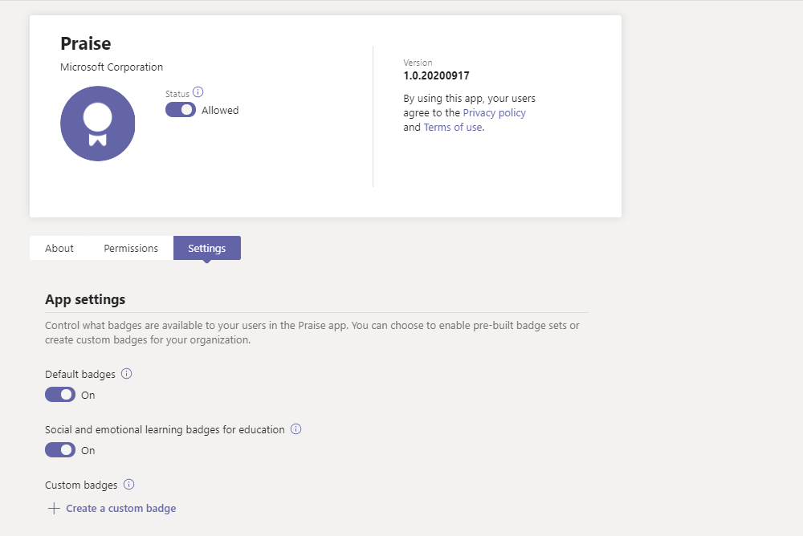

# Administrar la aplicación de elogios en el centro de administración de Microsoft Teams

> [!NOTE]
> Los administradores deben tener una licencia de Teams para acceder a esta característica. Si intenta obtener acceso a esta característica sin una licencia de Teams, recibirá un mensaje de error.

La aplicación elogiar de Microsoft Teams ayuda a los usuarios a mostrar la apreciación de los miembros de su organización o aula. Con una selección de conjuntos de distintivos entre los que elegir y la opción de crear sus propias insignias, elogiar se ha diseñado para ayudar a reconocer el esfuerzo que entra en la amplia variedad de trabajo que los usuarios de los equipos realizan, desde educadores a los Firstline trabajadores. Para obtener más información, consulta [Enviar elogio a personas](https://support.microsoft.com/office/send-praise-to-people-50f26b47-565f-40fe-8642-5ca2a5ed261e).

Los administradores pueden controlar qué tarjetas están disponibles para su organización desde el centro de administración de Microsoft Teams. En el navegación de la izquierda, vaya a **aplicaciones de teams > administrar aplicaciones**. En la lista de aplicaciones, haga clic en **elogiar** y, a continuación, seleccione **configuración**.  Desde aquí, puede elegir habilitar conjuntos de distintivos predeterminados e integrados y crear distintivos personalizados.

> [!NOTE]
> La característica de la aplicación elogiar no está disponible para las nubes del gobierno de los Estados Unidos.

## Usar conjuntos de distintivos integrados

Los conjuntos integrados son colecciones de insignias diseñadas por Microsoft para la aplicación de elogiar. Estos conjuntos no son editables por los administradores. El conjunto de distintivos predeterminado ya está habilitado y disponible en la aplicación de elogiar. Para cambiar la disponibilidad del conjunto predeterminado o de cualquier conjunto de distintivos, cambie el botón de alternancia correspondiente a activado o desactivado. 

<a name="default-badges"> </a>

### Insignias predeterminadas

El conjunto de distintivos predeterminado está diseñado para ayudar a los usuarios de equipos a reconocer a sus colegas por encima y por encima de su trabajo.

<a name="sel-edu-badges"> </a>

### Insignias de aprendizaje social y emocionales para el ámbito educativo

Los educadores pueden reconocer a alumnos individuales en cuanto a logros sociales y de aprendizaje emocional (SEL) y comportamientos con insignias que ilustran estos conceptos.

<a name="create-your-own-badges"> </a>

## Crear tus propias insignias

Seleccione **crear un distintivo personalizado**. Desde aquí, puedes diseñar un distintivo personalizado en el panel lateral. Puedes crear hasta 25 insignias personalizados. 

1. Escribe un nombre para el distintivo. Este es el nombre que aparecerá en el distintivo cuando los usuarios envíen elogios.

2. Establece los colores de tu tarjeta. Para establecer los colores de texto y de fondo de su distintivo, debe escribir los colores como valores hexadecimales (hexadecimales).

   > [!TIP]
   > Si no está familiarizado con los valores hexadecimales, en este artículo se incluye una [Introducción rápida](#hex-colors-intro) para mostrar cómo usarlos.

3. Cargar una imagen de notificación. El tipo de archivo aceptado es. PNG. El archivo de imagen debe tener menos de 40 KB de dimensiones máximas de 216 X 216 píxeles.

4. Localizar el nombre de tu tarjeta de identificación: en **nombres de tarjetas localizadas** , seleccione **Agregar**. Seleccione la configuración regional deseada de la lista desplegable. A continuación, escribe el nombre del distintivo en el idioma designado.

5. Excluir el distintivo de las configuraciones regionales específicas: en **distintivo de exclusión de estas configuraciones regionales** , seleccione **Agregar**. Seleccione las configuraciones regionales que desea excluir de la lista desplegable.

6. Seleccione **aplicar**. Tu nuevo distintivo aparecerá ahora en la tabla de insignias personalizadas.

> [!NOTE]
> Si se omiten los pasos 4 y 5, el distintivo estará en el idioma predeterminado para todas las configuraciones regionales.
>
> Cuando haya terminado de realizar cambios en la selección de identificación, asegúrese de seleccionar **Enviar**. Pueden pasar hasta unas horas antes de que estos cambios estén disponibles para su organización.

<a name="hex-colors-intro"> </a>

## Especificar colores con valores hexadecimales

Los valores de color hexadecimal son cadenas de seis dígitos hexadecimales que representan la intensidad de rojo (RR), verde (GG) y azul (BB) en un color específico en una escala de 00 a FF. Cuando se colocan los valores de los tres colores juntos, se obtiene un valor hexadecimal: #RRGGBB

Por ejemplo, el valor hexadecimal para el color rojo es #FF0000 porque rojo se establece en el valor más alto posible, FF, y verde y azul se establecen en el valor más bajo posible, 00.

Para explorar distintos colores y sus valores hexadecimales, consulte el [selector de color de Bing](https://www.bing.com/search?q=color+picker).

A continuación encontrará una lista de colores de ejemplo que le ayudarán a empezar:

|Color  |Valor hexadecimal|
|-------|---------|
||  #FF6666   |
||  #7FFFD4   |
||  #FF75F0   |
||  #00BFFF   |
||  #800080   |
||  #000000   |

<a name="best-practices"> </a>

## Procedimientos recomendados para crear distintivos personalizados

**Envía todos tus distintivos a la vez.** Dado que tarda un rato en procesar nuevos insignias, es mejor agregar todos los identificadores personalizados a la tabla antes de enviarlos.

**Cuando elija colores, tenga en cuenta la accesibilidad.** Algunos colores van mejor juntos que otros.  Cree un contraste entre el texto y los colores de fondo para que el nombre del distintivo sea más fácil de leer. Por ejemplo, si elige un color de fondo oscuro, elija un color de texto claro.

**Al seleccionar una imagen, tenga en mente las dimensiones de las notas.** Para obtener la mejor calidad, recomendamos cargar un archivo de imagen de 216 x 216 píxeles (las dimensiones máximas). Evite estirar o distorsionar la imagen para ajustarla a estas dimensiones.

**Si la imagen de tu distintivo no es rectangular, Haz que la imagen sea transparente.** Tendrá que hacer esto antes de cargar el archivo de imagen para elogiar.

## Activos del conjunto de distintivos

Los conjuntos de distintivos integrados no se pueden modificar, por lo que, cuando un conjunto integrado está habilitado, todas las insignias del conjunto se agregan a la aplicación de elogiar. Si quiere agregar distintivos específicos de un conjunto integrado y abandonar otros, vuelva a crear los insignias que desea usar como distintivos personalizados. Puede descargar la imagen del distintivo y buscar los colores de texto y de fondo de los distintivos de los conjuntos integrados en las tablas siguientes.

### Activos de insignias predeterminados

 

|Nombre del distintivo     |Archivo de imagen  |Color del texto | Color de fondo |
|---------------|------------|---------- |--------|
|Alcance       |[PNG de alcance](https://github.com/MicrosoftDocs/OfficeDocs-SkypeForBusiness/raw/live/Teams/downloads/praise-app/default-set/achiever-badge.png)|#D36E70    |#E3F4FC|
|Awesome        |[PNG formidable](https://github.com/MicrosoftDocs/OfficeDocs-SkypeForBusiness/raw/live/Teams/downloads/praise-app/default-set/awesome-badge.png)</a>|#8283B2    |#D1EFF2|
|Instructor          |[PNG-autocar](https://github.com/MicrosoftDocs/OfficeDocs-SkypeForBusiness/raw/live/Teams/downloads/praise-app/default-set/coach-badge.png)</a>|#6AA55A    |#DBF1D6|
|Anima        |[PNG](https://github.com/MicrosoftDocs/OfficeDocs-SkypeForBusiness/raw/live/Teams/downloads/praise-app/default-set/courage-badge.png)</a>|#DC5041    |#FCF6C8|
|Creativa       |[PNG de Creative](https://github.com/MicrosoftDocs/OfficeDocs-SkypeForBusiness/raw/live/Teams/downloads/praise-app/default-set/creative-badge.png) |#CF9D50    |#FCF6C8|
|Incluidos      |[PNG incluido](https://github.com/MicrosoftDocs/OfficeDocs-SkypeForBusiness/raw/live/Teams/downloads/praise-app/default-set/inclusive-badge.png)</a>|#3C77BB    |#E2F4FC|
|Corazón de la especie     |[PNG de tipo corazón](https://github.com/MicrosoftDocs/OfficeDocs-SkypeForBusiness/raw/live/Teams/downloads/praise-app/default-set/kind-heart-badge.png)</a>|#D36D6E    |#F4DEDE|
|Lidera     |[PNG de liderazgo](https://github.com/MicrosoftDocs/OfficeDocs-SkypeForBusiness/raw/live/Teams/downloads/praise-app/default-set/leadership-badge.png)|#419098    |#D2EAEC|
|Optimism       |[Optimism PNG](https://github.com/MicrosoftDocs/OfficeDocs-SkypeForBusiness/raw/live/Teams/downloads/praise-app/default-set/optimism-badge.png)</a>|#D8338C    |#F4DDDE|
|Problema Solver |[PNG-problema de Solver](https://github.com/MicrosoftDocs/OfficeDocs-SkypeForBusiness/raw/live/Teams/downloads/praise-app/default-set/problem-solver-badge.png)|#B8916E    |#CBDADF|
|Reproductor de equipo    |[PNG de Team Player](https://github.com/MicrosoftDocs/OfficeDocs-SkypeForBusiness/raw/live/Teams/downloads/praise-app/default-set/team-player-badge.png)|#8B8DC0    |#F4EEC0|
|Gracias      |[Agradecimiento por PNG](https://github.com/MicrosoftDocs/OfficeDocs-SkypeForBusiness/raw/live/Teams/downloads/praise-app/default-set/thank-you-badge.png)|#469CA4    |#BACCB6|

 

### Insignias de aprendizaje social y emocionales para los activos educativos

 

|Nombre del distintivo        |Archivo de imagen  |Color del texto | Color de fondo |
|------------------|------------|---------- |--------|
|Comunicaci     |[PNG de comunicaciones](https://github.com/MicrosoftDocs/OfficeDocs-SkypeForBusiness/raw/live/Teams/downloads/praise-app/sel-edu-set/communication-badge.png)|#FFFFFF    |#173B65|
|Pensamiento crítico |[PNG de pensamiento crítico](https://github.com/MicrosoftDocs/OfficeDocs-SkypeForBusiness/raw/live/Teams/downloads/praise-app/sel-edu-set/critical-thinking-badge.png)|#FFFFFF    |#084D26|
|Curiosidad         |[La curiosidad PNG](https://github.com/MicrosoftDocs/OfficeDocs-SkypeForBusiness/raw/live/Teams/downloads/praise-app/sel-edu-set/curiosity-badge.png)|#FFFFFF    |#008078|
|Empatía           |[PNG empatía](https://github.com/MicrosoftDocs/OfficeDocs-SkypeForBusiness/raw/live/Teams/downloads/praise-app/sel-edu-set/empathy-badge.png)|#FFFFFF    |#650B35|
|Objetivo      |[PNG persecución](https://github.com/MicrosoftDocs/OfficeDocs-SkypeForBusiness/raw/live/Teams/downloads/praise-app/sel-edu-set/goal-pursuit-badge.png)|#FFFFFF    |#006F95|
|Viene        |[Motivación de la motivación](https://github.com/MicrosoftDocs/OfficeDocs-SkypeForBusiness/raw/live/Teams/downloads/praise-app/sel-edu-set/motivation-badge.png)|#FFFFFF    |#C52127|
|Permanente       |[Persistencia PNG](https://github.com/MicrosoftDocs/OfficeDocs-SkypeForBusiness/raw/live/Teams/downloads/praise-app/sel-edu-set/persistence-badge.png)|#FFFFFF    |#167D3E|
|Relación           |[Respetar PNG](https://github.com/MicrosoftDocs/OfficeDocs-SkypeForBusiness/raw/live/Teams/downloads/praise-app/sel-edu-set/respect-badge.png)|#FFFFFF    |#8251A0|
|Propia    |[PNG de responsabilidad](https://github.com/MicrosoftDocs/OfficeDocs-SkypeForBusiness/raw/live/Teams/downloads/praise-app/sel-edu-set/responsibility-badge.png)|#FFFFFF    |#B05DA3|
|Autoconocimiento    |[PNG con reconocimiento automático](https://github.com/MicrosoftDocs/OfficeDocs-SkypeForBusiness/raw/live/Teams/downloads/praise-app/sel-edu-set/self-awareness-badge.png)|#FFFFFF    |#1680E5|
|Administración automática   |[PNG de autoadministración](https://github.com/MicrosoftDocs/OfficeDocs-SkypeForBusiness/raw/live/Teams/downloads/praise-app/sel-edu-set/self-management-badge.png)|#FFFFFF    |#4C144D|
|El cuidado    |[PNG de la concienzuda](https://github.com/MicrosoftDocs/OfficeDocs-SkypeForBusiness/raw/live/Teams/downloads/praise-app/sel-edu-set/thoughtfulness-badge.png)|#FFFFFF    |#EE4086|
