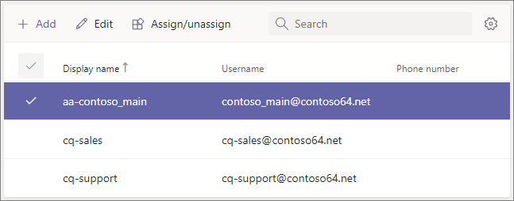
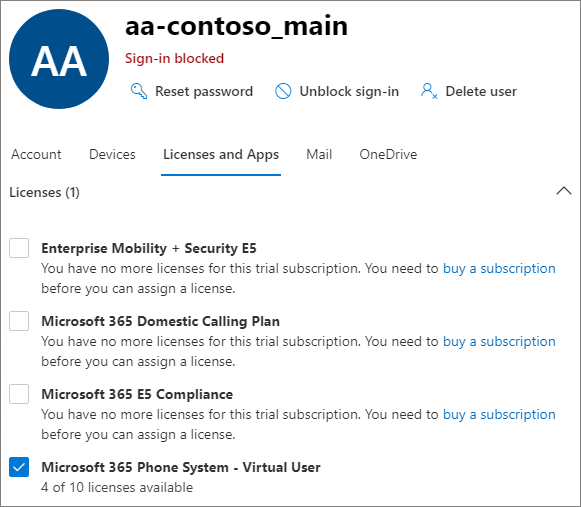

# <a name="manage-resource-accounts-in-microsoft-teams"></a><span data-ttu-id="fe476-103">Administrar cuentas de recursos en Microsoft Teams</span><span class="sxs-lookup"><span data-stu-id="fe476-103">Manage resource accounts in Microsoft Teams</span></span>

<span data-ttu-id="fe476-104">Una cuenta de recursos es un objeto de usuario deshabilitado en Azure AD y se puede usar para representar recursos en general.</span><span class="sxs-lookup"><span data-stu-id="fe476-104">A resource account is a disabled user object in Azure AD, and can be used to represent resources in general.</span></span> <span data-ttu-id="fe476-105">Por ejemplo, una cuenta de recursos se puede usar en Exchange para representar salas de conferencias y permitirles tener un número de teléfono y un calendario.</span><span class="sxs-lookup"><span data-stu-id="fe476-105">For example, a resource account may be used in Exchange to represent conference rooms and allow them to have a phone number and calendar.</span></span> <span data-ttu-id="fe476-106">Una cuenta de recursos se puede albergar en Microsoft 365 local con Skype Empresarial Server 2019.</span><span class="sxs-lookup"><span data-stu-id="fe476-106">A resource account can be homed in Microsoft 365 or on premises using Skype for Business Server 2019.</span></span>

<span data-ttu-id="fe476-107">En Microsoft Teams, se requiere una cuenta de recursos para cada operador automático o cola de llamadas.</span><span class="sxs-lookup"><span data-stu-id="fe476-107">In Microsoft Teams, a resource account is required for each auto attendant or call queue.</span></span> <span data-ttu-id="fe476-108">Las cuentas de recursos también pueden tener asignados números de teléfono de servicio.</span><span class="sxs-lookup"><span data-stu-id="fe476-108">Resource accounts may also be assigned service telephone numbers.</span></span> <span data-ttu-id="fe476-109">Así se asignan números de teléfono a operadores automáticos y colas de llamadas, lo que permite que los autores de llamadas de fuera de Teams lleguen al operador automático o a la cola de llamadas.</span><span class="sxs-lookup"><span data-stu-id="fe476-109">This is how you assign phone numbers to auto attendants and call queues allowing callers from outside Teams to reach the auto attendant or call queue.</span></span>

<span data-ttu-id="fe476-110">En este artículo se describe cómo crear cuentas de recursos y prepararlas para su uso con operadores automáticos y colas de llamadas.</span><span class="sxs-lookup"><span data-stu-id="fe476-110">This article covers how to create resource accounts and ready them for use with auto attendants and call queues.</span></span>

<span data-ttu-id="fe476-111">Antes de iniciar los procedimientos de este artículo, asegúrese de que ha hecho lo siguiente:</span><span class="sxs-lookup"><span data-stu-id="fe476-111">Before you start the procedures in this article, ensure you've done the following:</span></span>

- [<span data-ttu-id="fe476-112">Obtener licencias de usuario virtual</span><span class="sxs-lookup"><span data-stu-id="fe476-112">Obtain virtual user licenses</span></span>](#obtain-virtual-user-licenses)
- [<span data-ttu-id="fe476-113">Obtener números de servicio</span><span class="sxs-lookup"><span data-stu-id="fe476-113">Obtain service numbers</span></span>](#obtain-service-numbers)

### <a name="obtain-virtual-user-licenses"></a><span data-ttu-id="fe476-114">Obtener licencias de usuario virtual</span><span class="sxs-lookup"><span data-stu-id="fe476-114">Obtain virtual user licenses</span></span>

<span data-ttu-id="fe476-115">Cada cuenta de recurso requiere una licencia para trabajar con operadores automáticos y colas de llamadas.</span><span class="sxs-lookup"><span data-stu-id="fe476-115">Each resource account requires a license in order to work with auto attendants and call queues.</span></span> <span data-ttu-id="fe476-116">Puede usar una licencia *Microsoft 365 Sistema telefónico : usuario* virtual.</span><span class="sxs-lookup"><span data-stu-id="fe476-116">You can use a free *Microsoft 365 Phone System - Virtual User* license.</span></span> <span data-ttu-id="fe476-117">Para obtener estas licencias, vea [Licencia de usuario virtual.](teams-add-on-licensing/virtual-user.md)</span><span class="sxs-lookup"><span data-stu-id="fe476-117">To obtain these licenses, see [Virtual User license](teams-add-on-licensing/virtual-user.md).</span></span>

<span data-ttu-id="fe476-118">Tratamos cómo asignar la licencia a una cuenta de recursos más adelante en este artículo.</span><span class="sxs-lookup"><span data-stu-id="fe476-118">We cover how to assign the license to a resource account later in this article.</span></span>

<span data-ttu-id="fe476-119">Para obtener la licencia de usuario virtual, en el Centro de administración de Microsoft 365, vaya a Suscripciones de complementos de servicios de compra de facturación y desplácese hasta el final , verá Sistema telefónico - Licencia de usuario  >    >   *virtual.*</span><span class="sxs-lookup"><span data-stu-id="fe476-119">To get the Virtual User license, in the Microsoft 365 admin center, go to **Billing** > **Purchase services** > **Add-on subscriptions** and scroll to the end - you will see *Phone System - Virtual User* license.</span></span> <span data-ttu-id="fe476-120">Selecciona **Comprar ahora**.</span><span class="sxs-lookup"><span data-stu-id="fe476-120">Select **Buy now**.</span></span> <span data-ttu-id="fe476-121">Hay un coste cero, pero debe seguir estos pasos para adquirir la licencia.</span><span class="sxs-lookup"><span data-stu-id="fe476-121">There is a zero cost, but you still need to follow these steps to acquire the license.</span></span>

### <a name="obtain-service-numbers"></a><span data-ttu-id="fe476-122">Obtener números de servicio</span><span class="sxs-lookup"><span data-stu-id="fe476-122">Obtain service numbers</span></span>

<span data-ttu-id="fe476-123">Los números de servicio son opcionales para operadores automáticos y colas de llamadas, pero necesitará al menos un número de servicio para que los autores de llamadas lleguen a su operador automático y a la configuración de la cola de llamadas.</span><span class="sxs-lookup"><span data-stu-id="fe476-123">Service numbers are optional for auto attendants and call queues, however you will need at least one service number in order for callers to reach your auto attendant and call queue configuration.</span></span> <span data-ttu-id="fe476-124">Para cualquier operador automático o cola de llamadas a la que desee que un número de servicio pueda acceder directamente, debe tener una cuenta de recursos con un número de servicio asociado.</span><span class="sxs-lookup"><span data-stu-id="fe476-124">For any auto attendant or call queue that you want to be reachable directly by a service number, you must have a resource account with an associated service number.</span></span>

<span data-ttu-id="fe476-125">Las cuentas de recursos pueden usar números de servicio gratuitos o gratuitos.</span><span class="sxs-lookup"><span data-stu-id="fe476-125">Resource accounts can use either toll or toll-free service numbers.</span></span> <span data-ttu-id="fe476-126">Puede solicitar números nuevos o portabilidad de números existentes de otro operador.</span><span class="sxs-lookup"><span data-stu-id="fe476-126">You can request new numbers or port existing numbers from another carrier.</span></span>

<span data-ttu-id="fe476-127">Para obtener nuevos números de servicio, vea [Obtener números de teléfono de servicio](getting-service-phone-numbers.md).</span><span class="sxs-lookup"><span data-stu-id="fe476-127">To get new service numbers, see [Getting service phone numbers](getting-service-phone-numbers.md).</span></span>

<span data-ttu-id="fe476-128">Para transferir un número de otro operador, vea [Transferir números de teléfono a Teams](phone-number-calling-plans/transfer-phone-numbers-to-teams.md).</span><span class="sxs-lookup"><span data-stu-id="fe476-128">To port a number from another carrier, see [Transfer phone numbers to Teams](phone-number-calling-plans/transfer-phone-numbers-to-teams.md).</span></span>

## <a name="create-a-resource-account"></a><span data-ttu-id="fe476-129">Crear una cuenta de recursos</span><span class="sxs-lookup"><span data-stu-id="fe476-129">Create a resource account</span></span>

<span data-ttu-id="fe476-130">Puede crear una cuenta de recursos en el centro Teams administración.</span><span class="sxs-lookup"><span data-stu-id="fe476-130">You can create a resource account in the Teams admin center.</span></span>


1. <span data-ttu-id="fe476-132">En el Teams de administración, expanda **Configuración de** toda la organización y, a continuación, haga clic en Cuentas **de recursos.**</span><span class="sxs-lookup"><span data-stu-id="fe476-132">In the Teams admin center, expand **Org-wide settings**, and then click **Resource accounts**.</span></span>

2. <span data-ttu-id="fe476-133">Haga clic en **Agregar**.</span><span class="sxs-lookup"><span data-stu-id="fe476-133">Click **Add**.</span></span>

3. <span data-ttu-id="fe476-134">En el **panel Agregar cuenta de recursos,** rellene **Nombre** para mostrar, Nombre de **usuario** y el tipo de **cuenta Recurso.**</span><span class="sxs-lookup"><span data-stu-id="fe476-134">In the **Add resource account** pane, fill out **Display name**, **Username**, and the **Resource account type**.</span></span> <span data-ttu-id="fe476-135">El tipo de cuenta de recurso puede ser **Operador automático** o Cola **de** llamadas, dependiendo de cómo se va a usar esta cuenta de recursos.</span><span class="sxs-lookup"><span data-stu-id="fe476-135">The resource account type can be either **Auto attendant** or **Call queue**, depending how you intend to use this resource account.</span></span>

4. <span data-ttu-id="fe476-136">Haga clic en **Guardar**.</span><span class="sxs-lookup"><span data-stu-id="fe476-136">Click **Save**.</span></span>



## <a name="assign-a-license"></a><span data-ttu-id="fe476-138">Asignar una licencia</span><span class="sxs-lookup"><span data-stu-id="fe476-138">Assign a license</span></span>

<span data-ttu-id="fe476-139">Para cada cuenta de recurso, debe asignar una *Microsoft 365 Sistema telefónico: licencia* de usuario virtual *o Sistema telefónico* usuario.</span><span class="sxs-lookup"><span data-stu-id="fe476-139">For each resource account, you must assign a *Microsoft 365 Phone System - Virtual User* license or *Phone System* license.</span></span>



1. <span data-ttu-id="fe476-141">En el Microsoft 365 de administración, haga clic en la cuenta de recursos a la que desea asignar una licencia.</span><span class="sxs-lookup"><span data-stu-id="fe476-141">In the Microsoft 365 admin center, click the resource account to which you want to assign a license.</span></span>

2. <span data-ttu-id="fe476-142">En la **pestaña Licencias y aplicaciones,** en **Licencias,** **seleccione Microsoft 365 Sistema telefónico - Usuario virtual.**</span><span class="sxs-lookup"><span data-stu-id="fe476-142">On the **Licenses and Apps** tab, under **Licenses**, select **Microsoft 365 Phone System - Virtual User**.</span></span>

3. <span data-ttu-id="fe476-143">Haga clic **en Guardar cambios.**</span><span class="sxs-lookup"><span data-stu-id="fe476-143">Click **Save changes**.</span></span>

## <a name="assign-a-service-number"></a><span data-ttu-id="fe476-144">Asignar un número de servicio</span><span class="sxs-lookup"><span data-stu-id="fe476-144">Assign a service number</span></span>

<span data-ttu-id="fe476-145">Si va a usar la cuenta de recursos con un operador automático o una cola de llamadas que requiere un número de servicio, asigne un número a la cuenta de recursos.</span><span class="sxs-lookup"><span data-stu-id="fe476-145">If you're planning to use the resource account with an auto attendant or call queue that requires a service number, assign a number to the resource account.</span></span>


1. <span data-ttu-id="fe476-147">En el Teams de administración,  en la página Cuentas de recursos, seleccione la cuenta de recursos a la que desea asignar un número de servicio y, a continuación, haga clic en Asignar **o desasignación.**</span><span class="sxs-lookup"><span data-stu-id="fe476-147">In the Teams admin center, on the **Resource accounts** page, select the resource account to which you want to assign a service number, and then click **Assign/unassign**.</span></span>

2. <span data-ttu-id="fe476-148">En el **Teléfono de tipo de número,** elija el tipo de número que desea usar.</span><span class="sxs-lookup"><span data-stu-id="fe476-148">In the **Phone number type** dropdown, choose the type of number that you want to use.</span></span>

3. <span data-ttu-id="fe476-149">En el **cuadro Número de teléfono** asignado, busque el número que desea usar y haga clic en **Agregar.**</span><span class="sxs-lookup"><span data-stu-id="fe476-149">In the **Assigned phone number** box, search for the number you want to use and click **Add**.</span></span>

4. <span data-ttu-id="fe476-150">Haga clic en **Guardar**.</span><span class="sxs-lookup"><span data-stu-id="fe476-150">Click **Save**.</span></span>


<span data-ttu-id="fe476-151">Para asignar un enrutamiento directo o un número híbrido a una cuenta de recursos, debe usar PowerShell:</span><span class="sxs-lookup"><span data-stu-id="fe476-151">To assign a direct routing or hybrid number to a resource account you need to use PowerShell:</span></span>

`Set-CsOnlineApplicationInstance -Identity aa-contoso_main@contoso64.net -OnpremPhoneNumber +19295550150`

## <a name="next-steps"></a><span data-ttu-id="fe476-152">Pasos siguientes</span><span class="sxs-lookup"><span data-stu-id="fe476-152">Next steps</span></span>

<span data-ttu-id="fe476-153">Una vez que haya completado la configuración de la cuenta de recursos y asignar un número de servicio si es necesario, estará listo para usar la cuenta de recursos con un operador automático o una cola de llamadas.</span><span class="sxs-lookup"><span data-stu-id="fe476-153">Once you've completed the resource account setup and assigning a service number if needed, you're ready to use the resource account with an auto attendant or call queue.</span></span>

<span data-ttu-id="fe476-154">Vea las siguientes referencias:</span><span class="sxs-lookup"><span data-stu-id="fe476-154">See the following references:</span></span>

 - [<span data-ttu-id="fe476-155">Operador automático en la nube</span><span class="sxs-lookup"><span data-stu-id="fe476-155">Cloud auto attendant</span></span>](create-a-phone-system-auto-attendant.md)

 - [<span data-ttu-id="fe476-156">Cola de llamadas en la nube</span><span class="sxs-lookup"><span data-stu-id="fe476-156">Cloud call queue</span></span>](create-a-phone-system-call-queue.md)

<span data-ttu-id="fe476-157">Puede editar la cuenta de recursos Nombre para **mostrar** y **Tipo de** cuenta de recursos con la **opción** Editar.</span><span class="sxs-lookup"><span data-stu-id="fe476-157">You can edit the resource account **Display name** and **Resource account** type using the **Edit** option.</span></span> <span data-ttu-id="fe476-158">Haga **clic en** Guardar cuando haya terminado.</span><span class="sxs-lookup"><span data-stu-id="fe476-158">Click **Save** when you are done.</span></span>

## <a name="change-an-existing-resource-account-to-use-a-virtual-user-license"></a><span data-ttu-id="fe476-159">Cambiar una cuenta de recurso existente para usar una licencia de usuario virtual</span><span class="sxs-lookup"><span data-stu-id="fe476-159">Change an existing resource account to use a Virtual User license</span></span>

<span data-ttu-id="fe476-160">Si decide cambiar las licencias de su cuenta de recursos existente de una licencia de **Sistema telefónico a** una licencia de usuario virtual, tendrá que adquirir la licencia de usuario virtual gratuita y, a continuación, siga los pasos del Centro de administración de Microsoft 365 para mover usuarios a una [suscripción](/microsoft-365/admin/manage/assign-licenses-to-users#move-users-to-a-different-subscription)diferente.</span><span class="sxs-lookup"><span data-stu-id="fe476-160">If you decide to switch the licenses on your existing resource account from a **Phone System** license to a Virtual User license, you'll need to acquire the free Virtual User license, and then follow the steps in the Microsoft 365 admin center to [Move users to a different subscription](/microsoft-365/admin/manage/assign-licenses-to-users#move-users-to-a-different-subscription).</span></span>

> [!WARNING]
> <span data-ttu-id="fe476-161">Quite siempre una licencia Sistema telefónico licencia completa y asigne la licencia de usuario virtual en la misma actividad de licencia.</span><span class="sxs-lookup"><span data-stu-id="fe476-161">Always remove a full Phone System License and assign the Virtual User license in the same license activity.</span></span> <span data-ttu-id="fe476-162">Si quita la licencia antigua, guarda los cambios de la cuenta, agrega la nueva licencia y, a continuación, vuelve a guardar la configuración de la cuenta, es posible que la cuenta de recursos ya no funcione según lo esperado.</span><span class="sxs-lookup"><span data-stu-id="fe476-162">If you remove the old license, save the account changes, add the new license, and then save the account settings again, the resource account may no longer function as expected.</span></span> <span data-ttu-id="fe476-163">Si esto sucede, le recomendamos que cree una nueva cuenta de recursos para la licencia de usuario virtual y quite la cuenta de recursos rota.</span><span class="sxs-lookup"><span data-stu-id="fe476-163">If this happens, we recommend you create a new resource account for the Virtual User license and remove the broken resource account.</span></span>

## <a name="skype-for-business-server-2019"></a><span data-ttu-id="fe476-164">Skype Para Business Server 2019</span><span class="sxs-lookup"><span data-stu-id="fe476-164">Skype For Business Server 2019</span></span>

<span data-ttu-id="fe476-165">Para las cuentas de recursos de Skype For Business Server 2019 que se pueden usar con colas de llamadas en la nube y operadores automáticos en la nube, vea [Planear](/SkypeforBusiness/hybrid/plan-call-queue) colas de llamadas en la nube o Planear operadores automáticos en la [nube.](/SkypeForBusiness/hybrid/plan-cloud-auto-attendant)</span><span class="sxs-lookup"><span data-stu-id="fe476-165">For resource accounts homed on Skype For Business Server 2019 that can be used with cloud call queues and cloud auto attendants, see [Plan Cloud call queues](/SkypeforBusiness/hybrid/plan-call-queue) or [Plan Cloud auto attendants](/SkypeForBusiness/hybrid/plan-cloud-auto-attendant).</span></span> <span data-ttu-id="fe476-166">Las implementaciones híbridas (números de enrutamiento directo) se configuran con el cmdlet [New-CsHybridApplicationEndpoint](/powershell/module/skype/new-cshybridapplicationendpoint) en un servidor local Skype Empresarial Server 2019.</span><span class="sxs-lookup"><span data-stu-id="fe476-166">Hybrid implementations (numbers homed on Direct Routing) are configured using the [New-CsHybridApplicationEndpoint](/powershell/module/skype/new-cshybridapplicationendpoint) cmdlet on an on-premises Skype for Business Server 2019 server.</span></span>

<span data-ttu-id="fe476-167">Los IDs de aplicación que necesita usar al crear las instancias de la aplicación son:</span><span class="sxs-lookup"><span data-stu-id="fe476-167">The application IDs that you need to use while creating the application instances are:</span></span>

- <span data-ttu-id="fe476-168">**Operador automático:** ce933385-9390-45d1-9512-c8d228074e07</span><span class="sxs-lookup"><span data-stu-id="fe476-168">**Auto Attendant:** ce933385-9390-45d1-9512-c8d228074e07</span></span>
- <span data-ttu-id="fe476-169">**Cola de llamadas:** 11cd3e2e-fccb-42ad-ad00-878b93575e07</span><span class="sxs-lookup"><span data-stu-id="fe476-169">**Call Queue:** 11cd3e2e-fccb-42ad-ad00-878b93575e07</span></span>

> [!NOTE]
> <span data-ttu-id="fe476-170">Si desea que los usuarios de Skype Para Business Server 2019 puedan buscar la cola de llamadas o el operador automático, debe crear sus cuentas de recursos en Skype For Business Server 2019, ya que las cuentas de recursos en línea no se sincronizan con Active Directory.</span><span class="sxs-lookup"><span data-stu-id="fe476-170">If you want the call queue or auto attendant to be searchable by Skype For Business Server 2019 users, you should create your resource accounts on Skype For Business Server 2019, since online resource accounts are not synced down to Active Directory.</span></span> <span data-ttu-id="fe476-171">Cuando los registros SRV dns para sipfederationtls se resuelven en  Skype Empresarial Server 2019, las cuentas de recursos deben crearse en Skype For Business Server 2019 con el shell de administración de SfB y sincronizarse con Azure AD.</span><span class="sxs-lookup"><span data-stu-id="fe476-171">When DNS SRV records for sipfederationtls resolve to Skype for Business Server 2019, then resource accounts **must** be created on Skype For Business Server 2019 using SfB Management shell and synchronized to Azure AD.</span></span>

<span data-ttu-id="fe476-172">Para implementaciones que son híbridas con Skype Empresarial Server:</span><span class="sxs-lookup"><span data-stu-id="fe476-172">For implementations that are hybrid with Skype for Business Server:</span></span>

   [<span data-ttu-id="fe476-173">Planear los operadores automáticos en la nube</span><span class="sxs-lookup"><span data-stu-id="fe476-173">Plan Cloud auto attendants</span></span>](/SkypeForBusiness/hybrid/plan-cloud-auto-attendant)
  
   [<span data-ttu-id="fe476-174">Planear las colas de llamadas en la nube</span><span class="sxs-lookup"><span data-stu-id="fe476-174">Plan Cloud call queues</span></span>](/SkypeforBusiness/hybrid/plan-call-queue)
   
   [<span data-ttu-id="fe476-175">Configurar cuentas de recursos locales</span><span class="sxs-lookup"><span data-stu-id="fe476-175">Configure on-prem resource accounts</span></span>](/SkypeForBusiness/hybrid/configure-onprem-ra)


## <a name="delete-a-resource-account"></a><span data-ttu-id="fe476-176">Eliminar una cuenta de recursos</span><span class="sxs-lookup"><span data-stu-id="fe476-176">Delete a resource account</span></span>

<span data-ttu-id="fe476-177">Asegúrese de disociar el número de teléfono de la cuenta de recursos antes de eliminarlo, para evitar que el número de servicio se atasca en el modo pendiente.</span><span class="sxs-lookup"><span data-stu-id="fe476-177">Make sure you dissociate the telephone number from the resource account before deleting it, to avoid getting your service number stuck in pending mode.</span></span>

<span data-ttu-id="fe476-178">Después de hacerlo, puede eliminar la cuenta de recursos en el centro Microsoft 365 administración, en la pestaña Usuarios.</span><span class="sxs-lookup"><span data-stu-id="fe476-178">After you do that, you can delete the resource account in the Microsoft 365 admin center, under the Users tab.</span></span>

<span data-ttu-id="fe476-179">Para desasociar un número de teléfono de enrutamiento directo de la cuenta de recursos, use el siguiente cmdlet:</span><span class="sxs-lookup"><span data-stu-id="fe476-179">To disassociate a direct routing telephone number from the resource account, use the following cmdlet:</span></span>

```powershell
Set-CsOnlineApplicationInstance -Identity  <Resource Account oid> -OnpremPhoneNumber ""
```