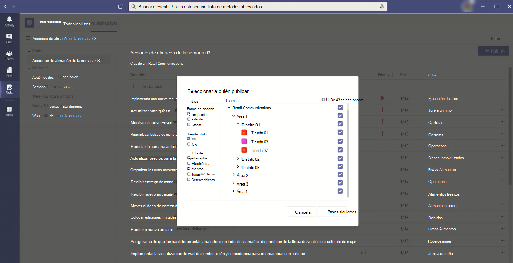

# Administrar la aplicación tareas de su organización en Microsoft Teams

> **Esta característica está actualmente en versión preliminar privada.**

## Descripción general de las tareas

La aplicación tareas ofrece una experiencia de administración de tareas cohesiva a Microsoft Teams, integrando tareas personales con tecnología de tareas pendientes y tareas de equipo desarrollado por Planner en un solo lugar. Los usuarios pueden tener acceso a las tareas como una aplicación en el lado izquierdo de los equipos y como una pestaña en un canal dentro de equipos individuales. Las **listas personales** y **las listas de equipos** de las tareas permiten a los usuarios ver y administrar todas sus tareas personales y de equipo y priorizar su trabajo. Tareas está disponible en equipos de escritorio, Web y móviles de equipos de escritorio. 

> [!NOTE]
> A medida que implementemos la experiencia de tareas en los clientes de escritorio de Teams, el nombre de la aplicación aparecerá inicialmente como **planeador** para los usuarios. El nombre cambiará temporalmente a **tareas por Planner y tareas pendientes**, y después, se le cambiará el nombre a **tareas**. En los clientes móviles de Teams, los usuarios siempre verán el nombre de la aplicación como **tareas**. Es posible que haya un pequeño retraso en la disponibilidad de la experiencia móvil después de que la experiencia de escritorio esté disponible.

   

Para las organizaciones que desean simplificar la administración de tareas para los trabajadores de los Firstline, tareas también incluye capacidades que le permiten dirigir, publicar y realizar un seguimiento de las tareas a escala en toda la los Firstline empleados. Por ejemplo, el liderazgo corporativo y regional puede crear y publicar listas de tareas dirigidas a ubicaciones relevantes, como tiendas minoristas específicas, y realizar un seguimiento del progreso a través de informes en tiempo real. Los administradores pueden asignar tareas a su personal y dirigir actividades dentro de sus ubicaciones, y los trabajadores de los Firstline tienen una lista prioritaria de las tareas que tienen asignadas en dispositivos móviles o de escritorio. Para habilitar la [publicación de tareas](#task-publishing), primero deberá configurar una jerarquía de objetivos de equipo para su organización, que defina cómo se relacionan entre sí todos los equipos de la jerarquía.

## Lo que debe saber sobre las tareas

Tareas está disponible como una aplicación y como una pestaña en un canal. Tenga en cuenta que la aplicación incluye las tareas personales de tareas pendientes y de equipo de Planner, mientras que la pestaña solo muestra tareas de equipo.

Con las tareas, los usuarios obtienen una experiencia de escritorio, Web y móvil. Si se instala Tasks en el cliente de escritorio de Teams, los usuarios también la verán en sus equipos web y en sus clientes móviles. La excepción son los usuarios invitados. Es importante saber que los invitados solo pueden tener acceso a las tareas como una aplicación desde el cliente móvil de Teams. Los invitados verán las pestañas tareas en los equipos de escritorio y en los clientes Web.

Las listas personales muestran las tareas individuales de un usuario. En las listas de equipos se muestran las tareas en las que está trabajando todo el equipo e incluye cualquier lista de tareas que se agregue como pestaña tareas a un canal. Tenga en cuenta lo siguiente:

- Las listas personales que crea un usuario en la aplicación tareas también aparecerán en los clientes para ese usuario. Del mismo modo, las listas de tareas que un usuario cree en to do aparecerán en listas personales en las tareas de ese usuario. Lo mismo sucede con las tareas individuales.

- Las pestañas de tareas que se agreguen a un canal también aparecerán en los clientes de Planner. Cuando un usuario crea un plan en Planner, el plan no se mostrará en la aplicación tareas o en Planner, a menos que se agregue como una pestaña a un canal. Cuando un usuario agrega una nueva pestaña tareas, puede crear una lista o un plan nuevos o elegir uno existente.

## Configurar tareas

> [!IMPORTANT]
> La configuración y las directivas que configuró para Planner también se aplicarán a las tareas.

### Habilitar o deshabilitar tareas de su organización

Tareas está habilitada de forma predeterminada para todos los usuarios de equipos de su organización. Puede desactivar o activar la aplicación en el nivel de organización en la página [Administrar aplicaciones](manage-apps.md) del centro de administración de Microsoft Teams.

1. En el centro de navegación izquierdo del centro de administración de Microsoft Teams, vaya a **aplicaciones** > de Teams**Manage apps** .
2. En la lista de aplicaciones, realice una de las siguientes acciones:

    - Para desactivar las tareas de su organización, busque la aplicación tareas, selecciónela y, a continuación, haga clic en **bloquear**.
    - Para activar las tareas de su organización, busque la aplicación tareas, selecciónela y, a continuación, haga clic en **permitir**.

### Habilitar o deshabilitar tareas para usuarios específicos de su organización

Para permitir o bloquear a determinados usuarios de su organización el uso de tareas, asegúrese de que las tareas estén activadas para su organización en la página [Administrar aplicaciones](manage-apps.md) y, después, cree una directiva de permisos de aplicaciones personalizada y asígnela a esos usuarios. Para obtener más información, vea [Administrar directivas de permisos de aplicaciones en Teams](teams-app-permission-policies.md).

### Usar una directiva de configuración de la aplicación para anclar tareas a teams

Las directivas de configuración de la aplicación le permiten personalizar Teams para resaltar las aplicaciones más importantes para los usuarios de su organización. Las aplicaciones que establezca en una directiva se anclan a la barra&mdash;de la aplicación, que se encuentra en el costado del cliente de escritorio de Teams y en&mdash;la parte inferior de los clientes móviles de Teams donde los usuarios pueden acceder a ellas de forma rápida y fácil.

Para anclar la aplicación tareas para los usuarios, puede editar la directiva global (opción predeterminada para toda la organización) o crear y asignar una directiva personalizada de configuración de la aplicación. Para obtener más información, vea [Administrar directivas de configuración de aplicaciones en Teams](teams-app-setup-policies.md).

### Ocultar las listas personales de los usuarios si no quiere que los usuarios las vean 

Si no quiere que los usuarios vean las listas personales, puede ocultarla. Para ello, [Quite la licencia de Exchange online del usuario](https://docs.microsoft.com/microsoft-365/admin/manage/remove-licenses-from-users). Tenga en cuenta que después de quitar una licencia de Exchange Online, el usuario ya no tendrá acceso a su buzón. Los datos del buzón se conservan durante 30 días, después de los cuales se eliminan los datos y no se pueden recuperar a menos que el buzón de correo se coloque en [una conservación local o en una](https://docs.microsoft.com/exchange/security-and-compliance/in-place-and-litigation-holds)retención por juicio.

## Publicación de tareas

Con la publicación de tareas, su organización puede publicar listas de tareas destinadas a ubicaciones específicas (equipos) en toda la organización para definir y compartir un plan de trabajo para que se complete en dichas ubicaciones.

- Las personas del equipo de publicación, como el liderazgo corporativo o regional, pueden crear listas de tareas y publicarlas en determinados equipos. 
    
- Los administradores de los equipos destinatarios pueden revisar las listas de tareas publicadas y asignar tareas individuales a los miembros del equipo. 
    
- Los trabajadores de los Firstline tienen una experiencia móvil simple para ver las tareas que tienen asignadas. Pueden adjuntar fotos para mostrar su trabajo cuando corresponda y marcar sus tareas como completadas.
- Los editores y administradores pueden ver informes para ver la asignación y el estado de finalización de las tareas de cada nivel, incluyendo la ubicación (equipo), la lista de tareas y la tarea individual. 
    

Los usuarios pueden crear, administrar y publicar listas de tareas en la pestaña **listas publicadas** de la aplicación tareas. Esta pestaña solo se muestra para un usuario si su organización ha [configurado una jerarquía de destino de equipo](#set-up-your-team-targeting-hierarchy) y el usuario está en un equipo incluido en la jerarquía. La jerarquía determina si el usuario puede publicar o recibir listas de tareas y ver los informes de las listas recibidas.

### Escenario de ejemplo

Este es un ejemplo de cómo funciona la publicación de tareas.

Contoso está publicando una nueva takeout alimentaria y una promoción de entrega. Para mantener una experiencia de marca coherente, necesitan coordinar la ejecución coherente de la distribución entre las 300 ubicaciones de la tienda.

El equipo de marketing comparte los detalles de la promoción y la lista correspondiente de tareas con el administrador de comunicaciones minoristas. El administrador de comunicaciones minoristas, que sirve como guardián para las tiendas, revisa la información, crea una lista de tareas para la promoción y, a continuación, crea una tarea para cada unidad de trabajo que debe realizar cada uno de los almacenes afectados. Cuando la lista de tareas está completa, debe seleccionar las tiendas que deben completar el trabajo. En este caso, la promoción solo se aplica a las tiendas de los Estados Unidos que tengan un restaurante en la tienda. En tareas, filtra la lista de tiendas en función del atributo de restaurante en el almacén, selecciona las ubicaciones de los Estados Unidos correspondientes en la jerarquía y, a continuación, publica la lista de tareas en dichas tiendas.

Los administradores de tienda de cada ubicación reciben una copia de las tareas publicadas y las asignan a los miembros del equipo. Los administradores pueden usar la experiencia de tareas para comprender todo el trabajo requerido en su tienda. También pueden usar los filtros disponibles para centrarse en un conjunto específico de trabajo, como el trabajo que vence hoy o trabajar en un área en particular.

Los trabajadores de los Firstline en cada ubicación de la tienda ahora tienen una lista priorizada de su trabajo en las tareas de su dispositivo móvil. Cuando termine una tarea, la marcarán como completada. Algunas incluso pueden optar por cargar y adjuntar una foto a la tarea para mostrar su trabajo.

La sede central de Contoso y los administradores intermedios pueden ver los informes para ver la asignación y el estado de finalización de las tareas en cada tienda y en todas las tiendas. También pueden profundizar en una tarea específica para ver el estado en diferentes tiendas. A medida que la fecha de lanzamiento se acerca, pueden detectar cualquier anomalía y registrar con sus equipos según sea necesario. Esta visibilidad permite que contoso mejore la eficacia de la distribución y ofrezca una experiencia más coherente en sus tiendas.

### Configurar la jerarquía de destino de su equipo

Para habilitar la publicación de tareas en su organización, primero debe configurar el esquema de destino de su equipo en un. Archivo CSV. El esquema define cómo se relacionan entre sí todos los equipos de su jerarquía y los atributos usados para filtrar y seleccionar Teams. Después de crear el esquema, cárguelo en Teams para aplicarlo a su organización. Los miembros del equipo de publicación, como el administrador de comunicaciones minoristas en el escenario de ejemplo, pueden filtrar equipos por jerarquía, atributos o una combinación de ambos para seleccionar los equipos relevantes que deben recibir las listas de tareas y, a continuación, publicar las listas de tareas en esos equipos.

Para conocer los pasos sobre cómo configurar la jerarquía de destino de su equipo, vea [configurar la jerarquía de destino de su equipo](set-up-your-team-hierarchy.md).

## Automatización de Power y API de grafos

Las tareas admiten la automatización de la energía de las API de tareas pendientes y de gráficos para Planner. Para obtener más información, consulte:

- [Información general de la API de planes y tareas de Planner](https://docs.microsoft.com/graph/planner-concept-overview)
- [Uso de Microsoft to do Automate](https://support.office.com/article/using-microsoft-to-do-with-power-automate-526e8f75-217b-46e0-9e06-44780b72c295)