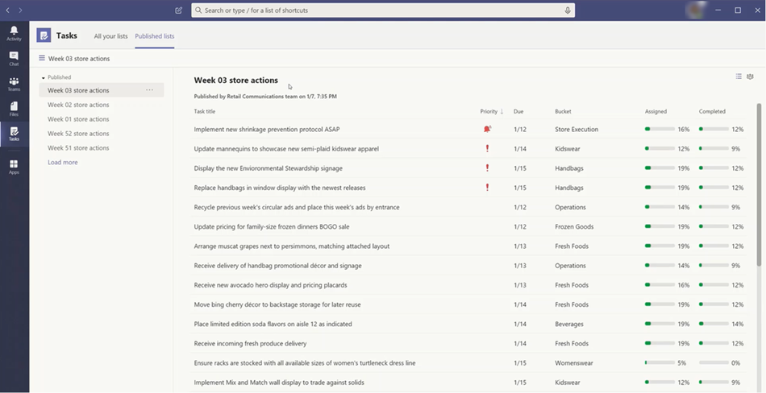

# Administrar la aplicación tareas de su organización en Microsoft TeamsManage the Tasks app for your organization in Microsoft Teams

## Descripción general de las tareasOverview of Tasks

La aplicación tareas ofrece una experiencia de administración de tareas cohesiva a Microsoft Teams, lo que integra tareas individuales con tecnología de [Microsoft to do](https://todo.microsoft.com/tasks/) y tareas de equipo desarrollado por Planner en un solo lugar.The Tasks app brings a cohesive task management experience to Microsoft Teams, integrating individual tasks powered by [Microsoft To Do](https://todo.microsoft.com/tasks/) and team tasks powered by Planner in one place. Los usuarios pueden tener acceso a las tareas como una aplicación en el lado izquierdo de los equipos y como una pestaña en un canal dentro de equipos individuales.Users can access Tasks as an app on the left side of Teams and as a tab in a channel within individual teams. **Mis tareas** y **planes compartidos** en tareas permiten a los usuarios ver y administrar todas sus tareas individuales y de equipo y priorizar su trabajo.**My tasks** and **Shared plans** in Tasks let users view and manage all their individual and team tasks and prioritize their work. Tareas está disponible en equipos de escritorio, Web y móviles de equipos de escritorio.Tasks is available in Teams desktop, web, and mobile clients. 

> [!NOTE]
> A medida que implementemos la experiencia de tareas en los clientes de escritorio de Teams, el nombre de la aplicación aparecerá inicialmente como **planeador** para los usuarios.As we roll out the Tasks experience on Teams desktop clients, the app name will initially appear as **Planner** to users. El nombre cambiará temporalmente a **tareas por Planner y tareas pendientes** , y después, se le cambiará el nombre a **tareas** .The name will then temporarily change to **Tasks by Planner and To Do** , and later on, it will be renamed to **Tasks** . En los clientes móviles de Teams, los usuarios siempre verán el nombre de la aplicación como **tareas** .On Teams mobile clients, users will always see the app name as **Tasks** . Es posible que haya un pequeño retraso en la disponibilidad de la experiencia móvil después de que la experiencia de escritorio esté disponible.There may be a short delay in the availability of the mobile experience after the desktop experience is available.

   

Para las organizaciones que desean simplificar la administración de tareas para los trabajadores de los Firstline, tareas también incluye capacidades que le permiten dirigir, publicar y realizar un seguimiento de las tareas a escala en toda la los Firstline empleados.For organizations who want to streamline task management for Firstline Workers, Tasks also includes capabilities that enable you to target, publish, and track tasks at scale across your Firstline Workforce. Por ejemplo, el liderazgo corporativo y regional puede crear y publicar listas de tareas dirigidas a ubicaciones relevantes, como tiendas minoristas específicas, y realizar un seguimiento del progreso a través de informes en tiempo real.For example, corporate and regional leadership can create and publish task lists targeted to relevant locations, such as specific retail stores, and track progress through real-time reports. Los administradores pueden asignar tareas a su personal y dirigir actividades dentro de sus ubicaciones, y los trabajadores de los Firstline tienen una lista prioritaria de las tareas que tienen asignadas en dispositivos móviles o de escritorio.Managers can assign tasks to their staff and direct activities within their locations, and Firstline Workers have a prioritized list of their assigned tasks on mobile or desktop. Para habilitar la [publicación de tareas](#task-publishing), primero deberá configurar una jerarquía de objetivos de equipo para su organización, que defina cómo se relacionan entre sí todos los equipos de la jerarquía.To enable [task publishing](#task-publishing), you'll first need to set up a team targeting hierarchy for your organization, which defines how all teams in the hierarchy are related to each other.

## Lo que debe saber sobre las tareasWhat you need to know about Tasks

Tareas está disponible como una aplicación y como una pestaña en un canal.Tasks is available as an app and as a tab in a channel. Tenga en cuenta que la aplicación incluye las tareas individuales de tareas pendientes y de equipo desde Planner, mientras que la pestaña solo muestra tareas de equipo.Keep in mind that the app comprises both individual tasks from To Do and team tasks from Planner whereas the tab shows only team tasks.

Con las tareas, los usuarios obtienen una experiencia de escritorio, Web y móvil.With Tasks, users get a desktop, web, and mobile experience. Si se instala Tasks en el cliente de escritorio de Teams, los usuarios también la verán en sus equipos web y en sus clientes móviles.If Tasks is installed on the Teams desktop client, users will also see it on their Teams web and mobile clients. La excepción son los usuarios invitados.The exception is guest users. Es importante saber que los invitados solo pueden tener acceso a las tareas como una aplicación desde el cliente móvil de Teams.It's important to know that guests can only access Tasks as an app from the Teams mobile client. Los invitados verán las pestañas tareas en los equipos de escritorio y en los clientes Web.Guests will see Tasks tabs on both Teams desktop and web clients.

**Mis tareas** muestra las tareas individuales de un usuario.**My tasks** shows a user's individual tasks. **Planes compartidos** muestra las tareas en las que está trabajando todo el equipo e incluye cualquier lista de tareas que se agregue como una ficha tareas a un canal.**Shared plans** show tasks that the whole team is working on and includes any task list that's added as a Tasks tab to a channel. Tenga en cuenta lo siguiente:Note the following:

- Las listas de tareas que crea un usuario en la aplicación tareas también aparecerán en los clientes para ese usuario.Task lists that a user creates in the Tasks app will also appear in To Do clients for that user. Del mismo modo, las listas de tareas que un usuario cree en to do aparecerán en **mis tareas** en tareas para ese usuario.Similarly, task lists that a user creates in To Do will appear in **My tasks** in Tasks for that user. Lo mismo sucede con las tareas individuales.The same is true for individual tasks.

- Las pestañas de tareas que se agreguen a un canal también aparecerán en los clientes de Planner.Any Tasks tab that's added to a channel will also appear in Planner clients. Cuando un usuario crea un plan en Planner, el plan no se mostrará en la aplicación tareas o en Planner, a menos que se agregue como una pestaña a un canal.When a user creates a plan in Planner, the plan won't show in the Tasks or Planner app unless it's added as a tab to a channel. Cuando un usuario agrega una nueva pestaña tareas, puede crear una lista o un plan nuevos o elegir uno existente.When a user adds a new Tasks tab, they can create a new list or plan or choose an existing one.

## Configurar tareasSet up Tasks

> [!IMPORTANT]
> La configuración y las directivas que configuró para Planner también se aplicarán a las tareas.Settings and policies that you configured for Planner will also apply to Tasks.

### Habilitar o deshabilitar tareas de su organizaciónEnable or disable Tasks in your organization

Tareas está habilitada de forma predeterminada para todos los usuarios de equipos de su organización.Tasks is enabled by default for all Teams users in your organization. Puede desactivar o activar la aplicación en el nivel de organización en la página [Administrar aplicaciones](manage-apps.md) del centro de administración de Microsoft Teams.You can turn off or turn on the app at the org level on the [Manage apps](manage-apps.md) page in the Microsoft Teams admin center.

1. En el centro de navegación izquierdo del centro de administración de Microsoft Teams, vaya a **aplicaciones de Teams**  >  **Manage apps** .In the left navigation of the Microsoft Teams admin center, go to **Teams apps** > **Manage apps** .
2. En la lista de aplicaciones, realice una de las siguientes acciones:In the list of apps, do one of the following:

    - Para desactivar las tareas de su organización, busque la aplicación tareas, selecciónela y, a continuación, haga clic en **bloquear** .To turn off Tasks for your organization, search for the Tasks app, select it, and then click **Block** .
    - Para activar las tareas de su organización, busque la aplicación tareas, selecciónela y, a continuación, haga clic en **permitir** .To turn on Tasks for your organization, search for the Tasks app, select it, and then click **Allow** .

### Habilitar o deshabilitar tareas para usuarios específicos de su organizaciónEnable or disable Tasks for specific users in your organization

Para permitir o bloquear a determinados usuarios de su organización el uso de tareas, asegúrese de que las tareas estén activadas para su organización en la página [Administrar aplicaciones](manage-apps.md) y, después, cree una directiva de permisos de aplicaciones personalizada y asígnela a esos usuarios.To allow or block specific users in your organization from using Tasks, make sure Tasks is turned on for your organization on the [Manage apps](manage-apps.md) page, and then create a custom app permission policy and assign it to those users. Para obtener más información, vea [Administrar directivas de permisos de aplicaciones en Teams](teams-app-permission-policies.md).To learn more, see [Manage app permission policies in Teams](teams-app-permission-policies.md).

### Usar una directiva de configuración de la aplicación para anclar tareas a teamsUse an app setup policy to pin Tasks to Teams

Las directivas de configuración de la aplicación le permiten personalizar Teams para resaltar las aplicaciones más importantes para los usuarios de su organización.App setup policies let you customize Teams to highlight the apps that are most important for users in your organization. Las aplicaciones que establezca en una directiva se anclan a la barra de la aplicación, que se &mdash; encuentra en el costado del cliente de escritorio de Teams y en la parte inferior de los clientes móviles de Teams &mdash; donde los usuarios pueden acceder a ellas de forma rápida y fácil.The apps you set in a policy are pinned to the app bar&mdash;the bar on the side of the Teams desktop client and at the bottom of the Teams mobile clients&mdash;where users can quickly and easily access them.

Para anclar la aplicación tareas para los usuarios, puede editar la directiva global (opción predeterminada para toda la organización) o crear y asignar una directiva personalizada de configuración de la aplicación.To pin the Tasks app for your users, you can edit the global (Org-wide default) policy or create and assign a custom app setup policy. Para obtener más información, vea [Administrar directivas de configuración de aplicaciones en Teams](teams-app-setup-policies.md).To learn more, see [Manage app setup policies in Teams](teams-app-setup-policies.md).

### Mis tareas de un usuario está visible si el usuario tiene una licencia de Exchange OnlineA user's My tasks is visible if the user is licensed for Exchange Online

Si no desea que un usuario vea **mis tareas** , puede ocultarlo.If you don't want a user to see **My tasks** , you can hide it. Para ello, [Quite la licencia de Exchange online del usuario](https://docs.microsoft.com/microsoft-365/admin/manage/remove-licenses-from-users).To do this, [remove the user's Exchange Online license](https://docs.microsoft.com/microsoft-365/admin/manage/remove-licenses-from-users). Es importante saber que después de quitar una licencia de Exchange Online, el usuario ya no tendrá acceso a su buzón.It's important to know that after you remove an Exchange Online license, the user no longer has access to their mailbox.  Los datos del buzón se conservan durante 30 días, después de los cuales se eliminan los datos y no se pueden recuperar a menos que el buzón de correo se coloque en [una conservación local o en una](https://docs.microsoft.com/exchange/security-and-compliance/in-place-and-litigation-holds)retención por juicio.Mailbox data is held for 30 days, after which the data will be removed and can't be recovered unless the mailbox is placed on [In-Place Hold or Litigation Hold](https://docs.microsoft.com/exchange/security-and-compliance/in-place-and-litigation-holds).

No recomendamos esto a los trabajadores de la información, pero es posible que haya algunos escenarios en los que se pueda aplicar este tipo de trabajadores, como los de los trabajadores de los Firstline que no dependan de su correo electrónico.We don't recommend this for information workers, but there may be some scenarios where this could apply, such as for Firstline Workers who don't depend on email.

## Publicación de tareasTask publishing

Con la publicación de tareas, su organización puede publicar listas de tareas destinadas a ubicaciones específicas (equipos) en toda la organización para definir y compartir un plan de trabajo para que se complete en dichas ubicaciones.With task publishing, your organization can publish task lists targeted to specific locations (teams) across your organization to define and share a work plan to be completed at those locations.

- Las personas del equipo de publicación, como el liderazgo corporativo o regional, pueden crear listas de tareas y publicarlas en determinados equipos.People on the publishing team, such as corporate or regional leadership, can create task lists and publish them to specific teams. 
    
- Los administradores de los equipos destinatarios pueden revisar las listas de tareas publicadas y asignar tareas individuales a los miembros del equipo.Managers on the recipient teams can review the published task lists and assign individual tasks to team members. 
    
- Los trabajadores de los Firstline tienen una experiencia móvil simple para ver las tareas que tienen asignadas.Firstline Workers have a simple mobile experience to see tasks assigned to them. Pueden adjuntar fotos para mostrar su trabajo cuando corresponda y marcar sus tareas como completadas.They can attach photos to show their work when appropriate and mark their tasks as completed.
- Los editores y administradores pueden ver informes para ver la asignación y el estado de finalización de las tareas de cada nivel, incluyendo la ubicación (equipo), la lista de tareas y la tarea individual.Publishers and managers can view reports to see assignment and completion status of tasks at each level, including by location (team), task list, and individual task. 
    

Los usuarios pueden crear, administrar y publicar listas de tareas en la pestaña **listas publicadas** de la aplicación tareas.Users create, manage, and publish task lists on the **Published lists** tab in the Tasks app. Esta pestaña solo se muestra para un usuario si su organización ha [configurado una jerarquía de destino de equipo](#set-up-your-team-targeting-hierarchy) y el usuario está en un equipo incluido en la jerarquía.This tab only shows for a user if your organization [set up a team targeting hierarchy](#set-up-your-team-targeting-hierarchy) and the user is on a team that's included in the hierarchy. La jerarquía determina si el usuario puede publicar o recibir listas de tareas y ver los informes de las listas recibidas.The hierarchy determines whether the user can publish or receive task lists and view reporting for received lists.

### Escenario de ejemploExample scenario

Este es un ejemplo de cómo funciona la publicación de tareas.Here's an example of how task publishing works.

Contoso está publicando una nueva takeout alimentaria y una promoción de entrega.Contoso is rolling out a new food takeout and delivery promotion. Para mantener una experiencia de marca coherente, necesitan coordinar la ejecución coherente de la distribución entre las 300 ubicaciones de la tienda.To maintain a consistent brand experience, they need to coordinate consistent execution of the rollout across over 300 store locations.

El equipo de marketing comparte los detalles de la promoción y la lista correspondiente de tareas con el administrador de comunicaciones minoristas.The Marketing team shares the promotion details and the corresponding list of tasks with the Retail Communications Manager. El administrador de comunicaciones minoristas, que sirve como guardián para las tiendas, revisa la información, crea una lista de tareas para la promoción y, a continuación, crea una tarea para cada unidad de trabajo que debe realizar cada uno de los almacenes afectados.The Retail Communications Manager, who serves as the gatekeeper for stores, reviews the information, creates a task list for the promotion, and then creates a task for each unit of work that needs to be performed by each of the affected stores. Cuando la lista de tareas está completa, debe seleccionar las tiendas que deben completar el trabajo.When the task list is complete, she needs to select the stores that must complete the work. En este caso, la promoción solo se aplica a las tiendas de los Estados Unidos que tengan un restaurante en la tienda.In this case, the promotion only applies to stores in the United States that have an in-store restaurant. En tareas, filtra la lista de tiendas en función del atributo de restaurante en el almacén, selecciona las ubicaciones de los Estados Unidos correspondientes en la jerarquía y, a continuación, publica la lista de tareas en dichas tiendas.In Tasks, she filters the store list based on the in-store restaurant attribute, selects the matching United States locations in the hierarchy, and then publishes the task list to those stores.

Los administradores de tienda de cada ubicación reciben una copia de las tareas publicadas y las asignan a los miembros del equipo.Store managers at each location receive a copy of the published tasks and assign those tasks to their team members. Los administradores pueden usar la experiencia de tareas para comprender todo el trabajo requerido en su tienda.Managers can use the Tasks experience to understand all the work required across their store. También pueden usar los filtros disponibles para centrarse en un conjunto específico de trabajo, como el trabajo que vence hoy o trabajar en un área en particular.They can also use the available filters to focus on a specific set of work, such as work due today or work in a particular area.

Los trabajadores de los Firstline en cada ubicación de la tienda ahora tienen una lista priorizada de su trabajo en las tareas de su dispositivo móvil.Firstline Workers at each store location now have a prioritized list of their work in Tasks on their mobile device. Cuando termine una tarea, la marcarán como completada.When they finish a task, they mark it complete. Algunas incluso pueden optar por cargar y adjuntar una foto a la tarea para mostrar su trabajo.Some may even choose to upload and attach a photo to the task to show their work.

La sede central de Contoso y los administradores intermedios pueden ver los informes para ver la asignación y el estado de finalización de las tareas en cada tienda y en todas las tiendas.Contoso headquarters and intermediate managers can view reporting to see the assignment and completion status of tasks at each store and across stores. También pueden profundizar en una tarea específica para ver el estado en diferentes tiendas.They can also drill down to a specific task to see the status within different stores. A medida que la fecha de lanzamiento se acerca, pueden detectar cualquier anomalía y registrar con sus equipos según sea necesario.As the launch date gets closer, they can spot any abnormalities and check in with their teams as needed. Esta visibilidad permite que contoso mejore la eficacia de la distribución y ofrezca una experiencia más coherente en sus tiendas.This visibility allows Contoso to improve the efficiency of the rollout and provide a more consistent experience across their stores.

### Configurar la jerarquía de destino de su equipoSet up your team targeting hierarchy

Para habilitar la publicación de tareas en su organización, primero debe configurar el esquema de destino de su equipo en un. Archivo CSV.To enable task publishing in your organization, you have to first set up your team targeting schema in a .CSV file. El esquema define cómo se relacionan entre sí todos los equipos de su jerarquía y los atributos usados para filtrar y seleccionar Teams.The schema defines how all the teams in your hierarchy are related to each other and the attributes used to filter and select teams. Después de crear el esquema, cárguelo en Teams para aplicarlo a su organización.After you create the schema, upload it to Teams to apply it to your organization. Los miembros del equipo de publicación, como el administrador de comunicaciones minoristas en el escenario de ejemplo, pueden filtrar equipos por jerarquía, atributos o una combinación de ambos para seleccionar los equipos relevantes que deben recibir las listas de tareas y, a continuación, publicar las listas de tareas en esos equipos.Members of the publishing team, such as the Retail Communications Manager in the example scenario, can then filter teams by hierarchy, attributes, or a combination of both to select the relevant teams that should receive the task lists, and then publish the task lists to those teams.

Para conocer los pasos sobre cómo configurar la jerarquía de destino de su equipo, vea [configurar la jerarquía de destino de su equipo](set-up-your-team-hierarchy.md).For steps on how to set up your team targeting hierarchy, see [Set up your team targeting hierarchy](set-up-your-team-hierarchy.md).

## Automatización de Power y API de grafosPower Automate and Graph API

Las tareas admiten la automatización de la energía de las API de tareas pendientes y de gráficos para Planner.Tasks supports Power Automate for To Do and Graph APIs for Planner. Para obtener más información, consulte:To learn more, see:

- [Información general de la API de planes y tareas de PlannerPlanner tasks and plans API overview](https://docs.microsoft.com/graph/planner-concept-overview)
- [Uso de Microsoft to do AutomateUsing Microsoft To Do with Power Automate](https://support.office.com/article/using-microsoft-to-do-with-power-automate-526e8f75-217b-46e0-9e06-44780b72c295)
