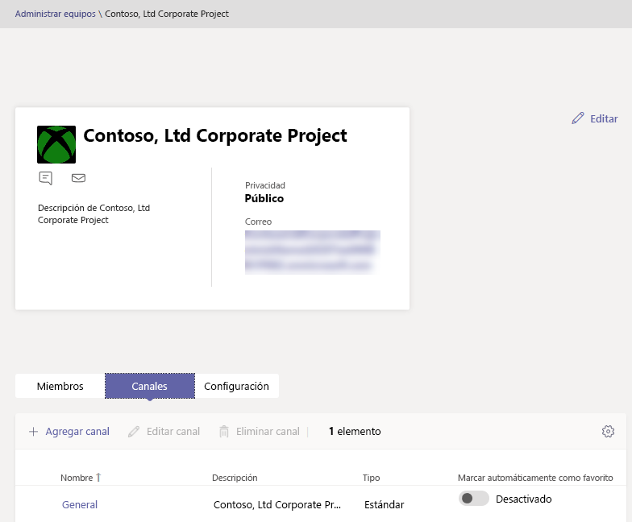

Administrar equipos en el centro de administración de Microsoft Teams
==========================================

## Información general

Este artículo proporciona una descripción general de las herramientas de administración de Teams en el centro de administración de Microsoft Teams.

Como administrador, es posible que tenga que ver o actualizar los equipos en los que la organización configuró la colaboración, o es posible que tenga que realizar acciones de corrección, como asignar propietarios a equipos sin propietario. Puede administrar los equipos que se usan en la organización a través del módulo Microsoft Teams PowerShell y el centro de administración de Microsoft Teams. Para obtener capacidades de administración completas con estos dos conjuntos de herramientas, debe asegurarse de que tiene asignada una de las siguientes funciones:

- Administrador global
- Administrador de servicios de Teams

Puede obtener más información sobre los roles de administrador en Teams en [usar los roles de administrador de Microsoft Teams para administrar equipos](using-admin-roles.md)y puede obtener más información sobre cómo usar los cmdlets de PowerShell para administrar equipos en la [Referencia del cmdlet de Microsoft Teams](https://docs.microsoft.com/powershell/teams/?view=teams-ps).

## Cuadrícula de información general de Teams

Las herramientas de administración para Teams se encuentran en el nodo **Teams** del centro de administración de Microsoft Teams. (En el centro de administración, seleccione **Teams** > **Manage Teams**). Cada equipo está respaldado por un grupo de Office 365, y este nodo proporciona una vista de los grupos que se han habilitado en Microsoft Teams.

  

La cuadrícula muestra las siguientes propiedades:

- **Nombre del equipo**
- **Canales** : un recuento de todos los canales del equipo, incluido el canal general predeterminado.
- **Miembros del equipo** : un recuento de total de usuarios, incluidos los propietarios, los invitados y los miembros de su inquilino.
- **Propietarios** : un recuento de propietarios de este equipo.
- **Invitados** : un recuento de usuarios invitados B2B de Azure Active Directory que son miembros de este equipo.
- **Privacidad** : la visibilidad/AccessType del grupo de respaldo de la oficina de 365.
- **Estado** : el estado de archivo o activo de este equipo. Obtenga más información sobre el archivado de Teams en [archivar o restaurar un equipo](https://support.office.com/article/archive-or-restore-a-team-dc161cfd-b328-440f-974b-5da5bd98b5a7).
- **Descripción** : la descripción del grupo de copia de seguridad de Office 365.
- **Clasificación** : la clasificación (si se usa en su organización) asignada al grupo de copia de seguridad de Office 365. Obtenga más información acerca de las clasificaciones en [crear clasificaciones para los grupos de Office de su organización](https://docs.microsoft.com/office365/enterprise/powershell/manage-office-365-groups-with-powershell#create-classifications-for-office-groups-in-your-organization).
- **GROUPID** : el único GROUPID del grupo de respaldo de la oficina de 365.

> [!NOTE]
> Si no ve todas estas propiedades en la cuadrícula, haga clic en el icono **Editar columnas** . En el panel **Editar columnas** , puede usar el botón de alternancia para activar o desactivar las columnas de la cuadrícula. Cuando haya terminado, haga clic en **aplicar**.

### Suma

Para agregar un nuevo equipo, haga clic en **Agregar**. En el panel **Agregar un nuevo equipo** , asigne un nombre y una descripción al equipo, establezca si desea convertirlo en un equipo público o privado, y establezca la clasificación.

### Editar

Para editar la configuración específica del grupo y del equipo, seleccione el equipo haciendo clic a la izquierda del nombre del equipo y, a continuación, seleccione **Editar**.

### Archivo

Puede archivar un equipo. El archivado de un equipo pone al equipo en modo de solo lectura dentro de Teams. Como administrador, puede archivar y archivar los equipos en nombre de su organización en el centro de administración. 

### Eliminar

Eliminar un equipo es una eliminación parcial del equipo y el grupo de Office 365 correspondiente. Para restaurar un equipo eliminado por error, siga las instrucciones de [restaurar un grupo eliminado de Office 365](https://docs.microsoft.com/office365/admin/create-groups/restore-deleted-group?view=o365-worldwide).

### Búsqueda

La búsqueda es compatible actualmente con la cadena "comienza con" y busca en el campo de **nombre de equipo** .

## Perfil de equipo

Puede ir a la página de Perfil de equipo de cualquier equipo desde la cuadrícula de información general de equipos principales haciendo clic en el nombre del equipo. La página Perfil de equipo muestra los miembros, propietarios e invitados que pertenecen al equipo (y su grupo de copia de Office 365), así como los canales y la configuración del equipo. En la página Perfil de equipo, puede:

- Agregar o quitar miembros y propietarios.
- Agregar o quitar canales (tenga en cuenta que no puede quitar el canal general).
- Cambiar la configuración del equipo y el grupo.
 

## Realizar cambios en los equipos

En la página de perfil del equipo, puede cambiar los siguientes elementos de un equipo:

- **Miembros** : agregar o quitar miembros y promover o disminuir el nivel de propietarios.
- **Canales** : agregue canales nuevos y edite o elimine canales existentes. Recuerde que no puede eliminar el canal general predeterminado.
- **Nombre del equipo**
- **Descripción**
- **Privacidad** : defina si el equipo es público o privado.
- **Clasificación** : está respaldado por las clasificaciones de grupo de Office 365. Elija **confidencial**, **muy confidencial**o **General**.
- **Configuración de conversaciones** : establezca si los miembros pueden editar y eliminar los mensajes enviados.
- **Configuración de canales** : permite establecer si los miembros pueden crear nuevos canales y editar los existentes, así como agregar, editar y quitar pestañas, conectores y aplicaciones.

Se registran los cambios que realice en un equipo. Si va a modificar la configuración de un grupo (cambiar el nombre, la descripción, la foto, la privacidad, la clasificación o los miembros del equipo), los cambios se atribuyen a través de la canalización de auditoría. Si está realizando acciones con la configuración específica de Teams, se hace un seguimiento de los cambios y se les atribuye en el canal general del equipo.

## Solución de problemas

**Problema: falta Teams en la cuadrícula de información general de equipo**

Algunos de sus equipos no están en la lista de equipos de la cuadrícula de información general de Teams.

**Causa**: este problema se produce cuando el sistema no ha sobrearchivado (o todavía no ha sido creado por el equipo), lo que puede llevar a que falte una propiedad para que lo reconozca.

**Solución: establezca manualmente la propiedad en el valor correcto a través de MS Graph.**

Reemplace **{GROUPID}** en la consulta del GROUPID real en cuestión, que puede obtener a través de Exchange Online PowerShell, con el cmdlet **"[Get-unifiedgrouphttps](https://docs.microsoft.com/powershell/module/exchange/users-and-groups/get-unifiedgroup?view=exchange-ps)"** , como el atributo "**ExternalDirectoryObjectId**".

1. [Explorador de gráficos](https://developer.microsoft.com/graph/graph-explorer)de Access.

2. Inicie sesión en el explorador de gráficos en el menú de la izquierda.

3. Cambie la línea de consulta a: PATCH > v 1.0 https://graph.microsoft.com/v1.0/groups/{groupid}>.

4. Agregue el valor siguiente en el cuerpo de la solicitud: {"resourceProvisioningOptions": ["Team"]}.

5. Ejecute la consulta en la parte superior derecha.

6. Confirme que el equipo aparece correctamente en el centro de administración de Microsoft Teams: información general del equipo.

## Más información

- [Referencia del cmdlet de Teams](https://docs.microsoft.com/powershell/teams/?view=teams-ps)  
- [Usar los roles de administrador de Teams para administrar equipos](using-admin-roles.md)
- [Plan para la administración del ciclo de vida en Teams](plan-teams-lifecycle.md)
