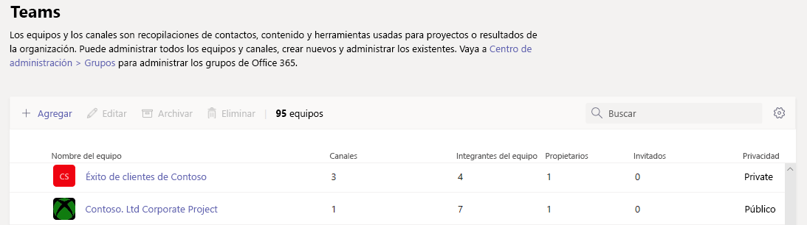

Administrar equipos en el Centro de administración de Microsoft TeamsManage teams in the Microsoft Teams admin center
==========================================

## Información generalOverview

Este artículo proporciona una descripción general de las herramientas de administración para equipos en el centro de administración de Microsoft Teams.This article provides an overview of the management tools for Teams in the Microsoft Teams admin center.

Como administrador, es posible que tenga que ver o actualizar los equipos que la organización configuró para la colaboración, o es posible que tenga que llevar a cabo acciones de corrección, como la asignación de propietarios a equipos sin propietario.As an admin, you may need to view or update the teams that your organization set up for collaboration, or you might need to perform remediation actions such as assigning owners for ownerless teams. Puede administrar los equipos que se usan en la organización tanto en el módulo de PowerShell para Microsoft Teams como en el centro de administración de Microsoft Teams.You can manage the teams used in your organization through both the Microsoft Teams PowerShell module and the Microsoft Teams admin center. Puede obtener acceso al centro de administración en <a href="https://go.microsoft.com/fwlink/p/?linkid=2024339" target="_blank">https://admin.microsoft.com</a> .You can access the admin center at <a href="https://go.microsoft.com/fwlink/p/?linkid=2024339" target="_blank">https://admin.microsoft.com</a>. Para obtener todas las funciones de administración con estos dos conjuntos de herramientas, debe asegurarse de que tiene asignado uno de los roles siguientes:For full administration capabilities using these two toolsets, you should make sure that you are assigned one of the following roles:

- Administrador globalGlobal Administrator
- Administrador de servicios de TeamsTeams Service Administrator

Puede obtener más información acerca de los roles de administrador en Teams en [Usar los roles de administrador de Microsoft Teams para administrar equipos](using-admin-roles.md) y puede ver más sobre cómo usar los cmdlets de PowerShell para administrar equipos en la [referencia de cmdlets de Microsoft Teams](https://docs.microsoft.com/powershell/teams/?view=teams-ps).You can learn more about admin roles in Teams in [Use Microsoft Teams admin roles to manage Teams](using-admin-roles.md), and you can read more about how to use the PowerShell cmdlets for managing teams in the [Microsoft Teams cmdlet reference](https://docs.microsoft.com/powershell/teams/?view=teams-ps).

## Información general de equiposTeams overview grid

Las herramientas de administración para equipos se encuentran en el nodo **Equipos** en el centro de administración de Microsoft Teams.Management tools for teams are under the **Teams** node in the Microsoft Teams admin center. (En el centro de administración, seleccione **Teams**  >  **Administrar equipos**). Cada equipo está respaldado por un grupo de Microsoft 365 y este nodo proporciona una vista de los grupos que se han habilitado en Microsoft Teams en su organización.(In the admin center, select **Teams** > **Manage teams**.) Each team is backed by a Microsoft 365 Group, and this node provides a view of groups that have been Microsoft Teams-enabled in your organization.

  

La cuadrícula muestra las siguientes propiedades:The grid displays the following properties:

- **Nombre del equipo****Team name**
- **Canales**: es el número de todos los canales del equipo, incluido el canal General predeterminado.**Channels** - a count of all channels in the team, including the default General channel.
- **Miembros del equipo**: un recuento de los usuarios totales, incluidos los propietarios, los invitados y los miembros de su espacio empresarial.**Team members** - a count of total users, including owners, guests, and members from your tenant.
- **Propietarios**: un recuento de propietarios de este equipo.**Owners** - a count of owners for this team.
- **Invitados**: recuento de usuarios invitados de B2B de Azure Active Directory que son miembros de este equipo.**Guests** - a count of Azure Active Directory B2B guest users who are members of this team.
- **Privacidad** : visibilidad/AccessType del grupo de apoyo de Microsoft 365.**Privacy** - the Visibility/AccessType of the backing Microsoft 365 group.
- **Estado**: el estado Archivado o Activo de este equipo.**Status** - the Archived or Active status for this team. Obtenga más información sobre archivar equipos en [Archivar o restaurar un equipo](https://support.office.com/article/archive-or-restore-a-team-dc161cfd-b328-440f-974b-5da5bd98b5a7).Learn more about archiving teams in [Archive or restore a team](https://support.office.com/article/archive-or-restore-a-team-dc161cfd-b328-440f-974b-5da5bd98b5a7).
- **Descripción** : la descripción del grupo Microsoft 365 de respaldo.**Description** - the description of the backing Microsoft 365 group.
- **Clasificación** : la clasificación (si se usa en su organización) asignada al grupo de apoyo de Microsoft 365.**Classification** - the classification (if used in your organization) assigned to the backing Microsoft 365 group. Obtenga más información sobre las clasificaciones en [Crear clasificaciones para los grupos de Office de su organización](https://docs.microsoft.com/office365/enterprise/powershell/manage-office-365-groups-with-powershell#create-classifications-for-office-groups-in-your-organization).Learn more about classifications at [Create classifications for Office groups in your organization](https://docs.microsoft.com/office365/enterprise/powershell/manage-office-365-groups-with-powershell#create-classifications-for-office-groups-in-your-organization).
- **GROUPID** : el único GROUPID del grupo Microsoft 365 de respaldo.**GroupID** - the unique GroupID of the backing Microsoft 365 group.

> [!NOTE]
> Si no ve todas estas propiedades en la cuadrícula, haga clic en el icono **Editar columnas**.If you don't see all these properties in the grid, click the **Edit columns** icon. En el panel **Editar columnas**, puede usar el botón de alternancia para activar o desactivar columnas en la cuadrícula.In the **Edit columns** pane, you can use the toggles to turn on or turn off columns in the grid. Cuando haya terminado, haga clic en **Aplicar**.When you're finished, click **Apply**.

### AgregarAdd

Para agregar un nuevo equipo, haga clic en **Agregar**.To add a new team, click **Add**. En el panel **Agregar un nuevo equipo**, otorgue un nombre y una descripción al equipo, indique si quiere convertirlo en un equipo público o privado y establezca la clasificación.In the **Add a new team** pane, give the team a name and description, set whether you want to make it a private or public team, and set the classification.

### Editar Edit

Para editar configuraciones específicas de grupo y de equipo, seleccione el equipo haciendo clic a la izquierda del nombre de equipo y seleccione **Editar**.To edit group and team-specific settings, select the team by clicking to the left of the team name, and then select **Edit**.

### ArchivarArchive

Puede archivar un equipo.You can archive a team. El archivado de un equipo convierte el equipo en modo de solo lectura en Teams.Archiving a team puts the team into read-only mode within Teams. Como administrador, puede archivar y desarchivar equipos en nombre de su organización en el centro de administración.As an admin, you can archive and un-archive teams on behalf of your organization in the admin center. 

### EliminarDelete

Eliminar un equipo es una eliminación parcial del equipo y del grupo de Microsoft 365 correspondiente.Deleting a team is a soft-delete of the team and corresponding Microsoft 365 group. Para restaurar un equipo eliminado por error, siga las instrucciones de [restaurar un grupo eliminado](https://docs.microsoft.com/microsoft-365/admin/create-groups/restore-deleted-group).To restore a mistakenly deleted team, follow the instructions in [Restore a deleted Group](https://docs.microsoft.com/microsoft-365/admin/create-groups/restore-deleted-group).

### Buscar Search

La búsqueda admite la cadena "Empieza por" y busca en el campo **Nombre del grupo**.Search currently supports the string "Begins with" and searches the **Team name** field.

## Perfil de equipoTeam profile

Puede ir a la página de perfil de equipo de cualquier equipo desde la cuadrícula principal de información general de equipos al hacer clic en el nombre del equipo.You can navigate to the team profile page of any team from the main teams overview grid by clicking  the team name. En la página Perfil de equipo se muestran los miembros, los propietarios y los invitados que pertenecen al equipo (y su grupo de respaldo de Microsoft 365), así como los canales y la configuración del equipo.The team profile page shows the members, owners, and guests that belong to the team (and its backing Microsoft 365 group), as well as the team's channels and settings. En la página de perfil de equipo, puede:From the team profile page, you can:

- Agregar o quitar miembros y propietarios.Add or remove members and owners.
- Agregar o quitar canales (tenga en cuenta que no se puede quitar el canal General).Add or remove channels (note that you can't remove the General channel).
- Cambiar la configuración de grupo y equipo.Change team and group settings.
 

## Realizar cambios en los equiposMaking changes to teams

En la página de perfil del equipo, puede cambiar los siguientes elementos de un equipo:On the team's profile page, you can change the following elements of a team:

- **Miembros**: agregue o elimine miembros y aumente o disminuya el nivel de los propietarios.**Members** - add or remove members and promote or demote owners.
- **Canales**: agregue nuevos canales, y edite o elimine canales existentes.**Channels** - add new channels, and edit or remove existing channels. Recuerde que no puede eliminar el canal General predeterminado.Remember that you can't delete the default General channel.
- **Nombre del equipo****Team name**
- **Descripción****Description**
- **Privacidad**: establezca si el equipo es público o privado.**Privacy** - set whether the team is public or private.
- **Clasificación** : está respaldado por las clasificaciones de grupo de Microsoft 365.**Classification** - this is backed by your Microsoft 365 group classifications. Elija **Confidencial**, **Extremadamente confidencial** o **General**.Choose **Confidential**, **Highly Confidential**, or **General**.
- **Configuración de conversaciones**: establezca si los miembros pueden editar y eliminar los mensajes enviados.**Conversations settings** - set whether members can edit and delete sent messages.
- **Configuración de canales**: establezca si los miembros pueden crear nuevos canales y editar los existentes, y agregar, editar y quitar fichas, conectores y aplicaciones.**Channels settings** - set whether members can create new channels and edit existing ones, and add, edit, and remove tabs, connectors, and apps.

Los cambios realizados en un equipo se registran.The changes that you make to a team are logged. Si va a modificar la configuración de un grupo (cambiar el nombre, la descripción, la foto, la privacidad, la clasificación o los miembros del equipo), los cambios se le atribuyen en la canalización de auditoría.If you're modifying group settings (changing the name, description, photo, privacy, classification, or team members), the changes are attributed to you through the audit pipeline. Si lleva a cabo acciones en configuraciones específicas de Teams, se realiza un seguimiento de los cambios y se le atribuyen en el canal General del equipo.If you're performing actions against Teams-specific settings, your changes are tracked and attributed to you in the General channel of the team.

## Solución de problemasTroubleshooting

**Problema: faltan equipos en la cuadrícula de información general de equipo****Issue: Teams missing from the Team overview grid**

Algunos de los equipos no están en la lista de equipos de la cuadrícula información general de equipos.Some of your teams are missing from the list of teams in the Teams overview grid.

**Causa**: este problema se produce cuando el sistema ha creado el perfil del equipo de forma incorrecta (o aún no se ha completado), lo que puede provocar que falte alguna propiedad para que se reconozca.**Cause**: This issue occurs when the team was incorrectly (or not yet) profiled by the system which can lead to a missing property for it to be recognized.

**Resolución: configure manualmente la propiedad en el valor correcto mediante MS Graph****Resolution: Manually set the property to the correct value via MS Graph**

Reemplace **{groupid}** en la consulta para el GroupId real en cuestión, que puede obtener mediante el PowerShell de Exchange Online con el cmdlet **"[Get-UnifiedGroup](https://docs.microsoft.com/powershell/module/exchange/users-and-groups/get-unifiedgroup?view=exchange-ps)"**, como el atributo "**ExternalDirectoryObjectId**".Replace **{groupid}** in the Query for the actual GroupId in question, which you can get via the Exchange Online powershell, with the **"[Get-UnifiedGroup](https://docs.microsoft.com/powershell/module/exchange/users-and-groups/get-unifiedgroup?view=exchange-ps)"** cmdlet, as the "**ExternalDirectoryObjectId**" attribute.

1. Acceder a [Probador de Graph](https://developer.microsoft.com/graph/graph-explorer).Access [Graph Explorer](https://developer.microsoft.com/graph/graph-explorer).

2. Inicie sesión en el Probador de Graph en el menú de la izquierda.Sign in to Graph Explorer on the left menu.

3. Cambie la línea de consulta a: PATCH > v1.0 > https://graph.microsoft.com/v1.0/groups/{groupid}.Change the query line to: PATCH > v1.0 > https://graph.microsoft.com/v1.0/groups/{groupid}.

4. Agregue el siguiente valor en el cuerpo de la solicitud: {"resourceProvisioningOptions": ["Team"]}.Add the following value on the request body: {"resourceProvisioningOptions": ["Team"]}.

5. Ejecute la consulta en la parte superior derecha.Run the query on the top-right.

6. Confirme que el equipo se muestra correctamente en el centro de administración de Microsoft Teams: información general de equipo.Confirm the team appears correctly in the Microsoft Teams admin center - Team Overview.

## Más informaciónLearn more

- [Referencia de cmdlet para TeamsTeams cmdlet reference](https://docs.microsoft.com/powershell/teams/?view=teams-ps)  
- [Usar roles de administrador de Teams para administrar equiposUse Teams administrator roles to manage Teams](using-admin-roles.md)
- [Plan para la administración del ciclo de vida en TeamsPlan for lifecycle management in Teams](plan-teams-lifecycle.md)
