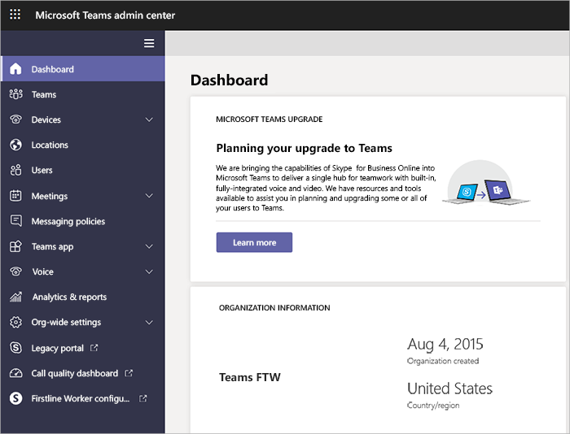

Administrar Teams durante la transición al nuevo Centro de administración de Microsoft Teams
======================================================

> [!IMPORTANT]
> [!INCLUDE [new-teams-sfb-admin-center-notice](includes/new-teams-sfb-admin-center-notice.md)]

## ¿Qué es el nuevo centro de administración de Microsoft Teams?  

La nueva experiencia del centro de administración le proporcionará una experiencia unificada para administrar tanto los equipos como Skype empresarial. Ofrecemos funciones adicionales, información completa y la capacidad de administrar la configuración de Teams en un nivel de usuario.

## Configuración migrada al nuevo centro de administración de Microsoft Teams

La siguiente tabla identifica las secciones de la experiencia de teams que se han migrado y muestra la relación entre la configuración actual y las directivas del nuevo portal de administración.

|Sección de Teams en el centro de administración de Microsoft 365  |Nombre de configuración (nivel de inquilino)  |Directiva del centro de administración de Microsoft Teams   |Nivel: inquilino o usuario   |
|---------|---------|---------|---------|
|General     |Mostrar organigrama en el perfil personal        |  [TeamsClientConfiguration](https://docs.microsoft.com/powershell/module/skype/set-csteamsclientconfiguration?view=skype-ps)       |  Espacios       |
|General     |Usar Skype empresarial para los destinatarios que no tienen equipos         |[TeamsClientConfiguration](https://docs.microsoft.com/powershell/module/skype/set-csteamsclientconfiguration?view=skype-ps)         |Espacios         |
|Integración de correo electrónico     |Permitir que los usuarios envíen correos electrónicos a los canales         |[TeamsClientConfiguration](https://docs.microsoft.com/powershell/module/skype/set-csteamsclientconfiguration?view=skype-ps)         |Espacios         |
|Integración de correo electrónico     |Lista de remitentes permitidos         |[TeamsClientConfiguration](https://docs.microsoft.com/powershell/module/skype/set-csteamsclientconfiguration?view=skype-ps)        |Espacios         |
|Almacenamiento en nube personalizado     |Rectángulo         |[TeamsClientConfiguration](https://docs.microsoft.com/powershell/module/skype/set-csteamsclientconfiguration?view=skype-ps)         |Espacios         |
|Almacenamiento en nube personalizado     |FTP        |[TeamsClientConfiguration](https://docs.microsoft.com/powershell/module/skype/set-csteamsclientconfiguration?view=skype-ps)         |Espacios         |
|Almacenamiento en nube personalizado     |Egnyte         |[TeamsClientConfiguration](https://docs.microsoft.com/powershell/module/skype/set-csteamsclientconfiguration?view=skype-ps)         |Espacios         |
|Almacenamiento en nube personalizado     |Google Drive        |[TeamsClientConfiguration](https://docs.microsoft.com/powershell/module/skype/set-csteamsclientconfiguration?view=skype-ps)         |Espacios         |
|Almacenamiento en nube personalizado     |ShareFile        |[TeamsClientConfiguration](https://docs.microsoft.com/powershell/module/skype/set-csteamsclientconfiguration?view=skype-ps)         |Espacios         |
|Configuración por usuario o tipo de licencia     |Activar o desactivar Microsoft Teams para todos los usuarios          |Obsoleto1        |         |
|Equipos y canales     |         |Redirige a la administración de grupos de Azure Active Directory (igual que la experiencia actual).              |Usuario         |
|Equipos y canales     |         |Redirige a la administración de grupos de AAD (igual que la experiencia actual).             |Usuario          |
|Aplicaciones|Habilitar nuevas aplicaciones externas de manera predeterminada|Configuración de la aplicación en toda la organización|Espacios|
|Aplicaciones|Permitir aplicaciones externas|Configuración de la aplicación en toda la organización|Espacios|
|Aplicaciones|Permitir la transferencia local de aplicaciones externas2|[TeamsAppSetupPolicy](https://docs.microsoft.com/powershell/module/skype/set-csteamsappsetuppolicy?view=skype-ps)|Usuario|
|Aplicaciones|Aplicaciones predeterminadas3|TeamsAppPermissionPolicy|Usuario|
|Aplicaciones|Aplicaciones externas3|TeamsAppPermissionPolicy|Usuario|
|Llamadas y reuniones     |Permitir la programación de reuniones privadas         |[TeamsMeetingPolicy](https://docs.microsoft.com/powershell/module/skype/set-csteamsmeetingpolicy?view=skype-ps)         |Usuario          |
|Llamadas y reuniones     |Permitir Meetup de canal ad hoc         |[TeamsMeetingPolicy](https://docs.microsoft.com/powershell/module/skype/set-csteamsmeetingpolicy?view=skype-ps)         |Usuario          |
|Llamadas y reuniones     |Permitir la programación de reuniones de canal         |[TeamsMeetingPolicy](https://docs.microsoft.com/powershell/module/skype/set-csteamsmeetingpolicy?view=skype-ps)         |Usuario          |
|Llamadas y reuniones     |Permitir vídeos en reuniones         |[TeamsMeetingPolicy](https://docs.microsoft.com/powershell/module/skype/set-csteamsmeetingpolicy?view=skype-ps)         |Usuario          |
|Llamadas y reuniones     |Permitir la pantalla compartida en reuniones         |[TeamsMeetingPolicy](https://docs.microsoft.com/powershell/module/skype/set-csteamsmeetingpolicy?view=skype-ps)         |Usuario          |
|Llamadas y reuniones     |Permitir llamadas privadas         |[TeamsCallingPolicy](https://docs.microsoft.com/powershell/module/skype/set-csteamscallingpolicy?view=skype-ps)        |Usuario          |
|Mensajería      |Habilitar Giphy para que los usuarios puedan agregar GIF a las conversaciones         |[TeamsMessagingPolicy](https://docs.microsoft.com/powershell/module/skype/set-csteamsmessagingpolicy?view=skype-ps)         |Usuario         |
|Mensajería      |Clasificación de contenido         |[TeamsMessagingPolicy](https://docs.microsoft.com/powershell/module/skype/set-csteamsmessagingpolicy?view=skype-ps)         |Usuario         |
|Mensajería      |Habilitar los memes que los usuarios pueden editar y agregar a las conversaciones         |[TeamsMessagingPolicy](https://docs.microsoft.com/powershell/module/skype/set-csteamsmessagingpolicy?view=skype-ps)         |Usuario         |
|Mensajería      |Habilitar adhesivos que los usuarios pueden editar y agregar a conversaciones         |[TeamsMessagingPolicy](https://docs.microsoft.com/powershell/module/skype/set-csteamsmessagingpolicy?view=skype-ps)         |Usuario         |
|Mensajería      |Permitir que los propietarios eliminen todos los mensajes         |[TeamsMessagingPolicy](https://docs.microsoft.com/powershell/module/skype/set-csteamsmessagingpolicy?view=skype-ps)         |Usuario         |
|Mensajería      |Permitir que los usuarios editen sus propios mensajes         |[TeamsMessagingPolicy](https://docs.microsoft.com/powershell/module/skype/set-csteamsmessagingpolicy?view=skype-ps)         |Usuario         |
|Mensajería      |Permitir que los usuarios eliminen sus propios mensajes         |[TeamsMessagingPolicy](https://docs.microsoft.com/powershell/module/skype/set-csteamsmessagingpolicy?view=skype-ps)         |Usuario         |
|Mensajería      |Permite que los usuarios puedan chatear de forma privada         |[TeamsMessagingPolicy](https://docs.microsoft.com/powershell/module/skype/set-csteamsmessagingpolicy?view=skype-ps)         |Usuario         |

1 desusado para invitados. Habilitar o deshabilitar invitado ahora se puede administrar en el centro de administración de Microsoft Teams. La habilitación o deshabilitación de Teams para empresas, los estudiantes de edu y los profesores de edu estarán obsoletas próximamente. Esto debe administrarse mediante la asignación de licencias en el centro de administración de Microsoft 365. Consulte [administrar el acceso de usuarios a Microsoft Teams](user-access.md).
  
2 la transferencia local se divide de la siguiente manera:

- Permitir a un usuario transferir aplicaciones que se pueden administrar a nivel de usuario en [TeamsAppSetupPolicy](https://docs.microsoft.com/powershell/module/skype/set-csteamsappsetuppolicy?view=skype-ps).
- Permita que los usuarios de un inquilino interactúen con aplicaciones personalizadas que se pueden administrar en el nivel de inquilino en la configuración de la aplicación de toda la organización.
 
3 las aplicaciones predeterminadas y las aplicaciones externas se pueden habilitar y deshabilitar en el nivel de usuario en TeamsAppPermissionPolicy. Además, las aplicaciones se pueden bloquear en el nivel de espacio empresarial en la configuración de la aplicación de toda la organización, que reemplaza cualquier configuración de usuario y de nivel de inquilino. 

> [!NOTE]
> Continuará usando el panel grupos en el centro de administración de Microsoft 365 para la configuración relacionada con equipos y canales. La configuración de las aplicaciones permanecerá en el área de equipos del centro de administración de Microsoft 365 y se migrará más tarde. 

## Administrar la configuración durante la migración

Puede continuar modificando la configuración en el centro de administración de Microsoft 365 y en el centro de administración de Skype empresarial hasta que se complete la migración de una sección para su inquilino. 

En la tabla siguiente se muestra dónde puede administrar características durante la migración.

|Característica  |Centro de administración de Microsoft Teams                      |Centro de administración de Skype empresarial (heredado)  |Centro de administración de Microsoft 365  |
|---------|:---------:|:---------:|:---------:|
|Directivas de mensajería, reuniones y eventos en directo de Teams     |     X    |         |         |
|Directiva de actualización de Teams     |    X     |         |         |
|Configuración de invitado para mensajería, reuniones y voz     |   X      |         |         |
|Administración del ciclo de vida de Teams   |    X    |      |       |
|Configuración de Teams   |    X    |      |       |
|Configuración de acceso externo     |    X    |      |       |
|Administración de usuarios    |         |         |    X     |    
|Audioconferencia     |    X     |    X     |         |
|Planes de llamada     |    X    |    X     |         |
|Sistema telefónico    |    X    |     X    |         |
|Administración de números de teléfono     |    X    |   X      |         |
|Licencias para características de voz en la nube     |         |         |    X     |
|Operadores automáticos     |    X    |          |         |
|Colas de llamadas     |    X    |          |         |

## Administrar la configuración después de la migración

Cuando haya finalizado la migración de esta configuración, la deshabilitaremos en el centro de administración de Office 365 y en el centro de administración de Skype empresarial, y se podrán administrar en el nuevo centro de administración de Microsoft Teams.
