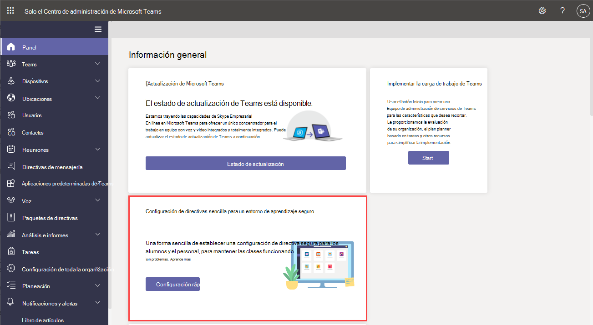

# Administrar Teams con directivasManage Teams with policies

Las directivas son una parte importante de la administración de Teams.Policies are an important part of managing Teams. Use este artículo para navegar por cómo usar directivas para beneficiar a su organización.Use this article to navigate how to use policies to benefit your organization.

## Para qué usa las directivasWhat you use policies for

Las directivas se usan para realizar muchas tareas de su organización en diferentes áreas, como mensajería, reuniones y aplicaciones.Policies are used to accomplish many tasks in your organization across different areas such as messaging, meetings, and applications. Algunas de las cosas que puede hacer incluyen permitir a los usuarios programar reuniones en un canal de teams, permitir a los usuarios editar mensajes enviados y controlar si los usuarios pueden anclar aplicaciones a la barra de aplicaciones de Teams.Some of the things you can do include allowing users to schedule meetings in a teams channel, enabling users to edit sent messages, and controlling whether users can pin apps to the Teams app bar.

## Cómo asignar directivasHow to assign policies

Las directivas se pueden asignar de varias maneras diferentes en función de lo que su organización esté intentando lograr.Policies can be assigned in several different ways depending on what your organization is trying to accomplish. Puede realizar y ver tareas en el Centro de administración de Teams.You can make and view assignments in the Teams admin center.

Obtenga más información sobre cómo asignar directivas [aquí.](policy-assignment-overview.md)Learn more about assigning policies [here](policy-assignment-overview.md).

## Cómo administrar directivasHow to manage policies

Las directivas se administran con el Centro de administración de Microsoft Teams o [con PowerShell.](./teams-powershell-managing-teams.md#manage-policies-via-powershell)Policies are managed with the Microsoft Teams admin center or [using PowerShell](./teams-powershell-managing-teams.md#manage-policies-via-powershell).

Por ejemplo, una directiva de configuración de aplicaciones puede permitirle a los usuarios cargar aplicaciones personalizadas, instalar aplicaciones en nombre de los usuarios y anclar aplicaciones a la barra de aplicaciones de Teams.For example, an app setup policy can allow you to enable users to upload custom apps, install apps on behalf of your users, and pin apps to the Teams app bar. Estas directivas se configuran en el Centro de administración de Teams.These policies are configured in the Teams admin center.

Además, se puede usar una directiva de reunión para controlar la configuración de audio y vídeo en reuniones de Teams, como transcripciones, grabaciones en la nube y audio/vídeo IP.Additionally, a meeting policy can be used to control audio and video settings in Teams meetings such as transcriptions, cloud recordings, and IP audio/video.

### Teams para el ámbito educativoTeams for Education

También puede usar el Asistente para directivas [de Teams para](easy-policy-setup-edu.md) educación para configurar y administrar fácilmente directivas para su entorno de aprendizaje.You can also use the [Teams for Education policy wizard](easy-policy-setup-edu.md) to easily set up and manage policies for your learning environment.

## Tipos de directivasTypes of policies

Las siguientes directivas se pueden administrar con Microsoft Teams.The following policies can be managed with Microsoft Teams.

Tipo de directivaPolicy type | DescripciónDescription
------------|------------
[Paquetes de directivasPolicy packages](manage-policy-packages.md) | Un paquete de directivas en Microsoft Teams es una colección de directivas y configuraciones predefinidas que puede asignar a usuarios que tienen roles similares en su organización.A policy package in Microsoft Teams is a collection of predefined policies and settings you can assign to users who have similar roles in your organization.
[Directivas de reuniónMeeting policies](meeting-policies-in-teams.md) | Una directiva de reunión se usa para controlar las características que están disponibles para los participantes de la reunión para las reuniones programadas por los usuarios de su organización.A meeting policy is used to control the features that are available to meeting participants for meetings scheduled by users in your organization. Las directivas de reunión incluyen los temas siguientes.Meeting policies include the following topics.  - Directivas de audio y vídeo- Audio and video policies  - Directivas de uso compartido de pantalla y contenido- Content and screen sharing policies  - Participantes, invitados y directivas de acceso- Participants, guests, and access policies  - Directivas generales- General policies
[Directivas de voz y llamadasVoice and calling policies](voice-and-calling-policies.md)| Las directivas de llamadas y llamadas administran esta configuración a través de equipos como llamadas de emergencia, enrutamiento de llamadas e id. de llamada.Voice and calling policies manage these settings through teams such as emergency calling, call routing, and caller ID.
[Directivas de aplicacionesApp policies](app-policies.md)| Las directivas de aplicación se usan para controlar las aplicaciones en Microsoft Teams.App policies are used to control applications in Microsoft Teams. Los administradores pueden permitir o bloquear las aplicaciones que los usuarios pueden instalar, anclar aplicaciones a la barra de aplicaciones de Teams de un usuario e instalar la aplicación en nombre de los usuarios.Admins can allow or block which apps users can install, pin applications to a user's Teams app bar, and install application on behalf of your users.
[Directivas de mensajeríaMessaging policies](messaging-policies-in-teams.md)| Las directivas de mensajería controlan la disponibilidad de las características de chat y canal.Messaging policies control chat and channel feature availability.

## Temas relacionadosRelated topics

* [Asignar directivas en Teams: introducciónAssign policies in Teams - getting started](policy-assignment-overview.md)
* [Administrar directivas de comentarios en Microsoft TeamsManage feedback policies in Microsoft Teams](manage-feedback-policies-in-teams.md)
* [Administrar directivas de equipos en Microsoft TeamsManage teams policies in Microsoft Teams](teams-policies.md)
* [Definir eventos en directo en Microsoft TeamsSet up for live events in Microsoft Teams](teams-live-events/set-up-for-teams-live-events.md)
* [Directivas y paquetes de directivas de Teams for EducationTeams for Education policies and policy packages](policy-packages-edu.md)