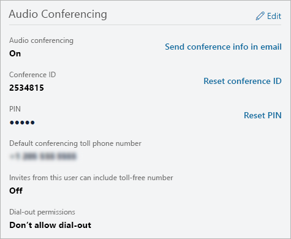

# Administrar la configuración de Audioconferencia para un usuario en Microsoft Teams

Como administrador de Microsoft 365 u Office 365, puede editar la configuración de Audioconferencia (como el proveedor, el número de pago o gratuito predeterminado, el id. de conferencia o el PIN) de un usuario individual de su organización. Si desea editar la configuración de su organización, consulte Administrar la configuración de [Audioconferencia para su organización.](manage-the-audio-conferencing-settings-for-my-organization-in-teams.md)

##  Usar el centro de administración de Microsoft Teams

1. En el panel de navegación izquierdo, haga **clic en Usuarios** y, a continuación, seleccione el usuario en la lista de usuarios disponibles.

2. Haga clic **en Editar.**

3. En **Audioconferencia,** modifique cualquiera de las siguientes opciones:

|**Setting**|**Descripción**|
|:-----|:-----|
|**Audioconferencia**|Para activar o desactivar la audioconferencia  para el usuario, haga clic en Editar junto a  **Audioconferencia** y, a continuación, en el panel **Audioconferencia,** active o desactive la Audioconferencia.|
|**Enviar información de conferencia por correo electrónico**  |Haga clic en este vínculo solo si desea enviar inmediatamente un correo electrónico al usuario con su número de teléfono e Id. de conferencia. (Este correo electrónico no incluye el PIN). Vea [Enviar un correo electrónico a un usuario con su información de Audioconferencia](send-an-email-to-a-user-with-their-dial-in-information-in-teams.md).  |
|**Id. de conferencia**  |Haga **clic en Restablecer id.** de conferencia si necesita restablecer el id. de conferencia para el usuario. Para obtener más información, consulte [Restablecer un Id. de conferencia para un usuario](reset-a-conference-id-for-a-user-in-teams.md).  |
|**PIN** |Haga **clic en Restablecer PIN** si necesita restablecer el PIN del usuario. Para obtener más información, vea [Restablecer el PIN de Audioconferencia](reset-the-audio-conferencing-pin-in-teams.md). |
|**Número de teléfono de pago** de conferencia predeterminado (obligatorio) |Estos serán los números que estén establecidos en el puente de audioconferencia. Haga que los números aparezcan en las solicitudes de reunión de Skype Empresarial y Microsoft Teams. Para cambiar el número  de pago predeterminado, haga clic en Editar junto a **Audioconferencia** y, en el panel Audioconferencia, seleccione un número en **Número de pago.**  |
|**Las invitaciones de este usuario pueden incluir un número gratuito**|Para cambiar esta  configuración, haga clic en Editar junto a **Audioconferencia** y, en el panel **Audioconferencia,** active o desactive Incluir números gratuitos en las solicitudes de reunión de este usuario.  |
|**Los usuarios no autenticados pueden ser la primera persona en la reunión**|Para cambiar esta configuración, active o desactive a los usuarios no autenticados como la primera **persona de** la reunión.
|**Permisos de acceso telefónico**|Para cambiar esta  configuración, haga clic en Editar junto a **Audioconferencia** y, en el panel **Audioconferencia,** elija una opción en Llamada desde las **reuniones.**|

 

> [!Note]
> [!INCLUDE [updating-admin-interfaces](includes/updating-admin-interfaces.md)]

## Temas relacionados

[Administrar la configuración de Audioconferencia para su organización](manage-the-audio-conferencing-settings-for-my-organization-in-teams.md)

[Preguntas comunes sobre Audioconferencia](audio-conferencing-common-questions.md)
