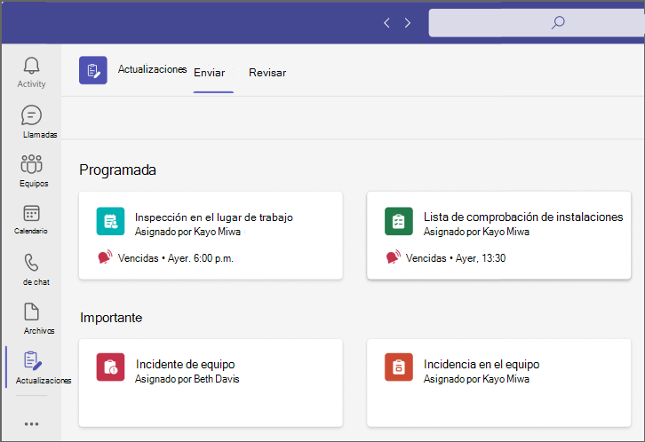
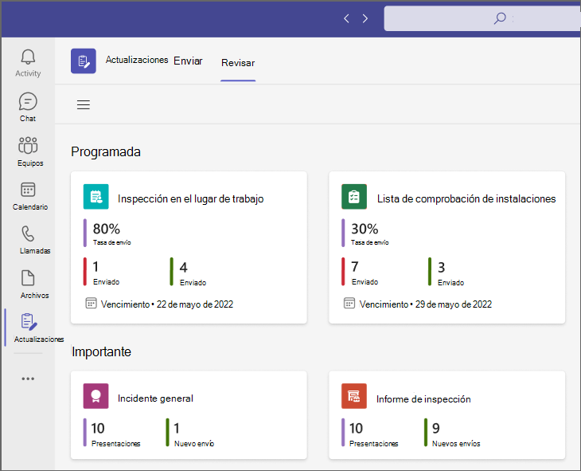
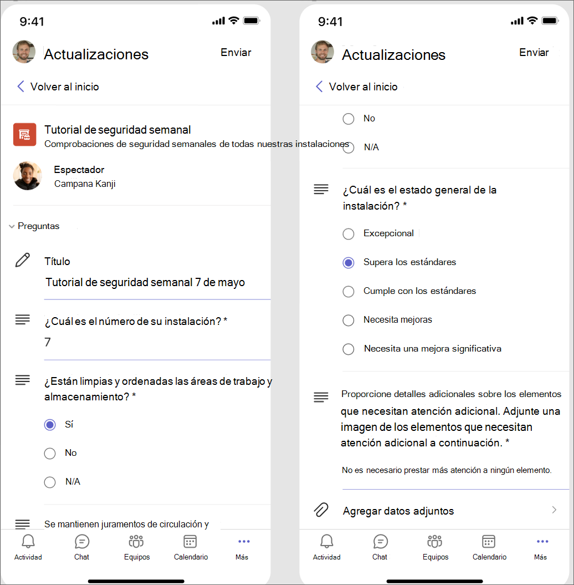
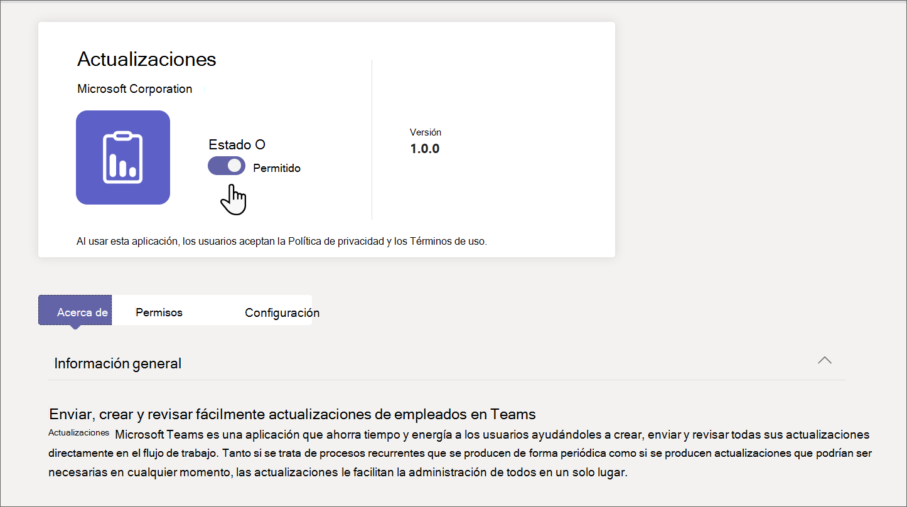

# Administrar la aplicación Actualizaciones de su organización en Microsoft Teams

## ¿Qué es la aplicación Actualizaciones?

Las actualizaciones de Microsoft Teams aplicación proporcionan un lugar centralizado para que los miembros de su organización creen, revisen y envíen actualizaciones. Al crear plantillas, puede usar la aplicación Actualizaciones para realizar un seguimiento de todo lo que necesita su organización. Las actualizaciones están disponibles tanto para equipos de escritorio como para móviles.

En Teams, los usuarios pueden obtener actualizaciones en la tienda de aplicaciones de Teams. Verán todas las actualizaciones que deben enviar en la página **Enviar** .

Los usuarios pueden ver las actualizaciones que han asignado en la página **Revisar** .

Cuando se asigna una actualización a un usuario, se muestra en su fuente de actividades de Teams. Los usuarios también pueden ver todas sus solicitudes de actualización actuales y envíos anteriores en la aplicación Actualizaciones. Además, cualquier persona puede crear plantillas y enviar solicitudes de actualización.

Las actualizaciones se suministran con plantillas predefinidas para escenarios empresariales comunes y la opción de crear su propia plantilla. Cualquier persona puede crear una plantilla para nuevos tipos de actualizaciones.

## Ejemplo ficticio

Los empleados de una tienda de ropa son responsables de abrir y cerrar la tienda todos los días. Todas las mañanas, el coordinador del turno rellena la actualización de apertura de store, que es una plantilla predefinida en la aplicación Actualizaciones. En esta actualización, describen cualquier problema con el cierre de la noche anterior, responden preguntas sobre la limpieza de la tienda e informan de los suministros que necesitan reposición. Enviar una actualización les permite comunicar sus necesidades para store y cualquier problema de forma rápida y eficaz. Las actualizaciones diarias también ofrecen a los asociados de la tienda la oportunidad de resaltar lo que va bien.

En las instalaciones de fabricación de la tienda, los empleados realizan comprobaciones de seguridad con actualizaciones con dispositivos móviles.

Mientras tanto, un equipo de trabajadores remotos está actualizando el sitio web de la tienda. Están distribuidas en distintas zonas horarias, por lo que las reuniones de pie diarias no son prácticas. En su lugar, cada uno de los miembros del equipo envía al líder del equipo informes diarios de actualizaciones sobre su progreso.

[Descarga el libro de búsqueda Actualizaciones](https://go.microsoft.com/fwlink/?linkid=2197649&clcid=0x409) para ver más ejemplos de lo que puedes hacer con las actualizaciones.

## Permisos y licencias necesarios

Necesita permiso para que los siguientes elementos implementen actualizaciones:

- Permisos para crear una base de datos de Microsoft Dataverse.

- Una cuenta en [powerautomate.microsoft.com](https://powerautomate.microsoft.com/).

- Rol de administrador en el entorno de destino.

- Licencia de Power Automate, Office 365 o Dynamics 365.

- Se requiere licencia para Microsoft Forms para que los usuarios configuren nuevas plantillas.

## Storage con Microsoft Dataverse

El modelo de datos común (CDM) es el lenguaje de datos compartido que usan las aplicaciones empresariales y analíticas en Microsoft Dataverse. Se compone de un conjunto de esquemas de datos estandarizados y extensibles publicados por Microsoft y nuestros asociados que permite la coherencia de los datos y su significado en las aplicaciones y los procesos empresariales. Obtenga más información sobre el [modelo de datos común](/common-data-model/).

Las actualizaciones que se crean a partir de una plantilla siguen almacenando datos en Microsoft Dataverse, como su título, detalles, id. de plantilla y mucho más. Obtenga más información sobre  [Almacenamiento de datos para Microsoft Forms](https://support.microsoft.com/office/data-storage-for-microsoft-forms-97a34e2e-98e1-4dc2-b6b4-7a8444cb1dc3#:~:text=Where%20data%20is%20stored%20for%20Microsoft%20Forms.%20Microsoft,European-based%20tenants%20is%20stored%20on%20servers%20in%20Europe).

>[!Note]
>Si elimina la plantilla de formulario en el sitio Microsoft Forms, se romperá la plantilla Actualizaciones y los usuarios no podrán enviar la actualización. Los usuarios reciben el error "CDB TableNotFound" al intentar abrir una plantilla que se ha eliminado en Microsoft Forms.

## Actualizaciones Teams permisos de aplicaciones

La aplicación Actualizaciones Teams te permite acceder a las siguientes características:

- Recibir los mensajes y los datos que usted solicite.

- Envío de mensajes y notificaciones.

- Mostar cuadros de diálogo y aplicaciones personales sin un encabezado proporcionado por Teams.

- Obtenga acceso a la información del perfil, como su nombre, dirección de correo electrónico, nombre de la empresa e idioma de preferencia.

- Recibir mensajes y datos que los miembros del equipo le proporcionen en un canal.

- Enviar mensajes y notificaciones en un canal.

- Obtener acceso a la información del equipo:
  - nombre del equipo
  - lista de canales
  - lista (nombres y direcciones de correo electrónico de los miembros del equipo)

- Use la información del equipo para ponerse en contacto con ellos.

## Deshabilitar la aplicación Actualizaciones

La aplicación Actualizaciones está disponible de forma predeterminada. Puede deshabilitar la aplicación en el Centro de administración de Microsoft Teams.

  1. Inicie la sesión en el Centro de administración de Teams

  2. Vaya a **Aplicaciones de Teams** > **Administrar aplicaciones**.

  3. Busca la aplicación Actualizaciones.

     

  4. Selecciona **Actualizaciones**.

  5. Seleccione el botón de alternancia para deshabilitar la aplicación para su organización.
    

## Anclar actualizaciones a Teams

### Usa la experiencia de aplicación frontline adaptada para anclar actualizaciones y otras aplicaciones a Teams

La experiencia de aplicación frontline adaptada en Teams ancla las aplicaciones más relevantes en Teams para los usuarios que tienen una [licencia F](https://www.microsoft.com/microsoft-365/enterprise/frontline#office-SKUChooser-0dbn8nt). Entre las aplicaciones ancladas se incluyen Actualizaciones, Aprobaciones, Walkie Talkie, Tareas y Turnos. De forma predeterminada, esta característica está activada, lo que ofrece a sus trabajadores de primera línea una experiencia predefinida que se adapta a sus necesidades.

Las aplicaciones se anclan a la barra de aplicaciones (la barra situada en el lateral de la Teams cliente de escritorio y en la parte inferior de los clientes móviles Teams), donde los usuarios pueden acceder a ellas de forma rápida y sencilla.

Para obtener más información, incluido cómo funciona la experiencia con las directivas de aplicaciones que establezca, vea [Personalizar las aplicaciones de Teams para los trabajadores de primera línea](pin-teams-apps-based-on-license.md).

### Usar una directiva de configuración de aplicaciones para anclar actualizaciones a Teams

Las directivas de configuración de aplicaciones le permiten personalizar Teams para anclar aplicaciones que son más importantes para los usuarios de los usuarios.

Para anclar la aplicación Actualizaciones a los usuarios, puede editar la directiva global (predeterminada para toda la organización) o crear y asignar una directiva de configuración de aplicación personalizada. Para obtener más información, consulte [Administrar las directivas de configuración de aplicaciones en Teams](teams-app-setup-policies.md).

## Directiva de retención

Las actualizaciones creadas desde la aplicación Actualizaciones se almacenan en el entorno predeterminado de Microsoft Dataverse, que no admite copias de seguridad en este momento. Obtenga más información sobre cómo [Respaldar y restaurar entornos - Power Platform \| Microsoft Docs](/power-platform/admin/backup-restore-environments).

Los datos almacenados en Forms no se eliminarán hasta que los creadores de la plantilla los limpien de la pestaña **formularios eliminados** de la aplicación web de Microsoft Forms.

## Directivas de acceso condicional

Actualmente, la aplicación Actualizaciones de Teams no es compatible con las directivas de acceso condicional establecidas para Microsoft Teams.

## Limitaciones de datos

Cada usuario puede crear como máximo 400 plantillas de actualizaciones, y cada plantilla puede recopilar un máximo de 50 000 solicitudes en función de la capacidad actual de Microsoft Forms.

## Seguridad

Desde la aplicación actualizaciones de Teams, los usuarios tienen acceso para crear nuevas actualizaciones y ver las actualizaciones que han enviado y recibido. Los usuarios no tendrán acceso a las actualizaciones creadas por otros usuarios a menos que sean lectores de la solicitud.

> [!Note]
> A un usuario se le asigna un rol de visor de una solicitud si forma parte del chat o canal en el que se creó el informe de actualización o si el creador de la plantilla los agrega manualmente como visor. No podrán tomar medidas en la solicitud si no se les proporcionó ese rol cuando se creó el informe.
