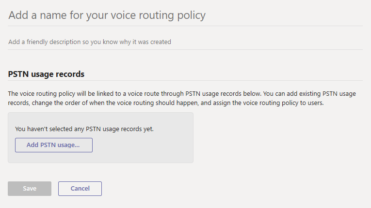

# Administrar directivas de enrutamiento de voz en Microsoft TeamsManage voice routing policies in Microsoft Teams

Si ha implementado el [enrutamiento directo de sistema telefónico](direct-routing-landing-page.md) en su organización, puede usar las directivas de enrutamiento de voz para permitir que los usuarios de Teams y Skype empresarial online reciban y realicen llamadas telefónicas a la red de telefonía pública conmutada (RTC) con su infraestructura de telefonía local.If you've deployed [Phone System Direct Routing](direct-routing-landing-page.md) in your organization, you use voice routing policies to allow Teams and Skype for Business Online users to receive and make phone calls to the Public Switched Telephone Network (PSTN) using your on-premises telephony infrastructure.

Una directiva de enrutamiento de voz es un contenedor de registros de uso de RTC.A voice routing policy is a container for PSTN usage records. Para crear y administrar directivas de enrutamiento de voz, **vaya a**  >  **directivas de enrutamiento** de voz de voz en el centro de administración de Microsoft Teams o mediante Windows PowerShell.You create and manage voice routing policies by going to **Voice** > **Voice routing policies** in the Microsoft Teams admin center or by using Windows PowerShell.

Puede usar la directiva global (predeterminada para toda la organización) o crear y asignar directivas personalizadas.You can use the global (Org-wide default) policy or create and assign custom policies. Los usuarios obtendrán automáticamente la directiva global a menos que cree y asigne una directiva personalizada.Users will automatically get the global policy unless you create and assign a custom policy. Tenga en cuenta que puede modificar la configuración de la directiva global, pero no puede cambiarle el nombre o eliminarla.Keep in mind that you can edit the settings in the global policy but you can't rename or delete it.

Es importante saber que asignar una directiva de enrutamiento de voz a un usuario no les permite realizar llamadas RTC en Teams.It's important to know that assigning a voice routing policy to a user doesn't enable them to make PSTN calls in Teams. También tendrá que habilitar el enrutamiento directo del usuario para el sistema telefónico y completar otros pasos de configuración.You'll also need to enable the user for Phone System Direct Routing and complete other configuration steps. Para obtener más información, vea [configurar el enrutamiento directo](direct-routing-configure.md).To learn more, see [Configure Direct Routing](direct-routing-configure.md).

## Crear una directiva de enrutamiento de voz personalizadaCreate a custom voice routing policy

### Usar el centro de administración de Microsoft TeamsUsing the Microsoft Teams admin center

1. En el centro de navegación izquierdo del centro de administración de Microsoft Teams, vaya a directivas de enrutamiento de voz de **voz**  >  **Voice routing policies**y haga clic en **Agregar**.In the left navigation of the Microsoft Teams admin center, go to **Voice** > **Voice routing policies**, and then click **Add**. 
     
2. Escriba un nombre y una descripción para la directiva.Enter a name and description for the policy.
3. En **registros de uso de RTC**, haga clic en **Agregar uso de RTC**y, a continuación, seleccione los registros que desee agregar.Under **PSTN usage records**, click **Add PSTN usage**, and then select the records that you want to add. Si necesita crear un registro de uso de RTC nuevo, haga clic en **Agregar**.If you need to create a new PSTN usage record, click **Add**.
4. Si ha agregado varios registros de uso de RTC, organícelos en el orden que desee.If you added multiple PSTN usage records, arrange them in the order that you want.
5. Cuando haya terminado, haga clic en **aplicar**.When you're done, click **Apply**.
6. Haga clic en \*\*Guardar \*\*.Click **Save**.

### Con PowerShellUsing PowerShell

Vea [New-CsOnlineVoiceRoutingPolicy](https://docs.microsoft.com/powershell/module/skype/new-csonlinevoiceroutingpolicy).See [New-CsOnlineVoiceRoutingPolicy](https://docs.microsoft.com/powershell/module/skype/new-csonlinevoiceroutingpolicy).

## Editar una directiva de enrutamiento de vozEdit a voice routing policy

### Usar el centro de administración de Microsoft TeamsUsing the Microsoft Teams admin center

Puede editar la directiva global o cualquier directiva personalizada que cree.You can edit the global policy or any custom policies that you create.

1. En el centro de navegación izquierdo del centro de administración de Microsoft Teams, vaya a **Voice**  >  **directivas de enrutamiento de voz**de voz.In the left navigation of the Microsoft Teams admin center, go to **Voice** > **Voice routing policies**.
2. Seleccione la Directiva haciendo clic a la izquierda del nombre de la Directiva y, a continuación, haga clic en **Editar**.Select the policy by clicking to the left of the policy name, and then click **Edit**.
3. Haga clic en **Agregar o quitar registros de uso de RTC**, realice los cambios que desee y, a continuación, haga clic en **Guardar**.Click **Add/remove PSTN usage records**, make the changes that you want, and then click **Save**.

### Con PowerShellUsing PowerShell

Consulte [set-CsOnlineVoiceRoutingPolicy](https://docs.microsoft.com/powershell/module/skype/set-csonlinevoiceroutingpolicy).See [Set-CsOnlineVoiceRoutingPolicy](https://docs.microsoft.com/powershell/module/skype/set-csonlinevoiceroutingpolicy).

## Asignar una directiva de enrutamiento de voz personalizada a los usuariosAssign a custom voice routing policy to users

[!INCLUDE [assign-policy](includes/assign-policy.md)]

Consulte también [Grant-CsOnlineVoiceRoutingPolicy](https://docs.microsoft.com/powershell/module/skype/grant-csonlinevoiceroutingpolicy).See also [Grant-CsOnlineVoiceRoutingPolicy](https://docs.microsoft.com/powershell/module/skype/grant-csonlinevoiceroutingpolicy).

## Temas relacionadosRelated topics

[Descripción de PowerShell para TeamsTeams PowerShell overview](teams-powershell-overview.md)

[Configurar el enrutamiento de voz para el enrutamiento directoConfigure voice routing for Direct Routing](direct-routing-voice-routing.md)

[Habilitar enrutamiento basado en la ubicación para el enrutamiento directoEnable Location-Based Routing for Direct Routing](location-based-routing-enable.md)

[Asignar directivas a los usuarios de TeamsAssign policies to your users in Teams](assign-policies.md)
