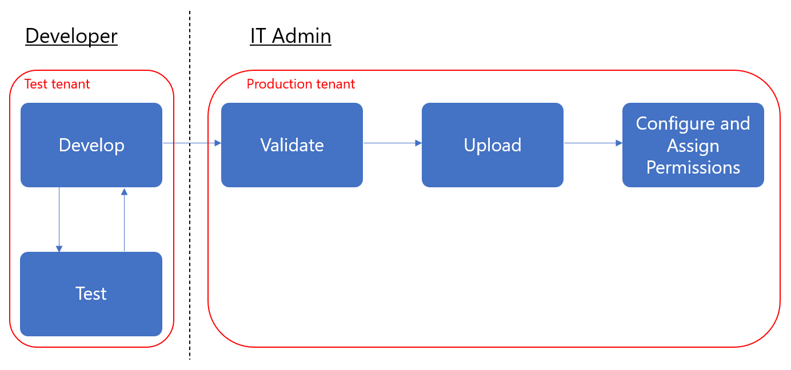

# Administrar las aplicaciones de línea de negocio en Microsoft Teams

En este artículo se proporcionan instrucciones completas sobre cómo llevar la aplicación de su equipo de desarrollo a la implementación. Esta guía se centra en los aspectos de los equipos de la aplicación y está pensado para profesionales de ti. Para obtener más información sobre el desarrollo de aplicaciones de Teams, consulte <a href="https://docs.microsoft.com/microsoftteams/platform" target="_blank">aquí</a>.

## Introducción

Para crear y administrar aplicaciones de línea de negocio (LOB) en Teams, necesitará dos inquilinos: un inquilino de prueba para el desarrollo y un inquilino de producción.

> [!NOTE]
> Si aún no tiene un inquilino de prueba, puede crear uno rápidamente y rellenarlo con datos de prueba con el programa para desarrolladores de Office 365. <a href="https://developer.microsoft.com/office/dev-program" target="_blank">Más información aquí</a>.

## Paso 1: desarrollar y probar

### Crear usuarios de prueba

Asegúrese de que los desarrolladores, ya sean internos o externos, tengan cuentas en su inquilino de prueba. <a href="https://docs.microsoft.com/office365/admin/add-users/add-users" target="_blank">Más información sobre cómo agregar usuarios</a>.

### Permitir aplicaciones personalizadas en el inquilino de prueba

Para proporcionar a los desarrolladores el acceso que necesitan para realizar las pruebas, permita que todos los usuarios del inquilino de prueba carguen aplicaciones personalizadas (también conocidas como la transferencia local). Esto permite a los desarrolladores cargar una aplicación personalizada para usarse personalmente o en el inquilino de prueba sin tener que enviar la aplicación a la tienda de aplicaciones de Teams. Cargar una aplicación personalizada permite a los desarrolladores probar una aplicación antes de distribuirla más ampliamente.

Para permitir que los usuarios carguen aplicaciones personalizadas, siga estos pasos:

1. Active la opción de aplicación **permitir la interacción con aplicaciones personalizadas** de la organización. Para ello, haga lo siguiente:
    1. En el centro de navegación izquierdo <a href="https://admin.teams.microsoft.com/" target="_blank">del centro de administración de Microsoft Teams</a>, vaya a **aplicaciones** > de Teams**Manage apps**y, a continuación, haga clic en **configuración de aplicaciones en toda la organización**.
    2. En **aplicaciones personalizadas**, Active **permitir la interacción con aplicaciones personalizadas**y, a continuación, haga clic en **Guardar**.

    

2. Active la opción **cargar aplicaciones personalizadas** en la Directiva configuración global de la aplicación. Para ello, haga lo siguiente:
    1. En el centro de navegación izquierdo <a href="https://admin.teams.microsoft.com/" target="_blank">del centro de administración de Microsoft Teams</a>, vaya a**directivas de configuración**de las aplicaciones > de **Teams**y, a continuación, haga clic en la directiva **global (valor predeterminado de toda la organización)** .
    2. Active **cargar aplicaciones personalizadas**y, a continuación, haga clic en **Guardar**.

    

> [!NOTE]
> También hay una configuración de carga personalizada de la aplicación en el nivel de equipo. De forma predeterminada, esta configuración está activada. Sin embargo, si los desarrolladores no pueden cargar una aplicación personalizada en un equipo, Compruebe la configuración siguiendo los pasos que se describen <a href="https://docs.microsoft.com/microsoftteams/teams-custom-app-policies-and-settings#configure-the-team-custom-app-setting" target="_blank">aquí</a>.

### Crear la aplicación

Los desarrolladores deberían tener ahora lo que necesitan para crear la aplicación. Consulte <a href="https://docs.microsoft.com/microsoftteams/platform" target="_blank">aquí</a> para obtener instrucciones.

## Paso 2: validar en producción

### Obtener el paquete de la aplicación

Cuando la aplicación está lista para su uso en producción, el desarrollador debe producir un paquete de la aplicación. Pueden usar <a href="https://docs.microsoft.com/microsoftteams/platform/get-started/get-started-app-studio" target="_blank">App Studio</a> para eso. Le enviarán el archivo con el formato. zip.

Microsoft usa <a href="https://docs.microsoft.com/microsoftteams/platform/publishing/office-store-approval" target="_blank">estas directrices</a> para garantizar que las aplicaciones cumplan con los estándares de calidad y seguridad de la tienda de aplicaciones global de Teams.

### Permitir a los usuarios de confianza cargar aplicaciones personalizadas en el inquilino de producción

Para comprobar que la aplicación está funcionando correctamente en su inquilino de producción, debe permitir a usuarios de confianza o a usuarios de la organización cargar aplicaciones personalizadas.  Al igual que en el <a href="https://docs.microsoft.com/microsoftteams/manage-your-lob-apps#allow-custom-apps-in-the-test-tenant" target="_blank">paso</a>anterior, puede usar las directivas de configuración de la aplicación para hacerlo.

> [!NOTE]
> Si le resulta incómodo el envío de la aplicación a su inquilino de producción para su validación, incluso para usuarios propios o de confianza, puede omitir este paso y seguir los pasos 3 y 4 para cargar la aplicación no validada en su tienda de aplicaciones de inquilino. Después, restrinja el acceso a esa aplicación solo a usted y a los usuarios de confianza. Estos usuarios pueden obtener la aplicación desde la tienda de aplicaciones de inquilino para realizar la validación. Una vez validada la aplicación, use las mismas directivas de permisos para abrir Access y desplace la aplicación para su uso en producción.

Para permitir que los usuarios de confianza carguen aplicaciones personalizadas, siga estos pasos:

1. Active la opción de aplicación **permitir la interacción con aplicaciones personalizadas** de la organización. Para ello, haga lo siguiente:
    1. En el centro de navegación izquierdo <a href="https://admin.teams.microsoft.com/" target="_blank">del centro de administración de Microsoft Teams</a>, vaya a **aplicaciones** > de Teams**Manage apps**y, a continuación, haga clic en **configuración de aplicaciones en toda la organización**.
    2. En **aplicaciones personalizadas**, Active **permitir la interacción con aplicaciones personalizadas**y, a continuación, haga clic en **Guardar**.
2. Desactive la opción **cargar aplicaciones personalizadas** en la Directiva configuración global de la aplicación. Para ello, haga lo siguiente:
    1. En el centro de navegación izquierdo <a href="https://admin.teams.microsoft.com/" target="_blank">del centro de administración de Microsoft Teams</a>, vaya a**directivas de configuración**de las aplicaciones > de **Teams**y, a continuación, haga clic en la directiva **global (valor predeterminado de toda la organización)** .
    2. Desactive **cargar aplicaciones personalizadas**y, a continuación, haga clic en **Guardar**.
3. Cree una nueva Directiva de configuración de aplicaciones que permita cargar aplicaciones personalizadas y asignarlas a su conjunto de usuarios de confianza. Para ello, haga lo siguiente:
    1. En el centro de navegación izquierdo <a href="https://admin.teams.microsoft.com/" target="_blank">del centro de administración de Microsoft Teams</a>, vaya a**directivas de configuración**de las aplicaciones > de **Teams**y, a continuación, haga clic en **Agregar**. Asigne un nombre y una descripción a la nueva Directiva, Active **cargar aplicaciones personalizadas**y, a continuación, haga clic en **Guardar**.
    2. Seleccione la nueva directiva que ha creado y, a continuación, haga clic en **administrar usuarios**. Busque un usuario, haga clic en **Agregar**y, a continuación, haga clic en **aplicar**. Repita este paso para asignar la Directiva a todos los usuarios de confianza.

        

    Estos usuarios ahora pueden cargar el manifiesto de la aplicación para validar que la aplicación está funcionando correctamente en el inquilino de producción.

## Paso 3: cargar en el catálogo de aplicaciones de inquilino

Para que la aplicación esté disponible para los usuarios en la tienda de aplicaciones de inquilino, cargue la aplicación. Puede hacerlo <a href="https://docs.microsoft.com/microsoftteams/tenant-apps-catalog-teams#go-to-the-tenant-apps-catalog" target="_blank">usando el cliente de escritorio de Teams</a> o en la página [Manage apps](manage-apps.md) del centro de administración de Microsoft Teams.

Esta es una captura de pantalla de la opción de carga en el cliente de escritorio de Teams.

Esta es una captura de pantalla de la opción cargar en la página **Manage apps** en el centro de administración de Microsoft Teams.

## Paso 4: configurar y asignar permisos

### Controlar el acceso a la aplicación

De forma predeterminada, todos los usuarios tienen acceso a esta aplicación en la tienda aplicaciones de Teams. Para restringir y controlar quién tiene permiso para usar la aplicación, puede crear y asignar una nueva Directiva de permisos de la aplicación. Siga los pasos que se indican <a href="https://docs.microsoft.com/microsoftteams/teams-app-permission-policies#create-a-custom-app-permission-policy" target="_blank">aquí</a>.

### Anclar la aplicación para que los usuarios puedan descubrirla

De forma predeterminada, para que los usuarios encuentren esta aplicación, deben ir a la tienda de aplicaciones de Teams y examinarla o buscarla. Para facilitar a los usuarios el acceso a la aplicación, puede anclar la aplicación a la barra de aplicaciones de Teams. Para ello, cree una nueva Directiva de configuración de la aplicación y asígnela a los usuarios. Siga los pasos que se indican <a href="https://docs.microsoft.com/microsoftteams/teams-app-setup-policies#create-a-custom-app-setup-policy" target="_blank">aquí</a>.

## Paso 5: actualizar la aplicación

Para actualizar una aplicación, los desarrolladores deben seguir los [pasos 1](#step-1-develop-and-test) y [2](#step-2-validate-in-production).

Puede actualizar la aplicación a través del catálogo de aplicaciones de inquilino. Para ello, en el cliente de escritorio de Teams, vaya a **aplicaciones** > **creadas para &lt;el&gt;nombre de su inquilino**, haga clic en **...** en la esquina superior derecha de la aplicación y, a continuación, haga clic en **Actualizar**. Esto reemplaza la aplicación existente en el catálogo de aplicaciones de inquilino, y todas las directivas de permisos y directivas de configuración siguen aplicándose para la aplicación actualizada. 

