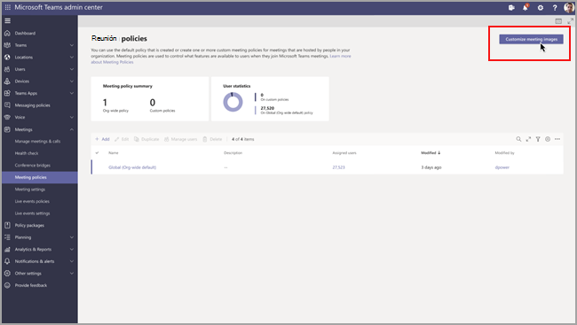

# Configuración de directiva de reunión para audio & vídeo

En este artículo se describen las configuraciones de directiva de reunión específicas de audio y vídeo. Entre ellas se incluyen las siguientes:

- [Permitir transcripción](#allow-transcription)
- [Permitir la grabación en la nube](#allow-cloud-recording)
- [Modo de audio IP](#mode-for-ip-audio)
- [Modo de vídeo IP](#mode-for-ip-video)
- [Permitir vídeo IP](#allow-ip-video)
- [Velocidad de bits multimedia (kb/s)](#media-bit-rate-kbs)
- [Modo filtros de vídeo](#video-filters-mode)
- [Permitir la configuración de fondo personalizada](#allow-custom-background-settings)

### Permitir transcripción

Esta es una combinación de directiva por organizador y por usuario. Esta configuración controla si se pueden usar las características de subtítulos y transcripción durante la reproducción de las grabaciones de la reunión. Si desactiva esta opción, las opciones de **Búsqueda** y **CC** no estarán disponibles durante la reproducción de la grabación de una reunión. La persona que ha iniciado la grabación necesita que esta opción esté activada para que la grabación también incluya transcripción.

Nota: Actualmente, la transcripción de reuniones grabadas solo es posible si los usuarios tienen configurado el idioma de Teams en inglés y si se habla inglés en la reunión.

### Permitir la grabación en la nube

Esta es una combinación de directiva por organizador y por usuario. Esta configuración controla si se pueden grabar las reuniones de este usuario. La grabación la puede iniciar el organizador de la reunión u otro participante de la reunión si la configuración de directiva está activada para el participante y si es un usuario autenticado de la misma organización.

Las personas de fuera de su organización, como los usuarios federados y anónimos, no pueden iniciar la grabación. Los usuarios invitados no pueden iniciar o detener la grabación.

Veamos el ejemplo siguiente.

|Usuario |Directiva de reuniones  |Permitir la grabación en la nube |
|---------|---------|---------|
|Daniela | Global   | Desactivado |
|Amanda | Location1MeetingPolicy | Activado|
|John (usuarios externos) | No aplicable | No aplicable|

Las reuniones organizadas por Daniela no se pueden grabar y Amanda, que tiene la configuración de directiva habilitada, no puede grabar las reuniones organizadas por Daniela. Las reuniones organizadas por Amanda sí se pueden grabar, pero Daniela, que tiene la configuración de directiva deshabilitada y John, un usuario externo, no pueden grabar las reuniones organizadas por Amanda.

Para más información sobre la grabación de reuniones en la nube, consulte [Grabación de reuniones en la nube de Teams](cloud-recording.md).

### Modo de audio IP

Esta es una directiva por usuario. Esta configuración controla si se puede activar el audio en reuniones y llamadas de grupo. Estos son los valores de configuración.

|Valor de configuración |Comportamiento  |
|---------|---------|
|**Audio entrante y saliente activado**    |De forma predeterminada, se permiten en la reunión el vídeo y audio entrantes y salientes. |
|**Deshabilitado**     |El audio entrante y saliente en la reunión está desactivado.     |

Si se establece en **Deshabilitado** para un usuario, el usuario podrá seguir programando y organizando reuniones, pero no podrá usar el audio. Para unirse a una reunión, tendrá que marcar para acceder a través de la red telefónica conmutada (RTC) o hacer que se llame a la reunión y unirse por teléfono a ella. Los participantes de la reunión que no tengan ninguna directiva asignada (por ejemplo, los participantes anónimos) tienen esto establecido como **Audio de salida y entrada habilitado** de forma predeterminada. Si esta opción está deshabilitada en los clientes móviles de Teams, el usuario tendrá que marcar para acceder a la reunión a través de la RTC.

Esta configuración no se aplica a las llamadas 1:1. Para restringir llamadas 1:1, configure una [directiva de llamada](teams-calling-policy.md) de Teams y desactive el valor **Realizar llamadas privadas**. Esta configuración tampoco se aplica a los dispositivos de la sala de conferencias, como los dispositivos de Surface Hub y Salas de Microsoft Teams.

Esta configuración aún no está disponible para entornos de Microsoft 365 Government Community Cloud (GCC), GCC High o Department of Defense (DoD).

Para obtener más información, consulte [Administrar el audio y el vídeo de los participantes de la reunión](#manage-audiovideo-for-meeting-participants).

### Modo de vídeo IP

Esta es una directiva por usuario. Esta configuración controla si se puede activar el vídeo en reuniones y llamadas de grupo. Estos son los valores de configuración.

|Valor de configuración |Comportamiento  |
|---------|---------|
|**Vídeo entrante y saliente activado**    | Se permite el vídeo entrante y saliente en la reunión. Esta configuración es la predeterminada. |
|**Deshabilitado**     | El vídeo entrante y saliente en la reunión está desactivado. En los clientes para móvil de Teams, los usuarios no pueden compartir vídeos ni fotos en la reunión.   Tenga en cuenta que si está deshabilitado el **Modo para audio IP**, entonces el **Modo para vídeo IP** permanecerá también deshabilitado.  |

Si se establece en **Deshabilitado** para un usuario, ese usuario no puede activar el vídeo o ver vídeos compartidos por otros participantes de la reunión. Los participantes de la reunión que no tengan ninguna directiva asignada (por ejemplo, los participantes anónimos) tienen esto establecido como **Vídeo de salida y entrada habilitado** de forma predeterminada.

Esta configuración no se aplica a los dispositivos de la sala de conferencias, como los dispositivos de Surface Hub y Salas de Microsoft Teams.

Esta configuración aún no está disponible para entornos de Microsoft 365 Government Community Cloud (GCC), GCC High o Department of Defense (DoD).

> [!NOTE]
> Tenga en cuenta que esta configuración controla tanto el vídeo saliente como el entrante mientras que **Permitir el vídeo IP** controla solo el vídeo saliente. Para obtener más información, consulte [¿Cuál es la prioridad de la configuración de directiva de vídeo IP?](#which-ip-video-policy-setting-takes-precedence) y [Administrar el audio y el vídeo de los participantes de la reunión](#manage-audiovideo-for-meeting-participants).

Para obtener más información, consulte [Administrar el audio y el vídeo de los participantes de la reunión](#manage-audiovideo-for-meeting-participants).

### Permitir vídeo IP

Esta es una combinación de directiva por organizador y por usuario. El vídeo es un componente clave de las reuniones. En algunas organizaciones, los administradores pueden querer disponer de más control sobre qué reuniones de usuarios tienen vídeo. Esta configuración controla si se puede activar el vídeo en reuniones hospedadas por un usuario y en llamadas 1:1 y de grupo iniciadas por un usuario. En Teams móviles, esta configuración controla si los usuarios pueden compartir fotos y vídeos en una reunión.

Las reuniones organizadas por un usuario que tiene habilitada esta configuración de directiva, permiten el uso compartido de vídeo en la reunión por parte de los participantes de la reunión, si estos también tienen la configuración de directiva habilitada. Los participantes de la reunión a los que no se les ha asignado ninguna directiva (por ejemplo, los participantes anónimos y federados) heredan la directiva del organizador de la reunión.

> [!NOTE]
> Tenga en cuenta que esta configuración controla el vídeo saliente mientras que la configuración **Modo para vídeo IP** controla tanto el vídeo saliente como el entrante. Para obtener más información, consulte [¿Cuál es la prioridad de la configuración de directiva de vídeo IP?](#which-ip-video-policy-setting-takes-precedence) y [Administrar el audio y el vídeo de los participantes de la reunión](#manage-audiovideo-for-meeting-participants).

| Clientes de escritorio y web de Teams |Cliente móvil de Teams  |
|:-------:|:-------:|
|    |          |

Veamos el ejemplo siguiente.

|Usuario |Directiva de reuniones  |Permitir vídeo IP |
|---------|---------|---------|
|Daniela   | Global   | Activado       |
|Amanda    | Location1MeetingPolicy        | Desactivado      |

Las reuniones hospedadas por Daniela permiten activar el vídeo. Daniela puede unirse a la reunión y activar el vídeo. Amanda no puede activar el vídeo en la reunión de Daniela porque la directiva de Amanda está configurada para no permitir el vídeo. Amanda pueden ver vídeos compartidos por otros participantes de la reunión.

En las reuniones hospedadas por Amanda, nadie puede activar el vídeo, independientemente de la directiva de vídeo que tenga asignada. Esto significa que Daniela no puede activar el vídeo en las reuniones de Amanda.  

Si Daniela llama a Amanda con el vídeo activado, Amanda puede responder a la llamada solo con audio.  Cuando se conecte la llamada, Amanda podrá ver el vídeo de Daniela, pero no podrá activar el vídeo. Si Amanda llama a Daniela, Daniela podrá responder a la llamada con vídeo o audio. Cuando se conecte la llamada, Daniela podrá activar o desactivar el vídeo, según lo vea necesario.

Para obtener más información, consulte [Administrar el audio y el vídeo de los participantes de la reunión](#manage-audiovideo-for-meeting-participants).

#### ¿Qué configuración de directiva de vídeo IP tiene prioridad?

Para un usuario, la configuración de directiva más restrictiva para el vídeo tiene prioridad. Estos son algunos ejemplos.

|Permitir vídeo IP|Modo de vídeo IP|Experiencia de reunión|
|---------|---------|---------|
|Organizador: **Activado**  Participante: **Activado** |Participante: **Deshabilitado**        |La configuración del **Modo de vídeo IP** tiene prioridad. El participante al que se asigna esta directiva no puede activar o ver vídeos compartidos por otros usuarios.|
|Organizador: **Activado**  Participante: **Activado** |Participante: **Vídeo entrante y saliente activado**          |El participante al que se asigna esta directiva puede activar o ver vídeos compartidos por otros usuarios.         |
|Organizador: **Activado**  Participante: **Desactivado** |Participante: **Vídeo entrante y saliente activado**         |La configuración **Permitir vídeo IP** tiene prioridad. Los participantes solo pueden ver el vídeo entrante y no pueden enviar vídeo saliente.         |
|Organizador: **Activado**  Participante: **Desactivado** |Participante: **Deshabilitado**         |La configuración del **Modo de vídeo IP** tiene prioridad. El participante no puede ver ni el vídeo entrante ni el saliente.|
|Organizador: **Desactivado**    |       |La configuración **Permitir el vídeo IP** tiene prioridad porque está desactivada para el organizador. Nadie puede activar el vídeo en las reuniones organizadas por el usuario al que se asigna esta directiva.         |

### Administrar el audio y el vídeo de los participantes de la reunión

|Si quiere...  |Establezca las siguientes configuraciones de directivas  |
|---------|---------|
|Deshabilitar el audio y el vídeo para los participantes en reuniones  |Modo de audio IP: **Deshabilitado**  Modo de vídeo IP: **Deshabilitado** Permitir vídeo IP: N/D       |
|Habilitar solo vídeo y audio entrante para participantes en reuniones  |Modo de audio IP: **Audio entrante y saliente activado**  Modo de vídeo IP: **Vídeo entrante y saliente activado** Permitir vídeo IP: **Activado**       |
|Deshabilitar el vídeo para los participantes en reuniones (los participantes solo tienen audio)|  Modo de audio IP: **Activar el audio entrante y saliente**  Modo de vídeo IP: **Deshabilitado** Permitir vídeo IP: N/D
|Habilitar el audio y el vídeo para los participantes en reuniones    |Modo de audio IP: **Audio entrante y saliente activado** (predeterminado)  Modo de vídeo IP: **Vídeo entrante y saliente activado** (predeterminado) Permitir vídeo IP: **Activado** (predeterminado)    |

Se aplica la directiva más restrictiva entre la directiva del organizador de la reunión y la del usuario. Por ejemplo, si un organizador tiene una directiva que restringe el vídeo y la directiva de un usuario no restringe el vídeo, los participantes de la reunión heredan la directiva del organizador de la reunión y no tienen acceso al vídeo en las reuniones. Esto significa que solo podrán unirse a la reunión con audio.

> [!NOTE]
> Cuando un usuario inicia una llamada de grupo para unirse por teléfono, no se muestra la pantalla **Usar teléfono para el audio**. Este es un problema conocido que estamos intentando resolver. Para solucionar este problema, seleccione **Audio del teléfono** en **Otras opciones para unirse**.  

#### Clientes de móvil de Teams

Para los usuarios de clientes de móvil de Teams, la capacidad para compartir fotos y vídeos durante una reunión también está determinada por el valor **Permitir el vídeo IP** o **Modo de vídeo de IP**. En función de la configuración de directiva que tenga prioridad, la capacidad para compartir vídeos y fotos no estará disponible. Esto no afecta al uso compartido de la pantalla, que se configura con el modo de [Uso compartido de pantalla](meeting-policies-content-sharing.md#screen-sharing-mode). Asimismo, puede establecer una directiva de movilidad de [Teams](/powershell/module/skype/new-csteamsmobilitypolicy) para evitar que los usuarios móviles utilicen vídeo IP sobre una conexión móvil, lo que significa que deben usar una conexión Wi-Fi.

### Velocidad de bits multimedia (kb/s)

Esta es una directiva por usuario. Esta configuración determina la velocidad de bits multimedia para las transmisiones por audio, vídeo y uso compartido de aplicaciones en vídeo en las llamadas y reuniones para el usuario. Se aplica a los usuarios de la llamada o reunión, en transferencias multimedia tanto de subida como de bajada. Esta configuración le ofrece un control en detalle de la administración de ancho de banda de su organización. Dependiendo de los escenarios de reuniones necesarios para los usuarios, le recomendamos que disponga del suficiente ancho de banda para disfrutar de una buena calidad. El valor mínimo es 30 kb/s y el valor máximo depende del escenario de la reunión. Para obtener más información sobre el ancho de banda mínimo recomendado para reuniones, llamadas y eventos en directo de buena calidad en Teams, vea [Requisitos de ancho de banda](prepare-network.md#bandwidth-requirements).

Si no hay suficiente ancho de banda para una reunión, los participantes ven un mensaje que indica que la calidad de la red es deficiente.

Para las reuniones que necesitan una experiencia de vídeo de mayor calidad, como las reuniones de juntas directivas y los eventos de Teams en directo, le recomendamos que establezca el ancho de banda en 10 Mb/s. Incluso si se establece la experiencia máxima, la pila de medios de Teams se adapta a condiciones de bajo ancho de banda cuando se detectan determinadas condiciones de red, según el contexto.

## Modo filtros de vídeo

Esta configuración se aplica por participante. Esta configuración controla si los usuarios pueden personalizar su fondo de vídeo en una reunión.

Actualmente, solo puede usar PowerShell para establecer esta directiva. Para editar una directiva de reunión de Teams existente, use el cmdlet [Set-CsTeamsMeetingPolicy](/powershell/module/skype/set-csteamsmeetingpolicy). También puede crear una nueva directiva de reunión de Teams con el cmdlet [New-CsTeamsMeetingPolicy](/powershell/module/skype/new-csteamsmeetingpolicy) y asignarla a los usuarios.

Para especificar si los usuarios pueden personalizar su fondo de vídeo en una reunión, establezca el parámetro **VideoFiltersMode** como se indica a continuación:

|Establecer valor en PowerShell |Comportamiento  |
|---------|---------|
|**NoFilters**     |El usuario no puede personalizar su fondo de vídeo.|
|**BlurOnly**     |El usuario tiene la opción de difuminar el fondo de vídeo. |
|**BlurandDefaultBackgrounds**     |El usuario tiene la opción de difuminar su fondo de vídeo o elegir un conjunto de imágenes predeterminado para usarlo como fondo. |
|**AllFilters**     |El usuario tiene la opción de difuminar su fondo de vídeo, elegir entre un conjunto de imágenes predeterminado o cargar una imagen personalizada para usarla como fondo. |

> [!NOTE]
> Teams no puede filtrar las imágenes cargadas por los usuarios. Al usar la configuración **AllFilters**, debe tener directivas de organización internas para evitar que los usuarios puedan cargar imágenes ofensivas, inadecuadas, o para las cuales la organización no tenga derechos de uso en el contexto de fondos para reuniones de Teams.

### Permitir la configuración de fondo personalizada

Puede agregar imágenes de fondo personalizadas para que se utilicen por espacio empresarial. Esta característica permite a las empresas aplicar la personal de marca corporativa a Teams reuniones.

1. Inicie la sesión en el Centro de administración de Teams

2. Seleccione **Directivas de reunión Personalizar** imágenes de  >  **reunión.**

   

3. Seleccione **Activar en** imágenes de fondo ancho de la **organización.**

4. Seleccione **+ Agregar imágenes**.

5. En el panel Administrar fondos, seleccione **Agregar imagen.**

6. Asegúrese de que las imágenes cumplen estos requisitos:
  
   - Tamaño mínimo 360 px
   - Tamaño máximo 2048 px
   - Tipo de archivo de PNG, JPG o BMP
   - Se pueden cargar un máximo de 50 imágenes

7. Obtenga una vista previa de las imágenes que ha seleccionado y, a continuación, seleccione **Cerrar.**

8. Revise las imágenes y agregue más según sea necesario.

9. Seleccione **Guardar**.

Los asistentes a la reunión verán una selección de imágenes de fondo que pueden usar cuando asistan a una reunión.

> [!NOTE]
> Los cambios pueden tardar hasta 24 horas en tener efecto.

## Temas relacionados

- [Descripción de PowerShell para Teams](teams-powershell-overview.md)
- [Asignar directivas a los usuarios en Teams](assign-policies.md)
