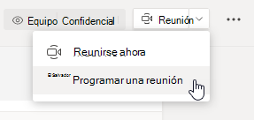
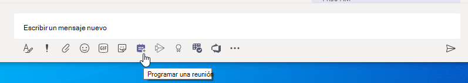
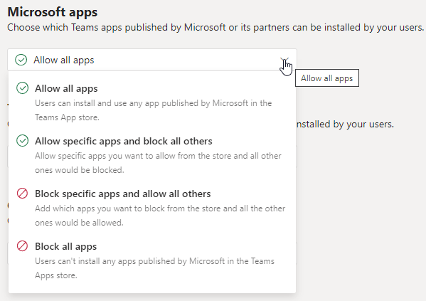
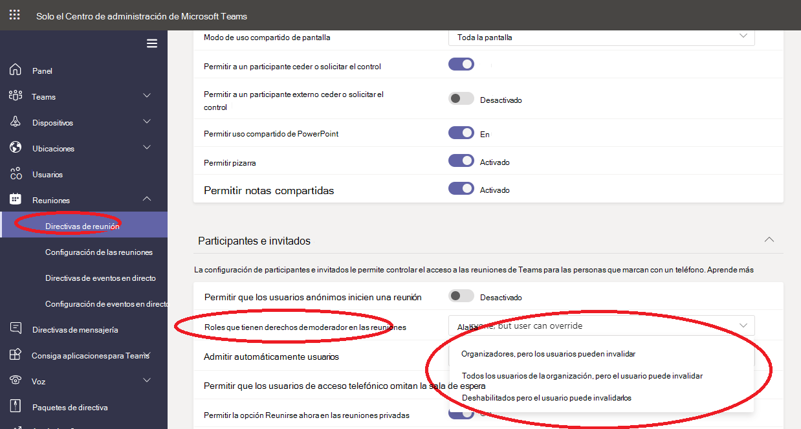

# Administrar directivas de reunión en Teams

::: zone target="docs"
Utilizar las directivas de reunión para controlar las características disponibles para sus participantes en reuniones programadas por usuarios de la organización. Puede usar la directiva global (predeterminada para toda la organización) o crear directivas personalizadas y asignarlas a los usuarios. Puede administrar las directivas de reuniones en el Centro de administración de Microsoft Teams o mediante [PowerShell](teams-powershell-overview.md).

> [!NOTE]
> Para obtener información sobre el uso de los roles para administrar los permisos de los moderadores y los asistentes de reuniones, consulte [Roles en una reunión de Teams](https://support.microsoft.com/office/roles-in-a-teams-meeting-c16fa7d0-1666-4dde-8686-0a0bfe16e019?ui=en-us&rs=en-us&ad=us).

Puede implementar directivas en las formas que se indican a continuación. Esto afectará a la experiencia de los usuarios antes de que se inicie la reunión, durante una reunión o después de una reunión.

|Tipo de implementación  |Descripción  |
|---------|---------|
|Por organizador    |Al implementar una directiva por organizador, todos los participantes de la reunión heredan la directiva del organizador. Por ejemplo, **Admitir personas automáticamente** es una directiva por organizador. Controla si los usuarios pueden unirse a la reunión directamente o esperar en la sala de espera para reuniones programadas por el usuario al que se ha asignado la directiva.          |
|Por usuario    |Cuando implementa una directiva por usuario, solo la directiva por usuario se aplica para restringir determinadas características para el organizador o los participantes de la reunión. Por ejemplo, **Permitir Reunirse ahora en los canales** es una directiva por usuario.     |
|Por organizador y por usuario     |Cuando implementa una combinación de una directiva por organizador y por usuario, se restringen determinadas características a los participantes de la reunión en función de las directivas de los usuarios y del organizador. Por ejemplo, **Permitir la grabación en la nube** es una directiva por organizador y por usuario. Activar esta opción para permitir que los participantes inicien y detengan una grabación.

Puede editar la configuración en la directiva global o crear y asignar una o más directivas personalizadas. Los usuarios obtendrán la directiva global, a menos que usted cree y asigne una directiva personalizada.

> [!NOTE]
> El botón Detalles de la reunión estará disponible si un usuario tiene habilitadas las licencias de conferencia de audio o si el usuario admite las conferencias de audio. Si no, los detalles de la reunión no estarán disponibles.

## Crear una directiva de reuniones personalizada

1. En el panel de navegación izquierdo del Centro de administración de Microsoft Teams, vaya a **Reuniones** > **Directivas de reunión**.
2. Seleccione **Agregar**.
3. Escriba un nombre y una descripción para la directiva. El nombre no puede contener caracteres especiales ni tener más de 64 caracteres.
4. Seleccione la configuración que quiera usar.
5. Seleccione **Guardar**.

Por ejemplo, supongamos que tiene un grupo de usuarios y quiere limitar el ancho de banda que necesitaría la reunión. Cree una nueva directiva personalizada denominada "ancho de banda limitado" y deshabilite las opciones siguientes:

En **Audio y vídeo**:

- Desactive Permitir la grabación en la nube.
- Desactive Permitir vídeo IP.

En **Uso compartido de contenido**:

- Desactive el modo de uso compartido de la pantalla.
- Desactive Permitir pizarra.
- Desactive Permitir notas compartidas.

Luego asigne la directiva a los usuarios:

## Editar una directiva de reunión

Puede editar la directiva global y las directivas personalizadas que cree.

1. En el panel de navegación izquierdo del Centro de administración de Microsoft Teams, vaya a **Reuniones** > **Directivas de reunión**.
2. Haga clic a la izquierda del nombre de la directiva para seleccionarla y, luego, seleccione **Editar**.
3. A partir de aquí, realice los cambios que desee.
4. Seleccione **Guardar**.

> [!NOTE]
> Un usuario solo puede tener asignada una directiva de reuniones cada vez.

## Asignar una directiva de reunión a los usuarios

[!INCLUDE [assign-policy](includes/assign-policy.md)]

> [!NOTE]
> No puede eliminar una directiva si tiene usuarios asignados. Primero, debe asignar una directiva diferente a todos los usuarios afectados. Luego, podrá eliminar la directiva original.

## Configuración de la directiva de reunión

Seleccionar una directiva existente en la página **Directivas de reunión** o seleccionar **Agregar** para agregar una nueva directiva. Configurar opciones para lo siguiente.

- [General](#meeting-policy-settings---general)
- [Audio y vídeo](#meeting-policy-settings---audio--video)
- [Uso compartido de contenido](#meeting-policy-settings---content-sharing)
- [Participantes e invitados](#meeting-policy-settings---participants--guests)

::: zone-end

## Configuración de la directiva de reunión. Aspectos generales

- [Permitir la opción Reunirse ahora en canales](#allow-meet-now-in-channels)
- [Permitir el complemento de Outlook](#allow-the-outlook-add-in)
- [Permitir la programación de reuniones de canal](#allow-channel-meeting-scheduling)
- [Permitir la programación de reuniones privadas](#allow-scheduling-private-meetings)
- [Permitir Reunirse ahora en reuniones privadas](#allow-meet-now-in-private-meetings)

### Permitir la opción Reunirse ahora en canales

Permitir **Reunirse ahora** es una directiva por usuario y se aplica antes de que se inicie la reunión. Esta configuración controla si un usuario puede iniciar una reunión no planeada en un canal de Teams. Si activa esta configuración, los usuarios podrán seleccionar el botón **Reunirse** para iniciar una reunión no planeada o programar una reunión en el canal. El valor predeterminado es True.

### Permitir el complemento de Outlook

Permitir el complemento de Outlook es una directiva por usuario y se aplica antes de que se inicie la reunión. Esta configuración controla si se pueden programar reuniones de Teams desde Outlook (en Windows, Mac, web y dispositivos móviles).

Si esta característica está desactivada, los usuarios no podrán programar. reuniones de Teams cuando creen una nueva reunión en Outlook. Por ejemplo, en Outlook en Windows, la opción **Nueva reunión de Teams** no se mostrará en la cinta de opciones.

### Permitir la programación de reuniones de canal

Use la Directiva AllowChannelMeetingScheduling existente para controlar los tipos de eventos que se pueden crear en los calendarios del canal del equipo. Esta es una directiva por usuario y se aplica antes de que se inicie la reunión. Esta configuración controla si un usuario puede programar una reunión en un canal de Teams. Esta configuración está activada de forma predeterminada.

Si esta directiva está desactivada, los usuarios no podrán crear nuevas reuniones de canal. Sin embargo, el organizador del evento puede editar las reuniones de canal existentes.

Programar una reunión se deshabilitará.

 

La selección de canales está desactivada.

En la página publicaciones del canal, se deshabilitarán las características siguientes:

- El botón **Programar una reunión** en el cuadro de redactar respuesta del canal.
  
  
- El botón **Programar una reunión** en el encabezado del canal.
  

En el calendario del canal:

- El botón **Agregar nuevo evento** en el encabezado del calendario del canal se deshabilitará.
  

- Los usuarios no podrán arrastrar y seleccionar un bloque de tiempo en el calendario del canal para crear una reunión de canal.

- Los usuarios no pueden usar métodos abreviados de teclado para crear una reunión en el calendario del canal.

En el Centro de administración:

La aplicación Calendario de canal se mostrará en la sección **Aplicaciones de Microsoft** en la página de directivas de permisos de la aplicación.

 

### Permitir la programación de reuniones privadas

La programación de reuniones privadas es una directiva por usuario y se aplica antes de que se inicie la reunión. Esta configuración controla si un usuario puede programar una reunión privada en Teams. Una reunión es privada cuando no se publica en un canal de un equipo.

Si desactiva **Permitir la programación de reuniones privadas** y **Permitir la programación de reuniones de canal**, las opciones **Agregar los asistentes necesarios** y **Agregar el canal** estarán deshabilitadas para los usuarios de Teams. Esta configuración está activada de forma predeterminada.

### Permitir la opción Reunirse ahora en las reuniones privadas

Esta es una directiva por usuario y se aplica antes de que se inicie la reunión. Esta configuración controla si un usuario puede iniciar una reunión privada no planeada. Esta configuración está activada de forma predeterminada.

## Configuración de la directiva de reunión. Audio y vídeo

- [Permitir transcripción](#allow-transcription)
- [Permitir la grabación en la nube](#allow-cloud-recording)
- [Modo de audio IP](#mode-for-ip-audio)
- [Modo de vídeo IP](#mode-for-ip-video)
- [Permitir vídeo IP](#allow-ip-video)
- [Velocidad de bits multimedia (kb/s)](#media-bit-rate-kbs)

### Permitir transcripción

Esta directiva activa la transcripción en directo. Permitir transcripción es una directiva por usuario. Esta configuración controla si se puede transcribir la reunión en concreto de Teams.

La transcripción en directo muestra la conversión de voz en texto de contenido hablado durante una reunión de Teams casi en tiempo real. El texto aparece junto al vídeo de la reunión, incluido el nombre del orador y una marca de tiempo. Para obtener más información, consulte [Ver transcripción en directo de una reunión de Teams](https://support.microsoft.com/office/view-live-transcription-in-a-teams-meeting-dc1a8f23-2e20-4684-885e-2152e06a4a8b).

Actualmente, la transcripción en directo es compatible con el cliente de escritorio de Teams. La transcripción es compatible con el inglés estadounidense hablado. La transcripción está disponible después de la reunión en el escritorio o la web de Teams.

A continuación se explica cómo las configuraciones de directivas **Permitir transcripción** y **Permitir la grabación en la nube** funcionan juntas. En la siguiente tabla se describen los valores de esta configuración y el comportamiento de la reunión.

|Permitir transcripción|Permitir la grabación en la nube|Comportamiento|
|---------|---------|---------|
|**On**|**On**|La opción **Inicio de la transcripción** está disponible en las reuniones de Teams. El organizador o los participantes de la reunión pueden iniciar y detener la transcripción. La opción **Inicio de la grabación** está disponible en las reuniones de Teams. El organizador o los participantes de la reunión pueden iniciar y detener la grabación. |
|**On**|**Desactivado**|La opción **Inicio de la transcripción** está disponible en las reuniones de Teams. La opción **Inicio de la grabación** no está disponible en las reuniones de Teams. |
|**Desactivado**|**On**|La opción **Inicio de la grabación** está disponible en las reuniones de Teams. La opción **Inicio de la transcripción** no está disponible en las reuniones de Teams.|
|**Desactivado**|**Desactivado**|Grabación y transcripción no están disponibles en las reuniones de Teams.  |

### Permitir la grabación en la nube

Permitir la grabación en la nube se controla mediante una directiva por usuario. Esta configuración controla si un usuario puede grabar. La grabación la puede iniciar el organizador de la reunión u otro participante de la reunión si la configuración de directiva específica está activada y si es un usuario autenticado de la misma organización que el organizador.

Las personas de fuera de su organización, como los usuarios federados y anónimos, no pueden iniciar la grabación. Los usuarios invitados no pueden iniciar o detener la grabación.

Veamos el ejemplo siguiente.

|Usuario |Directiva de reuniones  |Permitir la grabación en la nube |
|---------|---------|---------|
|Daniela | Global   | Desactivado |
|Amanda | Location1MeetingPolicy | Activado|
|John (usuarios externos) | No aplicable | No aplicable|

Daniela, incluso si fuera la organizadora, no puede grabar porque su directiva está establecida de este modo. Amanda, que tiene habilitada la configuración de directiva, puede grabar reuniones, incluidas las organizadas por Daniela. Si Amanda organizara una reunión, podría grabarla. Sin embargo, Daniela, que tiene la configuración de directiva deshabilitada y John, un usuario externo, no pueden grabar esa reunión.

Para más información sobre la grabación de reuniones en la nube, consulte [Grabación de reuniones en la nube de Teams](cloud-recording.md).

### Modo de audio IP

El modo de audio IP es una directiva por usuario. Esta configuración controla si se puede activar el audio en reuniones y llamadas de grupo. Estos son los valores de configuración.

|Valor de configuración |Comportamiento  |
|---------|---------|
|**Audio entrante y saliente activado**    |Se permite el audio entrante y saliente en la reunión. Esta configuración es la predeterminada. |
|**Deshabilitado**     |El audio entrante y saliente en la reunión está desactivado.     |

Si se establece en **Deshabilitado** para un usuario, el usuario podrá seguir programando y organizando reuniones, pero no podrá usar el audio. Para unirse a una reunión, el usuario tendrá que marcar para acceder a través de la red telefónica conmutada (RTC) o hacer que se llame a la reunión para unir por teléfono al usuario. Los participantes de la reunión que no tengan ninguna directiva asignada (por ejemplo, los participantes anónimos) tienen esto establecido como **Audio de salida y entrada habilitado** de forma predeterminada. Si esta opción está deshabilitada en los clientes móviles de Teams, el usuario tendrá que marcar para acceder a la reunión a través de la RTC.

Esta configuración no se aplica a las llamadas 1:1. Para restringir llamadas 1:1, configure una [directiva de llamada](teams-calling-policy.md) de Teams y desactive el valor **Realizar llamadas privadas**. Esta configuración tampoco se aplica a los dispositivos de la sala de conferencias, como los dispositivos de Surface Hub y Salas de Microsoft Teams.

Esta configuración aún no está disponible para entornos de Microsoft 365 Government Community Cloud (GCC), GCC High o Department of Defense (DoD).

Para obtener más información, consulte [Administrar el audio y el vídeo de los participantes de la reunión](#manage-audiovideo-for-meeting-participants).

### Modo de vídeo IP

El modo de video IP es una directiva por usuario. Esta configuración controla si se puede activar el vídeo en reuniones y llamadas de grupo. Estos son los valores de configuración.

|Valor de configuración |Comportamiento  |
|---------|---------|
|**Vídeo entrante y saliente activado**    | El vídeo entrante y saliente permitido en la reunión es la configuración predeterminada. |
|**Deshabilitado**     | El vídeo entrante y saliente en la reunión está desactivado. En los clientes para móvil de Teams, los usuarios no pueden compartir vídeos ni fotos en la reunión.   Si está deshabilitado el **Modo para audio IP**, entonces el **Modo para vídeo IP** permanecerá también deshabilitado.  |

Si se establece en **Deshabilitado** para un usuario, ese usuario no puede activar el vídeo o ver vídeos compartidos por otros participantes de la reunión. Los participantes de la reunión que no tengan ninguna directiva asignada (por ejemplo, los participantes anónimos) tienen esto establecido como **Vídeo de salida y entrada habilitado** de forma predeterminada.

Esta configuración no se aplica a los dispositivos de la sala de conferencias, como los dispositivos de Surface Hub y Salas de Microsoft Teams.

Esta configuración aún no está disponible para entornos de Microsoft 365 Government Community Cloud (GCC), GCC High o Department of Defense (DoD).

> [!NOTE]
> Tenga en cuenta que esta configuración controla tanto el vídeo saliente como el entrante mientras que **Permitir el vídeo IP** controla solo el vídeo saliente. Para obtener más información, consulte [¿Cuál es la prioridad de la configuración de directiva de vídeo IP?](#which-ip-video-policy-setting-takes-precedence) y [Administrar el audio y el vídeo de los participantes de la reunión](#manage-audiovideo-for-meeting-participants).

Para obtener más información, consulte [Administrar el audio y el vídeo de los participantes de la reunión](#manage-audiovideo-for-meeting-participants).

### Permitir vídeo IP

Permitir video IP es una combinación de directiva por organizador y por usuario. El vídeo es un componente clave de las reuniones. En algunas organizaciones, los administradores pueden querer disponer de más control sobre qué reuniones de usuarios tienen vídeo. Esta configuración controla si se puede activar el vídeo en reuniones hospedadas por un usuario y en llamadas 1:1 y de grupo iniciadas por un usuario. En clientes móviles de Teams, esta opción controla si los usuarios pueden compartir fotos y vídeos en una reunión.

Las reuniones organizadas por un usuario que tiene habilitada esta configuración de directiva, permiten el uso compartido de vídeo en la reunión por parte de los participantes de la reunión, si estos también tienen la configuración de directiva habilitada. Los participantes de la reunión a los que no se les ha asignado ninguna directiva (por ejemplo, los participantes anónimos y federados) heredan la directiva del organizador de la reunión.

> [!NOTE]
> Tenga en cuenta que esta configuración controla el vídeo saliente mientras que la configuración **Modo para vídeo IP** controla tanto el vídeo saliente como el entrante. Para obtener más información, consulte [¿Cuál es la prioridad de la configuración de directiva de vídeo IP?](#which-ip-video-policy-setting-takes-precedence) y [Administrar el audio y el vídeo de los participantes de la reunión](#manage-audiovideo-for-meeting-participants).

| Clientes de escritorio y web de Teams |Cliente móvil de Teams  |
|:-------:|:-------:|
|    |          |

Veamos el ejemplo siguiente.

|Usuario |Directiva de reuniones  |Permitir vídeo IP |
|---------|---------|---------|
|Daniela   | Global   | Activado       |
|Amanda    | Location1MeetingPolicy        | Desactivado      |

Las reuniones hospedadas por Daniela permiten activar el vídeo. Daniela puede unirse a la reunión y activar el vídeo. Amanda no puede activar el vídeo en la reunión de Daniela porque la directiva de Amanda está configurada para no permitir el vídeo. Amanda pueden ver vídeos compartidos por otros participantes de la reunión.

En las reuniones hospedadas por Amanda, nadie puede activar el vídeo, independientemente de la directiva de vídeo que tenga asignada. Esto significa que Daniela no puede activar el vídeo en las reuniones de Amanda.  

Si Daniela llama a Amanda con el vídeo activado, Amanda puede responder a la llamada solo con audio. Cuando se conecte la llamada, Amanda podrá ver el vídeo de Daniela, pero no podrá activar el vídeo. Si Amanda llama a Daniela, Daniela podrá responder a la llamada con vídeo o audio. Cuando se conecte la llamada, Daniela podrá activar o desactivar el vídeo, según lo vea necesario.

Para obtener más información, consulte [Administrar el audio y el vídeo de los participantes de la reunión](#manage-audiovideo-for-meeting-participants).

#### ¿Qué configuración de directiva de vídeo IP tiene prioridad?

Para un usuario, la configuración de directiva más restrictiva para el vídeo tiene prioridad. Por ejemplo:

|Permitir vídeo IP|Modo de vídeo IP|Experiencia de reunión|
|---------|---------|---------|
|Organizador: **Activado**  Participante: **Activado** |Participante: **Deshabilitado**        |La configuración del **Modo de vídeo IP** tiene prioridad. El participante al que se asigna esta directiva no puede activar o ver vídeos compartidos por otros usuarios.|
|Organizador: **Activado**  Participante: **Activado** |Participante: **Vídeo entrante y saliente activado**          |El participante al que se asigna esta directiva puede activar o ver vídeos compartidos por otros usuarios.         |
|Organizador: **Activado**  Participante: **Desactivado** |Participante: **Vídeo entrante y saliente activado**         |La configuración **Permitir vídeo IP** tiene prioridad. Los participantes solo pueden ver el vídeo entrante y no pueden enviar vídeo saliente.         |
|Organizador: **Activado**  Participante: **Desactivado** |Participante: **Deshabilitado**         |La configuración del **Modo de vídeo IP** tiene prioridad. El participante no puede ver ni el vídeo entrante ni el saliente.|
|Organizador: **Desactivado**    |       |La configuración **Permitir el vídeo IP** tiene prioridad porque está desactivada para el organizador. Nadie puede activar el vídeo en las reuniones organizadas por el usuario al que se asigna esta directiva.         |

### Administrar el audio y el vídeo de los participantes de la reunión

|Si quiere...  |Establezca las siguientes configuraciones de directivas  |
|---------|---------|
|Deshabilitar el audio y el vídeo para los participantes en reuniones  |Modo de audio IP: **Deshabilitado**  Modo de vídeo IP: **Deshabilitado** Permitir vídeo IP: N/D       |
|Habilitar solo vídeo y audio entrante para participantes en reuniones  |Modo de audio IP: **Audio entrante y saliente activado**  Modo de vídeo IP: **Vídeo entrante y saliente activado** Permitir vídeo IP: **Activado**       |
|Deshabilitar el vídeo para los participantes en reuniones (los participantes solo tienen audio)|  Modo de audio IP: **Activar el audio entrante y saliente**  Modo de vídeo IP: **Deshabilitado** Permitir vídeo IP: N/D
|Habilitar el audio y el vídeo para los participantes en reuniones    |Modo de audio IP: **Audio entrante y saliente activado** (predeterminado)  Modo de vídeo IP: **Vídeo entrante y saliente activado** (predeterminado) Permitir vídeo IP: **Activado** (predeterminado)    |

Se aplica la directiva más restrictiva entre la directiva del organizador de la reunión y la del usuario. Por ejemplo, si un organizador tiene una directiva que restringe el vídeo y la directiva de un usuario no restringe el vídeo, los participantes de la reunión heredan la directiva del organizador de la reunión y no tienen acceso al vídeo en las reuniones. Esto significa que solo podrán unirse a la reunión con audio.

> [!NOTE]
> Cuando un usuario inicia una llamada de grupo para unirse por teléfono, no se muestra la pantalla **Usar teléfono para el audio**. Este es un problema conocido que estamos intentando resolver. Para solucionar este problema, seleccione **Audio del teléfono** en **Otras opciones para unirse**.  

#### Clientes de móvil de Teams

Para los usuarios de clientes de móvil de Teams, la capacidad para compartir fotos y vídeos durante una reunión está determinada por el valor **Permitir el vídeo IP** o **Modo de vídeo de IP**. En función de la configuración de directiva que tenga prioridad, la capacidad para compartir vídeos y fotos no estará disponible. Esto no afecta al uso compartido de la pantalla, que se configura con el modo de [Uso compartido de pantalla](#screen-sharing-mode). Asimismo, puede establecer una directiva de movilidad de [Teams](/powershell/module/skype/new-csteamsmobilitypolicy) para evitar que los usuarios móviles utilicen vídeo IP sobre una conexión móvil, lo que significa que deben usar una conexión Wi-Fi.

### Velocidad de bits multimedia (kb/s)

Esta es una directiva por usuario. Esta configuración determina la velocidad total de bits multimedia para las transmisiones por audio, vídeo y uso compartido de aplicaciones en vídeo en las llamadas y reuniones para el usuario. Se aplica a los usuarios de la llamada o reunión, en transferencias multimedia tanto de subida como de bajada. Esta configuración le ofrece un control en detalle de la administración de ancho de banda de su organización. Dependiendo de los escenarios de reuniones necesarios para los usuarios, le recomendamos que disponga del suficiente ancho de banda para disfrutar de una buena calidad. El valor mínimo es 30 kb/s y el valor máximo depende del escenario de la reunión. Para obtener más información sobre el ancho de banda mínimo recomendado para reuniones, llamadas y eventos en directo de buena calidad en Teams, vea [Requisitos de ancho de banda](prepare-network.md#bandwidth-requirements).

Si no hay suficiente ancho de banda para una reunión, los participantes ven un mensaje que indica que la calidad de la red es deficiente.

Para las reuniones que necesitan una experiencia de vídeo de mayor calidad, como las reuniones de juntas directivas y los eventos de Teams en directo, le recomendamos que establezca el ancho de banda en 10 Mb/s. Incluso si se establece la experiencia máxima, la pila de medios de Teams se adapta a condiciones de bajo ancho de banda cuando se detectan determinadas condiciones de red, según el contexto.

## Configuración de la directiva de reunión. Uso compartido de contenido

- [Modo de uso compartido de pantalla](#screen-sharing-mode)
- [Permitir a un participante ceder o solicitar el control](#allow-a-participant-to-give-or-request-control)
- [Permitir a un participante externo ceder o solicitar el control](#allow-an-external-participant-to-give-or-request-control)
- [Permitir uso compartido en PowerPoint](#allow-powerpoint-sharing)
- [Permitir pizarra](#allow-whiteboard)
- [Permitir notas compartidas](#allow-shared-notes)

### Modo de uso compartido de la pantalla

> [!NOTE]
> Esta característica aún está en desarrollo. El uso compartido de la pantalla es una directiva por participante, pero puede verse afectado por la configuración de uso compartido de pantalla del organizador, como se describe en esta sección.

Esta configuración controla si se permite el uso compartido de ventanas o el escritorio en la reunión del usuario. Los participantes de la reunión a los que no se les ha asignado ninguna directiva (por ejemplo, los participantes anónimos, invitados, B2B y federados) heredan la directiva del organizador de la reunión.

|Valor de configuración |Comportamiento  |
|---------|---------|
|**Toda la pantalla**    | Se permiten en la reunión el uso compartido de escritorio completo y de la aplicación |
|**Aplicación única**   | El uso compartido de aplicaciones se permite en la reunión        |
|**Deshabilitado**     |El uso compartido de la pantalla y el uso compartido de aplicaciones se desactivaron en la reunión.       |

Veamos el ejemplo siguiente.

|Usuario |Directiva de reuniones |Modo de uso compartido de la pantalla |
|---------|---------|---------|
|Daniela  | Global   | Toda la pantalla |
|Amanda   | Location1MeetingPolicy  | Deshabilitado |

Las reuniones hospedadas por Daniela permiten a los participantes de la reunión compartir toda la pantalla o una aplicación específica. Si Amanda se une a la reunión de Daniela, Amanda no puede compartir su pantalla ni una aplicación específica, ya que esta configuración de directiva está deshabilitada. En las reuniones hospedadas por Amanda no se permite a nadie compartir su pantalla o una sola aplicación, independientemente de la directiva de modo de uso compartido de la pantalla que se les asignó. Esto significa que Daniela no puede compartir su pantalla o una sola aplicación en las reuniones de Amanda.  

Actualmente, los usuarios no pueden reproducir vídeo ni compartir su pantalla en una reunión de Teams si usan Google Chrome.

### Permitir a un participante ceder o solicitar el control

Esta es una directiva por usuario. Esta configuración controla si el usuario puede ceder el control de la ventana o del escritorio compartido a otros participantes de la reunión. Para ceder el control, pase el cursor por la parte superior de la pantalla.

Si esta configuración está activada para el usuario, la opción **Ceder el control** se mostrará en la barra superior de una sesión compartida.

Si la configuración está desactivada para el usuario, la opción **Ceder el control** no estará disponible.

Veamos el ejemplo siguiente.

|Usuario |Directiva de reuniones  |Permitir a un participante ceder o solicitar el control |
|---------|---------|---------|
|Daniela   | Global   | Activado       |
|Babek    | Location1MeetingPolicy        | Desactivado   |

Daniela puede ceder el control de la ventana o del escritorio compartido a otros participantes en una reunión organizada por Babek mientras que Babek no puede ceder el control a otros participantes.

Si desea usar PowerShell para controlar quién puede ceder el control o aceptar solicitudes de control, use el cmdlet AllowParticipantGiveRequestControl.

> [!NOTE]
> Para ceder y tomar el control del contenido compartido durante el uso compartido, ambas partes deben usar el cliente de escritorio de Teams. El control no es compatible cuando cualquiera de las partes ejecuta Teams en un explorador. Esto se debe a una limitación técnica que planeamos solucionar.

### Permitir a un participante externo ceder o solicitar el control

Esta es una directiva por usuario. Que una organización haya definido esto para un usuario no controla lo que puedan hacer los participantes externos, independientemente de lo que haya configurado el organizador de la reunión. Lo que controla este parámetro es si los participantes externos pueden recibir o solicitar el control de la pantalla que comparten, en función de lo que la persona que comparte haya establecido en las directivas de reuniones de su organización. Los participantes externos en reuniones de Teams se pueden categorizar de la siguiente forma:  

- Usuario anónimo
- Usuarios invitados  
- Usuario B2B
- Usuario federado  

Que los usuarios federados puedan ceder el control a los usuarios externos mientras realicen un uso compartido se controla mediante la configuración **Permitir a un participante externo ceder o solicitar el control** de su organización.

Si desea usar PowerShell para controlar si los participantes externos pueden ceder el control o aceptar solicitudes de control, use el cmdlet AllowExternalParticipantGiveRequestControl.

### Permitir uso compartido de PowerPoint

Esta es una directiva por usuario. Esta configuración controla si el usuario puede compartir diapositivas de PowerPoint en una reunión. Los usuarios externos, incluidos los usuarios anónimos, invitados y federados, heredan la directiva del organizador de la reunión.

Veamos el ejemplo siguiente.

|Usuario |Directiva de reuniones  |Permitir uso compartido de PowerPoint |
|---------|---------|---------|
|Daniela   | Global   | Activado       |
|Amanda   | Location1MeetingPolicy        | Desactivado   |

Amanda no puede compartir los conjuntos de diapositivas de PowerPoint en las reuniones aunque sea la organizadora. Daniela puede compartir conjuntos de diapositivas de PowerPoint incluso si la reunión está organizada por Amanda. Amanda puede ver los conjuntos de diapositivas de PowerPoint compartidos por otros usuarios de la reunión, aunque no pueda compartir conjuntos de diapositivas de PowerPoint.

### Permitir pizarra

Esta es una directiva por usuario. Esta configuración controla si un usuario puede compartir la pizarra en una reunión. Los usuarios externos, incluidos los usuarios anónimos, B2B y federados, heredan la directiva del organizador de la reunión.

Veamos el ejemplo siguiente.

|Usuario |Directiva de reuniones  |Permitir pizarra|
|---------|---------|---------|
|Daniela   | Global   | Activado       |
|Amanda   | Location1MeetingPolicy        | Desactivado   |

Amanda no puede compartir la pizarra en una reunión, aunque sea la organizadora de la reunión. Daniela puede compartir la pizarra incluso si la reunión está organizada por Amanda.  

### Permitir notas compartidas

Esta es una directiva por usuario. Esta configuración controla si un usuario puede crear y compartir notas en una reunión. Los usuarios externos, incluidos los usuarios anónimos, B2B y federados, heredan la directiva del organizador de la reunión. La pestaña **Notas de la reunión** es compatible con reuniones de hasta 100 participantes.

Veamos el ejemplo siguiente.

|Usuario |Directiva de reuniones  |Permitir notas compartidas |
|---------|---------|---------|
|Daniela   | Global   | Activado       |
|Amanda   | Location1MeetingPolicy | Desactivado |

Daniela puede tomar notas en las reuniones de Amanda, pero Amanda no puede tomar notas en ninguna reunión.

<!-- Bookmark used by Context Sensitive Help (CSH). Do not delete. -->

<!-- Do not remove the bookmark link above. -->

## Configuración de la directiva de reuniones: participantes e invitados

Esta configuración controla qué participantes de la reunión se quedan en la sala de espera antes de ser admitidos en la reunión y qué nivel de participación se les permite.

- [Permitir que los usuarios anónimos inicien una reunión](#let-anonymous-people-start-a-meeting)
- [Admitir automáticamente usuarios](#automatically-admit-people)
- [Permitir que los usuarios de acceso telefónico omitan la sala de espera](#allow-dial-in-users-to-bypass-the-lobby)
- [Activar subtítulos en directo](#enable-live-captions)
- [Permitir el chat en las reuniones](#allow-chat-in-meetings)

> [!NOTE]
>Las opciones para unirse a una reunión pueden variar en función de la configuración de cada grupo de Teams y del método de conexión. Si el grupo tiene audioconferencia y la usa para conectarse, consulte [Audioconferencia](./audio-conferencing-in-office-365.md). Si el grupo de Teams no tiene ninguna Audioconferencia, consulte [Unirse a una reunión en Teams](https://support.office.com/article/join-a-meeting-in-teams-1613bb53-f3fa-431e-85a9-d6a91e3468c9).

### Permitir que los usuarios anónimos inicien una reunión

Se trata de una directiva por organizador que permite reuniones de conferencia sin líderes. Esta configuración controla si los usuarios anónimos pueden unirse a la reunión sin que asista un usuario autenticado de la organización. De forma predeterminada, esta opción está desactivada, lo que significa que los usuarios anónimos se quedan en la sala de espera hasta que un usuario autenticado de la organización se una a la reunión.

> [!NOTE]
> Si esta opción está desactivada y un usuario anónimo se une primero a la reunión y se le ubica en la sala de espera, el usuario de la organización debe unirse a la reunión con un cliente de Teams para admitir al usuario de la sala de espera. No hay ningún control de sala de espera disponible para los usuarios con acceso de marcado.

### Admitir automáticamente usuarios

Esta es una directiva por organizador. Esta configuración controla si los usuarios pueden unirse a una reunión directamente o esperar en la sala de espera hasta que un usuario autenticado los admita. Esta configuración no se aplica a los usuarios de marcado.

 Los organizadores de la reunión pueden seleccionar las **Opciones de reunión** en la invitación a la reunión para cambiar esta configuración en cada una de las reuniones programadas.

> [!NOTE]
> En las opciones de reunión, la configuración está etiquetada como "Quién puede omitir la sala de espera". Si cambia la configuración predeterminada para cualquier usuario, se aplicará a todas las reuniones nuevas organizadas por ese usuario y las reuniones anteriores en las que el usuario no haya modificado las opciones de reunión.
  
|Valor de configuración  |Comportamiento para unirse |
|---------|---------|
|**Todos**   |Todos los participantes se unen a la reunión directamente sin tener que esperar en la sala de espera. Esto incluye a los usuarios autenticados, los usuarios externos de organizaciones de confianza (federados), los invitados y los usuarios anónimos.     |
|**Todos los usuarios de su organización y de organizaciones federadas**     |Los usuarios autenticados en la organización, incluidos los usuarios invitados y los usuarios de las organizaciones de confianza, pueden unirse a la reunión directamente sin tener que esperar en la sala de espera.  Los usuarios anónimos esperan en la sala de espera.   |
|**Todos en su organización**    |Los usuarios autenticados en la organización, incluidos los usuarios invitados, pueden unirse a la reunión directamente sin tener que esperar en la sala de espera.  Los usuarios de organizaciones de confianza y los usuarios anónimos aguardan en la sala de espera. Esta configuración es la predeterminada.           |
|**Solo organizador**    |Solo los organizadores de la reunión se pueden unir a la reunión directamente sin tener que esperar en la sala de espera. Todos los usuarios, incluidos los usuarios autenticados de la organización, los invitados, los usuarios de organizaciones de confianza y los usuarios anónimos deben esperar en la sala de espera.           |

### Permitir que los usuarios de acceso telefónico omitan la sala de espera

Esta es una directiva por organizador. Esta opción controla si las personas que llaman por teléfono se unen a la reunión directamente o si aguardan en la sala de espera, independientemente de la configuración de **Admitir participantes automáticamente**. Esta configuración está desactivada de forma predeterminada. Cuando esta opción está desactivada, los usuarios de marcado esperan en la sala de espera hasta que el usuario de la organización se una a la reunión con un cliente de Teams y los acepte. Cuando esta opción está activada, los usuarios de marcado se unirán automáticamente a la reunión cuando un usuario de la organización se una.

> [!NOTE]
> Si un usuario de marcado se une a la reunión antes de que lo haga un usuario de la organización, el primero aguardará en la sala de espera hasta que el usuario de la organización se incorpore a la reunión con un cliente de Teams y le acepte. Si cambia la configuración predeterminada para cualquier usuario, se aplicará a todas las reuniones nuevas organizadas por ese usuario y las reuniones anteriores en las que el usuario no haya modificado las opciones de reunión.

### Activar subtítulos en directo

Esta es una directiva por usuario y se aplica durante la reunión. Esta configuración controla si la opción **Activar los subtítulos en directo** está disponible para que el usuario active y desactive los subtítulos en directo en las reuniones a las que asista.  

|Valor de configuración |Comportamiento  |
|---------|---------|
|**Deshabilitados pero el usuario puede invalidarlos**     | Los subtítulos en directo no se activan automáticamente durante una reunión. El usuario verá la opción **Activar subtítulos en directo** en el menú de desbordamiento **(...)** para activarlos. Esta configuración es la predeterminada. |
|**Deshabilitado**     | Durante una reunión, los subtítulos en directo se deshabilitan para el usuario. El usuario no tiene la opción de activarlos.          |

### Permitir el chat en las reuniones

Este es un valor por participante. Esta configuración controla si se permite el chat de reunión en la reunión del usuario.

## Configuración de la directiva de reunión: modo de rol de moderador designado.

Esta es una directiva por usuario. Esta configuración le permite cambiar el valor predeterminado de la configuración **¿Quién puede encargarse de la moderación?** en **Opciones de reunión** en el cliente de Teams. Esta configuración de directiva afecta a todas las reuniones, incluidas las reuniones de Reunirse ahora.

La configuración **¿Quién puede encargarse de la moderación?** permite a los organizadores de reuniones elegir quién puede moderar una reunión. Para obtener más información, consulte [Cambiar la configuración de los participantes para una reunión de Teams](https://support.microsoft.com/article/change-participant-settings-for-a-teams-meeting-53261366-dbd5-45f9-aae9-a70e6354f88e) y [Roles en una reunión de Teams](https://support.microsoft.com/article/roles-in-a-teams-meeting-c16fa7d0-1666-4dde-8686-0a0bfe16e019).

Para editar una directiva de reunión de Teams existente, use el cmdlet [Set-CsTeamsMeetingPolicy](/powershell/module/skype/set-csteamsmeetingpolicy). También puede crear una nueva directiva de reunión de Teams con el cmdlet [New-CsTeamsMeetingPolicy](/powershell/module/skype/new-csteamsmeetingpolicy) y asignarla a los usuarios.

Para especificar el valor predeterminado de la configuración **¿Quién puede encargarse de la moderación?** de Teams, establezca el parámetro **DesignatedPresenterRoleMode** en una de las siguientes opciones:

- **EveryoneUserOverride**: todos los participantes de la reunión pueden ser moderadores. Este es el valor predeterminado. Este parámetro corresponde a la configuración **Todos** de Teams.
- **EveryoneInCompanyUserOverride**: los usuarios autenticados en la organización, incluidos los invitados, pueden ser moderadores. Este parámetro corresponde a la configuración **Personas de mi organización** de Teams.
- **OrganizerOnlyUserOverride**: solo el organizador de la reunión puede ser moderador y todos los participantes de la reunión se designan como asistentes. Este parámetro corresponde a la configuración **Solo yo** de Teams.

Además, puede editar esta directiva en el Centro de administración de Teams.

Tenga en cuenta que, después de establecer el valor predeterminado, los organizadores de reuniones aún podrán cambiar esta configuración en Teams y elegir quién puede moderar las reuniones que programen.

## Configuración de la directiva de reuniones: informe de asistencia a reuniones

Esta es una directiva por usuario. Esta configuración controla si los organizadores de reuniones pueden descargar el [informe de asistencia a reuniones](teams-analytics-and-reports/meeting-attendance-report.md).

Actualmente, solo puede usar PowerShell para establecer esta configuración de directiva. Para editar una directiva de reunión de Teams existente, use el cmdlet [Set-CsTeamsMeetingPolicy](/powershell/module/skype/set-csteamsmeetingpolicy). También puede crear una nueva directiva de reunión de Teams con el cmdlet [New-CsTeamsMeetingPolicy](/powershell/module/skype/new-csteamsmeetingpolicy) y asignarla a los usuarios.

Para permitir que el organizador de la reunión descargue el informe de asistencia a reuniones, establezca el parámetro **AllowEngagementReport** en **Habilitado**. Cuando se habilita, la opción para descargar el informe se muestra en el panel **Participantes**.

Para impedir que el organizador de la reunión descargue el informe, establezca el parámetro en **Deshabilitado**. De forma predeterminada, esta opción está deshabilitada y la opción para descargar el informe no está disponible.

## Configuración de la directiva de reuniones: proveedor de reuniones para el modo Aplicaciones aisladas

Esta es una directiva por usuario. Esta configuración controla qué complemento de la reunión de Outlook se usa para los *usuarios que están en modo Aplicaciones aisladas*. Puede especificar si los usuarios solo pueden usar el complemento de la reunión de Teams o los complementos de reuniones de Teams y Skype Empresarial para programar reuniones en Outlook.

Solo puede aplicar esta directiva a los usuarios que se encuentren en modo Aplicaciones aisladas y tengan el parámetro **AllowOutlookAddIn** establecido en **True** en la directiva de reuniones de Microsoft Teams.

Actualmente, solo puede usar PowerShell para establecer esta directiva. Para editar una directiva de reunión de Teams existente, use el cmdlet [Set-CsTeamsMeetingPolicy](/powershell/module/skype/set-csteamsmeetingpolicy). También puede crear una nueva directiva de reunión de Teams con el cmdlet [New-CsTeamsMeetingPolicy](/powershell/module/skype/new-csteamsmeetingpolicy) y asignarla a los usuarios.

Para especificar qué complemento de la reunión desea que esté disponible para los usuarios, establezca el parámetro **PreferredMeetingProviderForIslandsMode** como se indica a continuación:

- Establezca el parámetro en **TeamsAndSfB** para habilitar tanto el complemento de reuniones de Teams como el complemento de Skype Empresarial en Outlook. Este es el valor predeterminado.
- Establezca el parámetro en **Teams** para habilitar solo el complemento de la reunión de Teams en Outlook. Esta configuración de directiva garantiza que todas las reuniones futuras tengan un vínculo para unirse a una reunión de Teams. No migra a Teams los vínculos existentes para unirse a reuniones de Skype Empresarial. Esta configuración de directiva no afecta a la presencia, el chat, las llamadas RTC ni cualquier otra función en Skype Empresarial, lo que significa que los usuarios seguirán empleando Skype Empresarial para estas funciones.

  Si establece el parámetro como **Teams** y, a continuación, vuelve a **TeamsAndSfB**, se habilitan los complementos de la reunión. Los vínculos existentes para unirse a reuniones de Teams **no** se migrarán a Skype Empresarial. Solo las reuniones de Skype Empresarial programadas tras el cambio tendrán un vínculo para unirse a reuniones de Skype Empresarial.

## Configuración de la directiva de reuniones. Modo de filtros de vídeo

Esta es una directiva por usuario. Esta configuración controla si los usuarios pueden personalizar su fondo de vídeo en una reunión.

Actualmente, solo puede usar PowerShell para establecer esta directiva. Para editar una directiva de reunión de Teams existente, use el cmdlet [Set-CsTeamsMeetingPolicy](/powershell/module/skype/set-csteamsmeetingpolicy). También puede crear una nueva directiva de reunión de Teams con el cmdlet [New-CsTeamsMeetingPolicy](/powershell/module/skype/new-csteamsmeetingpolicy) y asignarla a los usuarios.

Para especificar si los usuarios pueden personalizar su fondo de vídeo en una reunión, establezca el parámetro **VideoFiltersMode** como se indica a continuación:

|Establecer valor en PowerShell |Comportamiento  |
|---------|---------|
|**NoFilters**     |El usuario no puede personalizar su fondo de vídeo.|
|**BlurOnly**     |Los usuarios pueden difuminar el fondo de vídeo. |
|**BlurandDefaultBackgrounds**     |El usuario tiene la opción de difuminar su fondo de vídeo o elegir un conjunto de imágenes predeterminado para usarlo como fondo. |
|**AllFilters**     |El usuario tiene la opción de difuminar su fondo de vídeo, elegir entre un conjunto de imágenes predeterminado o cargar una imagen personalizada para usarla como fondo. |

> [!IMPORTANT]
> Teams no puede filtrar las imágenes cargadas por los usuarios. Al usar la configuración **AllFilters**, debe tener directivas de organización internas para evitar que los usuarios puedan cargar imágenes ofensivas, inadecuadas, o para las cuales la organización no tenga derechos de uso en el contexto de fondos para reuniones de Teams.

> [!NOTE]
> Estas características no están disponibles para todos los clientes de Teams. Para obtener más información, consulte el título _Vídeo y fondos_ en [Reuniones y eventos en directo](https://support.microsoft.com/office/meetings-and-live-events-5c3e0646-dc37-45ad-84a4-1666fac62d4e).

## Configuración de la directiva de reuniones: reacciones de la reunión

La configuración AllowMeetingReactions solo se puede aplicar con PowerShell. No hay ninguna opción para activar o desactivar AllowMeetingReactions desde el Centro de administración de Teams.

Las reacciones a la reunión están desactivadas de forma predeterminada. Desactivar las reacciones a un usuario no significa que un usuario no pueda usar las reacciones en las reuniones que programe. El organizador de la reunión puede activar las reacciones desde la página de opciones de la reunión, independientemente de la configuración predeterminada.

## Temas relacionados

- [Descripción de PowerShell para Teams](teams-powershell-overview.md)
- [Asignar directivas a los usuarios en Teams](assign-policies.md)
- [Quitar a los usuarios la directiva de reunión de Teams RestrictedAnonymousAccess](meeting-policies-restricted-anonymous-access.md)
