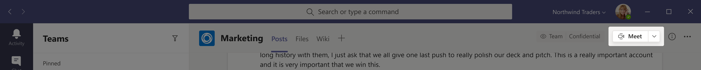

# Administrar directivas de reunión en TeamsManage meeting policies in Teams

::: zone target="docs"
Las directivas de reunión se usan para controlar las características que están disponibles para los participantes de la reunión para las reuniones programadas por los usuarios de su organización.Meeting policies are used to control the features that are available to meeting participants for meetings that are scheduled by users in your organization. Después de crear una directiva y realizar los cambios, puede asignar usuarios a la Directiva.After you create a policy and make your changes, you can then assign users to the policy. Las directivas de reunión se administran en el centro de administración de Microsoft Teams o [mediante PowerShell](teams-powershell-overview.md).You manage meeting policies in the Microsoft Teams admin center or by [using PowerShell](teams-powershell-overview.md).

Puede implementar directivas de las siguientes maneras, que afectan a la experiencia de la reunión para los usuarios antes de que se inicie una reunión, durante una reunión o después de una reunión.You can implement policies in the following ways, which affect the meeting experience for users before a meeting starts, during a meeting, or after a meeting. 

|Tipo de implementaciónImplementation type  |DescripciónDescription  |
|---------|---------|
|Por organizadorPer-organizer    |Al implementar una directiva por organizador, todos los participantes de la reunión heredan la Directiva del organizador.When you implement a per-organizer policy, all meeting participants inherit the policy of the organizer. Por ejemplo, **admitir automáticamente a personas** es una directiva para el organizador y controla si los usuarios se unen a la reunión directamente o espera en la sala de espera para las reuniones programadas por el usuario al que se le asigna la Directiva.For example, **Automatically admit people** is a per-organizer policy and controls whether users join the meeting directly or wait in the lobby for meetings scheduled by the user who is assigned the policy.          |
|Por usuarioPer-user    |Al implementar una directiva por usuario, solo se aplica la Directiva por usuario para restringir determinadas características para el organizador o los participantes de la reunión.When you implement a per-user policy, only the per-user policy applies to restrict certain features for the organizer and/or meeting participants. Por ejemplo, **permitir reunirse ahora** es una directiva por usuario.For example, **Allow Meet now** is a per-user policy.     |
|Por organizador y por usuarioPer-organizer and per-user     |Al implementar una combinación de una directiva por organizador y por usuario, ciertas características están restringidas para los participantes de la reunión en función de su Directiva y la Directiva del organizador.When you implement a combination of a per-organizer and per-user policy, certain features are restricted for meeting participants based on their policy and the organizer's policy. Por ejemplo, **permitir la grabación en la nube** es una directiva por organizador y por usuario.For example, **Allow cloud recording** is a per-organizer and per-user policy. Active esta configuración para permitir que el organizador de la reunión y los participantes inicien y detengan una grabación.Turn on this setting to allow the meeting organizer and participants to start and stop a recording. 

De forma predeterminada, se crea una directiva denominada global (opción predeterminada para toda la organización).By default, a policy named Global (org-wide default) is created. A todos los usuarios de su organización se les asignará esta directiva de reunión de forma predeterminada.All users in your organization will be assigned this meeting policy by default. Puede realizar cambios en esta Directiva o crear una o más directivas personalizadas y asignarles usuarios.You can either make changes to this policy or create one or more custom policies and assign users to them. Al crear una directiva personalizada, puede permitir o impedir que determinadas características estén disponibles para los usuarios y, a continuación, asignarlas a uno o más usuarios a los que se les aplicará la configuración.When you create a custom policy, you can allow or prevent certain features from being available to your users, and then assign it to one or more users who will have the settings applied to them. 

## Cambiar o crear una directiva de reuniónChange or create a meeting policy

Para cambiar o crear una directiva de reunión, vaya al centro de administración de Microsoft Teams >**las directivas de reunión**de **reuniones** > .To change or create a meeting policy, go to the Microsoft Teams admin center > **Meetings** > **Meeting policies**. Seleccione una directiva de la lista o seleccione **nueva Directiva**.Select a policy from the list or select **New policy**. Si va a crear una nueva Directiva, agregue un nombre y una descripción.If you're creating a new policy, add a name and description. El nombre no puede contener caracteres especiales ni tener más de 64 caracteres.The name can't contain special characters or be longer than 64 characters. Elija la configuración y, a continuación, seleccione **Guardar**.Choose your settings, and then select **Save**.

Por ejemplo, supongamos que tiene un conjunto de usuarios y quiere limitar la cantidad de ancho de banda que requeriría la reunión.For example, say you have a bunch of users and you want to limit the amount of bandwidth that their meeting would require. Debe crear una nueva directiva personalizada denominada "ancho de banda limitado" y deshabilitar las siguientes opciones de configuración:You would create a new custom policy named "Limited bandwidth" and disable the following settings:

En **Audio & vídeo**:Under **Audio & video**:
- Desactivar la grabación en la nubeTurn off cloud recording
- Desactivar permitir vídeo IPTurn off Allow IP video

En **uso compartido de contenido**:Under **Content sharing**:
- Desactivar el modo de pantalla compartidaDisable screen sharing mode
- Desactivar whiteboardTurn off whiteboard
- Desactivar las notas compartidasTurn off shared notes

A continuación, asigne la Directiva a los usuarios.Then assign the policy to the users.

> [!NOTE] 
> A un usuario solo se le puede asignar una directiva de reunión a la vez.A user can be assigned only one meeting policy at a time. 

## Asignar una directiva de reunión a los usuariosAssign a meeting policy to users

Si está aplicando la Directiva a un usuario, seleccione **usuarios** en el panel de navegación izquierdo y, a continuación, haga clic en el nombre para mostrar del usuario.If you're applying the policy to one user, select **Users** on the left navigation pane, and then click the user's display name. En la página del usuario, junto a **directivas asignadas**, seleccione **Editar**.On the user's page, next to **Assigned policies**, select **Edit**. Después, en el panel **editar directivas de usuario** , en **Directiva de reunión**, seleccione la Directiva de la reunión en la lista desplegable y, a continuación, seleccione **Guardar**.Then, in the **Edit user policies** pane, under **Meeting policy**, select the meeting policy from the drop-down list, and then select **Save**. También puede asignar directivas de la lista de usuarios.You can also assign policies from the list of users. Para ello, seleccione el usuario haciendo clic a la izquierda del nombre para mostrar del usuario.To do this, select the user by clicking to the left of the user's display name. Seleccione **Editar configuración**.Select **Edit settings**. Después, en el panel **Editar configuración** , en **Directiva de reunión**, seleccione la Directiva de la lista desplegable y, a continuación, seleccione **Guardar**.Then, on the **Edit settings** pane, under **Meeting policy**, select the policy from the drop-down list, and then select **Save**. 
 
Si está aplicando una directiva a más de un usuario, seleccione **usuarios** en el panel de navegación izquierdo y, a continuación, seleccione cada usuario haciendo clic a la izquierda del nombre de usuario y, a continuación, haga clic en **Editar configuración**.If you're applying a policy to more than one user, select **Users** on the left navigation pane, and then select each user by clicking to the left of the user name, and then click **Edit settings**. En el panel **Editar configuración** , en **Directiva de reunión**, seleccione la Directiva de la lista desplegable y, a continuación, seleccione **Guardar**.On the **Edit Settings** pane, under **Meeting policy**, select the policy from the drop-down list, and then select **Save**.
 
También puede asignar una directiva de reunión a uno o más usuarios de la siguiente manera:You can also assign a meeting policy to one or more users as follows:

1. Vaya\*\*\*\* al **Centro** > de administración de Microsoft Teams**reuniones de reuniones** > .Go to **Microsoft Teams admin center** > **Meetings** > **Meeting policies**.
2. Seleccione la Directiva haciendo clic a la izquierda del nombre de la Directiva.Select the policy by clicking to the left of the policy name.
3. Seleccione **administrar usuarios**.Select **Manage users**.
4. En el panel **administrar usuarios** , busque el usuario por nombre para mostrar o por nombre de usuario, seleccione el nombre y, después, haga clic en **Agregar**.In the **Manage users** pane, search for the user by display name or by user name, select the name, and then select **Add**. Repita este paso para cada usuario que desee agregar.Repeat this step for each user that you want to add.
5. Cuando haya terminado de agregar usuarios, seleccione **Guardar**.When you're finished adding users, select **Save**.
 
> [!NOTE] 
> No puede eliminar una Directiva si los usuarios están asignados a ella.You can't delete a policy if users are assigned to it. Primero debe asignar una directiva diferente a todos los usuarios afectados y, después, puede eliminar la directiva original.You must first assign a different policy to all affected users, and then you can delete the original policy.
 
## Configuración de la Directiva de reuniónMeeting policy settings

Al seleccionar una directiva existente en la página **directivas** de la reunión o seleccionar **nueva Directiva** para agregar una nueva Directiva, puede establecer la configuración para lo siguiente.When you select an existing policy on the **Meeting policies** page or select **New policy** to add a new policy, you can configure settings for the following.

- [GeneralGeneral](#meeting-policy-settings---general)
- [Audio & vídeoAudio & video](#meeting-policy-settings---audio--video)
- [Uso compartido de contenidoContent sharing](#meeting-policy-settings---content-sharing)
- [Participantes & invitadosParticipants & guests](#meeting-policy-settings---participants--guests)

::: zone-end 

## Configuración de la Directiva de reunión: GeneralMeeting policy settings - General

- [Permitir reunirse ahora en los canalesAllow Meet now in channels](#allow-meet-now-in-channels)
- [Permitir reunirse ahora (próximamente)Allow private Meet now (coming soon)](#allow-private-meet-now-coming-soon)
- [Permitir el complemento de OutlookAllow the Outlook add-in](#allow-the-outlook-add-in)
- [Permitir programación de reuniones de canalAllow channel meeting scheduling](#allow-channel-meeting-scheduling)
- [Permitir la programación de reuniones privadasAllow scheduling private meetings](#allow-scheduling-private-meetings)

### Permitir reunirse ahora en los canalesAllow Meet now in channels

Esta es una directiva por usuario y se aplica antes de que se inicie una reunión.This is a per-user policy and applies before a meeting starts. Esta configuración controla si un usuario puede iniciar una reunión ad-hoc en un canal de Teams.This setting controls whether a user can start an ad-hoc meeting in a Teams channel. Si activa esta opción, cuando un usuario publique un mensaje en un canal de Teams, el usuario podrá hacer clic en **reunirse ahora** debajo del cuadro de redacción para iniciar una reunión ad-hoc en el canal.If you turn this on, when a user posts a message in a Teams channel, the user can click **Meet now** beneath the compose box to start an ad-hoc meeting in the channel.

### Permitir reunirse ahora (próximamente)Allow private Meet now (coming soon)

Esta es una directiva por usuario y se aplica antes de que se inicie una reunión.This is a per-user policy and applies before a meeting starts. Esta configuración controla si un usuario puede iniciar una reunión privada ad hoc.This setting controls whether a user can start an ad hoc private meeting.  

### Permitir el complemento de OutlookAllow the Outlook add-in

Esta es una directiva por usuario y se aplica antes de que se inicie una reunión.This is a per-user policy and applies before a meeting starts. Esta opción controla si las reuniones de Teams se pueden programar desde Outlook (Windows, Mac, Web y móvil).This setting controls whether Teams meetings can be scheduled from within Outlook (Windows, Mac, web, and mobile).

Si desactiva esta opción, los usuarios no podrán programar reuniones de Teams al crear una reunión en Outlook.If you turn this off, users are unable to schedule Teams meetings when they create a new meeting in Outlook. Por ejemplo, en Outlook en Windows, la **nueva** opción de reunión de equipos no se mostrará en la cinta de opciones.For example, in Outlook on Windows, the **New Teams Meeting** option won't show up in the ribbon.

### Permitir programación de reuniones de canalAllow channel meeting scheduling

Esta es una directiva por usuario y se aplica antes de que se inicie una reunión.This is a per-user policy and applies before a meeting starts. Esta configuración controla si los usuarios pueden programar una reunión en un canal de Teams.This setting controls whether users can schedule a meeting in a Teams channel.  Si desactiva esta opción, la opción **programar una reunión** no estará disponible para el usuario cuando inicie una reunión en un canal de Teams y la opción **seleccionar un canal para reunirse** no estará disponible para el usuario cuando programe una reunión de reuniones en Teams.If you turn this off, the **Schedule a meeting** option won't be available to the user when they start a meeting in a Teams channel and the **Select a channel to meet** option won't be available to the user when they schedule a meeting from Meetings in Teams.

### Permitir la programación de reuniones privadasAllow scheduling private meetings

Esta es una directiva por usuario y se aplica antes de que se inicie una reunión.This is a per-user policy and applies before a meeting starts. Esta opción controla si los usuarios pueden programar reuniones privadas en Teams.This setting controls whether users can schedule private meetings in Teams. Una reunión es privada cuando no se publica en un canal de un equipo.A meeting is private when it's not published to a channel in a team.

Tenga en cuenta que si desactiva permitir la programación de **reuniones privadas** y **permitir la programación de reuniones de canal**, la opción **programar una reunión** no estará disponible y los usuarios no podrán programar reuniones en Teams.Note that if you turn off **Allow scheduling private meetings** and **Allow channel meeting scheduling**,  the **Schedule a meeting** option won't be available and users will be unable to schedule meetings in Teams.

## Configuración de la Directiva de reunión: vídeo & de audioMeeting policy settings - Audio & video

- [Permitir la transcripciónAllow transcription](#allow-transcription)
- [Permitir la grabación en la nubeAllow cloud recording](#allow-cloud-recording)
- [Permitir video IPAllow IP video](#allow-ip-video)
- [Velocidad de bits multimedia (KB)Media bit rate (KBs)](#media-bit-rate-kbs)
- [Habilitar los subtítulos en vivo (próximamente)Enable live captions (coming soon)](#enable-live-captions-coming-soon)

### Permitir la transcripciónAllow transcription

Esta es una combinación de una directiva por organizador y por usuario.This is a combination of a per-organizer and per-user policy. Esta configuración controla si las características de subtítulos y transcripción están disponibles durante la reproducción de grabaciones de reunión.This setting controls whether captions and transcription features are available during playback of meeting recordings. Si desactiva esta opción, las opciones **Buscar** y **CC** no estarán disponibles durante la reproducción de una grabación de reunión.If you turn this off, the **Search** and **CC** options won't be available during playback of a meeting recording. La persona que inició la grabación necesita esta configuración activada para que la grabación también incluya transcripción.The person who started the recording needs this setting turned on so that the recording also includes transcription. 

Tenga en cuenta que la transcripción para las reuniones grabadas solo se admite en este momento para los usuarios que tienen el idioma de Teams establecido en inglés y cuando se habla de inglés en la reunión.Note that transcription for recorded meetings is currently only supported for users who have the language in Teams set to English and when English is spoken in the meeting.

### Permitir la grabación en la nubeAllow cloud recording

Esta es una combinación de una directiva por organizador y por usuario.This is a combination of a per-organizer and per-user policy. Esta configuración controla si las reuniones de este usuario se pueden grabar.This setting controls whether this user's meetings can be recorded. La grabación puede ser iniciada por el organizador de la reunión o por otro participante de la reunión si la configuración de directiva está activada para el participante y si es un usuario autenticado de la misma organización.The recording can be started by the meeting organizer or by another meeting participant if the policy setting is turned on for the participant and if they're an authenticated user from the same organization.

Las personas de fuera de su organización, como los usuarios federados y anónimos, no pueden iniciar la grabación.People outside your organization, such as federated and anonymous users, can't start the recording. Los usuarios invitados no pueden iniciar ni detener la grabación.Guest users can't start or stop the recording. 

Echemos un vistazo al ejemplo siguiente.Let's look at the following example.

|UsuarioUser |Política de reunionesMeeting policy  |Permitir la grabación en la nubeAllow cloud recording |
|---------|---------|---------|
|DanielaDaniela | GlobalGlobal   | FalseFalse |
|AmandaAmanda | Location1MeetingPolicyLocation1MeetingPolicy | TrueTrue|
|Juan (usuario externo)John (external user) | No aplicableNot applicable | No aplicableNot applicable|

Las reuniones organizadas por Daniela no se pueden grabar y Amanda, que tiene la configuración de directiva habilitada, no puede grabar reuniones organizadas por Daniela.Meetings organized by Daniela can't be recorded and Amanda, who has the policy setting enabled, can't record meetings organized by Daniela. Las reuniones organizadas por Amanda se pueden grabar, pero Daniela, que tiene la configuración de directiva deshabilitada y Juan es un usuario externo, no puede grabar reuniones organizadas por Amanda.Meetings organized by Amanda can be recorded, however,  Daniela, who has the policy setting disabled and John who is an external user, can't record meetings organized by Amanda.

Para obtener más información sobre la grabación de reuniones en la nube, vea [grabación de reuniones en la nube](cloud-recording.md)de Teams.To learn more about cloud meeting recording, see [Teams cloud meeting recording](cloud-recording.md).

### Permitir video IPAllow IP video

Esta es una combinación de una directiva por organizador y por usuario.This is a combination of a per-organizer and per-user policy. El vídeo es un componente clave de las reuniones.Video is a key component to meetings. En algunas organizaciones, los administradores pueden desear más control sobre las reuniones de los usuarios que tienen vídeo.In some organizations, admins might want more control over which users’ meetings have video. Esta opción controla si se puede activar el vídeo en reuniones hospedadas por un usuario y en llamadas de 1:1 y llamadas grupales iniciadas por un usuario.This setting controls whether video can be turned on in meetings hosted by a user and in 1:1 calls and group calls started by a user. Reuniones organizadas por un usuario que tiene habilitada esta Directiva, permitir el uso compartido de vídeos en la reunión por parte de los participantes de la reunión, si los participantes de la reunión también tienen la Directiva habilitada.Meetings organized by a user who has this policy enabled, allow video sharing in the meeting by the meeting participants, if the meeting participants also have the policy enabled. Los participantes de la reunión que no tienen ninguna directiva asignada (por ejemplo, participantes anónimos y federados) heredan la Directiva del organizador de la reunión.Meeting participants who don't have any policies assigned (for example, anonymous and federated participants) inherit the policy of the meeting organizer.

Echemos un vistazo al ejemplo siguiente.Let's look at the following example.

|UsuarioUser |Política de reunionesMeeting policy  |Permitir video IPAllow IP Video |
|---------|---------|---------|
|DanielaDaniela   | GlobalGlobal   | TrueTrue        |
|AmandaAmanda    | Location1MeetingPolicyLocation1MeetingPolicy        | FalseFalse      |

Las reuniones hospedadas por Daniela permiten que el vídeo esté activado.Meetings hosted by Daniela allow video to be turned on. Daniela puede unirse a la reunión y encender el video.Daniela can join the meeting and turn on video. Amanda no puede activar el video en la reunión de Daniela porque la Directiva de Amanda está configurada para no permitir el vídeo.Amanda can't turn on video in Daniela's meeting because Amanda’s policy is set to not allow video. Amanda puede ver vídeos compartidos por otros participantes de la reunión.Amanda can see videos shared by other participants in the meeting.

En las reuniones hospedadas por Amanda, nadie puede activar el video, independientemente de la Directiva de vídeo que se les haya asignado.In meetings hosted by Amanda, no one can turn on video, regardless of the video policy assigned to them. Esto significa que Daniela no puede activar el video en las reuniones de Amanda.This means Daniela can't turn on video in Amanda’s meetings.  

Si Daniela llama Amanda con video on, Amanda puede contestar la llamada solo con audio.If Daniela calls Amanda with video on, Amanda can answer the call with audio only.  Cuando la llamada está conectada, Amanda puede ver el vídeo de Daniela, pero no puede activar el vídeo.When the call is connected, Amanda can see Daniela’s video, but can't turn on video. Si Amanda llama a Daniela, Daniela puede responder a la llamada con video y audio.If Amanda calls Daniela, Daniela can answer the call with video and audio. Cuando la llamada está conectada, Daniela puede activar o desactivar el video, según sea necesario.When the call is connected, Daniela can turn on or turn off her video, as needed.

### Velocidad de bits multimedia (KB)Media bit rate (KBs)

Esta es una directiva por usuario.This is a per-user policy. Esta configuración determina la velocidad de bits de multimedia para las transtransmisións de uso compartido de aplicaciones de audio, vídeo y vídeo en llamadas y reuniones para el usuario.This setting determines the media bit rate for audio, video, and video-based app sharing transmissions in calls and meetings for the user. Se aplica a los usuarios de la llamada o a la reunión, tanto al vínculo ascendente como al enlace descendente multimedia.It's applied to both the uplink and downlink media traversal for users in the call or meeting. Esta configuración le da un control granular sobre la administración del ancho de banda de su organización.This setting gives you granular control over managing bandwidth in your organization. En función de los escenarios de reuniones requeridos por los usuarios, le recomendamos disponer de suficiente ancho de banda para obtener una experiencia de buena calidad.Depending on the meetings scenarios required by users, we recommend having enough bandwidth in place for a good quality experience. El valor mínimo es 30 Kbps y el valor máximo depende del escenario de la reunión.The minimum value is 30 Kbps and the maximum value depends on the meeting scenario. Para obtener más información sobre el ancho de banda mínimo recomendado para reuniones, llamadas y eventos en vivo de buena calidad en Teams, consulte [requisitos de ancho de banda](prepare-network.md#bandwidth-requirements).To learn more about the minimum recommended bandwidth for good quality meetings, calls, and live events in Teams, see [Bandwidth requirements](prepare-network.md#bandwidth-requirements).

Si no hay suficiente ancho de banda para una reunión, los participantes verán un mensaje que indica una mala calidad de la red.If there isn’t enough bandwidth for a meeting, participants see a message that indicates poor network quality.

Para las reuniones que necesitan una experiencia de video de la más alta calidad, como las reuniones de los paneles CEO y los equipos en vivo, le recomendamos que configure el ancho de banda en 10 Mbps.For meetings that need the highest quality video experience, such as CEO board meetings and Teams live events, we recommend you set the bandwidth to 10 Mbps. Incluso cuando se establece la experiencia máxima, la pila de medios de Teams se adapta a condiciones de ancho de banda bajo cuando se detectan ciertas condiciones de red, según el escenario.Even when the maximum experience is set, the Teams media stack adapts to low bandwidth conditions when certain network conditions are detected, depending on the scenario. 

### Habilitar los subtítulos en vivo (próximamente)Enable live captions (coming soon)

Esta es una directiva por usuario y se aplica durante una reunión.This is a per-user policy and applies during a meeting. Si esta configuración está activada, el usuario verá una opción para mostrar los títulos durante una reunión.If this setting is on, the user sees an option to display captions during a meeting.

## Configuración de la Directiva de reunión: uso compartido de contenidoMeeting policy settings - Content sharing

- [Modo de uso compartido de pantallaScreen sharing mode](#screen-sharing-mode)
- [Permitir que un participante pueda ceder o solicitar el controlAllow a participant to give or request control](#allow-a-participant-to-give-or-request-control)
- [Permitir que un participante externo pueda ceder o solicitar el controlAllow an external participant to give or request control](#allow-an-external-participant-to-give-or-request-control)
- [Permitir el uso compartido de PowerPointAllow PowerPoint sharing](#allow-powerpoint-sharing)
- [Permitir pizarraAllow whiteboard](#allow-whiteboard)
- [Permitir notas compartidasAllow shared notes](#allow-shared-notes)
- [Permitir la conversación en reuniones (próximamente)Allow chat in meetings (coming soon)](#allow-chat-in-meetings-coming-soon)

### Modo de uso compartido de pantallaScreen sharing mode

Esta es una combinación de una directiva por organizador y por usuario.This is a combination of a per-organizer and per-user policy. Esta configuración controla si el uso compartido de ventanas o de escritorio está permitido en la reunión del usuario.This setting controls whether desktop and/or window sharing is allowed in the user's meeting. Los participantes de la reunión que no tienen ninguna directiva asignada (por ejemplo, participantes anónimos, invitados, B2B y federados) heredan la Directiva del organizador de la reunión.Meeting participants who don't have any policies assigned (for example, anonymous, guest, B2B, and federated participants) inherit the policy of the meeting organizer.

|Valor de configuraciónSetting value |ComportamientoBehavior  |
|---------|---------|
|**Pantalla completa****Entire screen**    | El uso compartido de escritorio completo y el uso compartido de aplicaciones están permitidos en la reuniónFull desktop sharing and application sharing is allowed in the meeting |
|**Única aplicación****Single application**   | El uso compartido de aplicaciones está permitido en la reuniónApplication sharing is allowed in the meeting        |
|**Deshabilitado****Disabled**     |La pantalla compartida y el uso compartido de aplicaciones se han desactivado en la reunión.Screen sharing and application sharing turned off in the meeting.       |

Echemos un vistazo al ejemplo siguiente.Let's look at the following example.

|UsuarioUser |Política de reunionesMeeting policy |Modo de uso compartido de pantallaScreen sharing mode |
|---------|---------|---------|
|DanielaDaniela  | GlobalGlobal   | Pantalla completaEntire screen |
|AmandaAmanda   | Location1MeetingPolicyLocation1MeetingPolicy  | DeshabilitadoDisabled |

Las reuniones hospedadas por Daniela permiten a los participantes de la reunión compartir la pantalla completa o una aplicación específica.Meetings hosted by Daniela allow meeting participants to share their entire screen or a specific application. Si Amanda se une a la reunión de Daniela, Amanda no puede compartir su pantalla o una aplicación específica porque su configuración de directiva está deshabilitada.If Amanda joins Daniela’s meeting, Amanda can't share her screen or a specific application as her policy setting is disabled. En las reuniones hospedadas por Amanda, nadie puede compartir su pantalla o una sola aplicación, independientemente de la Directiva de modo de uso compartido de pantalla que se les haya asignado.In meetings hosted by Amanda, no one is allowed to share their screen or a single application, regardless of the screen sharing mode policy assigned to them. Esto significa que Daniela no puede compartir su pantalla o una sola aplicación en las reuniones de Amanda.This means that Daniela can't share her screen or a single application in Amanda’s meetings.  

Por el momento, los usuarios no pueden reproducir video ni compartir su pantalla en una reunión de Teams si usan Google Chrome.Currently, users can't play video or share their screen in a Teams meeting if they're using Google Chrome.

### Permitir que un participante pueda ceder o solicitar el controlAllow a participant to give or request control

Esta es una directiva por usuario.This is a per-user policy. Esta configuración controla si el usuario puede ceder el control del escritorio o de la ventana compartidos a otros participantes de la reunión.This setting controls whether the user can give control of the shared desktop or window to other meeting participants. Para darle el control, mantenga el mouse sobre la parte superior de la pantalla.To give control, hover over the top of the screen. 

Si esta configuración está activada para el usuario, la opción **ceder el control** se muestra en la barra superior de una sesión compartida.If this setting is turned on for the user, the **Give Control** option is displayed in the top bar in a sharing session. 

Si la configuración está desactivada para el usuario, la opción **ceder el control** no está disponible.If the settings is turned off for the user, the **Give Control** option isn't available.

Echemos un vistazo al ejemplo siguiente.Let's look at the following example.

|UsuarioUser |Política de reunionesMeeting policy  |Permitir al participante ceder o solicitar el controlAllow participant to give or request control |
|---------|---------|---------|
|DanielaDaniela   | GlobalGlobal   | TrueTrue       |
|BabekBabek    | Location1MeetingPolicyLocation1MeetingPolicy        | FalseFalse   |

Daniela puede ceder el control del escritorio o de la ventana compartidos a otros participantes de una reunión organizada por Babek mientras que Babek no puede ceder el control a otros participantes.Daniela can give control of the shared desktop or window to other participants in a meeting organized by Babek whereas Babek can't give control to other participants.

### Permitir que un participante externo pueda ceder o solicitar el controlAllow an external participant to give or request control

Esta es una directiva por usuario.This is a per-user policy. Esta opción controla si los participantes externos de una reunión pueden ceder el control de su escritorio o ventana compartidos a otros participantes de la reunión.This setting controls whether external participants in a meeting can give control of their shared desktop or window to other participants in the meeting. Los participantes externos de las reuniones de Teams se pueden clasificar de la siguiente manera:External participants in Teams meetings can be categorized as follows:  

   - Usuario anónimoAnonymous user
   - Usuarios invitadosGuest users  
   - Usuario B2BB2B user
   - Usuario federadoFederated user  

Si los usuarios federados pueden ceder el control a usuarios externos mientras lo comparten está controlado por la configuración de **permitir que un participante externo le dé o solicite** la configuración de control de su organización.Whether federated users can give control to external users while sharing is controlled by the **Allow an external participant to give or request control** setting in their organization.

### Permitir el uso compartido de PowerPointAllow PowerPoint sharing

Esta es una directiva por usuario.This is a per-user policy. Esta configuración controla si el usuario puede compartir diapositivas de PowerPoint en una reunión.This setting controls whether the user can share PowerPoint slide decks in a meeting. Los usuarios externos, incluidos los anónimos, los invitados y los usuarios federados, heredan la Directiva del organizador de la reunión.External users, including anonymous, guest, and federated users, inherit the policy of the meeting organizer.

Echemos un vistazo al ejemplo siguiente.Let's look at the following example.

|UsuarioUser |Política de reunionesMeeting policy  |Permitir el uso compartido de PowerPointAllow PowerPoint sharing |
|---------|---------|---------|
|DanielaDaniela   | GlobalGlobal   | TrueTrue       |
|AmandaAmanda   | Location1MeetingPolicyLocation1MeetingPolicy        | FalseFalse   |

Amanda puede compartir diapositivas de PowerPoint en reuniones incluso si es el organizador de la reunión.Amanda can't share PowerPoint slide decks in meetings even if she's the meeting organizer. Daniela puede compartir las diapositivas de PowerPoint incluso si la reunión está organizada por Amanda.Daniela can share PowerPoint slide decks even if the meeting is organized by Amanda. Amanda puede ver los decks de diapositivas de PowerPoint compartidos por otros usuarios de la reunión, aunque no pueda compartir diapositivas de PowerPoint.Amanda can view the PowerPoint slide decks shared by others in the meeting, even though she can't share PowerPoint slide decks.

### Permitir pizarraAllow whiteboard

Esta es una directiva por usuario.This is a per-user policy. Esta configuración controla si un usuario puede compartir la pizarra en una reunión.This setting controls whether a user can share the whiteboard in a meeting. Los usuarios externos, incluidos los usuarios anónimos, B2B y federados, heredan la Directiva del organizador de la reunión.External users, including anonymous, B2B, and federated users, inherit the policy of the meeting organizer. 

Echemos un vistazo al ejemplo siguiente.Let's look at the following example.

|UsuarioUser |Política de reunionesMeeting policy  |Permitir pizarraAllow whiteboard|
|---------|---------|---------|
|DanielaDaniela   | GlobalGlobal   | TrueTrue       |
|AmandaAmanda   | Location1MeetingPolicyLocation1MeetingPolicy        | FalseFalse   |

Amanda puede compartir la pizarra en una reunión incluso si es el organizador de la reunión.Amanda can't share the whiteboard in a meeting even if she's the meeting organizer. Daniela puede compartir la pizarra incluso si una reunión está organizada por Amanda.Daniela can share the whiteboard even if a meeting is organized by Amanda.  

### Permitir notas compartidasAllow shared notes

Esta es una directiva por usuario.This is a per-user policy. Esta configuración controla si un usuario puede crear y compartir notas en una reunión.This setting controls whether a user can create and share notes in a meeting. Los usuarios externos, incluidos los usuarios anónimos, B2B y federados, heredan la Directiva del organizador de la reunión.External users, including anonymous, B2B, and federated users, inherit the policy of the meeting organizer. Actualmente, la pestaña notas de la **reunión** solo se admite en reuniones que tengan menos de 20 participantes.The **Meeting Notes** tab is currently only supported in meetings that have less than 20 participants. 

Echemos un vistazo al ejemplo siguiente.Let's look at the following example.

|UsuarioUser |Política de reunionesMeeting policy  |Permitir notas compartidasAllow shared notes |
|---------|---------|---------|
|DanielaDaniela   | GlobalGlobal   | TrueTrue       |
|AmandaAmanda   | Location1MeetingPolicyLocation1MeetingPolicy | FalseFalse |

Daniela puede tomar notas en las reuniones de Amanda y Amanda no puede tomar notas en ninguna reunión.Daniela can take notes in Amanda's meetings and Amanda can't take notes in any meetings.

### Permitir la conversación en reuniones (próximamente)Allow chat in meetings (coming soon)

Esta es una directiva por organizador.This is a per-organizer policy. Esta opción controla si se permite la conversación de la reunión en la reunión del usuario.This setting controls whether meeting chat is allowed in the user's meeting. 

## Configuración de la Directiva de reunión: participantes & invitadosMeeting policy settings - Participants & guests

Esta configuración controla los participantes de la reunión en la sala de espera antes de que se admitan en la reunión y el nivel de participación permitido en una reunión.These settings control which meeting participants wait in the lobby before they are admitted to the meeting and the level of participation they are allowed in a meeting.

- [Admitir automáticamente personasAutomatically admit people](#automatically-admit-people)
- [Permitir que usuarios anónimos inicien una reuniónAllow anonymous people to start a meeting](#allow-anonymous-people-to-start-a-meeting)
- [Permitir que los usuarios de acceso telefónico omitan la sala de recepciónAllow dial-in users to bypass the lobby](#allow-dial-in-users-to-bypass-the-lobby-coming-soon)
- [Permitir que los organizadores invaliden la configuración de la salaAllow organizers to override lobby settings](#allow-organizers-to-override-lobby-settings-coming-soon)

> [!NOTE]
>Las opciones para unirse a una reunión variarán en función de la configuración de cada grupo de equipos y del método de conexión.Options to join a meeting will vary, depending on the settings for each Teams group, and the connection method. Si su grupo tiene audioconferencias y lo usa para conectarse, consulte [audioconferencias en Office 365](https://docs.microsoft.com/microsoftteams/audio-conferencing-in-office-365).If your group has audio conferencing, and uses it to connect, see [Audio Conferencing in Office 365](https://docs.microsoft.com/microsoftteams/audio-conferencing-in-office-365). Si su grupo de equipos no tiene audioconferencia, consulte unirse a [una reunión en Teams](https://support.office.com/article/join-a-meeting-in-teams-1613bb53-f3fa-431e-85a9-d6a91e3468c9).If your Teams group does not have audio conferencing, refer to [Join a meeting in Teams](https://support.office.com/article/join-a-meeting-in-teams-1613bb53-f3fa-431e-85a9-d6a91e3468c9).

### Admitir automáticamente personasAutomatically admit people

Esta es una directiva por organizador.This is a per-organizer policy. Esta opción controla si los usuarios pueden unirse a una reunión directamente o aguardar en la sala de espera hasta que un usuario autenticado las admita.This setting controls whether people join a meeting directly or wait in the lobby until they are admitted by an authenticated user.

 Los organizadores de reuniones pueden hacer clic en **Opciones de reunión** en la invitación a la reunión para cambiar esta configuración para cada reunión que programe.Meeting organizers can click **Meeting Options** in the meeting invitation to change this setting for each meeting they schedule. **(próximamente)****(coming soon)**
  
|Valor de configuraciónSetting value  |Comportamiento de combinaciónJoin behavior |
|---------|---------|
|**Todos****Everyone**   |Todos los participantes de la reunión se unen directamente desde la sala de espera.All meeting participants join the meeting directly without waiting in the lobby. Esto incluye usuarios autenticados, usuarios federados, invitados, usuarios anónimos y personas que llaman por teléfono.This includes authenticated users, federated users, guests, anonymous users, and people who dial in by phone.       |
|**Todas las personas de la organización y las organizaciones federadas****Everyone in your organization and federated organizations**     |Los usuarios autenticados dentro de la organización, incluidos los usuarios invitados y los usuarios de organizaciones federadas, se unen a la reunión directamente, sin tener que esperar en la sala de espera.Authenticated users within the organization, including guest users and the users from federated organizations, join the meeting directly without waiting in the lobby.  Los usuarios anónimos y los usuarios que han marcado por teléfono esperan en la sala de espera.Anonymous users and users who dial in by phone wait in the lobby.   |
|**Todas las personas de su organización****Everyone in your organization**    |Los usuarios autenticados de la organización, incluidos los invitados, se unen a la reunión directamente, sin tener que esperar en la sala de espera.Authenticated users from within the organization, including guest users, join the meeting directly without waiting in the lobby.  Los usuarios federados, los usuarios anónimos y los usuarios que marcan por teléfono esperan en la sala de espera.Federated users, anonymous users, and users who dial in by phone wait in the lobby.           |

### Permitir que usuarios anónimos inicien una reuniónAllow anonymous people to start a meeting

Esta es una directiva por organizador.This is a per-organizer policy. Esta configuración controla si los usuarios anónimos, como B2B, y los usuarios federados, pueden unirse a la reunión del usuario sin un usuario autenticado de la organización en la asistencia.This setting controls whether anonymous people, including B2B, and federated users, can join the user's meeting without an authenticated user from the organization in attendance. 

Este es el comportamiento de combinación de personas anónimas cuando hay usuarios autenticados en la reunión.Here's the join behavior of anonymous people when authenticated users are present in the meeting.

|Permitir que usuarios anónimos inicien una reuniónAllow anonymous people to start a meeting  |Admitir automáticamente personasAutomatically admit people |Unirse al comportamiento de personas anónimasJoin behavior of anonymous people |
|---------|---------|---------|
|TrueTrue    | TodosEveryone      | Unirse directamenteJoin directly         |
|   | Todas las personas de su organizaciónEveryone in your organization       | Esperar en la sala de esperaWait in lobby        |
|   | Todas las personas de la organización y las organizaciones federadasEveryone in your organization and federated organizations       | Esperar en la sala de esperaWait in lobby         |
|FalseFalse    | TodosEveryone        | Unirse directamenteJoin directly        |
|   | Todas las personas de su organizaciónEveryone in your organization     | Esperar en la sala de esperaWait in lobby        |
|   | Todas las personas de la organización y las organizaciones federadasEveryone in your organization and federated organizations      | Esperar en la sala de esperaWait in lobby         |

Este es el comportamiento de unirse a personas anónimas cuando no hay usuarios autenticados en la reunión.Here's the join behavior of anonymous people when no authenticated users are present in the meeting.

|Permitir que usuarios anónimos inicien una reuniónAllow anonymous people to start a meeting |Admitir automáticamente personasAutomatically admit people  |Unirse al comportamiento de personas anónimasJoin behavior of anonymous people |
|---------|---------|---------|
|TrueTrue    | TodosEveryone      | Unirse directamenteJoin directly         |
|   | Todas las personas de su organizaciónEveryone in your organization       | Esperar en la sala de esperaWait in lobby        |
|   | Todas las personas de la organización y las organizaciones federadasEveryone in your organization and federated organizations       | Esperar en la sala de esperaWait in lobby         |
|FalseFalse    | TodosEveryone        | Espere en la sala.Wait in lobby. Los usuarios se admiten automáticamente cuando el primer usuario autenticado se une a la reunión.Users are automatically admitted when the first authenticated user joins the meeting.        |
|   | Todas las personas de su organizaciónEveryone in your organization     |Esperar en la sala de esperaWait in lobby         |
|   | Todas las personas de la organización y las organizaciones federadasEveryone in your organization and federated organizations      | Esperar en la sala de esperaWait in lobby         |

### Permitir que los usuarios de acceso telefónico omitan la sala de recepción (próximamente)Allow dial-in users to bypass the lobby (coming soon)

Esta es una directiva por organizador.This is a per-organizer policy. Esta opción controla si las personas que marcan por teléfono se unen a la reunión directamente o esperan en la sala independientemente de la configuración **admitir automáticamente** a los usuarios.This setting controls whether people who dial in by phone join the meeting directly or wait in the lobby regardless of the **Automatically admit people** setting.

Este es el comportamiento de la Unión de las personas que llaman por teléfono.Here's the join behavior of people who dial in by phone.

|Permitir que los usuarios de acceso telefónico omitan la sala de recepciónAllow dial-in users to bypass the lobby  |Admitir automáticamente usuariosAutomatically admit users  |Unirse al comportamiento de las personas que llamanJoin behavior of people who dial in |
|---------|---------|---------|
|TrueTrue    | TodosEveryone      | Unirse directamenteJoin directly         |
|   | Todas las personas de su organizaciónEveryone in your organization       | Unirse directamenteJoin directly        |
|   | Todas las personas de la organización y las organizaciones federadasEveryone in your organization and federated organizations       | Unirse directamenteJoin directly         |
|FalseFalse    | TodosEveryone        | Unirse directamenteJoin directly        |
|   | Todas las personas de su organizaciónEveryone in your organization     |Esperar en la sala de esperaWait in lobby         |
|   | Todas las personas de la organización y las organizaciones federadasEveryone in your organization and federated organizations      | Esperar en la sala de esperaWait in lobby         |

### Permitir que los organizadores invaliden la configuración del vestíbulo (próximamente)Allow organizers to override lobby settings (coming soon)

Esta es una directiva por organizador.This is a per-organizer policy. Esta opción controla si el organizador de la reunión puede invalidar la configuración del vestíbulo que un administrador ha establecido en **admitir automáticamente** a los **usuarios y permitir que los usuarios de acceso telefónico omitan la sala de recepción** cuando programen una nueva reunión.This setting controls whether the meeting organizer can override the lobby settings that an admin set in **Automatically admit people** and **Allow dial-in users to bypass the lobby** when they schedule a new meeting. 

Los organizadores de reuniones pueden hacer clic en **Opciones de reunión** en la invitación a la reunión para cambiar la configuración de la sala de reuniones para cada reunión que programe.Meeting organizers can click **Meeting Options** in the meeting invitation to change lobby settings for each meeting they schedule. 

A continuación se explica cómo esta configuración determina si el organizador de la reunión puede cambiar la configuración de **admisión automática de personas** para cada reunión de la programación del organizador.Here's how this setting affects whether the meeting organizer can change the **Automatically admit people** setting for each meeting the organizer schedules.

|Permitir que los organizadores invaliden la configuración de la salaAllow organizers to override lobby settings  |Admitir automáticamente personasAutomatically admit people  |ComportamientoBehavior |
|---------|---------|---------|
|TrueTrue    | TodosEveryone      | Organizer puede cambiar la configuración a cualquier otro valor.Organizer can change the setting to any other value. |
|   | Todas las personas de su organizaciónEveryone in your organization       | Organizer puede cambiar la configuración a cualquier otro valor.Organizer can change the setting to any other value.|
|   | Todas las personas de la organización y las organizaciones federadasEveryone in your organization and federated organizations       | Organizer puede cambiar este valor a cualquier otro valor.Organizer can change this to any other value.         |
|FalseFalse    | TodosEveryone        | Organizer puede cambiar la configuración a cualquier otro valor.Organizer can change the setting to any other value.|
|   | Todas las personas de su organizaciónEveryone in your organization     |Organizer puede cambiar la configuración a **todos los usuarios de su organización**.Organizer can change the setting to **Everyone in your organization**. |
|   | Todas las personas de la organización y las organizaciones federadasEveryone in your organization and federated organizations      | Organizer no puede anular la configuración de la sala de recepción.Organizer can't override the lobby setting. |

A continuación se explica cómo esta configuración afecta si el organizador de la reunión puede cambiar el modo en **que los usuarios de acceso telefónico omiten la** configuración de la sala de reuniones para cada reunión de la programación del organizador.Here's how this setting affects whether the meeting organizer can change the **Allow dial-in users to bypass the lobby** setting for each meeting the organizer schedules.
    
|Permitir que los organizadores invaliden la configuración de la salaAllow organizers to override lobby settings  |Permitir que los usuarios de acceso telefónico omitan la sala de recepciónAllow dial-in users to bypass the lobby  |ComportamientoBehavior |
|---------|---------|---------|
|TrueTrue    |  TrueTrue        | Organizer puede cambiar la configuración a false.Organizer can change the setting to False.       |
|TrueTrue      | FalseFalse         | Organizer puede cambiar la configuración a true.Organizer can change the setting to True.        |
|FalseFalse     | TrueTrue        |Organizer puede cambiar la configuración a false.Organizer can change the setting to False.         |
|FalseFalse      |FalseFalse          |Organizer no puede anular la configuración de la sala de recepción y no permite que los usuarios de acceso telefónico omitan la sala de recepción en la reunión.Organizer can't override the lobby setting and can't allow dial-in users to bypass the lobby in the meeting.        |

[Artículo completoFull article](meeting-policies-in-teams.md)

## Temas relacionadosRelated topics
[Directivas de mensajería en TeamsMessaging policies in Teams](messaging-policies-in-teams.md)
