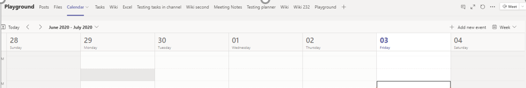

# Administrar directivas de reunión en TeamsManage meeting policies in Teams

::: zone target="docs"
Las Directivas de reunión se usan para controlar las características disponibles para sus participantes en reuniones programadas por usuarios de la organización.Meeting policies are used to control the features that are available to meeting participants for meetings that are scheduled by users in your organization. Puede usar la directiva global (predeterminada para toda la organización) que se crea automáticamente o crear y asignar directivas personalizadas.You can use the global (Org-wide default) policy that's automatically created or create and assign custom policies. Las directivas de reunión se administran en el centro de administración de Microsoft Teams o mediante [PowerShell](teams-powershell-overview.md).You manage meeting policies in the Microsoft Teams admin center or by using [PowerShell](teams-powershell-overview.md).

> [!NOTE]
> Para obtener información sobre el uso de roles para administrar los permisos de moderadores y asistentes de reuniones, vea [roles de una reunión de Teams](https://support.microsoft.com/office/roles-in-a-teams-meeting-c16fa7d0-1666-4dde-8686-0a0bfe16e019?ui=en-us&rs=en-us&ad=us).For information about using roles to manage the permissions of meeting presenters and attendees, see [Roles in a Teams meeting](https://support.microsoft.com/office/roles-in-a-teams-meeting-c16fa7d0-1666-4dde-8686-0a0bfe16e019?ui=en-us&rs=en-us&ad=us).

Puede implementar directivas de las siguientes maneras, que afectan a la experiencia de la reunión para los usuarios antes de que se inicie una reunión, durante una reunión o después de una reunión.You can implement policies in the following ways, which affect the meeting experience for users before a meeting starts, during a meeting, or after a meeting.

|Tipo de implementaciónImplementation type  |DescripciónDescription  |
|---------|---------|
|Por organizadorPer-organizer    |Al implementar una directiva por organizador, todos los participantes de la reunión heredan la Directiva del organizador.When you implement a per-organizer policy, all meeting participants inherit the policy of the organizer. Por ejemplo, **admitir automáticamente a personas** es una directiva para el organizador y controla si los usuarios se unen a la reunión directamente o espera en la sala de espera para las reuniones programadas por el usuario al que se le asigna la Directiva.For example, **Automatically admit people** is a per-organizer policy and controls whether users join the meeting directly or wait in the lobby for meetings scheduled by the user who is assigned the policy.          |
|Por usuarioPer-user    |Al implementar una directiva por usuario, solo se aplica la Directiva por usuario para restringir determinadas características para el organizador o los participantes de la reunión.When you implement a per-user policy, only the per-user policy applies to restrict certain features for the organizer and/or meeting participants. Por ejemplo, **permitir reunirse ahora en canales** es una directiva por usuario.For example, **Allow Meet now in channels** is a per-user policy.     |
|Por organizador y por usuarioPer-organizer and per-user     |Al implementar una combinación de una directiva por organizador y por usuario, ciertas características están restringidas para los participantes de la reunión en función de su Directiva y la Directiva del organizador.When you implement a combination of a per-organizer and per-user policy, certain features are restricted for meeting participants based on their policy and the organizer's policy. Por ejemplo, **permitir la grabación en la nube** es una directiva por organizador y por usuario.For example, **Allow cloud recording** is a per-organizer and per-user policy. Active esta configuración para permitir que el organizador de la reunión y los participantes inicien y detengan una grabación.Turn on this setting to allow the meeting organizer and participants to start and stop a recording.

Puede editar la configuración en la directiva global o crear y asignar una o más directivas personalizadas.You can edit the settings in the global policy or create and assign one or more custom policies. Los usuarios recibirán la directiva global a menos que cree y asigne una directiva personalizada.Users will get the global policy unless you create and assign a custom policy.

> [!NOTE]
> El botón detalles de la reunión estará disponible si un usuario tiene habilitadas las licencias de conferencia de audio o si el usuario permite conferencias de audio, de lo contrario, los detalles de la reunión no estarán disponibles.Meeting details button will be available if a user has the audio conference licenses enabled or the user is allow for audio conferencing, if not, the meeting details will not be available.

## Crear una directiva de reunión personalizadaCreate a custom meeting policy

1. En el centro de navegación izquierdo del centro de administración de Microsoft Teams, vaya a directivas de reunión de **reuniones**  >  **Meeting policies**.In the left navigation of the Microsoft Teams admin center, go to **Meetings** > **Meeting policies**.
2. Haga clic en **Agregar**.Click **Add**.
3. Escriba un nombre y una descripción para la directiva.Enter a name and description for the policy. El nombre no puede contener caracteres especiales ni tener más de 64 caracteres.The name can't contain special characters or be longer than 64 characters.
4. Elija la configuración que desee.Choose the settings that you want.
5. Haga clic en \*\*Guardar \*\*.Click **Save**.

Por ejemplo, supongamos que tiene un grupo de usuarios y quiere limitar el ancho de banda que necesitaría la reunión.For example, say you have a bunch of users and you want to limit the amount of bandwidth that their meeting would require. Cree una nueva directiva personalizada denominada "ancho de banda limitado" y deshabilite las opciones siguientes:You would create a new custom policy named "Limited bandwidth" and disable the following settings:

En **Audio y vídeo**:Under **Audio & video**:

- Desactive Permitir la grabación en la nube.Turn off Allow cloud recording.
- Desactive Permitir vídeo IP.Turn off Allow IP video.

En **Uso compartido de contenido**:Under **Content sharing**:

- Desactive el modo de uso compartido de la pantalla.Disable screen sharing mode.
- Desactive Permitir pizarra.Turn off Allow whiteboard.
- Desactive Permitir notas compartidas.Turn off Allow shared notes.

Luego asigne la directiva a los usuarios:Then assign the policy to the users.

## Editar una directiva de reuniónEdit a meeting policy

Puede editar la directiva global en cualquier directiva personalizada que cree.You can edit the global policy an any custom policies that you create.

1. En el centro de navegación izquierdo del centro de administración de Microsoft Teams, vaya a directivas de reunión de **reuniones**  >  **Meeting policies**.In the left navigation of the Microsoft Teams admin center, go to **Meetings** > **Meeting policies**.
2. Seleccione la Directiva haciendo clic a la izquierda del nombre de la Directiva y, a continuación, haga clic en **Editar**.Select the policy by clicking to the left of the policy name, and then click **Edit**.
3. Desde aquí, realice los cambios que desee.From here, make the changes that you want.
4. Haga clic en \*\*Guardar \*\*.Click **Save**.

> [!NOTE]
> A un usuario solo se le puede asignar una directiva de reunión a la vez.A user can be assigned only one meeting policy at a time.

## Asignar una directiva de reunión a los usuariosAssign a meeting policy to users

[!INCLUDE [assign-policy](includes/assign-policy.md)]

> [!NOTE]
> No puede eliminar una Directiva si los usuarios están asignados a ella.You can't delete a policy if users are assigned to it. Primero debe asignar una directiva diferente a todos los usuarios afectados y, después, puede eliminar la directiva original.You must first assign a different policy to all affected users, and then you can delete the original policy.

## Configuración de la Directiva de reuniónMeeting policy settings

Cuando selecciona una directiva existente en la página **directivas** de la reunión o selecciona **Agregar** para agregar una nueva Directiva, puede establecer la configuración para lo siguiente.When you select an existing policy on the **Meeting policies** page or select **Add** to add a new policy, you can configure settings for the following.

- [GeneralGeneral](#meeting-policy-settings---general)
- [Audio & vídeoAudio & video](#meeting-policy-settings---audio--video)
- [Uso compartido de contenidoContent sharing](#meeting-policy-settings---content-sharing)
- [Participantes & invitadosParticipants & guests](#meeting-policy-settings---participants--guests)

::: zone-end

## Configuración de la Directiva de reunión: GeneralMeeting policy settings - General

- [Permitir reunirse ahora en los canalesAllow Meet now in channels](#allow-meet-now-in-channels)
- [Permitir el complemento de OutlookAllow the Outlook add-in](#allow-the-outlook-add-in)
- [Permitir programación de reuniones de canalAllow channel meeting scheduling](#allow-channel-meeting-scheduling)
- [Permitir la programación de reuniones privadasAllow scheduling private meetings](#allow-scheduling-private-meetings)
- [Permitir reunirse ahora en reuniones privadasAllow Meet now in private meetings](#allow-meet-now-in-private-meetings)

### Permitir reunirse ahora en los canalesAllow Meet now in channels

Esta es una directiva por usuario y se aplica antes de que se inicie una reunión.This is a per-user policy and applies before a meeting starts. Esta configuración controla si un usuario puede iniciar una reunión ad hoc en un canal de Teams.This setting controls whether a user can start an ad hoc meeting in a Teams channel. Si activa esta opción, cuando un usuario publique un mensaje en un canal de Teams, el usuario podrá hacer clic en **reunirse ahora** en el cuadro de redacción para iniciar una reunión ad hoc en el canal.If you turn this on, when a user posts a message in a Teams channel, the user can click **Meet now** under the compose box to start an ad hoc meeting in the channel. El valor predeterminado es True.The default value is True.

### Permitir el complemento de OutlookAllow the Outlook add-in

Esta es una directiva por usuario y se aplica antes de que se inicie una reunión.This is a per-user policy and applies before a meeting starts. Esta opción controla si las reuniones de Teams se pueden programar desde Outlook (Windows, Mac, Web y móvil).This setting controls whether Teams meetings can be scheduled from within Outlook (Windows, Mac, web, and mobile).

Si desactiva esta opción, los usuarios no podrán programar reuniones de Teams al crear una reunión en Outlook.If you turn this off, users are unable to schedule Teams meetings when they create a new meeting in Outlook. Por ejemplo, en Outlook en Windows, la **nueva** opción de reunión de equipos no se mostrará en la cinta de opciones.For example, in Outlook on Windows, the **New Teams Meeting** option won't show up in the ribbon.

### Permitir programación de reuniones de canalAllow channel meeting scheduling

Use la Directiva de AllowChannelMeetingScheduling existente para controlar los tipos de eventos que se pueden crear en los calendarios de canal del equipo.Use the existing AllowChannelMeetingScheduling policy to control the types of events that can be created on the team channel calendars. Esta es una directiva por usuario y se aplica antes de que se inicie una reunión.This is a per-user policy and applies before a meeting starts. Esta configuración controla si los usuarios pueden programar una reunión en un canal de Teams.This setting controls whether users can schedule a meeting in a Teams channel. El valor predeterminado es True.The default value is True.

Si esta directiva está desactivada, los usuarios no podrán crear nuevas reuniones de canal.If this policy is OFF, users will not be able to create new channel meetings. Sin embargo, el organizador del evento puede editar las reuniones de canal existentes.However, existing channel meetings can be edited by the organizer of the event.

Programar una reunión se deshabilitará.Schedule a meeting will be disabled.

La selección de canal está deshabilitada.Channel selection is disabled.

En la página publicaciones del canal, se deshabilitarán los siguientes elementos:In the channel posts page, the following will be disabled:

- Botón **programar una reunión** en el cuadro de redacción de respuesta del canal.**Schedule a meeting** button on the channel reply compose box.

- Botón **programar una reunión** en el encabezado del canal.**Schedule a meeting** button on the channel header.

En el calendario del canal:In the channel calendar:

- El botón **Agregar nuevo evento** en el encabezado del calendario del canal se deshabilitará.**Add new event** button on channel calendar header will be disabled.

- Los usuarios no podrán arrastrar y seleccionar un bloque de tiempo en el calendario de canal para crear una reunión de canal.Users will not be able to drag and select a time block on the channel calendar to create a channel meeting.
- Los usuarios no pueden usar métodos abreviados de teclado para crear una reunión en el calendario del canal.Users cannot use Keyboard shortcuts to create a meeting on the channel calendar.

En el centro de administración:In the Admin Center:

La aplicación de calendario del canal se mostrará en la sección **aplicaciones de Microsoft** del panel de administración para las directivas de permisos.The channel calendar app will show up under the **Microsoft apps** section in the admin panel for permission policies.

### Permitir la programación de reuniones privadasAllow scheduling private meetings

Esta es una directiva por usuario y se aplica antes de que se inicie una reunión.This is a per-user policy and applies before a meeting starts. Esta opción controla si los usuarios pueden programar reuniones privadas en Teams.This setting controls whether users can schedule private meetings in Teams. Una reunión es privada cuando no se publica en un canal de un equipo.A meeting is private when it's not published to a channel in a team.

Tenga en cuenta que si desactiva permitir la programación de **reuniones privadas** y **permitir la programación de reuniones de canal**, los usuarios de Teams deshabilitarán las opciones **agregar asistentes requeridos** y agregar opciones de **canal** .Note that if you turn off **Allow scheduling private meetings** and **Allow channel meeting scheduling**,  the **Add required attendees** and **Add channel** options are disabled for users in Teams. El valor predeterminado es True.The default value is True.

### Permitir reunirse ahora en reuniones privadasAllow Meet now in private meetings

Esta es una directiva por usuario y se aplica antes de que se inicie una reunión.This is a per-user policy and applies before a meeting starts. Esta configuración controla si un usuario puede iniciar una reunión privada ad hoc.This setting controls whether a user can start an ad hoc private meeting.  El valor predeterminado es True.The default value is True.

## Configuración de la Directiva de reunión: vídeo & de audioMeeting policy settings - Audio & video

- [Permitir la transcripciónAllow transcription](#allow-transcription)
- [Permitir la grabación en la nubeAllow cloud recording](#allow-cloud-recording)
- [Permitir vídeo IPAllow IP video](#allow-ip-video)
- [Velocidad de bits multimedia (KB)Media bit rate (Kbs)](#media-bit-rate-kbs)

### Permitir la transcripciónAllow transcription

Esta es una combinación de una directiva por organizador y por usuario.This is a combination of a per-organizer and per-user policy. Esta configuración controla si las características de subtítulos y transcripción están disponibles durante la reproducción de grabaciones de reunión.This setting controls whether captions and transcription features are available during playback of meeting recordings. Si desactiva esta opción, las opciones **Buscar** y **CC** no estarán disponibles durante la reproducción de una grabación de reunión.If you turn this off, the **Search** and **CC** options won't be available during playback of a meeting recording. La persona que inició la grabación necesita esta configuración activada para que la grabación también incluya transcripción.The person who started the recording needs this setting turned on so that the recording also includes transcription.

Tenga en cuenta que la transcripción para las reuniones grabadas solo se admite en este momento para los usuarios que tienen el idioma de Teams establecido en inglés y cuando se habla de inglés en la reunión.Note that transcription for recorded meetings is currently only supported for users who have the language in Teams set to English and when English is spoken in the meeting.

### Permitir la grabación en la nubeAllow cloud recording

Esta es una combinación de una directiva por organizador y por usuario.This is a combination of a per-organizer and per-user policy. Esta configuración controla si las reuniones de este usuario se pueden grabar.This setting controls whether this user's meetings can be recorded. La grabación puede ser iniciada por el organizador de la reunión o por otro participante de la reunión si la configuración de directiva está activada para el participante y si es un usuario autenticado de la misma organización.The recording can be started by the meeting organizer or by another meeting participant if the policy setting is turned on for the participant and if they're an authenticated user from the same organization.

Las personas de fuera de su organización, como los usuarios federados y anónimos, no pueden iniciar la grabación.People outside your organization, such as federated and anonymous users, can't start the recording. Los usuarios invitados no pueden iniciar ni detener la grabación.Guest users can't start or stop the recording.

Echemos un vistazo al ejemplo siguiente.Let's look at the following example.

|UsuarioUser |Directiva de reunionesMeeting policy  |Permitir la grabación en la nubeAllow cloud recording |
|---------|---------|---------|
|DanielaDaniela | GlobalGlobal   | FalsoFalse |
|AmandaAmanda | Location1MeetingPolicyLocation1MeetingPolicy | VerdaderoTrue|
|Juan (usuario externo)John (external user) | No aplicableNot applicable | No aplicableNot applicable|

Las reuniones organizadas por Daniela no se pueden grabar y Amanda, que tiene la configuración de directiva habilitada, no puede grabar reuniones organizadas por Daniela.Meetings organized by Daniela can't be recorded and Amanda, who has the policy setting enabled, can't record meetings organized by Daniela. Las reuniones organizadas por Amanda se pueden grabar, pero Daniela, que tiene la configuración de directiva deshabilitada y Juan es un usuario externo, no puede grabar reuniones organizadas por Amanda.Meetings organized by Amanda can be recorded, however,  Daniela, who has the policy setting disabled and John who is an external user, can't record meetings organized by Amanda.

Para obtener más información sobre la grabación de reuniones en la nube, vea [grabación de reuniones en la nube de Teams](cloud-recording.md).To learn more about cloud meeting recording, see [Teams cloud meeting recording](cloud-recording.md).

### Permitir vídeo IPAllow IP video

Esta es una combinación de una directiva por organizador y por usuario.This is a combination of a per-organizer and per-user policy. El vídeo es un componente clave de las reuniones.Video is a key component to meetings. En algunas organizaciones, los administradores pueden desear más control sobre las reuniones de los usuarios que tienen vídeo.In some organizations, admins might want more control over which users' meetings have video. Esta opción controla si se puede activar el vídeo en reuniones hospedadas por un usuario y en llamadas de 1:1 y llamadas grupales iniciadas por un usuario.This setting controls whether video can be turned on in meetings hosted by a user and in 1:1 calls and group calls started by a user. Reuniones organizadas por un usuario que tiene habilitada esta Directiva, permitir el uso compartido de vídeos en la reunión por parte de los participantes de la reunión, si los participantes de la reunión también tienen la Directiva habilitada.Meetings organized by a user who has this policy enabled, allow video sharing in the meeting by the meeting participants, if the meeting participants also have the policy enabled. Los participantes de la reunión que no tienen ninguna directiva asignada (por ejemplo, participantes anónimos y federados) heredan la Directiva del organizador de la reunión.Meeting participants who don't have any policies assigned (for example, anonymous and federated participants) inherit the policy of the meeting organizer.

Echemos un vistazo al ejemplo siguiente.Let's look at the following example.

|UsuarioUser |Directiva de reunionesMeeting policy  |Permitir video IPAllow IP Video |
|---------|---------|---------|
|DanielaDaniela   | GlobalGlobal   | VerdaderoTrue        |
|AmandaAmanda    | Location1MeetingPolicyLocation1MeetingPolicy        | FalsoFalse      |

Las reuniones hospedadas por Daniela permiten que el vídeo esté activado.Meetings hosted by Daniela allow video to be turned on. Daniela puede unirse a la reunión y encender el video.Daniela can join the meeting and turn on video. Amanda no puede activar el video en la reunión de Daniela porque la Directiva de Amanda está configurada para no permitir el vídeo.Amanda can't turn on video in Daniela's meeting because Amanda's policy is set to not allow video. Amanda puede ver vídeos compartidos por otros participantes de la reunión.Amanda can see videos shared by other participants in the meeting.

En las reuniones hospedadas por Amanda, nadie puede activar el video, independientemente de la Directiva de vídeo que se les haya asignado.In meetings hosted by Amanda, no one can turn on video, regardless of the video policy assigned to them. Esto significa que Daniela no puede activar el video en las reuniones de Amanda.This means Daniela can't turn on video in Amanda's meetings.  

Si Daniela llama Amanda con video on, Amanda puede contestar la llamada solo con audio.If Daniela calls Amanda with video on, Amanda can answer the call with audio only.  Cuando la llamada está conectada, Amanda puede ver el vídeo de Daniela, pero no puede activar el vídeo.When the call is connected, Amanda can see Daniela's video, but can't turn on video. Si Amanda llama a Daniela, Daniela puede responder a la llamada con video y audio.If Amanda calls Daniela, Daniela can answer the call with video and audio. Cuando la llamada está conectada, Daniela puede activar o desactivar el video, según sea necesario.When the call is connected, Daniela can turn on or turn off her video, as needed.

### Velocidad de bits multimedia (KB)Media bit rate (Kbs)

Esta es una directiva por usuario.This is a per-user policy. Esta configuración determina la velocidad de bits de multimedia para las transtransmisións de uso compartido de aplicaciones de audio, vídeo y vídeo en llamadas y reuniones para el usuario.This setting determines the media bit rate for audio, video, and video-based app sharing transmissions in calls and meetings for the user. Se aplica a los usuarios de la llamada o a la reunión, tanto al vínculo ascendente como al enlace descendente multimedia.It's applied to both the uplink and downlink media traversal for users in the call or meeting. Esta configuración le da un control granular sobre la administración del ancho de banda de su organización.This setting gives you granular control over managing bandwidth in your organization. En función de los escenarios de reuniones requeridos por los usuarios, le recomendamos disponer de suficiente ancho de banda para obtener una experiencia de buena calidad.Depending on the meetings scenarios required by users, we recommend having enough bandwidth in place for a good quality experience. El valor mínimo es 30 Kbps y el valor máximo depende del escenario de la reunión.The minimum value is 30 Kbps and the maximum value depends on the meeting scenario. Para obtener más información sobre el ancho de banda mínimo recomendado para reuniones, llamadas y eventos en vivo de buena calidad en Teams, consulte [requisitos de ancho de banda](prepare-network.md#bandwidth-requirements).To learn more about the minimum recommended bandwidth for good quality meetings, calls, and live events in Teams, see [Bandwidth requirements](prepare-network.md#bandwidth-requirements).

Si no hay suficiente ancho de banda para una reunión, los participantes verán un mensaje que indica una mala calidad de la red.If there isn't enough bandwidth for a meeting, participants see a message that indicates poor network quality.

Para las reuniones que necesitan una experiencia de video de la más alta calidad, como las reuniones de los paneles CEO y los equipos en vivo, le recomendamos que configure el ancho de banda en 10 Mbps.For meetings that need the highest quality video experience, such as CEO board meetings and Teams live events, we recommend you set the bandwidth to 10 Mbps. Incluso cuando se establece la experiencia máxima, la pila de medios de Teams se adapta a condiciones de ancho de banda bajo cuando se detectan ciertas condiciones de red, según el escenario.Even when the maximum experience is set, the Teams media stack adapts to low bandwidth conditions when certain network conditions are detected, depending on the scenario.

## Configuración de la Directiva de reunión: uso compartido de contenidoMeeting policy settings - Content sharing

- [Modo de uso compartido de pantallaScreen sharing mode](#screen-sharing-mode)
- [Permitir que un participante pueda ceder o solicitar el controlAllow a participant to give or request control](#allow-a-participant-to-give-or-request-control)
- [Permitir que un participante externo pueda ceder o solicitar el controlAllow an external participant to give or request control](#allow-an-external-participant-to-give-or-request-control)
- [Permitir el uso compartido de PowerPointAllow PowerPoint sharing](#allow-powerpoint-sharing)
- [Permitir pizarraAllow whiteboard](#allow-whiteboard)
- [Permitir notas compartidasAllow shared notes](#allow-shared-notes)

### Modo de uso compartido de pantallaScreen sharing mode

Esta es una combinación de una directiva por organizador y por usuario.This is a combination of a per-organizer and per-user policy. Esta configuración controla si el uso compartido de ventanas o de escritorio está permitido en la reunión del usuario.This setting controls whether desktop and/or window sharing is allowed in the user's meeting. Los participantes de la reunión que no tienen ninguna directiva asignada (por ejemplo, participantes anónimos, invitados, B2B y federados) heredan la Directiva del organizador de la reunión.Meeting participants who don't have any policies assigned (for example, anonymous, guest, B2B, and federated participants) inherit the policy of the meeting organizer.

|Valor de configuraciónSetting value |ComportamientoBehavior  |
|---------|---------|
|**Pantalla completa****Entire screen**    | El uso compartido de escritorio completo y el uso compartido de aplicaciones están permitidos en la reuniónFull desktop sharing and application sharing is allowed in the meeting |
|**Única aplicación****Single application**   | El uso compartido de aplicaciones está permitido en la reuniónApplication sharing is allowed in the meeting        |
|**Deshabilitado****Disabled**     |La pantalla compartida y el uso compartido de aplicaciones se han desactivado en la reunión.Screen sharing and application sharing turned off in the meeting.       |

Echemos un vistazo al ejemplo siguiente.Let's look at the following example.

|UsuarioUser |Directiva de reunionesMeeting policy |Modo de uso compartido de pantallaScreen sharing mode |
|---------|---------|---------|
|DanielaDaniela  | GlobalGlobal   | Pantalla completaEntire screen |
|AmandaAmanda   | Location1MeetingPolicyLocation1MeetingPolicy  | DeshabilitadoDisabled |

Las reuniones hospedadas por Daniela permiten a los participantes de la reunión compartir la pantalla completa o una aplicación específica.Meetings hosted by Daniela allow meeting participants to share their entire screen or a specific application. Si Amanda se une a la reunión de Daniela, Amanda no puede compartir su pantalla o una aplicación específica porque su configuración de directiva está deshabilitada.If Amanda joins Daniela's meeting, Amanda can't share her screen or a specific application as her policy setting is disabled. En las reuniones hospedadas por Amanda, nadie puede compartir su pantalla o una sola aplicación, independientemente de la Directiva de modo de uso compartido de pantalla que se les haya asignado.In meetings hosted by Amanda, no one is allowed to share their screen or a single application, regardless of the screen sharing mode policy assigned to them. Esto significa que Daniela no puede compartir su pantalla o una sola aplicación en las reuniones de Amanda.This means that Daniela can't share her screen or a single application in Amanda's meetings.  

Por el momento, los usuarios no pueden reproducir video ni compartir su pantalla en una reunión de Teams si usan Google Chrome.Currently, users can't play video or share their screen in a Teams meeting if they're using Google Chrome.

### Permitir que un participante pueda ceder o solicitar el controlAllow a participant to give or request control

Esta es una directiva por usuario.This is a per-user policy. Esta configuración controla si el usuario puede ceder el control del escritorio o de la ventana compartidos a otros participantes de la reunión.This setting controls whether the user can give control of the shared desktop or window to other meeting participants. Para darle el control, mantenga el mouse sobre la parte superior de la pantalla.To give control, hover over the top of the screen.

Si esta configuración está activada para el usuario, la opción **ceder el control** se muestra en la barra superior de una sesión compartida.If this setting is turned on for the user, the **Give Control** option is displayed in the top bar in a sharing session.

Si la configuración está desactivada para el usuario, la opción **ceder el control** no está disponible.If the settings is turned off for the user, the **Give Control** option isn't available.

Echemos un vistazo al ejemplo siguiente.Let's look at the following example.

|UsuarioUser |Directiva de reunionesMeeting policy  |Permitir al participante ceder o solicitar el controlAllow participant to give or request control |
|---------|---------|---------|
|DanielaDaniela   | GlobalGlobal   | VerdaderoTrue       |
|BabekBabek    | Location1MeetingPolicyLocation1MeetingPolicy        | FalsoFalse   |

Daniela puede ceder el control del escritorio o de la ventana compartidos a otros participantes de una reunión organizada por Babek mientras que Babek no puede ceder el control a otros participantes.Daniela can give control of the shared desktop or window to other participants in a meeting organized by Babek whereas Babek can't give control to other participants.

Para usar PowerShell para controlar quién puede ceder el control o aceptar solicitudes de control, use el cmdlet AllowParticipantGiveRequestControl.To use PowerShell to control who can give control or accept requests for control, use the AllowParticipantGiveRequestControl cmdlet.

> [!NOTE]
> Para conceder y tomar el control del contenido compartido durante el uso compartido, ambas partes deben usar el cliente de escritorio de Teams.To give and take control of shared content during sharing, both parties must be using the Teams desktop client. El control no es compatible cuando cualquiera de las partes ejecuta Teams en un explorador.Control isn't supported when either party is running Teams in a browser. Esto se debe a una limitación técnica que planeamos solucionar.This is due to a technical limitation that we're planning to fix.

### Permitir que un participante externo pueda ceder o solicitar el controlAllow an external participant to give or request control

Esta es una directiva por usuario.This is a per-user policy. Si una organización tiene este valor para un usuario no controla lo que los participantes externos pueden hacer, independientemente de lo que haya establecido el organizador de la reunión.Whether an organization has this set for a user doesn't control what external participants can do, regardless of what the meeting organizer has set. Este parámetro controla si los participantes externos pueden recibir control o solicitar el control de la pantalla del compartidor, en función de lo que el compartidor haya establecido dentro de las políticas de reuniones de su organización.This parameter controls whether external participants can be given control or request control of the sharer's screen, depending on what the sharer has set within their organization's meeting policies. Los participantes externos de las reuniones de Teams se pueden clasificar de la siguiente manera:External participants in Teams meetings can be categorized as follows:  

- Usuario anónimoAnonymous user
- Usuarios invitadosGuest users  
- Usuario B2BB2B user
- Usuario federadoFederated user  

Si los usuarios federados pueden ceder el control a usuarios externos mientras lo comparten está controlado por la configuración de **permitir que un participante externo le dé o solicite** la configuración de control de su organización.Whether federated users can give control to external users while sharing is controlled by the **Allow an external participant to give or request control** setting in their organization.

Para usar PowerShell para controlar si los participantes externos pueden ceder el control o aceptar solicitudes de control, use el cmdlet AllowExternalParticipantGiveRequestControl.To use PowerShell to control whether external participants can give control or accept requests for control, use the AllowExternalParticipantGiveRequestControl cmdlet.

### Permitir el uso compartido de PowerPointAllow PowerPoint sharing

Esta es una directiva por usuario.This is a per-user policy. Esta configuración controla si el usuario puede compartir diapositivas de PowerPoint en una reunión.This setting controls whether the user can share PowerPoint slide decks in a meeting. Los usuarios externos, incluidos los anónimos, los invitados y los usuarios federados, heredan la Directiva del organizador de la reunión.External users, including anonymous, guest, and federated users, inherit the policy of the meeting organizer.

Echemos un vistazo al ejemplo siguiente.Let's look at the following example.

|UsuarioUser |Directiva de reunionesMeeting policy  |Permitir el uso compartido de PowerPointAllow PowerPoint sharing |
|---------|---------|---------|
|DanielaDaniela   | GlobalGlobal   | VerdaderoTrue       |
|AmandaAmanda   | Location1MeetingPolicyLocation1MeetingPolicy        | FalsoFalse   |

Amanda puede compartir diapositivas de PowerPoint en reuniones incluso si es el organizador de la reunión.Amanda can't share PowerPoint slide decks in meetings even if she's the meeting organizer. Daniela puede compartir las diapositivas de PowerPoint incluso si la reunión está organizada por Amanda.Daniela can share PowerPoint slide decks even if the meeting is organized by Amanda. Amanda puede ver los decks de diapositivas de PowerPoint compartidos por otros usuarios de la reunión, aunque no pueda compartir diapositivas de PowerPoint.Amanda can view the PowerPoint slide decks shared by others in the meeting, even though she can't share PowerPoint slide decks.

### Permitir pizarraAllow whiteboard

Esta es una directiva por usuario.This is a per-user policy. Esta configuración controla si un usuario puede compartir la pizarra en una reunión.This setting controls whether a user can share the whiteboard in a meeting. Los usuarios externos, incluidos los usuarios anónimos, B2B y federados, heredan la Directiva del organizador de la reunión.External users, including anonymous, B2B, and federated users, inherit the policy of the meeting organizer.

Echemos un vistazo al ejemplo siguiente.Let's look at the following example.

|UsuarioUser |Directiva de reunionesMeeting policy  |Permitir pizarraAllow whiteboard|
|---------|---------|---------|
|DanielaDaniela   | GlobalGlobal   | VerdaderoTrue       |
|AmandaAmanda   | Location1MeetingPolicyLocation1MeetingPolicy        | FalsoFalse   |

Amanda puede compartir la pizarra en una reunión incluso si es el organizador de la reunión.Amanda can't share the whiteboard in a meeting even if she's the meeting organizer. Daniela puede compartir la pizarra incluso si una reunión está organizada por Amanda.Daniela can share the whiteboard even if a meeting is organized by Amanda.  

### Permitir notas compartidasAllow shared notes

Esta es una directiva por usuario.This is a per-user policy. Esta configuración controla si un usuario puede crear y compartir notas en una reunión.This setting controls whether a user can create and share notes in a meeting. Los usuarios externos, incluidos los usuarios anónimos, B2B y federados, heredan la Directiva del organizador de la reunión.External users, including anonymous, B2B, and federated users, inherit the policy of the meeting organizer. Actualmente, la pestaña notas de la **reunión** solo se admite en reuniones que tengan menos de 20 participantes.The **Meeting Notes** tab is currently only supported in meetings that have less than 20 participants.

Echemos un vistazo al ejemplo siguiente.Let's look at the following example.

|UsuarioUser |Directiva de reunionesMeeting policy  |Permitir notas compartidasAllow shared notes |
|---------|---------|---------|
|DanielaDaniela   | GlobalGlobal   | VerdaderoTrue       |
|AmandaAmanda   | Location1MeetingPolicyLocation1MeetingPolicy | FalsoFalse |

Daniela puede tomar notas en las reuniones de Amanda y Amanda no puede tomar notas en ninguna reunión.Daniela can take notes in Amanda's meetings and Amanda can't take notes in any meetings.

## Configuración de la Directiva de reunión: participantes & invitadosMeeting policy settings - Participants & guests

Esta configuración controla los participantes de la reunión en la sala de espera antes de que se admitan en la reunión y el nivel de participación permitido en una reunión.These settings control which meeting participants wait in the lobby before they are admitted to the meeting and the level of participation they are allowed in a meeting.

- [Permitir a personas anónimas iniciar una reuniónLet anonymous people start a meeting](#let-anonymous-people-start-a-meeting)
- [Admitir automáticamente personasAutomatically admit people](#automatically-admit-people)
- [Permitir que los usuarios de acceso telefónico omitan la sala de recepciónAllow dial-in users to bypass the lobby](#allow-dial-in-users-to-bypass-the-lobby)
- [Habilitar títulos en vivoEnable live captions](#enable-live-captions)
- [Permitir la conversación en reunionesAllow chat in meetings](#allow-chat-in-meetings)

> [!NOTE]
>Las opciones para unirse a una reunión variarán en función de la configuración de cada grupo de equipos y del método de conexión.Options to join a meeting will vary, depending on the settings for each Teams group, and the connection method. Si su grupo tiene audioconferencias y lo usa para conectarse, vea [audioconferencia](https://docs.microsoft.com/microsoftteams/audio-conferencing-in-office-365).If your group has audio conferencing, and uses it to connect, see [Audio Conferencing](https://docs.microsoft.com/microsoftteams/audio-conferencing-in-office-365). Si su grupo de equipos no tiene audioconferencia, consulte unirse a [una reunión en Teams](https://support.office.com/article/join-a-meeting-in-teams-1613bb53-f3fa-431e-85a9-d6a91e3468c9).If your Teams group does not have audio conferencing, refer to [Join a meeting in Teams](https://support.office.com/article/join-a-meeting-in-teams-1613bb53-f3fa-431e-85a9-d6a91e3468c9).

### Permitir a personas anónimas iniciar una reuniónLet anonymous people start a meeting

Se trata de una directiva por organizador que permite realizar reuniones de conferencia de acceso telefónico y no guía.This is a per-organizer policy that allows for leaderless dial in conferencing meetings. Esta opción controla si los usuarios con acceso telefónico pueden unirse a la reunión sin un usuario autenticado de la organización en asistencia.This setting controls whether dial in users can join the meeting without an authenticated user from the organization in attendance. El valor predeterminado es falso, lo que significa que los usuarios marcados esperarán en la sala de espera hasta que un usuario autenticado de la organización se una a la reunión.The default value is False which means dial in users will wait in the lobby until an authenticated user from the organization joins the meeting.

**Nota:** Si es falso y un usuario con marcado se une a la reunión en primer lugar y se coloca en la sala de recepción, el usuario de la organización debe unirse a la reunión con un cliente de Teams para admitir al usuario de la sala de recepción.**Note** If False and a dial in user joins the meeting first and is placed in the lobby, an organization user must join the meeting with a Teams client to admit the user from the lobby. No hay ningún control de sala de recepción disponible para los usuarios marcados.There are no lobby controls available for dialed in users.

### Admitir automáticamente personasAutomatically admit people

Esta es una directiva por organizador.This is a per-organizer policy. Esta opción controla si los usuarios pueden unirse a una reunión directamente o aguardar en la sala de espera hasta que un usuario autenticado las admita.This setting controls whether people join a meeting directly or wait in the lobby until they are admitted by an authenticated user. Esta configuración no se aplica a los usuarios de acceso telefónico.This setting does not apply to dial in users.

 Los organizadores de reuniones pueden hacer clic en **Opciones de reunión** en la invitación a la reunión para cambiar esta configuración para cada reunión que programe.Meeting organizers can click **Meeting Options** in the meeting invitation to change this setting for each meeting they schedule.

 **Nota:** En las opciones de la reunión, la configuración se denomina "quién puede omitir la sala de recepción"**Note** In the meeting options the setting is labeled "Who can bypass the lobby"
  
|Valor de configuraciónSetting value  |Comportamiento de combinaciónJoin behavior |
|---------|---------|
|**Todos****Everyone**   |Todos los participantes de la reunión se unen directamente desde la sala de espera.All meeting participants join the meeting directly without waiting in the lobby. Esto incluye usuarios autenticados, usuarios externos de organizaciones de confianza (federados), invitados y usuarios anónimos.This includes authenticated users, external users from trusted organizations (federated), guests, and anonymous users.     |
|**Todas las personas de la organización y las organizaciones federadas****Everyone in your organization and federated organizations**     |Usuarios autenticados dentro de la organización, incluidos los usuarios invitados y los usuarios de organizaciones de confianza, únase a la reunión directamente sin tener que esperar en la sala de espera.Authenticated users within the organization, including guest users and the users from trusted organizations, join the meeting directly without waiting in the lobby.  Los usuarios anónimos esperan en la sala de espera.Anonymous users wait in the lobby.   |
|**Todas las personas de su organización****Everyone in your organization**    |Los usuarios autenticados de la organización, incluidos los invitados, se unen a la reunión directamente, sin tener que esperar en la sala de espera.Authenticated users from within the organization, including guest users, join the meeting directly without waiting in the lobby.  Los usuarios de organizaciones de confianza y usuarios anónimos esperan en la sala de espera.Users from trusted organizations and anonymous users wait in the lobby. Esta configuración es la predeterminada.This is the default setting.           |

### Permitir que los usuarios de acceso telefónico omitan la sala de recepciónAllow dial-in users to bypass the lobby

Esta es una directiva por organizador.This is a per-organizer policy. Esta opción controla si las personas que marcan por teléfono se unen a la reunión directamente o esperan en la sala independientemente de la configuración **admitir automáticamente** a los usuarios.This setting controls whether people who dial in by phone join the meeting directly or wait in the lobby regardless of the **Automatically admit people** setting. El valor predeterminado es False.The default value is False. Si es falso, los usuarios con acceso telefónico esperarán en la sala de espera hasta que un usuario de la organización se una a la reunión con un cliente de Teams y los retenga.When False, dial in users will wait in the lobby until a organization user joins the meeting with a Teams client and admits them. Cuando el valor es true, los usuarios con marcado se unen automáticamente a la reunión cuando un usuario de la organización se une a la reunión.When True, dial in users will automatically join the meeting when an organization user joins the meeting.

**Nota:** Si un usuario se une a una reunión antes de que un usuario de la organización se una a la reunión, se colocará en la sala de espera hasta que un usuario de la organización se una a la reunión con un cliente de Teams y se pueda tener acceso a ella.**Note** If a dial in user joins a meeting before an organization user joins the meeting, they will be placed in the lobby until an organization user joins the meeting using a Teams client and admits them.

### Habilitar títulos en vivoEnable live captions

Esta es una directiva por usuario y se aplica durante una reunión.This is a per-user policy and applies during a meeting. Esta configuración controla si la opción **Activar títulos en vivo** está disponible para que el usuario Active y desactive los subtítulos en vivo en las reuniones que asiste el usuario.This setting controls whether the **Turn on live captions** option is available for the user to turn on and turn off live captions in meetings that the user attends.  

|Valor de configuraciónSetting value |ComportamientoBehavior  |
|---------|---------|
|**Desactivado pero el usuario puede invalidar****Disabled but the user can override**     | Los subtítulos dinámicos no se activan automáticamente para el usuario durante una reunión.Live captions aren't automatically turned on for the user during a meeting. El usuario ve la opción **Activar títulos en vivo** en el menú de desbordamiento (**...**) para activarlo.The user sees the **Turn on live captions** option in the overflow (**...**) menu to turn them on. Esta configuración es la predeterminada.This is the default setting. |
|**Deshabilitado****Disabled**     | Los subtítulos en vivo se deshabilitan para el usuario durante la reunión.Live captions are disabled for the user during a meeting. El usuario no tiene la opción de activarlos.The user doesn't have the option to turn them on.          |

### Permitir la conversación en reunionesAllow chat in meetings

Esta es una directiva por organizador.This is a per-organizer policy. Esta opción controla si se permite la conversación de la reunión en la reunión del usuario.This setting controls whether meeting chat is allowed in the user's meeting.

## Configuración de la Directiva de reunión: modo de rol de moderador designadoMeeting policy settings - Designated presenter role mode

Esta es una directiva por usuario.This is a per-user policy. Esta opción le permite cambiar el valor predeterminado de la opción **¿quién puede presentar?** en **Opciones de reunión** en el cliente de Teams.This setting lets you change the default value of the **Who can present?** setting in **Meeting options** in the Teams client. Esta configuración de directiva afecta a todas las reuniones, incluidas las reuniones reunirse ahora.This policy setting affects all meetings, including Meet Now meetings.

La **configuración** permite a los organizadores de reuniones elegir quién puede ser moderador de una reunión.The **Who can present?** setting lets meeting organizers choose who can be presenters in a meeting. Para obtener más información, consulte [cambiar la configuración de participantes para una reunión de Teams](https://support.microsoft.com/article/change-participant-settings-for-a-teams-meeting-53261366-dbd5-45f9-aae9-a70e6354f88e) y [roles en una reunión de Teams](https://support.microsoft.com/article/roles-in-a-teams-meeting-c16fa7d0-1666-4dde-8686-0a0bfe16e019).To learn more, see [Change participant settings for a Teams meeting](https://support.microsoft.com/article/change-participant-settings-for-a-teams-meeting-53261366-dbd5-45f9-aae9-a70e6354f88e) and [Roles in a Teams meeting](https://support.microsoft.com/article/roles-in-a-teams-meeting-c16fa7d0-1666-4dde-8686-0a0bfe16e019).

Actualmente, solo puede usar PowerShell para establecer esta configuración de directiva.Currently, you can only use PowerShell to configure this policy setting. Puede editar una directiva de reunión existente de Teams mediante el cmdlet [set-CsTeamsMeetingPolicy](https://docs.microsoft.com/powershell/module/skype/set-csteamsmeetingpolicy) .You can edit an existing Teams meeting policy by using the [Set-CsTeamsMeetingPolicy](https://docs.microsoft.com/powershell/module/skype/set-csteamsmeetingpolicy) cmdlet. O bien, cree una nueva Directiva de reunión de Teams mediante el cmdlet [New-CsTeamsMeetingPolicy](https://docs.microsoft.com/powershell/module/skype/new-csteamsmeetingpolicy) y asígnela a los usuarios.Or, create a new Teams meeting policy by using the [New-CsTeamsMeetingPolicy](https://docs.microsoft.com/powershell/module/skype/new-csteamsmeetingpolicy) cmdlet and assign it to users.

Para especificar el valor predeterminado de la configuración ¿ **quién puede presentar?** en Teams, establezca el parámetro **DesignatedPresenterRoleMode** en una de las siguientes opciones:To specify the default value of the **Who can present?** setting in Teams, set the **DesignatedPresenterRoleMode** parameter to one of the following:

- **EveryoneUserOverride**: todos los participantes de la reunión pueden ser moderadores.**EveryoneUserOverride**:  All meeting participants can be presenters. Este es el valor predeterminado.This is the default value. Este parámetro corresponde a la configuración **todos** en Teams.This parameter corresponds to the **Everyone** setting in Teams.
- **EveryoneInCompanyUserOverride**: los usuarios autenticados de la organización, incluidos los invitados, pueden ser moderadores.**EveryoneInCompanyUserOverride**: Authenticated users in the organization, including guest users, can be presenters. Este parámetro corresponde a la configuración de las **personas de mi organización** de Teams.This parameter corresponds to the **People in my organization** setting in Teams.
- **OrganizerOnlyUserOverride**: solo el organizador de la reunión puede ser Moderador y todos los participantes de la reunión se designan como asistentes.**OrganizerOnlyUserOverride**: Only the meeting organizer can be a presenter and all meeting participants are designated as attendees. Este parámetro corresponde a la configuración **solo yo** de Teams.This parameter corresponds to the **Only me** setting in Teams.

Tenga en cuenta que después de establecer el valor predeterminado, los organizadores de reuniones pueden cambiar esta configuración en Teams y elegir quién puede presentar en las reuniones que programan.Keep in mind that after you set the default value, meeting organizers can still change this setting in Teams and choose who can present in the meetings that they schedule.

## Configuración de la Directiva de reunión-informe de asistencia a reunionesMeeting policy settings - Meeting attendance report

Esta es una directiva por usuario.This is a per-user policy. Esta configuración controla si los organizadores de reuniones pueden descargar el [Informe de asistencia](teams-analytics-and-reports/meeting-attendance-report.md)a la reunión.This setting controls whether meeting organizers can download the [meeting attendance report](teams-analytics-and-reports/meeting-attendance-report.md).

Actualmente, solo puede usar PowerShell para establecer esta configuración de directiva.Currently, you can only use PowerShell to configure this policy setting. Puede editar una directiva de reunión existente de Teams mediante el cmdlet [set-CsTeamsMeetingPolicy](https://docs.microsoft.com/powershell/module/skype/set-csteamsmeetingpolicy) .You can edit an existing Teams meeting policy by using the [Set-CsTeamsMeetingPolicy](https://docs.microsoft.com/powershell/module/skype/set-csteamsmeetingpolicy) cmdlet. O bien, cree una nueva Directiva de reunión de Teams mediante el cmdlet [New-CsTeamsMeetingPolicy](https://docs.microsoft.com/powershell/module/skype/new-csteamsmeetingpolicy) y asígnela a los usuarios.Or, create a new Teams meeting policy by using the [New-CsTeamsMeetingPolicy](https://docs.microsoft.com/powershell/module/skype/new-csteamsmeetingpolicy) cmdlet and assign it to users.

Para habilitar el organizador de la reunión para que descargue el informe de asistencia a reuniones, establezca el parámetro **AllowEngagementReport** en **habilitado**.To enable a meeting organizer to download the meeting attendance report, set the **AllowEngagementReport** parameter  to **Enabled**. Cuando se habilita, la opción para descargar el informe se muestra en el panel **participantes** .When enabled, the option to download the report is displayed in the **Participants** pane.

Para evitar que un organizador de la reunión Descargue el informe, establezca el parámetro en **deshabilitado**.To prevent a meeting organizer from downloading the report, set the parameter to **Disabled**. Esta opción está deshabilitada de forma predeterminada y la opción para descargar el informe no está disponible.By default, this setting is disabled and the option to download the report isn't available.

## Configuración de la Directiva de reunión-proveedor de la reunión para el modo islasMeeting policy settings - Meeting provider for Islands mode

Esta es una directiva por usuario.This is a per-user policy. Esta opción controla qué complemento de la reunión de Outlook se usa para *los usuarios que están en modo islas*.This setting controls which Outlook meeting add-in is used for *users who are in Islands mode*. Puede especificar si los usuarios solo pueden usar el complemento de reuniones de equipos o bien la reunión de Teams y los complementos de reuniones de Skype empresarial para programar reuniones en Outlook.You can specify whether users can only use the Teams Meeting add-in or both the Teams Meeting and Skype for Business Meeting add-ins to schedule meetings in Outlook.

Solo puede aplicar esta directiva a usuarios que están en modo islas y tener el parámetro **AllowOutlookAddIn** establecido en **true** en la Directiva de reuniones de Teams.You can only apply this policy to users who are in Islands mode and have the **AllowOutlookAddIn** parameter set to **True** in their Teams meeting policy.

Actualmente, solo puede usar PowerShell para establecer esta Directiva.Currently, you can only use PowerShell to set this policy. Puede editar una directiva de reunión existente de Teams mediante el cmdlet [set-CsTeamsMeetingPolicy](https://docs.microsoft.com/powershell/module/skype/set-csteamsmeetingpolicy) .You can edit an existing Teams meeting policy by using the [Set-CsTeamsMeetingPolicy](https://docs.microsoft.com/powershell/module/skype/set-csteamsmeetingpolicy) cmdlet. O bien, cree una nueva Directiva de reunión de Teams mediante el cmdlet [New-CsTeamsMeetingPolicy](https://docs.microsoft.com/powershell/module/skype/new-csteamsmeetingpolicy) y asígnela a los usuarios.Or, create a new Teams meeting policy by using the [New-CsTeamsMeetingPolicy](https://docs.microsoft.com/powershell/module/skype/new-csteamsmeetingpolicy) cmdlet and assign it to users.

Para especificar qué complemento de la reunión quiere que esté disponible para los usuarios, establezca el parámetro **PreferredMeetingProviderForIslandsMode** de la siguiente manera:To specify which meeting add-in you want to be available to users, set the **PreferredMeetingProviderForIslandsMode** parameter as follows:

- Establezca el parámetro en **TeamsAndSfB** para habilitar tanto el complemento de reuniones de equipos como el complemento de Skype empresarial en Outlook.Set the parameter to **TeamsAndSfB** to enable both the Teams Meeting add-in and Skype for Business add-in in Outlook. Este es el valor predeterminado.This is the default value.
- Establezca el parámetro en **Teams** para habilitar solo el complemento de reunión de Teams en Outlook.Set the parameter to **Teams** to enable only the Teams Meeting add-in in Outlook. Esta configuración de Directiva garantiza que todas las reuniones futuras tengan un vínculo para unirse a una reunión de equipos.This policy setting ensures that all future meetings have a Teams meeting join link. No migra los vínculos de unirse a reuniones de Skype empresarial existentes a teams.It doesn't migrate existing Skype for Business meeting join links to Teams. Esta configuración de Directiva no afecta a la presencia, la conversación, las llamadas RTC o a cualquier otra funcionalidad de Skype empresarial, lo que significa que los usuarios continuarán usando Skype empresarial para estas capacidades.This policy setting doesn't affect presence, chat, PSTN calling, or any other capabilities in Skype for Business, which means that users will continue to use Skype for Business for these capabilities.

  Si establece el parámetro en **Teams**y, a continuación, vuelve a **TeamsAndSfB**, los complementos de reuniones estarán habilitados.If you set the parameter to **Teams**, and then switch back to **TeamsAndSfB**, both meeting add-ins are enabled. Sin embargo, ten en cuenta que los equipos existentes de los vínculos de unirse a la reunión no se migrarán a Skype empresarial.However, note that existing Teams meeting join links won't be migrated to Skype for Business. Solo las reuniones de Skype empresarial programadas después del cambio tendrán un vínculo para unirse a una reunión de Skype empresarial.Only Skype for Business meetings scheduled after the change will have a Skype for Business meeting join link.

## Configuración de la Directiva de reunión-modo filtros de vídeoMeeting policy settings - Video filters mode

Esta es una directiva por usuario.This is a per-user policy. Esta configuración controla si los usuarios pueden personalizar su fondo de vídeo en una reunión.This setting controls whether users can customize their video background in a meeting.

Actualmente, solo puede usar PowerShell para establecer esta Directiva.Currently, you can only use PowerShell to set this policy. Puede editar una directiva de reunión existente de Teams mediante el cmdlet [set-CsTeamsMeetingPolicy](https://docs.microsoft.com/powershell/module/skype/set-csteamsmeetingpolicy) .You can edit an existing Teams meeting policy by using the [Set-CsTeamsMeetingPolicy](https://docs.microsoft.com/powershell/module/skype/set-csteamsmeetingpolicy) cmdlet. O bien, cree una nueva Directiva de reunión de Teams mediante el cmdlet [New-CsTeamsMeetingPolicy](https://docs.microsoft.com/powershell/module/skype/new-csteamsmeetingpolicy) y, a continuación, asigne la Directiva a los usuarios.Or, create a new Teams meeting policy by using the [New-CsTeamsMeetingPolicy](https://docs.microsoft.com/powershell/module/skype/new-csteamsmeetingpolicy) cmdlet, and then assign the policy to users.

Para especificar si los usuarios pueden personalizar su fondo de vídeo en una reunión, establezca el parámetro **VideoFiltersMode** de la siguiente manera:To specify whether users can customize their video background in a meeting, set the **VideoFiltersMode** parameter as follows:

|Establecer valor en PowerShellSetting value in PowerShell |ComportamientoBehavior  |
|---------|---------|
|**Nofilters****NoFilters**     |El usuario no puede personalizar su fondo de vídeo.User can't customize their video background.|
|**BlurOnly****BlurOnly**     |El usuario tiene la opción de desenfocar el fondo de vídeo.User has the option to blur their video background. |
|**BlurandDefaultBackgrounds****BlurandDefaultBackgrounds**     |El usuario tiene la opción de desenfocar el fondo del vídeo o elegir un conjunto de imágenes predeterminado para usarlo como fondo.User has the option to blur their video background or choose from the default set of images to use as their background. |
|**AllFilters****AllFilters**     |El uso tiene la opción de desenfocar el fondo del vídeo, elegir un conjunto de imágenes predeterminado o cargar imágenes personalizadas para usarlas como fondo.Use has the option to blur their video background, choose from the default set of images, or upload custom images to use as their background. |

> [!NOTE]
> Teams no filtra las imágenes cargadas por los usuarios.Images uploaded by users aren't screened by Teams. Al usar la configuración **AllFilters** , debe tener directivas de organización interna para evitar que los usuarios carguen imágenes ofensivas o inadecuadas, o imágenes su organización no tiene derechos para usar con fondos de reuniones de Teams.When you use the **AllFilters** setting, you should have internal organization policies to prevent users from uploading offensive or inappropriate images, or images your organization don't have rights to use for Teams meeting backgrounds.

## Temas relacionadosRelated topics

- [Descripción de PowerShell para TeamsTeams PowerShell overview](teams-powershell-overview.md)
- [Asignar directivas a los usuarios de TeamsAssign policies to your users in Teams](assign-policies.md)
- [Quitar la política de reunión de RestrictedAnonymousAccess Teams de los usuariosRemove the RestrictedAnonymousAccess Teams meeting policy from users](meeting-policies-restricted-anonymous-access.md)
