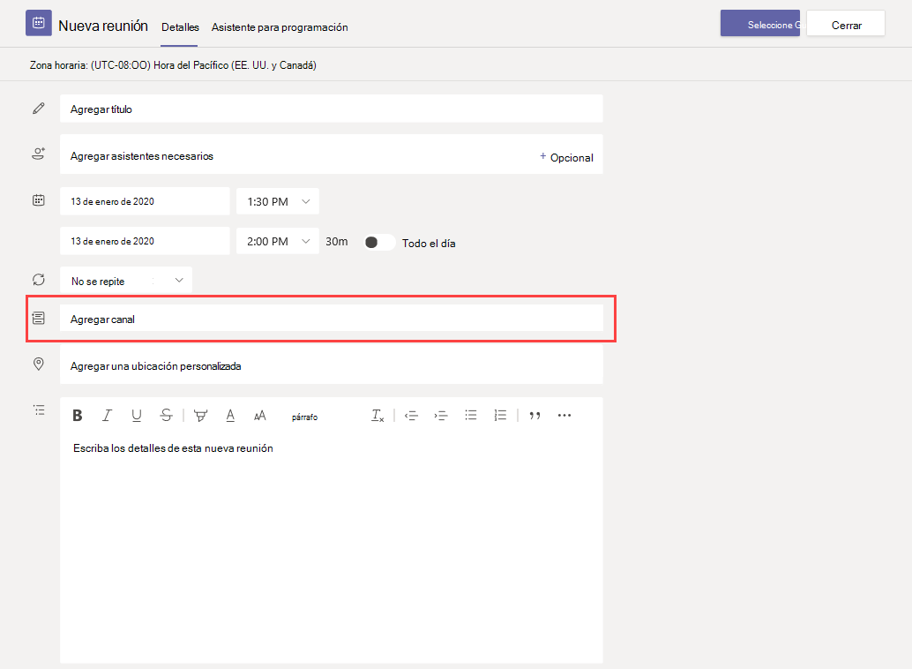

# Administrar directivas de reunión en TeamsManage meeting policies in Teams

::: zone target="docs"
Utilizar las directivas de reunión para controlar las características disponibles para sus participantes en reuniones programadas por usuarios de la organización.Use meeting policies to control the features that are available to meeting participants for meetings that are scheduled by users in your organization. Puede usar la directiva global (predeterminada para toda la organización) o crear directivas personalizadas y asignarlas a los usuarios.You can use the global (Org-wide default) policy that's automatically created or create and assign custom policies. Puede administrar las directivas de reuniones en el Centro de administración de Microsoft Teams o mediante [PowerShell](teams-powershell-overview.md).You manage meeting policies in the Microsoft Teams admin center or by using [PowerShell](teams-powershell-overview.md).

> [!NOTE]
> Para obtener información sobre el uso de los roles para administrar los permisos de los moderadores y los asistentes de reuniones, consulte [Roles en una reunión de Teams](https://support.microsoft.com/office/roles-in-a-teams-meeting-c16fa7d0-1666-4dde-8686-0a0bfe16e019?ui=en-us&rs=en-us&ad=us).For information about using roles to manage the permissions of meeting presenters and attendees, see [Roles in a Teams meeting](https://support.microsoft.com/office/roles-in-a-teams-meeting-c16fa7d0-1666-4dde-8686-0a0bfe16e019?ui=en-us&rs=en-us&ad=us).

Puede implementar directivas en las formas que se indican a continuación. Esto afectará a la experiencia de los usuarios antes de que se inicie la reunión, durante una reunión o después de una reunión.You can implement policies in the following ways, which affect the meeting experience for users before a meeting starts, during a meeting, or after a meeting.

|Tipo de implementaciónImplementation type  |DescripciónDescription  |
|---------|---------|
|Por organizadorPer-organizer    |Al implementar una directiva por organizador, todos los participantes de la reunión heredan la directiva del organizador.When you implement a per-organizer policy, all meeting participants inherit the policy of the organizer. Por ejemplo, **Admitir personas automáticamente** es una directiva por organizador.For example, **Automatically admit people** is a per-organizer policy. Controla si los usuarios pueden unirse a la reunión directamente o esperar en la sala de espera para reuniones programadas por el usuario al que se ha asignado la directiva.It controls whether users join the meeting directly or wait in the lobby for meetings scheduled by the user who is assigned the policy.          |
|Por usuarioPer-user    |Cuando implementa una directiva por usuario, solo la directiva por usuario se aplica para restringir determinadas características para el organizador o los participantes de la reunión.When you implement a per-user policy, only the per-user policy applies to restrict certain features for the organizer and/or meeting participants. Por ejemplo, **Permitir Reunirse ahora en los canales** es una directiva por usuario.For example, **Allow Meet now in channels** is a per-user policy.     |
|Por organizador y por usuarioPer-organizer and per-user     |Cuando implementa una combinación de una directiva por organizador y por usuario, se restringen determinadas características a los participantes de la reunión en función de las directivas de los usuarios y del organizador.When you implement a combination of a per-organizer and per-user policy, certain features are restricted for meeting participants based on their policy and the organizer's policy. Por ejemplo, **Permitir la grabación en la nube** es una directiva por organizador y por usuario.For example, **Allow cloud recording** is a per-organizer and per-user policy. Activar esta opción para permitir que los participantes inicien y detengan una grabación.Turn on this setting to allow users to start and stop a recording.

Puede editar la configuración en la directiva global o crear y asignar una o más directivas personalizadas.You can edit the settings in the global policy or create and assign one or more custom policies. Los usuarios obtendrán la directiva global, a menos que usted cree y asigne una directiva personalizada.Users will get the global policy unless you create and assign a custom policy.

> [!NOTE]
> El botón Detalles de la reunión estará disponible si un usuario tiene habilitadas las licencias de conferencia de audio o si el usuario admite las conferencias de audio. Si no, los detalles de la reunión no estarán disponibles.Meeting details button will be available if a user has the audio conference licenses enabled or the user is allow for audio conferencing, if not, the meeting details will not be available.

## Crear una directiva de reuniones personalizadaCreate a custom meeting policy

1. En el panel de navegación izquierdo del Centro de administración de Microsoft Teams, vaya a **Reuniones** > **Directivas de reunión**.In the left navigation of the Microsoft Teams admin center, go to **Meetings** > **Meeting policies**.
2. Seleccione **Agregar**.Select **Add**.
3. Escriba un nombre y una descripción para la directiva.Enter a name and description for the policy. El nombre no puede contener caracteres especiales ni tener más de 64 caracteres.The name can't contain special characters or be longer than 64 characters.
4. Seleccione la configuración que quiera usar.Choose the settings that you want.
5. Seleccione **Guardar**.Select **Save**.

Por ejemplo, supongamos que tiene un grupo de usuarios y quiere limitar el ancho de banda que necesitaría la reunión.For example, say you have a bunch of users and you want to limit the amount of bandwidth that their meeting would require. Cree una nueva directiva personalizada denominada "ancho de banda limitado" y deshabilite las opciones siguientes:You would create a new custom policy named "Limited bandwidth" and disable the following settings:

En **Audio y vídeo**:Under **Audio & video**:

- Desactive Permitir la grabación en la nube.Turn off Allow cloud recording.
- Desactive Permitir vídeo IP.Turn off Allow IP video.

En **Uso compartido de contenido**:Under **Content sharing**:

- Desactive el modo de uso compartido de la pantalla.Disable screen sharing mode.
- Desactive Permitir pizarra.Turn off Allow whiteboard.
- Desactive Permitir notas compartidas.Turn off Allow shared notes.

Luego asigne la directiva a los usuarios:Then assign the policy to the users.

## Editar una directiva de reuniónEdit a meeting policy

Puede editar la directiva global y las directivas personalizadas que cree.You can edit the global policy and any custom policies that you create.

1. En el panel de navegación izquierdo del Centro de administración de Microsoft Teams, vaya a **Reuniones** > **Directivas de reunión**.In the left navigation of the Microsoft Teams admin center, go to **Meetings** > **Meeting policies**.
2. Haga clic a la izquierda del nombre de la directiva para seleccionarla y, luego, seleccione **Editar**.Select the policy by clicking to the left of the policy name, and then select **Edit**.
3. A partir de aquí, realice los cambios que desee.From here, make the changes that you want.
4. Seleccione **Guardar**.Select **Save**.

> [!NOTE]
> Un usuario solo puede tener asignada una directiva de reuniones cada vez.A user can be assigned only one meeting policy at a time.

## Asignar una directiva de reunión a los usuariosAssign a meeting policy to users

[!INCLUDE [assign-policy](includes/assign-policy.md)]

> [!NOTE]
> No puede eliminar una directiva si tiene usuarios asignados.You can't delete a policy if users are assigned to it. Primero, debe asignar una directiva diferente a todos los usuarios afectados. Luego, podrá eliminar la directiva original.You must first assign a different policy to all affected users, and then you can delete the original policy.

## Configuración de la directiva de reuniónMeeting policy settings

Seleccionar una directiva existente en la página **Directivas de reunión** o seleccionar **Agregar** para agregar una nueva directiva.Select an existing policy on the **Meeting policies** page or select **Add** to add a new policy. Configurar opciones para lo siguiente.Configure settings for the following.

- [GeneralGeneral](#meeting-policy-settings---general)
- [Audio y vídeoAudio & video](#meeting-policy-settings---audio--video)
- [Uso compartido de contenidoContent sharing](#meeting-policy-settings---content-sharing)
- [Participantes e invitadosParticipants & guests](#meeting-policy-settings---participants--guests)

::: zone-end

## Configuración de la directiva de reunión. Aspectos generalesMeeting policy settings - General

- [Permitir la opción Reunirse ahora en canalesAllow Meet now in channels](#allow-meet-now-in-channels)
- [Permitir el complemento de OutlookAllow the Outlook add-in](#allow-the-outlook-add-in)
- [Permitir la programación de reuniones de canalAllow channel meeting scheduling](#allow-channel-meeting-scheduling)
- [Permitir la programación de reuniones privadasAllow scheduling private meetings](#allow-scheduling-private-meetings)
- [Permitir Reunirse ahora en reuniones privadasAllow Meet now in private meetings](#allow-meet-now-in-private-meetings)

### Permitir la opción Reunirse ahora en canalesAllow Meet now in channels

Permitir **Reunirse ahora** es una directiva por usuario y se aplica antes de que se inicie la reunión.Allow **Meet now** is a per-user policy and applies before a meeting starts. Esta configuración controla si un usuario puede iniciar una reunión no planeada en un canal de Teams.This setting controls whether a user can start an unplanned meeting in a Teams channel. Si activa esta configuración, los usuarios podrán seleccionar el botón **Reunirse** para iniciar una reunión no planeada o programar una reunión en el canal.If you turn on this setting, users can select the **Meet** button to start an unplanned meeting or schedule a meeting in the channel. El valor predeterminado es True.The default value is True.

### Permitir el complemento de OutlookAllow the Outlook add-in

Permitir el complemento de Outlook es una directiva por usuario y se aplica antes de que se inicie la reunión.Allow the Outlook add-in is a per-user policy and applies before a meeting starts. Esta configuración controla si se pueden programar reuniones de Teams desde Outlook (en Windows, Mac, web y dispositivos móviles).This setting controls whether Teams meetings can be scheduled from within Outlook (Windows, Mac, web, and mobile).

Si desactiva esta característica, los usuarios no podrán programar ninguna.If you turn off this feature, users are unable to schedule. reuniones de Teams cuando creen una nueva reunión en Outlook.Teams meetings when they create a new meeting in Outlook. Por ejemplo, en Outlook en Windows, la opción **Nueva reunión de Teams** no se mostrará en la cinta de opciones.For example, in Outlook on Windows, the **New Teams Meeting** option won't show up in the ribbon.

### Permitir la programación de reuniones de canalAllow channel meeting scheduling

Use la Directiva AllowChannelMeetingScheduling existente para controlar los tipos de eventos que se pueden crear en los calendarios del canal del equipo.Use the existing AllowChannelMeetingScheduling policy to control the types of events that can be created on the team channel calendars. Esta es una directiva por usuario y se aplica antes de que se inicie la reunión.This is a per-user policy and applies before a meeting starts. Esta configuración controla si un usuario puede programar una reunión en un canal de Teams.This setting controls whether users can schedule a meeting in a Teams channel. Esta configuración está activada de forma predeterminada.By default, this setting is turned on.

Si esta directiva está desactivada, los usuarios no podrán crear nuevas reuniones de canal.If this policy is turned off, users can't create new channel meetings. Sin embargo, el organizador del evento puede editar las reuniones de canal existentes.However, existing channel meetings can be edited by the organizer of the event.

Programar una reunión se deshabilitará.Schedule a meeting will be disabled.

 

La selección de canales está desactivada.Channel selection is disabled.

En la página publicaciones del canal, se deshabilitarán las características siguientes:In the channel posts page, the following features will be disabled:

- El botón **Programar una reunión** en el cuadro de redactar respuesta del canal.**Schedule a meeting** button on the channel reply compose box.
  
  
- El botón **Programar una reunión** en el encabezado del canal.**Schedule a meeting** button on the channel header.
  

En el calendario del canal:In the channel calendar:

- El botón **Agregar nuevo evento** en el encabezado del calendario del canal se deshabilitará.**Add new event** button on channel calendar header will be disabled.
  

- Los usuarios no podrán arrastrar y seleccionar un bloque de tiempo en el calendario del canal para crear una reunión de canal.Users can't drag and select a time block on the channel calendar to create a channel meeting.

- Los usuarios no pueden usar métodos abreviados de teclado para crear una reunión en el calendario del canal.Users can't use Keyboard shortcuts to create a meeting on the channel calendar.

En el Centro de administración:In the admin center:

La aplicación Calendario de canal se mostrará en la sección **Aplicaciones de Microsoft** en la página de directivas de permisos de la aplicación.The channel calendar app will show up in the **Microsoft apps** section on the app permission policies page.

 

### Permitir la programación de reuniones privadasAllow scheduling private meetings

La programación de reuniones privadas es una directiva por usuario y se aplica antes de que se inicie la reunión.Scheduling private meetings is a per-user policy and applies before a meeting starts. Esta configuración controla si un usuario puede programar una reunión privada en Teams.This setting controls whether users can schedule private meetings in Teams. Una reunión es privada cuando no se publica en un canal de un equipo.A meeting is private when it's not published to a channel in a team.

Si desactiva **Permitir la programación de reuniones privadas** y **Permitir la programación de reuniones de canal**, las opciones **Agregar los asistentes necesarios** y **Agregar el canal** estarán deshabilitadas para los usuarios de Teams.If you turn off **Allow scheduling private meetings** and **Allow channel meeting scheduling**, the **Add required attendees** and **Add channel** options are disabled for users in Teams. Esta configuración está activada de forma predeterminada.By default, this setting is turned on.

### Permitir la opción Reunirse ahora en las reuniones privadasAllow Meet now in private meetings

Esta es una directiva por usuario y se aplica antes de que se inicie la reunión.This is a per-user policy and applies before a meeting starts. Esta configuración controla si un usuario puede iniciar una reunión privada no planeada.This setting controls whether a user can start an unplanned private meeting. Esta configuración está activada de forma predeterminada.By default, this setting is turned on.

## Configuración de la directiva de reunión. Audio y vídeoMeeting policy settings - Audio & video

- [Permitir transcripciónAllow transcription](#allow-transcription)
- [Permitir la grabación en la nubeAllow cloud recording](#allow-cloud-recording)
- [Modo de audio IPMode for IP audio](#mode-for-ip-audio)
- [Modo de vídeo IPMode for IP video](#mode-for-ip-video)
- [Permitir vídeo IPAllow IP video](#allow-ip-video)
- [Velocidad de bits multimedia (kb/s)Media bit rate (Kbs)](#media-bit-rate-kbs)

### Permitir transcripciónAllow transcription

Esta directiva activa la transcripción en directo.This policy turns on Live transcription. Permitir transcripción es una directiva por usuario.Allow transcription is a per-user policy. Esta configuración controla si se puede transcribir la reunión en concreto de Teams.This setting controls whether this specific Team's meeting can be transcribed.

La transcripción en directo muestra la conversión de voz en texto de contenido hablado durante una reunión de Teams casi en tiempo real.Live transcription shows speech-to-text of spoken content during a Teams meeting in near real time. El texto aparece junto al vídeo de la reunión, incluido el nombre del orador y una marca de tiempo.The text appears alongside the meeting video, including the speaker's name and a time stamp. Para obtener más información, consulte [Ver transcripción en directo de una reunión de Teams](https://support.microsoft.com/office/view-live-transcription-in-a-teams-meeting-dc1a8f23-2e20-4684-885e-2152e06a4a8b).To learn more, see [View live transcription in a Teams meeting](https://support.microsoft.com/office/view-live-transcription-in-a-teams-meeting-dc1a8f23-2e20-4684-885e-2152e06a4a8b).

Actualmente, la transcripción en directo es compatible con el cliente de escritorio de Teams.Currently, live transcription is supported on the Teams desktop client. La transcripción es compatible con el inglés estadounidense hablado.Transcription is supported for spoken U.S. English. La transcripción está disponible después de la reunión en el escritorio o la web de Teams.The transcript is available after the meeting on Teams desktop or web.

A continuación se explica cómo las configuraciones de directivas **Permitir transcripción** y **Permitir la grabación en la nube** funcionan juntas.Here's how the **Allow transcription** and **Allow cloud recording** policy settings work together. En la siguiente tabla se describen los valores de esta configuración y el comportamiento de la reunión.The following table describes the values for these settings and the meeting behavior.

|Permitir transcripciónAllow transcription|Permitir la grabación en la nubeAllow cloud recording|ComportamientoBehavior|
|---------|---------|---------|
|**On****On**|**On****On**|La opción **Inicio de la transcripción** está disponible en las reuniones de Teams.The **Start transcription** option is available in Teams meetings. El organizador o los participantes de la reunión pueden iniciar y detener la transcripción.The meeting organizer or meeting participants can start and stop transcription. La opción **Inicio de la grabación** está disponible en las reuniones de Teams.The **Start recording** option is available in Teams meetings. El organizador o los participantes de la reunión pueden iniciar y detener la grabación.The meeting organizer or meeting participants can start and stop recording. |
|**On****On**|**Desactivado****Off**|La opción **Inicio de la transcripción** está disponible en las reuniones de Teams.The **Start transcription** option is available in Teams meetings. La opción **Inicio de la grabación** no está disponible en las reuniones de Teams.The **Start recording** option isn't available in Teams meetings. |
|**Desactivado****Off**|**On****On**|La opción **Inicio de la grabación** está disponible en las reuniones de Teams.The **Start recording** option is available in Teams meetings. La opción **Inicio de la transcripción** no está disponible en las reuniones de Teams.The **Start transcription** option isn't available in Teams meetings.|
|**Desactivado****Off**|**Desactivado****Off**|Grabación y transcripción no están disponibles en las reuniones de Teams.Recording and transcription aren't available in Teams meetings.  |

### Permitir la grabación en la nubeAllow cloud recording

Permitir la grabación en la nube se controla mediante una directiva por usuario.Allow cloud recording is controlled at a per-user policy. Esta configuración controla si un usuario puede grabar.This setting controls whether a user can record. La grabación la puede iniciar el organizador de la reunión u otro participante de la reunión si la configuración de directiva específica está activada y si es un usuario autenticado de la misma organización que el organizador.The recording can be started by the meeting organizer or by another meeting participant if their specific policy setting is turned on and if they're an authenticated user from the same organization as the organizer.

Las personas de fuera de su organización, como los usuarios federados y anónimos, no pueden iniciar la grabación.People outside your organization, such as federated and anonymous users, can't start the recording. Los usuarios invitados no pueden iniciar o detener la grabación.Guest users can't start or stop the recording.

Para más información sobre la grabación de reuniones en la nube, consulte [Grabación de reuniones en la nube de Teams](cloud-recording.md).To learn more about cloud meeting recording, see [Teams cloud meeting recording](cloud-recording.md).

### Modo de audio IPMode for IP audio

El modo de audio IP es una directiva por usuario.Mode for IP audio is a per-user policy. Esta configuración controla si se puede activar el audio en reuniones y llamadas de grupo.This setting controls whether audio can be turned on in meetings and group calls. Estos son los valores de configuración.Here are the values for this setting.

|Valor de configuraciónSetting value |ComportamientoBehavior  |
|---------|---------|
|**Audio entrante y saliente activado****Outgoing and incoming audio enabled**    |De forma predeterminada, se permiten en la reunión el vídeo y audio entrantes y salientes.Outgoing and incoming audio is allowed in the meeting. This is the default setting. |
|**Deshabilitado****Disabled**     |El audio entrante y saliente en la reunión está desactivado.Outgoing and incoming audio is turned off in the meeting.     |

Si se establece en **Deshabilitado** para un usuario, el usuario podrá seguir programando y organizando reuniones, pero no podrá usar el audio.If set to **Disabled** for a user, that user can still schedule and organize meetings but can't use audio. Para unirse a una reunión, el usuario tendrá que marcar para acceder a través de la red telefónica conmutada (RTC) o hacer que se llame a la reunión para unir por teléfono al usuario.To join a meeting, the user has to dial in through the Public Switched Telephone Network (PSTN) or have the meeting call to join the user by phone. Los participantes de la reunión que no tengan ninguna directiva asignada (por ejemplo, los participantes anónimos) tienen esto establecido como **Audio de salida y entrada habilitado** de forma predeterminada.Meeting participants who don't have any policies assigned (for example, anonymous participants) have this set to **Outgoing and incoming audio enabled** by default. Si esta opción está deshabilitada en los clientes móviles de Teams, el usuario tendrá que marcar para acceder a la reunión a través de la RTC.On Teams mobile clients, if this setting is disabled, the user has to dial in to the meeting through the PSTN.

Esta configuración no se aplica a las llamadas 1:1.This setting doesn't apply to 1:1 calls. Para restringir llamadas 1:1, configure una [directiva de llamada](teams-calling-policy.md) de Teams y desactive el valor **Realizar llamadas privadas**.To restrict 1:1 calls, configure a Teams [calling policy](teams-calling-policy.md) and turn off the **Make private calls** setting. Esta configuración tampoco se aplica a los dispositivos de la sala de conferencias, como los dispositivos de Surface Hub y Salas de Microsoft Teams.This setting also doesn't apply to conference room devices such as Surface Hub and Microsoft Teams Rooms devices.

Esta configuración aún no está disponible para entornos de Microsoft 365 Government Community Cloud (GCC), GCC High o Department of Defense (DoD).This setting isn't yet available for Microsoft 365 Government Community Cloud (GCC), GCC High, or Department of Defense (DoD) environments.

Para obtener más información, consulte [Administrar el audio y el vídeo de los participantes de la reunión](#manage-audiovideo-for-meeting-participants).To learn more, see [Manage audio/video for meeting participants](#manage-audiovideo-for-meeting-participants).

### Modo de vídeo IPMode for IP video

El modo de video IP es una directiva por usuario.Mode for IP video is a per-user policy. Esta configuración controla si se puede activar el vídeo en reuniones y llamadas de grupo.This setting controls whether video can be turned on in meetings and group calls. Estos son los valores de configuración.Here are the values for this setting.

|Valor de configuraciónSetting value |ComportamientoBehavior  |
|---------|---------|
|**Vídeo entrante y saliente activado****Outgoing and incoming video enabled**    | El vídeo entrante y saliente permitido en la reunión es la configuración predeterminada.Outgoing and incoming video is allowed in the meeting is the default setting. |
|**Deshabilitado****Disabled**     | El vídeo entrante y saliente en la reunión está desactivado.Outgoing and incoming video is turned off in the meeting. En los clientes para móvil de Teams, los usuarios no pueden compartir vídeos ni fotos en la reunión.On Teams mobile clients, users can't share videos or photos in the meeting.   Si está deshabilitado el **Modo para audio IP**, entonces el **Modo para vídeo IP** permanecerá también deshabilitado.If **Mode for IP audio** is disabled, then **Mode for IP video** will also remain disabled.  |

Si se establece en **Deshabilitado** para un usuario, ese usuario no puede activar el vídeo o ver vídeos compartidos por otros participantes de la reunión.If set to **Disabled** for a  user, that user can't turn on video or view videos shared by other meeting participants. Los participantes de la reunión que no tengan ninguna directiva asignada (por ejemplo, los participantes anónimos) tienen esto establecido como **Vídeo de salida y entrada habilitado** de forma predeterminada.Meeting participants who don't have any policies assigned (for example, anonymous participants) have this set to **Outgoing and incoming video enabled** by default.

Esta configuración no se aplica a los dispositivos de la sala de conferencias, como los dispositivos de Surface Hub y Salas de Microsoft Teams.This setting doesn't apply to conference room devices such as Surface Hub and Microsoft Teams Rooms devices.

Esta configuración aún no está disponible para entornos de Microsoft 365 Government Community Cloud (GCC), GCC High o Department of Defense (DoD).This setting isn't yet available for Microsoft 365 Government Community Cloud (GCC), GCC High, or Department of Defense (DoD) environments.

> [!NOTE]
> Tenga en cuenta que esta configuración controla tanto el vídeo saliente como el entrante mientras que **Permitir el vídeo IP** controla solo el vídeo saliente.Keep in mind that this setting controls both outgoing and incoming video whereas the **Allow IP video** setting controls outgoing video. Para obtener más información, consulte [¿Cuál es la prioridad de la configuración de directiva de vídeo IP?](#which-ip-video-policy-setting-takes-precedence) y [Administrar el audio y el vídeo de los participantes de la reunión](#manage-audiovideo-for-meeting-participants).To learn more, see [Which IP video policy setting takes precedence?](#which-ip-video-policy-setting-takes-precedence) and [Manage audio/video for meeting participants](#manage-audiovideo-for-meeting-participants).

Para obtener más información, consulte [Administrar el audio y el vídeo de los participantes de la reunión](#manage-audiovideo-for-meeting-participants).To learn more, see [Manage audio/video for meeting participants](#manage-audiovideo-for-meeting-participants).

### Permitir vídeo IPAllow IP video

Permitir video IP es una combinación de directiva por organizador y por usuario.Allow IP video is a combination of a per-organizer and per-user policy. El vídeo es un componente clave de las reuniones.Video is a key component to meetings. En algunas organizaciones, los administradores pueden querer disponer de más control sobre qué reuniones de usuarios tienen vídeo.In some organizations, admins might want more control over which users' meetings have video. Esta configuración controla si se puede activar el vídeo en reuniones hospedadas por un usuario y en llamadas 1:1 y de grupo iniciadas por un usuario.This setting controls whether video can be turned on in meetings hosted by a user and in 1:1 and group calls started by a user. En clientes móviles de Teams, esta opción controla si los usuarios pueden compartir fotos y vídeos en una reunión.On Teams mobile clients, this setting control whether users can share photos and videos in a meeting.

Las reuniones organizadas por un usuario que tiene habilitada esta configuración de directiva, permiten el uso compartido de vídeo en la reunión por parte de los participantes de la reunión, si estos también tienen la configuración de directiva habilitada.Meetings organized by a user who has this policy setting enabled, allow video sharing in the meeting by the meeting participants, if the participants also have the policy setting enabled. Los participantes de la reunión a los que no se les ha asignado ninguna directiva (por ejemplo, los participantes anónimos y federados) heredan la directiva del organizador de la reunión.Meeting participants who don't have any policies assigned (for example, anonymous and federated participants) inherit the policy of the meeting organizer.

> [!NOTE]
> Tenga en cuenta que esta configuración controla el vídeo saliente mientras que la configuración **Modo para vídeo IP** controla tanto el vídeo saliente como el entrante.Keep in mind that this setting controls outgoing video whereas the **Mode for IP video** setting controls both outgoing and incoming video. Para obtener más información, consulte [¿Cuál es la prioridad de la configuración de directiva de vídeo IP?](#which-ip-video-policy-setting-takes-precedence) y [Administrar el audio y el vídeo de los participantes de la reunión](#manage-audiovideo-for-meeting-participants).To learn more, see [Which IP video policy setting takes precedence?](#which-ip-video-policy-setting-takes-precedence) and [Manage audio/video for meeting participants](#manage-audiovideo-for-meeting-participants).

| Clientes de escritorio y web de TeamsTeams desktop and web client |Cliente móvil de TeamsTeams mobile client  |
|:-------:|:-------:|
|    |          |

Veamos el ejemplo siguiente.Let's look at the following example.

|UsuarioUser |Directiva de reunionesMeeting policy  |Permitir vídeo IPAllow IP video |
|---------|---------|---------|
|DanielaDaniela   | GlobalGlobal   | ActivadoOn       |
|AmandaAmanda    | Location1MeetingPolicyLocation1MeetingPolicy        | DesactivadoOff      |

Las reuniones hospedadas por Daniela permiten activar el vídeo.Meetings hosted by Daniela allow video to be turned on. Daniela puede unirse a la reunión y activar el vídeo.Daniela can join the meeting and turn on video. Amanda no puede activar el vídeo en la reunión de Daniela porque la directiva de Amanda está configurada para no permitir el vídeo.Amanda can't turn on video in Daniela's meeting, because Amanda's policy is set to not allow video. Amanda pueden ver vídeos compartidos por otros participantes de la reunión.Amanda can see videos shared by other participants in the meeting.

En las reuniones hospedadas por Amanda, nadie puede activar el vídeo, independientemente de la directiva de vídeo que tenga asignada.In meetings hosted by Amanda, no one can turn on video, regardless of the video policy assigned to them. Esto significa que Daniela no puede activar el vídeo en las reuniones de Amanda.This means Daniela can't turn on video in Amanda's meetings.  

Si Daniela llama a Amanda con el vídeo activado, Amanda puede responder a la llamada solo con audio.If Daniela calls Amanda with video on, Amanda can answer the call with audio only. Cuando se conecte la llamada, Amanda podrá ver el vídeo de Daniela, pero no podrá activar el vídeo.When the call is connected, Amanda can see Daniela's video, but can't turn on video. Si Amanda llama a Daniela, Daniela podrá responder a la llamada con vídeo o audio.If Amanda calls Daniela, Daniela can answer the call with video and audio. Cuando se conecte la llamada, Daniela podrá activar o desactivar el vídeo, según lo vea necesario.When the call is connected, Daniela can turn on or turn off her video, as needed.

Para obtener más información, consulte [Administrar el audio y el vídeo de los participantes de la reunión](#manage-audiovideo-for-meeting-participants).To learn more, see [Manage audio/video for meeting participants](#manage-audiovideo-for-meeting-participants).

#### ¿Qué configuración de directiva de vídeo IP tiene prioridad?Which IP video policy setting takes precedence

Para un usuario, la configuración de directiva más restrictiva para el vídeo tiene prioridad. Estos son algunos ejemplos.For a user, the most restrictive policy setting for video takes precedence. Here's some examples.

|Permitir vídeo IPAllow IP video|Modo de vídeo IPMode for IP video|Experiencia de reuniónMeeting experience|
|---------|---------|---------|
|Organizador: **Activado**Organizer: **On**  Participante: **Activado**Participant: **On** |Participante: **Deshabilitado**Participant: **Disabled**        |La configuración del **Modo de vídeo IP** tiene prioridad.The **Mode for IP video** setting takes precedence. El participante al que se asigna esta directiva no puede activar o ver vídeos compartidos por otros usuarios.The participant who is assigned this policy can't turn on or view videos shared by others.|
|Organizador: **Activado**Organizer: **On**  Participante: **Activado**Participant: **On** |Participante: **Vídeo entrante y saliente activado**Participant: **Outgoing and incoming video enabled**          |El participante al que se asigna esta directiva puede activar o ver vídeos compartidos por otros usuarios.The participant who is assigned this policy can turn on or view videos shared by others.         |
|Organizador: **Activado**Organizer: **On**  Participante: **Desactivado**Participant: **Off** |Participante: **Vídeo entrante y saliente activado**Participant: **Outgoing and incoming video enabled**         |La configuración **Permitir vídeo IP** tiene prioridad.The **Allow IP video** setting takes precedence. Los participantes solo pueden ver el vídeo entrante y no pueden enviar vídeo saliente.Participants can only see incoming video and can't send outgoing video.         |
|Organizador: **Activado**Organizer: **On**  Participante: **Desactivado**Participant: **Off** |Participante: **Deshabilitado**Participant: **Disabled**         |La configuración del **Modo de vídeo IP** tiene prioridad.The **Mode for IP video** setting takes precedence. El participante no puede ver ni el vídeo entrante ni el saliente.The participant can't see incoming or outgoing video.|
|Organizador: **Desactivado**Organizer: **Off**    |       |La configuración **Permitir el vídeo IP** tiene prioridad porque está desactivada para el organizador.The **Allow IP video** setting takes precedence because it's turned off for the organizer. Nadie puede activar el vídeo en las reuniones organizadas por el usuario al que se asigna esta directiva.No one can turn on video in meetings organized by the user who is assigned this policy.         |

### Administrar el audio y el vídeo de los participantes de la reuniónManage audio/video for meeting participants

|Si quiere...If you want to...  |Establezca las siguientes configuraciones de directivasSet the following policy settings  |
|---------|---------|
|Deshabilitar el audio y el vídeo para los participantes en reunionesDisable audio and video for participants in meetings  |Modo de audio IP: **Deshabilitado**Mode for IP audio: **Disabled**  Modo de vídeo IP: **Deshabilitado**Mode for IP video: **Disabled** Permitir vídeo IP: N/DAllow IP video: N/A       |
|Habilitar solo vídeo y audio entrante para participantes en reunionesEnable only incoming video and audio for participants in meetings  |Modo de audio IP: **Audio entrante y saliente activado**Mode for IP audio: **Outgoing and incoming audio enabled**  Modo de vídeo IP: **Vídeo entrante y saliente activado**Mode for IP video: **Outgoing and incoming video enabled** Permitir vídeo IP: **Activado**Allow IP video: **Off**       |
|Deshabilitar el vídeo para los participantes en reuniones (los participantes solo tienen audio)Disable video for participants in meetings (participants have audio only)|  Modo de audio IP: **Activar el audio entrante y saliente**Mode for IP audio: **Enable outgoing and incoming audio**  Modo de vídeo IP: **Deshabilitado**Mode for IP video: **Disabled** Permitir vídeo IP: N/DAllow IP video: N/A
|Habilitar el audio y el vídeo para los participantes en reunionesEnable audio and video for participants in meetings    |Modo de audio IP: **Audio entrante y saliente activado** (predeterminado)Mode for IP audio: **Outgoing and incoming audio enabled** (default)  Modo de vídeo IP: **Vídeo entrante y saliente activado** (predeterminado)Mode for IP video: **Outgoing and incoming video enabled** (default) Permitir vídeo IP: **Activado** (predeterminado)Allow IP video: **On** (default)    |

Se aplica la directiva más restrictiva entre la directiva del organizador de la reunión y la del usuario.The most restrictive policy between the meeting organizer’s policy and the user’s policy applies. Por ejemplo, si un organizador tiene una directiva que restringe el vídeo y la directiva de un usuario no restringe el vídeo, los participantes de la reunión heredan la directiva del organizador de la reunión y no tienen acceso al vídeo en las reuniones.For example, if an organizer has a policy that restricts video and a user’s policy doesn't restrict video, meeting participants inherit the policy of the meeting organizer and don't have access to video in meetings. Esto significa que solo podrán unirse a la reunión con audio.This means that they can join the meeting with audio only.

> [!NOTE]
> Cuando un usuario inicia una llamada de grupo para unirse por teléfono, no se muestra la pantalla **Usar teléfono para el audio**.When a user starts a group call to join by phone, the **Use phone for audio** screen doesn't appear. Este es un problema conocido que estamos intentando resolver.This is a known issue that we're working to resolve. Para solucionar este problema, seleccione **Audio del teléfono** en **Otras opciones para unirse**.To work around this issue, select **Phone audio** under **Other join options**.  

#### Clientes de móvil de TeamsTeams mobile clients

Para los usuarios de clientes de móvil de Teams, la capacidad para compartir fotos y vídeos durante una reunión está determinada por el valor **Permitir el vídeo IP** o **Modo de vídeo de IP**.For users on Teams mobile clients, the ability to share photos and videos during a meeting is determined by the **Allow IP video** or **IP video mode** setting. En función de la configuración de directiva que tenga prioridad, la capacidad para compartir vídeos y fotos no estará disponible.Depending on which policy setting takes precedence, the ability to share videos and photos won't be available. Esto no afecta al uso compartido de la pantalla, que se configura con el modo de [Uso compartido de pantalla](#screen-sharing-mode).This doesn't affect screen sharing, which you configure using a separate [Screen sharing mode](#screen-sharing-mode) setting. Asimismo, puede establecer una directiva de movilidad de [Teams](/powershell/module/skype/new-csteamsmobilitypolicy) para evitar que los usuarios móviles utilicen vídeo IP sobre una conexión móvil, lo que significa que deben usar una conexión Wi-Fi.Additionally, you can set a [Teams mobility policy](/powershell/module/skype/new-csteamsmobilitypolicy) to prevent mobile users from using IP video over a cellular connection, which means they must use a WiFi connection.

### Velocidad de bits multimedia (kb/s)Media bit rate (Kbs)

Esta es una directiva por usuario.This is a per-user policy. Esta configuración determina la velocidad total de bits multimedia para las transmisiones por audio, vídeo y uso compartido de aplicaciones en vídeo en las llamadas y reuniones para el usuario.This setting determines the total average media bit rate for audio, video, and video-based app sharing transmissions in calls and meetings for the user. Se aplica a los usuarios de la llamada o reunión, en transferencias multimedia tanto de subida como de bajada.It's applied to both the uplink and downlink media traversal for users in the call or meeting. Esta configuración le ofrece un control en detalle de la administración de ancho de banda de su organización.This setting gives you granular control over managing bandwidth in your organization. Dependiendo de los escenarios de reuniones necesarios para los usuarios, le recomendamos que disponga del suficiente ancho de banda para disfrutar de una buena calidad.Depending on the meetings scenarios required by users, we recommend having enough bandwidth in place for a good quality experience. El valor mínimo es 30 kb/s y el valor máximo depende del escenario de la reunión.The minimum value is 30 Kbps and the maximum value depends on the meeting scenario. Para obtener más información sobre el ancho de banda mínimo recomendado para reuniones, llamadas y eventos en directo de buena calidad en Teams, vea [Requisitos de ancho de banda](prepare-network.md#bandwidth-requirements).To learn more about the minimum recommended bandwidth for good quality meetings, calls, and live events in Teams, see [Bandwidth requirements](prepare-network.md#bandwidth-requirements).

Si no hay suficiente ancho de banda para una reunión, los participantes ven un mensaje que indica que la calidad de la red es deficiente.If there isn't enough bandwidth for a meeting, participants see a message that indicates poor network quality.

Para las reuniones que necesitan una experiencia de vídeo de mayor calidad, como las reuniones de juntas directivas y los eventos de Teams en directo, le recomendamos que establezca el ancho de banda en 10 Mb/s.For meetings that need the highest-quality video experience, such as CEO board meetings and Teams live events, we recommend you set the bandwidth to 10 Mbps. Incluso si se establece la experiencia máxima, la pila de medios de Teams se adapta a condiciones de bajo ancho de banda cuando se detectan determinadas condiciones de red, según el contexto.Even when the maximum experience is set, the Teams media stack adapts to low-bandwidth conditions when certain network conditions are detected, depending on the scenario.

## Configuración de la directiva de reunión. Uso compartido de contenidoMeeting policy settings - Content sharing

- [Modo de uso compartido de pantallaScreen sharing mode](#screen-sharing-mode)
- [Permitir a un participante ceder o solicitar el controlAllow a participant to give or request control](#allow-a-participant-to-give-or-request-control)
- [Permitir a un participante externo ceder o solicitar el controlAllow an external participant to give or request control](#allow-an-external-participant-to-give-or-request-control)
- [Permitir uso compartido en PowerPointAllow PowerPoint sharing](#allow-powerpoint-sharing)
- [Permitir pizarraAllow whiteboard](#allow-whiteboard)
- [Permitir notas compartidasAllow shared notes](#allow-shared-notes)

### Modo de uso compartido de la pantallaScreen sharing mode

> [!NOTE]
> Esta característica todavía está en desarrollo. El uso compartido de la pantalla es una directiva que se aplica por participante, pero puede verse afectado por la configuración de uso compartido de pantalla del organizador, como se describe en esta sección.This feature is still in development. Screen sharing is a per-participant policy, however, it can be affected by the organizer's screen sharing settings, as described in this section.

Esta configuración controla si se permite el uso compartido de ventanas o el escritorio en la reunión del usuario.This setting controls whether desktop and/or window sharing is allowed in the user's meeting. Los participantes de la reunión a los que no se les ha asignado ninguna directiva (por ejemplo, los participantes anónimos, invitados, B2B y federados) heredan la directiva del organizador de la reunión.Meeting participants who don't have any policies assigned (for example, anonymous, guest, B2B, and federated participants) inherit the policy of the meeting organizer.

|Valor de configuraciónSetting value |ComportamientoBehavior  |
|---------|---------|
|**Toda la pantalla****Entire screen**    | Se permiten en la reunión el uso compartido de escritorio completo y de la aplicaciónFull desktop sharing and application sharing are allowed in the meeting |
|**Aplicación única****Single application**   | El uso compartido de aplicaciones se permite en la reuniónApplication sharing is allowed in the meeting        |
|**Deshabilitado****Disabled**     |El uso compartido de la pantalla y el uso compartido de aplicaciones se desactivaron en la reunión.Screen sharing and application sharing turned off in the meeting.       |

Veamos el ejemplo siguiente.Let's look at the following example.

|UsuarioUser |Directiva de reunionesMeeting policy |Modo de uso compartido de la pantallaScreen sharing mode |
|---------|---------|---------|
|DanielaDaniela  | GlobalGlobal   | Toda la pantallaEntire screen |
|AmandaAmanda   | Location1MeetingPolicyLocation1MeetingPolicy  | DeshabilitadoDisabled |

Las reuniones hospedadas por Daniela permiten a los participantes de la reunión compartir toda la pantalla o una aplicación específica.Meetings hosted by Daniela allow meeting participants to share their entire screen or a specific application. Si Amanda se une a la reunión de Daniela, Amanda no puede compartir su pantalla ni una aplicación específica, ya que esta configuración de directiva está deshabilitada.If Amanda joins Daniela's meeting, Amanda can't share her screen or a specific application as her policy setting is disabled. En las reuniones hospedadas por Amanda no se permite a nadie compartir su pantalla o una sola aplicación, independientemente de la directiva de modo de uso compartido de la pantalla que se les asignó.In meetings hosted by Amanda, no one is allowed to share their screen or a single application, regardless of the screen sharing mode policy assigned to them. Esto significa que Daniela no puede compartir su pantalla o una sola aplicación en las reuniones de Amanda.This means that Daniela can't share her screen or a single application in Amanda's meetings.  

Actualmente, los usuarios no pueden reproducir vídeo ni compartir su pantalla en una reunión de Teams si usan Google Chrome.Currently, users can't play video or share their screen in a Teams meeting if they're using Google Chrome.

### Permitir a un participante ceder o solicitar el controlAllow a participant to give or request control

Esta es una directiva por usuario.This is a per-user policy. Esta configuración controla si el usuario puede ceder el control de la ventana o del escritorio compartido a otros participantes de la reunión.This setting controls whether the user can give control of the shared desktop or window to other meeting participants. Para ceder el control, pase el cursor por la parte superior de la pantalla.To give control, hover over the top of the screen.

Si esta configuración está activada para el usuario, la opción **Ceder el control** se mostrará en la barra superior de una sesión compartida.If this setting is turned on for the user, the **Give Control** option is displayed in the top bar in a sharing session.

Si la configuración está desactivada para el usuario, la opción **Ceder el control** no estará disponible.If the setting is turned off for the user, the **Give Control** option isn't available.

Veamos el ejemplo siguiente.Let's look at the following example.

|UsuarioUser |Directiva de reunionesMeeting policy  |Permitir a un participante ceder o solicitar el controlAllow participant to give or request control |
|---------|---------|---------|
|DanielaDaniela   | GlobalGlobal   | ActivadoOn       |
|BabekBabek    | Location1MeetingPolicyLocation1MeetingPolicy        | DesactivadoOff   |

Daniela puede ceder el control de la ventana o del escritorio compartido a otros participantes en una reunión organizada por Babek mientras que Babek no puede ceder el control a otros participantes.Daniela can give control of the shared desktop or window to other participants in a meeting organized by Babek whereas Babek can't give control to other participants.

Si desea usar PowerShell para controlar quién puede ceder el control o aceptar solicitudes de control, use el cmdlet AllowParticipantGiveRequestControl.To use PowerShell to control who can give control or accept requests for control, use the AllowParticipantGiveRequestControl cmdlet.

> [!NOTE]
> Para ceder y tomar el control del contenido compartido durante el uso compartido, ambas partes deben usar el cliente de escritorio de Teams.To give and take control of shared content during sharing, both parties must be using the Teams desktop client. El control no es compatible cuando cualquiera de las partes ejecuta Teams en un explorador.Control isn't supported when either party is running Teams in a browser. Esto se debe a una limitación técnica que planeamos solucionar.This is due to a technical limitation that we're planning to fix.

### Permitir a un participante externo ceder o solicitar el controlAllow an external participant to give or request control

Esta es una directiva por usuario.This is a per-user policy. Que una organización haya definido esto para un usuario no controla lo que puedan hacer los participantes externos, independientemente de lo que haya configurado el organizador de la reunión.Whether an organization has this set for a user doesn't control what external participants can do, regardless of what the meeting organizer has set. Lo que controla este parámetro es si los participantes externos pueden recibir o solicitar el control de la pantalla que comparten, en función de lo que la persona que comparte haya establecido en las directivas de reuniones de su organización.This parameter controls whether external participants can be given control or request control of the sharer's screen, depending on what the sharer has set within their organization's meeting policies. Los participantes externos en reuniones de Teams se pueden categorizar de la siguiente forma:External participants in Teams meetings can be categorized as follows:  

- Usuario anónimoAnonymous user
- Usuarios invitadosGuest users  
- Usuario B2BB2B user
- Usuario federadoFederated user  

Que los usuarios federados puedan ceder el control a los usuarios externos mientras realicen un uso compartido se controla mediante la configuración **Permitir a un participante externo ceder o solicitar el control** de su organización.Whether federated users can give control to external users while sharing is controlled by the **Allow an external participant to give or request control** setting in their organization.

Si desea usar PowerShell para controlar si los participantes externos pueden ceder el control o aceptar solicitudes de control, use el cmdlet AllowExternalParticipantGiveRequestControl.To use PowerShell to control whether external participants can give control or accept requests for control, use the AllowExternalParticipantGiveRequestControl cmdlet.

### Permitir uso compartido de PowerPointAllow PowerPoint sharing

Esta es una directiva por usuario.This is a per-user policy. Esta configuración controla si el usuario puede compartir diapositivas de PowerPoint en una reunión.This setting controls whether the user can share PowerPoint slide decks in a meeting. Los usuarios externos, incluidos los usuarios anónimos, invitados y federados, heredan la directiva del organizador de la reunión.External users, including anonymous, guest, and federated users, inherit the policy of the meeting organizer.

Veamos el ejemplo siguiente.Let's look at the following example.

|UsuarioUser |Directiva de reunionesMeeting policy  |Permitir uso compartido de PowerPointAllow PowerPoint sharing |
|---------|---------|---------|
|DanielaDaniela   | GlobalGlobal   | ActivadoOn       |
|AmandaAmanda   | Location1MeetingPolicyLocation1MeetingPolicy        | DesactivadoOff   |

Amanda no puede compartir los conjuntos de diapositivas de PowerPoint en las reuniones aunque sea la organizadora.Amanda can't share PowerPoint slide decks in meetings even if she's the meeting organizer. Daniela puede compartir conjuntos de diapositivas de PowerPoint incluso si la reunión está organizada por Amanda.Daniela can share PowerPoint slide decks even if the meeting is organized by Amanda. Amanda puede ver los conjuntos de diapositivas de PowerPoint compartidos por otros usuarios de la reunión, aunque no pueda compartir conjuntos de diapositivas de PowerPoint.Amanda can view the PowerPoint slide decks shared by others in the meeting, even though she can't share PowerPoint slide decks.

### Permitir pizarraAllow whiteboard

Esta es una directiva por usuario.This is a per-user policy. Esta configuración controla si un usuario puede compartir la pizarra en una reunión.This setting controls whether a user can share the whiteboard in a meeting. Los usuarios externos, incluidos los usuarios anónimos, B2B y federados, heredan la directiva del organizador de la reunión.External users, including anonymous, B2B, and federated users, inherit the policy of the meeting organizer.

Veamos el ejemplo siguiente.Let's look at the following example.

|UsuarioUser |Directiva de reunionesMeeting policy  |Permitir pizarraAllow whiteboard|
|---------|---------|---------|
|DanielaDaniela   | GlobalGlobal   | ActivadoOn       |
|AmandaAmanda   | Location1MeetingPolicyLocation1MeetingPolicy        | DesactivadoOff   |

Amanda no puede compartir la pizarra en una reunión, aunque sea la organizadora de la reunión.Amanda can't share the whiteboard in a meeting even if she's the meeting organizer. Daniela puede compartir la pizarra incluso si la reunión está organizada por Amanda.Daniela can share the whiteboard even if a meeting is organized by Amanda.  

### Permitir notas compartidasAllow shared notes

Esta es una directiva por usuario.This is a per-user policy. Esta configuración controla si un usuario puede crear y compartir notas en una reunión.This setting controls whether a user can create and share notes in a meeting. Los usuarios externos, incluidos los usuarios anónimos, B2B y federados, heredan la directiva del organizador de la reunión.External users, including anonymous, B2B, and federated users, inherit the policy of the meeting organizer. La pestaña **Notas de la reunión** es compatible con reuniones de hasta 100 participantes.The **Meeting Notes** tab is supported in meetings with up to 100 participants.

Veamos el ejemplo siguiente.Let's look at the following example.

|UsuarioUser |Directiva de reunionesMeeting policy  |Permitir notas compartidasAllow shared notes |
|---------|---------|---------|
|DanielaDaniela   | GlobalGlobal   | ActivadoOn       |
|AmandaAmanda   | Location1MeetingPolicyLocation1MeetingPolicy | DesactivadoOff |

Daniela puede tomar notas en las reuniones de Amanda, pero Amanda no puede tomar notas en ninguna reunión.Daniela can take notes in Amanda's meetings and Amanda can't take notes in any meetings.

<!-- Bookmark used by Context Sensitive Help (CSH). Do not delete. -->

<!-- Do not remove the bookmark link above. -->

## Configuración de la directiva de reuniones: participantes e invitadosMeeting policy settings - Participants & guests

Esta configuración controla qué participantes de la reunión se quedan en la sala de espera antes de ser admitidos en la reunión y qué nivel de participación se les permite.These settings control which meeting participants wait in the lobby before they are admitted to the meeting and the level of participation they are allowed in a meeting.

- [Permitir que los usuarios anónimos inicien una reuniónLet anonymous people start a meeting](#let-anonymous-people-start-a-meeting)
- [Admitir automáticamente usuariosAutomatically admit people](#automatically-admit-people)
- [Permitir que los usuarios de acceso telefónico omitan la sala de esperaAllow dial-in users to bypass the lobby](#allow-dial-in-users-to-bypass-the-lobby)
- [Permitir que los miembros del equipo omitan la sala de esperaAllow team members to bypass the lobby](#allow-team-members-to-bypass-the-lobby)
- [Activar subtítulos en directoEnable live captions](#enable-live-captions)
- [Permitir el chat en las reunionesAllow chat in meetings](#allow-chat-in-meetings)

> [!NOTE]
>Las opciones para unirse a una reunión pueden variar en función de la configuración de cada grupo de Teams y del método de conexión.Options to join a meeting will vary, depending on the settings for each Teams group, and the connection method. Si el grupo tiene audioconferencia y la usa para conectarse, consulte [Audioconferencia](./audio-conferencing-in-office-365.md).If your group has audio conferencing, and uses it to connect, see [Audio Conferencing](./audio-conferencing-in-office-365.md). Si el grupo de Teams no tiene ninguna Audioconferencia, consulte [Unirse a una reunión en Teams](https://support.office.com/article/join-a-meeting-in-teams-1613bb53-f3fa-431e-85a9-d6a91e3468c9).If your Teams group doesn't have audio conferencing, refer to [Join a meeting in Teams](https://support.office.com/article/join-a-meeting-in-teams-1613bb53-f3fa-431e-85a9-d6a91e3468c9).

### Permitir que los usuarios anónimos inicien una reuniónLet anonymous people start a meeting

Se trata de una directiva por organizador que permite reuniones de conferencia sin líderes.This is a per-organizer policy that allows for leaderless conferencing meetings. Esta configuración controla si los usuarios anónimos pueden unirse a la reunión sin que asista un usuario autenticado de la organización.This setting controls whether anonymous users can join the meeting without an authenticated user from the organization in attendance. De forma predeterminada, esta opción está desactivada, lo que significa que los usuarios anónimos se quedan en la sala de espera hasta que un usuario autenticado de la organización se una a la reunión.By default, this setting is turned off which means anonymous users will wait in the lobby until an authenticated user from the organization joins the meeting.

> [!NOTE]
> Si esta opción está desactivada y un usuario anónimo se une primero a la reunión y se le ubica en la sala de espera, el usuario de la organización debe unirse a la reunión con un cliente de Teams para admitir al usuario de la sala de espera. No hay ningún control de sala de espera disponible para los usuarios con acceso de marcado.If this setting is turned off and an anonymous user joins the meeting first and is placed in the lobby, an organization user must join the meeting with a Teams client to admit the user from the lobby. There are no lobby controls available for dialed in users.

### Admitir automáticamente usuariosAutomatically admit people

Esta es una directiva por organizador.This is a per-organizer policy. Esta configuración controla si los usuarios pueden unirse a una reunión directamente o esperar en la sala de espera hasta que un usuario autenticado los admita.This setting controls whether people join a meeting directly or wait in the lobby until they are admitted by an authenticated user. Esta configuración no se aplica a los usuarios de marcado.This setting does not apply to dial-in users.

 Los organizadores de la reunión pueden seleccionar las **Opciones de reunión** en la invitación a la reunión para cambiar esta configuración en cada una de las reuniones programadas.Meeting organizers can select **Meeting Options** in the meeting invitation to change this setting for each meeting they schedule.

> [!NOTE]
> En las opciones de reunión, la configuración está etiquetada como "Quién puede omitir la sala de espera". Si cambia la configuración predeterminada para cualquier usuario, se aplicará a todas las reuniones nuevas organizadas por ese usuario y a las reuniones anteriores en las que el usuario no haya modificado las opciones de reunión.In the meeting options the setting is labeled "Who can bypass the lobby". If you change the default setting for any user, it will apply to all new meetings organized by that user and any prior meetings where the user didn't modify Meeting options.
  
|Valor de configuraciónSetting value  |Comportamiento para unirseJoin behavior |
|---------|---------|
|**Todos****Everyone**   |Todos los participantes se unen a la reunión directamente sin tener que esperar en la sala de espera.All meeting participants join the meeting directly without waiting in the lobby. Esto incluye a los usuarios autenticados, los usuarios externos de organizaciones de confianza (federados), los invitados y los usuarios anónimos.This includes authenticated users, external users from trusted organizations (federated), guests, and anonymous users.     |
|**Usuarios de mi organización y de organizaciones de confianza e invitados****People in my organization, trusted organizations, and guests**     |Los usuarios autenticados en la organización, incluidos los usuarios invitados y los usuarios de las organizaciones de confianza, pueden unirse a la reunión directamente sin tener que esperar en la sala de espera. Los usuarios anónimos aguardan en la sala de espera.Authenticated users within the organization, including guest users and the users from trusted organizations, join the meeting directly without waiting in the lobby. Anonymous users wait in the lobby.   |
|**Usuarios en mi organización e invitados****People in my organization and guests**    |Los usuarios autenticados en la organización, incluidos los usuarios invitados, pueden unirse a la reunión directamente sin tener que esperar en la sala de espera.Authenticated users from within the organization, including guest users, join the meeting directly without waiting in the lobby. Los usuarios de organizaciones de confianza y los usuarios anónimos aguardan en la sala de espera.Users from trusted organizations and anonymous users wait in the lobby. Esta configuración es la predeterminada.This is the default setting.           |
|**Solo organizador****Organizer only**    |Solo los organizadores de la reunión se pueden unir a la reunión directamente sin tener que esperar en la sala de espera.Only meeting organizers can join the meeting directly without waiting in the lobby. Todos los usuarios, incluidos los usuarios autenticados de la organización, los invitados, los usuarios de organizaciones de confianza y los usuarios anónimos deben esperar en la sala de espera.Everyone else, including authenticated users within the organization, guest users, users from trusted organizations and anonymous users must wait in the lobby.           |
|**Usuarios en mi organización****People in my organization**  |Los usuarios autenticados en la organización, excluidos los usuarios invitados, pueden unirse a la reunión directamente sin tener que esperar en la sala de espera.Authenticated users from within the organization, excluding guest users, join the meeting directly without waiting in the lobby. Los invitados y los usuarios de organizaciones de confianza y los usuarios anónimos aguardan en la sala de espera.Guests and users from trusted organizations and anonymous users wait in the lobby.|

### Permitir que los usuarios de acceso telefónico omitan la sala de esperaAllow dial-in users to bypass the lobby

Esta es una directiva por organizador.This is a per-organizer policy. Esta opción controla si las personas que llaman por teléfono se unen a la reunión directamente o si aguardan en la sala de espera, independientemente de la configuración de **Admitir participantes automáticamente**.This setting controls whether people who dial in by phone join the meeting directly or wait in the lobby regardless of the **Automatically admit people** setting. Esta configuración está desactivada de forma predeterminada.By default, this setting is turned off. Cuando esta opción está desactivada, los usuarios de marcado esperan en la sala de espera hasta que el usuario de la organización se una a la reunión con un cliente de Teams y los acepte.When this setting is turned off, dial-in users will wait in the lobby until an organization user joins the meeting with a Teams client and admits them. Cuando esta configuración esté activada, los usuarios de marcado se unirán automáticamente a la reunión.When this setting is turned on, dial-in users will automatically join the meeting.

> [!NOTE]
> Si cambia la configuración predeterminada para cualquier usuario, se aplicará a todas las reuniones nuevas organizadas por ese usuario y las reuniones anteriores en las que el usuario no haya modificado las opciones de reunión.If you change the default setting for any user, it will apply to all new meetings organized by that user and any prior meetings where the user didn't modify Meeting options.

### Permitir que los miembros del equipo omitan la sala de esperaAllow team members to bypass the lobby

Las directivas de reuniones tienen una configuración para dejar que los miembros del equipo omitan la sala de espera.Meeting policies have a setting for letting team members bypass the meeting lobby. Hemos añadido la opción EveryoneInCompanyExcludingGuests para que los usuarios de la organización omitan la sala de espera pero los usuarios invitados quedan excluidos y no podrán omitir la sala de espera.We've added the EveryoneInCompanyExcludingGuests option for people in the organization to bypass the lobby but exclude guest users from bypassing the lobby.

### Activar subtítulos en directoEnable live captions

Esta es una directiva por usuario y se aplica durante la reunión.This is a per-user policy and applies during a meeting. Esta configuración controla si la opción **Activar los subtítulos en directo** está disponible para que el usuario active y desactive los subtítulos en directo en las reuniones a las que asista.This setting controls whether the **Turn on live captions** option is available for the user to turn on and turn off live captions in meetings that the user attends.  

|Valor de configuraciónSetting value |ComportamientoBehavior  |
|---------|---------|
|**Deshabilitados pero el usuario puede invalidarlos****Disabled but the user can override**     | Los subtítulos en directo no se activan automáticamente durante una reunión.Live captions aren't automatically turned on for the user during a meeting. El usuario verá la opción **Activar subtítulos en directo** en el menú de desbordamiento **(...)** para activarlos.The user sees the **Turn on live captions** option in the overflow (**...**) menu to turn them on. Esta configuración es la predeterminada.This is the default setting. |
|**Deshabilitado****Disabled**     | Durante una reunión, los subtítulos en directo se deshabilitan para el usuario.Live captions are disabled for the user during a meeting. El usuario no tiene la opción de activarlos.The user doesn't have the option to turn them on.          |

### Permitir el chat en las reunionesAllow chat in meetings

Esta configuración se aplica por participante. Esta configuración controla si se permite el chat de reunión en la reunión del usuario.This is a per-participant setting. This setting controls whether meeting chat is allowed in the user's meeting.

## Configuración de la directiva de reunión: modo de rol de moderador designado.Meeting policy settings - Designated presenter role mode

Esta es una directiva por usuario.This is a per-user policy. Esta configuración le permite cambiar el valor predeterminado de la configuración **¿Quién puede encargarse de la moderación?** en **Opciones de reunión** en el cliente de Teams.This setting lets you change the default value of the **Who can present?** setting in **Meeting options** in the Teams client. Esta configuración de directiva afecta a todas las reuniones, incluidas las reuniones de Reunirse ahora.This policy setting affects all meetings, including Meet Now meetings.

La configuración **¿Quién puede encargarse de la moderación?** permite a los organizadores de reuniones elegir quién puede moderar una reunión.The **Who can present?** setting lets meeting organizers choose who can be presenters in a meeting. Para obtener más información, consulte [Cambiar la configuración de los participantes para una reunión de Teams](https://support.microsoft.com/article/change-participant-settings-for-a-teams-meeting-53261366-dbd5-45f9-aae9-a70e6354f88e) y [Roles en una reunión de Teams](https://support.microsoft.com/article/roles-in-a-teams-meeting-c16fa7d0-1666-4dde-8686-0a0bfe16e019).To learn more, see [Change participant settings for a Teams meeting](https://support.microsoft.com/article/change-participant-settings-for-a-teams-meeting-53261366-dbd5-45f9-aae9-a70e6354f88e) and [Roles in a Teams meeting](https://support.microsoft.com/article/roles-in-a-teams-meeting-c16fa7d0-1666-4dde-8686-0a0bfe16e019).

Para editar una directiva de reunión de Teams existente, use el cmdlet [Set-CsTeamsMeetingPolicy](/powershell/module/skype/set-csteamsmeetingpolicy).You can edit an existing Teams meeting policy by using the [Set-CsTeamsMeetingPolicy](/powershell/module/skype/set-csteamsmeetingpolicy) cmdlet. También puede crear una nueva directiva de reunión de Teams con el cmdlet [New-CsTeamsMeetingPolicy](/powershell/module/skype/new-csteamsmeetingpolicy) y asignarla a los usuarios.Or, create a new Teams meeting policy by using the [New-CsTeamsMeetingPolicy](/powershell/module/skype/new-csteamsmeetingpolicy) cmdlet and assign it to users.

Para especificar el valor predeterminado de la configuración de Teams sobre **¿Quién puede encargarse de la moderación?**, establezca el parámetro **DesignatedPresenterRoleMode** en una de las siguientes configuraciones:To specify the default value of the **Who can present?** setting in Teams, set the **DesignatedPresenterRoleMode** parameter to one of the following settings:

- **EveryoneUserOverride**: todos los participantes de la reunión pueden ser moderadores.**EveryoneUserOverride**:  All meeting participants can be presenters. Este es el valor predeterminado.This is the default value. Este parámetro corresponde a la configuración **Todos** de Teams.This parameter corresponds to the **Everyone** setting in Teams.
- **EveryoneInCompanyUserOverride**: los usuarios autenticados en la organización, incluidos los invitados, pueden ser moderadores.**EveryoneInCompanyUserOverride**: Authenticated users in the organization, including guest users, can be presenters. Este parámetro corresponde a la configuración **Personas de mi organización** de Teams.This parameter corresponds to the **People in my organization** setting in Teams.
- **OrganizerOnlyUserOverride**: solo el organizador de la reunión puede ser moderador y todos los participantes de la reunión se designan como asistentes.**OrganizerOnlyUserOverride**: Only the meeting organizer can be a presenter and all meeting participants are designated as attendees. Este parámetro corresponde a la configuración **Solo yo** de Teams.This parameter corresponds to the **Only me** setting in Teams.

Además, puede editar esta directiva en el Centro de administración de Teams.Additionally, you can edit this policy in the Teams admin center.

Tenga en cuenta que, después de establecer el valor predeterminado, los organizadores de reuniones aún podrán cambiar esta configuración en Teams y elegir quién puede moderar las reuniones que programen.Keep in mind that after you set the default value, meeting organizers can still change this setting in Teams and choose who can present in the meetings that they schedule.

## Configuración de la directiva de reuniones: informe de asistencia a reunionesMeeting policy settings - Meeting attendance report

Esta es una directiva por usuario.This is a per-user policy. Esta configuración controla si los organizadores de reuniones pueden descargar el [informe de asistencia a reuniones](teams-analytics-and-reports/meeting-attendance-report.md).This setting controls whether meeting organizers can download the [meeting attendance report](teams-analytics-and-reports/meeting-attendance-report.md).

Actualmente, solo puede usar PowerShell para establecer esta configuración de directiva.Currently, you can only use PowerShell to configure this policy setting. Para editar una directiva de reunión de Teams existente, use el cmdlet [Set-CsTeamsMeetingPolicy](/powershell/module/skype/set-csteamsmeetingpolicy).You can edit an existing Teams meeting policy by using the [Set-CsTeamsMeetingPolicy](/powershell/module/skype/set-csteamsmeetingpolicy) cmdlet. También puede crear una nueva directiva de reunión de Teams con el cmdlet [New-CsTeamsMeetingPolicy](/powershell/module/skype/new-csteamsmeetingpolicy) y asignarla a los usuarios.Or, create a new Teams meeting policy by using the [New-CsTeamsMeetingPolicy](/powershell/module/skype/new-csteamsmeetingpolicy) cmdlet and assign it to users.

Para permitir que el organizador de la reunión descargue el informe de asistencia a reuniones, establezca el parámetro **AllowEngagementReport** en **Habilitado**.To enable a meeting organizer to download the meeting attendance report, set the **AllowEngagementReport** parameter  to **Enabled**. Cuando se habilita, la opción para descargar el informe se muestra en el panel **Participantes**.When enabled, the option to download the report is displayed in the **Participants** pane.

Para impedir que el organizador de la reunión descargue el informe, establezca el parámetro en **Deshabilitado**.To prevent a meeting organizer from downloading the report, set the parameter to **Disabled**. De forma predeterminada, esta opción está deshabilitada y la opción para descargar el informe no está disponible.By default, this setting is disabled and the option to download the report isn't available.

## Configuración de la directiva de reuniones: proveedor de reuniones para el modo Aplicaciones aisladasMeeting policy settings - Meeting provider for Islands mode

Esta es una directiva por usuario.This is a per-user policy. Esta configuración controla qué complemento de la reunión de Outlook se usa para los *usuarios que están en modo Aplicaciones aisladas*.This setting controls which Outlook meeting add-in is used for *users who are in Islands mode*. Puede especificar si los usuarios solo pueden usar el complemento de la reunión de Teams o los complementos de reuniones de Teams y Skype Empresarial para programar reuniones en Outlook.You can specify whether users can only use the Teams Meeting add-in or both the Teams Meeting and Skype for Business Meeting add-ins to schedule meetings in Outlook.

Solo puede aplicar esta directiva a los usuarios que se encuentren en modo Aplicaciones aisladas y tengan el parámetro **AllowOutlookAddIn** establecido en **True** en la directiva de reuniones de Microsoft Teams.You can only apply this policy to users who are in Islands mode and have the **AllowOutlookAddIn** parameter set to **True** in their Teams meeting policy.

Actualmente, solo puede usar PowerShell para establecer esta directiva.Currently, you can only use PowerShell to set this policy. Para editar una directiva de reunión de Teams existente, use el cmdlet [Set-CsTeamsMeetingPolicy](/powershell/module/skype/set-csteamsmeetingpolicy).You can edit an existing Teams meeting policy by using the [Set-CsTeamsMeetingPolicy](/powershell/module/skype/set-csteamsmeetingpolicy) cmdlet. También puede crear una nueva directiva de reunión de Teams con el cmdlet [New-CsTeamsMeetingPolicy](/powershell/module/skype/new-csteamsmeetingpolicy) y asignarla a los usuarios.Or, create a new Teams meeting policy by using the [New-CsTeamsMeetingPolicy](/powershell/module/skype/new-csteamsmeetingpolicy) cmdlet and assign it to users.

Para especificar qué complemento de la reunión desea que esté disponible para los usuarios, establezca el parámetro **PreferredMeetingProviderForIslandsMode** como se indica a continuación:To specify which meeting add-in you want to be available to users, set the **PreferredMeetingProviderForIslandsMode** parameter as follows:

- Establezca el parámetro en **TeamsAndSfB** para habilitar tanto el complemento de reuniones de Teams como el complemento de Skype Empresarial en Outlook.Set the parameter to **TeamsAndSfB** to enable both the Teams Meeting add-in and Skype for Business add-in in Outlook. Este es el valor predeterminado.This is the default value.
- Establezca el parámetro en **Teams** para habilitar solo el complemento de la reunión de Teams en Outlook.Set the parameter to **Teams** to enable only the Teams Meeting add-in in Outlook. Esta configuración de directiva garantiza que todas las reuniones futuras tengan un vínculo para unirse a una reunión de Teams.This policy setting ensures that all future meetings have a Teams meeting join link. No migra a Teams los vínculos existentes para unirse a reuniones de Skype Empresarial.It doesn't migrate existing Skype for Business meeting join links to Teams. Esta configuración de directiva no afecta a la presencia, el chat, las llamadas RTC ni cualquier otra función en Skype Empresarial, lo que significa que los usuarios seguirán empleando Skype Empresarial para estas funciones.This policy setting doesn't affect presence, chat, PSTN calling, or any other capabilities in Skype for Business, which means that users will continue to use Skype for Business for these capabilities.

  Si establece el parámetro como **Teams** y, a continuación, vuelve a **TeamsAndSfB**, se habilitan los complementos de la reunión.If you set the parameter to **Teams**, and then switch back to **TeamsAndSfB**, both meeting add-ins are enabled. Los vínculos existentes para unirse a reuniones de Teams **no** se migrarán a Skype Empresarial.Existing Teams meeting join links **won't** be migrated to Skype for Business. Solo las reuniones de Skype Empresarial programadas tras el cambio tendrán un vínculo para unirse a reuniones de Skype Empresarial.Only Skype for Business meetings scheduled after the change will have a Skype for Business meeting join link.

## Configuración de la directiva de reuniones. Modo de filtros de vídeoMeeting policy settings - Video filters mode

Esta configuración se aplica por participante. Esta configuración controla si los usuarios pueden personalizar su fondo de vídeo en una reunión.This is a per-user policy. This setting controls whether users can customize their video background in a meeting.

Actualmente, solo puede usar PowerShell para establecer esta directiva.Currently, you can only use PowerShell to set this policy. Para editar una directiva de reunión de Teams existente, use el cmdlet [Set-CsTeamsMeetingPolicy](/powershell/module/skype/set-csteamsmeetingpolicy).You can edit an existing Teams meeting policy by using the [Set-CsTeamsMeetingPolicy](/powershell/module/skype/set-csteamsmeetingpolicy) cmdlet. También puede crear una nueva directiva de reunión de Teams con el cmdlet [New-CsTeamsMeetingPolicy](/powershell/module/skype/new-csteamsmeetingpolicy) y asignarla a los usuarios.Or, create a new Teams meeting policy by using the [New-CsTeamsMeetingPolicy](/powershell/module/skype/new-csteamsmeetingpolicy) cmdlet, and then assign the policy to users.

Para especificar si los usuarios pueden personalizar su fondo de vídeo en una reunión, establezca el parámetro **VideoFiltersMode** como se indica a continuación:To specify whether users can customize their video background in a meeting, set the **VideoFiltersMode** parameter as follows:

|Establecer valor en PowerShellSetting value in PowerShell |ComportamientoBehavior  |
|---------|---------|
|**NoFilters****NoFilters**     |El usuario no puede personalizar su fondo de vídeo.User can't customize their video background.|
|**BlurOnly****BlurOnly**     |Los usuarios pueden difuminar el fondo de vídeo.Users can blur their video background. |
|**BlurandDefaultBackgrounds****BlurandDefaultBackgrounds**     |El usuario tiene la opción de difuminar su fondo de vídeo o elegir un conjunto de imágenes predeterminado para usarlo como fondo.User has the option to blur their video background or choose from the default set of images to use as their background. |
|**AllFilters****AllFilters**     |El usuario tiene la opción de difuminar su fondo de vídeo, elegir entre un conjunto de imágenes predeterminado o cargar una imagen personalizada para usarla como fondo.User has the option to blur their video background, choose from the default set of images, or upload custom images to use as their background. |

> [!IMPORTANT]
> Teams no puede filtrar las imágenes cargadas por los usuarios.Images uploaded by users aren't screened by Teams. Al usar la configuración **AllFilters**, debe tener directivas de organización internas para evitar que los usuarios puedan cargar imágenes ofensivas, inadecuadas, o para las cuales la organización no tenga derechos de uso en el contexto de fondos para reuniones de Teams.When you use the **AllFilters** setting, you should have internal organization policies to prevent users from uploading offensive or inappropriate images, or images your organization don't have rights to use for Teams meeting backgrounds.

> [!NOTE]
> Estas características no están disponibles para todos los clientes de Teams.These features are not available for all Teams clients. Para obtener más información, consulte el título _Vídeo y fondos_ en [Reuniones y eventos en directo](https://support.microsoft.com/office/meetings-and-live-events-5c3e0646-dc37-45ad-84a4-1666fac62d4e).For more information, see the _Video and backgrounds_ title in [Meetings and live events](https://support.microsoft.com/office/meetings-and-live-events-5c3e0646-dc37-45ad-84a4-1666fac62d4e).

## Configuración de la directiva de reuniones: reacciones de la reuniónMeeting policy settings - Meeting reactions

La configuración AllowMeetingReactions solo se puede aplicar con PowerShell.The AllowMeetingReactions setting can only be applied using PowerShell. No hay ninguna opción para activar o desactivar AllowMeetingReactions desde el Centro de administración de Teams.There is no option to toggle AllowMeetingReactions on or off from the Teams admin center.

Las reacciones a la reunión están desactivadas de forma predeterminada.Meeting reactions are Off by default. Desactivar las reacciones a un usuario no significa que un usuario no pueda usar las reacciones en las reuniones que programe.Turning off reactions for a user doesn't mean that a user can't use reactions in meetings they schedule. El organizador de la reunión puede activar las reacciones desde la página de opciones de la reunión, independientemente de la configuración predeterminada.The meeting organizer can still turn on reactions from the meeting option page, regardless of the default setting.

## Temas relacionadosRelated topics

- [Descripción de PowerShell para TeamsTeams PowerShell overview](teams-powershell-overview.md)
- [Asignar directivas a los usuarios en TeamsAssign policies to your users in Teams](assign-policies.md)
- [Quitar a los usuarios la directiva de reunión de Teams RestrictedAnonymousAccessRemove the RestrictedAnonymousAccess Teams meeting policy from users](meeting-policies-restricted-anonymous-access.md)
