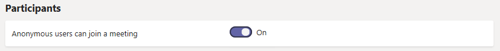
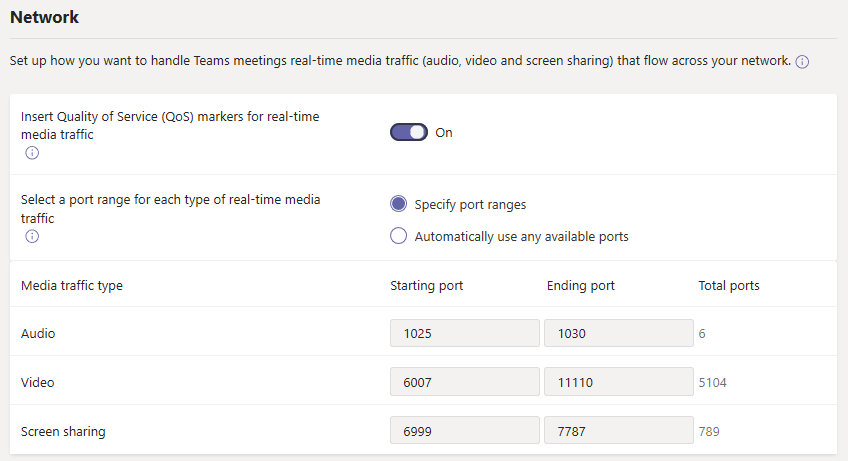

# Administrar la configuración de las reuniones en Microsoft TeamsManage meeting settings in Microsoft Teams

Como administrador, usted utiliza la configuración de las reuniones de Teams para controlar si los usuarios anónimos pueden unirse a las reuniones de Teams, personalice las invitaciones a las reuniones, y si desea habilitar la calidad de servicio (QoS), establecer intervalos de puertos para el tráfico en tiempo real.As an admin, you use Teams meetings settings to control whether anonymous users can join Teams meetings, customize meeting invitations, and if you want to enable Quality of Service (QoS), set port ranges for real-time traffic. Estas configuraciones se aplican a todas las reuniones de Teams que los usuarios programen en su organización.These settings apply to all Teams meetings that users schedule in your organization. Usted administra estos ajustes desde **Reuniones** > **Configuración de reunión** en el centro de administración de Microsoft Teams.You manage these settings from **Meetings** > **Meeting settings** in the Microsoft Teams admin center.

## Permitir que los usuarios anónimos se unan a las reunionesAllow anonymous users to join meetings

Con la unión anónima, cualquiera puede unirse a la reunión como usuario anónimo haciendo clic en el enlace de la invitación a la reunión.With anonymous join, anyone can join the meeting as an anonymous user by clicking the link in the meeting invitation. Para más información, consulte[Únase a una reunión sin una cuenta de Teams](https://support.office.com/article/join-a-meeting-without-a-teams-account-c6efc38f-4e03-4e79-b28f-e65a4c039508).To learn more, see [Join a meeting without a Teams account](https://support.office.com/article/join-a-meeting-without-a-teams-account-c6efc38f-4e03-4e79-b28f-e65a4c039508).

 **Usando el centro de administración de Microsoft Teams** **Using the Microsoft Teams admin center**

Para realizar estos cambios, debe ser administrador del servicio de Teams.You must be a Teams service admin to make these changes. Consulte [usar los roles de administrador de Teams para administrar los equipos](https://docs.microsoft.com/microsoftteams/using-admin-roles) para obtener información sobre cómo obtener roles y permisos de administrador.See [Use Teams administrator roles to manage Teams](https://docs.microsoft.com/microsoftteams/using-admin-roles) to read about getting admin roles and permissions.

1. Vaya al centro de administración.Go to the admin center.

2. En la navegación izquierda, diríjase a **Reuniones** > **Configuración de reunión**.In the left navigation, go to **Meetings** > **Meeting settings**.

3. En **Participantes**, Active **Usuarios anónimos pueden unirse a una reunión**.Under **Participants**, turn on **Anonymous users can join a meeting**.

    

> [!CAUTION]
> Si no desea que los usuarios anónimos se unan a las reuniones programadas por los usuarios de su organización, desactive esta opción.If you don't want anonymous users to join meetings scheduled by users in your organization, turn off this setting.

## Personalice las invitaciones a reunionesCustomize meeting invitations

Puede personalizar las invitaciones a reuniones de Teams para satisfacer las necesidades de su organización.You can customize Teams meeting invitations to meet your organization's needs. Puede agregar el logotipo de su organización e incluir información útil, como enlaces a su sitio web de apoyo y renuncia a la responsabilidad legal, y un pie de página sólo de texto.You can add your organization's logo and include helpful information, such as links to your support website and legal disclaimer, and a text-only footer.

### Consejos para crear un logotipo para las invitaciones a reunionesTips for creating a logo for meeting invitations  

1. Crear una imagen que no tenga más de 188 píxeles de ancho por 30 píxeles de alto (es bastante pequeña).Create an image that's no more than 188 pixels wide by 30 pixels tall (it's quite small).
2. Guarde la imagen en formato JPG o PNG.Save the image in JPG or PNG format.
3. Almacene la imagen en un lugar en el que todos los que reciban la invitación puedan acceder, como un sitio web público.Store the image in a location that everyone receiving the invitation can access, such as a public website.

    Ahora puede añadirlo a sus invitaciones a reuniones.Now you can add it to your meeting invitations. Vea los siguientes pasos.See the next steps.

### Personalice sus invitaciones a reunionesCustomize your meeting invitations

 **Usando el centro de administración de Microsoft Teams** **Using the Microsoft Teams admin center**

1. Vaya al centro de administración.Go to the admin center.
2. En la navegación izquierda, diríjase a **Reuniones** > **Configuración de reunión**.In the left navigation, go to **Meetings** > **Meeting settings**.
3. En **Invitación por correo electrónico**, haga lo siguiente:Under **Email invitation**, do the following:

    

    - **URL del logotipo** escriba la dirección URL en donde esté almacenado el logotipo.**Logo URL** Enter the URL where your logo is stored.
    - **URL jurídica** si su organización tiene un sitio web legal al que quiere que la gente vaya para cualquier asunto legal, introduzca la URL aquí.**Legal URL** If your organization has a legal website that you want people to go to for any legal concerns, enter the URL here.
    - **URL de ayuda** si su organización tiene un sitio web de apoyo al que quiere que la gente vaya si se encuentra con problemas, introduzca la URL aquí.**Help URL** If your organization has a support website that you want people to go to if they run into issues, enter the URL here.
    - **Pie de página** escriba el texto que quiera incluir como pie de página.**Footer** Enter text that you want to include as a footer.
4. Haga clic en**Vista previa de invitación**para ver una vista previa de su invitación a reunión.Click **Preview invite** to see a preview of your meeting invitation.
5. Cuando haya terminado, haga clic en **Guardar**.When you're done, click **Save**.
6. Espere una hora más o menos para que los cambios se propaguen.Wait an hour or so for the changes to propagate. Luego programe una reunión de Teams para ver cual es el aspecto de la invitación a reunión.Then schedule a Teams meeting to see what the meeting invitation looks like.  

## Establezca cómo quiere manejar el tráfico de medios en tiempo real para las reuniones de TeamsSet how you want to handle real-time media traffic for Teams meetings

Si está usando calidad de servicio (QoS) para priorizar el tráfico de red, puede habilitar marcadores de QoS y establecer intervalos de puertos para cada tipo de tráfico de medios.If you're using Quality of Service (QoS)to prioritize network traffic, you can enable QoS markers and set port ranges for each type of media traffic. Establecer los intervalos de puertos para los diferentes tipos de tráfico es sólo un paso en el manejo de los medios en tiempo real; consulte [Calidad de Servicio (QoS) en Teams](qos-in-teams.md) para más detalles.Setting port ranges for different traffic types is only one step in handling real-time media; see [Quality of Service (QoS) in Teams](qos-in-teams.md) for much more detail.

> [!IMPORTANT]
> Si habilita QoS o cambia la configuración en el centro de administración de Microsoft Teams para el servicio de Teams, también tendrá que [aplicar la configuración correspondiente a todos los dispositivos de usuario](QoS-in-Teams-clients.md) y todos los dispositivos de red internos para implementar por completo los cambios en QoS en Teams.If you enable QoS or change settings in the Microsoft Teams admin center for the Teams service, you'll also need to [apply matching settings to all user devices](QoS-in-Teams-clients.md) and all internal network devices to fully implement the changes to QoS in Teams.

  **Usando el centro de administración de Microsoft Teams** **Using the Microsoft Teams admin center**
1. Vaya al centro de administración.Go to the admin center.
2. En la navegación izquierda, diríjase a **Reuniones** > **Configuración de reunión**.In the left navigation, go to **Meetings** > **Meeting settings**.
3. En **Red**, haga lo siguiente:Under **Network**, do the following:

    

    - Para permitir que las marcas de DSCP se utilicen para QoS, Active **Insertar marcadores de calidad de servicio (QoS) para el tráfico de medios en tiempo real**.To allow DSCP markings to be used for QoS, turn on **Insert Quality of Service (QoS) markers for real-time media traffic**. Sólo tienes la opción de usar marcadores o no; no puedes establecer marcadores personalizados para cada tipo de tráfico.You only have the option of using markers or not; you can't set custom markers for each traffic type. Consulte [Seleccionar un método de implementación de QoS ](QoS-in-Teams.md#select-a-qos-implementation-method) para más información sobre los marcadores DSCP.See [Select a QoS implementation method](QoS-in-Teams.md#select-a-qos-implementation-method) for more on DSCP markers.
        > [!NOTE]
        > El etiquetado de DSCP se realiza normalmente a través de puertos de origen y el tráfico UDP se enruta a Transfport Relay con el puerto de destino de 3478 de forma predeterminada.DSCP tagging is typically done via Source Ports and UDP traffic will route to Transfport Relay with destination port of 3478 by default.  Si su empresa necesita etiquetar en los puertos de destino, póngase en contacto con el soporte técnico para habilitar la comunicación con el transporte de transporte con puertos UDP 3479 (audio), 3480 (vídeo) y 3481 (uso compartido).If your company requires tagging on destination ports, please contact support to enable communication to the Transport Relay with UDP ports 3479 (Audio), 3480 (Video) and 3481 (Sharing).
    - Para especificar los intervalos de los puertos, junto a **Seleccione un rango de puertos para cada tipo de tráfico de medios en tiempo real**, seleccione **Especificar rangos de puertos** y luego, introducir los puertos inicial y final para compartir audio, video y pantalla.To specify port ranges, next to **Select a port range for each type of real-time media traffic**, select  **Specify port ranges**, and then enter the starting and ending ports for audio, video, and screen sharing. La selección de esta opción es necesaria para implementar la QoS.Selecting this option is required to implement QoS.
        > [!IMPORTANT]
        > Si usted selecciona**Utilizar automáticamente cualquier puerto disponible**, se utilizan los puertos disponibles entre 1024 y 65535.If you select **Automatically use any available ports**, available ports between 1024 and 65535 are used. Use esta opción sólo cuando no implemente la QoS.Use this option only when not implementing QoS.
        >
        > Si se selecciona un rango de puertos demasiado estrecho, se producirán caídas y una mala calidad en las llamadas.Selecting a port range that is too narrow will lead to dropped calls and poor call quality. Las recomendaciones que figuran a continuación deben ser en lo mínimo.The recommendations below should be a bare minimum.

Si no está seguro de los rangos de puertos a utilizar en su entorno, los siguientes ajustes son un buen punto de partida.If you're unsure what port ranges to use in your environment, the following settings are a good starting point. Para obtener más información, consulte[Implementar la Calidad de servicio (QoS) en Microsoft Teams](QoS-in-Teams.md).To learn more, read [Implement Quality of Service (QoS) in Microsoft Teams](QoS-in-Teams.md). Estas son las marcas DSCP requeridas y los rangos de puertos de medios correspondientes sugeridos utilizados tanto por Teams como por ExpressRoute.These are the required DSCP markings and the suggested corresponding media port ranges used by both Teams and ExpressRoute.

### Intervalos de puertos y marcas DSCPPort ranges and DSCP markings

Tipo de tráfico de medios Media traffic type| Rango de puertos de origen del cliente \*Client source port range \* |ProtocoloProtocol|Valor de DSCPDSCP value|Clase DSCPDSCP class|
|:---             |:---                         |:---    |:---      |:---      |
|AudioAudio            | 50 000 – 50 01950,000–50,019               |TCP/UDPTCP/UDP |4646        |Desvío rápido (EF)Expedited Forwarding (EF)|
|VídeoVideo            | 50 020 – 50 03950,020–50,039               |TCP/UDPTCP/UDP |3434        |Desvío garantizado (AF41)Assured Forwarding (AF41)|
|Aplicación/Compartir pantallaApplication/Screen Sharing| 50 040 – 50 05950,040–50,059      |TCP/UDPTCP/UDP |1818        |Desvío garantizado (AF21)Assured Forwarding (AF21)|
| | | | |

\*Los intervalos de puertos que usted asigna no pueden superponerse y deben estar uno al lado del otro.\* The port ranges you assign cannot overlap and must be next to each other.

Después de que la QoS se haya utilizado durante un tiempo, tendrá información de uso sobre la demanda de cada una de estas tres cargas de trabajo, y podrá elegir qué cambios realizar en función de sus necesidades específicas.After QoS has been in use for a while, you'll have usage information on the demand for each of these three workloads, and you can choose what changes to make based on your specific needs. [Panel de calidad de llamadas](turning-on-and-using-call-quality-dashboard.md)será de gran ayuda con eso.[Call Quality Dashboard](turning-on-and-using-call-quality-dashboard.md) will be helpful with that.
