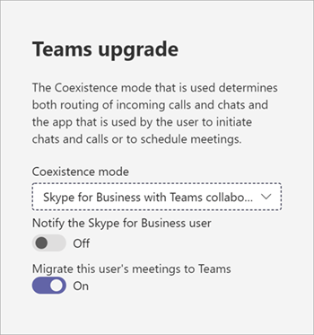

# Reuniones primeroMeetings First

"El primero de las reuniones" está dirigido y optimizado para organizaciones de Skype empresarial Server con Enterprise Voice on local que desean comenzar a usar las reuniones de Teams tan rápido como sea posible.“Meetings First” is targeted at and optimized for Skype for Business Server organizations with Enterprise Voice on premises who want to start using Teams meetings as rapidly as possible. Para estas organizaciones, las reuniones primero son una alternativa al uso del modo **islas** que da prioridad a la experiencia de reuniones de Teams.For these organizations, Meetings First is an alternative to using **Islands** mode that prioritizes the Teams meetings experience.

## ¿Qué son las reuniones en primer lugar?What is Meetings First?

Las reuniones primero se basan en el modo de coexistencia de **SfBWithTeamsCollabAndMeetings** .Meetings First is based on the **SfBWithTeamsCollabAndMeetings** coexistence mode. En primer lugar, reuniones no es un producto ni una característica: es una configuración que aprovecha las capacidades y características de Teams y de Skype empresarial para proporcionar una experiencia de coexistencia adaptada exclusiva.Meetings First is not a product or a feature—it is a configuration that leverages capabilities and features of Teams and Skype for Business to provide a uniquely tailored coexistence experience.

En las reuniones en primer lugar, los usuarios crean su reunión en Teams, mientras continúan usando Skype empresarial para conversaciones, llamadas y presencia.In Meetings First, users create their meeting in Teams, while continuing to use Skype for Business for chat, calling, and presence. No hay ninguna superposición de modalidades entre Teams y Skype empresarial.There is no overlap of modalities between Teams and Skype for Business. La conversación, las llamadas y la presencia están activadas en Skype empresarial y desactivadas en Teams.Chat, calling, and presence are on in Skype for Business and off in Teams. Esto permite escenarios únicos "juntos" entre Skype empresarial y los equipos que mejoran la experiencia del usuario durante la coexistencia, así como escenarios de interoperabilidad con usuarios **solo** de Teams.This enables unique “better together” scenarios between Skype for Business and Teams that enhance the user’s experience during coexistence, as well as interoperability scenarios with **Teams Only** users.

> [!Important]
> Las reuniones primero son más coincidentes para las organizaciones que tienen usuarios de la conversación de Active Teams.Meetings First is a better match for organizations who have no or few active Teams chat users. Los usuarios de la conversación de Active Teams no deben cambiar al modo de las reuniones en primer lugar, ya que perderían la posibilidad de chatear en Teams y acceder a su historial de chats.Active Teams chat users should not be switched to Meetings First mode, as they would lose the ability to chat in Teams and to access to their chat history. En su lugar, estos usuarios deben tener el modo **islas** y las reuniones solo se conceden a los usuarios que aún no están activos en la conversación en Teams.These users should be grandfathered in **Islands** mode instead, and Meetings First only granted to the users not yet active in chat in Teams.

## ¿Quién debe considerar primero las reuniones?Who should consider Meetings First?

En primer lugar, las reuniones se diseñaron para organizaciones que usan Skype empresarial Server con telefonía IP que desean acelerar su movimiento a reuniones de Teams, especialmente aquellos con una disciplina de ti sólida que desean una ruta de actualización determinista administrada a teams.Meetings First was designed for organizations who use Skype for Business Server with Enterprise Voice who want to accelerate their move to Teams meetings, especially those with strong IT discipline who want a managed, deterministic upgrade path to Teams.

En el caso de organizaciones complejas o grandes, las migraciones de voz suelen hacerse en cada sitio y pueden tardar mucho tiempo, posiblemente varios años, generando grandes escenarios de coexistencia.For complex or large organizations, voice migrations are typically done on a site-by-site basis and might take a long time, potentially several years, resulting in extended coexistence scenarios. Si esa coexistencia está en modo **islas** , los usuarios siempre tendrán la opción de dos soluciones de reunión (Skype empresarial y Teams), lo que puede dar lugar a situaciones confusas o subóptimas.If that coexistence is in **Islands** mode, users will always have the choice of two meeting solutions (Skype for Business and Teams), which can result in confusing or suboptimal situations. A diferencia de las migraciones de voz, las migraciones de reuniones generalmente se pueden completar en toda la empresa en un breve período de tiempo.Unlike voice migrations, meetings migrations can generally be completed across the entire company in a short amount of time. Las organizaciones que deseen cambiar de reunión a las reuniones de Teams tan rápido como sea posible (y sin esperar a que se complete la migración de voz) deberían considerar las reuniones en primer lugar.Organizations who want to completely switch to Teams meetings as quickly as possible (and without waiting for their voice migration to be complete) should consider Meetings First.

Es posible que en primer lugar las reuniones no sean útiles para organizaciones que no tienen usuarios de voz de empresa.Meetings First might not be useful to organizations who have no Enterprise Voice users. Estas organizaciones deberían poder actualizarse a **Teams** tan pronto como puedan adoptar reuniones de Teams.These organizations should be able to upgrade to **Teams Only** as soon as they are able to adopt Teams meetings. Deberían considerar la posibilidad de omitir las reuniones en primer lugar.They should consider skipping Meetings First.

Además, las reuniones son útiles para las organizaciones cuyo ámbito es una solución de reunión de reproducción pura, por ejemplo, cuando se emite una RFP de "reuniones-solo".In addition, Meetings First is useful to organizations whose scope is a pure-play meeting solution, for example when a “meetings-only” RFP is being issued.

## Características de las reuniones en primer lugarCapabilities in Meetings First

Reunión, en primer lugar, reúne las siguientes funciones:Meeting First brings the following capabilities together:

- [Aprovisionar un usuario de Skype empresarial Server (local)](https://docs.microsoft.com/microsoftteams/tutorial-audio-conferencing?tutorial-step=3) con la [Conferencia de audio](tutorial-audio-conferencing.yml)de Teams.[Provision a Skype for Business Server (on-premises) user](https://docs.microsoft.com/microsoftteams/tutorial-audio-conferencing?tutorial-step=3) with [Teams Audio Conferencing](tutorial-audio-conferencing.yml).
- [Servicio de migración de reuniones](https://docs.microsoft.com/skypeforbusiness/audio-conferencing-in-office-365/setting-up-the-meeting-migration-service-mms): las reuniones organizadas por el usuario se migrarán a la nube y se convertirán en reuniones de Teams, ya que el usuario se promueve a reuniones en primer lugar (requiere Exchange Online).[Meetings Migration Service](https://docs.microsoft.com/skypeforbusiness/audio-conferencing-in-office-365/setting-up-the-meeting-migration-service-mms): Meetings organized by the user will be migrated to the cloud and converted to Teams meetings as the user is promoted to Meetings First (requires Exchange Online).
- Experiencia de usuario optimizada en Teams, centrada en las reuniones de Teams y los equipos y canales (que, opcionalmente, se pueden ocultar con la [Directiva de permisos de aplicaciones](teams-app-permission-policies.md)); Los [equipos de chat privado, las llamadas y la presencia propia](teams-client-experience-and-conformance-to-coexistence-modes.md) no se exponen en las reuniones en primer lugar, lo que permite el esfuerzo de implementación y adopción para centrarse plenamente en las reuniones.Streamlined user experience in Teams, centered on Teams meetings and teams and channels (which can, optionally, be hidden using the [App Permissions policy](teams-app-permission-policies.md)); [Teams private chat, calling, and self-presence](teams-client-experience-and-conformance-to-coexistence-modes.md) are not exposed in Meetings First, enabling the deployment and adoption effort to fully focus on meetings.
- [Experiencia de reunión de equipos](tutorial-meetings-in-teams.yml)superiores.Superior [Teams meeting experience](tutorial-meetings-in-teams.yml).
- "Juntos es mejor" entre equipos y Skype empresarial:“Better Together” between Teams and Skype for Business: 
  - Suspensión automática: cuando se encuentra en una reunión en Teams, al entrar en una llamada en Skype empresarial, se pondrá en espera los equipos de la reunión y viceversa.Automatic hold: When in a meeting in Teams, getting in a call in Skype for Business will place the Teams meeting on hold, and vice-versa. Esto evita que los participantes de las reuniones hayan superpuesto las llamadas privadas.This prevents users from having their private calls overheard by the meetings participants.
    
  - Conciliación de presencia: la actividad en Teams se refleja en la presencia del usuario, que es la presencia de Skype empresarial, ya que la conversación y las llamadas están en Skype empresarial.Presence reconciliation: Activity in Teams is reflected in the user’s presence, which is the Skype for Business presence since chat and calling are in Skype for Business. En concreto, cuando los usuarios de las reuniones se encuentran en una reunión de Teams, su presencia se actualizará para reflejarlo.Specifically, when Meetings First users are in a Teams meeting, their presence will be updated to reflect that. Cuando presenten su pantalla, su presencia se actualizará para mostrar no molestar (según su configuración en Skype empresarial).When they present their screen, their presence will be updated to show Do Not Disturb (based on their settings in Skype for Business).
  - Reconciliación de control HID de dispositivo USB (también disponible en Mac): los controles de HID son aceptados por Teams durante las reuniones de Teams y Skype empresarial en todas las demás circunstancias.USB device HID control reconciliation (also available on Mac): The HID controls are honored by Teams while in Teams meetings and by Skype for Business in all other circumstances.
  - A menos que se indique lo contrario, las capacidades más juntas requieren clientes de escritorio de Windows recientes en este momento.Unless otherwise mentioned, Better Together capabilities require recent Windows desktop clients at this time.

## Requisitos previos para las reuniones en primer lugarPrerequisites for Meetings First

Los únicos requisitos rígidos para las reuniones son los mismos que los de los equipos con Active Directory local y una implementación local de Skype empresarial:The only hard requirements for Meetings First are the same as the requirements for Teams with on-premises Active Directory and a Skype for Business on-premises deployment:

- [Requisitos previos generales para Teams](upgrade-plan-journey-prerequisites.md), incluidos[General pre-requisites for Teams](upgrade-plan-journey-prerequisites.md), including
- [Identidad y autenticación en Teams](identify-models-authentication.md) y[Identity and authentication in Teams](identify-models-authentication.md) and
- [Configurar Azure Active Directory para Teams y Skype empresarial](https://docs.microsoft.com/skypeforbusiness/hybrid/configure-azure-ad-connect).[Configure Azure Active Directory for Teams and Skype for Business](https://docs.microsoft.com/skypeforbusiness/hybrid/configure-azure-ad-connect).

No es necesaria una [topología híbrida de Skype empresarial](https://docs.microsoft.com/skypeforbusiness/hybrid/configure-federation-with-skype-for-business-online) , pero se recomienda.A [Skype for Business hybrid topology](https://docs.microsoft.com/skypeforbusiness/hybrid/configure-federation-with-skype-for-business-online) is not required, but it is recommended. Algunas funciones, como el servicio de migración de reuniones y la interoperabilidad, dependen de esa topología.Some capabilities such as Meetings Migration Service and interoperability rely on that topology.

Las reuniones se admiten en primer lugar con cualquier versión de Skype empresarial Server (y se sabe que funciona con el servidor de Lync que ya no es compatible).Meetings First is supported with any version of the Skype for Business Server (and known to work with the no-longer-supported Lync Server). Es compatible con cualquier cliente de Skype empresarial que sea compatible, pero es mejor que las capacidades de forma conjunta requieran un cliente reciente.It is supported with any supported Skype for Business client, however Better Together capabilities require a recent client.

Una vez cumplidos estos requisitos (y no antes), los usuarios pueden tener una [licencia para Office 365 y Teams](https://docs.microsoft.com/office365/enterprise/assign-licenses-to-user-accounts).Once these requirements are met (and not prior), the users can be [licensed for Office 365 and Teams](https://docs.microsoft.com/office365/enterprise/assign-licenses-to-user-accounts).

Para las mejores reuniones en primer lugar, los usuarios deben estar habilitados para [Exchange Online](exchange-teams-interact.md), [SharePoint Online y OneDrive para la empresa](sharepoint-onedrive-interact.md), y para la creación de grupos de Office 365.For the best Meetings First experience, users should be enabled for [Exchange Online](exchange-teams-interact.md), [SharePoint Online, and OneDrive for Business](sharepoint-onedrive-interact.md), and Office 365 Group creation. Las reuniones se admiten en primer lugar para los usuarios cuyo buzón se encuentra en Exchange local, o que no tienen SharePoint Online o OneDrive para la empresa, u Office 365.Meetings First is supported for users whose mailbox is on Exchange on-premises, or who don’t have SharePoint Online or OneDrive For Business, or Office 365 Group creation. Sin embargo, su experiencia será menos completa.However, their experience will be less complete. En concreto, en el caso de las organizaciones que usan Exchange Server local, puede haber (dependiendo de la versión de Exchange Server) algunas limitaciones para crear y ver reuniones en el cliente de equipos, así como con respecto a las capacidades de cumplimiento.In particular, for organizations using Exchange Server on-premises, there might be (depending on the version of Exchange Server) some limitations to creating and viewing meetings from the Teams client, as well as with respect to compliance capabilities.

Como mínimo, los usuarios deben tener una [licencia para equipos](https://docs.microsoft.com/office365/admin/subscriptions-and-billing/assign-licenses-to-users?view=o365-worldwide).At minimum, users must be [licensed for Teams](https://docs.microsoft.com/office365/admin/subscriptions-and-billing/assign-licenses-to-users?view=o365-worldwide). Además, pueden tener una licencia de [audioconferencia](set-up-audio-conferencing-in-teams.md), si es necesario.In addition, they can be licensed for [Audio Conferencing](set-up-audio-conferencing-in-teams.md), if needed.

Le recomendamos que otorgue el modo [ **SfBOnly** o **SfBWithTeamsCollab** ](https://docs.microsoft.com/powershell/module/skype/grant-csteamsupgradepolicy?view=skype-ps) como valor predeterminado de tenant en el momento de otorgar la licencia a los usuarios.We recommend you [grant **SfBOnly** or **SfBWithTeamsCollab**](https://docs.microsoft.com/powershell/module/skype/grant-csteamsupgradepolicy?view=skype-ps) mode as tenant default at the time you license the users. Esto garantiza que los usuarios no empiecen a usar Teams por sí mismos en el modo de **islas** predeterminadas antes de estar listo para iniciar reuniones en primer lugar.This ensures users would not start using Teams on their own in the default **Islands** mode prior to you being ready to launch Meetings First.

Las reuniones se admiten primero en los clientes de escritorio (Windows y Mac), en los clientes del explorador y en los clientes móviles.Meetings First is supported on full desktop clients (Windows and Mac), on browser clients, and on mobile clients. También es compatible con [salas de Microsoft Teams](https://docs.microsoft.com/microsoftteams/room-systems/).It is also compatible with [Microsoft Teams Rooms](https://docs.microsoft.com/microsoftteams/room-systems/). Mejor juntos requiere el cliente de escritorio completo.Better Together requires the full desktop client.

## Prepararse para las reuniones de Teams en las reuniones en primer lugarPrepare for Teams meetings in Meetings First

Para que los usuarios tengan la mejor experiencia posible en las reuniones de Teams, debe hacer lo siguiente:For your users to have the best possible experience in Teams meetings, you should:

- Siga los pasos de [reuniones y conferencias de Microsoft Teams](deploy-meetings-microsoft-teams-landing-page.md), en especial.Follow the steps in [Meetings and conferencing for Microsoft Teams](deploy-meetings-microsoft-teams-landing-page.md), in particular.
- [Evaluar su entorno](3-envision-evaluate-my-environment.md).[Evaluate your environment](3-envision-evaluate-my-environment.md).
- [Preparar la red de su organización para Microsoft Teams](prepare-network.md).[Prepare your organization’s network for Microsoft Teams](prepare-network.md).
- Actualice sus salas de reunión con los [dispositivos y las soluciones](https://docs.microsoft.com/skypeforbusiness/certification/devices-meeting-rooms?toc=/MicrosoftTeams/toc.json&bc=/microsoftteams/breadcrumb/toc.json)de la sala de reuniones con capacidad para empresas, o use [la interoperabilidad de vídeo en la nube para Microsoft Teams](cloud-video-interop.md) para permitir que los dispositivos y las salas de terceros existentes se unan a las reuniones de Teams.Upgrade your meeting rooms with Teams capable [meeting room devices and solutions](https://docs.microsoft.com/skypeforbusiness/certification/devices-meeting-rooms?toc=/MicrosoftTeams/toc.json&bc=/microsoftteams/breadcrumb/toc.json), or use [Cloud Video Interop for Microsoft Teams](cloud-video-interop.md) to enable your existing third-party rooms and devices to join Teams meetings.
- Equipar a tus usuarios con [dispositivos de audio y video USB certificados](https://docs.microsoft.com/skypeforbusiness/certification/devices-usb-devices?toc=/MicrosoftTeams/toc.json&bc=/microsoftteams/breadcrumb/toc.json).Equip your users with [certified USB audio and video devices](https://docs.microsoft.com/skypeforbusiness/certification/devices-usb-devices?toc=/MicrosoftTeams/toc.json&bc=/microsoftteams/breadcrumb/toc.json).
- Prepararse para [impulsar la detección y la adopción de reuniones de Teams](adopt-microsoft-teams-landing-page.md).Prepare to [drive awareness and adoption for Teams meetings](adopt-microsoft-teams-landing-page.md).
- [Planee la administración del servicio](4-envision-plan-my-service-management.md).[Plan your service management](4-envision-plan-my-service-management.md).
- Familiarizarse con los completos informes de análisis de llamadas para [solucionar problemas de baja calidad](use-call-analytics-to-troubleshoot-poor-call-quality.md)de las llamadas.Familiarize yourself with the rich Call Analytics reports to [troubleshoot poor call quality](use-call-analytics-to-troubleshoot-poor-call-quality.md).

Es posible que considere la posibilidad de ejecutar un plan piloto preparado para producción de escala moderada en este momento.You might consider running a moderate scale production ready pilot at this stage.

## Configurar los usuarios para las reuniones en primer lugarConfigure users for Meetings First

Una vez que haya otorgado la licencia a los usuarios y haya preparado la organización para las reuniones de Teams, es el momento de habilitar a los usuarios para que las vean en primer lugar.Once you have licensed your users and prepared your organization for Teams meetings, it’s time to enable your users for Meetings First. Lo hemos simplificado: una sola configuración lo hará todo.We’ve made it easy: one single setting will do it all!

Todas las características y las experiencias de usuario de las reuniones en primer lugar, incluida la configuración del cliente de Teams y el [cumplimiento automático](teams-client-experience-and-conformance-to-coexistence-modes.md) de la experiencia del usuario, el servicio de migración de reuniones y las capacidades más juntas, se configuran al conceder al usuario (o Grupo de usuarios o valor predeterminado de inquilino) el modo de coexistencia de [SfBWithTeamsCollabAndMeetings](setting-your-coexistence-and-upgrade-settings.md) en el centro de [Administración de Microsoft Teams](manage-teams-in-modern-portal.md) o mediante [PowerShell](https://docs.microsoft.com/powershell/module/skype/grant-csteamsupgradepolicy?view=skype-ps).All capabilities and user experiences in Meetings First, including the Teams client configuration and [auto-conformance](teams-client-experience-and-conformance-to-coexistence-modes.md) of the user experience, Meetings Migration Service, and Better Together capabilities, are configured by granting the user (or group of users, or tenant default) the [SfBWithTeamsCollabAndMeetings coexistence mode](setting-your-coexistence-and-upgrade-settings.md) either in the [Microsoft Teams admin center](manage-teams-in-modern-portal.md) or by using [PowerShell](https://docs.microsoft.com/powershell/module/skype/grant-csteamsupgradepolicy?view=skype-ps).

De manera opcional, si desea ocultar la aplicación equipos y canales desde el punto de acceso izquierdo del cliente de los equipos de los usuarios para centrar aún más su experiencia en las reuniones, puede usar la [Directiva de permisos](teams-app-permission-policies.md)de la aplicación.Optionally, should you want to hide the Teams and Channels application from the left navigation of your users’ Teams client to further focus their experience on meetings, that can be achieved by using the [App Permission policy](teams-app-permission-policies.md).

## Análisis de llamadas y informesReporting and Call Analytics

Los análisis de llamadas y reporting de las reuniones de Teams en las reuniones en primer lugar no cambian de lo que están en otros modos.Reporting and Call Analytics for Teams meetings in Meetings First are unchanged from what they are in other modes.

## Vínculos relacionadosRelated links

Después de revisar este artículo, es posible que desee consultar [elegir las instrucciones para la actualización, la](upgrade-and-coexistence-of-skypeforbusiness-and-teams.md) [migración y](migration-interop-guidance-for-teams-with-skype.md)la interoperabilidad, y la coexistencia [con Skype empresarial](coexistence-chat-calls-presence.md) para obtener más información.After you review this article, you might want to consult [Choose your upgrade journey](upgrade-and-coexistence-of-skypeforbusiness-and-teams.md), [Migration and interoperability guidance](migration-interop-guidance-for-teams-with-skype.md), and [Coexistence with Skype for Business](coexistence-chat-calls-presence.md) for further details.

