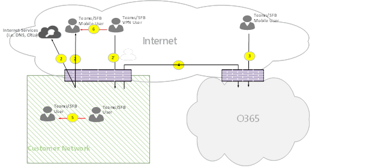
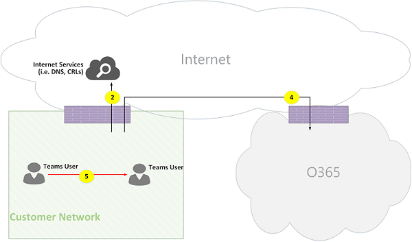
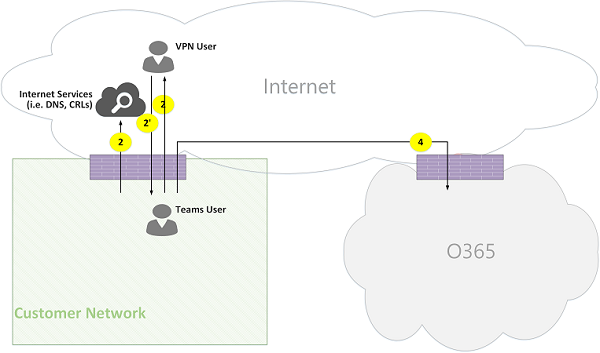
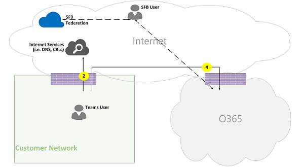
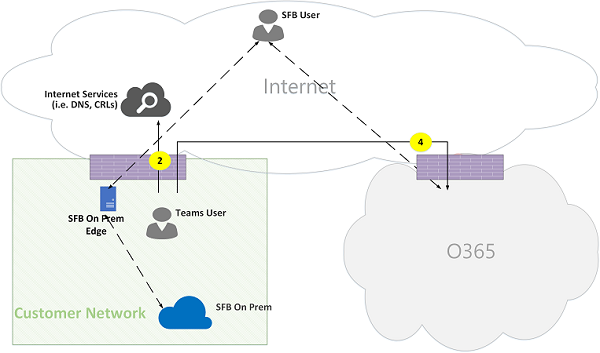
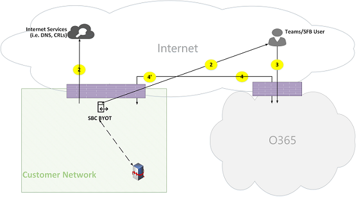

# Flujos de llamadas de Microsoft Teams

> [!TIP]
> Vea esta sesión para obtener información sobre cómo Teams aprovecha su red y cómo planear una conectividad de red óptima: Planeamiento de [red de Teams.](https://aka.ms/teams-networking)

## Información general

En este artículo se describe cómo Usa Teams el flujo de llamadas de Microsoft 365 u Office 365 en diversas topologías. Además, describe los flujos únicos de Teams que se usan para la comunicación multimedia de punto a punto. En el documento se describen estos flujos, su finalidad y su origen y terminación en la red. Para los fines de este artículo, asuma lo siguiente:

- El cliente local usa el flujo X para comunicarse con el servicio de Microsoft 365 u Office 365 en la nube. Procede de la red del cliente y termina como punto de conexión en Microsoft 365 u Office 365.

- El cliente local usa el flujo Y para comunicarse con un servicio de Internet del que Microsoft 365 u Office 365 tienen una dependencia. Procede de la red del cliente y termina como punto de conexión en Internet.

En este artículo se trata la siguiente información:

- **Fondo.** Proporciona información básica como redes que los flujos pueden atravesar, tipos de tráfico, instrucciones de conectividad desde la red del cliente a puntos de conexión de servicio de Microsoft 365 u Office 365, interoperabilidad con componentes de terceros y principios que utiliza Teams para seleccionar flujos de medios.

- **Las llamadas fluyen en diversas topologías.** Ilustra el uso de flujos de llamadas en diversas topologías. Para cada topología, la sección enumera todos los flujos admitidos y muestra cómo se usan estos flujos en varios casos de uso. Para cada caso de uso, se describe la secuencia y la selección de flujos mediante un diagrama de flujo.

- **Teams con optimización de Express Route.** Describe cómo se usan estos flujos cuando Express Route se implementa para la optimización, ilustrado con una topología simple.

## Información general

### Segmentos de red

**Red del cliente.** Este es el segmento de red que controla y administra. Esto incluye todas las conexiones de clientes dentro de las oficinas de los clientes, tanto con cable como inalámbricas, conexiones entre edificios de oficinas, conexiones a centros de datos locales y sus conexiones a proveedores de Internet, Express Route o cualquier otro emparejamiento privado.

Normalmente, la red de un cliente tiene varios perímetros de red con firewalls o servidores proxy, que aplican las directivas de seguridad de la organización y que solo permiten cierto tráfico de red que haya configurado y configurado. Como administra esta red, tiene control directo sobre el rendimiento de la red y le recomendamos que complete las evaluaciones de red para validar el rendimiento tanto dentro de los sitios de la red como desde la red a la red de Microsoft 365 u Office 365.

**Internet**. Este es el segmento de red que forma parte de su red general y que usarán los usuarios que se conecten a Microsoft 365 u Office 365 desde fuera de la red del cliente. También la usa parte del tráfico desde la red del cliente a Microsoft 365 u Office 365.

**Red privada visitada o de invitado.** Este es el segmento de red fuera de la red del cliente, pero no en la internet pública, que pueden visitar sus usuarios y sus invitados (por ejemplo, una red privada doméstica o una red privada empresarial, que no implementa Teams, donde pueden residir sus usuarios y sus clientes que interactúan con los servicios de Teams).

> [!NOTE]
> La conectividad con Microsoft 365 u Office 365 también es aplicable a estas redes.

**Microsoft 365 u Office 365.** Este es el segmento de red que admite los servicios de Microsoft 365 u Office 365. Se distribuye en todo el mundo, con bordes cercanos a la red del cliente en la mayoría de las ubicaciones. Entre las funciones se incluyen Retransmisión de transporte, servidor de conferencias y procesador de medios.

**Express Route (opcional).** Este es el segmento de red que forma parte de su red general y que le dará una conexión privada y dedicada a la red de Microsoft 365 u Office 365.

### Tipos de tráfico

**Multimedia en tiempo real.** Los datos encapsulados dentro del protocolo de transporte en tiempo real (RTP) que admiten cargas de trabajo de uso compartido de pantalla, vídeo y audio. En general, el tráfico multimedia es muy sensible a la latencia, por lo que sería mejor que este tráfico tomara la ruta más directa posible y que usara UDP frente a TCP como el protocolo de capa de transporte, que es el mejor transporte para medios interactivos en tiempo real desde una perspectiva de la calidad. (Tenga en cuenta que, como último recurso, los medios pueden usar TCP/IP y también se pueden túnel dentro del protocolo HTTP, pero no se recomienda debido a consecuencias de mala calidad). El flujo RTP está protegido con SRTP, en el que solo se cifra la carga.

**Señalización.** El vínculo de comunicación entre el cliente y el servidor, u otros clientes que se usan para controlar las actividades (por ejemplo, cuando se inicia una llamada) y entregar mensajes instantáneos. La mayoría del tráfico de señalización utiliza las interfaces REST basadas en HTTPS, aunque en algunos escenarios (por ejemplo, la conexión entre Microsoft 365 u Office 365 y un controlador de borde de sesión) usa el protocolo SIP. Es importante comprender que este tráfico es mucho menos sensible a la latencia, pero puede provocar cortes en el servicio o tiempos de espera en las llamadas si la latencia entre los puntos de conexión supera varios segundos.

### Conectividad con Microsoft 365 u Office 365

Teams requiere [conectividad a Internet.](https://docs.microsoft.com/office365/enterprise/assessing-network-connectivity) Las URL y los intervalos de direcciones IP de los puntos de conexión de Teams se muestran en los intervalos de direcciones IP y URL [de Office 365.](https://docs.microsoft.com/office365/enterprise/urls-and-ip-address-ranges) (Tenga en cuenta que se requiere la conectividad abierta a los puertos TCP 80 y 443, y a los puertos UDP 3478 a 3481). Además, Teams tiene una dependencia de Skype Empresarial Online, que también debe estar conectado a Internet.

La conectividad de los flujos de medios de Teams se implementa con procedimientos estándar de establecimiento de conectividad interactiva (ICE) de IETF.

### Restricciones de interoperabilidad

**Retransmisión multimedia de terceros.** Un flujo multimedia de Teams (es decir, donde uno de los puntos de conexión multimedia es Teams) puede atravesar solo retransmisión multimedia nativa de Teams o Skype Empresarial. No se admite la interoperabilidad con un relé multimedia de terceros. (Tenga en cuenta que un SBC de terceros en el límite con RTC debe finalizar la secuencia RTP/RTCP, protegerse con SRTP y no retransmitirla al próximo salto).

**Servidores proxy SIP de terceros.** Un cuadro de diálogo SIP de señalización de Teams con una puerta de enlace o SBC de terceros puede atravesar Teams o servidores proxy SIP nativos de Skype Empresarial. No se admite la interoperabilidad con un proxy SIP de terceros.

**B2BUA de terceros (o SBC).** Un flujo de medios de Teams hacia y desde la RTC termina por un SBC de terceros. Sin embargo, no se admite la interoperabilidad con un SBC de terceros dentro de la red de Teams (donde un SBC de terceros media dos puntos de conexión de Teams o Skype Empresarial).

### Tecnologías que no se recomiendan con Microsoft Teams

**red VPN.** No se recomienda para el tráfico multimedia (o el flujo 2'). El cliente VPN debe usar la VPN dividida y enrutar el tráfico multimedia como cualquier usuario externo que no sea vpn, como se especifica en la opción Permitir que los medios de Lync omita [un túnel VPN.](https://techcommunity.microsoft.com/t5/Skype-for-Business-Blog/Enabling-Lync-Media-to-Bypass-a-VPN-Tunnel/ba-p/620210)

> [!NOTE]
> Aunque el título indica Lync, también se aplica a Teams.

**Formas de paquetes.** No se recomienda ningún tipo de captura de paquetes, inspección de paquetes o dispositivos con shaper de paquetes, por lo que puede degradar significativamente la calidad.

### Principios

Hay cuatro principios generales que le ayudarán a comprender los flujos de llamadas para Microsoft Teams:

- Una conferencia de Microsoft Teams está hospedada por Microsoft 365 u Office 365 en la misma región en la que se unió el primer participante. (Tenga en cuenta que, si hay excepciones a esta regla en algunas topologías, se describirán en este documento y se ilustrarán con un flujo de llamadas adecuado).

- Un extremo multimedia de Teams en Microsoft 365 u Office 365 se usa en función de las necesidades de procesamiento multimedia y no en función del tipo de llamada. (Por ejemplo, una llamada de punto a punto puede usar un extremo multimedia en la nube para procesar los medios para la transcripción o la grabación, mientras que en una conferencia con dos participantes no se puede usar ningún punto de conexión multimedia en la nube). Sin embargo, la mayoría de las conferencias usarán un extremo multimedia para mezclar y enrutar fines, asignado donde se hospeda la conferencia. El tráfico multimedia enviado desde un cliente al punto de conexión multimedia se puede enrutar directamente o usar una retransmisión de transporte en Microsoft 365 u Office 365, si es necesario, debido a las restricciones del firewall de red del cliente.

- El tráfico multimedia de las llamadas de punto a punto toma la ruta más directa que está disponible, suponiendo que la llamada no requiere un punto de conexión multimedia en la nube (vea el principio anterior). La ruta preferida va directa al equipo remoto (cliente), pero si esa ruta no está disponible, entonces uno o más relés de transporte retransmitirán el tráfico. Se recomienda que el tráfico multimedia no transverso servidores como formas de paquetes, servidores VPN, y así sucesivamente, ya que esto afectará a la calidad de medios.

- El tráfico de señalización siempre se encuentra en el servidor más cercano al usuario.

Para obtener más información sobre los detalles de la ruta multimedia que se elige, consulte Información sobre los flujos de medios en [Microsoft Teams - BRK4016.](https://www.youtube.com/watch?v=1tmHMIlAQdo)

## Flujos de llamadas en diversas topologías

### Topología de Teams

Esta topología la usan los clientes que aprovechan los servicios de Teams de la nube sin ninguna implementación local, como Skype Empresarial Server o el enrutamiento directo de sistemas telefónicos. Además, la interfaz a Microsoft 365 u Office 365 se realiza a través de Internet sin Azure Express Route.

*Figura 1: Topología de Teams*

Tenga en cuenta que:

- La dirección de las flechas del diagrama anterior refleja la dirección de inicio de la comunicación que afecta a la conectividad en los perímetros empresariales. En el caso de UDP para medios, el primer paquete(s) puede fluir en la dirección inversa, pero estos paquetes pueden bloquearse hasta que fluya el paquete en la otra dirección.
- Teams se implementa en paralelo con Skype Empresarial Online, por lo que los clientes se muestran como "Usuario de Teams/SFB".

Puede encontrar más información sobre las siguientes topologías opcionales más adelante en el artículo:

- La implementación local de Skype Empresarial se describe en la **topología híbrida de Teams.**
- El enrutamiento directo de sistema telefónico (para conectividad RTC) se describe **en Teams con la topología de enrutamiento directo.**
- Express Route se describe en **Teams con la optimización de Express Route.**

**Descripciones de flujo:**

- **Flujo 2:** representa un flujo iniciado por un usuario de la red del cliente a Internet como parte de la experiencia del usuario en Teams. Algunos ejemplos de estos flujos son DNS y medios de punto a punto.
- **Flujo 2':** representa un flujo iniciado por un usuario remoto de Teams móvil, con una VPN a la red del cliente.
- **Flujo 3:** representa un flujo iniciado por un usuario remoto de Teams móvil a los puntos de conexión de Microsoft 365 u Office 365/Teams.
- **Flujo 4:** representa un flujo iniciado por un usuario de la red del cliente hasta los puntos de conexión de Microsoft 365 u Office 365/Teams.
- **Flujo 5:** representa un flujo multimedia de punto a punto entre un usuario de Teams y otro usuario de Teams o Skype Empresarial dentro de la red del cliente.
- **Flujo 6:** representa un flujo multimedia de punto a punto entre un usuario móvil remoto de Teams y otro usuario remoto de Teams móvil o Skype Empresarial a través de Internet.

#### Caso de uso: uno a uno

Las llamadas uno a uno usan un modelo común en el que el autor de la llamada obtendrá un conjunto de candidatos compuesto por direcciones IP o puertos, que incluyen los candidatos locales, de retransmisión y reflexivos (dirección IP pública del cliente como puede ver el relé). El autor de la llamada envía estos candidatos a la parte llamada; el autor de la llamada también obtiene un conjunto similar de candidatos y los envía al autor de la llamada. Los mensajes de comprobación de conectividad STUN se usan para encontrar las rutas de llamada o de elementos multimedia de terceros que funcionan y cuál es la mejor ruta de trabajo. Los medios (es decir, los paquetes RTP/RTCP protegidos con SRTP) se envían con la pareja de candidatos seleccionada. La retransmisión de transporte se implementa como parte de Microsoft 365 y Office 365.

Si los candidatos de puerto o dirección IP local tienen conectividad, se seleccionará la ruta directa entre los clientes (o mediante una NAT) para los medios. Si los clientes están en la red del cliente, se debe seleccionar la ruta directa. Esto requiere conectividad UDP directa dentro de la red del cliente. Si los clientes son usuarios de la nube nómadas, en función del NAT/firewall, los medios pueden usar conectividad directa.

Si un cliente es interno en la red del cliente y uno es externo (por ejemplo, un usuario de la nube móvil), es poco probable que funcione la conectividad directa entre los candidatos locales o reflexivos. En este caso, una opción es usar uno de los candidatos de retransmisión de transporte de cualquiera de los clientes (por ejemplo, el cliente interno obtuvo un candidato de retransmisión desde la retransmisión de transporte en Microsoft 365 u Office 365; el cliente externo necesita poder enviar paquetes STUN/RTP/RTCP a la retransmisión de transporte). Otra opción es que el cliente interno envíe al candidato de retransmisión obtenido por el cliente móvil en la nube. Tenga en cuenta que, aunque se recomienda encarecidamente la conectividad UDP para medios, se admite TCP.

**Pasos de alto nivel:**

1. El usuario de Teams A resuelve el nombre de dominio de dirección URL (DNS) con el flujo 2.
1. El usuario A de Teams asigna un puerto de retransmisión multimedia en Teams Transport Relay usando el flujo 4.
1. El usuario A de Teams envía una "invitación" con los candidatos de ICE mediante el flujo 4 a Microsoft 365 u Office 365.
1. Microsoft 365 u Office 365 envía una notificación al usuario B de Teams mediante el flujo 4.
1. El usuario B de Teams asigna un puerto de retransmisión multimedia en Teams Transport Relay usando el flujo 4.
1. El usuario B de Teams envía "respuesta" con los candidatos de ICE mediante el flujo 4, que se reenvía al usuario de Teams A mediante el Flujo 4.
1. El usuario de Teams A y el usuario de Teams B invocar pruebas de conectividad de ICE y se selecciona la mejor ruta multimedia disponible (consulte los diagramas siguientes para varios casos de uso).
1. Los usuarios de Teams envían telemetría a Microsoft 365 u Office 365 con el flujo 4.

**Dentro de la red del cliente:**

*Figura 2: Dentro de la red del cliente*

En el paso 7, se ha seleccionado el flujo multimedia de punto a punto 5.

Los medios son bidireccionales. La dirección del flujo 5 indica que un lado inicia la comunicación desde una perspectiva de conectividad, de forma coherente con todos los flujos del documento. En este caso, no importa la dirección que se usa porque ambos puntos de conexión están dentro de la red del cliente.

**Red del cliente a usuario externo (multimedia retransmitida por Retransmisión de transporte de Teams):**

*Figura 3: Red del cliente a usuario externo (multimedia retransmitida por Retransmisión de transporte de Teams)*

En el paso 7, se selecciona el flujo 4 de la red del cliente a Microsoft 365 u Office 365 y el flujo 3, desde el usuario móvil remoto de Teams a Microsoft 365 u Office 365. Estos flujos los retransmite Teams Transport Relay en Microsoft 365 u Office 365.

Los medios son bidireccionales, donde la dirección indica qué lado inicia la comunicación desde una perspectiva de conectividad. En este caso, estos flujos se utilizan para la señalización y los medios, con diferentes protocolos y direcciones de transporte.

**Red del cliente a usuario externo (medios directos):**

*Figura 4: Red del cliente a usuario externo (medios directos)*

En el paso 7, el flujo 2, desde la red del cliente a Internet (el punto del cliente), está seleccionado.

- Los elementos multimedia directos con un usuario móvil remoto (no retransmitido a través de Microsoft 365 u Office 365) son opcionales. En otras palabras, el cliente puede bloquear esta ruta para exigir una ruta multimedia a través de retransmisión de transporte en Microsoft 365 u Office 365.

- Los medios son bidireccionales. La dirección del flujo 2 para el usuario móvil remoto indica que un lado inicia la comunicación desde una perspectiva de conectividad.

**Usuario de VPN a usuario interno (multimedia retransmitida por Retransmisión de transporte de Teams)**

*Figura 5: Usuario de VPN a usuario interno (multimedia retransmitido por Retransmisión de transporte de Teams)*

La señalización entre la VPN y la red del cliente está usando el flujo 2'. La señalización entre la red del cliente y Microsoft 365 u Office 365 está usando el flujo 4. Sin embargo, los medios omiten la VPN y se enruten mediante los flujos 3 y 4 a través de retransmisión multimedia de Teams en Microsoft 365 u Office 365.

**Usuario de VPN a usuario interno (medios directos)**

*Figura 6: Usuario de VPN a usuario interno (medios directos)*

La señalización entre la VPN y la red del cliente está usando el flujo 2'. La señalización entre la red del cliente y Microsoft 365 u Office 365 está usando el flujo 4. Sin embargo, los medios omiten la VPN y se enruta mediante el flujo 2 desde la red del cliente a Internet.

Los medios son bidireccionales. La dirección del flujo 2 para el usuario móvil remoto indica que un lado inicia la comunicación desde una perspectiva de conectividad.

**Usuario de VPN a usuario externo (medios directos)**

*Figura 7: Usuario de VPN a usuario externo (medios directos)*

La señalización entre el usuario de una VPN y la red del cliente está usando el flujo 2' y el flujo 4 hasta Microsoft 365 u Office 365. Sin embargo, los medios omiten vpn y se enruta mediante el flujo 6.

Los medios son bidireccionales. La dirección del flujo 6 para el usuario móvil remoto indica que un lado inicia la comunicación desde una perspectiva de conectividad.

#### Caso de uso: De Teams a RTC a través de Microsoft 365 u Tronco de Office 365

Microsoft 365 y Office 365 tienen un sistema telefónico que permite realizar y recibir llamadas de la red telefónica conmutada (RTC). Si el tronco RTC está conectado mediante el plan de llamadas de sistema telefónico, no hay requisitos de conectividad especiales para este caso de uso. (Si desea conectar su propio tronco RTC local a Microsoft 365 u Office 365, puede usar el enrutamiento directo de sistema telefónico).

*Figura 8: Teams para RTC a través de Tronco de Office 365*

#### Caso de uso: Reunión de Teams

El servidor de conferencias de audio/vídeo/pantalla compartida (VBSS) forma parte de Microsoft 365 y Office 365. Tiene una dirección IP pública que debe ser accesible desde la red del cliente y debe ser accesible desde un cliente en la nube nómadas. Cada cliente o punto de conexión debe poder conectarse al servidor de conferencias.

Los clientes internos obtendrán candidatos locales, reflexivos y de retransmisión de la misma manera que se describe para las llamadas uno a uno. Los clientes enviarán estos candidatos al servidor de conferencias en una invitación. El servidor de conferencias no usa retransmisión puesto que tiene una dirección IP accesible públicamente, por lo que responde con la dirección IP local candidata. El cliente y el servidor de conferencia comprobarán la conectividad de la misma manera que se describe para las llamadas de uno a uno.

Tenga en cuenta que:

- Los clientes de Teams no pueden unirse a reuniones de Skype Empresarial y los clientes de Skype Empresarial no pueden unirse a reuniones de Teams.

- De manera opcional, un usuario de RTC puede llamar o llamar, dependiendo del aprovisionamiento de conferencias o llamadas RTC del organizador de la reunión.

- Un usuario invitado o un usuario cliente puede unirse desde una red privada de invitado, que está protegida mediante FW/NAT con reglas estrictas.

*Figura 9: Reunión de Teams*

#### Caso de uso: Federación con Skype Empresarial local

**Multimedia retransmitida por Retransmisión de transporte de Teams en Microsoft 365 u Office 365**

*Figura 10: Multimedia retransmitida por Retransmisión de transporte de Teams en Office 365*

Tenga en cuenta que:

- La federación es, por definición, una comunicación entre dos inquilinos. En este caso, el inquilino A, que usa Teams, federa con el inquilino B, que usa Skype Empresarial local. Si el espacio empresarial B también usa Microsoft 365 u Office 365, el cliente de Skype Empresarial habría usado el flujo 3 para conectarse con Microsoft 365 u Office 365.

- La señalización y los medios desde el cliente federado de Skype Empresarial a Skype Empresarial Server local están fuera del ámbito de este documento. Sin embargo, esto se ilustra aquí para mayor claridad.

- La señalización entre Teams y Skype Empresarial está puenteada por una puerta de enlace.

- Multimedia en este caso la retransmite Teams Transport Relay a la red del cliente y el cliente remoto de Skype Empresarial usando el flujo 4.

**Multimedia retransmitido por Skype Empresarial Media Relay en inquilino federado**

*Figura 11: Multimedia retransmitida por Retransmisión de medios de Skype Empresarial en inquilino federado*

Tenga en cuenta que:

- La señalización y los medios desde el cliente federado de Skype Empresarial a un skype empresarial local están fuera del ámbito de este documento. Sin embargo, esto se ilustra aquí para mayor claridad.

- La señalización entre Teams y Skype Empresarial está puenteada por una puerta de enlace.

- En este caso, los medios se retransmiten mediante Retransmisión multimedia local de Skype Empresarial a la red del cliente mediante el flujo 2. (Tenga en cuenta que el tráfico desde el usuario de Teams a la retransmisión multimedia remota en la red del cliente federado será bloqueado inicialmente por media Relay hasta que el tráfico empiece a fluir en la dirección inversa. Sin embargo, el flujo bidireccional abrirá la conectividad en ambas direcciones).

**Directo (punto a punto)**

*Figura 12: Directa (punto a punto)*

### Topología híbrida de Teams

Esta topología incluye Teams con una implementación local de Skype Empresarial.

*Figura 13: Topología híbrida de Teams*

- La dirección de las flechas del diagrama anterior refleja la dirección de inicio de la comunicación que afecta a la conectividad en los perímetros empresariales. En el caso de UDP para medios, el primer paquete(s) puede fluir en la dirección inversa, pero estos paquetes pueden bloquearse hasta que fluya el paquete en la otra dirección.

- Teams se implementa en paralelo con Skype Empresarial Online, por lo que los clientes se muestran como "Usuario de Teams/SFB".

Flujo adicional (en la parte superior de la topología de Teams):

- **Flujo 5A:** representa un flujo multimedia de punto a punto entre un usuario de Teams dentro de la red del cliente y un relé multimedia local de Skype Empresarial en el perímetro de la red del cliente.

#### Caso de uso: Teams en Skype Empresarial uno a uno

**Implementación híbrida dentro de la red del cliente**

*Figura 14: Implementación híbrida dentro de la red del cliente*

La señalización entre Teams y Skype Empresarial está puenteada por una puerta de enlace. Sin embargo, los medios se enruta directamente de punto a punto dentro de la red del cliente mediante el flujo 5.

**Red de cliente híbrida con usuario externo de Skype Empresarial: retransmitido por Microsoft 365 u Office 365**

*Figura 15: Red de cliente híbrida con usuario externo de Skype Empresarial retransmitido por Office 365*

Tenga en cuenta que:

- La señalización y los elementos multimedia desde el cliente de Skype Empresarial a un skype empresarial local están fuera del ámbito de este documento. Sin embargo, esto se ilustra aquí para mayor claridad.

- La señalización entre Teams y Skype Empresarial está puenteada por una puerta de enlace.

- Los medios se retransmiten a través de Teams Transport Relay a la red del cliente a través del flujo 4.

**Red de cliente híbrida con usuario externo de Skype Empresarial: retransmitido por el servidor perimetral local**

*Figura 16: Red de cliente híbrida con usuario externo de Skype Empresarial retransmitido por edge local*

Tenga en cuenta que:

- La señalización y los elementos multimedia desde el cliente de Skype Empresarial a un skype empresarial local no están fuera del ámbito de este documento. Sin embargo, esto se ilustra aquí para mayor claridad.

- La señalización está puenteada por una puerta de enlace.

- Media is relay by Skype for Business Media Relay within Skype for Business on-premises edge to Teams user within the customer network using media flow 5A.

### Teams con topología de enrutamiento directo de sistema telefónico

Esta topología incluye Teams con enrutamiento directo de Sistema telefónico.

El enrutamiento directo le permite usar un proveedor de servicios de red telefónica conmutada (RTC) de terceros emparejando un dispositivo de hardware compatible con controlador de borde de sesión (SBC) local con Microsoft 365 u Office 365 y conectando después el tronco de telefonía a ese dispositivo.

Para admitir este escenario, el cliente debe implementar una SBC certificada para enrutamiento directo de uno de los partners certificados de Microsoft. El SBC debe configurarse según lo recomendado por el proveedor y ser enrutable desde Microsoft 365 u Office 365 para el tráfico UDP directo. Los elementos multimedia pueden fluir directamente desde Teams o desde el cliente de Skype Empresarial hasta la SBC (omitiendo la puerta de enlace de Teams) o pasando por la puerta de enlace de Teams. La conectividad con la SBC, cuando el tronco está configurado para omitir la puerta de enlace de Teams, se basa en ICE, donde SBC admite ICE-Lite, mientras que el extremo multimedia de Teams/Skype Empresarial admite la forma completa de ICE.

*Figura 17: Topología de enrutamiento directo de Teams con sistema telefónico

Tenga en cuenta que:

- La dirección de las flechas del diagrama anterior refleja la dirección de inicio de la comunicación que afecta a la conectividad en los perímetros empresariales. En el caso de UDP para medios, el primer paquete(s) puede fluir en la dirección inversa, pero estos paquetes pueden bloquearse hasta que fluya el paquete en la otra dirección.

- Teams se implementa en paralelo con Skype Empresarial Online, por lo que los clientes se muestran como "Usuario de Teams/SFB".

Flujos adicionales (en la parte superior de la topología en línea de Teams):

- Flujo **4':** representa un flujo desde Microsoft 365 u Office 365 a la red del cliente, que se usa para establecer una conexión entre el servidor multimedia de Teams en la nube y el SBC local.
- **Flujo 5B:** representa un flujo multimedia entre el usuario de Teams dentro de la red del cliente con el SBC de enrutamiento directo en modo de omisión.
- **Flujo 5C:** representa un flujo de medios entre la SBC de enrutamiento directo a otro SBC de enrutamiento directo en un modo de omisión de llamada de rtc.

**Usuario interno con enrutamiento directo (multimedia retransmitido por Retransmisión de transporte de Teams)**

*Figura 18: Usuario interno con enrutamiento directo (medios retransmitido por Retransmisión de transporte de Teams)*

Tenga en cuenta que:

- La SBC debe tener una dirección IP pública enrutable desde Microsoft 365 u Office 365.

- La señalización y los medios desde la SBC a Microsoft 365 u Office 365 y viceversa usan el flujo 4 y/o el flujo 4'.

- La señalización y los medios desde el cliente dentro de la red del cliente hasta Microsoft 365 u Office 365 usan el flujo 4.

**Usuario remoto con enrutamiento directo (los medios se enruta a través de un servidor multimedia (MP))**

*Figura 19: Usuario remoto con enrutamiento directo (los medios se enruta a través de un servidor multimedia (MP))*

Tenga en cuenta que:

- La SBC debe tener una dirección IP pública enrutable desde Microsoft 365 u Office 365.

- La señalización y los medios desde la SBC a Microsoft 365 u Office 365 y viceversa usan el flujo 4 y/o el flujo 4'.

- La señalización y los medios desde el cliente de Internet a Microsoft 365 u Office 365 usan el flujo 3.

**Enrutamiento directo (omisión de medios) del usuario interno**

*Figura 20: Enrutamiento directo de usuario interno (omisión de medios)*

Tenga en cuenta que:

- La SBC debe tener una dirección IP pública enrutable desde Microsoft 365 u Office 365.

- La señalización de SBC a Microsoft 365 u Office 365 y viceversa usa el flujo 4 y/o el flujo 4'.

- La señalización desde el cliente dentro de la red del cliente a Microsoft 365 u Office 365 usa el flujo 4.

- Los medios desde el cliente dentro de la red del cliente hasta la SBC dentro de la red del cliente usan el flujo 5B.

**Usuario remoto con enrutamiento directo (omisión de medios retransmitida por Retransmisión de transporte de Teams)**

*Figura 21: Usuario remoto con enrutamiento directo (omisión de medios retransmitida por Teams Transport Relay)*

Tenga en cuenta que:

- La SBC debe tener una dirección IP pública enrutable desde Microsoft 365 u Office 365 e Internet.

- La señalización desde la SBC a Microsoft 365 u Office 365 y viceversa usa el flujo 4 y/o el flujo 4'.

- La señalización desde el cliente en Internet a Microsoft 365 u Office 365 usa el flujo 3.

- Los medios desde el cliente en Internet a la SBC dentro de la red del cliente usan los flujos 3 y 4 retransmisión por Teams Transport Relay.

**Enrutamiento directo de usuario remoto (omisión de medios directa)**

*Figura 22: Enrutamiento directo de usuario remoto (omisión de medios directa)*

Tenga en cuenta que:

- La SBC debe tener una dirección IP pública enrutable desde Microsoft 365 u Office 365 e Internet.

- La señalización desde la SBC a Microsoft 365 u Office 365 y viceversa usa el flujo 4 y/o el flujo 4'.

- La señalización desde el cliente en Internet a Microsoft 365 u Office 365 usa el flujo 3.

- Los medios desde el cliente en Internet hasta la SBC dentro de la red del cliente usan el flujo 2.

**Enrutamiento directo (omisión de medios): llamada DE RTC al directorio (debido al desvío o transferencia de llamadas)**

*Figura 23: Enrutamiento directo (omisión de medios) - Llamada de rtc al redondear la red (debido al desvío o transferencia de llamadas)*

Tenga en cuenta que:

- La SBC debe tener una dirección IP pública enrutable desde Microsoft 365 u Office 365.

- La señalización desde la SBC a Microsoft 365 u Office 365 y viceversa usa el flujo 4 y/o el flujo 4'.

- El cliente no se encuentra en el bucle de señalización y multimedia después de que la llamada se desanclar de RTC a RTC.

- Los medios desde la instancia SBC A dentro de la red del cliente hasta la instancia B de SBC dentro de la red del cliente (donde A y B pueden ser la misma instancia) usan el flujo 5C.

**Enrutamiento directo (multimedia a través de Microsoft 365 u Office 365): llamada de rtc de dos inquilinos**

*Figura 24: Enrutamiento directo (medios a través de Microsoft 365 u Office 365): llamada de red de rtc en dos inquilinos*

Tenga en cuenta que:

- La SBC debe tener una dirección IP pública enrutable desde Microsoft 365 u Office 365.

- La señalización desde la SBC a Microsoft 365 u Office 365 y viceversa usa el flujo 4 y/o el flujo 4'.

- El cliente no se encuentra en el bucle de señalización y multimedia después de que la llamada se desanclar de RTC a RTC.

- Los medios desde la instancia SBC A dentro de la red de cliente X a SBC instancia B se deben retransmitir a través de Microsoft 365 u Office 365 Media Server y no puede usar el modo de omisión.

## Teams con optimización de Express Route

*Figura 25: Teams con optimización de Express Route*

En el caso de que Express Route esté justificado e implementado, los flujos de Teams se podrían volver a enrutar desde el flujo 4 al flujo 1 y del flujo 4' al flujo 1'. Sin embargo, la aplicación Teams tiene una dependencia difícil en otros flujos de Microsoft 365 u Office 365 a través de Internet mediante los flujos 4 y 4'; por lo tanto, estos flujos no deben bloquearse.

Tenga en cuenta que el tráfico perimetral híbrido de Skype Empresarial se enruta a Internet y no a Express Route para comunicarse con usuarios externos y federar con otros inquilinos.

Para evitar flujos asimétricos, el redireccionamiento debe estar en ambas direcciones. Es decir, una dirección dentro de la red del cliente se enruta a través de Internet o Express Route, en función de la optimización, pero no a través de ambas.

**Red del cliente a usuario externo (multimedia retransmitida por Retransmisión de transporte de Teams):**

*Figura 26: Red del cliente a usuario externo (multimedia retransmitida por Retransmisión de transporte de Teams)*

**Pasos de alto nivel:**

1. El usuario de Teams en la red del cliente resuelve el nombre de dominio de dirección URL (DNS) mediante flow2.
1. El usuario de Teams dentro de la red del cliente asigna un puerto de retransmisión multimedia en Teams Transport Relay usando el flujo 1.
1. El usuario de Teams dentro de la red del cliente envía "invitación" con los candidatos de ICE usando el flujo 1 a Microsoft 365 u Office 365.
1. Microsoft 365 u Office 365 envía una notificación al usuario externo de Teams usando el flujo 3.
1. El usuario externo de Teams asigna un puerto de retransmisión multimedia en Teams Transport Relay usando el flujo 3.
1. El usuario externo de Teams envía "respuesta" con los candidatos de ICE mediante el flujo 3, que se reenvía al usuario de Teams A mediante el Flujo 1.
1. El usuario de Teams A y el usuario de Teams B invocar pruebas de conectividad de ICE y selecciona los flujos 1 y 3, que son retransmitido por Teams Transport Relay.
1. Los usuarios de Teams envían telemetría a Microsoft 365 u Office 365 mediante los flujos 1 y 3.

> [!NOTE]
> El flujo 4 debe habilitarse para admitir las dependencias de la aplicación Teams en otros micro services que obligan al flujo 4.
