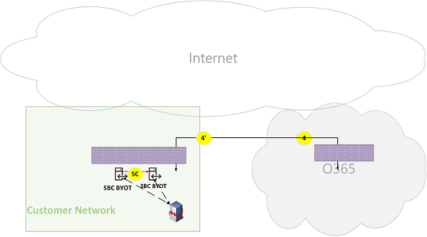

# Flujos de llamada de Microsoft Teams OnlineMicrosoft Teams Online Call Flows

> [!Tip]
> Vea la sesión siguiente para obtener más información cómo los equipos aprovecha la red y cómo planear mejor para la conectividad de red óptima: [Planeación de los equipos de red](https://aka.ms/teams-networking)Watch the following session to learn how to Teams leverages your network and how to best plan for optimal network connectivity: [Teams Network Planning](https://aka.ms/teams-networking)

## Información generalOverview
Este documento describe cómo utiliza la carga de trabajo de los equipos flujos de Office 365 en varias topologías.This document describes how Teams workload utilizes Office 365 flows in various topologies. Además, especifica únicos flujos de los equipos que se usan para la comunicación de punto a punto medio.In addition, it specifies unique Teams flows that are used for peer to peer media communication. El documento enumera estos flujos y describe su propósito y sus redes de origen y terminación.The document enumerates these flows and describes their purpose and their origin/termination networks. Por ejemplo, flujo de X se usa en Office 365 cliente local para comunicarse con el servicio Office 365 en la nube, se originó en la red del cliente y finalizadas por un extremo en nube de Office 365, y flujo Y se usa en Office 365 cliente local para comunicarse con un servicio en Internet, que Office 365 tiene dependencia de, se originó en la red del cliente y se termina por un extremo en Internet.For example, flow X is used by Office 365 client on premises to communicate with Office 365 service in the cloud, originated from the Customer Network and terminated by an endpoint in Office 365 cloud, and flow Y is used by Office 365 client on premises to communicate with a service on the Internet, that Office 365 has dependency on, originated from the Customer Network, and is terminated by an endpoint on the Internet.

El documento tiene tres secciones principales.The document has three main sections. La primera proporciona una información de fondo, como las redes (que es posible que atraviesan los flujos de Office 365), el tipo de tráfico, directrices sobre la conectividad de red del cliente para los extremos de servicio de Office 365, interoperabilidad con componentes de terceros y entidades de seguridad que se utilizan por parte de equipos para seleccionar los flujos de medios.The first provides a background information, such as networks (that Office 365 flows may traverse), type of traffic, connectivity guidance from Customer Network to Office 365 service endpoints, interoperability with third party components and principals that are used by Teams to select media flows. La segunda ilustra el uso de estos flujos en varias topologías.The second illustrates the usage of these flows in various topologies. Para cada topología, se enumeran todos los flujos de admitidos y se muestra cómo se utilizan estos flujos a través de varios casos de uso.For each topology, it enumerates all supported flows and illustrates how these flows are used via several use cases. Para cada caso de uso, describen la secuencia y selección de flujos de a través de un diagrama de flujo.For each use case, it describes the sequence and selection of flows via a flow diagram. La tercera describe cómo se utilizan estos flujos cuando se implementa ruta Express para la optimización, que se muestra a través de una topología simple.The third describes how these flows are utilized when Express Route is deployed for optimization, illustrated via a simple topology.

## Información generalBackground
### Segmentos de redNetwork Segments
**Red del cliente**: éste es el segmento de red que forma parte de la red general que puede controla y administrar.**Customer Network**: This is the network segment that is part of your overall network that you control and manage. Esto incluye todas las conexiones de cliente dentro de las oficinas de atención al cliente, ya sea por cable o inalámbrica, entre edificios de oficinas, en centros de datos locales y las conexiones a proveedores, ruta de Express o cualquier otro interconexión privada de Internet.This includes all customer connections within customer offices, whether wired or wireless, between office buildings, to on-premises datacenters, and your connections to Internet providers, Express Route or any other private peering. 

Normalmente, una red de cliente tiene varias perímetros de red con servidores de seguridad o servidores proxy, que aplicar las directivas de seguridad de una organización y que sólo permiten determinado el tráfico de red que ha configurado y configurado.Typically, a customer network has several network perimeters with firewalls and/or proxy servers, which enforce an organization's security policies and that only allow certain network traffic that you have set up and configured. Debido a que el cliente administra esta red, el cliente tiene control directo sobre el rendimiento de la red y se recomienda que el cliente completado red evaluaciones para validar el rendimiento dentro de los sitios en la red y de su red a la red de Office 365.Because the customer manages this network, the customer has direct control over the performance of the network, and it is highly recommended that the customer complete network assessments to validate performance both within sites in your network and from your network to Office 365 network. Skype para profesionales de implementación local y controlador de borde de sesión de RTC para conectarse con RTC a través de la red (es decir, el enrutamiento directo) son opcionales.Skype for Business on premises deployment and PSTN Session Border Controller to connect with PSTN through your network (i.e., Direct Routing) are optional.

**Internet**: éste es el segmento de red que forma parte de la red general que se usará por los usuarios que se conectan a Office 365 nube desde fuera de la red del cliente.**Internet**: This is the network segment that is part of your overall network that will be used by users who are connecting to Office 365 Cloud from outside of the Customer Network. También se usa por parte del tráfico de la red del cliente en la nube de Office 365.It is also used by some traffic from the Customer Network to Office 365 Cloud. 

**Red privada visitado/invitado**: éste es el segmento de red fuera de la red del cliente, pero no en Internet pública, que es posible que visite los usuarios o sus invitados.**Visited/Guest private Network**: This is the network segment outside your Customer Network, but not in the public Internet, that your users and/or their guests may visit. Por ejemplo, principal red privada o una red privada de Enterprise, que no distribuye los equipos, donde es posible que residen los usuarios o sus clientes que interactúan con los servicios de los equipos.For example, home private network or an Enterprise private Network, that does not deploy Teams, where your users and/or their customers that interact with Teams services, may reside.

>**Nota**: la conectividad con Office 365b también es aplicable a estas redes.**Note**: Connectivity to Office 365b is also applicable to these networks.

**En la nube de Office 365**: éste es el segmento de red que admita servicios de Office 365.**Office 365 Cloud**: This is the network segment that supports Office 365 services. Se distribuye en todo el mundo con bordes cerca de la red del cliente en la mayoría de las ubicaciones.It is distributed worldwide with edges in proximity to Customer Network in most locations. Funciones que se mencionan en este documento incluyen retransmisión de transporte, servidor de conferencia y procesador de medios.Functions mentioned in this document include Transport Relay, conferencing server and Media Processor. 

**Ruta de Express (opcional)**: éste es el segmento de red que forma parte de la red general que le proporcionará una conexión privada y dedicada a la red de Office 365.**Express Route (Optional)**: This is the network segment that is part of your overall network that will give you a dedicated, private connection to the Office 365 network.

### Tipos de tráficoTypes of traffic

**Multimedia en tiempo real**: datos que se encapsulan en RTP (Protocolo de transporte en tiempo real) y admite audio, vídeo y uso compartido de las cargas de trabajo de pantalla.**Real-time media**: Data encapsulated within RTP (Real-time Transport Protocol) and supports audio, video and screen sharing workloads. En general, el tráfico de medios altamente es latencia confidencial, por lo que sería conveniente este tráfico para tomar la ruta más directa posible y usar UDP frente a TCP como protocolo de capa de transporte, que es el transporte recomendado para los medios interactivos en tiempo real desde la perspectiva de calidad.In general, media traffic is highly latency sensitive, so you would want this traffic to take the most direct path possible, and to use UDP versus TCP as the transport layer protocol, which is the best transport for interactive real time media from quality perspective. (Nota: como último recurso, pueden usar TCP/IP y también un túnel dentro del protocolo HTTP de medios, pero no se recomienda debido a las implicaciones de mala calidad.) Flujo RTP se protege mediante SRTP, en la que se cifra sólo la carga.(Note: As a last resort, media can use TCP/IP and also be tunneled within HTTP protocol, but it is not recommended due to bad quality implications.) RTP flow is secured via SRTP, in which only the payload is encrypted.

**Señalización**: el vínculo de comunicación entre el cliente y servidor u otros clientes que se usan para controlar las actividades (por ejemplo, cuando se inicia una llamada) y entregar los mensajes instantáneos.**Signaling**: The communication link between the client and server, or other clients that are used to control activities (for example, when a call is initiated), and deliver instant messages. El tráfico de señales más las interfaces REST basada en HTTPS, aunque en algunos casos (por ejemplo, la conexión entre en la nube de Office 365 y un controlador de borde de sesión) utiliza el protocolo SIP.Most signaling traffic uses the HTTPS-based REST interfaces, though in some scenarios (for example, connection between Office 365 Cloud and a Session Border Controller) uses SIP Protocol. Es importante comprender que este tráfico es mucho menos sensible a la latencia pero puede provocar interrupciones de servicio o llamar a tiempos de espera de latencia entre los extremos sobrepase varios segundos.It's important to understand that this traffic is much less sensitive to latency but may cause service outages or call timeouts if latency between the endpoints exceed several seconds. 

### Conectividad a Office 365Connectivity to Office 365

Servicio de los equipos requiere [conectividad a Internet](https://support.office.com/article/connectivity-to-the-internet-64b420ef-0218-48f6-8a34-74bb27633b10).Teams service requires [connectivity to the Internet](https://support.office.com/article/connectivity-to-the-internet-64b420ef-0218-48f6-8a34-74bb27633b10). Los extremos IP intervalos de direcciones y direcciones URL de los equipos se enumeran en [las direcciones URL de Office 365 y los intervalos de direcciones IP](https://docs.microsoft.com/office365/enterprise/urls-and-ip-address-ranges).Teams endpoints URLs and IP address ranges are listed in [Office 365 URLs and IP address ranges](https://docs.microsoft.com/office365/enterprise/urls-and-ip-address-ranges). (Nota: requiere para abrir la conectividad con los puertos TCP 80 y 443 y puertos UDP 3478 3481 a.) Además, el servicio de los equipos tiene dependencia de Skype para servicios en línea de negocio, por lo tanto, se requiere para conectar este servicio también a Internet.(Note: It requires to open connectivity to TCP ports 80 and 443 and UDP ports 3478 through 3481.) Furthermore, Teams service has dependency on Skype for business online service, hence it is required to connect also this service to the Internet.

Conectividad de flujos de medios de los equipos se implementa mediante procedimientos estándar de IETF ICE (establecimiento interactivo de conectividad).Teams media flows connectivity is implemented via standard IETF ICE (Interactive Connectivity Establishment) procedures.

### Restricciones de interoperabilidadInteroperability Restrictions
**Medios de terceros retransmite**: los equipos de un flujo de medios (es decir, uno de los extremos de medios es equipos) puede atravesar sólo los equipos o Skype para retransmisiones de medios nativo de negocio.**Third party media relays**: A Teams media flow (i.e., one of the media endpoints is Teams) may traverse only Teams or Skype for Business native media relays. No se admite la interoperabilidad con una retransmisión de medios de terceros.Interoperability with a third party media relay is not supported. (Nota: un tercero SBC en el límite con RTC debe terminar secuencias RTP/RTCP, protegida a través de SRTP y no se transmita al próximo salto.)(Note: A third party SBC on the boundary with PSTN MUST terminate RTP/RTCP stream, secured via SRTP, and not relay it to the next hop.)

**Servidores Proxy SIP de terceros**: A los equipos de señalización SIP diálogo con un tercero SBC o puerta de enlace puede atravesar los equipos o Skype para servidores proxy SIP nativos de negocio.**Third party SIP Proxy Servers**: A Teams signaling SIP dialog with a third party SBC and/or Gateway may traverse Teams or Skype for Business native SIP proxies. No se admite la interoperabilidad con un servidor Proxy SIP de otros fabricantes.Interoperability with a third party SIP Proxy is not supported.

**B2BUA de terceros (es decir, SBC)**: los equipos de un flujo de medios de/a RTC se termina por terceros SBC.**Third party B2BUA (i.e., SBC)**: A Teams media flow from/to PSTN is terminated by a third party SBC. Sin embargo, interoperabilidad con un tercero SBC dentro de la red de los equipos (es decir, terceros SBC actúa de mediador en dos extremos de equipos/Skype para empresarial) no se admite.However, interoperability with a third party SBC within Teams network (i.e., third party SBC mediates two Teams/Skype For Business endpoints) is not supported.

### Tecnologías que se recomiendan encarecidamente no con Microsoft TeamsTechnologies that are strongly not recommended with Microsoft Teams

**Red VPN**: se recomienda encarecidamente no para el tráfico de medios (es decir, flujo 2').**VPN Network**: It is strongly not recommended for media traffic (i.e., flow 2'). Cliente VPN debe usar dividido VPN y enrutar el tráfico de medios al igual que cualquier usuario externo que no sean de VPN, como se especifica enhttps://blogs.technet.microsoft.com/nexthop/2011/11/14/enabling-lync-media-to-bypass-a-vpn-tunnel/VPN client SHOULD use split VPN and route media traffic like any external non-VPN user, as specified in https://blogs.technet.microsoft.com/nexthop/2011/11/14/enabling-lync-media-to-bypass-a-vpn-tunnel/ 

>**Nota**: aunque el título es Lync, es aplicable a los equipos así como.**Note**: Although the title is Lync, it is applicable to Teams as well.

**Formadores de paquete**: cualquier tipo de snippers de paquetes, inspección de paquetes o dispositivos de Modelador de paquetes se recomienda encarecidamente no y puede degradar la calidad de forma significativa.**Packet Shapers**: Any kind of packet snippers, packet inspection, or packet shaper devices are strongly not recommended and may degrade quality significantly. 

### Principios dePrinciples
Hay cuatro principios generales que le ayudarán a comprender los flujos de llamadas para Microsoft Teams.There are four general principles that help you understand call flows for Microsoft Teams. 
1.  Una conferencia de Microsoft Teams está hospedada en la nube de Office 365 en la misma región donde se unió la primera participante.A Microsoft Teams conference is hosted by Office 365 cloud in the same region where the first participant joined. (Nota: si habrá excepciones a esta regla en algunas topologías, a continuación, se describirá en este documento, se muestra en un flujo de llamada apropiada.)(Note: If there will be exceptions to this rule in some topologies, then they will be described in this document, illustrated by an appropriate call flow.)
2.  Un extremo de medios de los equipos (MP) en Office 365 se usa en la nube en función de las necesidades de procesamiento de medios y no según el tipo de llamada.A Teams media endpoint (MP) in Office 365 cloud is used based on media processing needs and not based on call type. (Por ejemplo, una llamada punto a punto puede usar un extremo de medios en la nube para procesar el medio para transcripción o grabar, mientras una conferencia con dos participantes no puede usar cualquier extremo de medios en la nube.) Sin embargo, la mayoría de las conferencias usará un MP para mezclar y enrutamiento, asignado donde se hospeda la conferencia.(For example, a point to point call may use a media endpoint in the cloud to process media for transcription and/or recording, while a conference with two participants may not use any media endpoint in the cloud.) However, most conferences will use an MP for mixing and routing purposes, allocated where the conference is hosted. El tráfico de medios enviado desde un cliente para el panel de administración se pueden enrutar directamente o utilizar una retransmisión de transporte, en la nube de Office 365, si es necesario debido a restricciones del firewall de red del cliente.The media traffic sent from a client to the MP may be routed directly or use a Transport Relay, in Office 365 Cloud, if required due to Customer Network firewall restrictions. 
3.  El tráfico de medios para las llamadas de punto a punto toman la ruta más directa que está disponible, suponiendo que la llamada no exigir la aplicación de un panel de administración en la nube (vea #2 anterior).Media traffic for peer-to-peer calls take the most direct route that is available, assuming that the call doesn't mandate an MP in the cloud (see #2 above). La ruta preferida es directa al interlocutor remoto (cliente), pero si esa ruta no está disponible, uno o más retransmisiones de transporte se retransmitir el tráfico.The preferred route is direct to the remote peer (client), but if that route isn't available, then one or more Transport Relays will relay traffic. Se recomienda que el tráfico de medios será servidores no transversales como formadores de paquetes, servidores VPN, etc., ya que esto afectará a la calidad de los medios.It is recommended that media traffic shall not transverse servers such as packet shapers, VPN servers, etc., since this will impact the media quality.
4.  El tráfico de señales siempre va al servidor más cercano al usuario.Signaling traffic always goes to the closest server to the user. 

Para obtener más información acerca de los detalles en la ruta de acceso de medios que se ha elegido, consulte https://www.youtube.com/watch?v=aD5mUg2ZzLQ.To learn more about the details on the media path that is chosen, see https://www.youtube.com/watch?v=aD5mUg2ZzLQ.

## Flujos de llamadas en varias topologíasCall Flows in Various Topologies
### Topología de los equipos en línea ("pura")Teams Online ("pure") Topology
Esta topología se usa en los clientes que aprovechan los servicios de los equipos de la nube sin implementar cualquier servidor, como Skype para la empresa y SBC para el enrutamiento directo, en local.This topology is used by customers that leverage Teams services from the cloud without deploying any server, such as Skype for business and SBC for Direct Routing, on premises. Además, la interfaz a Office 365 se realiza a través de Internet sin ruta Express de Azure.In addition, the interface to Office 365 is done via the Internet without Azure Express Route. 

*En la figura 1 - topología ('puro') de los equipos en línea**Figure 1 - Teams Online ('pure') Topology*

>**Notas**:**Notes**:
>- La dirección de las flechas en el diagrama anterior reflejar la dirección de inicio de la comunicación que afecta a la conectividad en los perímetros de la empresa.The direction of the arrows on the diagram above reflect the initiation direction of the communication that affects connectivity at the enterprise perimeters. En el caso de UDP para los medios, es posible que flujo de la primera paquetes en la dirección inversa, pero estos paquetes se pueden bloquear hasta que se fluyan de paquetes en la otra dirección.In the case of UDP for media, the first packet(s) may flow in the reverse direction, but these packets may be blocked until packets in the other direction will flow.
>- Se implementa en pantalla de los equipos codo con codo con Skype para profesionales en línea, por lo tanto, los clientes se muestran como "Usuario de equipos/SFB".Teams Online is deployed side by side with Skype for Business Online, hence clients are displayed as "Teams/SFB user".

- Skype opcional para la empresa en la implementación local se describe en este documento en la sección **Topología híbrida en línea de los equipos**Optional Skype for Business on premises deployment is described in this document in the section **Teams Online Hybrid Topology**
- Enrutamiento directo opcional para RTC se describe en este documento en la sección **Los equipos en línea con la topología de enrutamiento directa**Optional Direct Routing for PSTN is described in this document in the section **Teams Online with Direct Routing Topology**
- Ruta de Express opcional se describe en este documento en la sección **los equipos con la optimización de la ruta de Express**Optional Express Route is described in this document in the section **Teams w/ Express Route optimization**

**Flujos de descripciones**:**Flows Descriptions**:
- **Flujo de 2** – representa un flujo iniciado por un usuario en la red del cliente a Internet como parte de su experiencia de los equipos.**Flow 2** – Represents a flow initiated by a user on Customer Network to the Internet as a part of his Teams experience. Ejemplos de estos flujos son DNS y los medios de punto a punto.Examples of these flows are DNS and peer to peer media.
- **Flujo de 2'** – representa un flujo iniciado por un usuario móvil remoto de los equipos, qué VPN a la red del cliente.**Flow 2'** – Represents a flow initiated by a remote mobile Teams user, which VPN to Customer Network. 
- **Flujo de 3** : representa un flujo iniciado por un usuario remoto de los equipos móvil a extremos de Office 365 y equipos.**Flow 3** – Represents a flow initiated by a remote mobile Teams user to Office 365/Teams endpoints. 
- **Flujo de 4** : representa un flujo iniciado por un usuario en la red del cliente a los extremos de Office 365 y equipos.**Flow 4** – Represents a flow initiated by a user on the Customer Network to Office 365/Teams endpoints.
- **Flujo de 5** – representa un flujo de medios de punto a punto entre equipos o Skype de usuario de los equipos y otro para usuarios de empresa, dentro de la red de cliente.**Flow 5** – Represents a peer to peer media flow between Teams user and another Teams or Skype for Business user, within Customer Network.
- **Flujo de 6** – representa una media de punto a punto fluyen entre un usuario remoto de los equipos móvil y remotos otro equipos móviles o Skype para usuarios de empresa, a través de Internet.**Flow 6** – Represents a peer to peer media flow between a remote mobile Teams user and another remote mobile Teams or Skype for Business user, over the Internet.

#### Caso de uso: uno a unoUse Case: One-to-one
Las llamadas de uno a uno utilizan un modelo común que el autor de la llamada adoptarán un conjunto de candidatos formado por las direcciones IP y puertos; local, retransmisión y Reflexivos (dirección IP pública del cliente como las ve la retransmisión).One-to-one calls use a common model the caller will obtain a set of candidates consisting of IP addresses/ports; local, relay, and reflexive (public IP address of client as seen by the relay). El autor de la llamada envía estos candidatos para el receptor en la invitación, el receptor también obtiene un conjunto similar de candidatos y los envía al autor de la llamada.The caller sends these candidates to the called party in the invite, the called party also obtains a similar set of candidates and sends them to the caller. Comprobación de conectividad STUN mensajes se utilizan para buscar qué llamador/llamado medios de terceros funcionan las rutas de acceso y la mejor ruta de trabajo está seleccionada.STUN connectivity check messages are used to find which caller/called party media paths work, and the best working path is selected. Medios (es decir, los paquetes RTP/RTCP protegidos a través de SRTP), a continuación, se envían mediante el par de candidato seleccionado.Media (i.e., RTP/RTCP packets secured via SRTP) are then sent using the selected candidate pair. La retransmisión de transporte se implementa como parte de la nube de Office 365.The Transport relay is deployed as part of the Office 365 Cloud.

Si la dirección IP local dirección/puerto candidatos o los candidatos reflexivas tienen conectividad, a continuación, se seleccionará la ruta de acceso directo entre los clientes (o a través de un dispositivo NAT) para los medios.If the local IP address/port candidates or the reflexive candidates have connectivity, then the direct path between the clients (or via a NAT) will be selected for media. Si los clientes están en la red del cliente, debe seleccionarse la ruta de acceso directo.If the clients are both on the Customer network, then the direct path should be selected. Esto requiere conectividad directa de UDP dentro de la red del cliente.This requires direct UDP connectivity within the Customer Network. Si los clientes son los dos usuarios de nube nómadas, a continuación, según la NAT y firewalls, medios pueden utilizar conectividad directa.If the clients are both nomadic cloud users, then depending on the NAT/firewall, media may use direct connectivity.

Si un cliente es interno en la red del cliente y un cliente es externo (por ejemplo, un usuario móvil en la nube), entonces se es poco probable que la conectividad directa entre los candidatos locales o reflexivas funciona.If one client is internal on the Customer Network and one client is external (e.g., mobile cloud user), then it is unlikely that direct connectivity between the local or reflexive candidates is working. En este caso, es una opción usar uno de los candidatos de transporte retransmisión desde cualquier cliente (por ejemplo, el cliente interno obtenido un candidato de retransmisión de la retransmisión de transporte en la nube de Office 365, el cliente externo debe ser capaz de enviar paquetes STUN/RTP/RTCP a la retransmisión de transporte).In this case, an option is to use one of the Transport Relay candidates from either client (e.g., the internal client obtained a relay candidate from the Transport relay in Office 365 Cloud, the external client needs to be able to send STUN/RTP/RTCP packets to the transport relay). Otra opción es que el cliente interno se envía al candidato retransmisión obtenido por el cliente móvil en la nube.Another option is the internal client sends to the relay candidate obtained by the mobile cloud client. Tenga en cuenta que aunque se recomienda para los medios de la conectividad de UDP, TCP se admite.Note that although UDP connectivity for media is highly recommended, TCP is supported.

**Pasos generales**:**High Level Steps**:
1. Los equipos de usuario A resuelve dirección URL nombre de dominio (DNS) a través de flow2Teams User A resolves URL domain name (DNS) via flow2
2. Los equipos de usuario A asigna un medio de puerto de retransmisión en los equipos de transporte retransmisión a través de flujo 4Teams User A allocates a media Relay port on Teams Transport Relay via flow 4
3. Los equipos de usuario A envía "Invitar" con candidatos ICE a través de flujo 4 a Office 365Teams User A sends "invite" with ICE candidates via flow 4 to Office 365
4. OFFICE 365 envía una notificación a los equipos de usuario B a través de flujo 4OFFICE 365 sends notification to Teams User B via flow 4
5. Los equipos de usuario B asigna un medio de puerto de retransmisión en los equipos de transporte retransmisión a través de flujo 4Teams User B allocates a media Relay port on Teams Transport Relay via flow 4
6. Los equipos de usuario B envía "respuesta" con candidatos ICE a través de flujo 4, que se reenvía a los equipos de usuario A través de flujo de 4Teams User B sends "answer" with ICE candidates via flow 4, which is forwarded back to Teams User A via Flow 4
7. El usuario A los equipos y los equipos de usuario B invocan ICE pruebas de conectividad y se selecciona la mejor ruta de medios disponibles (vea diagramas siguientes para distintos casos de uso)Teams User A and Teams User B invoke ICE connectivity tests and the best available media path is selected (see diagrams below for various use cases)
8. Los usuarios de los equipos enviar telemetría a Office 365 a través de flujo 4Teams Users send telemetry to Office 365 via flow 4

**Dentro de la red de cliente:****Within Customer Network:**

*La figura 2 - dentro de la red de cliente**Figure 2 - Within Customer Network*
 
En el paso 7, se selecciona el flujo de medios "punto a punto" 5In step 7, "peer to peer" media flow 5 is selected 
>**Nota**: Media es bidireccional.**Note**: Media is bidirectional. La dirección del flujo 5 indica que un lado inicia la comunicación desde la perspectiva de conectividad, coherente con todos los flujos de este documento.The direction of flow 5 indicates that one side initiates the communication from connectivity perspective, consistent with all the flows in this document. En este caso, no importa qué dirección se utiliza porque ambos extremos están dentro de la red del cliente.In this case, it doesn't matter which direction is used because both endpoints are within the Customer Network.

**Red del cliente para usuarios externos (medios retransmitidos mediante la retransmisión de los equipos de transporte):****Customer Network to External User (media relayed by Teams Transport Relay):**

*La figura 3 - red de cliente para usuarios externos (retransmitidos por los equipos de transporte retransmisión de medios)**Figure 3 - Customer Network to External User (media relayed by Teams Transport Relay)*
 
En el paso 7, 4, un flujo de red del cliente a Office 365 y 3, un flujo de usuarios remotos de los equipos móviles a Office 365, se seleccionan.In step 7, flow 4, from Customer Network to Office 365, and flow 3, from remote mobile Teams user to Office 365, are selected. Estos flujos se retransmiten mediante la retransmisión de transporte de los equipos dentro de Office 365.These flows are relayed by Teams Transport Relay within Office 365.

>**Nota**: Media es bidireccional, donde dirección indica qué lado inicia la comunicación desde la perspectiva de la conectividad.**Note**: Media is bidirectional, where direction indicates which side initiates the communication from connectivity perspective. En este caso, se usan estos flujos de señalización y los medios a través de diferentes protocolos de transporte y las direcciones.In this case, these flows are used for signaling and media, via different transport protocols and addresses.

**Red del cliente para usuarios externos (medios directas):****Customer Network to External User (direct media):**

*La figura 4 - red de cliente para usuarios externos (medios directas)**Figure 4 - Customer Network to External User (direct media)*
 
En el paso 7, 2, un flujo de red del cliente a Internet (del cliente del mismo nivel), se selecciona.In step 7, flow 2, from Customer Network to Internet (client's peer), is selected.
>**Notas**:**Notes**: 
>- Directo multimedia con usuarios móviles remotos (es decir, si no se han transmitido a través de la nube de Office 365) es opcional.Direct media with remote mobile user (i.e., not relayed through Office 365 cloud) is optional. En otras palabras, atención al cliente puede bloquear esta ruta de acceso y de esta forma, aplicar una ruta de acceso de medios a través de retransmisión de transporte en la nube de Office 365.In other words, customer may block this path and by doing so, enforce a media path through Transport Relay in Office 365 cloud.
>- Media es bidireccional.Media is bidirectional. La dirección de flujo de 2 a los usuarios móviles remotos indica que un lado inicia la comunicación desde una perspectiva de conectividad.The direction of flow 2 to remote mobile user indicates that one side initiates the communication from a connectivity perspective. 

**Usuario de VPN a usuario interno (retransmitidos por los equipos de transporte retransmisión de medios)****VPN User to Internal User (media relayed by Teams Transport Relay)**

*La figura 5 - usuario de VPN a usuario interno (retransmitidos por los equipos de transporte retransmisión de medios)**Figure 5 - VPN User to Internal User (media relayed by Teams Transport Relay)*
 
Señalización VPN a la red del cliente a través de flujo 2' y el flujo de 4 a Office 365.Signaling VPN to Customer Network via flow 2' and flow 4 to Office 365. Sin embargo, "desvío" VPN de medios y enrutan a través de flujos de 3 y 4 a través de transmisión de medios de los equipos en la nube de Office 365.However, media "bypass" VPN and routed via flows 3 and 4 through Teams media relay in Office 365 cloud.

**Usuario de VPN a usuario interno (medios directas)****VPN User to Internal User (direct media)**

*La figura 6 - usuario de VPN a usuario interno (medios directas)**Figure 6 - VPN User to Internal User (direct media)*

Señalización VPN a la red del cliente a través de flujo 2' a la red del cliente y flujo de 4 a Office 365.Signaling VPN to Customer Network via flow 2' to Customer Network and flow 4 to Office 365. Sin embargo, "desvío" VPN de medios y enrutan a través de flujo 2 desde la red del cliente a internet.However, media "bypass" VPN and routed via flow 2 from Customer Network to the internet.

>**Nota**: Media es bidireccional.**Note**: Media is bidirectional. La dirección de flujo de 2 a los usuarios móviles remotos indica que un lado inicia la comunicación desde una perspectiva de conectividad.The direction of flow 2 to remote mobile user indicates that one side initiates the communication from a connectivity perspective.

**Usuario de VPN a usuarios externos (medios directas)****VPN User to External User (direct media)**

*La figura 7 - usuario de VPN a usuarios externos (medios directas)**Figure 7 - VPN User to External User (direct media)*

Señalización VPN a la red del cliente a través de flujo 2' a la red del cliente y flujo de 4 a Office 365.Signaling VPN to Customer Network via flow 2' to Customer Network and flow 4 to Office 365. Sin embargo, "desvío" VPN de medios y enrutan a través de flujo de 6.However, media "bypass" VPN and routed via flow 6.

>**Nota**: Media es bidireccional.**Note**: Media is bidirectional. La dirección de flujo de 6 a usuarios móviles remotos indica que un lado inicia la comunicación desde una perspectiva de conectividad.The direction of flow 6 to remote mobile user indicates that one side initiates the communication from a connectivity perspective.

#### Caso de uso: Los equipos a RTC a través del tronco de Office 365Use Case: Teams to PSTN through Office 365 Trunk
Nube de Office 365 tiene un sistema de teléfono que permite realizar y recibir las llamadas de red telefónica conmutada.Office 365 Cloud has a Phone System that allows placing and receiving the calls from Public Switched Telephone Network. Si el tronco RTC está conectado a través de la nube de Office 365, no hay ningún requisitos especiales de conectividad para este caso de uso.If the PSTN Trunk is connected via Office 365 cloud, then there are no special connectivity requirements for this use case. De lo contrario, (enrutamiento directo se implementa), a continuación, vea la sección **TBD**.Otherwise, (Direct Routing is deployed) then see section **TBD**.

*La figura 8 - equipos a RTC a través del tronco de Office 365**Figure 8 - Teams to PSTN through Office 365 Trunk*

#### Caso de uso: Reunión de los equiposUse Case: Teams Meeting

El audio o vídeo o pantalla uso compartido (VBSS) el servidor de conferencia es parte de la nube de Office 365.The audio/video/screen sharing (VBSS) conferencing server is part of the Office 365 cloud. Tiene una dirección IP pública que debe ser accesible desde la red de cliente y debe ser accesible desde un cliente de Nómadas en la nube.It has a public IP address that must be reachable from the Customer network and must be reachable from a Nomadic Cloud client. Cada extremo de cliente debe ser capaz de conectarse al servidor de conferencia.Each client/endpoint needs to be able to connect to the conferencing server.

Los clientes internos adoptarán local, Reflexivos y candidatos de retransmisión de la misma manera que se describen para las llamadas de uno a uno.Internal clients will obtain local, reflexive, and relay candidates in the same manner as described for one-to-one calls. Los clientes enviará a estos candidatos para el servidor de conferencia en una invitación.The clients will send these candidates to the conference server in an invite. El servidor de conferencia no usa una retransmisión ya que tiene una dirección IP públicamente accesible, por lo que responde con sólo su candidato local de la dirección IP.The conferencing server does not use a relay since it has a publicly reachable IP address, so it responds with just its local IP address candidate. El servidor de conferencia y de cliente va a comprobar la conectividad de la misma manera que se describen para las llamadas de uno a uno.The client and conferencing server will check connectivity in the same manner described for one-to-one calls. 

>**Notas**:**Notes**:
>- Los clientes de los equipos no pueden unirse a Skype para reuniones de negocios y Skype para clientes empresariales no puede unirse a reuniones de los equipos.Teams clients cannot join Skype for business meetings, and Skype for Business clients cannot join Teams meetings.
>- Usuario de RTC, opcionalmente, "marca IN" o "marcado" OUT, depende de RTC de llamada del organizador de la reunión o aprovisionamiento de conferencia.PSTN user optionally "Dials IN" or "Dialed OUT", depends on meeting's organizer PSTN Calling and/or conferencing provisioning. 
>- Desde una red privada de invitado, que está protegida mediante RV/NAT con reglas estrictas, puede unirse un usuario invitado o un usuario de cliente.A guest user or a customer user may join from a guest private network, which is protected via FW/NAT with strict rules.

*En la figura 9 - de los equipos de reunión**Figure 9 - Teams Meeting*

#### Caso de uso: Federación con Skype para la empresa localUse Case: Federation with Skype for Business on premises

**Medios retransmitidos mediante la retransmisión de transporte de los equipos en la nube de Office 365****Media relayed by Teams Transport Relay in Office 365 Cloud**

*La figura 10 - medios retransmitidos mediante la retransmisión de transporte de los equipos en la nube de Office 365**Figure 10 - Media relayed by Teams Transport Relay in Office 365 Cloud*

>**Notas**:**Notes**: 
>- "Federación" es, por definición, una comunicación entre dos de los inquilinos."Federation" is, by definition, a communication between two Tenants. En este caso, inquilino A, que usa los equipos en línea, permite la federación con inquilino B, que usa Skype para la empresa local.In this case, tenant A, which uses Teams Online, federates with tenant B, which uses Skype for business on premises. Si inquilino B también está usando Office 365, cliente de Skype para profesionales habría utiliza flujo 3 para conectar con Office 365.If tenant B is also using Office 365, then Skype For Business client would have used flow 3 to connect with Office 365.
>- Señalización y los medios de cliente federado de Skype para profesionales a su Skype para la empresa en el servidor local está fuera del ámbito de este documento.Signaling and media from federated Skype For Business client to its Skype for Business on premises server is out of scope of this document. Sin embargo, se muestra aquí para mayor claridad.However, it is illustrated here for clarity.

Señalización entre los equipos y Skype para la empresa es "salvó" por una puerta de enlace en la nube de Office 365.Signaling between Teams and Skype for Business is "bridged" by a Gateway in Office 365 cloud.

En este caso, los medios se retransmiten mediante la retransmisión de transporte de los equipos en la nube de Office 365 a la red del cliente y Skype remoto para el cliente de negocios a través de flujos de 4.Media in this case is relayed by Teams Transport Relay in Office 365 cloud to Customer Network and Remote Skype for Business client via flows 4.

**Medios retransmitidos por Skype para la transmisión de medios de negocio en el inquilino federada****Media relayed by Skype for Business Media Relay in federated tenant**

*La figura 11 - medios retransmitidos por Skype para la transmisión de medios de negocio en el inquilino federada**Figure 11 - Media relayed by Skype for Business Media Relay in federated tenant*

>**Nota**: señalización y los medios de cliente federado de Skype para profesionales a su Skype para la empresa en el servidor local está fuera del ámbito de este documento.**Note**: Signaling and media from federated Skype For Business client to its Skype for Business on premises server is out of scope of this document. Sin embargo, se muestra aquí para mayor claridad.However, it is illustrated here for clarity.

Señalización entre los equipos y Skype para la empresa es "salvó" por una puerta de enlace en la nube de Office 365.Signaling between Teams and Skype for Business is "bridged" by a Gateway in Office 365 cloud.

En este caso, los medios se retransmiten mediante Skype para la empresa local retransmisión de medios a la red del cliente a través de flujo 2.Media in this case is relayed by Skype for Business on premises Media Relay to Customer Network via flow 2. (Tenga en cuenta que el tráfico de usuario de los equipos a la transmisión de medios remotos en la red del cliente federado se bloqueará inicialmente con la transmisión de medios hasta que se inicia el tráfico en la dirección contraria a flujo.(Note that traffic from Teams user to the remote Media Relay in federated customer network will be initially blocked by the Media Relay until traffic in the reverse direction starts to flow. Sin embargo, el flujo bidireccional abrirá conectividad en ambas direcciones.)However, the bidirectional flow will open connectivity in both directions.)

**Directo (punto a punto)****Direct (peer to peer)**

*Figura 12 - directa (de punto a punto)**Figure 12 - Direct (peer to peer)*

### Topología híbrida en línea de los equiposTeams Online Hybrid Topology
Esta topología es similar a los equipos en línea predeterminada ("pura") pero "agrega en" Skype para la empresa local.This topology is similar to Teams Online default ("pure") but "adds on" Skype for business on premises.

*La figura 13 - topología híbrida en línea de los equipos**Figure 13 - Teams Online Hybrid Topology*
 
>**Notas**:**Notes**:
>- La dirección de las flechas en el diagrama anterior reflejar la dirección de inicio de la comunicación que afecta a la conectividad en los perímetros de la empresa.The direction of the arrows on the diagram above reflect the initiation direction of the communication that affects connectivity at the enterprise perimeters. En el caso de UDP para los medios, es posible que flujo de la primera paquetes en la dirección inversa, pero estos paquetes se pueden bloquear hasta que se fluyan de paquetes en la otra dirección.In the case of UDP for media, the first packet(s) may flow in the reverse direction, but these packets may be blocked until packets in the other direction will flow.
>- Se implementa en pantalla de los equipos codo con codo con Skype para profesionales en línea, por lo tanto, los clientes se muestran como "Usuario de equipos/SFB".Teams Online is deployed side by side with Skype for Business Online, hence clients are displayed as "Teams/SFB user".

Flujos de adicionales (encima de los equipos en línea topología "pura"):Additional Flows (on top of Teams Online "pure" topology):
- **Flujo 5A** – representa un flujo de medios de punto a punto entre el usuario de los equipos dentro de la red de cliente con un Skype para la empresa en la transmisión de medios locales en el borde de la red del cliente.**Flow 5A** – Represents a peer to peer media flow between Teams user within Customer Network with a Skype for Business on premises media relay at the Customer Network edge.

#### Caso de uso: Skype para la empresa uno a uno de los equiposUse Case: Teams to Skype for Business One-to-one
**Híbrido dentro de la red de cliente****Hybrid within Customer Network**

*La figura 14 - híbrida dentro de la red de cliente**Figure 14 - Hybrid within Customer Network*
 
Señalización entre los equipos y Skype para la empresa es "salvó" por una puerta de enlace en la nube de Office 365.Signaling between Teams and Skype for business is "bridged" by a Gateway in Office 365 cloud. Sin embargo, medios se enrutan directamente "punto a punto" dentro de la red de cliente a través de flujo 5.However, media is routed directly "peer to peer" within Customer Network via flow 5.

**Red de cliente híbrida con Skype externo para usuarios de empresa – retransmitidos por Office 365****Hybrid Customer Network with External Skype for Business user – relayed by Office 365**

*La figura 15 - híbrida la red del cliente con Skype externo para usuarios de empresa - retransmitidos por Office 365**Figure 15 - Hybrid Customer Network with External Skype for Business user - relayed by Office 365*
 
>**Nota**: señalización y los medios de Skype para clientes empresariales a Skype para la empresa en el servidor local está fuera del ámbito de este documento.**Note**: Signaling and media from Skype for Business client to Skype for Business on premises server is out of scope of this document. Sin embargo, se muestra aquí para mayor claridad.However, it is illustrated here for clarity.

Señalización entre los equipos y Skype para la empresa es "salvó" por una puerta de enlace en la nube de Office 365.Signaling between Teams and Skype for Business is "bridged" by a Gateway in Office 365 cloud.

Medios se retransmiten a través de los equipos de retransmisión de transporte en Office 365 a la red del cliente a través de flujos de 4.Media is relayed through Teams Transport Relay in Office 365 to Customer Network through flows 4.

**Red de cliente híbrida con Skype externo para usuarios de empresa – retransmitido por en perimetral local****Hybrid Customer Network with External Skype for Business user – relayed by on premises edge**

*La figura 16 - híbrida la red del cliente con Skype externo para usuarios de empresa - retransmitido en perimetral local**Figure 16 - Hybrid Customer Network with External Skype for Business user - relayed by on premises edge*
 
>**Nota**: señalización y los medios de Skype para clientes empresariales a Skype para la empresa en el servidor local está fuera del ámbito de este documento.**Note**: Signaling and media from Skype for Business client to Skype for business on premises server is out of scope of this document. Sin embargo, se muestra aquí para mayor claridad.However, it is illustrated here for clarity.

Señalización es "salvó" por una puerta de enlace en la nube de Office 365.Signaling is "bridged" by a Gateway in Office 365 cloud.

Medios se retransmiten mediante Skype para la transmisión de medios de negocio dentro de Skype para la empresa local perimetral al usuario de los equipos dentro de la red de cliente a través de 5A de flujo de medios.Media is relayed by Skype for Business Media Relay within Skype for Business on premises Edge to Teams user within Customer Network via media flow 5A.

### Equipos en línea con topología "Enrutamiento directo"Teams Online with "Direct Routing" Topology
Esta topología es similar a los equipos en línea ("pura") pero "agrega en" enrutamiento directo.This topology is similar to Teams Online ("pure") but "adds on" Direct Routing. 

Dirigir el enrutamiento, anteriormente conocido como transacciones manuales (Traer su propia tronco), con un proveedor de servicio de telefónica conmutada pública de terceros.Direct Routing, previously known as BYOT (Bring Your Own Trunk), with a third party Public Switched Telephone Service provider. Este método es posible mediante el emparejamiento de un dispositivo de hardware de controlador de borde de sesión de cliente posee de local compatible para la nube de Office 365 y la conexión del tronco de telefonía para ese dispositivo.This method is possible by pairing a supported on-premises customer-owned Session Border Controller hardware device to Office 365 Cloud, and connecting the telephony trunk to that device. 

Para admitir este escenario, el cliente debe implementar SBC(s) certificados para el enrutamiento directo de uno de los asociados de negocios certificados de Microsoft.To support this scenario, the customer must deploy certified SBC(s) for Direct Routing from one of Microsoft's certified partners. La SBC debe configurarse correctamente, como se recomienda por el proveedor y ser enrutables de nube de Office 365 para dirigir el tráfico UDP.The SBC must be configured properly, as recommended by the vendor, and be routable from Office 365 Cloud for direct UDP traffic. Los medios pueden flujo directamente desde los equipos/Skype para clientes empresariales al recorrido a través de la puerta de enlace de los equipos o SBC (el desvío de puerta de enlace de los equipos (es decir, MP)).The media may flow directly from Teams/Skype for Business client to the SBC (bypass Teams Gateway (i.e., MP)) or traverse through Teams Gateway. La conectividad con el SBC, cuando se configura el tronco a omitir la puerta de enlace de los equipos, se basa en ICE, donde SBC admite Lite ICE, mientras que los equipos y Skype para el extremo de medios de negocio admite ICE completo.The connectivity with the SBC, when trunk is configured to bypass Teams Gateway, is based on ICE, where SBC supports ICE-Lite, while Teams/Skype for Business media endpoint supports ICE Full. 

*Figura 17 - equipos en línea con topología 'Enrutamiento directo'**Figure 17 - Teams Onine with 'Direct Routing' Topology*

>**Notas**:**Notes**:
>- La dirección de las flechas en el diagrama anterior reflejar la dirección de inicio de la comunicación que afecta a la conectividad en los perímetros de la empresa.The direction of the arrows on the diagram above reflect the initiation direction of the communication that affects connectivity at the enterprise perimeters. En el caso de UDP para los medios, es posible que flujo de la primera paquetes en la dirección inversa, pero estos paquetes se pueden bloquear hasta que se fluyan de paquetes en la otra dirección.In the case of UDP for media, the first packet(s) may flow in the reverse direction, but these packets may be blocked until packets in the other direction will flow.
>- Se implementa en pantalla de los equipos codo con codo con Skype para profesionales en línea, por lo tanto, los clientes se muestran como "Usuario de equipos/SFB".Teams Online is deployed side by side with Skype for Business Online, hence clients are displayed as "Teams/SFB user".

Flujos de adicionales (encima de los equipos en línea topología "pura"):Additional Flows (on top of Teams Online "pure" topology):
- **Flujo de 4'** - representa un flujo de Office 365 en la nube a la red del cliente, se usa para establecer una conexión entre el servidor de medios de los equipos en la nube con la SBC en local.**Flow 4'** - Represents a flow from Office 365 cloud to Customer Network, used to establish a connection between Teams media server in the cloud with the SBC on premises.
- **Flujo 5B** – representa un flujo de medios entre el usuario de los equipos dentro de la red del cliente con SBC enrutamiento directa en modo de "Omitir".**Flow 5B** – Represents a media flow between Teams user within Customer Network with Direct Routing SBC in "bypass" mode.
- **Flujo de 5 C** – representa un flujo de medios entre SBC directa de enrutamiento a otro SBC de enrutamiento directa en modo de "desvío" de llamada de RTC horquilla.**Flow 5C** – Represents a media flow between Direct Routing SBC to another Direct Routing SBC in PSTN hairpin call "bypass" mode.

**Usuario directa enrutamiento interno (medios retransmitidos mediante la retransmisión de transporte de los equipos en Office 365)****Internal User Direct Routing (media relayed by Teams Transport Relay in Office 365)**

*La figura 18 - usuario directa enrutamiento interno (medios retransmitidos mediante la retransmisión de transporte de los equipos en Office 365)**Figure 18 - Internal User Direct Routing (media relayed by Teams Transport Relay in Office 365)*
 
>**Nota**: SBC debe tener una dirección IP pública que es enrutable de Office 365.**Note**: SBC MUST have a public IP address that is routable from Office 365.

Señalización y los medios de SBC a Office 365 y viceversa utilizan flujo 4 o fluyen 4'.Signaling and Media from SBC to Office 365 and vice versa use flow 4 and/or flow 4'.

Señalización y los medios de cliente dentro de la red de cliente a la nube de Office 365 usan flujo 4.Signaling and Media from client within Customer Network to Office 365 cloud use flow 4.

**Remoto usuario enrutamiento directo (medios se enrutan a través de un servidor de medios (MP) en Office 365)****Remote User Direct Routing (media is routed through a media server (MP) in Office 365)**

*La figura 19 - remoto usuario enrutamiento directo (medios se enrutan a través de un servidor de medios (MP) en Office 365)**Figure 19 - Remote User Direct Routing (media is routed through a media server (MP) in Office 365)*
 
>**Nota**: SBC debe tener una dirección IP pública que es enrutable de Office 365.**Note**: SBC MUST have a public IP address that is routable from Office 365.

Señalización y los medios de SBC a Office 365 y viceversa utilizan flujo 4 o fluyen 4'.Signaling and Media from SBC to Office 365 and vice versa use flow 4 and/or flow 4'.

Señalización y los medios de cliente en Internet a Office 365 nube usan flujo 3.Signaling and Media from client on the Internet to Office 365 cloud use flow 3.

**Usuario interno enrutamiento directo (el desvío de medios)****Internal user Direct Routing (media bypass)**

*La figura 20 - usuario interno enrutamiento directo (el desvío de medios)**Figure 20 - Internal user Direct Routing (media bypass)*
 
>**Nota**: SBC debe tener una dirección IP pública que es enrutable de Office 365.**Note**: SBC MUST have a public IP address that is routable from Office 365.

Uso de señalización de SBC a Office 365 y viceversa flujo 4 o flujo 4'.Signaling from SBC to Office 365 and vice versa use flow 4 and/or flow 4'.

Señalización de cliente dentro de la red de cliente a flujo de uso de la nube de Office 365 4.Signaling from client within Customer Network to Office 365 cloud use flow 4.

Medios de cliente dentro de la red de cliente a SBC dentro de la red de cliente use 5B de flujo.Media from client within Customer Network to SBC within Customer Network use flow 5B.

**Usuario remoto enrutamiento directo (retransmitido mediante la retransmisión de transporte de los equipos en Office 365 el desvío de medios)****Remote user Direct Routing (media bypass relayed by Teams Transport Relay in Office 365)**

*La figura 21 - usuario remoto enrutamiento directo (retransmitido mediante la retransmisión de transporte de los equipos en Office 365 el desvío de medios)**Figure 21 - Remote user Direct Routing (media bypass relayed by Teams Transport Relay in Office 365)*
 
>**Nota**: SBC debe tener una dirección IP pública que es enrutable desde Office 365 y de Internet.**Note**: SBC MUST have a public IP address that is routable from Office 365 and Internet.

Uso de señalización de SBC a Office 365 y viceversa flujo 4 o flujo 4'.Signaling from SBC to Office 365 and vice versa use flow 4 and/or flow 4'.

Señalización de cliente en Internet a flujo de uso de la nube de Office 365 3.Signaling from client on the Internet to Office 365 cloud use flow 3.

Medios de cliente en Internet a SBC dentro de la red de cliente usar flujos de 3 y 4, retransmitido mediante la retransmisión de transporte de los equipos en la nube de Office 365.Media from client on the Internet to SBC within Customer Network use flows 3 and 4, relayed by Teams Transport Relay in Office 365 cloud. 

**Usuario remoto enrutamiento directo (direct el desvío de medios)****Remote user Direct Routing (media bypass direct)**

*La figura 22 - usuario remoto enrutamiento directo (direct el desvío de medios)**Figure 22 - Remote user Direct Routing (media bypass direct)*
 
>**Nota**: SBC debe tener una dirección IP pública que es enrutable desde Office 365 y de Internet.**Note**: SBC MUST have a public IP address that is routable from Office 365 and Internet.

Uso de señalización de SBC a Office 365 y viceversa flujo 4 o flujo 4'.Signaling from SBC to Office 365 and vice versa use flow 4 and/or flow 4'.

Señalización de cliente en Internet a flujo de uso de la nube de Office 365 3.Signaling from client on the Internet to Office 365 cloud use flow 3.

Medios de cliente en Internet a SBC dentro de la red de cliente use flujo 2.Media from client on the Internet to SBC within Customer Network use flow 2.

**Enrutamiento (desvío de medios) – RTC horquilla llamada directa (debido a la llamada directa de transferencia)****Direct Routing (media bypass) – PSTN hairpin call (due to call forward/transfer)**

*La figura 23 - enrutamiento directo (el desvío de medios) - llamada de horquilla RTC (debido a la llamada directa de transferencia)**Figure 23 - Direct Routing (media bypass) - PSTN hairpin call (due to call forward/transfer)*
 
>**Nota**: SBC debe tener una dirección IP pública que es enrutable de Office 365.**Note**: SBC MUST have a public IP address that is routable from Office 365.

Uso de señalización de SBC a Office 365 y viceversa flujo 4 o flujo 4'.Signaling from SBC to Office 365 and vice versa use flow 4 and/or flow 4'.

Cliente está fuera de la señalización y medios bucle después de la llamada es horquilla de RTC a RTC.Client is out of the signaling and media loop after the call is hairpin from PSTN to PSTN.

Medios de instancia SBC A dentro de la red de cliente a la instancia SBC B dentro de la red de cliente (donde, A y B pueden ser la misma instancia) usar flujo 5C.Media from SBC instance A within Customer Network to SBC instance B within Customer Network (where, A and B can be the same instance) use flow 5C.

**Enrutamiento (medios a través de Office 365) – RTC horquilla llamada directa en dos inquilinos****Direct Routing (media through Office 365) – PSTN hairpin call across two tenants**

*Llamada de la figura 24 - enrutamiento directo (medios a través de Office 365) – RTC horquilla en dos inquilinos**Figure 24 - Direct Routing (media through Office 365) – PSTN hairpin call across two tenants*
 
>**Nota**: SBC debe tener una dirección IP pública que es enrutable de Office 365.**Note**: SBC MUST have a public IP address that is routable from Office 365.

Uso de señalización de SBC a Office 365 y viceversa flujo 4 o flujo 4'.Signaling from SBC to Office 365 and vice versa use flow 4 and/or flow 4'.

Cliente está fuera de la señalización y medios bucle después de la llamada es horquilla de RTC a RTC.Client is out of the signaling and media loop after the call is hairpin from PSTN to PSTN.

Modo de desvío de medios de instancia SBC A dentro de X de red de cliente a la instancia SBC B debe transmitir a través del servidor de medios de O365 y no se puede usar.Media from SBC instance A within Customer Network X to SBC instance B must be relayed through O365 Media Server and can't use bypass mode.

## Equipos con la optimización de la ruta de ExpressTeams w/ Express Route optimization

*La figura 25 - equipos con optimización de la ruta de Express**Figure 25 - Teams with Express Route optimization*
 
En el caso de que la ruta de Express está justificado e implementado, a continuación, flujos de equipos se puede volver a distribuir desde flujo 4 para flujo 1 y de flujo de 4' para flujo 1'.In the case that Express Route is justified and deployed, then Teams flows could be re-routed from flow 4 to flow 1 and from flow 4' to flow 1'. Sin embargo, los equipos de aplicación tiene dependencia de disco duro en otros flujos de OFFICE 365 a través de internet a través de flujos de 4 y 4'; por lo tanto, no se deben bloquear estos flujos.However, Teams Application has hard dependency on other OFFICE 365 flows over the internet via flows 4 and 4'; hence these flows must not be blocked. 

Tenga en cuenta que Skype para el tráfico de negocio híbrida perimetral se enruta a Internet y no a la ruta de Express para comunicarse con usuarios externos y "federación" con otros inquilinos.Note that Skype for Business Hybrid Edge traffic is routed to the Internet and not to Express Route to communicate with external users and "federation" with other tenants. 

Para evitar que los flujos de asimétricos, transporte alternativo debe ser en ambas direcciones.To prevent asymmetrical flows, re-routing must be in both directions. En otras palabras, una dirección de red del cliente es enrutable ya sea a través de Internet o ruta Express, basándose en la optimización, pero no a través de ambos.In other words, an address within Customer Network is routable either through Internet or Express Route, based on optimization, but not through both.

Por ejemplo:For example:

**Red del cliente para usuarios externos (medios retransmitidos mediante la retransmisión de los equipos de transporte):****Customer Network to External User (media relayed by Teams Transport Relay):**

*La figura 26 - red de cliente para usuarios externos (retransmitidos por los equipos de transporte retransmisión de medios)**Figure 26 - Customer Network to External User (media relayed by Teams Transport Relay)*
 
**Pasos generales:****High Level Steps:**
1. Los equipos de usuario dentro de la red del cliente resuelve el nombre de dominio de dirección URL (de dominio DNS) a través de flow2Teams User within Customer Network resolves URL domain name (DNS) via flow2
2. Los equipos de usuario dentro de la red de cliente asigna un medio de puerto de retransmisión en los equipos de transporte retransmisión a través de flujo 1Teams User within Customer Network allocates a media Relay port on Teams Transport Relay via flow 1
3. Los equipos de usuario dentro de la red de cliente envía "Invitar" con candidatos ICE a través de flujo de 1 a Office 365Teams User within Customer Network sends "invite" with ICE candidates via flow 1 to Office 365
4. OFFICE 365 envía una notificación a los usuarios de los equipos externos a través de flujo 3OFFICE 365 sends notification to external Teams User via flow 3
5. Los equipos de usuarios externos asigna un medio de puerto de retransmisión en los equipos de transporte retransmisión a través de flujo 3Teams external User allocates a media Relay port on Teams Transport Relay via flow 3
6. Los equipos de usuario externo envía "respuesta" con candidatos ICE a través de flujo 3, que se reenvía a los equipos de usuario A través de flujo 1Teams external User sends "answer" with ICE candidates via flow 3, which is forwarded back to Teams User A via Flow 1
7. El usuario A los equipos y los equipos de usuario B invocar pruebas de conectividad de ICE y selecciona flujos de 1 y 3, que se retransmiten mediante la retransmisión de transporte de los equipos en la nube de Office 365.Teams User A and Teams User B invoke ICE connectivity tests and selects flows 1 and 3, which are relayed by Teams Transport Relay in Office 365 cloud.
8. Los usuarios de los equipos enviar telemetría a Office 365 a través de flujos de 1 y 3Teams Users send telemetry to Office 365 via flows 1 and 3

>**Nota**: flujo 4 debe estar habilitada para admitir dependencias de aplicación de los equipos en otros servicios de micro que normas fluyan 4.**Note**: Flow 4 must be enabled to support dependencies of Teams application on other micro-services that mandates flow 4.
