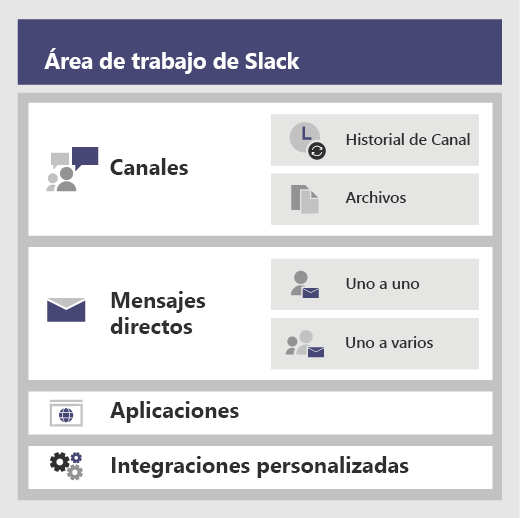
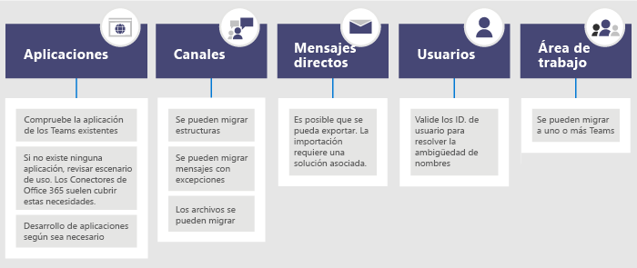

# <a name="migrate-from-slack-to-microsoft-teams"></a>Migración de Slack a Microsoft Teams

Este artículo le guiará en el proceso para migrar a Microsoft Teams desde Slack.

Al planear la migración de los equipos de la organización a un equipo, es importante que decida qué debe mantenerse (si es que es necesario). Empezaremos por describir qué tipos de datos se pueden migrar y, después, explicaremos cómo evaluar sus necesidades, planear la migración y completar la misma.

El diagrama siguiente muestra la arquitectura de Slack a nivel general.



## <a name="plan-your-migration-from-slack"></a>Planear la migración desde Slack
### <a name="what-you-can-and-cant-migrate"></a>Qué puede y qué no puede migrar
Su plan de servicio de Slack determinará qué es lo que puede y no puede migrar. Por ejemplo, algunos planes de servicio de Slack solo permiten exportar los archivos y el historial de canales públicos, mientras que otros requieren una solicitud DocuSign para incluir canales privados y mensajes directos. 

Para determinar el nivel de servicio del área de trabajo de Slack, inicie sesión en Slack y anote el tipo de plan que aparece en la página **Acerca de este espacio de trabajo**.

Para más información sobre las opciones de exportación de Slack, vaya al sitio web de Slack: https://get.slack.help/hc/articles/204897248-Guide-to-Slack-import-and-export-tools 

El siguiente diagrama muestra una visión general del panorama de migración de Slack que trataremos en este artículo. 



Cuando haya terminado con esta sección, debería comprender lo siguiente:
- El nivel de servicio de sus áreas de trabajo de Slack.
- Lo que puede y no puede exportar.
- Métodos comunes para la exportación.

### <a name="assess-your-slack-workspaces"></a>Evaluación de los espacios de trabajo de Slack
Para poder planear el plan de migración de su organización, debe reunir cierta información sobre sus áreas de trabajo de Slack. Entender cómo se usan las áreas de trabajo de Slack le ayuda a determinar el alcance de la migración. Por ejemplo, ¿cuántas áreas de trabajo se van a migrar? ¿Los usan en un departamento específico, muchos departamentos o una organización entera?

Si es miembro de las áreas de trabajo de Slack que quiere migrar, puede analizar el uso yendo a *<your Slack workspace>.slack.com/stats*. Revise las pestañas Canales y Miembros para buscar patrones de uso. Decida las áreas de trabajo que quiere migrar (y cuáles son las que dejará de utilizar). 

> [!NOTE]
> Si no tiene acceso a la página de estadísticas, no es un administrador o propietario. 

### <a name="export-channels"></a>Exportación de canales

En Slack, los usuarios se unen a un canal que forma parte de un área de trabajo de Slack, mientras que en Teams los usuarios se unen a equipos, que son colecciones de canales. Le recomendamos que use los datos de análisis de Slack para ver cuánta actividad tiene lugar en cada canal y así decidir qué canales migrar. Use la lista resultante para averiguar cómo agrupar los canales de Slack en los equipos de Teams, así como quién debe ser miembro de cada equipo.

Si tiene un plan de servicio de pago de Slack (que no sea gratuito), puede usar los datos de análisis de Slack (<your Slack workspace>.slack.com/admin/stats#channels) para ver el nivel de actividad de un canal, cuándo se utilizó por última vez y cuántos usuarios son miembros. Esto puede ayudarle a decidir si quiere migrar el canal. De forma predeterminada, se puede exportar el contenido de canales públicos (archivos y mensajes). En función de su plan de servicio de Slack y de si ha solicitado canales privados y mensajes directos de Slack, estos pueden o no exportarse.

Para más información sobre las opciones de exportación de Slack, vaya al sitio web de Slack: https://get.slack.help/hc/articles/204897248-Guide-to-Slack-import-and-export-tools 

> [!IMPORTANT]
> Compruebe los requisitos de privacidad y cumplimiento de su organización respecto a los datos de los canales. Es posible que su organización tenga requisitos de cumplimiento sobre el tratamiento, almacenamiento y procesamiento de estos datos, además de cumplir con el ciclo de vida de contenido identificable del usuario final (EUII).

### <a name="export-direct-messages"></a>Exportación de mensajes directos
Los mensajes directos son lo mismo que los chats en Teams, que son conversaciones de uno a uno o de uno a varios que no pertenecen a un canal. La capacidad de exportación depende del plan de servicio de Slack y de si ha solicitado que se incluyan mensajes directos en la exportación de Slack. Teams no es compatible con la importación de mensajes directos en este momento. Consulte a un asociado de Microsoft para obtener información sobre las soluciones de terceros que puede explorar y que incorporan el contenido de mensajes directos en Teams.

Para exportar mensajes directos, eche un vistazo a herramientas, como Export, en la tienda de aplicaciones de Slack.

### <a name="apps-and-custom-integrations"></a>Aplicaciones e integraciones personalizadas

Las aplicaciones en Slack son similares a las aplicaciones en Teams. Cuando tenga una lista de aplicaciones y sus configuraciones en el área de trabajo, puede buscar en la tienda de aplicaciones de Teams para ver si están disponibles para Teams*. 

Vaya a <your Slack workspace>.slack.com/apps/manage para obtener una lista de aplicaciones e integraciones personalizadas. En esta página también se muestra el número de configuraciones en que se usa cada aplicación. Las integraciones personalizadas pueden variar en su "capacidad de migración". Si es un enlace web, normalmente puede enviarlo a un conector de Office 365 para cambiar el flujo de trabajo a Teams. Evalúe los bots y otras aplicaciones uno a uno para planear su migración a Teams.

\* Si el administrador ha restringido el uso de aplicaciones, es posible que no tenga acceso a la lista completa de aplicaciones disponibles.

### <a name="users"></a>Usuarios
Es posible que los esquemas de identidad que usaba en Slack no se asignen directamente a Office 365. Por ejemplo, es posible que las direcciones de correo electrónico de los usuarios de Slack no se asignen a cuentas profesionales o educativas de Office 365. Debería crear un mapa de asignación de ID. y usuarios antes de empezar a planear su implementación de Teams.

Si tiene un plan de servicio de pago de Slack, puede ir a *<your Slack workspace>.slack.com/admin/stats#members* para obtener información de los miembros, como la dirección de correo electrónico y el tipo de cuenta de cada usuario (por ejemplo, invitado en uno o varios canales).

El siguiente es un script que puede usar para comparar las direcciones de correo electrónico de una exportación de Slack con Azure AD para ayudarle a resolver la ambigüedad de nombres. También informará de si el usuario está habilitado para Teams. Si necesita ayuda con PowerShell, consulte [Introducción a Azure PowerShell](https://docs.microsoft.com/powershell/azure/get-started-azureps).

```azurepowershell
Connect-AzureAD
Function Get-TimeStamp {
    return "[{0:MM/dd/yy} {0:HH:mm:ss}]" -f (Get-Date)
}

class User {
    [ValidateNotNullOrEmpty()] $ID
    [ValidateNotNullOrEmpty()] $FullName
    [string] $Email
    [string] $UPN
    [ValidateNotNullOrEmpty()][bool] $ExistsAzureAD
    [ValidateNotNullOrEmpty()][bool] $TeamsEnabled
}

$output = New-Object -type System.Collections.ObjectModel.Collection["User"]

$users = Get-Content -Raw -Path .\slackHistory\users.json | ConvertFrom-Json

Write-Host -ForegroundColor Green "$(Get-Timestamp) User Count: " $users.Count

$i=1
Write-Host "$(Get-Timestamp) Attempting direct email match.. `n"
foreach ($slackUser in $users) {
    $user = New-Object User
    $user.id = $slackUser.id
    $user.FullName = $slackUser.name
    try {
        if ($null -ne $slackUser.profile.email) {
            $user.email = $slackUser.profile.email
            $emailSplit = $slackUser.profile.email.Split('@')
            $mailNickName = $emailSplit[0]
            $result = Get-AzureADUser -Filter "MailNickName eq '$($mailNickName)' or UserPrincipalName eq '$($slackUser.profile.email)' or proxyAddresses/any(c:c eq 'smtp:$($slackUser.profile.email)')"
            if ($null -ne $result) {
                $user.ExistsAzureAD = $true
                $user.UPN = $result.UserPrincipalName
                $assignedPlans = $result.assignedPlans
                foreach ($plan in $assignedPlans) {
                    if ($plan.ServicePlanId -eq "57ff2da0-773e-42df-b2af-ffb7a2317929") {
                        if ($plan.CapabilityStatus -eq "Enabled") {
                            $user.TeamsEnabled = $true
                        }
                        else {
                            $user.TeamsEnabled = $false
                        }
                    }
                }
                Write-Host -ForegroundColor Green "$(Get-Timestamp) Current User $($i) - AzureAD object found:" $result.MailNickName
                Write-Host -ForegroundColor Green "$(Get-Timestamp) Current User $($i) - Teams Enabled:" $user.TeamsEnabled
            }
            else {
                $user.ExistsAzureAD = $false
                Write-Host -ForegroundColor Yellow "$(Get-Timestamp) Current User $($i) - AzureAD object not found: " $slackUser.profile.email
            }
        }
        $i++
    }   
    catch
    {
        $user.ExistsAzureAD = $false
        Write-Host -ForegroundColor Yellow "$(Get-Timestamp) Current User $($i) - AzureAD object not found: $($i)" $user.profile.email
        $i++
    }
    $output.Add($user)
}

$output | Export-Csv -Path .\SlackToAzureADIdentityMapping.csv -NoTypeInformation
Write-Host "`n $(Get-Timestamp) Generated SlackToAzureADIdentityMapping.csv. Exiting..."
$output | Export-Csv -Path .\SlackToAzureADIdentityMapping.csv -NoTypeInformation
Write-Host "`n $(Get-Timestamp) Generated SlackToAzureADIdentityMapping.csv. Exiting..."
```

Cuando haya terminado con esta sección, debería:
- Tener una lista de canales por área de trabajo con estadísticas de uso.
- Tener una lista de aplicaciones de Slack con configuraciones por canal.
- Haber determinado el tipo de historial de mensajes de Slack que quiere exportar (si hay alguno).
- Tener una lista de los usuarios cuyas cuentas de Slack se asignan a cuentas profesionales o educativas de Microsoft y qué licencia de Teams tienen.

## <a name="plan-your-teams-deployment"></a>Planeación de la implementación de Teams
Ha exportado lo que necesita de Slack (y dejado atrás lo que no necesita). Ahora es el momento de planear la forma en que implementará Teams e importará los datos de Slack. Esta es una gran oportunidad para evaluar qué ha funcionado bien para el equipo en función de su uso e incluir esos elementos en el plan de implementación de Teams. Al final de esta sección, tendrá un plano técnico para sus usuarios, canales y aplicaciones de Teams. 

El siguiente diagrama muestra un esquema general de las cosas que debe tratar en la implementación de Teams.

:::image type="content" source="media/migrate-slack-to-teams-image3.png" alt-text="Esquema general de la planeación para la implementación de Teams desde Slack.":::

### <a name="team-and-channel-structure"></a>Estructura de equipos y canales

Un área de trabajo de Slack puede representar un único equipo, varios equipos o una organización completa. Es importante comprender el alcance de las áreas de trabajo a medida que determina la estructura. Lo más cercano a un equipo de Teams en Slack es el área de trabajo, que contiene un conjunto de canales. En el diagrama siguiente se muestran 3 asignaciones de Slack a Teams diferentes, así como las directrices para elegir la adecuada para cada área de trabajo.


|Asignación de Slack a Teams  |  |
|---------|---------|
|1 espacio de trabajo de Slack :arrow_right: 1 equipo   | Para áreas de trabajo de Slack más pequeñas, que necesitan menos de 200 canales.<br>Incluya un búfer para la planeación del crecimiento y los canales privados.  |
|1 espacio de trabajo de Slack :arrow_right: varios equipos     | Use los datos de análisis de su espacio de trabajo de Slack para crear grupos de canales lógicos, que se convertirán en la base de sus equipos.        |
|2 espacios de trabajo de Slack :arrow_right: varios equipos     | Use los datos de análisis de su espacio de trabajo de Slack para crear grupos de canales y equipos lógicos, que se convertirán en la base de sus equipos.        |

Las soluciones de terceros tienen estadísticas de uso que le ayudarán a evaluar el nivel de actividad de un canal y el número de publicaciones que tiene. Normalmente, los canales que se usan a menudo serían candidatos para incluir en el planeamiento de equipos.

> [!TIP]
> Conserve solo lo que sea necesario en su método para determinar qué canales se deben recrear en Teams. Para obtener más información, consulte [Información general sobre equipos y canales](teams-channels-overview.md). 

#### <a name="team-planning"></a>Planificación de equipos
Con el inventario de canales que obtuvo en la sección de planificación anterior, trabaje con los propietarios y administradores de Slack para averiguar qué canales se deben convertir en equipos y cuáles deberían ser canales dentro de un equipo. Use Excel o PowerBI para ayudar con este análisis: ambos pueden proporcionar información adicional para ayurdar a decidir qué canales se deben conservar.

> [!TIP]
> Actualmente, Teams tiene un límite de 200 canales por equipo. Si la lista de canales se aproxima a ese límite, debe buscar una forma para dividirlos en dos equipos separados.

### <a name="channel-history"></a>Historial de canales

Hay tanto soluciones gratuitas en GitHub como soluciones de pago que puede usar, en función de los requisitos de su organización, para conservar el historial de canales privados y públicos. Además, esto se podría incluir en Teams con un script.

Una vez haya configurado la nueva estructura de equipos y canales en Teams, puede copiar los archivos exportados a las bibliotecas de documentos adecuadas en sus canales de Teams.

Hay varios métodos que puede utilizar para automatizar la importación de contenido. Existen soluciones gratuitas en GitHub ([ChannelSurf](https://github.com/tamhinsf/ChannelSurf) o el [Visor de exportación de Slack](https://github.com/hfaran/slack-export-viewer)) y soluciones de asociados. Elija una solución en función de las necesidades de su organización. 

### <a name="channel-files"></a>Archivos de canales

La mayoría de las soluciones exportarán los archivos. Sin embargo, normalmente se proporcionan como vínculos en el historial de canales que requieren una clave de API para recuperarlos mediante programación.

En el caso de los archivos almacenados en Slack, una vez que haya configurado los equipos y canales en Teams, podrá copiarlos mediante programación desde Slack al canal de destino de Teams.

El siguiente script recupera archivos de Slack. Realiza una búsqueda de la exportación especificada en su ordenador, crea una carpeta en cada canal de destino y descarga todos los archivos en esa ubicación. Hay soluciones de terceros que pueden extraer datos. Si necesita ayuda con PowerShell, consulte [Introducción a Azure PowerShell](https://docs.microsoft.com/powershell/azure/get-started-azureps).


```azurepowershell
$ExportPath = ".\slackHistory"
$ExportContents = Get-ChildItem -path $ExportPath -Recurse
Function Get-TimeStamp {
    return "[{0:MM/dd/yy} {0:HH:mm:ss}]" -f (Get-Date)
}

class File {
    [string] $Name
    [string] $Title
    [string] $Channel
    [string] $DownloadURL
    [string] $MimeType
    [double] $Size
    [string] $ParentPath
    [string] $Time
}

$channelList = Get-Content -Raw -Path .\slackHistory\channels.json | ConvertFrom-Json
$Files = New-Object -TypeName System.Collections.ObjectModel.Collection["File"]

Write-Host -ForegroundColor Green "$(Get-TimeStamp) Starting Step 1 (processing channel export for files) of 2. Total Channel Count: $($channelList.Count)"
#Iterate through each Channel listed in the Archive
foreach ($channel in $channelList) {
    #Iterate through Channel folders from the Export
    foreach ($folder in $ExportContents)
    {
        #If Channel Name matches..
        if ($channel.name -eq $folder){
            $channelJsons = Get-ChildItem -Path $folder.FullName -File
            Write-Host -ForegroundColor White "$(Get-TimeStamp) Info: Starting to process $($channelJsons.Count) days of content for #$($channel.name)."
            #Start processing the daily JSON for files
            foreach ($json in $channelJsons){
                $currentJson = Get-Content -Raw -Path $json.FullName | ConvertFrom-Json
                #Write-Host -ForegroundColor Yellow "$(Get-TimeStamp) Info: Processing $($json.Name) in #$($channel.name).."
                #Iterate through every action
                foreach ($entry in $currentJson){
                    #If the action contained file(s)..
                    if($null -ne $entry.files){
                        #Iterate through each file and add it to the List of Files to download
                        foreach ($item in $entry.Files) {
                        $file = New-Object -TypeName File
                            if ($null -ne $item.url_private_download){
                                $file.Name = $item.name
                                $file.Title = $item.Title
                                $file.Channel = $channel.name
                                $file.DownloadURL = $item.url_private_download
                                $file.MimeType = $item.mimetype
                                $file.Size = $item.size
                                $file.ParentPath = $folder.FullName
                                $file.Time = $item.created
                                $files.Add($file)
                            }
                        }
                    }
                }
            }
        }
    }
}
Write-Host -ForegroundColor Green "$(Get-TimeStamp) Step 1 of 2 complete. `n"

Write-Host -ForegroundColor Green "$(Get-TimeStamp) Starting step 2 (creating folders and downloading files) of 2."
#Determine which Files folders need to be created
$FoldersToMake = New-Object System.Collections.ObjectModel.Collection["string"]
foreach ($file in $files){
    if ($FoldersToMake -notcontains $file.Channel){
        $FoldersToMake.Add($file.Channel)
    }
}

#Create Folders
foreach ($folder in $FoldersToMake){
    #$fullFolderPath = $file.ParentPath + "\Files"
    $fullFolderPath = $ExportPath +"\$($folder)"
    $fullFilesPath = $ExportPath +"\$($folder)\Files"
    if (-not (Test-Path $fullFilesPath)){
        New-Item -Path $fullFolderPath  -Name "Files" -ItemType "directory"
    }
}

#Downloading Files
foreach ($file in $files)
{
    Write-Host -ForegroundColor Yellow "$(Get-TimeStamp) Downloading $($file.Name)."
    $fullFilePath = $file.ParentPath + "\Files\" + $file.Name
        if (-not (Test-Path $fullFilePath)){
            try{
                $request = (New-Object System.Net.WebClient).DownloadFile($file.DownloadURL, $fullFilePath)
            }
            catch [System.Net.WebException]{
                Write-Host -ForegroundColor Red "$(Get-TimeStamp) Error: Unable to download $($file.Name) to $($fullFilePath)"
            }   
        }
        else {
            try{
                $extensionPosition = $file.name.LastIndexOf('.')
                $splitFileName = $file.name.Substring(0,$extensionPosition)
                $splitFileExtention = $file.name.Substring($extensionPosition)
                $newFileName = $splitFileName + $file.Time + $splitFileExtention
                $fullFilePath = $file.ParentPath + "\Files\" + $newFileName
                $request = (New-Object System.Net.WebClient).DownloadFile($file.DownloadURL, $fullFilePath)
            }
            catch [System.Net.WebException]{
                Write-Host -ForegroundColor Red "$(Get-TimeStamp) Error: Unable to download $($file.Name) to $($fullFilePath)"
            }   
        }
}
Write-Host -ForegroundColor Green "$(Get-TimeStamp) Step 2 of 2 complete. `n"
Write-Host -ForegroundColor Green "$(Get-TimeStamp) Exiting.."
```


### <a name="apps-and-custom-integrations"></a>Aplicaciones e integraciones personalizadas
Revise su lista de aplicaciones e integraciones personalizadas de Slack (con sus configuraciones) y elija las que quiere migrar a Teams. Compruebe el catálogo de soluciones de Teams para ver si hay una aplicación disponible. Si no es así, es probable que haya alternativas. 

Para averiguar qué aplicaciones agregar a Teams, es importante que comprenda cómo se usa la aplicación. Al realizar la pregunta "¿qué funcionalidad ofrece la aplicación para este canal?", obtendrá información sobre los resultados que proporciona la aplicación. 

En muchos casos, las aplicaciones reciben principalmente datos basados en eventos desde un servicio externo (por ejemplo, el sistema de supervisión) e insertan un mensaje en Slack. Puede obtener el mismo resultado si usa un conector de Microsoft 365 que pueda insertar mensajes en Teams basándose en eventos.

A continuación se muestran ejemplos de soluciones de Slack en las que se utilizó un conector de Office 365 en Teams para la integración.
- Ansible
  - Las alertas se pueden enviar a Teams mediante [webhook de Ansible](https://docs.ansible.com/ansible-tower/latest/html/userguide/notifications.html#webhook).
- New Relic
  - Pruebe esta solución de usuario para el [envío de alertas New Relic a Teams](https://discuss.newrelic.com/t/new-relic-alerts-not-working-with-microsoft-teams/48609/3).
- Nagios
  - Las alertas pueden integrarse en la actualidad mediante conectores. https://github.com/isaac-galvan/nagios-teams-notify
- ZenDesk
  - La aplicación se encuentra en la tienda de Teams.
- Jenkins
  - Las alertas se pueden enviar a Teams con [conector de Office 365 de Jenkins](https://plugins.jenkins.io/Office-365-Connector).


### <a name="user-readiness-and-adoption-plan"></a>Preparación del usuario y plan de adopción
El pilar de cualquier implementación correcta de software depende de cómo estén preparados los usuarios para el cambio. Los usuarios de su organización que usan Slack comprenderán fácilmente los conceptos de Teams, pero sigue siendo necesario un aprendizaje para ayudarles a realizar una transición sin problemas. Para obtener un conjunto completo de recursos para la adopción de Teams, vaya al [centro de adopción de Teams](adopt-microsoft-teams-landing-page.md).

Por ejemplo, los dos productos cuentan con canales, pero estos se usan de forma diferente en cada producto. Por ejemplo, a menudo un canal en Slack se usa como un chat en Teams, para conversaciones transaccionales y a corto plazo. Otras diferencias notables se encuentran en la configuración de las notificaciones y en las conversaciones encadenadas o no encadenadas.

Consulte nuestra variada biblioteca de [Aprendizaje de Teams para usuarios finales](enduser-training.md). 

## <a name="move-to-teams"></a>Migración a Teams 
Ahora que ha definido el plan de transición, puede empezar a crear sus equipos y canales en Teams. 

Una vez que haya creado los equipos y canales, inicie la copia de archivos de los canales de Slack a Teams y configure las aplicaciones. Si utiliza una solución para conservar el historial, también puede configurarla ahora. Una vez hecho estará listo para iniciar la concesión de licencias para los usuarios (si aún no tienen licencia) y agregarlos a los equipos adecuados. Para reducir la necesidad de exportaciones y copias adicionales de archivos, considere la posibilidad de eliminar el acceso a Slack en una fecha acordada que coincida con la adición de cada usuario al equipo. Así evitará tener que volver a exportar e importar los cambios en los archivos y el historial.

Siga los pasos del diagrama siguiente para implementar Teams en su organización. Para obtener más información, consulte [Cómo implementar equipos](How-to-roll-out-teams.md).


:::image type="content" source="media/migrate-slack-to-teams-image4.png" alt-text="Diagrama en el que se muestran los pasos para migrar a Teams desde Slack.":::
