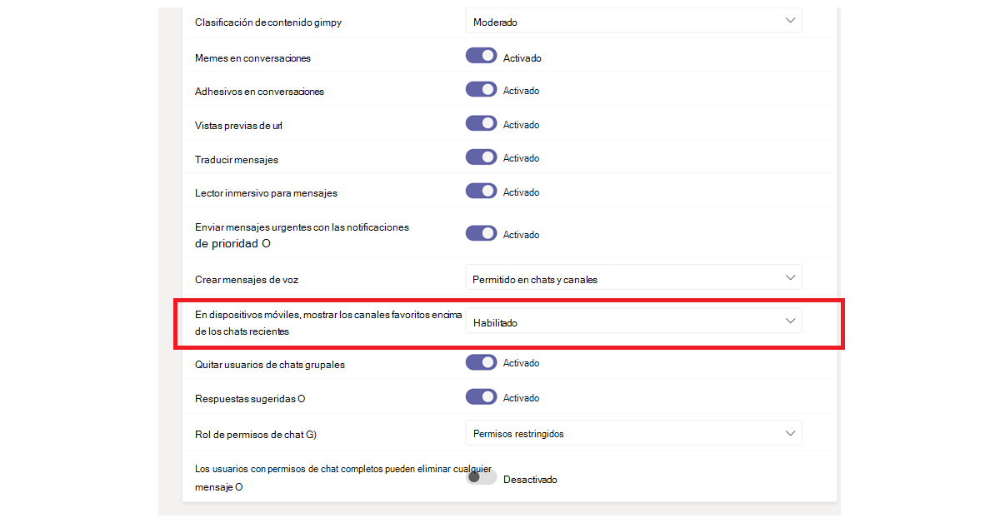
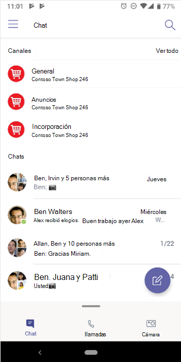

# Navegar Microsoft Teams

Ahora que tiene un conocimiento claro de la ruta y las necesidades únicas de su organización, es el momento de empezar a trabajar en su camino hacia una colaboración eficaz con Microsoft Teams. Use la siguiente sección para obtener información sobre cómo navegar por las capacidades de Kaizala complementadas dentro de Teams.

| Desde Kaizala | Para Teams |
|---------|-----------------------|
| Introducción: inicio de sesión y configuración de perfil| [Introducción a Teams](#getting-started) |
| Iniciar nuevos chats, llamadas de audio y vídeo 1:1 | [Chats en Teams, llamadas de audio y videollamadas](#starting-new-chats-11-audio-and-video-calls) |
| Sus grupos de Kaizala| [Mover los grupos de Kaizala a Teams](#moving-your-kaizala-groups-to-microsoft-teams) |
| Imitar la experiencia de mensajería de la aplicación de consumidor| [Imitar la experiencia de mensajería de la aplicación de consumidor](#mimic-the-consumer-app-messaging-experience) |
| Tarjetas de acción rápidas |  [Trabajo realizado en Teams](#getting-work-done-in-teams) |
| Sondeos, encuestas, listas de comprobación| [Realizar sondeos, encuestas, listas de comprobación en Teams](#polls-surveys-and-checklists-in-teams) |
| Reuniones: tarjeta de acción| [Reunión: reuniones en Teams](#getting-work-done-in-teams) |
| Anuncios: tarjeta de acción| [Anuncios en Teams](#announcements-in-teams) |
| Tarjeta de acción de registros de fotos| [Registros de fotografías en Teams](#photo-check-ins)
| Cuestionario: tarjeta de acción| [Cuestionario en Teams](#quiz-in-teams)
| Aprendizaje: Tarjeta de acción| [Aprendizaje en Teams](#training-in-teams) |
| Sus tarjetas de Acciones personalizadas | [Soluciones personalizadas en Teams](#moving-kaizala-custom-solutions-to-microsoft-teams) |
| Portal de administración de Kaizala| [Para profesionales de TI](#it-professionals) |
| | [Para los usuarios finales](#end-user-guidance) |
| disolución Kaizala Group| [disolución Kaizala Group](#kaizala-group-dissolution) |
| exportación de datos de inquilino de Kaizala| [Exportar datos de inquilino de Kaizala](#export-kaizala-tenant-data)  |
| Colaboración con usuarios externos (proveedores/socios)| [Agregar o invitar a personas de fuera de su organización de Teams a un chat](#collaborating-with-external-usersvendorssupplierspartners) |

## Introducción

Empezar a moverte de Kaizala a Teams es más fácil que nunca con nuestra guía de introducción. Para obtener más información sobre cómo empezar su viaje Microsoft Teams, consulte [Introducción a Teams](https://support.microsoft.com/office/start-and-pin-chats-a864b052-5e4b-4ccf-b046-2e26f40e21b5?wt.mc_id=otc_microsoft_teams&ui=en-us&rs=en-us&ad=us).

## Iniciar nuevos chats, llamadas de audio y videollamadas individuales

Cree chats individuales o grupales para colaborar con un grupo más pequeño o para hablar en privado dentro de Teams. Puede anclar chats y guardar mensajes para acceder rápidamente. Para empezar a chatear con nuestro formato de texto enriquecido, emojis y gifs, vea [Chats en Teams](https://support.microsoft.com/office/start-and-pin-chats-a864b052-5e4b-4ccf-b046-2e26f40e21b5?wt.mc_id=otc_microsoft_teams&ui=en-us&rs=en-us&ad=us).

Comuníquese de forma eficaz iniciando llamadas individuales o grupales con cualquier persona de su organización. Con Teams, tiene la flexibilidad de realizar llamadas de audio y vídeo.  Para empezar, consulte [Realizar llamadas](https://www.microsoft.com/videoplayer/embed/RE4rxv0?pid=ocpVideo0-innerdiv-oneplayer&postJsllMsg=true&maskLevel=20&market=en-us).

Puede pasar de Kaizala grupos a Microsoft Teams a través de la creación de Teams, canales y chats grupales en Teams.

Teams es una colección de personas, contenido y herramientas que rodean diferentes proyectos y resultados dentro de una organización.

Teams se compone de **canales**, que son las conversaciones específicas del tema que tiene con sus compañeros de equipo. Cada canal está dedicado a un tema, departamento o proyecto específico. Los canales son más valiosos cuando se amplían con aplicaciones. Para obtener más información, vea [Trabajar en canales](https://support.microsoft.com/office/teams-and-channels-df38ae23-8f85-46d3-b071-cb11b9de5499?ui=en-us&rs=en-us&ad=us#ID0EAABAAA=Work_in_channels).

**Los chats grupales** le permiten reunir a sus compañeros de trabajo rápidamente a través de mensajería instantánea.

### Conversaciones en el chat de Teams frente al canal de equipo

|Conversaciones en chat | Conversaciones en canales de equipo |
|---------|---------|
|Para conversaciones ligeras, donde está enviando mensajes directamente a los destinatarios.   | Para las interacciones en las que se tratan varios temas en un espacio abierto.  |
|Los chats privados solo son visibles para los usuarios del chat     | Visible para todos los miembros del equipo        |
|Una conversación continua sin encadenamiento     | Conversaciones estructuradas y encadenados        |
|Hasta 250 personas     | Hasta 25 000 personas        |
|Elija si desea compartir el historial de chats con nuevos participantes de chat     | El historial se comparte con todos los nuevos miembros del equipo        |
|Esas personas que ya están en el chat deben agregar nuevos destinatarios de chat     | Los usuarios pueden unirse a un equipo buscándolo. En Teams privado, Teams administrador aprueba a los nuevos miembros. Los miembros del canal pueden generar código para permitir que los nuevos miembros se unan directamente sin la aprobación del administrador.        |
|En el recurso compartido de pantalla directo y llamadas de audio y vídeo. Programación sencilla de reuniones de Teams con todos los participantes del chat     | En el lugar y llamadas de audio y vídeo programadas        |
|Cierta extensibilidad con aplicaciones     | Extensibilidad y personalización completas con aplicaciones        |

Para obtener información general sobre Teams, canales y chats grupales, consulte [equipos y canales en Microsoft Teams](teams-channels-overview.md).

## Mover los grupos de Kaizala a Microsoft Teams

En Kaizala, los grupos son una colección de personas. Existen tres tipos de estructuras de grupos dentro de Kaizala: grupos planos, grupos jerárquicos y grupos de difusión. Mientras realiza la transición a Microsoft Teams, puede usar Teams, canales y chats grupales para crear estructuras de comunicación similares para su organización.

Use las instrucciones siguientes para obtener instrucciones sobre cómo cambiar de grupos a Teams, canales y chats grupales.

Hay dos formas de mover el Kaizala grupos planos a Teams:

- Opción 1: Cambiar de un grupo plano de Kaizala a un chat grupal en Teams

- Opción 2: Cambiar de un grupo plano Kaizala a un equipo Teams

**Opción 1: Cambiar de un grupo plano Kaizala a un chat grupal en Teams**:

Puede crear una Teams chat grupal para mantener reuniones rápidas y conversaciones transitorios con hasta 250 participantes. Los chats grupales permiten a los usuarios de su organización tener un lugar central para una conversación abierta en la que se puede agregar a cualquier persona al chat.

1. Inicie y asigne un nombre a un chat grupal.

    

    Todos los usuarios que tengan acceso al chat grupal pueden [enviar mensajes](https://support.microsoft.com/office/send-and-read-messages-in-teams-b29e60ec-76af-4d97-8c3c-a4e36f2b64aa?ui=en-us&rs=en-us&ad=us).

2. Agregar personas a la conversación.

    

   Al agregar a alguien a un chat grupal (no uno a uno), puede incluir el **historial de chat** y la **duración del historial** que desea compartir con ella.

3. Administrar el chat grupal.
  
    

   Para ver quién está en un chat grupal, mantenga el puntero sobre el número de participantes en el encabezado del chat para mostrar una lista de los nombres de todos los usuarios.

**Opción 2: Cambiar de un grupo Kaizala plano a un equipo Teams**:

Para una comunicación de grupo grande dirigida, puede crear un equipo para un grupo plano. Puede agregar hasta 25 000 miembros para participar en la comunicación estructurada con conversaciones encadenados. Este tipo de comunicación permite roles de moderación y administración para garantizar que todo funcione sin problemas.

1. Crear un equipo: para empezar a trabajar en Teams, debe crear un equipo, agregar personas y agregar canales. Para obtener más información, vea [sus primeros equipos](get-started-with-teams-create-your-first-teams-and-channels.md).
2. Revise la guía para los propietarios del equipo:

   Como propietario de un [equipo](https://support.microsoft.com/office/go-to-guide-for-team-owners-92d238e6-0ae2-447e-af90-40b1052c4547?ui=en-us&rs=en-us&ad=us), puede agregar nuevos miembros e invitados, cambiar miembros a propietarios, administrar canales y configuraciones, y archivar un equipo que ya no está en uso.

3. Agregar miembros en masa a un equipo:

    Si es el propietario de un equipo, vaya al nombre del equipo en la lista de equipos y seleccione el botón **Más opciones** > luego **Agregar miembro**.

    

    Puede empezar a escribir una lista de distribución, un grupo de seguridad o un grupo de Microsoft 365 para agregar a su equipo. Para obtener más información, vea [Agregar miembros a un equipo en Teams](https://support.microsoft.com/office/add-members-to-a-team-in-teams-aff2249d-b456-4bc3-81e7-52327b6b38e9?ui=en-us&rs=en-us&ad=us).

### Imitar la experiencia de mensajería de la aplicación de consumidor

Si prefiere una experiencia simplificada para los usuarios, puede configurar la experiencia de Teams de su organización para imitar las herramientas de consumidor que los usuarios ya usan.

Le recomendamos que inicie el Teams viaje para los usuarios de Kaizala con **Mostrar canales favoritos en chat** habilitado para comunicaciones simplificadas y Turnos (opcional).

Este es un ejemplo de la interfaz del equipo con **Turnos**:

Este es un ejemplo de la interfaz del equipo **sin turnos**:

 

> [!NOTE]
> Puede quitar el acceso al botón Teams para crear una interfaz simplificada para los trabajadores de frontline con solo canales resaltados que aparecen encima de los chats. Para obtener más información, consulte [Administrar directivas de mensajería en Teams](messaging-policies-in-teams.md).

### Usar Teams y canales para crear una estructura de grupo jerárquica

En Kaizala, los grupos jerárquicos permiten a su organización interactuar en distintas estructuras de grupo según el tipo de comunicación entre los miembros.  En Teams, puede crear Teams y canales para que coincidan con su organigrama y configurar la comunicación basada en jerarquías. Puede usar una estructura jerárquica dentro de Teams para alertar a los miembros de las acciones necesarias, las noticias importantes y las actualizaciones.

Para obtener más información, consulte nuestros [procedimientos recomendados para organizar equipos en Microsoft Teams](best-practices-organizing.md).

### Usar Teams y canales para difundir noticias importantes

En un grupo de difusión de Kaizala, los administradores pueden enviar mensajes y acciones a un grupo específico. De forma similar, puede publicar en varios canales para difundir un mensaje en Teams. Para dirigir la atención a un mensaje importante, cree publicaciones de anuncios.

La moderación del canal le permite controlar quién puede publicar mensajes y responderlos. Los canales se pueden elegir entre los equipos para que el emisor llegue a un público más amplio. Puede restringir las interacciones en los anuncios que solo permiten a determinados administradores y moderadores responder. Siga estos pasos para establecer la moderación del canal en un canal de Teams.

**Paso 1**: Configurar la moderación del canal.

- Seleccionar un canal para las difusiones

- Seleccione **Configuración de canal** para configurar la moderación

- Vaya a "¿Quién son los moderadores?" para seleccionar manualmente los moderadores del canal

**Paso 2**: Dar formato al mensaje.
Cree un anuncio para notificar a los miembros del equipo de noticias o acciones importantes.

   

- En el canal, seleccione Formato debajo del cuadro donde escribe el mensaje.

- En la parte superior del cuadro que aparece, seleccione la flecha situada junto a Nueva conversación > Anuncio.

- Escriba un título, cambie el color de fondo o agregue una imagen de fondo para el área del título.

- Escriba el asunto del anuncio en el área Agregar un subtítulo, luego el cuerpo del mensaje y seleccione el botón Enviar.

    

**Paso 3**: Seleccione canales para Difusión de mensaje.

Puede publicar en varios Teams y canales cuando tenga anuncios e información importantes que necesiten llegar a grandes grupos de personas.

  

Para obtener más información, vea [Publicación cruzada de una conversación de canal en Teams](https://support.microsoft.com/office/cross-post-a-channel-conversation-in-teams-9c1252a3-67ef-498e-a7c1-dd7147b3d295?ui=en-us&rs=en-us&ad=us).

## Trabajo realizado en Teams

A la hora de realizar el trabajo, las herramientas adecuadas pueden habilitar la eficiencia. En Kaizala, puede usar [tarjetas de acción predefinidas (OOB)](/kaizala/partnerdocs/kaizalaactioncards) para que la administración diaria del trabajo sea más sencilla y eficiente.
Microsoft Teams proporciona varias funcionalidades y soluciones para las tarjetas de acción rápidas en Kaizala.

La plataforma Teams le permite usar las herramientas de la organización existentes a través de la integración en Microsoft Teams junto con aplicaciones Microsoft 365 listas para usar y aplicaciones de terceros. Hay más de 800 aplicaciones externas disponibles ahora en Microsoft Teams.

### Sondeos, encuestas y listas de comprobación en Teams

[Los sondeos](https://github.com/OfficeDev/microsoft-teams-apps-poll/wiki), [las encuestas](https://github.com/OfficeDev/microsoft-teams-apps-survey) y las tarjetas de acción de [lista de comprobación](https://github.com/OfficeDev/microsoft-teams-app-checklist) ya están disponibles como plantillas de aplicación de [extensión de mensajes Teams](/microsoftteams/platform/messaging-extensions/what-are-messaging-extensions) listas de instalación en GitHub.

**Los sondeos** permiten a los usuarios crear y enviar sondeos rápidamente en un chat o un canal para conocer la opinión de su equipo. La aplicación Sondeo es compatible en todas las plataformas: Teams clientes de escritorio, explorador, iOS y Android. Está listo para su implementación como parte de la suscripción de Microsoft 365 existente

**La encuesta** permite a los usuarios crear una encuesta en un chat o canal para formular una serie de preguntas y obtener información útil. Use Survey for - Registrations, Enrollments, Feedback, Testimonios, Lead Capture, Reporting, Complaints, and Evaluations. La aplicación Encuesta es compatible en todas las plataformas: Teams clientes de escritorio, explorador, iOS y Android. Está listo para su implementación como parte de la suscripción de Microsoft 365 existente.

**La lista de comprobación** le permite colaborar con su equipo creando una lista de comprobación compartida en un chat o canal. La aplicación Lista de comprobación es compatible en todas las plataformas: Teams clientes de escritorio, explorador, iOS y Android. Está listo para su implementación como parte de la suscripción de Microsoft 365 existente.

También puede enviar sondeos rápidos, encuestas y listas de comprobación a su equipo al instante con aplicaciones existentes de Microsoft 365 y de terceros.

[Microsoft Forms](https://techcommunity.microsoft.com/t5/microsoft-forms-blog/microsoft-forms-works-great-with-microsoft-teams/ba-p/109915) le permite recopilar información y tomar decisiones rápidamente. Con Forms integrados en Teams, puede configurar fácilmente una pestaña Formularios, crear notificaciones para el formulario y realizar un sondeo rápido. Para obtener información sobre cómo hacerlo, vea [Crear, editar y revisar formularios en Microsoft Teams](https://support.microsoft.com/office/work-with-colleagues-to-create-edit-and-review-forms-in-microsoft-teams-333b97a3-41d9-48bc-a1cb-84a96bd44e14#:~:text=1%20In%20Teams%2C%20go%20to%20the%20channel%20you,name%20for%20your%20new%20form.%20More%20items...%20).

Las aplicaciones de terceros, como Polly y SurveyMonkey, le permiten realizar sondeos y encuestas con su Teams.

- **Polly**  le permite obtener información de sondeos en tiempo real para tomar mejores decisiones empresariales y medir la participación del equipo en los sondeos a través de vistas completas de paneles.

- **SurveyMonkey** lleva las encuestas a los países en los que ya está haciendo negocios en Microsoft Teams, lo que facilita la adición de encuestas a su flujo de trabajo diario. Escriba y envíe un sondeo de una pregunta rápida desde dentro de Microsoft Teams y, a continuación, vea cómo llegan los resultados de sus compañeros de equipo.

### Trabajos en Teams

Use **[Microsoft Planner](https://support.microsoft.com/office/organize-your-team-s-tasks-in-microsoft-planner-c931a8a8-0cbb-4410-b66e-ae13233135fb?ui=en-us&rs=en-us&ad=us)** para ejecutar trabajos en Teams. Puede colaborar en un proyecto con un equipo, ver informes de progreso y realizar un seguimiento de las asignaciones individuales.

Mientras usa Microsoft Teams, puede agregar una o más pestañas de Planner a un canal de equipo para organizar las tareas. A continuación, puede trabajar en su plan desde Teams o Planner para la Web, quitar o eliminar el plan y recibir una notificación en Teams cuando se le asigne una tarea en Planner.

### Anuncios en Teams

Cree y envíe mensajes destinados a varios equipos o a un gran número de empleados por chat con la aplicación [de comunicador de empresa](/microsoftteams/platform/samples/app-templates#company-communicator) . Su sencilla interfaz permite a los usuarios designados crear, obtener una vista previa, colaborar y enviar mensajes de forma dirigida. Cree capacidades de comunicación personalizadas dirigidas, como datos personales personalizados, sobre cuántos usuarios han reconocido o interactuado con un mensaje con información directamente vinculada a las decisiones de administración.

### Registros de fotos

Use la Teams Smart Cámara para capturar y compartir una imagen anotada con su equipo. Comparta fácilmente su ubicación con precisión para mantener a su equipo al día. Necesitas más información para comunicar cómo se asignan las entidades de Kaizala a Teams. Sin duda, tenemos tanta información del conjunto de diapositivas como podamos en el documento.

[Use la](/microsoftteams/platform/samples/app-templates#staff-check-ins) plantilla de la aplicación Registros de personal para que el personal de primera línea pueda proporcionar fácilmente información crítica sobre el tiempo y las actualizaciones de estado, ya sea de forma programada o ad hoc, directamente desde Teams. La aplicación admite ubicación en tiempo real, fotos, notas, notificaciones de avisos y flujos de trabajo automatizados.

### Cuestionario en Teams

Cuestionario es una [extensión de mensajería Teams](/microsoftteams/platform/messaging-extensions/what-are-messaging-extensions) personalizada que le permite crear un cuestionario en un chat o un canal para comprobar la información y obtener resultados instantáneos. Puede usar Cuestionario para, exámenes en clase y sin conexión, comprobación de conocimientos en el equipo y para realizar cuestionarios divertidos dentro de un equipo. La aplicación Quiz se admite en varias plataformas, como Teams clientes de escritorio, explorador, iOS y Android. Esta aplicación está lista para su implementación como parte de la suscripción de Microsoft 365 existente.

[Consígalo en GitHub](https://github.com/OfficeDev/microsoft-teams-apps-quiz)

  

### Aprendizaje en Teams

Use la plantilla de la aplicación [Des checkins](/microsoftteams/platform/samples/app-templates#staff-check-ins) para que el personal de primera línea pueda proporcionar fácilmente información de tiempo crítico y actualizaciones de estado, ya sea de forma programada o ad hoc, directamente desde Teams. La aplicación admite ubicación en tiempo real, fotos, notas, notificaciones de avisos y flujos de trabajo automatizados.

Use Teams para facilitar la formación para su organización. Aprendizaje es una aplicación personalizada [de extensión de mensajería Teams](/microsoftteams/platform/what-are-messaging-extensions) que permite a los usuarios publicar un aprendizaje en un chat o canal para compartir conocimientos y habilidades sin conexión. La aplicación es compatible con varios clientes de Teams plataforma, como escritorio, explorador, iOS y Android. Esta aplicación está lista para su implementación como parte de la suscripción de Microsoft 365.

[Consígalo en GitHub](https://github.com/OfficeDev/microsoft-teams-apps-training)

Puede simplificar la incorporación ofreciendo acceso a información contextual.  Haga que las guías de los empleados, la formación y más fácilmente estén disponibles y actualizadas para potenciar a su organización a través de las aptitudes. Para obtener más información sobre los escenarios de aprendizaje, vea [Incorporar nuevos empleados](https://support.microsoft.com/office/effectively-onboard-new-employees-691faccd-1d1a-4f47-99ac-b6c82973f5ee).

## Mover Kaizala soluciones personalizadas a Microsoft Teams

Siga este método de tres pasos para obtener sus soluciones a Microsoft Teams:

1. Tenga en cuenta el uso y la frecuencia de la solución.

    El alto uso y la frecuencia de las soluciones merecen un caso más sólido para el desarrollo personalizado.

2. Considere la complejidad de la solución.

    Las soluciones con mayor complejidad pueden garantizar un caso más sólido para el desarrollo personalizado.

3. Explore los siguientes enfoques por frecuencia y complejidad de uso.

    - Aprovechar las capacidades de Microsoft Teams nativas

    - Usar [la integración de aplicaciones de terceros y explorar la tienda de aplicaciones](deploy-apps-microsoft-teams-landing-page.md)

    - Descubrir [plantillas de aplicaciones](/microsoftteams/platform/samples/app-templates)

    - Crear [aplicaciones personalizadas con la plataforma Teams](/microsoftteams/platform/overview)

## Administración en Microsoft Teams

### Profesionales de TI

Realice la transición administrativa desde el Portal de administración de Kaizala al Centro de Microsoft Teams Administración. El Teams centro de administración es principalmente solo para roles de administrador.

Los administradores pueden administrar toda la carga de trabajo de Teams o pueden tener permisos delegados para solucionar problemas de calidad de las llamadas o administrar las necesidades de telefonía de su organización.

Para navegar por el centro de administración, visite [el Centro de Microsoft Teams Administración](https://admin.teams.microsoft.com/).

Puede supervisar la seguridad y el cumplimiento de su organización en Microsoft 365 con el [Centro de seguridad de Portal de cumplimiento Microsoft Purview](/microsoft-365/compliance/microsoft-365-compliance-center) y [Microsoft](/microsoft-365/security/defender/overview-security-center).

Proteja su empresa y empodera a los usuarios en el [centro de administración de Azure Active Directory](https://aad.portal.azure.com/#@microsoft.onmicrosoft.com/dashboard/private/c7736064-7b28-4f3d-b366-2740a8d48020), donde puede revisar grupos, identidades, licencias y acceso entre Microsoft 365.

## Portal de administración de Kaizala al Centro de Teams Administración

### Instrucciones para el usuario final

Use la tabla siguiente para navegar por las funcionalidades correspondientes de Microsoft Teams desde el Portal de administración de Kaizala.

| Portal de administración de Kaizala | aplicación Microsoft Teams|
|---------|-----------------------|
| Crear grupos (conectado a la organización) | **Crear equipos** a través de la aplicación móvil o de escritorio |
| Agregar usuarios en masa | Para agregar usuarios en masa al equipo: considere la posibilidad de crear un equipo a través de grupos de O365, DLs de O365 o grupo de seguridad |
| Directorio | Busque a cualquier persona de su organización a través de la **barra de búsqueda** de teams. Los resultados de búsqueda también devolverán archivos, mensajes y publicaciones. |
| Análisis (tarjetas de acción) | **Sondeos**, **encuestas** y **listas de comprobación tienen informes integrados** con datos descargables. Los trabajos también se pueden asignar con la ayuda de la aplicación Tareas en Teams, disponible para los usuarios. Para más escenarios, aplicaciones de terceros como **Trello**, **Asana** también se pueden explorar para usarse en Teams. |
| Extensiones: conectores | Use la opción **Conectores** del menú (...) para cualquier canal para el que sea necesario el conector. |
| [Informe de adopción de análisis (uso),](teams-analytics-and-reports/view-analytics.md) [informe de uso](teams-analytics-and-reports/teams-usage-report.md), [informe de actividad](teams-analytics-and-reports/user-activity-report.md) | Los propietarios de equipos pueden acceder a los informes de sus equipos navegando desde el menú (...) para administrar el **análisis del** **equipo** > . |

> [!NOTE]
> Teams usuarios finales pueden usar Teams en equipos de escritorio o móviles para administrar sus equipos y canales individuales y no tendrán que acceder al centro de Teams Administración.

## disolución Kaizala Group

Al realizar la transición a Teams canales y chats, puede considerar la posibilidad de Kaizala disolución de grupos para garantizar que su organización tenga un lugar central para la comunicación. Al eliminar un grupo de Kaizala se quita el grupo de la lista Chats. Si es el único administrador del grupo, tendrá que asignar el rol de administrador a al menos una persona del grupo antes de eliminarla.

### Para mover un grupo de Kaizala a Teams

 1. Compartir el Teams teaser con Kaizala miembros del grupo

 2. Configurar sitios Teams

 3. Agregar usuarios a Teams

 4. Anunciar el cambio a todos los miembros del grupo Kaizala

 5. En la configuración, [cambie Kaizala grupo](#to-switch-to-kaizala-group-to-read-only) a **Solo lectura**

 6. Comparta los motivos por los que Teams es una opción mejor con Kaizala miembros del grupo

 7. Comparta las directrices, por ejemplo, desde cuándo estará disponible Teams y cómo usar Teams

 8. Iniciar concursos de participación

 9. Configurar la participación de liderazgo

 10. Buscar comentarios de los miembros

 11. Seguir el calendario de contenido

 12. [Eliminar Kaizala grupo](#to-delete-a-group)

### Para cambiar a Kaizala grupo a **Solo lectura**

1. Inicia sesión en Kaizala portal de administración.

2. Seleccione la pestaña **Grupos** en el panel de navegación izquierdo y seleccione el grupo que desea establecer como **Solo lectura**.

    

3. En la lista desplegable, seleccione **Editar directivas**.
  
    

4. En **directiva de grupo** ventana, desactive las siguientes opciones:

     - Permitir que los nuevos participantes vean el historial de chats. Los mensajes enviados a partir de ahora serán visibles para ellos.

     - Permitir que los miembros envíen mensajes y datos adjuntos.

       

     > [!NOTE]
     > Los administradores aún pueden publicar en el grupo.

### Para eliminar un grupo

1. En la lista Chats, mantenga presionada la conversación de grupo.

2. Pulse Eliminar grupo.

## Exportar datos de inquilino de Kaizala

Como administrador global o administrador de inquilinos Kaizala, puede exportar Kaizala datos del inquilino desde el portal de administración de Kaizala. Mientras usa Teams, puede mantener el control de los datos corporativos en Kaizala. Para obtener más información, vea [Exportar datos de inquilino desde el portal de administración](/office365/kaizala/export-or-delete-your-data).

### Para exportar datos

 1. Seleccione la pestaña **Análisis** en el panel de navegación izquierdo y elija **Exportar datos del inquilino**.
  
    

 2. Seleccione **Exportar**.

    

 3. Use el archivo mensajes del espacio empresarial: con filtros en nombre de grupo/marca de tiempo para acceder a los datos de chat de nivel de grupo.

    

## Eliminar un grupo de Kaizala

Al eliminar un grupo de Kaizala se quita el grupo de la lista Chats. Si es el único administrador del grupo, tendrá que asignar el rol de administrador a al menos una persona del grupo antes de eliminarla.

Para eliminar un grupo:

- En la lista Chats, mantenga presionada la conversación de grupo.

- Pulse Eliminar grupo.

## exportación de datos de inquilino de Kaizala

Mientras usa Teams, puede mantener el control de los datos corporativos en Kaizala. Para obtener más información, vea [Exportar datos de inquilino desde el portal de administración](/office365/kaizala/export-or-delete-your-data).

## Colaboración con usuarios externos(proveedores/socios)

Microsoft Teams ofrece soluciones seguras para colaborar con terceros y, con Microsoft Teams Connect, estamos facilitando aún más el trabajo con cualquier persona que no pertenezca a su organización. Teams permite a los usuarios comerciales chatear con usuarios comerciales externos, es decir, usuarios comerciales de otras organizaciones. Basándonos en este privilegio, le estamos permitiendo chatear con miembros del equipo de fuera de su organización, incluso si usan una cuenta personal Teams. Estas cuentas son usadas frecuentemente por los SMB y, por tanto, esta nueva funcionalidad te ayuda a reforzar la relación con partners externos.

Como se ha anunciado anteriormente en [Ignite](https://techcommunity.microsoft.com/t5/microsoft-teams-blog/microsoft-ignite-fall-2021-innovations-coming-to-microsoft-teams/ba-p/2824127), puedes invitar a cualquier Teams usuario a chatear escribiendo la dirección de correo electrónico completa o el número de teléfono con el que quieras contactar, e inicia un chat uno a uno o grupal con cualquier persona con una cuenta personal de Microsoft, sin que sea necesario cambiar de inquilino.

Chatear con usuarios externos sin tener que cambiar de inquilino le permite obtener los resultados que necesita más rápido. Echemos un vistazo más de cerca cómo funciona.

Según la configuración administrativa de su organización y del usuario de la cuenta personal de Teams, puede iniciar conversaciones con usuarios externos de Teams cuenta personal, y los usuarios de Teams cuenta personal pueden iniciar conversaciones con usuarios de Teams del trabajo.

Teams usuarios administrados por una organización pueden invitar a Teams usuarios de cuentas personales con los que quieren chatear escribiendo su dirección de correo electrónico o número de teléfono completos. Teams los usuarios personales pueden escribir la dirección de correo electrónico de la organización exacta del usuario con el que quieren ponerse en contacto e intentar iniciar un chat.

Si las personas con las que desea chatear aún no están Teams usuarios, recibirán un correo electrónico o un mensaje de texto donde se les invita a unirse a la conversación con una cuenta personal. Cuando se registre e inicie sesión en su cuenta personal de Teams, podrá unirse al chat.

Una vez que las personas invitadas hayan aceptado la invitación, puede iniciar un nuevo chat uno a uno o grupal, o incluso agregarlas a un chat de grupo externo existente. Este hilo de chat aparecerá junto a sus otros chats, sin que sea necesario cambiar de inquilino para ver el chat.

Como parte de su chat, puede expresarse enviando y recibiendo mensajes enriquecidos, GIF y elementos multimedia.

Puede elegir permanecer solo en las conversaciones en las que desea estar. Puede bloquear mensajes de usuarios externos o abandonar un chat grupal.

Teams usuarios administrados por una organización y Teams usuarios de cuentas personales tienen la opción de rechazar una invitación externa. Se puede enviar un mensaje a un usuario externo hasta 10 veces antes de que acepte, pero si no se acepta después de 10 mensajes, no podrá enviar mensajes adicionales a este usuario.

Vea la [página de soporte](https://support.microsoft.com/en-us/office/add-or-invite-people-outside-your-teams-org-to-a-chat-6897ab47-9f60-4db6-8b95-18599714fe57) técnico y lea el [blog](https://techcommunity.microsoft.com/t5/microsoft-teams-blog/microsoft-teams-users-can-now-chat-with-any-teams-user-outside/ba-p/3070832) para obtener más información sobre cómo Teams le permite colaborar sin problemas con clientes y partners externos dentro de la seguridad de su área de trabajo de confianza Teams.

## Pasos siguientes

[Microsoft Teams para los trabajadores de frontline](/MicrosoftTeams/drive-adoption-optimize-kaizala)
