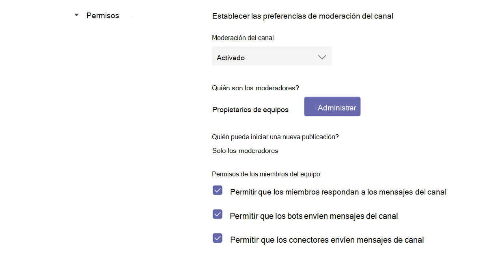

# Navegar Microsoft Teams

Ahora que tiene una clara comprensión de la ruta única y las necesidades de su organización, es el momento de empezar a trabajar en su camino hacia una colaboración eficaz con Microsoft Teams. Use la siguiente sección para obtener información sobre cómo navegar por las capacidades de Kaziala complementadas dentro de Teams.

| Desde Kaizala | Para Teams |
|---------|-----------------------|
| Introducción: inicio de sesión y configuración de perfil| [Introducción a Teams](#getting-started) |
| Iniciar nuevos chats, llamadas de audio y videollamadas de 1:1 | [Chats en Teams, audio y videollamadas](#starting-new-chats-11-audio-and-video-calls) |
| Su Kaizala grupos| [Mover los Kaizala a Teams](#moving-your-kaizala-groups-to-microsoft-teams) |
| Imitar la experiencia de mensajería de aplicaciones para consumidores| [Imitar la experiencia de mensajería de aplicaciones para consumidores](#mimic-the-consumer-app-messaging-experience) |
| Tarjetas de acción de fuera de la caja |  [Realizar el trabajo en Teams](#getting-work-done-in-teams) |
| Sondeos, encuestas, listas de comprobación| [Ejecutar sondeos, encuestas, listas de comprobación en Teams](#polls-surveys-and-checklists-in-teams) |
| Reuniones: tarjeta de acción| [Reunirnos: reuniones en Teams](#getting-work-done-in-teams) |
| Anuncios: tarjeta de acción| [Anuncios en Teams](#announcements-in-teams) |
| Tarjeta de acción de check-ins con fotos| [Check-ins fotográficos en Teams](#photo-check-ins)
| Cuestionario: tarjeta de acción| [Cuestionario en Teams](#quiz-in-teams)
| Aprendizaje: tarjeta de acción| [Aprendizaje en Teams](#training-in-teams) |
| Las tarjetas de acciones personalizadas | [Soluciones personalizadas en Teams](#moving-kaizala-custom-solutions-to-microsoft-teams) |
| Kaizala de administración de aplicaciones| [Para profesionales de TI](#it-professionals) |
| | [Para usuarios finales](#end-user-guidance) |
| Kaizala de grupo| [Kaizala de grupo](#kaizala-group-dissolution) |
| Kaizala datos de inquilino| [Exportar Kaizala inquilino](#export-kaizala-tenant-data)  |
| Colaborar con usuarios externos (proveedores/partners)| [Usar Teams para el trabajo y Teams para la interoperabilidad de uso personal](#collaborating-with-external-usersvendorssupplierspartners) |

## Introducción

Empezar a moverse de Kaizala a Teams es más fácil que nunca con nuestra guía de introducción. Para obtener más información sobre cómo iniciar Microsoft Teams viaje, consulte Introducción [a Teams](https://support.microsoft.com/office/start-and-pin-chats-a864b052-5e4b-4ccf-b046-2e26f40e21b5?wt.mc_id=otc_microsoft_teams&ui=en-us&rs=en-us&ad=us).

## Iniciar nuevos chats, llamadas de audio y videollamadas de 1:1

Cree chats grupales o de 1:1 para colaborar con un grupo más pequeño o para hablar en privado en Teams. Puede anclar chats y guardar mensajes para un acceso rápido. Para empezar a chatear con nuestro formato de texto enriquecido, emojis y gifs, consulte [Chats en Teams](https://support.microsoft.com/office/start-and-pin-chats-a864b052-5e4b-4ccf-b046-2e26f40e21b5?wt.mc_id=otc_microsoft_teams&ui=en-us&rs=en-us&ad=us).

Comuníquese de forma eficaz iniciando 1:1 o llamadas grupales con cualquier persona de su organización. Con Teams, tiene la flexibilidad de realizar llamadas de audio y vídeo.  Para empezar, consulte [Realizar llamadas](https://www.microsoft.com/videoplayer/embed/RE4rxv0?pid=ocpVideo0-innerdiv-oneplayer&postJsllMsg=true&maskLevel=20&market=en-us).

Puede pasar de Kaizala a Microsoft Teams mediante la creación de Teams, canales y chats grupales en Teams.

Teams es una colección de personas, contenido y herramientas que rodean diferentes proyectos y resultados dentro de una organización.

Teams está hecho de **canales**, que son las conversaciones específicas del tema que tiene con sus compañeros de equipo. Cada canal está dedicado a un tema, departamento o proyecto específicos. Los canales son más valiosos cuando se amplían con aplicaciones. Para obtener más información, vea [Trabajar en canales](https://support.microsoft.com/office/teams-and-channels-df38ae23-8f85-46d3-b071-cb11b9de5499?ui=en-us&rs=en-us&ad=us#ID0EAABAAA=Work_in_channels).

**Los chats grupales** le permiten reunir rápidamente a sus compañeros de trabajo a través de la mensajería instantánea.

### Conversaciones en Teams Chat vs Canal de grupo

|Conversaciones en chat | Conversaciones en canales de grupo |
|---------|---------|
|Para conversaciones ligeras, donde está directamente mensajería destinatarios.   | Para interacciones en las que se tratan varios temas en un espacio abierto.  |
|Los chats privados solo son visibles para los que están en el chat     | Visible para todos los miembros del equipo        |
|Una conversación continua y sin hilos     | Conversaciones estructuradas y en varias enhebradas        |
|Hasta 250 personas     | Hasta 25 000 personas        |
|Elige si quieres compartir el historial de chats con nuevos participantes de chat     | El historial se comparte con todos los nuevos miembros del equipo        |
|Los nuevos destinatarios de chat deben ser agregados por las personas que ya están en el chat     | Los usuarios pueden unirse a un equipo buscándolo. En el Teams privado, el Teams aprueba los nuevos miembros. Los miembros del canal pueden generar código para permitir que los nuevos miembros se unan directamente sin la aprobación del administrador.        |
|En el recurso compartido de pantalla directo, y las llamadas de audio y vídeo. Programación sencilla de Teams reuniones con todos los participantes del chat     | Llamadas de audio y vídeo programadas y en el lugar        |
|Cierta extensibilidad con aplicaciones     | Extensibilidad y personalización completa con aplicaciones        |

Para obtener información general sobre Teams, canales y chats grupales, vea equipos [y canales en Microsoft Teams](teams-channels-overview.md).

## Mover los Kaizala a Microsoft Teams

En Kaizala, los grupos son una colección de personas. Hay tres tipos de estructuras de grupo dentro de Kaizala: grupos planos, grupos de jerarquía y grupos de difusión. A medida que pasa a Microsoft Teams, puede usar Teams, canales y chats grupales para crear estructuras de comunicación similares para su organización.

Use las instrucciones siguientes para obtener instrucciones sobre cómo cambiar de grupos a Teams, canales y chats grupales.

Hay dos formas de mover sus Kaizala planos a Teams:

- Opción 1: Cambiar de un grupo Kaizala plano a un chat grupal en Teams

- Opción 2: Cambiar de un grupo Kaizala plano a un Teams equipo

**Opción 1: Cambiar de un grupo Kaizala plano a un chat grupal en Teams**

Puede crear un chat Teams grupo para mantener conversaciones rápidas y pasajeras con un máximo de 250 participantes. Los chats grupales permiten a los usuarios de su organización tener un lugar central para una conversación abierta en la que cualquier persona pueda agregarse al chat.

1. Inicie y asigne un nombre a un chat grupal.

    

    Todos los usuarios que tienen acceso al chat grupal pueden [enviar mensajes](https://support.microsoft.com/office/send-and-read-messages-in-teams-b29e60ec-76af-4d97-8c3c-a4e36f2b64aa?ui=en-us&rs=en-us&ad=us).

2. Agregue personas a la conversación.

    
    
   Al agregar a alguien a un chat grupal (no uno a uno), puede incluir el historial de **chats** y la duración del **historial que desea** compartir con ellos.

3. Administrar el chat grupal.
  
    
    
   Para ver quién está en un chat grupal, mantenga el puntero sobre el número de participantes en el encabezado del chat para mostrar una lista de los nombres de todos.

**Opción 2: Cambiar de un grupo Kaizala plano a un Teams equipo**
   
Para la comunicación de grupo grande dirigida, puede crear un equipo para un grupo plano. Puede sumar hasta 25 000 miembros para participar en la comunicación estructurada con conversaciones en hilos. Este tipo de comunicación permite la moderación y los roles de administración para asegurarse de que las cosas se ejecutan sin problemas.

1. Crear un equipo: para empezar a funcionar en Teams, debe crear un equipo, agregar personas y agregar canales. Para obtener más información, vea [los primeros equipos](get-started-with-teams-create-your-first-teams-and-channels.md).
2. Revise la guía para los propietarios de equipos:

Como propietario [del](https://support.microsoft.com/office/go-to-guide-for-team-owners-92d238e6-0ae2-447e-af90-40b1052c4547?ui=en-us&rs=en-us&ad=us) equipo, puede agregar nuevos miembros e invitados, cambiar los miembros a propietarios, administrar canales y configuraciones y archivar un equipo que ya no está en uso.

3. Agregar miembros en masa a un equipo:

    Si es propietario de un equipo, vaya al nombre del equipo en la lista de equipos y seleccione el  botón Más opciones > agregar **miembro**.

    

    Puede empezar a escribir una lista de distribución, un grupo de seguridad o Microsoft 365 grupo para agregarlo al equipo. Para obtener más información, vea [Agregar miembros a un equipo en Teams](https://support.microsoft.com/office/add-members-to-a-team-in-teams-aff2249d-b456-4bc3-81e7-52327b6b38e9?ui=en-us&rs=en-us&ad=us).

### Imitar la experiencia de mensajería de aplicaciones para consumidores

Si prefiere una experiencia simplificada para los usuarios, puede configurar la experiencia de Teams de su organización para imitar las herramientas de consumidor que ya usan los usuarios.

Se recomienda iniciar el Teams para los usuarios de Kaizala con Mostrar canales favoritos en **chat** habilitado para comunicaciones simplificadas y turnos (opcional).

Este es un ejemplo de la interfaz del equipo con **Turnos**:

Este es un ejemplo de la interfaz de Equipo **sin turnos**:

 

> [!NOTE]
> Puede quitar el acceso al botón Teams para crear una interfaz simplificada para los trabajadores de Frontline con solo canales resaltados que se muestran encima de los chats. Para obtener más información, vea [Administrar directivas de mensajería en Teams](messaging-policies-in-teams.md).

### Usar Teams y canales para crear una estructura jerárquica de grupos

En Kaizala, los grupos jerárquicos permiten a su organización interactuar en diferentes estructuras de grupo según el tipo de comunicación entre los miembros.  En Teams, puede crear Teams y canales para que coincidan con su organigrama y configurar la comunicación basada en jerarquías. Puede usar una estructura jerárquica dentro de Teams alertar a los miembros de las acciones necesarias, noticias importantes y actualizaciones.

Para obtener más información, consulte nuestros [procedimientos recomendados para organizar equipos en Microsoft Teams](best-practices-organizing.md).

### Usar Teams y canales para difundir noticias importantes

En un Kaizala de difusión, los administradores pueden enviar mensajes y acciones a un grupo dirigido. De forma similar, puede publicar en varios canales para difundir un mensaje en Teams. Para dirigir la atención a un mensaje importante, cree publicaciones de Anuncios.

La moderación del canal le permite controlar quién puede publicar y responder a los mensajes. Los canales se pueden elegir entre los equipos para que la emisora llegue a una audiencia más grande. Puede restringir las interacciones en anuncios que solo permiten seleccionar administradores y moderadores con la capacidad de responder. Siga estos pasos para establecer la moderación del canal dentro de un Teams canal.

**Paso 1**: Configurar moderación del canal.

- Seleccionar un canal para las transmisiones

- Seleccione **Configuración del canal** para configurar la moderación

- Vaya a "Quién son los moderadores?" para seleccionar manualmente moderadores para el canal

**Paso 2**: Dar formato al mensaje.
Cree un anuncio para notificar a los miembros del equipo de noticias o acciones importantes.

   

- En el canal, seleccione Formato debajo del cuadro donde escriba el mensaje.

- En la parte superior del cuadro que aparece, seleccione la flecha situada junto a Nueva conversación > Anuncio.

- Escriba un título, cambie el color de fondo o agregue una imagen de fondo para el área del título.

- Escriba el asunto del anuncio en el área Agregar un subpartida, después el cuerpo del mensaje y seleccione el botón Enviar.
    

**Paso 3**: Seleccionar canales para difusión de mensajes.

Puede publicar entre varios Teams y canales cuando tiene anuncios importantes e información que necesitan llegar a grandes grupos de personas.

  

Para obtener más información, [vea Publicar una conversación de canal en Teams](https://support.microsoft.com/office/cross-post-a-channel-conversation-in-teams-9c1252a3-67ef-498e-a7c1-dd7147b3d295?ui=en-us&rs=en-us&ad=us).

## Realizar el trabajo en Teams

Cuando se trata de realizar el trabajo, las herramientas adecuadas pueden permitir la eficiencia. En Kaizala, puede usar tarjetas de acción de fuera de la caja [(OOB)](/kaizala/partnerdocs/kaizalaactioncards) para que la administración diaria del trabajo sea más fácil y eficiente.
Microsoft Teams ofrece varias funcionalidades y soluciones para tarjetas de acción integradas en Kaizala.

La Teams permite usar herramientas de organización existentes mediante la integración en Microsoft Teams junto con aplicaciones de Microsoft 365 y aplicaciones de terceros listas para usar. Hay más de 300 aplicaciones externas disponibles ahora en Microsoft Teams.

### Sondeos, encuestas y listas de comprobación en Teams

[Los sondeos](https://github.com/OfficeDev/microsoft-teams-apps-poll/wiki), [las encuestas](https://github.com/OfficeDev/microsoft-teams-apps-survey) [y las](https://github.com/OfficeDev/microsoft-teams-app-checklist) tarjetas de acción de lista de comprobación ahora  están disponibles como plantillas de aplicaciones de extensión de mensajes listas Teams para instalar en GitHub.

**Sondeo** permite a los usuarios crear y enviar sondeos rápidamente en un chat o un canal para conocer la opinión de su equipo. La aplicación Sondeo es compatible en todas las plataformas: Teams escritorio, explorador, iOS y clientes Android. Está listo para su implementación como parte de su suscripción de Microsoft 365 existente

**Encuesta** permite a los usuarios crear una encuesta en un chat o un canal para hacer una serie de preguntas y obtener información útil. Usar encuesta para: registros, inscripciones, comentarios, testimonios, captura de clientes potenciales, informes, quejas y evaluaciones. La aplicación encuesta es compatible en todas las plataformas: Teams de escritorio, explorador, iOS y clientes Android. Está listo para su implementación como parte de su suscripción de Microsoft 365 existente.

**La** lista de comprobación le permite colaborar con su equipo creando una lista de comprobación compartida en un chat o canal. La aplicación Lista de comprobación es compatible en todas las plataformas: Teams de escritorio, explorador, iOS y clientes Android. Está listo para su implementación como parte de su suscripción de Microsoft 365 existente.

También puede enviar sondeos rápidos, encuestas y listas de comprobación a su equipo al instante con aplicaciones Microsoft 365 y de terceros.

[Microsoft Forms](https://techcommunity.microsoft.com/t5/microsoft-forms-blog/microsoft-forms-works-great-with-microsoft-teams/ba-p/109915) le permite recopilar información y tomar decisiones rápidamente. Con Forms integrado en Teams, puede configurar fácilmente una pestaña Formularios, crear notificaciones para el formulario y realizar un sondeo rápido. Para averiguar cómo hacerlo, vea [Crear, editar y revisar formularios en Microsoft Teams](https://support.microsoft.com/office/work-with-colleagues-to-create-edit-and-review-forms-in-microsoft-teams-333b97a3-41d9-48bc-a1cb-84a96bd44e14#:~:text=1%20In%20Teams%2C%20go%20to%20the%20channel%20you,name%20for%20your%20new%20form.%20More%20items...%20).

Las aplicaciones de terceros como Polly y SurveyMonkey le permiten realizar sondeos y encuestas con sus Teams.

- **Polly le**  permite obtener información de sondeos en tiempo real para tomar mejores decisiones empresariales y medir la participación del equipo en los sondeos a través de vistas completas del panel.

- **SurveyMonkey** lleva encuestas a lugares donde ya está haciendo negocios en Microsoft Teams, lo que facilita la adición de encuestas a su flujo de trabajo diario. Escriba y envíe un sondeo rápido de una pregunta desde el Microsoft Teams y, a continuación, observe cómo llegan los resultados de sus compañeros de equipo.

### Trabajos en Teams

Use **[Microsoft Planner](https://support.microsoft.com/office/organize-your-team-s-tasks-in-microsoft-planner-c931a8a8-0cbb-4410-b66e-ae13233135fb?ui=en-us&rs=en-us&ad=us)** para ejecutar trabajos en Teams. Puede colaborar en un proyecto con un equipo, ver informes de progreso y realizar un seguimiento de tareas individuales.

Mientras usa Microsoft Teams, puede organizar las tareas agregando una o más pestañas de Planner a un canal de grupo. A continuación, puede trabajar en su plan desde Teams o en Planner para web, quitar o eliminar el plan y recibir notificaciones en Teams cuando se le asigne una tarea en Planner.

### Anuncios en Teams

Cree y envíe mensajes destinados a varios equipos o a un gran número de empleados a través del chat con la [aplicación comunicador de la](/microsoftteams/platform/samples/app-templates#company-communicator) empresa. Su interfaz sencilla permite a los usuarios designados crear, obtener una vista previa, colaborar y enviar mensajes de forma dirigida. Cree capacidades de comunicación personalizadas dirigidas, como datos personales personalizados, sobre cuántos usuarios han reconocido o interactuado con un mensaje con información directamente vinculada a decisiones de administración.

### Photo Check-ins

Use la Teams Smart Camera para capturar y compartir una imagen anotada con su equipo. Comparta fácilmente su ubicación con precisión para mantener al equipo al tanto. Necesita tener más información para comunicar cómo se asignan las Kaizala características a Teams. Definitivamente, tenemos tanta información desde el panel de diapositivas como podemos en el documento.

[Use la plantilla de la aplicación Descuido](/microsoftteams/platform/samples/app-templates#staff-check-ins) de personal para permitir que el personal de primera línea proporcione fácilmente información crítica y actualizaciones de estado, ya sea de forma programada o ad hoc directamente desde Teams. La aplicación admite la ubicación en tiempo real, fotos, notas, notificaciones de avisos y flujos de trabajo automatizados.

### Cuestionario en Teams

Cuestionario es una extensión de [Teams](/microsoftteams/platform/messaging-extensions/what-are-messaging-extensions) de mensajería personalizada que le permite crear un cuestionario dentro de un chat o un canal para comprobar el conocimiento y obtener resultados instantáneos. Puede usar Cuestionario para, exámenes en clase y sin conexión, comprobación de conocimientos dentro del equipo y para cuestionarios divertidos dentro de un equipo. La aplicación cuestionario es compatible en varias plataformas, como Teams de escritorio, explorador, iOS y clientes Android. Esta aplicación está lista para su implementación como parte de su suscripción Microsoft 365 existente.

[Obtenerlo en GitHub](https://github.com/OfficeDev/microsoft-teams-apps-quiz)

  

### Aprendizaje en Teams

[Use la plantilla de](/microsoftteams/platform/samples/app-templates#staff-check-ins) aplicación Desfilaciones de docentes para permitir que el personal de primera línea proporcione fácilmente información crítica y actualizaciones de estado, ya sea de forma programada o ad hoc directamente desde Teams. La aplicación admite la ubicación en tiempo real, fotos, notas, notificaciones de avisos y flujos de trabajo automatizados.

Use Teams para facilitar el aprendizaje de su organización. El aprendizaje es [una aplicación Teams](/microsoftteams/platform/what-are-messaging-extensions) de mensajería personalizada que permite a los usuarios publicar un aprendizaje dentro de un chat o un canal para compartir y mejorar el conocimiento sin conexión. La aplicación es compatible con varios Teams de la plataforma, como escritorio, explorador, iOS y Android. Esta aplicación está lista para su implementación como parte de Microsoft 365 suscripción.

[Obtenerlo en GitHub](https://github.com/OfficeDev/microsoft-teams-apps-training)

Puede simplificar la incorporación ofreciendo acceso a información contextual.  Haga guías de empleados, formación y más fácilmente disponibles y actualizados para dar más poder a su organización a través de las aptitudes. Para obtener más información sobre los escenarios de aprendizaje, vea [Incorporar nuevos empleados](https://support.microsoft.com/office/effectively-onboard-new-employees-691faccd-1d1a-4f47-99ac-b6c82973f5ee).

## Mover Kaizala soluciones personalizadas a Microsoft Teams

Siga este enfoque de tres pasos para obtener las soluciones para Microsoft Teams:

1. Considere la frecuencia y el uso de soluciones.

    El uso alto y la frecuencia de las soluciones merecen un caso más sólido para el desarrollo personalizado.

2. Considere la complejidad de la solución.

    Las soluciones con mayor complejidad pueden justificar un caso más sólido para el desarrollo personalizado.

3. Explore los siguientes enfoques por frecuencia y complejidad de uso.

    - Explorar soluciones alternativas con [funcionalidades Microsoft Teams nativas](/microsoftteams/platform/concepts/capabilities-overview)

    - Usar [integraciones de aplicaciones 3P](deploy-apps-microsoft-teams-landing-page.md)

    - Descubrir [plantillas de aplicaciones](/microsoftteams/platform/samples/app-templates)

    - Crear [desarrollo de soluciones personalizadas](/microsoftteams/platform/overview)

## Administración en Microsoft Teams

### Profesionales de IT

Realice la transición administrativa desde el portal Kaizala administración al Centro Microsoft Teams administración. El Teams de administración es principalmente solo para el uso de roles de administrador.

Los administradores pueden administrar toda la carga de Teams de trabajo o pueden tener permisos delegados para solucionar problemas de calidad de llamadas o administrar las necesidades de telefonía de su organización.

Para navegar por el centro de administración, visite [Microsoft Teams centro de administración](https://admin.teams.microsoft.com/).

Puede supervisar la seguridad y el cumplimiento de su organización en Microsoft 365 con el Centro de cumplimiento Microsoft 365 y [el Centro de seguridad](/microsoft-365/security/defender/overview-security-center). 

Proteja su empresa y capacite a los usuarios en el centro de administración de [Azure Active Directory](https://aad.portal.azure.com/#@microsoft.onmicrosoft.com/dashboard/private/c7736064-7b28-4f3d-b366-2740a8d48020), donde puede revisar grupos, identidades, licencias y acceso en Microsoft 365.

## Portal de administración de Kaizala a Teams de administración

### Instrucciones para el usuario final

Use la tabla siguiente para navegar por las capacidades correspondientes en Microsoft Teams desde el portal de Kaizala administración.

| Portal de administración de Kaizala | Microsoft Teams app|
|---------|-----------------------|
| Crear grupos (conectado a la organización) | **Crear equipos a** través de la aplicación móvil o de escritorio |
| Agregar usuarios en masa | Para agregar usuarios en masa al equipo: considere la posibilidad de crear un equipo a través de grupos de O365, direcciones URL de O365 o grupo de seguridad |
| Directorio | Busque a cualquier persona de su organización a través de la **barra de búsqueda** de teams. Los resultados de la búsqueda también devolverán archivos, mensajes y publicaciones |
| Análisis (tarjetas de acción) | **Los sondeos****, las encuestas y** las listas de comprobación **están integrados en informes con datos descargables. Los trabajos también se pueden asignar con la ayuda de PlannerTasksin****. Otras aplicaciones de terceros** **comoTrello,Wrike**** también se pueden usar con facilidad en Microsoft Teams |
| Extensiones: conectores | Use la **opción Conectores** del menú (...) para cualquier canal para el que sea necesario el conector. |
| Informe de adopción de análisis (uso), informe de uso, informe de actividad | Los propietarios de equipos pueden acceder a informes de sus equipos navegando desde el menú (...) para administrar **los** **teamanalytics** > . |

> [!NOTE]
> Teams usuarios finales pueden usar Teams escritorio o móvil para administrar sus equipos y canales individuales y no tendrán que acceder al centro de administración Teams usuario.

## Kaizala de grupo

A medida que realiza la transición Teams canales y chats, puede considerar la posibilidad Kaizala disolución de grupo para asegurarse de que su organización tiene un lugar central para la comunicación. Al eliminar un Kaizala de chats, se quita el grupo de la lista Chats. Si es el único administrador del grupo, tendrá que asignar el rol de administrador a al menos una persona del grupo antes de eliminarla.

### Para mover un grupo Kaizala a Teams

 1. Compartir el Teams con Kaizala miembros del grupo

 2. Configurar Teams sitios

 3. Agregar usuarios a Teams

 4. Anunciar el cambio a todos los miembros Kaizala grupo

 5. En la configuración, [cambie Kaizala grupo](#to-switch-to-kaizala-group-to-read-only) a **Solo lectura**

 6. Compartir las razones de por qué Teams es una mejor opción con Kaizala miembros del grupo

 7. Comparta las directrices, por ejemplo, desde Teams estará disponible y cómo usar Teams

 8. Iniciar concursos de participación

 9. Configurar la participación del liderazgo

 10. Buscar comentarios de los miembros

 11. Seguir el calendario de contenido

 12. [Eliminar Kaizala grupo](#to-delete-a-group)

### Para cambiar a Kaizala grupo a **Solo lectura**

1. Inicie sesión en Kaizala de administración.

2. Seleccione **la pestaña** Grupos en el panel de navegación izquierdo y seleccione el grupo que desea establecer como **Solo lectura**.

    

3. En la lista desplegable, seleccione **Editar directivas**.
  
    

4. En **la ventana Directiva** de grupo, desactive las siguientes opciones:

     - Permitir que los nuevos participantes vean el historial de chats. Los mensajes enviados a partir de ahora serán visibles para ellos.

     - Permitir que los miembros envíen mensajes y datos adjuntos.

       

     > [!NOTE]
     > Los administradores aún pueden publicar en el grupo.

### Para eliminar un grupo

1. En la lista Chats, mantenga presionada la conversación grupal.

2. Pulse Eliminar grupo.

## Exportar Kaizala inquilino

Como administrador Kaizala inquilino o administrador global, puede exportar Kaizala de inquilino desde el Kaizala de administración. Mientras usa Teams, puede mantener el control de los datos corporativos en Kaizala. Para obtener más información, vea [Exportar datos de inquilino desde el portal de administración](/office365/kaizala/export-or-delete-your-data).

### Para exportar datos

 1. Seleccione **la pestaña Análisis** en el panel de navegación izquierdo y elija **Exportar datos de inquilino**.
  
    

 2. Seleccione **Exportar**.

    

 3. Use el archivo Mensajes de inquilino: con filtros en nombre de grupo o marca de tiempo para obtener acceso a los datos de chat de nivel de grupo.

    

## Eliminar un grupo Kaizala grupo

Al eliminar un Kaizala de chats, se quita el grupo de la lista Chats. Si es el único administrador del grupo, tendrá que asignar el rol de administrador a al menos una persona del grupo antes de eliminarla.

Para eliminar un grupo:

- En la lista Chats, mantenga presionada la conversación grupal.

- Pulse Eliminar grupo.

## Kaizala datos de inquilino

Mientras usa Teams, puede mantener el control de los datos corporativos en Kaizala. Para obtener más información, vea [Exportar datos de inquilino desde el portal de administración](/office365/kaizala/export-or-delete-your-data).

## Colaboración con usuarios externos(proveedores/proveedores/partners)

Colaborar con proveedores, proveedores, partners y otros usuarios externos es más fácil que nunca en Microsoft Teams. Con Teams, los usuarios pueden agregar usuarios externos con números de teléfono. Esto es compatible con Microsoft Teams Conectar. Los usuarios de la organización pueden comunicarse con usuarios externos mediante Teams para el trabajo y Teams la interoperabilidad de cuentas personales. La colaboración de usuarios externos en Teams también se puede hacer con el acceso de invitado mediante un correo electrónico personal o oficial. La publicación cruzada de anuncios entre equipos y canales es compatible con Teams. Por ejemplo: Sus proveedores y proveedores podrían enviar anuncios entre sí por separado Teams canales o equipos. Visita [Enviar un anuncio a un canal](https://support.microsoft.com/office/send-an-announcement-to-a-channel-8f244ea6-235a-4dcc-9143-9c5b801b4992) para obtener más información sobre lo que se admite en Teams.

## ¿Qué es Access externo en Teams?

El acceso externo facilita que los usuarios externos de Teams de todo un dominio puedan hacer búsquedas, llamar, chatear y organizar reuniones con usted en Teams. Para obtener más información sobre cómo administrar el acceso externo, visite [Administrar acceso externo](/microsoftteams/manage-external-access).

## ¿Qué es El acceso de invitado en Teams?

Con [el acceso de](/MicrosoftTeams/guest-access) invitado, puede proporcionar acceso a equipos, documentos en canales, recursos, chats y aplicaciones a personas ajenas a su organización, manteniendo el control sobre los datos corporativos. No se requiere ninguna licencia adicional para agregar invitados en Teams.

## Quién Puede ser invitado en Teams?

Un invitado es alguien que no es un empleado o miembro de su organización. No tienen una cuenta de trabajo con su organización. Por ejemplo, los invitados pueden incluir socios, proveedores o consultores.
Cualquier persona que no forma parte de su organización puede [agregarse como invitado en Teams](/MicrosoftTeams/guest-access#how-a-guest-becomes-a-member-of-a-team). Esto significa que cualquier persona con una cuenta de empresa (es decir, una cuenta de Azure Active Directory) o una cuenta de correo electrónico de consumidor (por ejemplo, outlook.com, gmail.com, así sucesivamente) puede participar como invitado en Teams con acceso a equipos y experiencias de canal.

## Pasos siguientes

[Microsoft Teams para los trabajadores de Frontline](/MicrosoftTeams/drive-adoption-optimize-kaizala)
