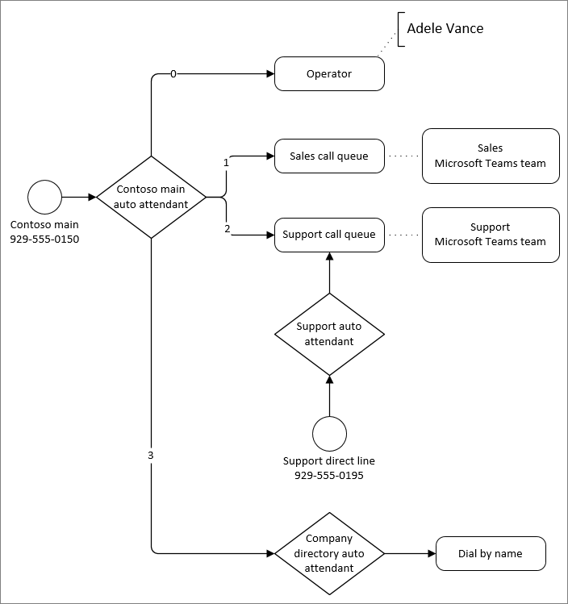

# Planear el flujo de enrutamiento de llamadas

Como parte del proceso de planeación, le recomendamos que solucione el enrutamiento de llamadas de su organización en un diagrama. El diagrama ayuda a determinar el enrutamiento más eficaz para las personas que llaman a su organización. También puede usar el diagrama para determinar los operadores automáticos y colas de llamadas que necesita crear, junto con requisitos relacionados como números de servicio, licencias y cuentas de recursos.

Veamos cómo los operadores automáticos y las colas de llamadas enrutan las llamadas.

Los operadores automáticos enrutan todas las llamadas de una de las siguientes maneras:

- **Redirigir inmediatamente** : las llamadas se pueden redirigir a uno de los destinos de enrutamiento de llamadas (enumerados a continuación) inmediatamente después de responder o después de un saludo inicial.
- **Redirigir según las opciones de marcado** : se puede dirigir a los autores de llamadas para que elijan entre las opciones asignadas a los números del teclado del teléfono, 0-9. Se puede asignar a cada tecla de marcado un destino de enrutamiento de llamadas.
- **Marcar a personas por nombre o extensión** : se puede dirigir a los autores de llamadas que marquen el número de extensión de la persona con la que intentan ponerse en contacto en el directorio de su organización o deletreando el nombre de la persona.
- **Desconectar:** un operador automático puede colgar la llamada.

> [!NOTE]
> Un único operador automático solo puede admitir un único método de marcado por.  Para permitir que los autores de llamadas marquen por nombre y por número, deberá crear un operador automático que tenga una opción para marcar por nombre y otro para marcar por extensión.  Cada una de estas opciones redirigirá a operadores automáticos separados configurados para estos escenarios de "marcado por".

Cuando un operador automático o una cola de llamadas redirigen las llamadas, puede elegir entre los siguientes destinos de enrutamiento de llamadas:

- **Persona de la organización** : una persona de la organización que puede recibir llamadas de voz. Puede ser un usuario en línea o un usuario hospedado localmente mediante Skype Empresarial Server.
- **Aplicación de voz** : otro operador automático o una cola de llamadas. Elija la cuenta de recursos asociada con el destino.
- **Número de teléfono externo** : cualquier número de teléfono. Consulta [los detalles técnicos de las transferencias externas](create-a-phone-system-auto-attendant.md?tabs=additional-resources).

- **Correo de voz** : el buzón de voz asociado a un grupo de Microsoft 365 que especifique. Puede elegir si quiere las transcripciones del correo de voz y "Deje un mensaje después del tono". símbolo del sistema.
- **Operador** (solo operador automático): el operador definido para el operador automático. Definir un operador es opcional. Un operador puede ser cualquiera de los otros destinos de esta lista.

Los operadores automáticos ofrecen opciones de enrutamiento de llamadas independientes para las llamadas recibidas fuera del horario laboral y los días festivos.

Las colas de llamadas ponen al autor de la llamada en espera hasta que un agente asignado a la cola esté disponible para realizar la llamada. Hay dos situaciones en las que el autor de la llamada podría salir de la cola:

- **Desbordamiento de llamadas** : si el número de llamadas en la cola supera el límite que estableció, los nuevos autores de llamadas se redirigirán fuera de la cola.
- **Tiempo de espera de llamada** : si el autor de la llamada ha estado en la cola más tiempo que el ajuste de tiempo de espera configurado, se redirige fuera de la cola.

Las llamadas redirigidos fuera de una cola se pueden enviar a cualquiera de los destinos de enrutamiento de llamadas enumerados anteriormente, excepto a un operador. (Las colas de llamadas no tienen operadores, pero puede redirigir a los autores de llamadas al mismo destino que un operador que haya configurado para un operador automático).

El ejemplo siguiente muestra un ejemplo de enrutamiento de llamadas con operadores automáticos y colas de llamadas.

En el ejemplo anterior:

- La tecla cero (0) redirige a los autores de llamadas a un operador. El operador de ese operador automático se ha configurado como **persona de la organización**.
- La clave uno (1) redirige a los autores de llamadas a la cola de llamadas de ventas. Esta cola de llamadas está conectada a un equipo que contiene el equipo de ventas asignado a la cola.
- La tecla dos (2) redirige a los autores de llamadas a la cola de llamadas de soporte técnico. Esta cola de llamadas está conectada a un equipo que contiene el equipo de soporte técnico asignado al equipo.
- La cola de llamadas de soporte técnico tiene un número de teléfono directo a través de un operador automático intermedio. El hecho de que un operador automático responda a la línea de soporte técnico permite el enrutamiento de llamadas por separado y de días festivos.
- La tecla tres (3) redirige a los usuarios a otro operador automático para el directorio de la compañía. El operador automático del directorio de la empresa permite a los autores de llamadas llamar a personas de la organización marcando su nombre o extensión.

Le recomendamos que cree uno o más diagramas similares al anterior para asignar el enrutamiento de llamadas. Asegúrese de incluir lo siguiente en el diagrama o en la documentación correspondiente:

- ¿Qué operadores automáticos tendrán acceso directo a través de números de teléfono?
- ¿Cuáles son los requisitos de enrutamiento de días no horarios y días festivos para cada operador automático?
- La pertenencia a cada cola de llamadas. (Puede agregar usuarios individualmente o asignar la cola a diferentes tipos de grupos. Asignar una cola a un equipo proporciona la experiencia más versátil).

Estos son algunos procedimientos recomendados de enrutamiento de llamadas:

- Examine su sistema de llamadas existente y analice los tipos y la frecuencia de las llamadas entrantes. Use esta información para informar a su operador automático y la estructura de la cola de llamadas.
- Coloque las opciones más comunes más pronto en el menú para enrutar las llamadas lo más rápido posible.
- Evite conectar los números de servicio directamente a las colas de llamadas, a menos que las colas estén disponibles las 24 horas del día, 7 horas. Las colas de llamadas no permiten una administración de llamadas independiente en horarios no laborables ni festivos. Si desea tener una cola con un número directo, asigne el número a un operador automático que redirija automáticamente a la cola durante el horario laboral.
- Si recibe numerosas llamadas que solicitan información básica sobre su empresa, como el horario laboral, la ubicación o la dirección del sitio web, considere la posibilidad de crear un operador automático para responder a estas preguntas con mensajes grabados.
- Mantenga la lista de elementos de menú en cinco o menos. Los autores de llamadas pueden tener problemas para recordar más de cinco opciones. Use operadores automáticos anidados si se necesitan más opciones para redirigir correctamente una llamada.
- Describa primero el servicio, seguido de la opción de presionar (p. ej.: para Ventas presione 1) en lugar de al revés (por ejemplo. Presione 1 para Ventas).
- Terminología de usuario que comprenderán los autores de llamadas en lugar de lo que puede usar internamente.
- Evite las actualizaciones frecuentes para el enrutamiento de llamadas. Si cambia las opciones de menú para un operador automático en el futuro, llámalo en las indicaciones de voz durante los primeros 30 días.
